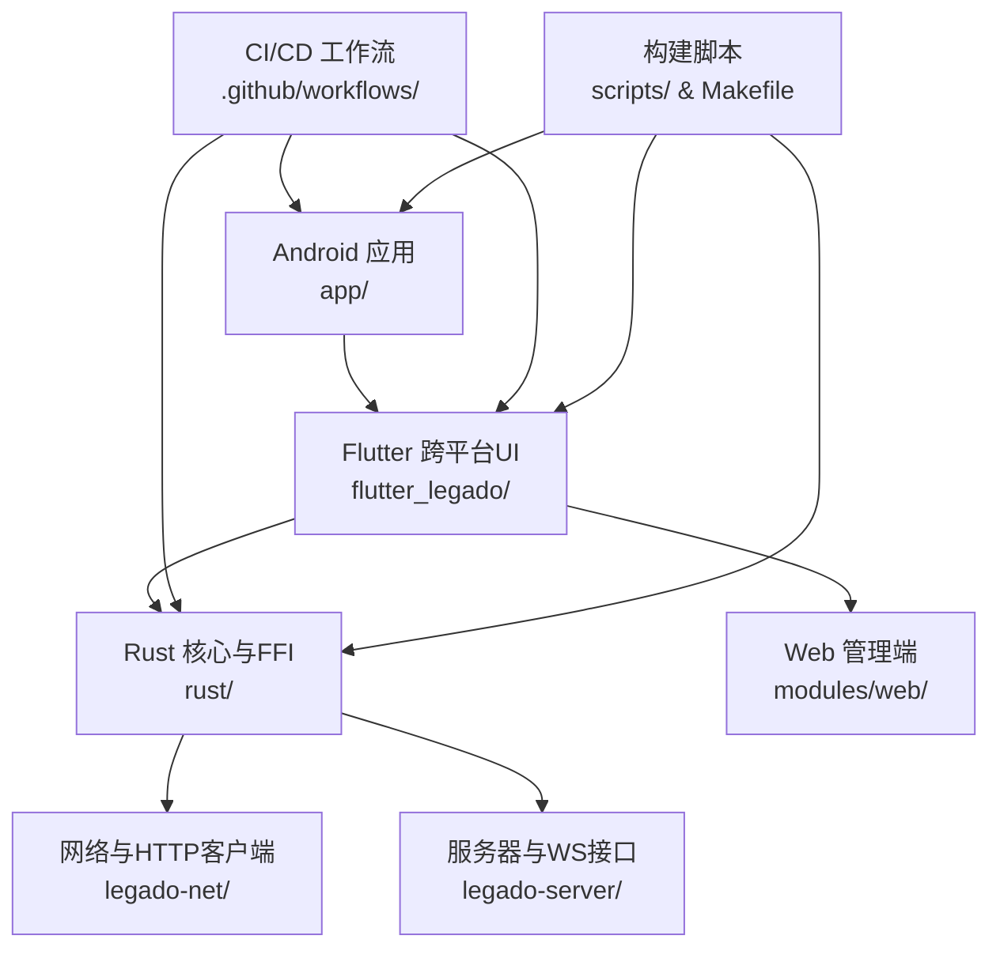
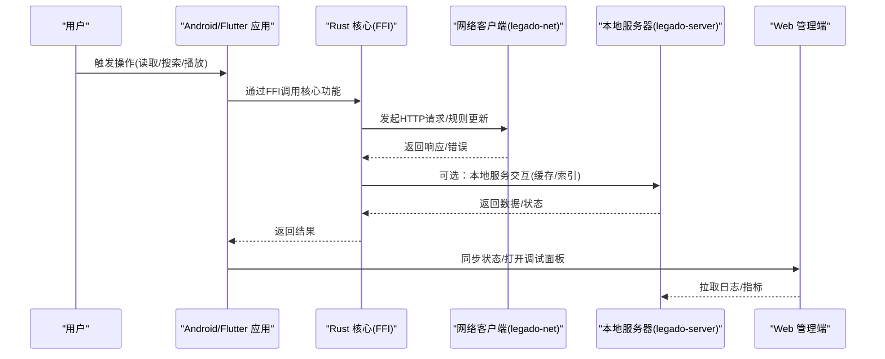
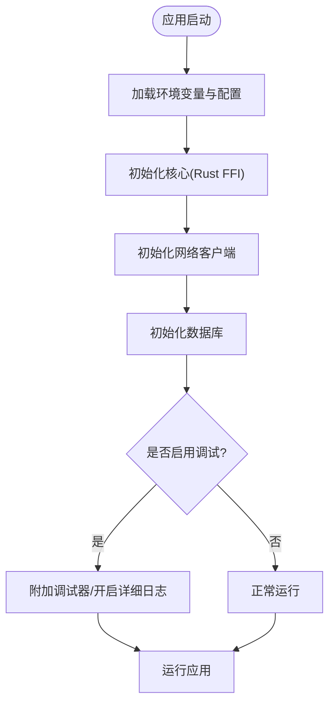
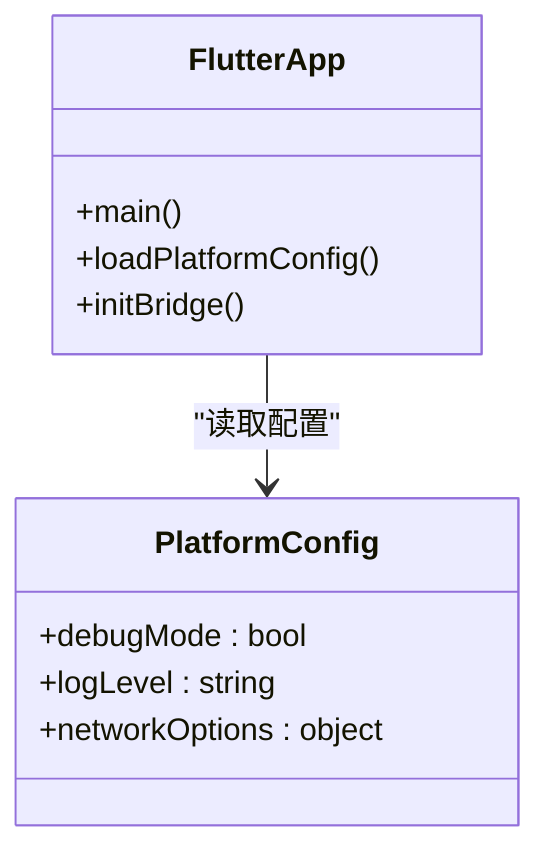
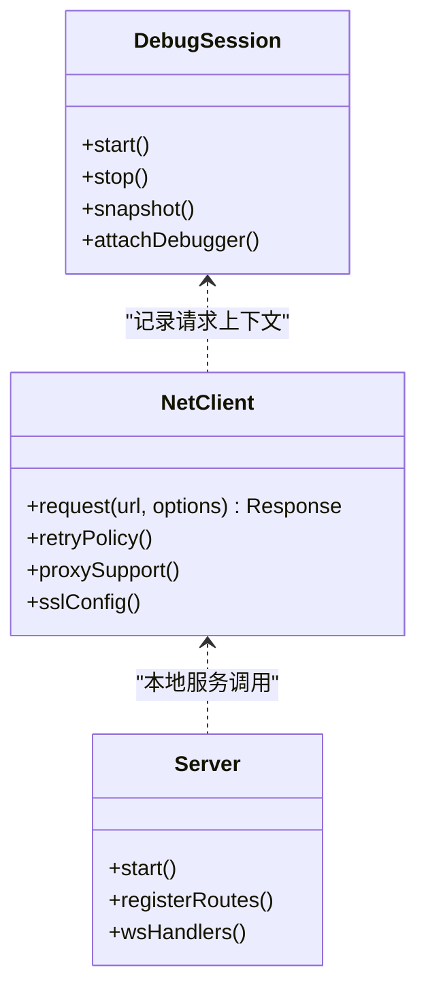
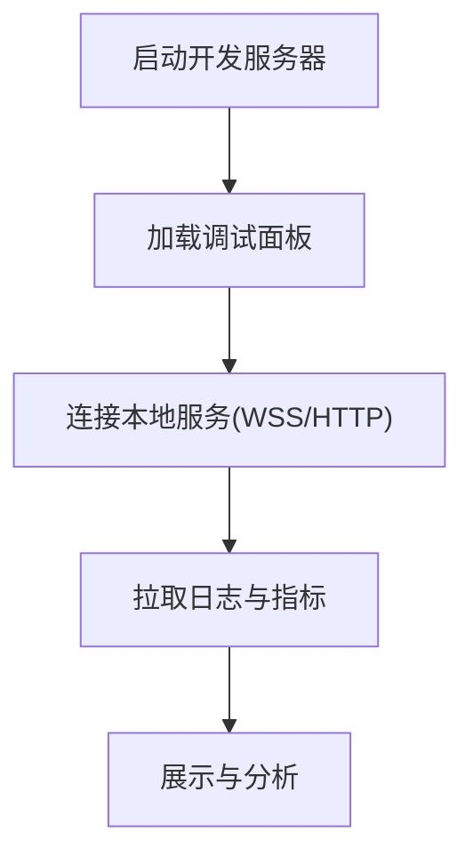
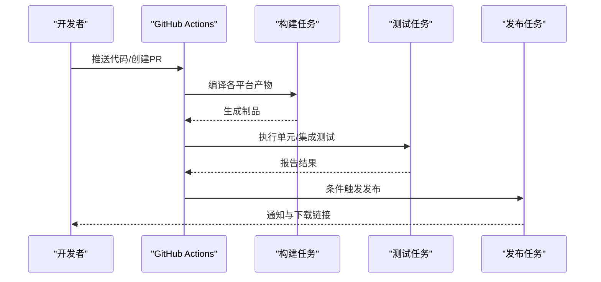
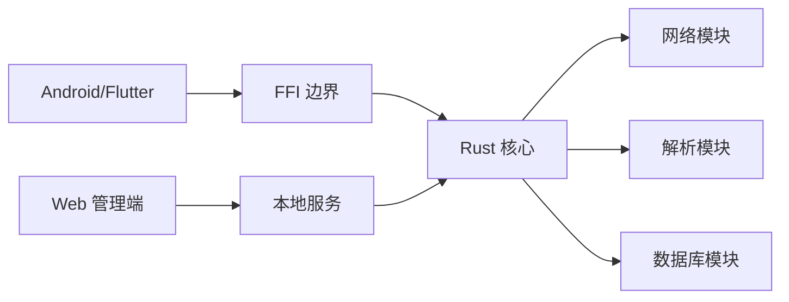

# 跨平台调试策略

<cite>
**本文引用的文件**   
- [README.md](file://README.md)
- [Makefile](file://Makefile)
- [.github/workflows/release.yml](file://.github/workflows/release.yml)
- [.github/dependabot.yml](file://.github/dependabot.yml)
- [app/build.gradle](file://app/build.gradle)
- [app/src/main/java/io/legado/app/App.kt](file://app/src/main/java/io/legado/app/App.kt)
- [app/src/test/java/io/legado/app/ci/BetaReleaseWorkflowTest.kt](file://app/src/test/java/io/legado/app/ci/BetaReleaseWorkflowTest.kt)
- [flutter_legado/pubspec.yaml](file://flutter_legado/pubspec.yaml)
- [flutter_legado/scripts/build-windows.ps1](file://flutter_legado/scripts/build-windows.ps1)
- [rust/Cargo.toml](file://rust/Cargo.toml)
- [rust/legado-core/src/debug_session.rs](file://rust/legado-core/src/debug_session.rs)
- [rust/legado-net/src/client.rs](file://rust/legado-net/src/client.rs)
- [rust/legado-server/src/server.rs](file://rust/legado-server/src/server.rs)
- [modules/web/package.json](file://modules/web/package.json)
</cite>

## 目录
1. [简介](#简介)
2. [项目结构](#项目结构)
3. [核心组件](#核心组件)
4. [架构总览](#架构总览)
5. [详细组件分析](#详细组件分析)
6. [依赖关系分析](#依赖关系分析)
7. [性能考虑](#性能考虑)
8. [故障排查指南](#故障排查指南)
9. [结论](#结论)
10. [附录](#附录)

## 简介
本指南面向 Legado 跨平台项目的开发者与测试工程师，提供统一的调试策略与实践方法。内容覆盖：
- 多平台（Android、Flutter/Windows/macOS/Linux/iOS、Rust、Web）统一调试流程与环境变量配置
- CI/CD 流水线中的自动化测试、持续集成与发布前验证
- 日志系统的跨平台实现与统一格式、收集与分析
- 性能基准测试与对比分析方法
- 分布式系统（微服务间通信、消息队列、数据库查询优化）的调试技巧
- 跨团队协作的调试规范与最佳实践

## 项目结构
Legado 采用多模块、多语言协作的架构：
- Android 应用层（Kotlin/Gradle）
- Flutter 跨平台 UI（Dart/Flutter）
- Rust 核心库与 FFI（Cargo）
- Web 管理端（Vue/Vite）
- GitHub Actions 工作流与脚本工具

**图示来源** 
- [README.md](file://README.md)
- [Makefile](file://Makefile)
- [.github/workflows/release.yml](file://.github/workflows/release.yml)

**章节来源**
- [README.md](file://README.md)
- [Makefile](file://Makefile)

## 核心组件
- 应用初始化与调试入口
  - Android App 初始化：负责全局配置、日志、网络、数据库等初始化，便于在启动阶段注入调试开关与环境变量。
  - Flutter main：作为跨平台入口，可加载不同平台的调试配置与桥接设置。
- Rust 核心调试会话
  - debug_session：提供调试会话生命周期管理、上下文隔离、断点与状态快照能力，便于跨语言调用链追踪。
- 网络与服务器
  - legado-net：HTTP 客户端、重试、代理、速率限制、SSL 配置等，支持请求级日志与指标上报。
  - legado-server：HTTP/WS 服务端，暴露调试接口与监控端点，便于远程诊断。
- Web 管理端
  - modules/web：前端调试面板、源码编辑、数据查看与日志采集展示。

**章节来源**
- [app/src/main/java/io/legado/app/App.kt](file://app/src/main/java/io/legado/app/App.kt)
- [flutter_legado/pubspec.yaml](file://flutter_legado/pubspec.yaml)
- [rust/legado-core/src/debug_session.rs](file://rust/legado-core/src/debug_session.rs)
- [rust/legado-net/src/client.rs](file://rust/legado-net/src/client.rs)
- [rust/legado-server/src/server.rs](file://rust/legado-server/src/server.rs)
- [modules/web/package.json](file://modules/web/package.json)

## 架构总览
下图展示了从 Android/Flutter 到 Rust 核心、再到网络与服务端的整体调用链路，以及 Web 管理端的交互路径。

**图示来源** 
- [rust/legado-net/src/client.rs](file://rust/legado-net/src/client.rs)
- [rust/legado-server/src/server.rs](file://rust/legado-server/src/server.rs)
- [rust/legado-core/src/debug_session.rs](file://rust/legado-core/src/debug_session.rs)

## 详细组件分析

### Android 应用调试与环境变量
- 启动时加载环境变量与调试开关，控制日志级别、网络行为、数据库模式等。
- 使用 Gradle 构建变体区分 Debug/Release，便于在不同环境中启用不同的调试特性。
- 单元测试与仪器测试覆盖关键路径，确保回归稳定性。

**图示来源** 
- [app/build.gradle](file://app/build.gradle)
- [app/src/main/java/io/legado/app/App.kt](file://app/src/main/java/io/legado/app/App.kt)

**章节来源**
- [app/build.gradle](file://app/build.gradle)
- [app/src/main/java/io/legado/app/App.kt](file://app/src/main/java/io/legado/app/App.kt)

### Flutter 跨平台调试
- 通过 pubspec.yaml 管理依赖与构建配置，支持多平台目标（Windows、macOS、Linux、iOS、Android）。
- 使用脚本进行平台特定构建与打包，便于在 CI 中执行。

**图示来源** 
- [flutter_legado/pubspec.yaml](file://flutter_legado/pubspec.yaml)
- [flutter_legado/scripts/build-windows.ps1](file://flutter_legado/scripts/build-windows.ps1)

**章节来源**
- [flutter_legado/pubspec.yaml](file://flutter_legado/pubspec.yaml)
- [flutter_legado/scripts/build-windows.ps1](file://flutter_legado/scripts/build-windows.ps1)

### Rust 核心调试会话与网络
- debug_session 提供会话级上下文、断点、快照与指标收集，适合复杂业务逻辑的逐步调试。
- legado-net 封装 HTTP 客户端，支持重试、代理、SSL、速率限制，并输出结构化日志。
- legado-server 提供本地服务与 WS 接口，便于远程调试与实时监控。

**图示来源** 
- [rust/legado-core/src/debug_session.rs](file://rust/legado-core/src/debug_session.rs)
- [rust/legado-net/src/client.rs](file://rust/legado-net/src/client.rs)
- [rust/legado-server/src/server.rs](file://rust/legado-server/src/server.rs)

**章节来源**
- [rust/legado-core/src/debug_session.rs](file://rust/legado-core/src/debug_session.rs)
- [rust/legado-net/src/client.rs](file://rust/legado-net/src/client.rs)
- [rust/legado-server/src/server.rs](file://rust/legado-server/src/server.rs)

### Web 管理端与调试面板
- modules/web 提供前端调试面板，用于查看日志、指标与数据模型，辅助定位问题。
- 通过 Vite 构建与开发服务器，支持热重载与快速迭代。

**图示来源** 
- [modules/web/package.json](file://modules/web/package.json)

**章节来源**
- [modules/web/package.json](file://modules/web/package.json)

### CI/CD 流水线中的调试
- 使用 GitHub Actions 定义构建、测试与发布流程，确保代码质量与一致性。
- 包含 Beta 发布工作流测试，验证发布产物与资源上传的正确性。

**图示来源** 
- [.github/workflows/release.yml](file://.github/workflows/release.yml)
- [app/src/test/java/io/legado/app/ci/BetaReleaseWorkflowTest.kt](file://app/src/test/java/io/legado/app/ci/BetaReleaseWorkflowTest.kt)

**章节来源**
- [.github/workflows/release.yml](file://.github/workflows/release.yml)
- [app/src/test/java/io/legado/app/ci/BetaReleaseWorkflowTest.kt](file://app/src/test/java/io/legado/app/ci/BetaReleaseWorkflowTest.kt)

## 依赖关系分析
- Android 与 Flutter 通过 FFI 调用 Rust 核心，形成稳定的跨语言边界。
- Rust 核心依赖网络、解析、数据库等子模块，职责清晰、内聚性强。
- Web 管理端通过 HTTP/WS 与本地服务交互，解耦前后端实现。

**图示来源** 
- [rust/Cargo.toml](file://rust/Cargo.toml)
- [app/build.gradle](file://app/build.gradle)
- [flutter_legado/pubspec.yaml](file://flutter_legado/pubspec.yaml)

**章节来源**
- [rust/Cargo.toml](file://rust/Cargo.toml)
- [app/build.gradle](file://app/build.gradle)
- [flutter_legado/pubspec.yaml](file://flutter_legado/pubspec.yaml)

## 性能考虑
- 网络层：启用连接池、合理设置超时与重试策略，避免频繁重连导致抖动。
- 数据库：使用索引与分页，减少全表扫描；批量写入与事务优化。
- 渲染与内存：Flutter 侧避免不必要的重建，Rust 侧注意大对象分配与释放。
- 基准测试：为关键路径编写基准用例，定期对比回归。

[本节为通用指导，不直接分析具体文件]

## 故障排查指南
- 日志统一格式：在各层输出结构化日志（JSON），包含时间戳、级别、模块、请求ID等字段，便于聚合与分析。
- 环境差异：通过环境变量控制日志级别、调试开关、模拟数据源等，确保开发与生产一致。
- 网络问题：检查代理、SSL 证书、DNS 解析与超时设置；使用抓包工具定位中间节点问题。
- 数据库问题：慢查询分析与索引优化；检查迁移脚本与版本兼容性。
- 分布式调试：利用 WS 接口实时拉取日志与指标，结合 Trace ID 串联调用链。

**章节来源**
- [rust/legado-net/src/client.rs](file://rust/legado-net/src/client.rs)
- [rust/legado-server/src/server.rs](file://rust/legado-server/src/server.rs)
- [rust/legado-core/src/debug_session.rs](file://rust/legado-core/src/debug_session.rs)

## 结论
通过统一的环境变量配置、分层日志、FFI 边界管理与 CI/CD 自动化，Legado 实现了跨平台的高效调试与稳定发布。建议团队遵循本文规范，持续完善监控与基准体系，提升问题定位效率与交付质量。

[本节为总结，不直接分析具体文件]

## 附录
- 常用命令与脚本
  - 构建与测试：参考 Makefile 与各平台脚本。
  - 依赖管理：Gradle、pub、Cargo、pnpm 等。
- 参考文档
  - README 与 DEVELOPMENT 文档提供进一步说明。

**章节来源**
- [Makefile](file://Makefile)
- [README.md](file://README.md)