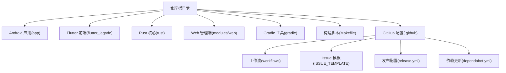
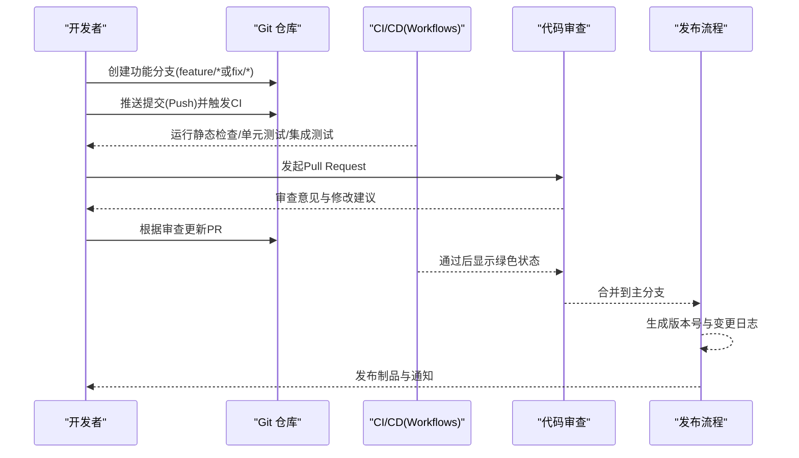
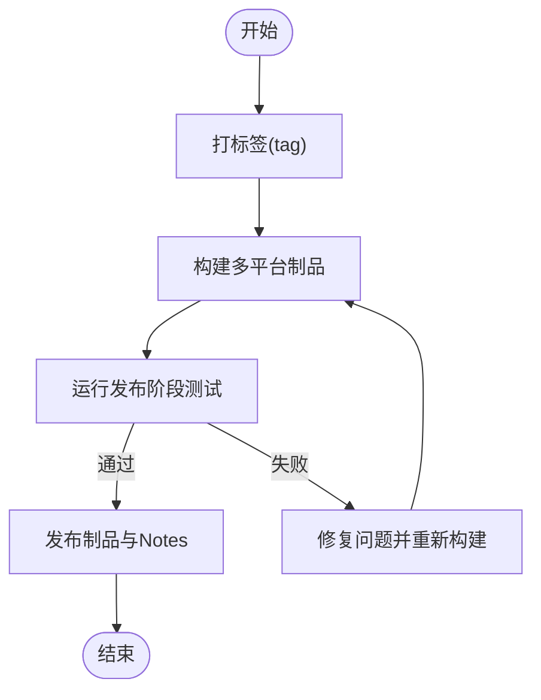
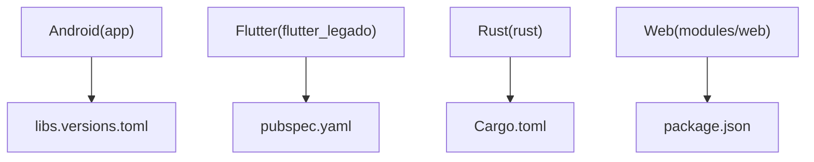

# 贡献指南

<cite>
**本文引用的文件**   
- [README.md](file://README.md)
- [.github/workflows/release.yml](file://.github/workflows/release.yml)
- [.github/dependabot.yml](file://.github/dependabot.yml)
- [Makefile](file://Makefile)
- [app/build.gradle](file://app/build.gradle)
- [gradle/libs.versions.toml](file://gradle/libs.versions.toml)
- [flutter_legado/pubspec.yaml](file://flutter_legado/pubspec.yaml)
- [rust/Cargo.toml](file://rust/Cargo.toml)
- [modules/web/package.json](file://modules/web/package.json)
</cite>

## 目录
1. [简介](#简介)
2. [项目结构](#项目结构)
3. [核心组件](#核心组件)
4. [架构总览](#架构总览)
5. [详细组件分析](#详细组件分析)
6. [依赖分析](#依赖分析)
7. [性能考虑](#性能考虑)
8. [故障排查指南](#故障排查指南)
9. [结论](#结论)
10. [附录](#附录)

## 简介
本指南面向所有希望参与 Legado 项目的贡献者，涵盖 Git 工作流、分支管理策略、提交信息规范、代码审查流程、Issue 管理、Pull Request 创建与审核、自动化测试与质量检查、版本发布流程以及新贡献者入门与社区参与规范。文档基于仓库中的实际配置与工作流脚本进行说明，确保可操作性与一致性。

## 项目结构
Legado 是一个多语言、多模块的跨平台项目，包含 Android 应用（Kotlin）、Flutter 前端、Rust 核心库、Web 管理端等。根目录提供统一的构建入口与 CI/CD 配置，便于协作与发布。

**图示来源** 
- [Makefile](file://Makefile)
- [.github/workflows/release.yml](file://.github/workflows/release.yml)
- [.github/dependabot.yml](file://.github/dependabot.yml)

**章节来源**
- [README.md](file://README.md)
- [Makefile](file://Makefile)

## 核心组件
- Android 应用：位于 app 目录，使用 Gradle 构建，包含 Kotlin 源码与资源。
- Flutter 前端：位于 flutter_legado 目录，使用 Dart/Flutter 构建，含单元测试与 Widget 测试。
- Rust 核心：位于 rust 目录，包含多个 crate（如 legado-core、legado-db、legado-net 等），通过 Cargo 管理。
- Web 管理端：位于 modules/web，使用 Vite + TypeScript/Vue 构建。
- 构建与工具：根级 Makefile 统一调用各子项目构建；Gradle 与 libs.versions.toml 管理 Android 依赖版本；Cargo 与 pubspec.yaml 分别管理 Rust 与 Flutter 依赖。

**章节来源**
- [app/build.gradle](file://app/build.gradle)
- [gradle/libs.versions.toml](file://gradle/libs.versions.toml)
- [flutter_legado/pubspec.yaml](file://flutter_legado/pubspec.yaml)
- [rust/Cargo.toml](file://rust/Cargo.toml)
- [modules/web/package.json](file://modules/web/package.json)

## 架构总览
下图展示从贡献到发布的端到端流程，包括分支策略、提交流程、代码审查、自动化测试与发布。

**图示来源** 
- [.github/workflows/release.yml](file://.github/workflows/release.yml)
- [Makefile](file://Makefile)

## 详细组件分析

### Git 工作流与分支管理
- 分支命名
  - 功能分支：feature/<描述>
  - 修复分支：fix/<描述>
  - 发布分支：release/<版本号>
  - 热修复分支：hotfix/<描述>
- 主干保护
  - 主分支（main/master）受保护，禁止直接推送，必须通过 Pull Request 合并。
- 提交信息格式
  - 采用约定式提交（Conventional Commits），例如 feat、fix、docs、chore、refactor、test、build、ci、perf、revert 等前缀。
  - 提交消息应简洁明确，必要时在正文补充动机与影响范围。
- 分支同步
  - 定期从主分支 rebase 或 merge 以保持历史整洁。
- 冲突解决
  - 优先在本地解决冲突，避免在 PR 中引入无关改动。

**章节来源**
- [Makefile](file://Makefile)

### Issue 管理流程
- 分类
  - Bug 报告：复现步骤、期望行为、实际行为、环境信息（设备、系统版本、应用版本）。
  - 功能请求：需求背景、目标用户、预期效果、优先级。
  - 问题跟踪：标签（bug、enhancement、question、documentation）用于筛选与统计。
- 模板
  - 使用 .github/ISSUE_TEMPLATE 下的模板以标准化输入。
- 处理优先级
  - P0（紧急）：崩溃、数据丢失、安全漏洞。
  - P1（高）：主要功能不可用、严重体验问题。
  - P2（中）：次要功能问题、优化建议。
  - P3（低）：文案、样式微调。
- 生命周期
  - 新建 -> 确认 -> 指派 -> 开发 -> 测试 -> 验证 -> 关闭。

**章节来源**
- [.github/ISSUE_TEMPLATE](file://.github/ISSUE_TEMPLATE)

### Pull Request 创建与审核流程
- 创建 PR
  - 从功能分支向主分支发起 PR，填写标题与描述，关联相关 Issue。
  - 确保通过所有自动化检查（lint、单元测试、集成测试）。
- 代码审查
  - 至少一名维护者审查，关注正确性、可读性、性能与安全性。
  - 审查意见需逐一回应并落实修改。
- 合并策略
  - 推荐使用 Squash Merge 或 Rebase Merge，保持提交历史清晰。
  - 合并后删除已合并的分支。
- 质量门禁
  - 静态检查（lint/format）、单元测试覆盖率阈值、集成测试通过。
  - 对关键路径增加回归测试。

**章节来源**
- [Makefile](file://Makefile)

### 自动化测试与质量检查
- 单元测试
  - Flutter：dart test 执行 unit 与 widget 测试。
  - Rust：cargo test 执行各 crate 的单元测试与集成测试。
  - Android：JUnit 测试与 Instrumentation 测试。
- 静态检查
  - Dart：dart analyze。
  - Rust：cargo clippy。
  - Android/Kotlin：ktlint/detekt（若启用）。
- 持续集成
  - GitHub Actions 工作流在 push/PR 时自动触发，失败则阻止合并。

**章节来源**
- [flutter_legado/pubspec.yaml](file://flutter_legado/pubspec.yaml)
- [rust/Cargo.toml](file://rust/Cargo.toml)
- [app/build.gradle](file://app/build.gradle)

### 版本发布流程
- 版本号管理
  - 遵循语义化版本（SemVer）：主版本.次版本.修订号。
  - Android 应用通过 build.gradle 中的 versionCode/versionName 管理。
  - Flutter 与 Rust 通过各自包管理器（pubspec.yaml、Cargo.toml）声明版本。
- 变更日志维护
  - 每次发布前更新 CHANGELOG（若存在）或在 release notes 中汇总变更。
- 发布渠道
  - 通过 .github/workflows/release.yml 触发发布流水线，生成制品并上传至发布页。
  - Dependabot 负责依赖更新提醒与自动化 PR。

**图示来源** 
- [.github/workflows/release.yml](file://.github/workflows/release.yml)

**章节来源**
- [app/build.gradle](file://app/build.gradle)
- [flutter_legado/pubspec.yaml](file://flutter_legado/pubspec.yaml)
- [rust/Cargo.toml](file://rust/Cargo.toml)
- [.github/workflows/release.yml](file://.github/workflows/release.yml)
- [.github/dependabot.yml](file://.github/dependabot.yml)

### 新贡献者入门指导
- 环境准备
  - 安装 JDK、Android SDK、Flutter、Rust Toolchain 与 Node.js。
  - 克隆仓库并初始化子模块（如有）。
- 本地构建
  - 使用 Makefile 统一构建命令，或进入子项目使用各自构建工具。
- 运行测试
  - 执行各子项目的测试套件，确保本地通过。
- 首次贡献
  - 选择一个标注为 good first issue 的任务，按 Issue 模板提交反馈。
  - 创建功能分支并提交符合规范的提交信息。
  - 发起 PR 并响应审查意见。

**章节来源**
- [Makefile](file://Makefile)
- [README.md](file://README.md)

### 社区参与规范
- 沟通礼仪
  - 尊重他人，使用清晰、客观的语言讨论问题。
  - 在 Issue/PR 中提供充分上下文与证据。
- 行为准则
  - 遵守开源社区的行为准则，禁止骚扰与歧视。
- 贡献激励
  - 认可高质量贡献者，鼓励长期参与与维护。

[本节为通用指导，不直接分析具体文件]

## 依赖分析
- Android 依赖
  - 通过 gradle/libs.versions.toml 集中管理版本，减少不一致。
- Flutter 依赖
  - 通过 pubspec.yaml 声明，使用 dart pub 管理。
- Rust 依赖
  - 通过 Cargo.toml 与 Cargo.lock 锁定版本，使用 cargo 管理。
- Web 依赖
  - 通过 package.json 与 pnpm-lock.yaml 管理。

**图示来源** 
- [gradle/libs.versions.toml](file://gradle/libs.versions.toml)
- [flutter_legado/pubspec.yaml](file://flutter_legado/pubspec.yaml)
- [rust/Cargo.toml](file://rust/Cargo.toml)
- [modules/web/package.json](file://modules/web/package.json)

**章节来源**
- [gradle/libs.versions.toml](file://gradle/libs.versions.toml)
- [flutter_legado/pubspec.yaml](file://flutter_legado/pubspec.yaml)
- [rust/Cargo.toml](file://rust/Cargo.toml)
- [modules/web/package.json](file://modules/web/package.json)

## 性能考虑
- 构建优化
  - 使用并行构建与缓存（Gradle、Cargo、Flutter 缓存）。
  - 合理划分模块，减少不必要的编译。
- 测试优化
  - 增量测试与并行执行，缩短 CI 时间。
- 运行时性能
  - 对热点路径进行基准测试与性能回归监控。
  - 避免内存泄漏与过度分配。

[本节为通用指导，不直接分析具体文件]

## 故障排查指南
- 常见问题
  - 依赖冲突：检查 libs.versions.toml、pubspec.yaml、Cargo.toml 的版本一致性。
  - 构建失败：查看 CI 日志，定位具体错误与缺失的环境变量。
  - 测试失败：复现实验环境，逐步缩小问题范围。
- 调试技巧
  - 使用日志与断点定位问题。
  - 最小化复现用例，便于快速修复。
- 回滚策略
  - 通过 revert 提交恢复稳定状态，再逐步修复。

**章节来源**
- [Makefile](file://Makefile)

## 结论
本指南提供了 Legado 项目的完整贡献与协作流程，涵盖 Git 工作流、Issue 管理、PR 审核、自动化测试与发布流程。遵循本指南有助于提升协作效率与代码质量，确保项目稳定演进。欢迎新贡献者加入，共同推动 Legado 的发展。

[本节为总结，不直接分析具体文件]

## 附录
- 常用命令
  - 构建：make build
  - 测试：make test
  - 清理：make clean
- 参考链接
  - README：了解项目概览与快速开始
  - Workflows：查看 CI/CD 配置细节
  - Dependabot：依赖更新自动化

**章节来源**
- [README.md](file://README.md)
- [.github/workflows/release.yml](file://.github/workflows/release.yml)
- [.github/dependabot.yml](file://.github/dependabot.yml)
- [Makefile](file://Makefile)