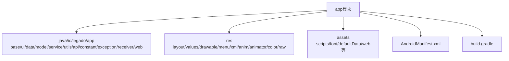
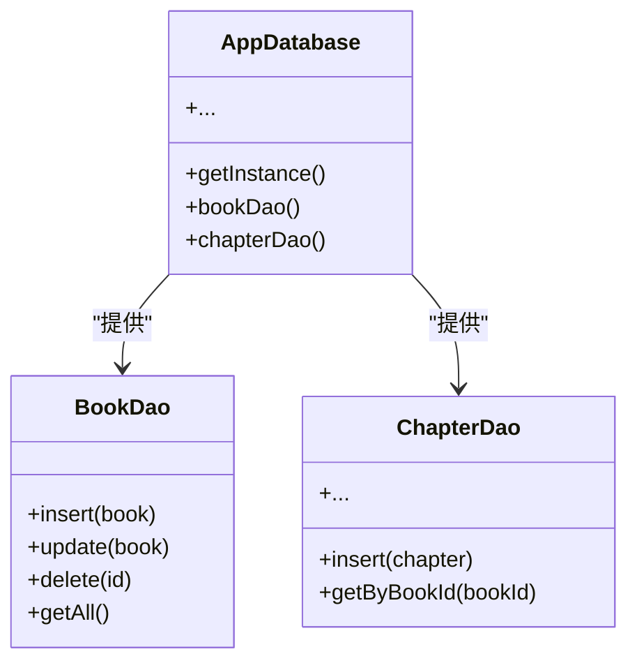
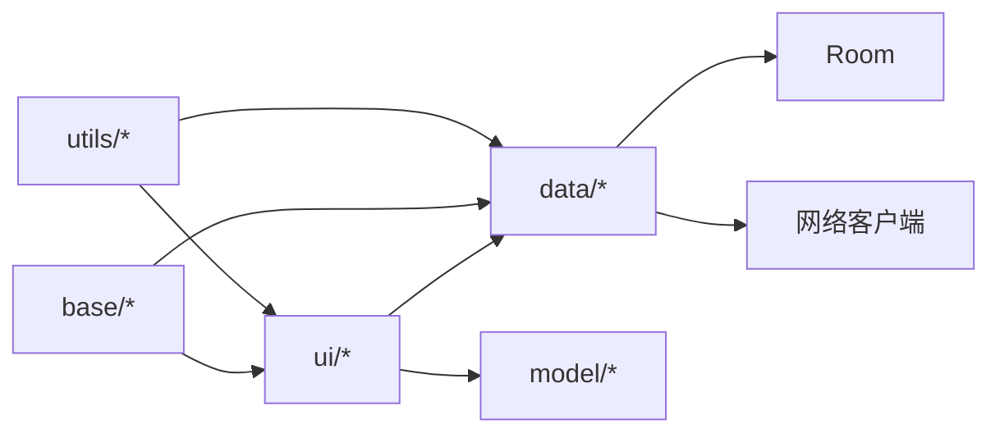
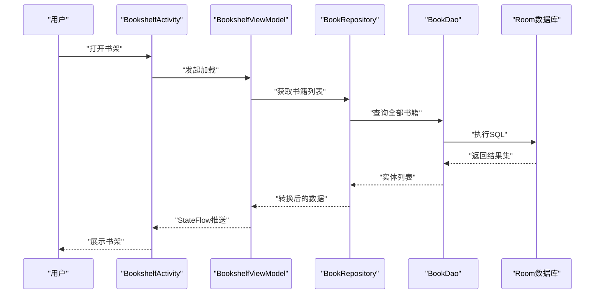

# Android项目结构

<cite>
**本文档引用的文件**   
- [app/src/main/AndroidManifest.xml](file://app/src/main/AndroidManifest.xml)
- [app/build.gradle](file://app/build.gradle)
- [app/src/main/java/io/legado/app/App.kt](file://app/src/main/java/io/legado/app/App.kt)
- [app/src/main/java/io/legado/app/base/BaseActivity.kt](file://app/src/main/java/io/legado/app/base/BaseActivity.kt)
- [app/src/main/java/io/legado/app/base/BaseFragment.kt](file://app/src/main/java/io/legado/app/base/BaseFragment.kt)
- [app/src/main/java/io/legado/app/data/AppDatabase.kt](file://app/src/main/java/io/legado/app/data/AppDatabase.kt)
- [app/src/main/java/io/legado/app/ui/bookshelf/BookshelfActivity.kt](file://app/src/main/java/io/legado/app/ui/bookshelf/BookshelfActivity.kt)
- [app/src/main/java/io/legado/app/ui/bookshelf/BookshelfViewModel.kt](file://app/src/main/java/io/legado/app/ui/bookshelf/BookshelfViewModel.kt)
- [app/src/main/res/values/strings.xml](file://app/src/main/res/values/strings.xml)
- [app/src/main/res/values-zh/strings.xml](file://app/src/main/res/values-zh/strings.xml)
- [app/src/main/res/layout/activity_bookshelf.xml](file://app/src/main/res/layout/activity_bookshelf.xml)
- [app/src/main/assets/cronet.json](file://app/src/main/assets/cronet.json)
</cite>

## 目录
1. [简介](#简介)
2. [项目结构](#项目结构)
3. [核心组件](#核心组件)
4. [架构总览](#架构总览)
5. [详细组件分析](#详细组件分析)
6. [依赖分析](#依赖分析)
7. [性能考虑](#性能考虑)
8. [故障排查指南](#故障排查指南)
9. [结论](#结论)
10. [附录](#附录)

## 简介
本文件面向Android原生应用开发者与贡献者，系统化说明Legado的Android端项目结构与组织方式。重点覆盖：
- app模块目录布局与包结构（base、ui、data、model等）
- 资源文件组织（res下的layout、values、drawable等）
- 配置文件管理（AndroidManifest.xml、build.gradle）
- Activity与Fragment的组织模式、ViewModel使用规范
- 数据层Room数据库架构
- 模块化设计原则（依赖注入、事件总线、工具类库）
- 调试与测试代码组织结构
- 多语言资源的国际化支持

## 项目结构
app模块采用典型的Android分层与功能域混合组织方式：
- java/io/legado/app
  - base：基础类（BaseActivity、BaseFragment、BaseViewModel等），提供统一生命周期、权限、主题、日志等能力
  - ui：界面层，按功能域划分（如bookshelf、reader、source、settings等），每个子包内包含Activity/Fragment、ViewModel、Adapter等
  - data：数据访问层，封装Room数据库、DAO、Repository、网络与本地缓存策略
  - model：领域模型与规则解析相关的数据结构
  - service：后台服务（音频播放、下载、定时任务等）
  - utils：通用工具类（网络、加密、IO、时间、UI辅助等）
  - api：对外API或内部接口定义
  - constant：常量与配置项
  - exception：异常类型与错误码
  - receiver：系统广播接收器
  - web：Web相关能力（Cronet、WebView桥接等）
- res：资源目录
  - layout：页面布局XML
  - values：字符串、颜色、样式、尺寸等；同时包含多语言目录（values-zh、values-es-rES、values-ja-rJP、values-pt-rBR、values-vi等）
  - drawable：矢量与位图资源
  - menu：菜单定义
  - xml：偏好设置、网络配置、Provider等
  - anim/animator/color/raw等：动画、颜色、原始资源
- assets：静态资源（脚本、字体、默认数据、Web前端资源等）
- AndroidManifest.xml：应用清单与组件声明
- build.gradle：构建脚本与依赖声明

图表来源
- [app/src/main/AndroidManifest.xml](file://app/src/main/AndroidManifest.xml)
- [app/build.gradle](file://app/build.gradle)

章节来源
- [app/src/main/AndroidManifest.xml](file://app/src/main/AndroidManifest.xml)
- [app/build.gradle](file://app/build.gradle)

## 核心组件
- App入口与初始化
  - 应用启动类负责全局初始化（依赖注入框架、日志、网络引擎、数据库初始化、主题与语言等）
- 基础UI组件
  - BaseActivity/BaseFragment：统一生命周期处理、权限申请、主题切换、导航、事件订阅等
- 数据层
  - Room数据库：AppDatabase作为单例，配合DAO与实体完成持久化
- UI层
  - 以功能域划分的Activity/Fragment，配合ViewModel进行状态管理与业务编排
- 服务与后台
  - Service用于长时任务（音频播放、下载、定时任务等）
- 工具与扩展
  - utils提供跨模块复用能力（网络、加密、IO、UI、协程扩展等）

章节来源
- [app/src/main/java/io/legado/app/App.kt](file://app/src/main/java/io/legado/app/App.kt)
- [app/src/main/java/io/legado/app/base/BaseActivity.kt](file://app/src/main/java/io/legado/app/base/BaseActivity.kt)
- [app/src/main/java/io/legado/app/base/BaseFragment.kt](file://app/src/main/java/io/legado/app/base/BaseFragment.kt)
- [app/src/main/java/io/legado/app/data/AppDatabase.kt](file://app/src/main/java/io/legado/app/data/AppDatabase.kt)

## 架构总览
整体遵循MVVM + Repository的分层架构：
- 表现层（UI）：Activity/Fragment + ViewModel
- 领域层（Model）：领域对象与规则解析
- 数据层（Data）：Repository + DAO + Room + 网络客户端
- 基础设施：基础类、工具、服务、配置与资源

```mermaid
graph TB
subgraph "表现层"
UI_Activity["Activity/Fragment"]
UI_VM["ViewModel"]
end
subgraph "领域层"
Model["Model/规则解析"]
end
subgraph "数据层"
Repo["Repository"]
DAO["DAO(Room)"]
DB["Room数据库"]
Net["网络客户端"]
end
subgraph "基础设施"
Base["BaseActivity/BaseFragment"]
Utils["工具类"]
Service["Service"]
Config["配置/资源"]
end
UI_Activity --> UI_VM
UI_VM --> Repo
Repo --> DAO
DAO --> DB
Repo --> Net
UI_Activity --> Base
UI_VM --> Utils
Service --> Utils
Config --> UI_Activity
```

图表来源
- [app/src/main/java/io/legado/app/base/BaseActivity.kt](file://app/src/main/java/io/legado/app/base/BaseActivity.kt)
- [app/src/main/java/io/legado/app/base/BaseFragment.kt](file://app/src/main/java/io/legado/app/base/BaseFragment.kt)
- [app/src/main/java/io/legado/app/data/AppDatabase.kt](file://app/src/main/java/io/legado/app/data/AppDatabase.kt)

## 详细组件分析

### 包结构与职责
- base
  - 提供统一的基类与公共能力，降低重复代码，保证一致的用户体验与行为
- ui
  - 按功能域拆分，便于维护与并行开发；每个域内包含视图、交互逻辑与状态管理
- data
  - 抽象数据源，屏蔽Room与网络的差异，向上暴露统一接口
- model
  - 领域模型与规则数据结构，保持与UI解耦
- service
  - 后台任务与系统级能力封装
- utils
  - 可复用的工具函数与扩展，避免在各处重复实现

章节来源
- [app/src/main/java/io/legado/app/base/BaseActivity.kt](file://app/src/main/java/io/legado/app/base/BaseActivity.kt)
- [app/src/main/java/io/legado/app/base/BaseFragment.kt](file://app/src/main/java/io/legado/app/base/BaseFragment.kt)

### Activity与Fragment组织模式
- 单一职责：每个Activity/Fragment聚焦一个场景
- 通过BaseActivity/BaseFragment统一处理权限、主题、导航、事件订阅
- Fragment常用于复杂页面的分片与复用，结合Navigation或自定义路由

章节来源
- [app/src/main/java/io/legado/app/base/BaseActivity.kt](file://app/src/main/java/io/legado/app/base/BaseActivity.kt)
- [app/src/main/java/io/legado/app/base/BaseFragment.kt](file://app/src/main/java/io/legado/app/base/BaseFragment.kt)

### ViewModel使用规范
- 状态持有与恢复：在配置变更中保持状态
- 与UI解耦：仅暴露StateFlow/LiveData等响应式数据
- 与Repository协作：调用数据层接口，不直接访问Room或网络

章节来源
- [app/src/main/java/io/legado/app/ui/bookshelf/BookshelfViewModel.kt](file://app/src/main/java/io/legado/app/ui/bookshelf/BookshelfViewModel.kt)

### 数据层Room数据库架构
- AppDatabase：单例数据库入口，版本管理与迁移
- DAO：定义CRUD与查询方法
- Entity：映射表结构
- Migration：数据库升级路径

图表来源
- [app/src/main/java/io/legado/app/data/AppDatabase.kt](file://app/src/main/java/io/legado/app/data/AppDatabase.kt)

章节来源
- [app/src/main/java/io/legado/app/data/AppDatabase.kt](file://app/src/main/java/io/legado/app/data/AppDatabase.kt)

### 资源文件组织
- layout：页面布局XML，按功能域命名
- values：字符串、颜色、样式、尺寸；多语言目录（zh、es、ja、pt、vi等）
- drawable：图标与背景
- menu：上下文菜单与选项菜单
- xml：偏好设置、网络配置、Provider等
- assets：脚本、字体、默认数据、Web前端资源

章节来源
- [app/src/main/res/values/strings.xml](file://app/src/main/res/values/strings.xml)
- [app/src/main/res/values-zh/strings.xml](file://app/src/main/res/values-zh/strings.xml)
- [app/src/main/res/layout/activity_bookshelf.xml](file://app/src/main/res/layout/activity_bookshelf.xml)
- [app/src/main/assets/cronet.json](file://app/src/main/assets/cronet.json)

### 配置文件管理
- AndroidManifest.xml：声明应用元信息、权限、Activity/Service/Receiver、IntentFilter等
- build.gradle：依赖管理、构建变体、签名、混淆、打包优化等

章节来源
- [app/src/main/AndroidManifest.xml](file://app/src/main/AndroidManifest.xml)
- [app/build.gradle](file://app/build.gradle)

### 国际化（i18n）
- 通过values-<locale>目录提供多语言字符串
- 运行时根据系统语言动态加载对应资源
- 建议对新增文案同步更新所有语言包，保持一致性

章节来源
- [app/src/main/res/values/strings.xml](file://app/src/main/res/values/strings.xml)
- [app/src/main/res/values-zh/strings.xml](file://app/src/main/res/values-zh/strings.xml)

## 依赖分析
- 模块内依赖
  - ui依赖data与model
  - data依赖Room与网络客户端
  - base为各层共享的基础能力
- 外部依赖
  - Room、Coroutines、Network库、Cronet等
- 构建与发布
  - 通过gradle统一管理依赖版本与构建参数

图表来源
- [app/build.gradle](file://app/build.gradle)

章节来源
- [app/build.gradle](file://app/build.gradle)

## 性能考虑
- 数据库
  - 合理使用索引与查询条件，避免全表扫描
  - 批量操作与事务减少I/O开销
- 网络
  - 连接池与超时控制，重试与降级策略
  - Cronet加速HTTP请求
- UI
  - 列表虚拟化与懒加载
  - 图片压缩与缓存
- 内存
  - ViewModel持有轻量状态，避免大对象泄漏
  - 及时释放监听与回调

[本节为通用指导，不直接分析具体文件]

## 故障排查指南
- 常见问题
  - 数据库迁移失败：检查Migration版本与SQL兼容性
  - 网络请求失败：确认代理、证书与超时配置
  - 资源未找到：核对资源命名与引用路径
  - 崩溃定位：查看Logcat与Crashlytics上报
- 调试技巧
  - 启用Debug构建变体
  - 使用ProGuard/R8规则排除关键类
  - 借助adb与Android Studio Profiler定位问题

章节来源
- [app/build.gradle](file://app/build.gradle)
- [app/src/main/AndroidManifest.xml](file://app/src/main/AndroidManifest.xml)

## 结论
本项目采用清晰的层次化与功能域组织方式，结合MVVM与Room，保证了可维护性与可扩展性。通过统一的基础类与工具库，降低了重复开发与出错概率。建议在后续迭代中持续完善依赖注入、事件总线与测试覆盖率，进一步提升工程质量与交付效率。

[本节为总结性内容，不直接分析具体文件]

## 附录
- 示例流程：书架页加载数据序列图

图表来源
- [app/src/main/java/io/legado/app/ui/bookshelf/BookshelfActivity.kt](file://app/src/main/java/io/legado/app/ui/bookshelf/BookshelfActivity.kt)
- [app/src/main/java/io/legado/app/ui/bookshelf/BookshelfViewModel.kt](file://app/src/main/java/io/legado/app/ui/bookshelf/BookshelfViewModel.kt)
- [app/src/main/java/io/legado/app/data/AppDatabase.kt](file://app/src/main/java/io/legado/app/data/AppDatabase.kt)