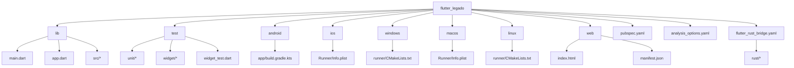
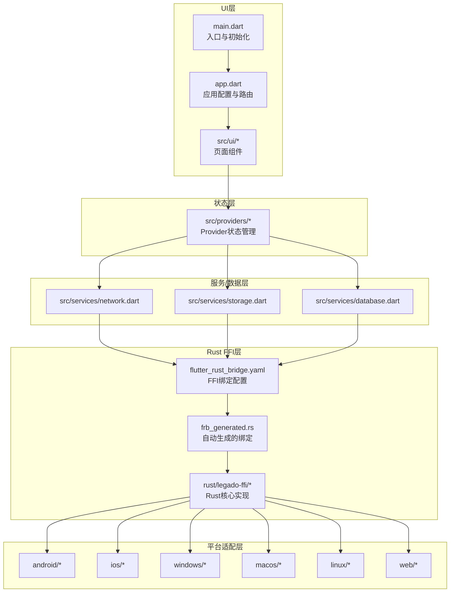
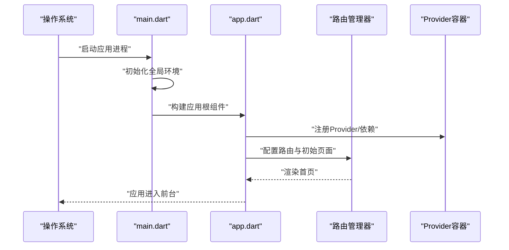
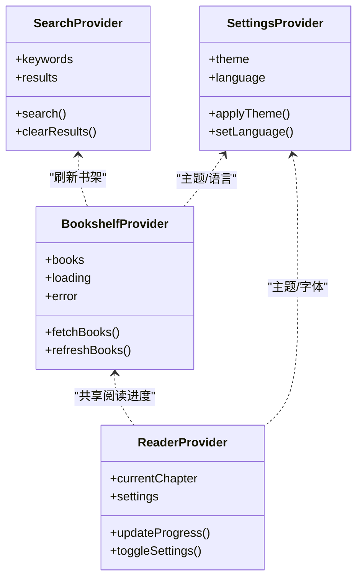
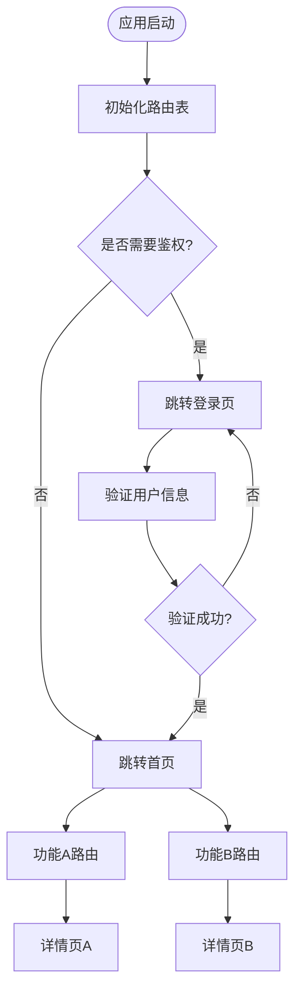
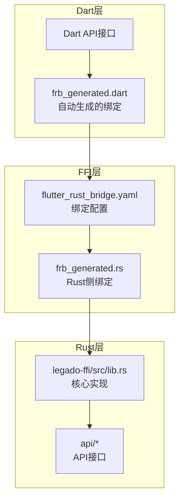
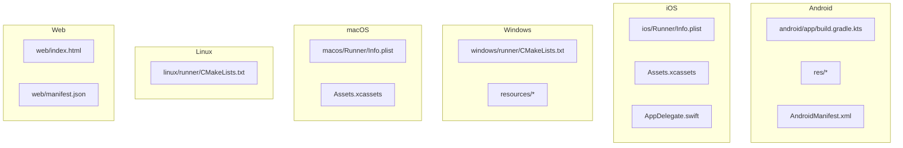
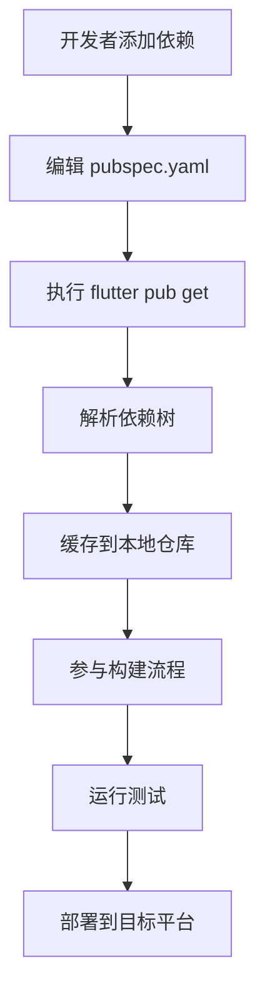
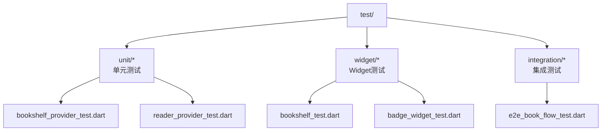
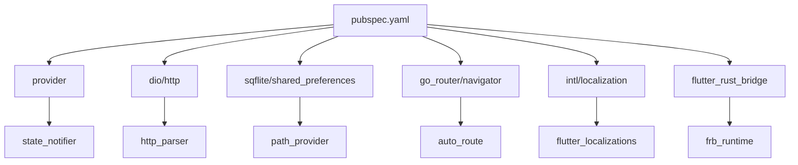

# Flutter项目结构

<cite>
**本文引用的文件**   
- [flutter_legado/lib/main.dart](file://flutter_legado/lib/main.dart)
- [flutter_legado/lib/app.dart](file://flutter_legado/lib/app.dart)
- [flutter_legado/pubspec.yaml](file://flutter_legado/pubspec.yaml)
- [flutter_legado/analysis_options.yaml](file://flutter_legado/analysis_options.yaml)
- [flutter_legado/test/unit/bookshelf_provider_test.dart](file://flutter_legado/test/unit/bookshelf_provider_test.dart)
- [flutter_legado/test/widget/bookshelf_test.dart](file://flutter_legado/test/widget/bookshelf_test.dart)
- [flutter_legado/test/widget_test.dart](file://flutter_legado/test/widget_test.dart)
- [flutter_legado/android/app/build.gradle.kts](file://flutter_legado/android/app/build.gradle.kts)
- [flutter_legado/android/build.gradle.kts](file://flutter_legado/android/build.gradle.kts)
- [flutter_legado/ios/Runner/Info.plist](file://flutter_legado/ios/Runner/Info.plist)
- [flutter_legado/macos/Runner/Info.plist](file://flutter_legado/macos/Runner/Info.plist)
- [flutter_legado/windows/runner/CMakeLists.txt](file://flutter_legado/windows/runner/CMakeLists.txt)
- [flutter_legado/linux/runner/CMakeLists.txt](file://flutter_legado/linux/runner/CMakeLists.txt)
- [flutter_legado/web/index.html](file://flutter_legado/web/index.html)
- [flutter_legado/web/manifest.json](file://flutter_legado/web/manifest.json)
- [flutter_legado/flutter_rust_bridge.yaml](file://flutter_legado/flutter_rust_bridge.yaml)
- [rust/legado-ffi/src/lib.rs](file://rust/legado-ffi/src/lib.rs)
</cite>

## 更新摘要
**所做更改**   
- 移除了对已删除的 rust_bridge.dart 模块的引用
- 更新了FFI绑定系统相关章节，反映新的Rust FFI架构
- 新增了Rust FFI集成说明和架构图
- 更新了平台桥接部分的实现方式

## 目录
1. [简介](#简介)
2. [项目结构](#项目结构)
3. [核心组件](#核心组件)
4. [架构总览](#架构总览)
5. [详细组件分析](#详细组件分析)
6. [依赖分析](#依赖分析)
7. [性能考虑](#性能考虑)
8. [故障排查指南](#故障排查指南)
9. [结论](#结论)
10. [附录](#附录)

## 简介
本文件面向Flutter跨平台应用"Legado"的Flutter工程，系统性说明其项目结构与组织方式。重点覆盖：
- lib目录的组织原则与入口、应用配置、src分层
- 状态管理（Provider）与页面路由管理
- 多平台特定代码与资源管理（Android、iOS、Windows、macOS、Linux、Web）
- 依赖管理策略（pubspec.yaml、第三方库集成、本地插件开发）
- Rust FFI绑定系统与原生代码集成
- 测试文件组织结构（单元测试、Widget测试、集成测试）

## 项目结构
Flutter工程位于 flutter_legado 目录，遵循标准Flutter多平台工程布局：
- lib：Dart源码，包含入口 main.dart、应用配置 app.dart、业务逻辑 src
- test：测试用例，按 unit、widget、integration 分类
- android/ios/windows/macos/linux/web：各平台原生工程与资源
- pubspec.yaml：依赖与资源声明
- analysis_options.yaml：静态分析与格式化规则
- flutter_rust_bridge.yaml：Rust FFI绑定配置

图表来源
- [flutter_legado/lib/main.dart](file://flutter_legado/lib/main.dart)
- [flutter_legado/lib/app.dart](file://flutter_legado/lib/app.dart)
- [flutter_legado/pubspec.yaml](file://flutter_legado/pubspec.yaml)
- [flutter_legado/analysis_options.yaml](file://flutter_legado/analysis_options.yaml)
- [flutter_legado/flutter_rust_bridge.yaml](file://flutter_legado/flutter_rust_bridge.yaml)
- [flutter_legado/android/app/build.gradle.kts](file://flutter_legado/android/app/build.gradle.kts)
- [flutter_legado/ios/Runner/Info.plist](file://flutter_legado/ios/Runner/Info.plist)
- [flutter_legado/macos/Runner/Info.plist](file://flutter_legado/macos/Runner/Info.plist)
- [flutter_legado/windows/runner/CMakeLists.txt](file://flutter_legado/windows/runner/CMakeLists.txt)
- [flutter_legado/linux/runner/CMakeLists.txt](file://flutter_legado/linux/runner/CMakeLists.txt)
- [flutter_legado/web/index.html](file://flutter_legado/web/index.html)
- [flutter_legado/web/manifest.json](file://flutter_legado/web/manifest.json)

章节来源
- [flutter_legado/lib/main.dart](file://flutter_legado/lib/main.dart)
- [flutter_legado/lib/app.dart](file://flutter_legado/lib/app.dart)
- [flutter_legado/pubspec.yaml](file://flutter_legado/pubspec.yaml)
- [flutter_legado/analysis_options.yaml](file://flutter_legado/analysis_options.yaml)
- [flutter_legado/flutter_rust_bridge.yaml](file://flutter_legado/flutter_rust_bridge.yaml)

## 核心组件
- 入口文件 main.dart：负责初始化全局环境、启动应用根组件。通常在此设置主题、国际化、错误捕获等。
- 应用配置 app.dart：定义 MaterialApp/WidgetsApp 的配置项，如路由表、主题、语言包、初始页面、导航守卫等。
- src 业务层：按功能域或层次划分（如 ui、services、models、providers、utils），保持高内聚低耦合。
- Rust FFI绑定：通过 flutter_rust_bridge.yaml 配置，自动生成类型安全的Rust-Dart绑定。

章节来源
- [flutter_legado/lib/main.dart](file://flutter_legado/lib/main.dart)
- [flutter_legado/lib/app.dart](file://flutter_legado/lib/app.dart)
- [flutter_legado/flutter_rust_bridge.yaml](file://flutter_legado/flutter_rust_bridge.yaml)

## 架构总览
整体采用"UI层 + Provider状态层 + 服务/数据层 + Rust FFI桥接"的分层架构：
- UI层：由 app.dart 统一装配页面与路由，页面组件通过 Provider 订阅状态变化。
- 状态层：使用 Provider 管理应用级与模块级状态，提供响应式更新。
- 服务/数据层：封装网络、数据库、本地存储等能力，供上层调用。
- Rust FFI桥接：通过自动生成的FFI绑定与Rust高性能计算模块交互，替代原有的platform channels方案。

图表来源
- [flutter_legado/lib/main.dart](file://flutter_legado/lib/main.dart)
- [flutter_legado/lib/app.dart](file://flutter_legado/lib/app.dart)
- [flutter_legado/flutter_rust_bridge.yaml](file://flutter_legado/flutter_rust_bridge.yaml)
- [rust/legado-ffi/src/lib.rs](file://rust/legado-ffi/src/lib.rs)

## 详细组件分析

### 入口与应用配置（main.dart 与 app.dart）
- main.dart：完成运行时初始化（如日志、异常处理、平台特性检测），然后运行应用根组件。
- app.dart：集中配置主题、路由、国际化、调试选项；可在此注册全局 Provider、注入依赖。

章节来源
- [flutter_legado/lib/main.dart](file://flutter_legado/lib/main.dart)
- [flutter_legado/lib/app.dart](file://flutter_legado/lib/app.dart)

### 状态管理模式（Provider）
- Provider 用于管理应用状态，支持异步数据加载、错误处理与缓存。
- 建议将状态按模块拆分（如书架、阅读器、搜索、设置），在 app.dart 中集中注册。
- 页面组件通过 Consumer/Selector 订阅状态变化，避免不必要的重建。

章节来源
- [flutter_legado/lib/app.dart](file://flutter_legado/lib/app.dart)

### 页面路由管理
- 在 app.dart 中集中定义路由表，支持命名路由与参数传递。
- 建议使用 go_router 或 Navigator 2.0 实现深链与状态同步。
- 为每个功能模块维护独立的路由配置，便于扩展与维护。

章节来源
- [flutter_legado/lib/app.dart](file://flutter_legado/lib/app.dart)

### Rust FFI绑定系统
**更新** 移除了旧的 rust_bridge.dart 模块，采用基于 flutter_rust_bridge 的现代化FFI绑定系统。

- flutter_rust_bridge.yaml：配置Rust FFI绑定的生成规则和接口定义
- 自动生成 frb_generated.rs：类型安全的Rust-Dart双向绑定代码
- 支持复杂数据类型、异步调用、错误处理等高级特性
- 编译时验证接口一致性，减少运行时错误

图表来源
- [flutter_legado/flutter_rust_bridge.yaml](file://flutter_legado/flutter_rust_bridge.yaml)
- [rust/legado-ffi/src/lib.rs](file://rust/legado-ffi/src/lib.rs)

章节来源
- [flutter_legado/flutter_rust_bridge.yaml](file://flutter_legado/flutter_rust_bridge.yaml)
- [rust/legado-ffi/src/lib.rs](file://rust/legado-ffi/src/lib.rs)

### 平台特定代码与资源管理
- Android：在 android/app/src/main 下配置权限、签名、Cronet等；资源放在 res/ 目录。
- iOS：在 ios/Runner 下配置 Info.plist、启动画面、签名证书；资源放在 Assets.xcassets。
- Windows/macOS/Linux：通过 CMakeLists.txt 和平台特定 Runner 配置编译与打包。
- Web：在 web/ 目录下配置 index.html 与 manifest.json。

章节来源
- [flutter_legado/android/app/build.gradle.kts](file://flutter_legado/android/app/build.gradle.kts)
- [flutter_legado/ios/Runner/Info.plist](file://flutter_legado/ios/Runner/Info.plist)
- [flutter_legado/macos/Runner/Info.plist](file://flutter_legado/macos/Runner/Info.plist)
- [flutter_legado/windows/runner/CMakeLists.txt](file://flutter_legado/windows/runner/CMakeLists.txt)
- [flutter_legado/linux/runner/CMakeLists.txt](file://flutter_legado/linux/runner/CMakeLists.txt)
- [flutter_legado/web/index.html](file://flutter_legado/web/index.html)
- [flutter_legado/web/manifest.json](file://flutter_legado/web/manifest.json)

### 依赖管理策略（pubspec.yaml）
- 在 pubspec.yaml 中声明 Dart 包依赖、Flutter 插件、本地资源与资产。
- 推荐使用版本锁定（pubspec.lock）确保构建一致性。
- 第三方库集成：优先选择官方维护且活跃的库，注意平台兼容性。
- 本地插件开发：通过 flutter create --template=plugin 创建，并在主工程中引用。

章节来源
- [flutter_legado/pubspec.yaml](file://flutter_legado/pubspec.yaml)

### 测试文件组织结构
- 单元测试：放置在 test/unit/ 下，针对纯函数、Provider、工具类进行测试。
- Widget测试：放置在 test/widget/ 下，针对UI组件进行交互与渲染测试。
- 集成测试：可放置在 test/integration/ 或使用 flutter_driver 进行端到端测试。
- 示例文件：bookshelf_provider_test.dart、bookshelf_test.dart、widget_test.dart 等。

章节来源
- [flutter_legado/test/unit/bookshelf_provider_test.dart](file://flutter_legado/test/unit/bookshelf_provider_test.dart)
- [flutter_legado/test/widget/bookshelf_test.dart](file://flutter_legado/test/widget/bookshelf_test.dart)
- [flutter_legado/test/widget_test.dart](file://flutter_legado/test/widget_test.dart)

## 依赖分析
- 直接依赖：通过 pubspec.yaml 声明，包括框架扩展、状态管理、网络、数据库等。
- 间接依赖：由包管理器自动解析，需关注冲突与版本兼容。
- 平台依赖：Android Gradle、iOS CocoaPods、Windows/macOS/Linux CMake 等。
- Rust依赖：通过 Cargo.toml 管理Rust crate依赖，与Dart层通过FFI解耦。

章节来源
- [flutter_legado/pubspec.yaml](file://flutter_legado/pubspec.yaml)

## 性能考虑
- 状态更新优化：使用 Selector 精确订阅，避免全量重建。
- 图片与资源：按需加载，使用缓存策略，减少内存占用。
- 网络请求：合并请求、分页加载、错误重试与超时控制。
- Rust FFI优化：批量数据处理、零拷贝传输、异步非阻塞调用。
- 平台优化：启用 ProGuard/R8、裁剪无用资源、使用 Release 模式构建。

## 故障排查指南
- 构建失败：检查 pubspec.yaml 依赖版本、平台 SDK 版本、Gradle/CocoaPods/CMake 配置。
- Rust FFI问题：确认 flutter_rust_bridge.yaml 配置正确、Cargo.toml 依赖完整、FFI接口匹配。
- 运行时崩溃：查看日志输出、异常堆栈、Platform Channel 通信错误。
- 资源缺失：确认 assets 路径正确、平台资源已正确声明。
- 测试失败：检查测试环境初始化、Mock数据、异步操作等待。

章节来源
- [flutter_legado/analysis_options.yaml](file://flutter_legado/analysis_options.yaml)

## 结论
本Flutter工程采用清晰的分层架构与模块化组织，结合Provider状态管理与Rust FFI高性能计算，具备良好的可扩展性与可维护性。通过规范的依赖管理与测试结构，可有效保障代码质量与交付效率。新的FFI绑定系统提供了更好的类型安全和性能表现。

## 附录
- 最佳实践：保持单一职责、接口抽象、错误边界处理。
- 代码规范：遵循 analysis_options.yaml 中的静态分析与格式化规则。
- 发布流程：使用脚本自动化构建、签名、打包与分发。
- Rust开发：参考 rust/DEVELOPMENT.md 了解Rust模块开发规范。