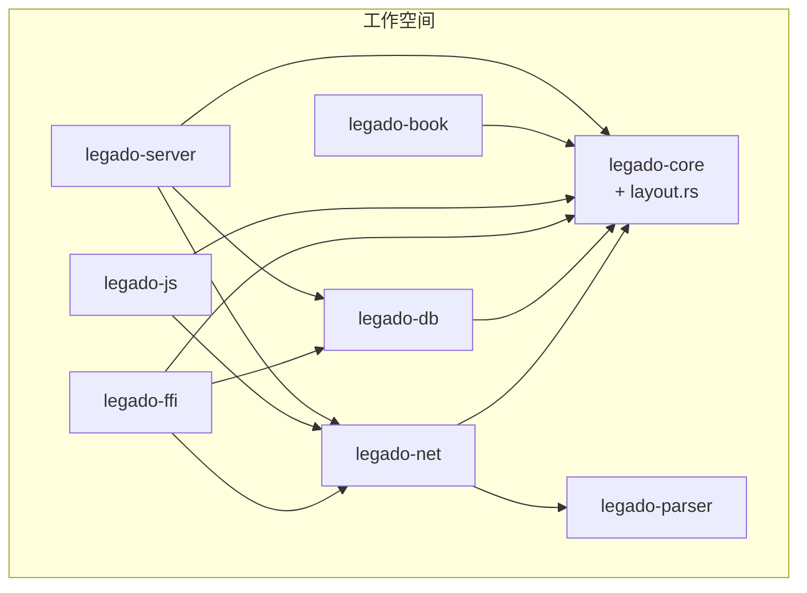
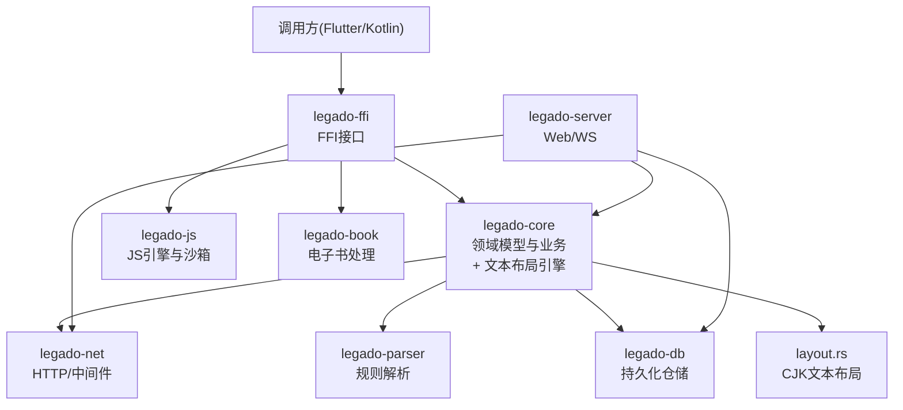
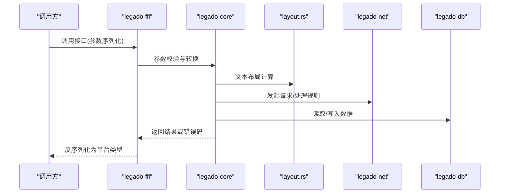
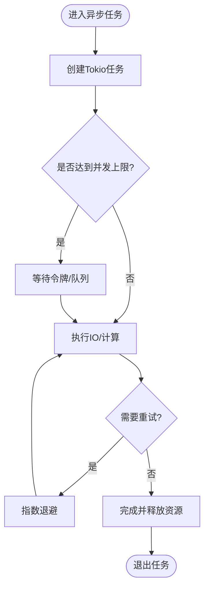
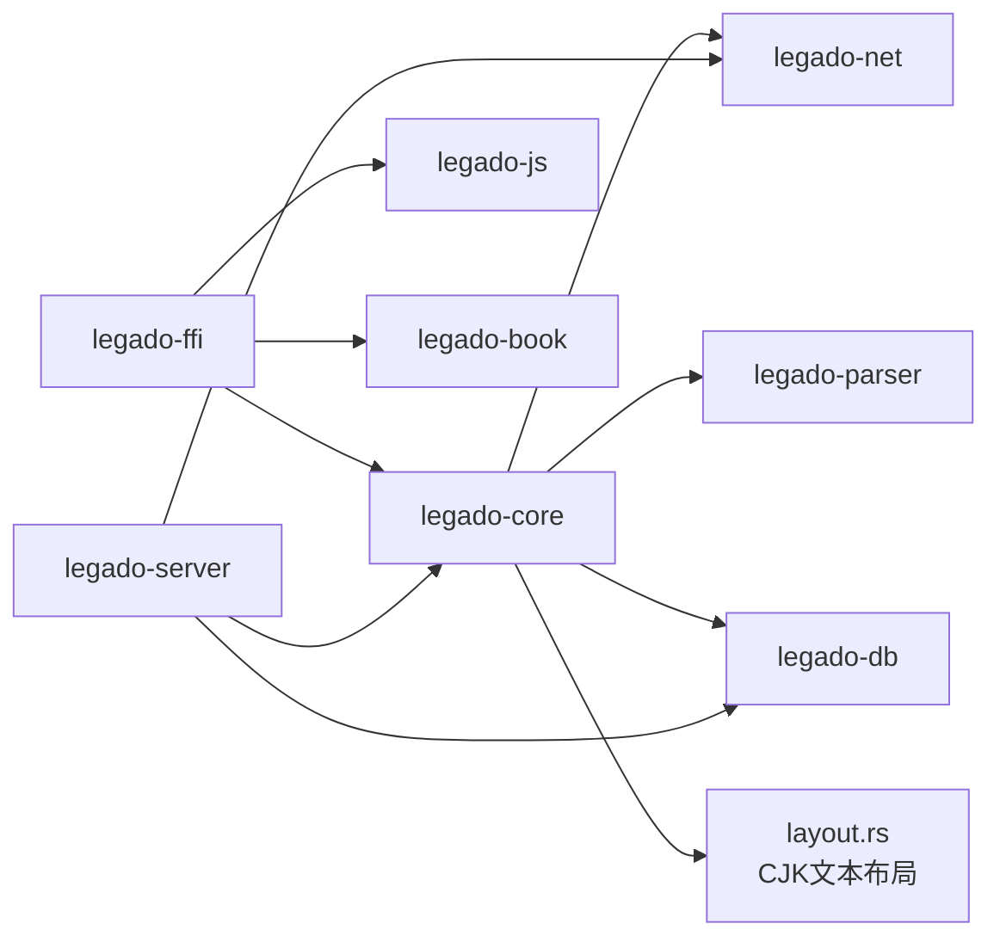
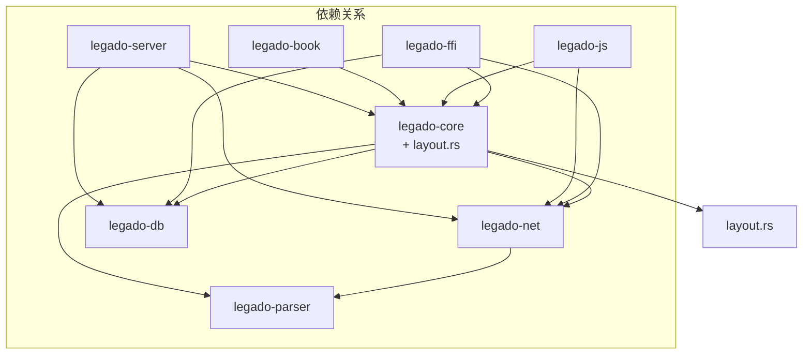

# Rust核心库结构

<cite>
**本文引用的文件**   
- [rust/Cargo.toml](file://rust/Cargo.toml)
- [rust/legado-core/src/lib.rs](file://rust/legado-core/src/lib.rs)
- [rust/legado-core/src/layout.rs](file://rust/legado-core/src/layout.rs)
- [rust/legado-db/src/lib.rs](file://rust/legado-db/src/lib.rs)
- [rust/legado-net/src/lib.rs](file://rust/legado-net/src/lib.rs)
- [rust/legado-parser/src/lib.rs](file://rust/legado-parser/src/lib.rs)
- [rust/legado-ffi/src/lib.rs](file://rust/legado-ffi/src/lib.rs)
- [rust/legado-js/src/lib.rs](file://rust/legado-js/src/lib.rs)
- [rust/legado-book/src/lib.rs](file://rust/legado-book/src/lib.rs)
- [rust/legado-server/src/lib.rs](file://rust/legado-server/src/lib.rs)
- [rust/DEVELOPMENT.md](file://rust/DEVELOPMENT.md)
- [flutter_legado/flutter_rust_bridge.yaml](file://flutter_legado/flutter_rust_bridge.yaml)
</cite>

## 更新摘要
**所做更改**   
- 新增layout.rs模块分析，详细说明CJK文本布局功能
- 更新核心组件章节，增加排版引擎说明
- 更新架构总览图，反映新的布局模块依赖关系
- 增强详细组件分析，包含文本布局处理流程

## 目录
1. [简介](#简介)
2. [项目结构](#项目结构)
3. [核心组件](#核心组件)
4. [架构总览](#架构总览)
5. [详细组件分析](#详细组件分析)
6. [依赖关系分析](#依赖关系分析)
7. [性能考量](#性能考量)
8. [故障排查指南](#故障排查指南)
9. [结论](#结论)
10. [附录](#附录)

## 简介
本仓库采用Cargo工作空间组织Rust核心库，将网络、解析、数据库、FFI桥接、JS引擎、书籍处理与Web服务等能力拆分为独立crate，通过清晰的边界与稳定的接口实现跨语言（Flutter/Kotlin）调用。文档聚焦于模块化设计、工作空间管理、FFI协议、异步模型、模块依赖与数据流、内存与生命周期、性能优化、开发环境配置以及代码规范与最佳实践。

**最新更新**：新增了layout.rs模块，实现了复杂的CJK（中日韩）文本布局功能，为阅读器的文本渲染提供了强大的排版支持。

## 项目结构
- 顶层为Android应用与Flutter前端，Rust核心位于 rust/ 目录，以Cargo工作空间形式管理多个crate：
  - legado-core：领域模型、通用工具、业务逻辑聚合、**文本布局引擎**
  - legado-db：SQLite持久化、迁移、仓储层
  - legado-net：HTTP客户端、中间件、重试、代理、SSL、速率限制等
  - legado-parser：规则解析、XPath/JSONPath、HTML/正则引擎
  - legado-ffi：对外暴露的FFI接口，统一错误码与类型映射
  - legado-js：Rhino/QuickJS宿主API封装与沙箱执行
  - legado-book：电子书格式处理（EPUB/MOBI/PDF/TXT/UMD）
  - legado-server：内置Web服务与WebSocket通信
- 各crate通过Cargo.toml声明依赖，形成自底向上的分层：net/parser/db → core → ffi/js/book/server

**图表来源** 
- [rust/Cargo.toml](file://rust/Cargo.toml)

**章节来源**
- [rust/Cargo.toml](file://rust/Cargo.toml)

## 核心组件
- legado-core：定义领域模型（书源、章节、规则等）、内容处理、缓存、统计、加密、搜索、阅读状态等；作为上层能力的聚合层。**新增layout.rs模块提供CJK文本布局能力**。
- **layout.rs模块**：实现ZhLayout类，提供557行代码的复杂CJK文本布局功能，包括字符测量、行分割、段落布局、字体处理等高级排版特性。
- legado-db：基于SQLx/Sqlite的仓储实现，提供统一的CRUD与迁移能力，屏蔽底层存储细节。
- legado-net：异步HTTP客户端，支持Cookie、代理、SSL、重试、限流、验证、RSS等；对上层提供一致的请求/响应抽象。
- legado-parser：规则分析与匹配，XPath/JSONPath/HTML解析与正则引擎集成，支撑书源规则动态执行。
- legado-ffi：面向Flutter/Kotlin的FFI桥接，统一函数签名、错误码、序列化策略，屏蔽平台差异。
- legado-js：JavaScript引擎宿主API，提供安全沙箱、并发控制、文件系统、加密、编码等扩展能力。
- legado-book：多格式电子书读写与导出，包含TXT搜索、PDF/EPUB/MOBI/UMD处理。
- legado-server：轻量Web服务器与WebSocket，用于调试、远程管理与数据同步。

**章节来源**
- [rust/legado-core/src/lib.rs](file://rust/legado-core/src/lib.rs)
- [rust/legado-core/src/layout.rs](file://rust/legado-core/src/layout.rs)
- [rust/legado-db/src/lib.rs](file://rust/legado-db/src/lib.rs)
- [rust/legado-net/src/lib.rs](file://rust/legado-net/src/lib.rs)
- [rust/legado-parser/src/lib.rs](file://rust/legado-parser/src/lib.rs)
- [rust/legado-ffi/src/lib.rs](file://rust/legado-ffi/src/lib.rs)
- [rust/legado-js/src/lib.rs](file://rust/legado-js/src/lib.rs)
- [rust/legado-book/src/lib.rs](file://rust/legado-book/src/lib.rs)
- [rust/legado-server/src/lib.rs](file://rust/legado-server/src/lib.rs)

## 架构总览
整体采用"分层+插件"模式：
- 基础设施层：net、parser、db
- 领域层：core（模型与业务编排、**文本布局**）
- 集成层：ffi（跨语言桥接）、js（脚本引擎）、book（格式处理）、server（Web服务）
- 上层调用方：Flutter/Kotlin通过FFI调用，或本地通过Rust API使用

**图表来源** 
- [rust/legado-ffi/src/lib.rs](file://rust/legado-ffi/src/lib.rs)
- [rust/legado-core/src/lib.rs](file://rust/legado-core/src/lib.rs)
- [rust/legado-core/src/layout.rs](file://rust/legado-core/src/layout.rs)
- [rust/legado-net/src/lib.rs](file://rust/legado-net/src/lib.rs)
- [rust/legado-parser/src/lib.rs](file://rust/legado-parser/src/lib.rs)
- [rust/legado-db/src/lib.rs](file://rust/legado-db/src/lib.rs)
- [rust/legado-js/src/lib.rs](file://rust/legado-js/src/lib.rs)
- [rust/legado-book/src/lib.rs](file://rust/legado-book/src/lib.rs)
- [rust/legado-server/src/lib.rs](file://rust/legado-server/src/lib.rs)

## 详细组件分析

### Cargo工作空间与职责划分
- 工作空间根Cargo.toml统一管理成员crate与公共配置，确保编译选项、工具链与依赖版本一致。
- 各crate职责清晰：
  - net：网络IO与协议栈
  - parser：规则与文本解析
  - db：数据持久化
  - core：领域模型与流程编排、**CJK文本布局**
  - ffi：跨语言接口
  - js：脚本执行环境
  - book：格式转换与导出
  - server：Web服务与调试

**章节来源**
- [rust/Cargo.toml](file://rust/Cargo.toml)

### FFI接口设计原则
- 跨语言通信协议：
  - 统一错误码与结果包装，避免裸指针传递复杂对象
  - 字符串与字节数组按UTF-8约定传输，必要时显式指定编码
  - 使用稳定C ABI，避免名称修饰与版本漂移
- 数据类型映射：
  - 基础类型直接映射，集合与结构体通过序列化为JSON或固定布局缓冲
  - 大对象采用分块传输或句柄引用，减少拷贝
- 错误处理机制：
  - 所有FFI函数返回明确的状态码与错误消息
  - 上层捕获并转换为平台异常或Result类型

**图表来源** 
- [rust/legado-ffi/src/lib.rs](file://rust/legado-ffi/src/lib.rs)
- [rust/legado-core/src/lib.rs](file://rust/legado-core/src/lib.rs)
- [rust/legado-core/src/layout.rs](file://rust/legado-core/src/layout.rs)
- [rust/legado-net/src/lib.rs](file://rust/legado-net/src/lib.rs)
- [rust/legado-db/src/lib.rs](file://rust/legado-db/src/lib.rs)

**章节来源**
- [rust/legado-ffi/src/lib.rs](file://rust/legado-ffi/src/lib.rs)

### 异步编程模型
- Tokio运行时：
  - 网络与IO密集任务在Tokio上运行，避免阻塞主线程
  - 协程间通过通道与共享状态进行通信
- 并发控制策略：
  - 使用信号量与限流器控制并发度，防止资源耗尽
  - 重试与退避策略提升鲁棒性
- 资源管理：
  - RAII与Drop语义保证连接、文件句柄及时释放
  - 池化复用连接与解析器实例

**图表来源** 
- [rust/legado-net/src/lib.rs](file://rust/legado-net/src/lib.rs)
- [rust/legado-core/src/lib.rs](file://rust/legado-core/src/lib.rs)

**章节来源**
- [rust/legado-net/src/lib.rs](file://rust/legado-net/src/lib.rs)
- [rust/legado-core/src/lib.rs](file://rust/legado-core/src/lib.rs)

### 模块依赖与数据流转
- 依赖方向：
  - net/parser/db 被 core 依赖，core 被 ffi/js/book/server 依赖
- 数据流转：
  - 请求从FFI进入，经core编排，调用net获取数据，parser解析，db持久化，最终返回结果
  - **文本布局处理在core内部完成，通过layout.rs模块提供CJK文本排版能力**
  - 大对象通过句柄或分块传输，避免频繁拷贝
- 内存与生命周期：
  - 使用借用检查与所有权模型避免悬垂引用
  - 长生命周期对象通过Arc/RwLock共享，短生命周期对象按作用域释放

**图表来源** 
- [rust/legado-ffi/src/lib.rs](file://rust/legado-ffi/src/lib.rs)
- [rust/legado-core/src/lib.rs](file://rust/legado-core/src/lib.rs)
- [rust/legado-core/src/layout.rs](file://rust/legado-core/src/layout.rs)
- [rust/legado-net/src/lib.rs](file://rust/legado-net/src/lib.rs)
- [rust/legado-parser/src/lib.rs](file://rust/legado-parser/src/lib.rs)
- [rust/legado-db/src/lib.rs](file://rust/legado-db/src/lib.rs)
- [rust/legado-js/src/lib.rs](file://rust/legado-js/src/lib.rs)
- [rust/legado-book/src/lib.rs](file://rust/legado-book/src/lib.rs)
- [rust/legado-server/src/lib.rs](file://rust/legado-server/src/lib.rs)

**章节来源**
- [rust/legado-core/src/lib.rs](file://rust/legado-core/src/lib.rs)
- [rust/legado-core/src/layout.rs](file://rust/legado-core/src/layout.rs)
- [rust/legado-ffi/src/lib.rs](file://rust/legado-ffi/src/lib.rs)

### 开发环境配置
- 工具链要求：
  - 指定rust-toolchain版本，确保跨平台一致性
  - Android NDK与目标三元组配置
- 编译选项：
  - 启用LTO、增量构建与特性开关
  - 针对不同平台的优化级别
- 调试配置：
  - 启用符号信息，配合IDE断点调试
  - 日志输出与性能剖析工具集成

**章节来源**
- [rust/DEVELOPMENT.md](file://rust/DEVELOPMENT.md)
- [rust/Cargo.toml](file://rust/Cargo.toml)

### 代码规范与最佳实践
- 命名约定：
  - 模块与函数使用snake_case，常量使用UPPER_SNAKE_CASE
  - 公共API遵循Rust社区惯例
- 错误处理：
  - 使用Result与自定义错误类型，避免panic
  - FFI层统一错误码与消息
- 文档注释：
  - 公共API提供doc注释与示例
  - 关键算法与约束说明

[本节为通用指导，不直接分析具体文件]

## 依赖关系分析
- 工作空间内依赖图清晰，避免循环依赖
- 外部依赖通过Cargo.lock锁定版本，确保可重复构建

**图表来源** 
- [rust/Cargo.toml](file://rust/Cargo.toml)

**章节来源**
- [rust/Cargo.toml](file://rust/Cargo.toml)

## 性能考量
- 网络层：连接池、超时、重试与退避、压缩与缓存
- 解析层：流式解析、正则优化、规则预编译
- **文本布局层：优化的CJK字符测量、智能行分割、字体缓存机制**
- 存储层：批量写入、索引优化、事务合并
- 内存管理：零拷贝、缓冲区复用、避免热点分配
- 并发控制：限流、背压、任务调度与优先级

[本节为通用指导，不直接分析具体文件]

## 故障排查指南
- FFI层：
  - 检查错误码与消息，确认参数序列化是否正确
  - 使用日志定位跨语言调用失败点
- 异步任务：
  - 监控任务队列长度与耗时，识别阻塞点
  - 检查信号量与限流器配置
- **文本布局问题**：
  - 检查字体加载与字符编码处理
  - 验证CJK文本的换行与对齐逻辑
  - 监控布局计算的内存使用情况
- 网络问题：
  - 验证代理、SSL与重试策略
  - 抓包分析请求与响应
- 数据库：
  - 检查迁移与锁竞争
  - 分析慢查询与索引命中

**章节来源**
- [rust/legado-ffi/src/lib.rs](file://rust/legado-ffi/src/lib.rs)
- [rust/legado-net/src/lib.rs](file://rust/legado-net/src/lib.rs)
- [rust/legado-db/src/lib.rs](file://rust/legado-db/src/lib.rs)
- [rust/legado-core/src/layout.rs](file://rust/legado-core/src/layout.rs)

## 结论
该Rust核心库通过Cargo工作空间实现了高内聚、低耦合的模块化设计，FFI接口稳定且易于跨语言集成，异步模型与并发控制保障了高性能与稳定性。**新增的layout.rs模块为CJK文本布局提供了强大的支持，显著提升了阅读器的文本渲染质量**。建议在后续迭代中持续优化解析与网络路径，完善错误诊断与性能监控，保持代码规范与文档更新。

[本节为总结性内容，不直接分析具体文件]

## 附录
- Flutter-Rust Bridge配置：
  - flutter_rust_bridge.yaml定义生成规则与类型映射，确保前后端类型一致

**章节来源**
- [flutter_legado/flutter_rust_bridge.yaml](file://flutter_legado/flutter_rust_bridge.yaml)