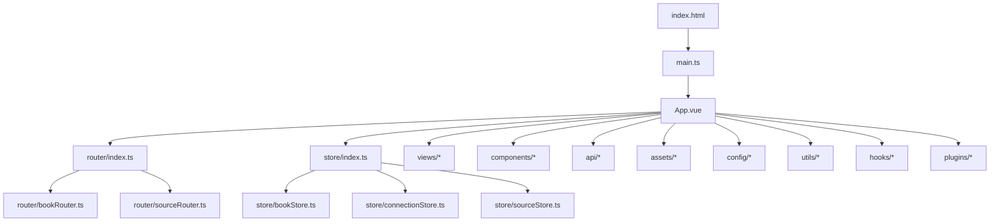
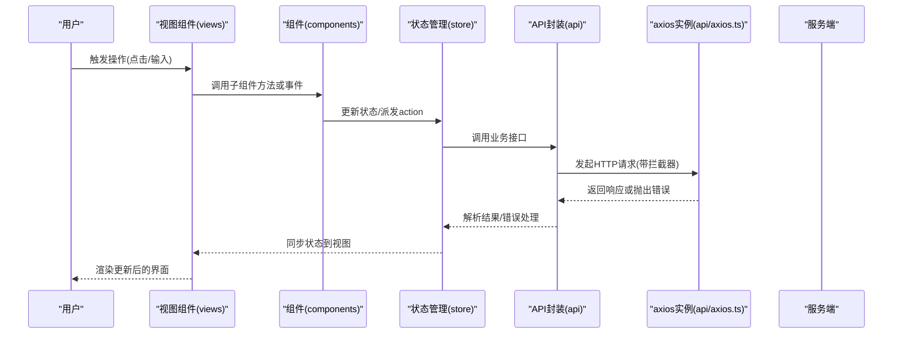
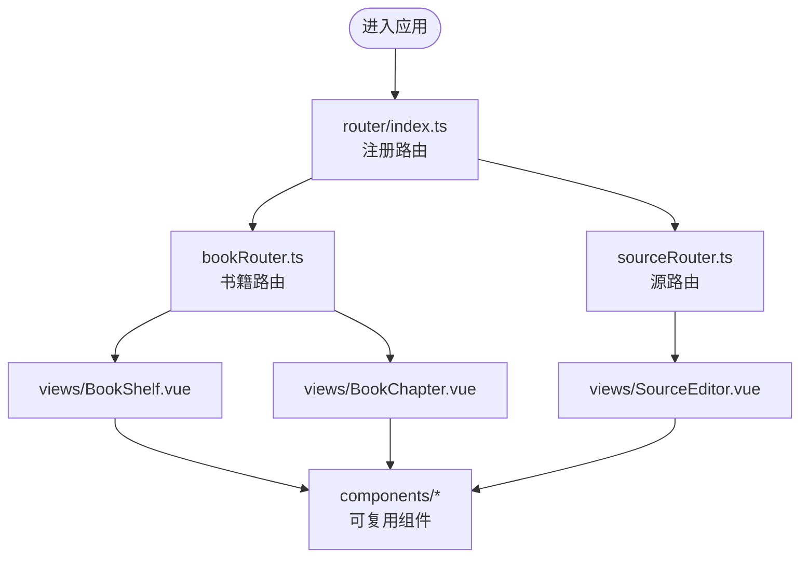
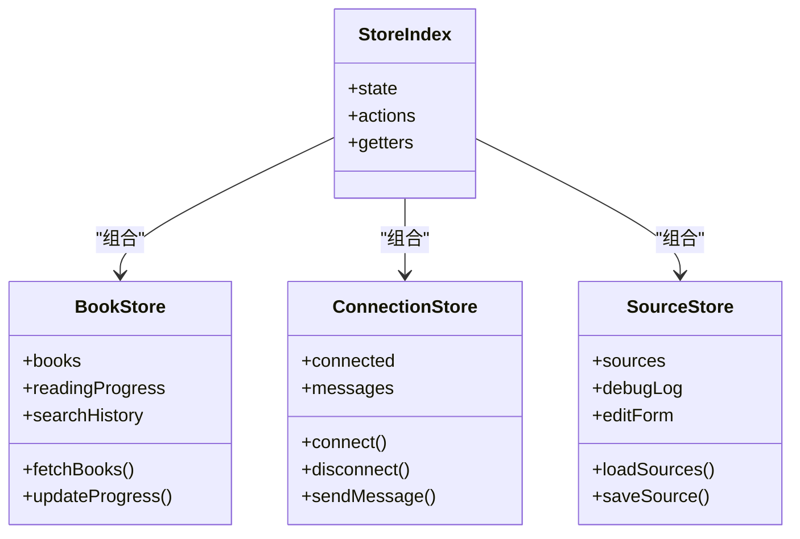
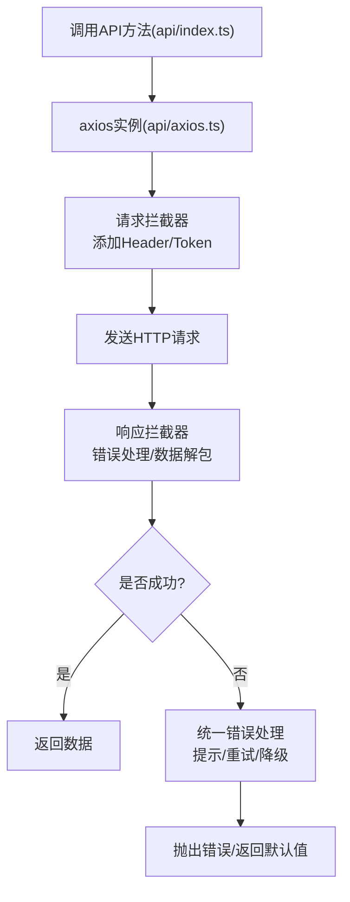
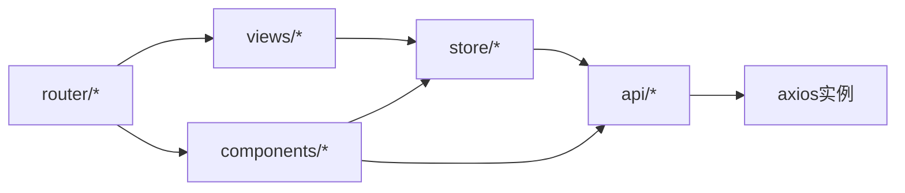

# Web管理界面结构

<cite>
**本文引用的文件**   
- [modules/web/src/main.ts](file://modules/web/src/main.ts)
- [modules/web/src/App.vue](file://modules/web/src/App.vue)
- [modules/web/src/router/index.ts](file://modules/web/src/router/index.ts)
- [modules/web/src/router/bookRouter.ts](file://modules/web/src/router/bookRouter.ts)
- [modules/web/src/router/sourceRouter.ts](file://modules/web/src/router/sourceRouter.ts)
- [modules/web/src/store/index.ts](file://modules/web/src/store/index.ts)
- [modules/web/src/store/bookStore.ts](file://modules/web/src/store/bookStore.ts)
- [modules/web/src/store/connectionStore.ts](file://modules/web/src/store/connectionStore.ts)
- [modules/web/src/store/sourceStore.ts](file://modules/web/src/store/sourceStore.ts)
- [modules/web/src/api/axios.ts](file://modules/web/src/api/axios.ts)
- [modules/web/src/api/index.ts](file://modules/web/src/api/index.ts)
- [modules/web/src/api/api.ts](file://modules/web/src/api/api.ts)
- [modules/web/src/api/sourceToken.ts](file://modules/web/src/api/sourceToken.ts)
- [modules/web/src/views/BookShelf.vue](file://modules/web/src/views/BookShelf.vue)
- [modules/web/src/views/BookChapter.vue](file://modules/web/src/views/BookChapter.vue)
- [modules/web/src/views/SourceEditor.vue](file://modules/web/src/views/SourceEditor.vue)
- [modules/web/src/components/ToolBar.vue](file://modules/web/src/components/ToolBar.vue)
- [modules/web/src/components/BookItems.vue](file://modules/web/src/components/BookItems.vue)
- [modules/web/src/components/CatalogItem.vue](file://modules/web/src/components/CatalogItem.vue)
- [modules/web/src/components/ChapterContent.vue](file://modules/web/src/components/ChapterContent.vue)
- [modules/web/src/components/PopCatalog.vue](file://modules/web/src/components/PopCatalog.vue)
- [modules/web/src/components/ReadSettings.vue](file://modules/web/src/components/ReadSettings.vue)
- [modules/web/src/components/SourceDebug.vue](file://modules/web/src/components/SourceDebug.vue)
- [modules/web/src/components/SourceHelp.vue](file://modules/web/src/components/SourceHelp.vue)
- [modules/web/src/components/SourceItem.vue](file://modules/web/src/components/SourceItem.vue)
- [modules/web/src/components/SourceJson.vue](file://modules/web/src/components/SourceJson.vue)
- [modules/web/src/components/SourceList.vue](file://modules/web/src/components/SourceList.vue)
- [modules/web/src/components/SourceTabForm.vue](file://modules/web/src/components/SourceTabForm.vue)
- [modules/web/src/components/SourceTabTools.vue](file://modules/web/src/components/SourceTabTools.vue)
- [modules/web/src/pages/bookshelf/index.ts](file://modules/web/src/pages/bookshelf/index.ts)
- [modules/web/src/pages/source/index.ts](file://modules/web/src/pages/source/index.ts)
- [modules/web/vite.config.ts](file://modules/web/vite.config.ts)
- [modules/web/package.json](file://modules/web/package.json)
- [modules/web/index.html](file://modules/web/index.html)
- [modules/web/src/assets/bookshelf.css](file://modules/web/src/assets/bookshelf.css)
- [modules/web/src/assets/code.css](file://modules/web/src/assets/code.css)
- [modules/web/src/assets/kbd.css](file://modules/web/src/assets/kbd.css)
- [modules/web/src/assets/sourceeditor.css](file://modules/web/src/assets/sourceeditor.css)
- [modules/web/src/config/themeConfig.ts](file://modules/web/src/config/themeConfig.ts)
- [modules/web/src/config/sourceConfig.d.ts](file://modules/web/src/config/sourceConfig.d.ts)
- [modules/web/src/config/bookSourceEditConfig.ts](file://modules/web/src/config/bookSourceEditConfig.ts)
- [modules/web/src/config/rssSourceEditConfig.ts](file://modules/web/src/config/rssSourceEditConfig.ts)
- [modules/web/src/utils/utils.ts](file://modules/web/src/utils/utils.ts)
- [modules/web/src/utils/souce.ts](file://modules/web/src/utils/souce.ts)
- [modules/web/src/hooks/loading.ts](file://modules/web/src/hooks/loading.ts)
- [modules/web/src/plugins/jump.js](file://modules/web/src/plugins/jump.js)
</cite>

## 目录
1. [简介](#简介)
2. [项目结构](#项目结构)
3. [核心组件](#核心组件)
4. [架构总览](#架构总览)
5. [详细组件分析](#详细组件分析)
6. [依赖关系分析](#依赖关系分析)
7. [性能考虑](#性能考虑)
8. [故障排查指南](#故障排查指南)
9. [结论](#结论)
10. [附录](#附录)

## 简介
本文件面向Web管理界面的Vue.js应用，系统性说明其目录组织、模块划分、单文件组件规范、API封装与错误处理、静态资源管理、构建与开发环境配置、响应式设计与移动端适配方案，以及国际化支持实现方式。目标是帮助开发者快速理解并高效扩展该Web管理界面。

## 项目结构
Web管理界面位于 modules/web 目录，采用典型的Vue 3 + Vite工程结构：
- src/main.ts：应用入口，初始化Vue实例、插件、路由与状态管理。
- src/App.vue：根组件，负责全局布局与页面容器。
- src/router：路由配置，按功能域拆分（bookRouter.ts、sourceRouter.ts），统一在 index.ts 中聚合。
- src/store：状态管理，使用模块化store（bookStore、connectionStore、sourceStore）。
- src/views：页面级视图组件（书架、章节阅读、源编辑器等）。
- src/components：可复用UI组件（工具栏、书籍列表、目录弹窗、阅读设置、源编辑相关组件等）。
- src/pages：按业务域组织的页面入口与路由映射（bookshelf、source）。
- src/api：HTTP客户端封装（axios配置、拦截器、错误处理）与接口定义。
- src/assets：样式与字体等资源（主题样式、代码高亮样式、键盘快捷键样式、源编辑器样式）。
- src/config：配置项（主题、源编辑表单配置、类型声明）。
- src/utils：通用工具函数与辅助逻辑。
- src/hooks：组合式Hook（如加载状态）。
- src/plugins：第三方插件或脚本注入（如跳转定位）。
- vite.config.ts：Vite构建配置（开发服务器、代理、插件、优化）。
- package.json：依赖与脚本命令。
- index.html：HTML模板入口。

图表来源
- [modules/web/src/main.ts](file://modules/web/src/main.ts)
- [modules/web/src/App.vue](file://modules/web/src/App.vue)
- [modules/web/src/router/index.ts](file://modules/web/src/router/index.ts)
- [modules/web/src/router/bookRouter.ts](file://modules/web/src/router/bookRouter.ts)
- [modules/web/src/router/sourceRouter.ts](file://modules/web/src/router/sourceRouter.ts)
- [modules/web/src/store/index.ts](file://modules/web/src/store/index.ts)
- [modules/web/src/store/bookStore.ts](file://modules/web/src/store/bookStore.ts)
- [modules/web/src/store/connectionStore.ts](file://modules/web/src/store/connectionStore.ts)
- [modules/web/src/store/sourceStore.ts](file://modules/web/src/store/sourceStore.ts)
- [modules/web/src/api/axios.ts](file://modules/web/src/api/axios.ts)
- [modules/web/src/api/index.ts](file://modules/web/src/api/index.ts)
- [modules/web/src/api/api.ts](file://modules/web/src/api/api.ts)
- [modules/web/src/api/sourceToken.ts](file://modules/web/src/api/sourceToken.ts)
- [modules/web/src/views/BookShelf.vue](file://modules/web/src/views/BookShelf.vue)
- [modules/web/src/views/BookChapter.vue](file://modules/web/src/views/BookChapter.vue)
- [modules/web/src/views/SourceEditor.vue](file://modules/web/src/views/SourceEditor.vue)
- [modules/web/src/components/ToolBar.vue](file://modules/web/src/components/ToolBar.vue)
- [modules/web/src/components/BookItems.vue](file://modules/web/src/components/BookItems.vue)
- [modules/web/src/components/CatalogItem.vue](file://modules/web/src/components/CatalogItem.vue)
- [modules/web/src/components/ChapterContent.vue](file://modules/web/src/components/ChapterContent.vue)
- [modules/web/src/components/PopCatalog.vue](file://modules/web/src/components/PopCatalog.vue)
- [modules/web/src/components/ReadSettings.vue](file://modules/web/src/components/ReadSettings.vue)
- [modules/web/src/components/SourceDebug.vue](file://modules/web/src/components/SourceDebug.vue)
- [modules/web/src/components/SourceHelp.vue](file://modules/web/src/components/SourceHelp.vue)
- [modules/web/src/components/SourceItem.vue](file://modules/web/src/components/SourceItem.vue)
- [modules/web/src/components/SourceJson.vue](file://modules/web/src/components/SourceJson.vue)
- [modules/web/src/components/SourceList.vue](file://modules/web/src/components/SourceList.vue)
- [modules/web/src/components/SourceTabForm.vue](file://modules/web/src/components/SourceTabForm.vue)
- [modules/web/src/components/SourceTabTools.vue](file://modules/web/src/components/SourceTabTools.vue)
- [modules/web/src/pages/bookshelf/index.ts](file://modules/web/src/pages/bookshelf/index.ts)
- [modules/web/src/pages/source/index.ts](file://modules/web/src/pages/source/index.ts)
- [modules/web/vite.config.ts](file://modules/web/vite.config.ts)
- [modules/web/package.json](file://modules/web/package.json)
- [modules/web/index.html](file://modules/web/index.html)
- [modules/web/src/assets/bookshelf.css](file://modules/web/src/assets/bookshelf.css)
- [modules/web/src/assets/code.css](file://modules/web/src/assets/code.css)
- [modules/web/src/assets/kbd.css](file://modules/web/src/assets/kbd.css)
- [modules/web/src/assets/sourceeditor.css](file://modules/web/src/assets/sourceeditor.css)
- [modules/web/src/config/themeConfig.ts](file://modules/web/src/config/themeConfig.ts)
- [modules/web/src/config/sourceConfig.d.ts](file://modules/web/src/config/sourceConfig.d.ts)
- [modules/web/src/config/bookSourceEditConfig.ts](file://modules/web/src/config/bookSourceEditConfig.ts)
- [modules/web/src/config/rssSourceEditConfig.ts](file://modules/web/src/config/rssSourceEditConfig.ts)
- [modules/web/src/utils/utils.ts](file://modules/web/src/utils/utils.ts)
- [modules/web/src/utils/souce.ts](file://modules/web/src/utils/souce.ts)
- [modules/web/src/hooks/loading.ts](file://modules/web/src/hooks/loading.ts)
- [modules/web/src/plugins/jump.js](file://modules/web/src/plugins/jump.js)

章节来源
- [modules/web/src/main.ts](file://modules/web/src/main.ts)
- [modules/web/src/App.vue](file://modules/web/src/App.vue)
- [modules/web/vite.config.ts](file://modules/web/vite.config.ts)
- [modules/web/package.json](file://modules/web/package.json)
- [modules/web/index.html](file://modules/web/index.html)

## 核心组件
- 应用入口与根组件
  - main.ts：创建Vue应用实例，挂载路由、状态管理、插件，并启动应用。
  - App.vue：根布局容器，承载导航、主内容区与全局样式。
- 路由系统
  - router/index.ts：集中注册路由，按功能域导入bookRouter与sourceRouter。
  - bookRouter.ts：书架、章节阅读等书籍相关路由。
  - sourceRouter.ts：源管理与编辑相关路由。
- 状态管理
  - store/index.ts：组合各模块store，暴露统一的state/actions/getters。
  - bookStore.ts：书籍数据、阅读进度、本地缓存等状态。
  - connectionStore.ts：与服务端连接状态、WebSocket通信等。
  - sourceStore.ts：源列表、调试信息、编辑态等。
- API层
  - api/axios.ts：axios实例配置（基础URL、超时、请求头）、请求/响应拦截器、错误处理。
  - api/index.ts：统一导出API方法，便于调用方按需引入。
  - api/api.ts：具体业务接口定义（如书籍、源管理等）。
  - api/sourceToken.ts：源相关的鉴权与令牌管理。
- 视图与组件
  - views：页面级组件（书架、章节阅读、源编辑器）。
  - components：可复用UI组件（工具栏、书籍列表、目录弹窗、阅读设置、源编辑表单与工具等）。
- 配置与工具
  - config：主题、源编辑表单配置与类型声明。
  - utils：通用工具函数（字符串处理、日期格式化、网络辅助等）。
  - hooks：组合式Hook（如loading状态管理）。
  - plugins：第三方脚本或能力注入（如跳转定位）。

章节来源
- [modules/web/src/main.ts](file://modules/web/src/main.ts)
- [modules/web/src/App.vue](file://modules/web/src/App.vue)
- [modules/web/src/router/index.ts](file://modules/web/src/router/index.ts)
- [modules/web/src/router/bookRouter.ts](file://modules/web/src/router/bookRouter.ts)
- [modules/web/src/router/sourceRouter.ts](file://modules/web/src/router/sourceRouter.ts)
- [modules/web/src/store/index.ts](file://modules/web/src/store/index.ts)
- [modules/web/src/store/bookStore.ts](file://modules/web/src/store/bookStore.ts)
- [modules/web/src/store/connectionStore.ts](file://modules/web/src/store/connectionStore.ts)
- [modules/web/src/store/sourceStore.ts](file://modules/web/src/store/sourceStore.ts)
- [modules/web/src/api/axios.ts](file://modules/web/src/api/axios.ts)
- [modules/web/src/api/index.ts](file://modules/web/src/api/index.ts)
- [modules/web/src/api/api.ts](file://modules/web/src/api/api.ts)
- [modules/web/src/api/sourceToken.ts](file://modules/web/src/api/sourceToken.ts)
- [modules/web/src/views/BookShelf.vue](file://modules/web/src/views/BookShelf.vue)
- [modules/web/src/views/BookChapter.vue](file://modules/web/src/views/BookChapter.vue)
- [modules/web/src/views/SourceEditor.vue](file://modules/web/src/views/SourceEditor.vue)
- [modules/web/src/components/ToolBar.vue](file://modules/web/src/components/ToolBar.vue)
- [modules/web/src/components/BookItems.vue](file://modules/web/src/components/BookItems.vue)
- [modules/web/src/components/CatalogItem.vue](file://modules/web/src/components/CatalogItem.vue)
- [modules/web/src/components/ChapterContent.vue](file://modules/web/src/components/ChapterContent.vue)
- [modules/web/src/components/PopCatalog.vue](file://modules/web/src/components/PopCatalog.vue)
- [modules/web/src/components/ReadSettings.vue](file://modules/web/src/components/ReadSettings.vue)
- [modules/web/src/components/SourceDebug.vue](file://modules/web/src/components/SourceDebug.vue)
- [modules/web/src/components/SourceHelp.vue](file://modules/web/src/components/SourceHelp.vue)
- [modules/web/src/components/SourceItem.vue](file://modules/web/src/components/SourceItem.vue)
- [modules/web/src/components/SourceJson.vue](file://modules/web/src/components/SourceJson.vue)
- [modules/web/src/components/SourceList.vue](file://modules/web/src/components/SourceList.vue)
- [modules/web/src/components/SourceTabForm.vue](file://modules/web/src/components/SourceTabForm.vue)
- [modules/web/src/components/SourceTabTools.vue](file://modules/web/src/components/SourceTabTools.vue)
- [modules/web/src/config/themeConfig.ts](file://modules/web/src/config/themeConfig.ts)
- [modules/web/src/config/sourceConfig.d.ts](file://modules/web/src/config/sourceConfig.d.ts)
- [modules/web/src/config/bookSourceEditConfig.ts](file://modules/web/src/config/bookSourceEditConfig.ts)
- [modules/web/src/config/rssSourceEditConfig.ts](file://modules/web/src/config/rssSourceEditConfig.ts)
- [modules/web/src/utils/utils.ts](file://modules/web/src/utils/utils.ts)
- [modules/web/src/utils/souce.ts](file://modules/web/src/utils/souce.ts)
- [modules/web/src/hooks/loading.ts](file://modules/web/src/hooks/loading.ts)
- [modules/web/src/plugins/jump.js](file://modules/web/src/plugins/jump.js)

## 架构总览
整体架构遵循“入口→根组件→路由→视图/组件→状态管理→API层”的分层模式：
- 入口层：main.ts负责应用初始化与插件装配。
- 表现层：App.vue作为根布局，结合router进行页面切换。
- 业务层：store管理跨组件状态，views与components实现具体业务UI。
- 数据层：api封装HTTP请求，统一处理鉴权、重试与错误。

图表来源
- [modules/web/src/main.ts](file://modules/web/src/main.ts)
- [modules/web/src/App.vue](file://modules/web/src/App.vue)
- [modules/web/src/router/index.ts](file://modules/web/src/router/index.ts)
- [modules/web/src/store/index.ts](file://modules/web/src/store/index.ts)
- [modules/web/src/api/axios.ts](file://modules/web/src/api/axios.ts)
- [modules/web/src/api/index.ts](file://modules/web/src/api/index.ts)
- [modules/web/src/api/api.ts](file://modules/web/src/api/api.ts)

## 详细组件分析

### 路由与页面组织
- 路由分层：bookRouter与sourceRouter分别管理书籍与源相关页面，router/index.ts统一注册。
- 页面组件：views下的BookShelf、BookChapter、SourceEditor对应主要业务页面。
- 页面入口：pages下按功能域组织路由映射与页面入口，便于扩展与维护。

图表来源
- [modules/web/src/router/index.ts](file://modules/web/src/router/index.ts)
- [modules/web/src/router/bookRouter.ts](file://modules/web/src/router/bookRouter.ts)
- [modules/web/src/router/sourceRouter.ts](file://modules/web/src/router/sourceRouter.ts)
- [modules/web/src/views/BookShelf.vue](file://modules/web/src/views/BookShelf.vue)
- [modules/web/src/views/BookChapter.vue](file://modules/web/src/views/BookChapter.vue)
- [modules/web/src/views/SourceEditor.vue](file://modules/web/src/views/SourceEditor.vue)

章节来源
- [modules/web/src/router/index.ts](file://modules/web/src/router/index.ts)
- [modules/web/src/router/bookRouter.ts](file://modules/web/src/router/bookRouter.ts)
- [modules/web/src/router/sourceRouter.ts](file://modules/web/src/router/sourceRouter.ts)
- [modules/web/src/views/BookShelf.vue](file://modules/web/src/views/BookShelf.vue)
- [modules/web/src/views/BookChapter.vue](file://modules/web/src/views/BookChapter.vue)
- [modules/web/src/views/SourceEditor.vue](file://modules/web/src/views/SourceEditor.vue)

### 状态管理（store）
- store/index.ts：组合各模块store，提供统一的state访问与actions调用。
- bookStore.ts：管理书籍列表、阅读进度、收藏、搜索历史等。
- connectionStore.ts：维护与服务端的连接状态、消息队列、重连策略。
- sourceStore.ts：管理源列表、调试日志、编辑表单状态。

图表来源
- [modules/web/src/store/index.ts](file://modules/web/src/store/index.ts)
- [modules/web/src/store/bookStore.ts](file://modules/web/src/store/bookStore.ts)
- [modules/web/src/store/connectionStore.ts](file://modules/web/src/store/connectionStore.ts)
- [modules/web/src/store/sourceStore.ts](file://modules/web/src/store/sourceStore.ts)

章节来源
- [modules/web/src/store/index.ts](file://modules/web/src/store/index.ts)
- [modules/web/src/store/bookStore.ts](file://modules/web/src/store/bookStore.ts)
- [modules/web/src/store/connectionStore.ts](file://modules/web/src/store/connectionStore.ts)
- [modules/web/src/store/sourceStore.ts](file://modules/web/src/store/sourceStore.ts)

### API封装与错误处理
- axios配置：基础URL、超时、请求头、Cookie/Token传递。
- 请求拦截器：附加鉴权信息、请求去重、加载状态控制。
- 响应拦截器：统一错误码处理、数据解包、重试机制。
- 接口定义：按业务域划分（书籍、源、连接等），统一导出。

图表来源
- [modules/web/src/api/axios.ts](file://modules/web/src/api/axios.ts)
- [modules/web/src/api/index.ts](file://modules/web/src/api/index.ts)
- [modules/web/src/api/api.ts](file://modules/web/src/api/api.ts)
- [modules/web/src/api/sourceToken.ts](file://modules/web/src/api/sourceToken.ts)

章节来源
- [modules/web/src/api/axios.ts](file://modules/web/src/api/axios.ts)
- [modules/web/src/api/index.ts](file://modules/web/src/api/index.ts)
- [modules/web/src/api/api.ts](file://modules/web/src/api/api.ts)
- [modules/web/src/api/sourceToken.ts](file://modules/web/src/api/sourceToken.ts)

### 单文件组件（SFC）规范
- 模板（template）：结构化HTML片段，绑定数据与事件。
- 脚本（script）：TypeScript/JavaScript逻辑，包含生命周期、计算属性、方法与副作用。
- 样式（style）：组件私有样式，支持CSS/SCSS/Less，建议使用scoped隔离。
- 命名与组织：组件按功能分组存放于components目录，文件名采用PascalCase，保持单一职责。

章节来源
- [modules/web/src/components/ToolBar.vue](file://modules/web/src/components/ToolBar.vue)
- [modules/web/src/components/BookItems.vue](file://modules/web/src/components/BookItems.vue)
- [modules/web/src/components/CatalogItem.vue](file://modules/web/src/components/CatalogItem.vue)
- [modules/web/src/components/ChapterContent.vue](file://modules/web/src/components/ChapterContent.vue)
- [modules/web/src/components/PopCatalog.vue](file://modules/web/src/components/PopCatalog.vue)
- [modules/web/src/components/ReadSettings.vue](file://modules/web/src/components/ReadSettings.vue)
- [modules/web/src/components/SourceDebug.vue](file://modules/web/src/components/SourceDebug.vue)
- [modules/web/src/components/SourceHelp.vue](file://modules/web/src/components/SourceHelp.vue)
- [modules/web/src/components/SourceItem.vue](file://modules/web/src/components/SourceItem.vue)
- [modules/web/src/components/SourceJson.vue](file://modules/web/src/components/SourceJson.vue)
- [modules/web/src/components/SourceList.vue](file://modules/web/src/components/SourceList.vue)
- [modules/web/src/components/SourceTabForm.vue](file://modules/web/src/components/SourceTabForm.vue)
- [modules/web/src/components/SourceTabTools.vue](file://modules/web/src/components/SourceTabTools.vue)

### 静态资源管理
- 样式文件：assets目录下按功能划分（bookshelf.css、code.css、kbd.css、sourceeditor.css）。
- 图标与字体：assets/fonts与assets/imgs统一管理，通过CSS变量或主题配置动态切换。
- 资源引用：通过相对路径或别名导入，确保构建时正确打包与缓存。

章节来源
- [modules/web/src/assets/bookshelf.css](file://modules/web/src/assets/bookshelf.css)
- [modules/web/src/assets/code.css](file://modules/web/src/assets/code.css)
- [modules/web/src/assets/kbd.css](file://modules/web/src/assets/kbd.css)
- [modules/web/src/assets/sourceeditor.css](file://modules/web/src/assets/sourceeditor.css)
- [modules/web/src/config/themeConfig.ts](file://modules/web/src/config/themeConfig.ts)

### 构建配置与开发环境
- Vite配置：vite.config.ts定义开发服务器、代理、插件、优化策略。
- 热重载：开发模式下自动刷新，提升开发效率。
- 调试工具：集成浏览器开发者工具与Vue Devtools，便于状态与组件调试。
- 脚本命令：package.json提供dev/build等常用命令。

章节来源
- [modules/web/vite.config.ts](file://modules/web/vite.config.ts)
- [modules/web/package.json](file://modules/web/package.json)
- [modules/web/index.html](file://modules/web/index.html)

### 响应式设计与移动端适配
- 媒体查询：在样式中使用@media适配不同屏幕尺寸。
- 弹性布局：优先使用Flexbox/Grid实现自适应布局。
- 触摸交互：为移动端优化点击区域与手势支持。
- 字体与图标：使用矢量图标与自适应字体，确保清晰度。

章节来源
- [modules/web/src/assets/bookshelf.css](file://modules/web/src/assets/bookshelf.css)
- [modules/web/src/assets/sourceeditor.css](file://modules/web/src/assets/sourceeditor.css)
- [modules/web/src/config/themeConfig.ts](file://modules/web/src/config/themeConfig.ts)

### 国际化支持
- 语言包：按语言分文件存放（如zh、en、ja等），通过键值对管理文案。
- 动态切换：根据用户选择或系统语言动态加载对应语言包。
- 组件内使用：在模板与脚本中通过i18n API获取翻译文本。

章节来源
- [modules/web/src/config/themeConfig.ts](file://modules/web/src/config/themeConfig.ts)
- [modules/web/src/utils/utils.ts](file://modules/web/src/utils/utils.ts)

## 依赖关系分析
- 模块耦合：router依赖views与components；store被views与components共享；api被store与components调用。
- 外部依赖：axios用于HTTP请求，Vue Router用于路由，状态管理库（如Pinia/Vuex）用于状态。
- 潜在循环：避免store与api相互直接引用，建议通过中间层或事件总线解耦。

图表来源
- [modules/web/src/router/index.ts](file://modules/web/src/router/index.ts)
- [modules/web/src/views/BookShelf.vue](file://modules/web/src/views/BookShelf.vue)
- [modules/web/src/components/ToolBar.vue](file://modules/web/src/components/ToolBar.vue)
- [modules/web/src/store/index.ts](file://modules/web/src/store/index.ts)
- [modules/web/src/api/axios.ts](file://modules/web/src/api/axios.ts)

章节来源
- [modules/web/src/router/index.ts](file://modules/web/src/router/index.ts)
- [modules/web/src/store/index.ts](file://modules/web/src/store/index.ts)
- [modules/web/src/api/axios.ts](file://modules/web/src/api/axios.ts)

## 性能考虑
- 组件懒加载：路由级别与组件级别按需加载，减少首屏体积。
- 请求优化：合并请求、缓存策略、防抖节流。
- 样式优化：按需引入样式，避免全局污染。
- 内存管理：及时清理定时器与事件监听，避免泄漏。

[本节为通用指导，不直接分析具体文件]

## 故障排查指南
- 路由问题：检查router/index.ts与各功能路由是否正确注册，确认页面组件路径。
- 状态异常：查看store模块的state与actions是否正确更新，必要时添加日志。
- API错误：检查axios拦截器与错误处理逻辑，确认服务端返回格式与状态码。
- 样式冲突：使用开发者工具检查样式覆盖与优先级，必要时使用CSS Modules或Scoped样式。

章节来源
- [modules/web/src/router/index.ts](file://modules/web/src/router/index.ts)
- [modules/web/src/store/index.ts](file://modules/web/src/store/index.ts)
- [modules/web/src/api/axios.ts](file://modules/web/src/api/axios.ts)

## 结论
本Web管理界面采用清晰的Vue 3 + Vite工程结构，通过模块化路由、状态管理与API封装，实现了良好的可维护性与扩展性。遵循单文件组件规范与静态资源管理策略，结合响应式设计与国际化支持，能够高效支撑多端适配与多语言需求。建议在后续迭代中持续优化性能与错误处理，提升用户体验。

[本节为总结性内容，不直接分析具体文件]

## 附录
- 开发命令：参考package.json中的scripts。
- 构建产物：dist目录由Vite生成，部署至静态服务器即可。
- 调试技巧：启用Vue Devtools与浏览器开发者工具，结合console.log与断点调试。

[本节为补充信息，不直接分析具体文件]