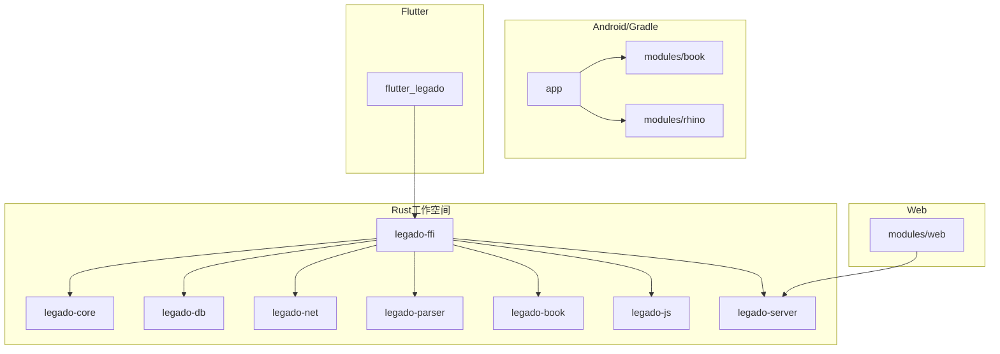
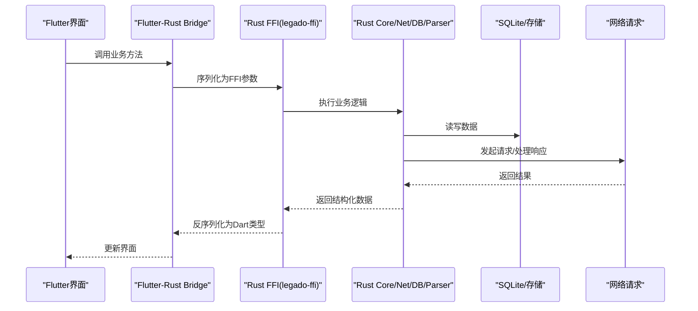
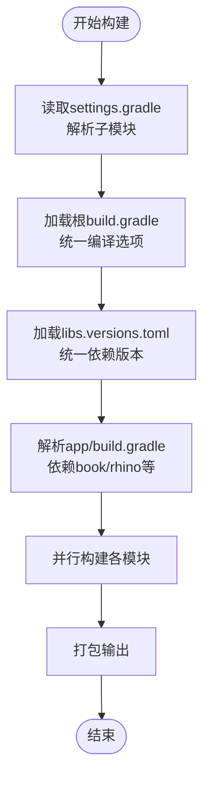
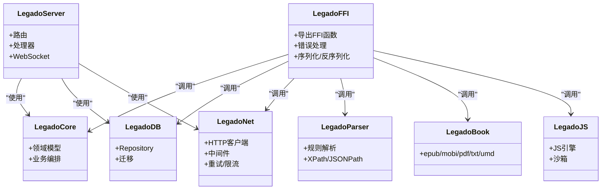
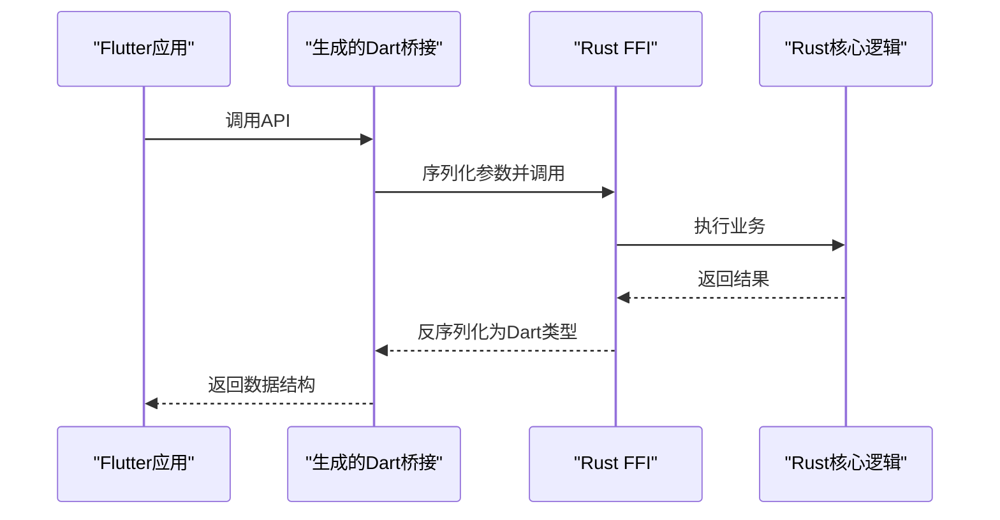
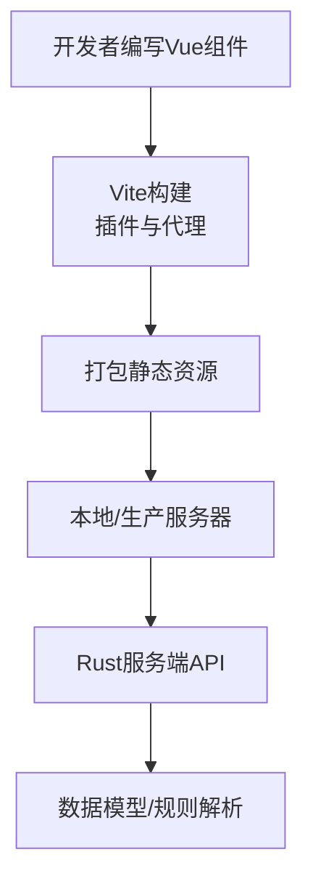
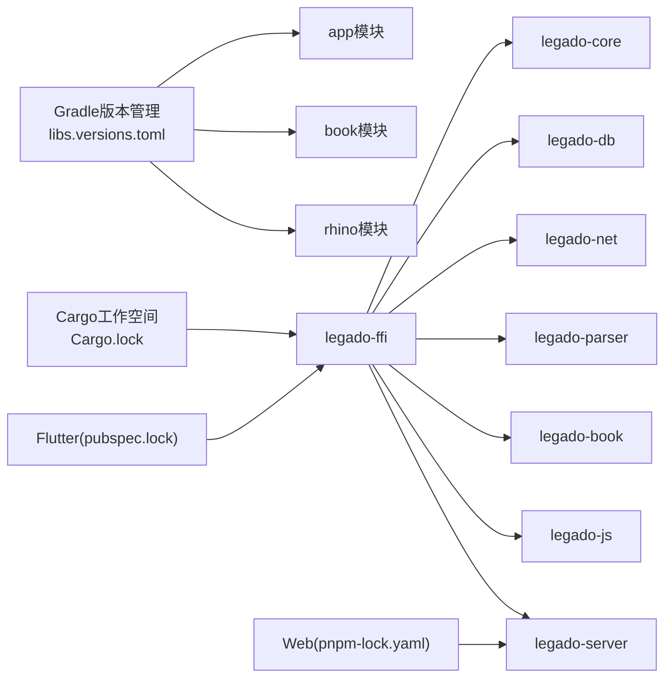

# 模块依赖关系

<cite>
**本文引用的文件**   
- [settings.gradle](file://settings.gradle)
- [build.gradle](file://build.gradle)
- [gradle/libs.versions.toml](file://gradle/libs.versions.toml)
- [app/build.gradle](file://app/build.gradle)
- [modules/book/build.gradle](file://modules/book/build.gradle)
- [modules/rhino/build.gradle](file://modules/rhino/build.gradle)
- [flutter_legado/pubspec.yaml](file://flutter_legado/pubspec.yaml)
- [flutter_legado/flutter_rust_bridge.yaml](file://flutter_legado/flutter_rust_bridge.yaml)
- [rust/Cargo.toml](file://rust/Cargo.toml)
- [rust/legado-ffi/Cargo.toml](file://rust/legado-ffi/Cargo.toml)
- [rust/legado-core/Cargo.toml](file://rust/legado-core/Cargo.toml)
- [rust/legado-db/Cargo.toml](file://rust/legado-db/Cargo.toml)
- [rust/legado-net/Cargo.toml](file://rust/legado-net/Cargo.toml)
- [rust/legado-parser/Cargo.toml](file://rust/legado-parser/Cargo.toml)
- [rust/legado-book/Cargo.toml](file://rust/legado-book/Cargo.toml)
- [rust/legado-js/Cargo.toml](file://rust/legado-js/Cargo.toml)
- [rust/legado-server/Cargo.toml](file://rust/legado-server/Cargo.toml)
- [modules/web/package.json](file://modules/web/package.json)
- [modules/web/vite.config.ts](file://modules/web/vite.config.ts)
</cite>

## 目录
1. [简介](#简介)
2. [项目结构](#项目结构)
3. [核心组件](#核心组件)
4. [架构总览](#架构总览)
5. [详细组件分析](#详细组件分析)
6. [依赖分析](#依赖分析)
7. [性能考虑](#性能考虑)
8. [故障排查指南](#故障排查指南)
9. [结论](#结论)
10. [附录](#附录)

## 简介
本文件面向Legado多语言、多模块工程，系统性梳理Gradle多模块、Rust Cargo工作空间、Flutter与Web的依赖管理与数据流转机制。重点覆盖：
- Gradle模块间引用、版本统一管理（libs.versions.toml）、构建优化策略
- Rust工作空间crate依赖、内部模块调用、外部库集成、特征标志配置
- Flutter包依赖、平台特定依赖、本地插件集成
- Web项目的npm依赖、Vue生态、构建工具链与开发工具配置
- 跨平台数据共享策略（FFI接口设计、序列化格式、类型定义同步）
- 构建时依赖解析与冲突解决机制，以及依赖版本升级最佳实践

## 项目结构
本项目由四大子系统构成：
- Android应用与Gradle多模块（app、modules/book、modules/rhino等）
- Rust工作空间（legado-* crate集合，通过FFI暴露给上层）
- Flutter跨平台客户端（flutter_legado）
- Web管理端（modules/web，基于Vue/Vite）

图表来源 
- [settings.gradle](file://settings.gradle)
- [build.gradle](file://build.gradle)
- [app/build.gradle](file://app/build.gradle)
- [modules/book/build.gradle](file://modules/book/build.gradle)
- [modules/rhino/build.gradle](file://modules/rhino/build.gradle)
- [rust/Cargo.toml](file://rust/Cargo.toml)
- [rust/legado-ffi/Cargo.toml](file://rust/legado-ffi/Cargo.toml)
- [flutter_legado/pubspec.yaml](file://flutter_legado/pubspec.yaml)
- [modules/web/package.json](file://modules/web/package.json)

章节来源
- [settings.gradle](file://settings.gradle)
- [build.gradle](file://build.gradle)
- [app/build.gradle](file://app/build.gradle)
- [modules/book/build.gradle](file://modules/book/build.gradle)
- [modules/rhino/build.gradle](file://modules/rhino/build.gradle)
- [rust/Cargo.toml](file://rust/Cargo.toml)
- [flutter_legado/pubspec.yaml](file://flutter_legado/pubspec.yaml)
- [modules/web/package.json](file://modules/web/package.json)

## 核心组件
- Gradle多模块
  - 根级settings.gradle声明子模块；根build.gradle统一编译选项；gradle/libs.versions.toml集中管理第三方版本
  - app依赖book与rhino等模块，实现业务逻辑与脚本引擎能力
- Rust工作空间
  - Cargo.toml定义workspace成员；各crate按职责拆分（core/db/net/parser/book/js/server/ffi）
  - legado-ffi作为对外桥接层，生成FFI供Flutter/Dart或Android调用
- Flutter客户端
  - pubspec.yaml声明Dart包与平台依赖；通过flutter_rust_bridge.yaml驱动代码生成，调用Rust FFI
- Web管理端
  - modules/web使用package.json与vite.config.ts组织Vue生态与构建流程，并通过API与后端服务交互

章节来源
- [settings.gradle](file://settings.gradle)
- [build.gradle](file://build.gradle)
- [gradle/libs.versions.toml](file://gradle/libs.versions.toml)
- [app/build.gradle](file://app/build.gradle)
- [modules/book/build.gradle](file://modules/book/build.gradle)
- [modules/rhino/build.gradle](file://modules/rhino/build.gradle)
- [rust/Cargo.toml](file://rust/Cargo.toml)
- [rust/legado-ffi/Cargo.toml](file://rust/legado-ffi/Cargo.toml)
- [flutter_legado/pubspec.yaml](file://flutter_legado/pubspec.yaml)
- [flutter_legado/flutter_rust_bridge.yaml](file://flutter_legado/flutter_rust_bridge.yaml)
- [modules/web/package.json](file://modules/web/package.json)
- [modules/web/vite.config.ts](file://modules/web/vite.config.ts)

## 架构总览
整体数据流与依赖关系如下：
- Flutter通过FFI调用Rust FFI层，Rust内部协调core/db/net/parser等crate完成数据处理、持久化与网络请求
- Android应用通过Gradle模块组合业务功能，并可与Rust产物协同（如通过JNI/FFI桥接）
- Web前端通过HTTP/WebSocket与Rust服务端通信，复用同一套数据模型与规则解析能力

图表来源 
- [flutter_legado/flutter_rust_bridge.yaml](file://flutter_legado/flutter_rust_bridge.yaml)
- [rust/legado-ffi/Cargo.toml](file://rust/legado-ffi/Cargo.toml)
- [rust/legado-core/Cargo.toml](file://rust/legado-core/Cargo.toml)
- [rust/legado-db/Cargo.toml](file://rust/legado-db/Cargo.toml)
- [rust/legado-net/Cargo.toml](file://rust/legado-net/Cargo.toml)

## 详细组件分析

### Gradle多模块依赖与版本管理
- 模块划分与引用
  - settings.gradle声明所有子模块，确保构建系统识别
  - app模块依赖modules/book与modules/rhino，形成“应用+领域库+脚本引擎”的分层
- 版本统一管理
  - gradle/libs.versions.toml集中定义第三方库版本，避免散落在各处build.gradle导致不一致
- 构建优化策略
  - 根build.gradle统一编译目标、Kotlin/AGP版本与全局属性
  - 按需启用ProGuard/R8规则，减少APK体积
  - 利用Gradle缓存、并行构建与配置分离提升构建速度

图表来源 
- [settings.gradle](file://settings.gradle)
- [build.gradle](file://build.gradle)
- [gradle/libs.versions.toml](file://gradle/libs.versions.toml)
- [app/build.gradle](file://app/build.gradle)
- [modules/book/build.gradle](file://modules/book/build.gradle)
- [modules/rhino/build.gradle](file://modules/rhino/build.gradle)

章节来源
- [settings.gradle](file://settings.gradle)
- [build.gradle](file://build.gradle)
- [gradle/libs.versions.toml](file://gradle/libs.versions.toml)
- [app/build.gradle](file://app/build.gradle)
- [modules/book/build.gradle](file://modules/book/build.gradle)
- [modules/rhino/build.gradle](file://modules/rhino/build.gradle)

### Rust工作空间与Crate依赖
- 工作空间组织
  - rust/Cargo.toml定义workspace成员，聚合多个crate便于统一构建与依赖管理
- Crate职责与依赖
  - legado-core：核心模型与通用逻辑
  - legado-db：数据库访问与迁移
  - legado-net：网络请求、代理、重试、速率限制等
  - legado-parser：规则解析、XPath/JSONPath/正则引擎
  - legado-book：电子书格式处理（epub/mobi/pdf/txt/umd）
  - legado-js：JavaScript引擎与沙箱
  - legado-server：HTTP/WebSocket服务
  - legado-ffi：对外FFI接口，供Flutter/Dart或Android调用
- 特征标志配置
  - 通过Cargo features控制可选功能（如不同网络后端、加密算法、平台特性），在顶层Cargo.toml与各crate中声明

图表来源 
- [rust/Cargo.toml](file://rust/Cargo.toml)
- [rust/legado-ffi/Cargo.toml](file://rust/legado-ffi/Cargo.toml)
- [rust/legado-core/Cargo.toml](file://rust/legado-core/Cargo.toml)
- [rust/legado-db/Cargo.toml](file://rust/legado-db/Cargo.toml)
- [rust/legado-net/Cargo.toml](file://rust/legado-net/Cargo.toml)
- [rust/legado-parser/Cargo.toml](file://rust/legado-parser/Cargo.toml)
- [rust/legado-book/Cargo.toml](file://rust/legado-book/Cargo.toml)
- [rust/legado-js/Cargo.toml](file://rust/legado-js/Cargo.toml)
- [rust/legado-server/Cargo.toml](file://rust/legado-server/Cargo.toml)

章节来源
- [rust/Cargo.toml](file://rust/Cargo.toml)
- [rust/legado-ffi/Cargo.toml](file://rust/legado-ffi/Cargo.toml)
- [rust/legado-core/Cargo.toml](file://rust/legado-core/Cargo.toml)
- [rust/legado-db/Cargo.toml](file://rust/legado-db/Cargo.toml)
- [rust/legado-net/Cargo.toml](file://rust/legado-net/Cargo.toml)
- [rust/legado-parser/Cargo.toml](file://rust/legado-parser/Cargo.toml)
- [rust/legado-book/Cargo.toml](file://rust/legado-book/Cargo.toml)
- [rust/legado-js/Cargo.toml](file://rust/legado-js/Cargo.toml)
- [rust/legado-server/Cargo.toml](file://rust/legado-server/Cargo.toml)

### Flutter依赖管理与FFI集成
- Dart包依赖
  - pubspec.yaml声明业务依赖、测试与平台相关包
- 平台特定依赖
  - Android/iOS/Linux/macOS/Windows各自平台配置，保证原生能力可用
- 本地插件集成
  - 通过flutter_rust_bridge.yaml驱动代码生成，将Rust FFI映射为Dart API
- 数据流转
  - Flutter调用生成的Dart方法，底层通过FFI与Rust交互，完成数据序列化/反序列化

图表来源 
- [flutter_legado/pubspec.yaml](file://flutter_legado/pubspec.yaml)
- [flutter_legado/flutter_rust_bridge.yaml](file://flutter_legado/flutter_rust_bridge.yaml)
- [rust/legado-ffi/Cargo.toml](file://rust/legado-ffi/Cargo.toml)

章节来源
- [flutter_legado/pubspec.yaml](file://flutter_legado/pubspec.yaml)
- [flutter_legado/flutter_rust_bridge.yaml](file://flutter_legado/flutter_rust_bridge.yaml)

### Web项目依赖与构建
- npm依赖管理
  - package.json声明Vue生态、工具链与运行时依赖
- 构建工具链
  - vite.config.ts配置Vite构建、插件、代理与输出
- 开发工具配置
  - ESLint/Prettier/TsConfig等保障代码质量与一致性
- 与后端交互
  - 通过HTTP/WebSocket与Rust服务端通信，复用同一数据模型与规则

图表来源 
- [modules/web/package.json](file://modules/web/package.json)
- [modules/web/vite.config.ts](file://modules/web/vite.config.ts)

章节来源
- [modules/web/package.json](file://modules/web/package.json)
- [modules/web/vite.config.ts](file://modules/web/vite.config.ts)

## 依赖分析
- 耦合与内聚
  - Gradle模块按职责拆分，app高内聚业务，book/rhino提供稳定能力
  - Rust crate边界清晰，FFI作为唯一对外契约，降低上层耦合
- 直接/间接依赖
  - Flutter仅依赖FFI生成的Dart API，不直接感知Rust实现细节
  - Web通过HTTP与Rust服务解耦，可独立演进
- 循环依赖
  - 通过FFI与API边界避免循环；Cargo workspace与Gradle子模块均无环
- 外部依赖与集成点
  - Gradle libs.versions.toml集中第三方版本
  - Cargo.lock锁定Rust依赖版本
  - Flutter pubspec.lock锁定Dart依赖
  - Web pnpm-lock.yaml锁定npm依赖

图表来源 
- [gradle/libs.versions.toml](file://gradle/libs.versions.toml)
- [rust/Cargo.toml](file://rust/Cargo.toml)
- [rust/legado-ffi/Cargo.toml](file://rust/legado-ffi/Cargo.toml)
- [flutter_legado/pubspec.yaml](file://flutter_legado/pubspec.yaml)
- [modules/web/package.json](file://modules/web/package.json)

章节来源
- [gradle/libs.versions.toml](file://gradle/libs.versions.toml)
- [rust/Cargo.toml](file://rust/Cargo.toml)
- [flutter_legado/pubspec.yaml](file://flutter_legado/pubspec.yaml)
- [modules/web/package.json](file://modules/web/package.json)

## 性能考虑
- Gradle
  - 启用并行构建、配置缓存与增量编译；合理拆分模块减少单模块体积
  - 使用libs.versions.toml避免重复解析与冲突
- Rust
  - 通过features按需编译，减少二进制体积与启动时间
  - 使用异步IO与连接池优化网络与数据库访问
- Flutter
  - 按需引入Dart包，避免臃肿；合理使用平台通道与FFI开销
- Web
  - Vite按需加载与代码分割；CDN与缓存策略优化首屏

[本节为通用指导，无需具体文件引用]

## 故障排查指南
- Gradle依赖冲突
  - 检查libs.versions.toml与模块build.gradle中的版本是否一致
  - 使用依赖树命令定位冲突并强制统一版本
- Rust编译失败
  - 确认Cargo.lock与Cargo.toml中features匹配；清理target后重试
  - 检查FFI签名与Dart侧类型映射是否一致
- Flutter运行异常
  - 核对pubspec.lock与平台依赖；重新生成bridge代码
  - 检查FFI返回值与空安全处理
- Web构建问题
  - 校验vite.config.ts插件与代理配置；清理node_modules后重装

章节来源
- [gradle/libs.versions.toml](file://gradle/libs.versions.toml)
- [rust/Cargo.toml](file://rust/Cargo.toml)
- [flutter_legado/flutter_rust_bridge.yaml](file://flutter_legado/flutter_rust_bridge.yaml)
- [modules/web/vite.config.ts](file://modules/web/vite.config.ts)

## 结论
本项目通过Gradle、Cargo、Flutter与Web的多栈协作，实现了清晰的模块边界与稳定的数据流转。借助统一的版本管理、严格的FFI契约与合理的构建优化，既保证了跨平台一致性，又提升了开发与维护效率。建议持续遵循本文的最佳实践，保持依赖透明与可追溯。

[本节为总结性内容，无需具体文件引用]

## 附录
- 依赖版本升级最佳实践
  - Gradle：优先在libs.versions.toml中升级，验证各模块兼容性后再提交
  - Rust：使用cargo update谨慎升级，结合CI自动化测试；必要时调整features
  - Flutter：定期更新pub依赖，关注breaking changes；重新生成bridge代码
  - Web：使用pnpm进行依赖锁定与快速安装；升级前执行lint与单元测试
- 跨平台数据共享策略
  - FFI接口设计：明确输入输出类型、错误码与生命周期
  - 序列化格式：优先使用稳定、跨语言的格式（如JSON/Protobuf）
  - 类型定义同步：通过代码生成（如flutter_rust_bridge）确保类型一致

[本节为补充说明，无需具体文件引用]