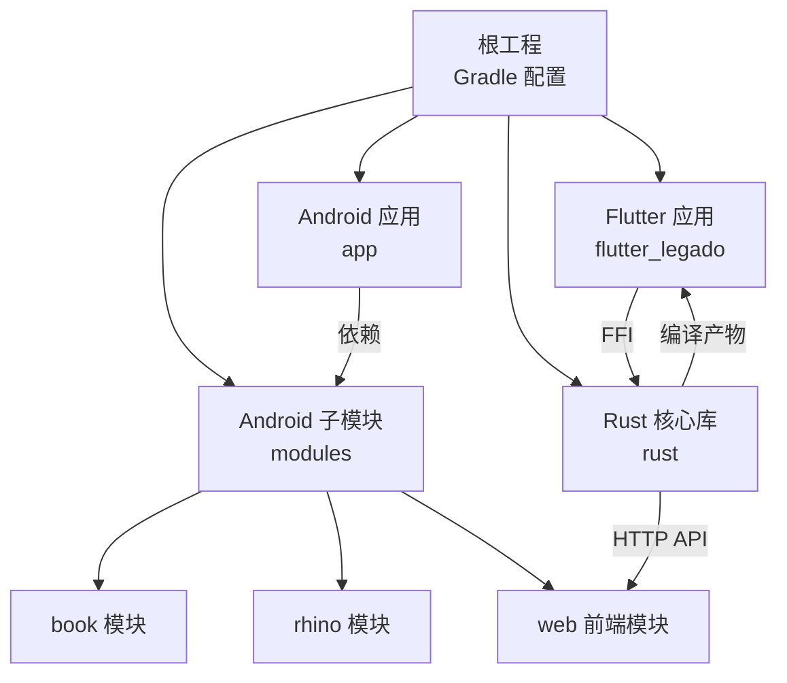
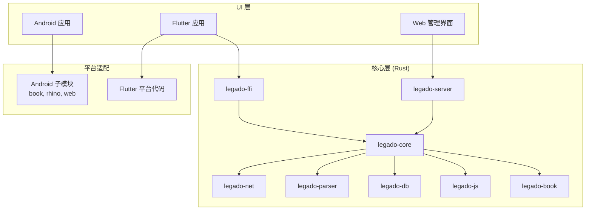
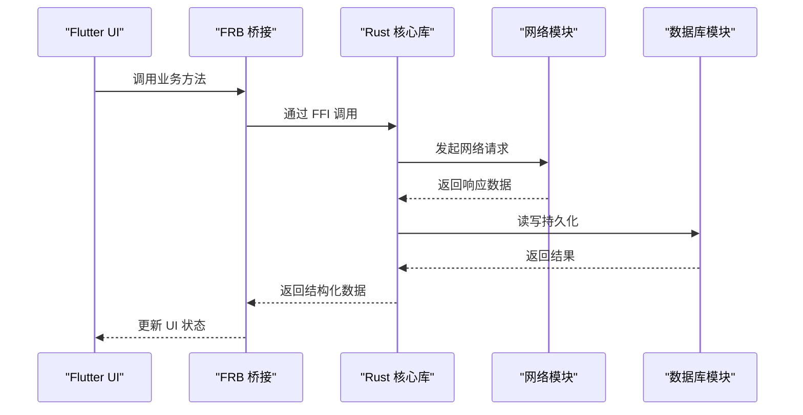
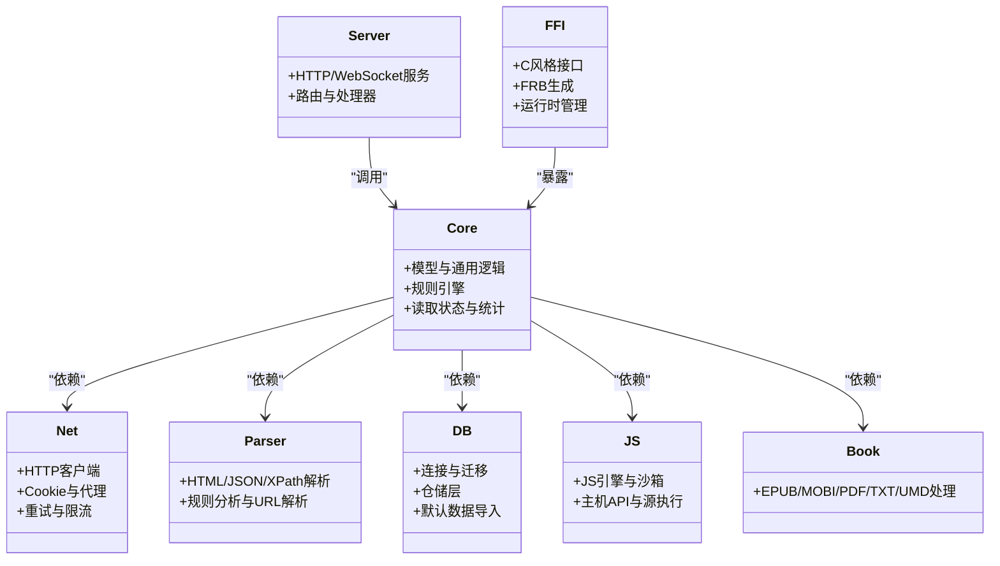
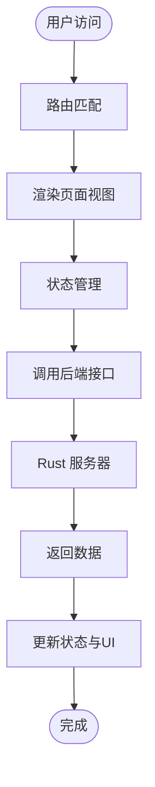
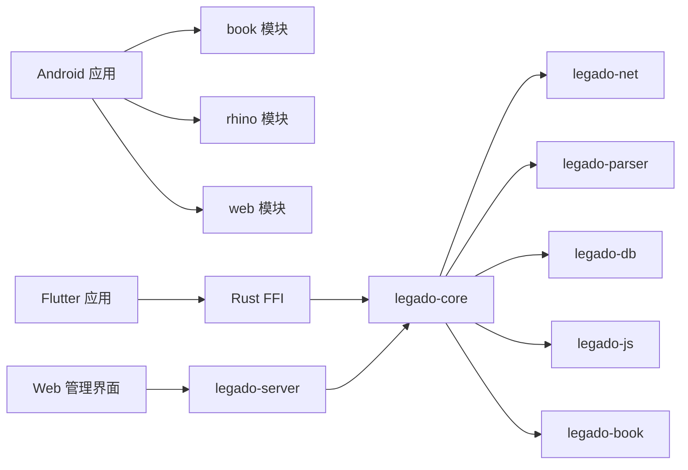

# 项目结构

<cite>
**本文引用的文件**   
- [README.md](file://README.md)
- [build.gradle](file://build.gradle)
- [settings.gradle](file://settings.gradle)
- [gradle.properties](file://gradle.properties)
- [app/build.gradle](file://app/build.gradle)
- [app/src/main/AndroidManifest.xml](file://app/src/main/AndroidManifest.xml)
- [flutter_legado/pubspec.yaml](file://flutter_legado/pubspec.yaml)
- [flutter_legado/lib/main.dart](file://flutter_legado/lib/main.dart)
- [flutter_legado/lib/app.dart](file://flutter_legado/lib/app.dart)
- [flutter_legado/flutter_rust_bridge.yaml](file://flutter_legado/flutter_rust_bridge.yaml)
- [modules/book/build.gradle](file://modules/book/build.gradle)
- [modules/rhino/build.gradle](file://modules/rhino/build.gradle)
- [modules/web/package.json](file://modules/web/package.json)
- [modules/web/vite.config.ts](file://modules/web/vite.config.ts)
- [rust/Cargo.toml](file://rust/Cargo.toml)
- [rust/legado-core/Cargo.toml](file://rust/legado-core/Cargo.toml)
- [rust/legado-ffi/Cargo.toml](file://rust/legado-ffi/Cargo.toml)
- [rust/legado-js/Cargo.toml](file://rust/legado-js/Cargo.toml)
- [rust/legado-net/Cargo.toml](file://rust/legado-net/Cargo.toml)
- [rust/legado-parser/Cargo.toml](file://rust/legado-parser/Cargo.toml)
- [rust/legado-server/Cargo.toml](file://rust/legado-server/Cargo.toml)
- [rust/legado-db/Cargo.toml](file://rust/legado-db/Cargo.toml)
- [rust/legado-book/Cargo.toml](file://rust/legado-book/Cargo.toml)
</cite>

## 目录
1. [简介](#简介)
2. [项目结构](#项目结构)
3. [核心组件](#核心组件)
4. [架构总览](#架构总览)
5. [详细组件分析](#详细组件分析)
6. [依赖关系分析](#依赖关系分析)
7. [性能考量](#性能考量)
8. [故障排查指南](#故障排查指南)
9. [结论](#结论)
10. [附录](#附录)（如有需要）

## 简介
本项目是一个跨平台阅读与内容管理应用，采用多语言、多模块、多端协同的架构：
- Android 原生应用提供完整功能与系统级集成。
- Flutter 跨平台应用作为新的 UI 层，通过 Rust FFI 调用核心能力。
- Rust 核心库以模块化 crate 组织，提供网络、解析、数据库、音频、规则引擎等通用能力，并通过 FFI 暴露接口。
- Web 管理界面基于 Vue.js + Vite，用于在线编辑源、书架管理等后台操作。

本文件从整体结构、模块职责、数据流与依赖关系入手，帮助读者快速理解并高效参与开发。

## 项目结构
仓库采用“多工程聚合”的组织方式：
- 根目录包含 Gradle 配置与脚本，统一构建入口。
- app 为 Android 主工程，包含 Java/Kotlin 源码、资源与清单。
- flutter_legado 为 Flutter 工程，包含 Dart 源码与多平台宿主。
- modules 为 Android 子模块（book、rhino、web），供 app 复用。
- rust 为 Rust 工作区，按功能拆分为多个 crate，并通过 FFI 对外暴露。
- 其他如 .github、gradle 等为工具链与 CI 配置。

**图表来源** 
- [build.gradle](file://build.gradle)
- [settings.gradle](file://settings.gradle)
- [app/build.gradle](file://app/build.gradle)
- [flutter_legado/pubspec.yaml](file://flutter_legado/pubspec.yaml)
- [rust/Cargo.toml](file://rust/Cargo.toml)

**章节来源**
- [README.md](file://README.md)
- [build.gradle](file://build.gradle)
- [settings.gradle](file://settings.gradle)
- [gradle.properties](file://gradle.properties)

## 核心组件
- Android 应用（app）
  - 包组织：按功能划分 base、ui、model、service、utils、lib、help、data、constant、exception、receiver、api、web 等。
  - 资源：res 下按类型与多语言组织；assets 存放静态资源（字体、脚本、模板、默认数据等）。
  - 配置：AndroidManifest.xml 声明权限、组件、启动项等；build.gradle 定义依赖与构建选项。
- Flutter 应用（flutter_legado）
  - lib 目录：main.dart 为入口，app.dart 定义应用装配，src 存放业务逻辑与页面。
  - 平台特定代码：android、ios、windows、macos、linux 等目录分别维护各平台宿主与插件注册。
  - 依赖管理：pubspec.yaml 管理 Dart 依赖；flutter_rust_bridge.yaml 配置 FRB 生成。
- Rust 核心库（rust）
  - crate 划分：core、ffi、js、net、parser、server、db、book 等，职责清晰、边界明确。
  - 模块依赖：core 提供模型与通用逻辑；net 负责网络；parser 处理 HTML/JSON/XPath；db 封装持久化；server 提供 HTTP/WebSocket；ffi 暴露 C 风格接口；js 提供脚本执行环境；book 处理电子书格式。
  - FFI 接口：通过 FRB 或手动桥接暴露给 Flutter/Android。
- Web 管理界面（modules/web）
  - Vue 组件：components、views、pages 分层组织；store 使用状态管理；router 路由配置；api 封装后端请求。
  - 静态资源：assets 下 fonts、imgs 等；构建由 vite.config.ts 管理。
  - 依赖管理：package.json 管理 npm/pnpm 依赖。

**章节来源**
- [app/src/main/AndroidManifest.xml](file://app/src/main/AndroidManifest.xml)
- [app/build.gradle](file://app/build.gradle)
- [flutter_legado/lib/main.dart](file://flutter_legado/lib/main.dart)
- [flutter_legado/lib/app.dart](file://flutter_legado/lib/app.dart)
- [flutter_legado/pubspec.yaml](file://flutter_legado/pubspec.yaml)
- [flutter_legado/flutter_rust_bridge.yaml](file://flutter_legado/flutter_rust_bridge.yaml)
- [modules/web/package.json](file://modules/web/package.json)
- [modules/web/vite.config.ts](file://modules/web/vite.config.ts)
- [rust/Cargo.toml](file://rust/Cargo.toml)

## 架构总览
整体架构遵循“前端 UI + 核心能力 + 平台适配”的分层设计：
- UI 层：Android Jetpack Compose/XML 与 Flutter 双 UI 栈并存，逐步迁移至 Flutter。
- 核心层：Rust 提供高性能、跨平台的通用能力（网络、解析、音频、规则、存储等）。
- 平台适配层：Android 原生模块与 Flutter 平台代码负责系统交互与 FFI 桥接。
- Web 管理面：Vue 应用通过 HTTP/WebSocket 与 Rust server 通信，实现远程管理与调试。

**图表来源** 
- [rust/Cargo.toml](file://rust/Cargo.toml)
- [rust/legado-core/Cargo.toml](file://rust/legado-core/Cargo.toml)
- [rust/legado-ffi/Cargo.toml](file://rust/legado-ffi/Cargo.toml)
- [rust/legado-net/Cargo.toml](file://rust/legado-net/Cargo.toml)
- [rust/legado-parser/Cargo.toml](file://rust/legado-parser/Cargo.toml)
- [rust/legado-db/Cargo.toml](file://rust/legado-db/Cargo.toml)
- [rust/legado-js/Cargo.toml](file://rust/legado-js/Cargo.toml)
- [rust/legado-server/Cargo.toml](file://rust/legado-server/Cargo.toml)
- [rust/legado-book/Cargo.toml](file://rust/legado-book/Cargo.toml)
- [app/build.gradle](file://app/build.gradle)
- [flutter_legado/pubspec.yaml](file://flutter_legado/pubspec.yaml)
- [modules/web/package.json](file://modules/web/package.json)

## 详细组件分析

### Android 应用（app）
- 包组织原则
  - ui：页面与组件，按功能域拆分（如 book、source、reader 等）。
  - model：领域模型与数据实体。
  - service：后台服务（播放、下载、同步等）。
  - utils：工具类（网络、压缩、加密、时间等）。
  - help：辅助逻辑（规则解析、源管理、缓存策略等）。
  - data：数据访问层（DAO、Repository、Room 等）。
  - constant：常量与配置。
  - exception：异常定义与处理。
  - api：对外接口（本地 API、Web API 等）。
  - lib：第三方库封装与扩展。
  - receiver：系统广播接收器。
  - web：内嵌 Web 相关逻辑。
- 资源文件
  - res：按类型与多语言组织，支持夜间模式与不同屏幕密度。
  - assets：默认数据、脚本模板、字体、Web 静态资源等。
- 配置文件
  - AndroidManifest.xml：声明组件、权限、启动项、网络策略等。
  - build.gradle：依赖管理、签名、混淆、构建变体等。

**章节来源**
- [app/src/main/AndroidManifest.xml](file://app/src/main/AndroidManifest.xml)
- [app/build.gradle](file://app/build.gradle)

### Flutter 应用（flutter_legado）
- lib 目录组织
  - main.dart：应用入口，初始化依赖、主题、路由等。
  - app.dart：应用装配，注册全局状态、拦截器、错误处理。
  - src：业务逻辑、页面、服务、工具等按功能划分。
- 平台特定代码
  - android/ios/windows/macos/linux：各平台宿主、插件注册、原生能力桥接。
- 依赖管理
  - pubspec.yaml：Dart 依赖、资源、插件配置。
  - flutter_rust_bridge.yaml：FRB 配置，自动生成 Rust 与 Dart 的桥接代码。

**图表来源** 
- [flutter_legado/lib/main.dart](file://flutter_legado/lib/main.dart)
- [flutter_legado/lib/app.dart](file://flutter_legado/lib/app.dart)
- [flutter_legado/flutter_rust_bridge.yaml](file://flutter_legado/flutter_rust_bridge.yaml)
- [rust/legado-core/Cargo.toml](file://rust/legado-core/Cargo.toml)
- [rust/legado-net/Cargo.toml](file://rust/legado-net/Cargo.toml)
- [rust/legado-db/Cargo.toml](file://rust/legado-db/Cargo.toml)

**章节来源**
- [flutter_legado/lib/main.dart](file://flutter_legado/lib/main.dart)
- [flutter_legado/lib/app.dart](file://flutter_legado/lib/app.dart)
- [flutter_legado/pubspec.yaml](file://flutter_legado/pubspec.yaml)
- [flutter_legado/flutter_rust_bridge.yaml](file://flutter_legado/flutter_rust_bridge.yaml)

### Rust 核心库（rust）
- crate 划分与职责
  - legado-core：核心模型、通用逻辑、规则引擎、读取状态、统计等。
  - legado-net：HTTP 客户端、Cookie 管理、代理、重试、SSL、速率限制等。
  - legado-parser：HTML/JSON/XPath 解析、规则分析、URL 解析等。
  - legado-db：数据库连接、迁移、仓储层、默认数据导入等。
  - legado-server：HTTP/WebSocket 服务器、路由、处理器、状态管理等。
  - legado-js：JavaScript 引擎、沙箱、主机 API、源执行环境等。
  - legado-book：电子书格式处理（EPUB、MOBI、PDF、TXT、UMD 等）。
  - legado-ffi：C 风格接口、FRB 生成、运行时管理、错误处理等。
- 模块依赖关系
  - core 依赖 net、parser、db、js、book 等。
  - server 依赖 core 与 net。
  - ffi 暴露 core 的能力给上层。
- FFI 接口设计
  - 通过 FRB 自动生成 Dart/Java 绑定，保证类型安全与性能。
  - 错误处理统一在 error.rs 中定义，便于跨语言传播。

**图表来源** 
- [rust/legado-core/Cargo.toml](file://rust/legado-core/Cargo.toml)
- [rust/legado-net/Cargo.toml](file://rust/legado-net/Cargo.toml)
- [rust/legado-parser/Cargo.toml](file://rust/legado-parser/Cargo.toml)
- [rust/legado-db/Cargo.toml](file://rust/legado-db/Cargo.toml)
- [rust/legado-server/Cargo.toml](file://rust/legado-server/Cargo.toml)
- [rust/legado-js/Cargo.toml](file://rust/legado-js/Cargo.toml)
- [rust/legado-book/Cargo.toml](file://rust/legado-book/Cargo.toml)
- [rust/legado-ffi/Cargo.toml](file://rust/legado-ffi/Cargo.toml)

**章节来源**
- [rust/Cargo.toml](file://rust/Cargo.toml)
- [rust/legado-core/Cargo.toml](file://rust/legado-core/Cargo.toml)
- [rust/legado-ffi/Cargo.toml](file://rust/legado-ffi/Cargo.toml)

### Web 管理界面（modules/web）
- Vue.js 组件组织
  - components：可复用组件（书籍列表、章节内容、设置面板等）。
  - views：页面级视图（书架、章节阅读、源编辑器等）。
  - pages：路由页面，按功能域划分。
  - store：状态管理（连接、书籍、源等）。
  - router：路由配置（书籍与源路由分离）。
  - api：后端接口封装（Axios 实例、Token 管理、源 Token 等）。
- 静态资源管理
  - assets：字体、图片、样式等。
  - index.html：入口页面。
- 构建配置
  - vite.config.ts：Vite 构建配置、插件、代理等。
  - package.json：依赖与脚本管理。

**图表来源** 
- [modules/web/package.json](file://modules/web/package.json)
- [modules/web/vite.config.ts](file://modules/web/vite.config.ts)

**章节来源**
- [modules/web/package.json](file://modules/web/package.json)
- [modules/web/vite.config.ts](file://modules/web/vite.config.ts)

## 依赖关系分析
- Android 依赖
  - app 依赖 modules 下的 book、rhino、web 等子模块。
  - 子模块之间保持低耦合，通过公共接口交互。
- Flutter 依赖
  - Flutter 通过 FRB 依赖 Rust 核心库，避免直接依赖 Android/iOS 平台代码。
  - 插件与依赖由 pubspec.yaml 统一管理。
- Rust 依赖
  - Cargo workspace 统一管理所有 crate 的版本与依赖。
  - core 为核心依赖中心，其他 crate 围绕其扩展。
- Web 依赖
  - Vue 应用通过 HTTP/WebSocket 与 Rust server 通信，无直接代码依赖。

**图表来源** 
- [app/build.gradle](file://app/build.gradle)
- [modules/book/build.gradle](file://modules/book/build.gradle)
- [modules/rhino/build.gradle](file://modules/rhino/build.gradle)
- [flutter_legado/pubspec.yaml](file://flutter_legado/pubspec.yaml)
- [rust/Cargo.toml](file://rust/Cargo.toml)
- [modules/web/package.json](file://modules/web/package.json)

**章节来源**
- [build.gradle](file://build.gradle)
- [settings.gradle](file://settings.gradle)
- [app/build.gradle](file://app/build.gradle)
- [flutter_legado/pubspec.yaml](file://flutter_legado/pubspec.yaml)
- [rust/Cargo.toml](file://rust/Cargo.toml)
- [modules/web/package.json](file://modules/web/package.json)

## 性能考量
- Rust 核心库
  - 使用异步 I/O 与零拷贝优化网络与解析性能。
  - 数据库操作通过仓储层抽象，支持批量与事务。
- Flutter 应用
  - 通过 FRB 减少跨语言调用开销，避免频繁序列化。
  - 状态管理采用 Provider/Riverpod 等，避免不必要的重渲染。
- Android 应用
  - 使用 Room 与协程进行异步数据访问。
  - 资源按需加载，避免内存峰值。
- Web 管理界面
  - Vite 构建优化，支持懒加载与代码分割。
  - API 请求合并与缓存，减少网络往返。

[本节为通用指导，不直接分析具体文件]

## 故障排查指南
- Android 应用
  - 检查 AndroidManifest.xml 权限与组件声明。
  - 查看 build.gradle 依赖冲突与混淆规则。
- Flutter 应用
  - 确认 flutter_rust_bridge.yaml 配置正确，重新生成桥接代码。
  - 检查 pubspec.yaml 依赖版本兼容性。
- Rust 核心库
  - 查看 error.rs 中的错误码与日志输出。
  - 使用 cargo test 与集成测试验证模块行为。
- Web 管理界面
  - 检查 vite.config.ts 代理配置与端口冲突。
  - 查看浏览器控制台与 Network 面板的错误信息。

**章节来源**
- [app/src/main/AndroidManifest.xml](file://app/src/main/AndroidManifest.xml)
- [app/build.gradle](file://app/build.gradle)
- [flutter_legado/flutter_rust_bridge.yaml](file://flutter_legado/flutter_rust_bridge.yaml)
- [flutter_legado/pubspec.yaml](file://flutter_legado/pubspec.yaml)
- [modules/web/vite.config.ts](file://modules/web/vite.config.ts)

## 结论
本项目通过多语言、多模块、多端的协同架构，实现了高性能、可扩展的阅读与内容管理能力。Android 与 Flutter 双 UI 栈并存，逐步向 Flutter 迁移；Rust 核心库提供稳定、高效的通用能力；Web 管理界面提供便捷的远程管理体验。清晰的模块边界与依赖关系，使得团队协作与持续集成更加高效。

[本节为总结性内容，不直接分析具体文件]

## 附录
- 构建与发布
  - 使用 Makefile 统一构建命令。
  - GitHub Actions 自动化 CI/CD 流程。
- 开发规范
  - Kotlin/Java 编码规范与注释约定。
  - Dart 与 Rust 的代码风格与测试要求。
- 文档与维护
  - README.md 提供项目概述与使用说明。
  - DEVELOPMENT.md 与 PROGRESS.md 记录开发进度与注意事项。

[本节为补充信息，不直接分析具体文件]