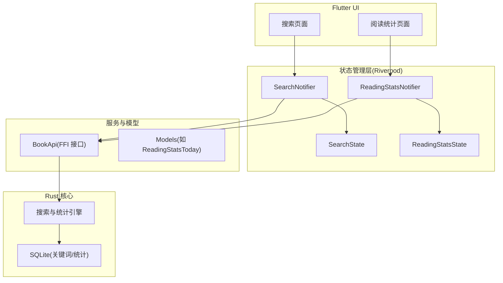
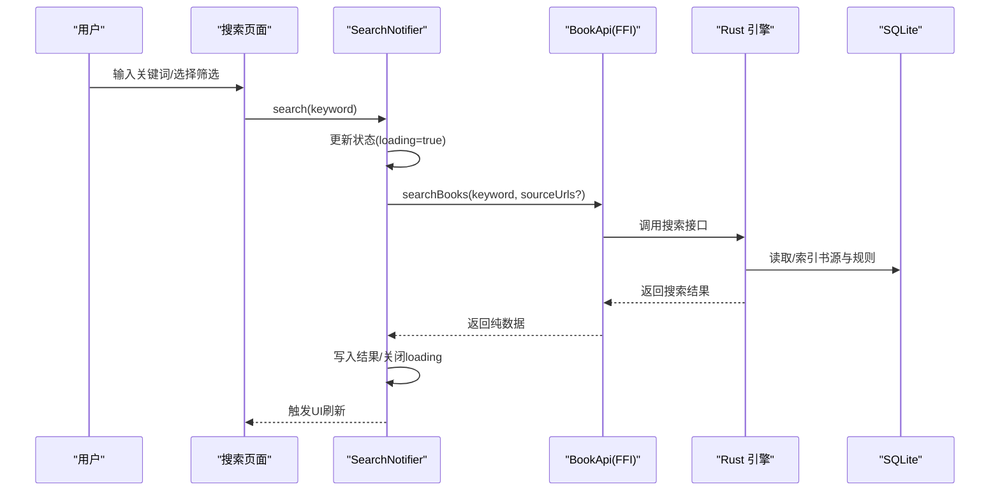
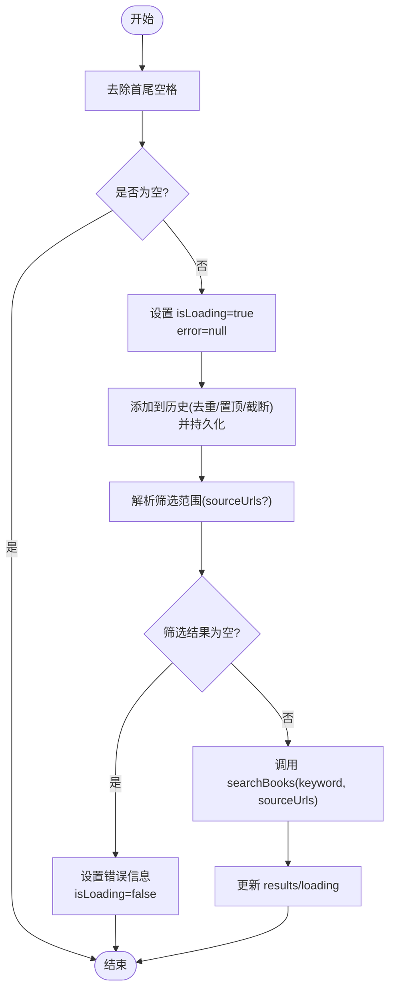
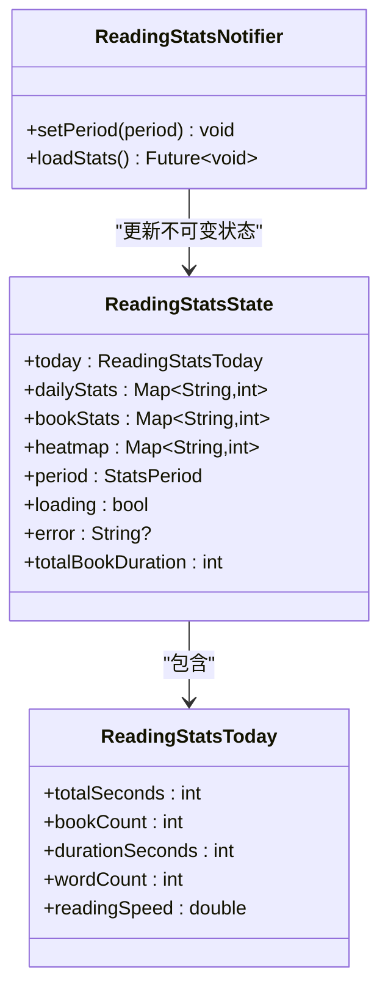
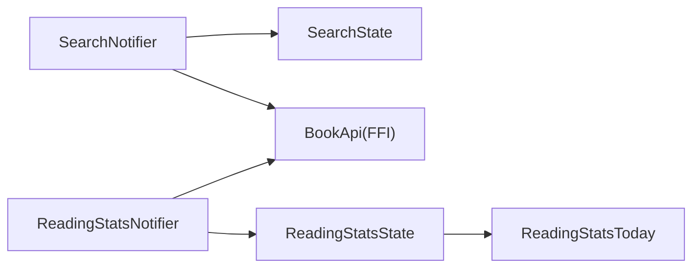

# 增强的搜索阅读记录功能

<cite>
**本文引用的文件**
- [README.md](file://README.md)
- [search_notifier.dart](file://flutter_legado/lib/src/providers/search/search_notifier.dart)
- [search_state.dart](file://flutter_legado/lib/src/providers/search/search_state.dart)
- [reading_stats_notifier.dart](file://flutter_legado/lib/src/providers/reading_stats/reading_stats_notifier.dart)
- [reading_stats_state.dart](file://flutter_legado/lib/src/providers/reading_stats/reading_stats_state.dart)
- [reading_stats_today.dart](file://flutter_legado/lib/src/models/reading_stats_today.dart)
- [e2e_search_read_test.dart](file://flutter_legado/integration_test/e2e_search_read_test.dart)
</cite>

## 目录
1. [简介](#简介)
2. [项目结构](#项目结构)
3. [核心组件](#核心组件)
4. [架构总览](#架构总览)
5. [详细组件分析](#详细组件分析)
6. [依赖关系分析](#依赖关系分析)
7. [性能考量](#性能考量)
8. [故障排查指南](#故障排查指南)
9. [结论](#结论)
10. [附录](#附录)

## 简介
本文件聚焦“增强的搜索与阅读记录功能”，围绕 Flutter 层的搜索状态管理、搜索历史持久化、精准筛选（书源/分组）以及阅读统计（今日/每日/书籍维度/热力图）进行系统化说明。内容覆盖数据流、状态设计、错误处理与端到端测试要点，帮助读者快速理解并扩展该功能。

## 项目结构
本项目采用 Rust 核心引擎 + Flutter UI 的跨平台架构。搜索与阅读记录相关代码位于 flutter_legado 模块中，使用 Riverpod 管理不可变状态，通过 FFI 调用 Rust 层 API 完成数据读写与计算。

图表来源
- [search_notifier.dart:1-215](file://flutter_legado/lib/src/providers/search/search_notifier.dart#L1-L215)
- [search_state.dart:1-65](file://flutter_legado/lib/src/providers/search/search_state.dart#L1-L65)
- [reading_stats_notifier.dart:1-71](file://flutter_legado/lib/src/providers/reading_stats/reading_stats_notifier.dart#L1-L71)
- [reading_stats_state.dart:1-52](file://flutter_legado/lib/src/providers/reading_stats/reading_stats_state.dart#L1-L52)
- [reading_stats_today.dart:1-25](file://flutter_legado/lib/src/models/reading_stats_today.dart#L1-L25)

章节来源
- [README.md:1-121](file://README.md#L1-L121)

## 核心组件
- 搜索状态与逻辑：SearchNotifier 负责搜索执行、历史维护、输入联想与筛选范围解析；SearchState 以不可变数据结构承载所有展示与筛选状态。
- 阅读统计状态与逻辑：ReadingStatsNotifier 负责周期切换与多路数据加载；ReadingStatsState 承载今日/每日/书籍/热力图等统计结果与加载状态。
- 数据模型：ReadingStatsToday 用于表达今日阅读统计的关键指标。

章节来源
- [search_notifier.dart:1-215](file://flutter_legado/lib/src/providers/search/search_notifier.dart#L1-L215)
- [search_state.dart:1-65](file://flutter_legado/lib/src/providers/search/search_state.dart#L1-L65)
- [reading_stats_notifier.dart:1-71](file://flutter_legado/lib/src/providers/reading_stats/reading_stats_notifier.dart#L1-L71)
- [reading_stats_state.dart:1-52](file://flutter_legado/lib/src/providers/reading_stats/reading_stats_state.dart#L1-L52)
- [reading_stats_today.dart:1-25](file://flutter_legado/lib/src/models/reading_stats_today.dart#L1-L25)

## 架构总览
搜索与阅读统计均遵循“UI → Notifier → BookApi(FFI) → Rust 引擎 → 数据库”的数据流模式。Notifier 仅做状态管理与 API 编排，业务匹配与聚合由 Rust 侧完成，保证跨平台一致性与高性能。

图表来源
- [search_notifier.dart:84-110](file://flutter_legado/lib/src/providers/search/search_notifier.dart#L84-L110)
- [search_state.dart:11-37](file://flutter_legado/lib/src/providers/search/search_state.dart#L11-L37)

## 详细组件分析

### 搜索组件（SearchNotifier + SearchState）
- 职责边界
  - 搜索执行：校验非空、记录历史、解析筛选范围、调用 searchBooks、更新结果与错误。
  - 历史管理：加载、添加（去重置顶+截断）、清空；持久化交由 BookApi。
  - 输入联想：基于 inputText 对历史前缀过滤，行为等价于原版的 flowSearch 前缀匹配。
  - 筛选范围：合并“选中的书源 URL”和“选中的分组”为最终 sourceUrls；为空表示搜索全部。
- 关键流程
  - 搜索：keyword.trim() 非空 → 设置 loading → addToHistory → 解析筛选 → 调用 searchBooks → 更新 results/loading/error。
  - 历史：addToHistory 先本地去重置顶并截断至上限，再异步持久化；失败不阻断 UI。
  - 联想：suggestions 根据 inputText 前缀过滤 searchHistory。
- 错误处理
  - 统一映射 BridgeError 消息，其他异常转为字符串提示。
  - 历史/持久化失败不影响主流程。

图表来源
- [search_notifier.dart:84-110](file://flutter_legado/lib/src/providers/search/search_notifier.dart#L84-L110)
- [search_notifier.dart:114-145](file://flutter_legado/lib/src/providers/search/search_notifier.dart#L114-L145)

章节来源
- [search_notifier.dart:1-215](file://flutter_legado/lib/src/providers/search/search_notifier.dart#L1-L215)
- [search_state.dart:1-65](file://flutter_legado/lib/src/providers/search/search_state.dart#L1-L65)

### 阅读统计组件（ReadingStatsNotifier + ReadingStatsState）
- 职责边界
  - 周期切换：week/month 切换后重新加载。
  - 数据加载：并行获取今日统计、每日时长、书籍时长、热力图，统一更新 state。
  - 派生属性：提供 totalBookDuration 等展示层计算。
- 关键流程
  - loadStats：设置 loading=true → Future.wait 并发请求 → 按顺序赋值 today/dailyStats/bookStats/heatmap → 关闭 loading。
  - setPeriod：若周期变化则更新 period 并触发 loadStats。
- 错误处理
  - 捕获 BridgeError 或通用异常，转换为 error 文本并关闭 loading。

图表来源
- [reading_stats_notifier.dart:1-71](file://flutter_legado/lib/src/providers/reading_stats/reading_stats_notifier.dart#L1-L71)
- [reading_stats_state.dart:1-52](file://flutter_legado/lib/src/providers/reading_stats/reading_stats_state.dart#L1-L52)
- [reading_stats_today.dart:1-25](file://flutter_legado/lib/src/models/reading_stats_today.dart#L1-L25)

章节来源
- [reading_stats_notifier.dart:1-71](file://flutter_legado/lib/src/providers/reading_stats/reading_stats_notifier.dart#L1-L71)
- [reading_stats_state.dart:1-52](file://flutter_legado/lib/src/providers/reading_stats/reading_stats_state.dart#L1-L52)
- [reading_stats_today.dart:1-25](file://flutter_legado/lib/src/models/reading_stats_today.dart#L1-L25)

### 端到端测试（搜索与阅读记录）
- e2e 用例覆盖搜索入口、历史记录交互与结果展示的基本路径，确保 UI 与状态联动正常。
- 建议补充：筛选范围（分组/书源）组合场景、历史去重与截断边界、错误分支（网络/FFI）回退路径。

章节来源
- [e2e_search_read_test.dart](file://flutter_legado/integration_test/e2e_search_read_test.dart)

## 依赖关系分析
- 组件内聚性
  - SearchNotifier 与 SearchState 强耦合，职责清晰：状态与逻辑分离，UI 只消费 State。
  - ReadingStatsNotifier 与 ReadingStatsState 同理，且通过 models 层共享类型。
- 外部依赖
  - 通过 BookApi(FFI) 访问 Rust 层能力，避免在 Flutter 层实现复杂匹配与聚合。
  - 历史与统计数据的持久化由 Rust 侧 SQLite 承担，Flutter 仅做状态同步。
- 潜在循环依赖
  - 当前分层清晰，未发现循环引用；models 被 providers 引用，未反向依赖 providers。

图表来源
- [search_notifier.dart:1-215](file://flutter_legado/lib/src/providers/search/search_notifier.dart#L1-L215)
- [search_state.dart:1-65](file://flutter_legado/lib/src/providers/search/search_state.dart#L1-L65)
- [reading_stats_notifier.dart:1-71](file://flutter_legado/lib/src/providers/reading_stats/reading_stats_notifier.dart#L1-L71)
- [reading_stats_state.dart:1-52](file://flutter_legado/lib/src/providers/reading_stats/reading_stats_state.dart#L1-L52)
- [reading_stats_today.dart:1-25](file://flutter_legado/lib/src/models/reading_stats_today.dart#L1-L25)

章节来源
- [search_notifier.dart:1-215](file://flutter_legado/lib/src/providers/search/search_notifier.dart#L1-L215)
- [reading_stats_notifier.dart:1-71](file://flutter_legado/lib/src/providers/reading_stats/reading_stats_notifier.dart#L1-L71)

## 性能考量
- 并发加载：阅读统计使用 Future.wait 并发拉取四类数据，显著降低首屏等待时间。
- 前端缓存：搜索历史在客户端去重与截断，减少不必要的后端往返。
- 增量更新：Riverpod 不可变状态配合细粒度 watch，避免整页重建。
- 建议优化
  - 搜索分页与懒加载：当结果集较大时，按需加载下一页。
  - 联想查询下沉：将前缀匹配迁移到 Rust FFI，减少客户端内存与 CPU 消耗。
  - 统计缓存：对热点周期（如本周）增加短期缓存，降低重复请求。

## 故障排查指南
- 搜索无结果
  - 检查 keyword 是否被 trim 为空；确认 selectedSourceUrls/selectedGroups 解析是否正确。
  - 查看 error 字段是否为“所选筛选范围内无有效书源”。
- 历史异常
  - 添加/清空历史失败不会阻断 UI，但需检查 BookApi 调用是否抛出 BridgeError。
- 统计加载失败
  - 检查 loadStats 的错误分支，确认各 API 返回是否符合预期；必要时分步调试 Future.wait 的单项任务。
- 联想不生效
  - 确认 inputText 与 searchHistory 的更新时机；检查 suggestions 的前缀过滤逻辑。

章节来源
- [search_notifier.dart:84-110](file://flutter_legado/lib/src/providers/search/search_notifier.dart#L84-L110)
- [reading_stats_notifier.dart:32-57](file://flutter_legado/lib/src/providers/reading_stats/reading_stats_notifier.dart#L32-L57)

## 结论
搜索与阅读记录功能通过 Riverpod 不可变状态与 FFI 解耦，实现了清晰的职责边界与稳定的数据流。搜索侧支持精准筛选与历史联想，阅读统计侧提供多维度可视化数据。后续可在 Rust 侧增强流式与缓存能力，进一步提升体验与性能。

## 附录
- 术语
  - Notifier：Riverpod 的状态管理器，封装业务逻辑与状态变更。
  - State：不可变数据对象，描述 UI 所需的全部状态。
  - FFI：跨语言接口，Flutter 通过 flutter_rust_bridge 调用 Rust 函数。
- 参考
  - 项目整体结构与构建说明见根 README。

章节来源
- [README.md:1-121](file://README.md#L1-L121)