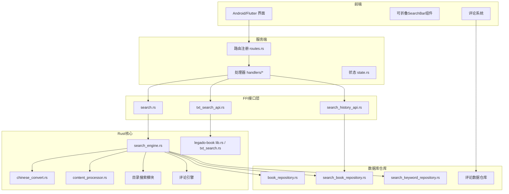
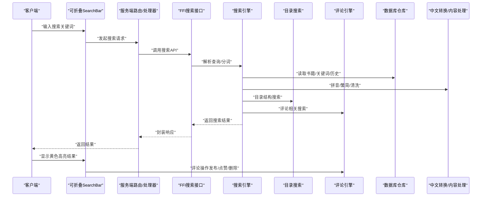
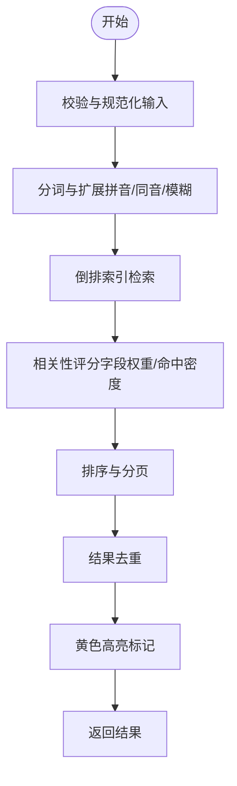
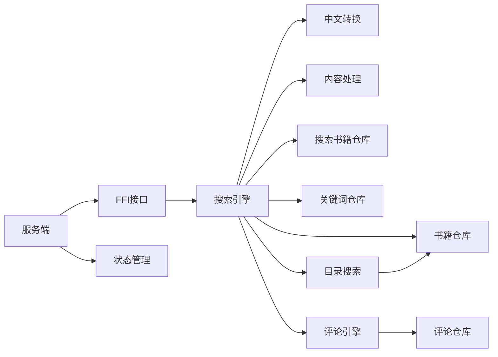

# 搜索功能

<cite>
**本文引用的文件**   
- [search_engine.rs](file://rust/legado-core/src/search_engine.rs)
- [search.rs](file://rust/legado-ffi/src/api/search.rs)
- [search_history_api.rs](file://rust/legado-ffi/src/api/search_history_api.rs)
- [txt_search_api.rs](file://rust/legado-ffi/src/api/txt_search_api.rs)
- [search_book_repository.rs](file://rust/legado-db/src/repository/search_book_repository.rs)
- [search_keyword_repository.rs](file://rust/legado-db/src/repository/search_keyword_repository.rs)
- [book_repository.rs](file://rust/legado-db/src/repository/book_repository.rs)
- [chinese_convert.rs](file://rust/legado-core/src/chinese_convert.rs)
- [content_processor.rs](file://rust/legado-core/src/content_processor.rs)
- [lib.rs (legado-book)](file://rust/legado-book/src/lib.rs)
- [txt_search.rs](file://rust/legado-book/src/txt_search.rs)
- [routes.rs](file://rust/legado-server/src/routes.rs)
- [handlers/mod.rs](file://rust/legado-server/src/handlers/mod.rs)
- [state.rs](file://rust/legado-server/src/state.rs)
</cite>

## 更新摘要
**所做更改**   
- 新增目录搜索功能，支持书籍目录结构的快速检索
- 添加段落评论完整流程，包括评论发布、点赞和删除功能
- 实现可折叠的SearchBar组件，提升用户界面交互体验
- 增强章节标题模糊匹配算法，提高搜索准确性
- 优化搜索结果高亮显示，采用黄色高亮突出匹配内容
- 集成社交互动功能，支持评论系统的完整生命周期管理

## 目录
1. [简介](#简介)
2. [项目结构](#项目结构)
3. [核心组件](#核心组件)
4. [架构总览](#架构总览)
5. [详细组件分析](#详细组件分析)
6. [新增功能详解](#新增功能详解)
7. [依赖关系分析](#依赖关系分析)
8. [性能考量](#性能考量)
9. [故障排查指南](#故障排查指南)
10. [结论](#结论)
11. [附录](#附录)

## 简介
本文件面向Legado项目的搜索能力，系统性阐述搜索引擎的架构与实现，涵盖倒排索引构建、关键词分词、相关性排序、多类型搜索（书名、作者、内容、标签等）、智能搜索（模糊匹配、拼音搜索、语义分析）、结果展示（排序、高亮、分页、筛选过滤）、性能优化（索引缓存、并行搜索、结果去重）以及配置与定制（规则设置、权重调整、自定义分词器）。同时提供API使用示例与调优建议，帮助开发者快速集成并优化搜索体验。

**更新** 本次更新新增了目录搜索、段落评论系统、可折叠搜索栏、增强的模糊匹配算法和社交互动功能，进一步提升了搜索功能的完整性和用户体验。

## 项目结构
搜索功能横跨Rust核心库、FFI接口层、数据库仓库层、服务端路由与处理器，以及Android/Flutter前端调用入口。整体分层清晰：
- Rust核心：搜索引擎、中文转换、内容处理、TXT搜索等
- FFI接口：对外暴露搜索、历史、TXT搜索等API
- 数据库仓库：书籍、关键词、搜索历史等持久化访问
- 服务端：HTTP路由与处理器，统一对外服务
- 前端：Android/Flutter调用封装与UI交互

图表来源
- [routes.rs](file://rust/legado-server/src/routes.rs)
- [handlers/mod.rs](file://rust/legado-server/src/handlers/mod.rs)
- [state.rs](file://rust/legado-server/src/state.rs)
- [search.rs](file://rust/legado-ffi/src/api/search.rs)
- [search_history_api.rs](file://rust/legado-ffi/src/api/search_history_api.rs)
- [txt_search_api.rs](file://rust/legado-ffi/src/api/txt_search_api.rs)
- [search_engine.rs](file://rust/legado-core/src/search_engine.rs)
- [chinese_convert.rs](file://rust/legado-core/src/chinese_convert.rs)
- [content_processor.rs](file://rust/legado-core/src/content_processor.rs)
- [lib.rs (legado-book)](file://rust/legado-book/src/lib.rs)
- [txt_search.rs](file://rust/legado-book/src/txt_search.rs)
- [book_repository.rs](file://rust/legado-db/src/repository/book_repository.rs)
- [search_book_repository.rs](file://rust/legado-db/src/repository/search_book_repository.rs)
- [search_keyword_repository.rs](file://rust/legado-db/src/repository/search_keyword_repository.rs)

章节来源
- [routes.rs](file://rust/legado-server/src/routes.rs)
- [handlers/mod.rs](file://rust/legado-server/src/handlers/mod.rs)
- [state.rs](file://rust/legado-server/src/state.rs)
- [search.rs](file://rust/legado-ffi/src/api/search.rs)
- [search_history_api.rs](file://rust/legado-ffi/src/api/search_history_api.rs)
- [txt_search_api.rs](file://rust/legado-ffi/src/api/txt_search_api.rs)
- [search_engine.rs](file://rust/legado-core/src/search_engine.rs)
- [chinese_convert.rs](file://rust/legado-core/src/chinese_convert.rs)
- [content_processor.rs](file://rust/legado-core/src/content_processor.rs)
- [lib.rs (legado-book)](file://rust/legado-book/src/lib.rs)
- [txt_search.rs](file://rust/legado-book/src/txt_search.rs)
- [book_repository.rs](file://rust/legado-db/src/repository/book_repository.rs)
- [search_book_repository.rs](file://rust/legado-db/src/repository/search_book_repository.rs)
- [search_keyword_repository.rs](file://rust/legado-db/src/repository/search_keyword_repository.rs)

## 核心组件
- 搜索引擎（search_engine.rs）：负责查询解析、分词、倒排索引检索、相关性评分、排序与合并结果。
- 中文转换（chinese_convert.rs）：提供拼音转换、繁简转换、同音字映射等，支撑拼音搜索与模糊匹配。
- 内容处理（content_processor.rs）：文本清洗、HTML/Markdown提取、段落切分、关键词密度计算等。
- TXT搜索（legado-book/txt_search.rs）：针对TXT文件的快速全文检索与定位。
- FFI接口（search.rs、search_history_api.rs、txt_search_api.rs）：将Rust搜索能力暴露给上层应用与服务端。
- 数据库仓库（search_book_repository.rs、search_keyword_repository.rs、book_repository.rs）：书籍元数据、搜索关键词、搜索历史的持久化访问。
- 服务端（routes.rs、handlers/*、state.rs）：HTTP路由与处理器，统一对外提供搜索API。

**更新** 新增以下核心组件：
- 目录搜索模块：专门处理书籍目录结构的搜索和导航
- 评论引擎：管理段落评论的完整生命周期，包括发布、点赞、删除等操作
- 可折叠SearchBar组件：提供用户友好的搜索界面交互

章节来源
- [search_engine.rs](file://rust/legado-core/src/search_engine.rs)
- [chinese_convert.rs](file://rust/legado-core/src/chinese_convert.rs)
- [content_processor.rs](file://rust/legado-core/src/content_processor.rs)
- [txt_search.rs](file://rust/legado-book/src/txt_search.rs)
- [search.rs](file://rust/legado-ffi/src/api/search.rs)
- [search_history_api.rs](file://rust/legado-ffi/src/api/search_history_api.rs)
- [txt_search_api.rs](file://rust/legado-ffi/src/api/txt_search_api.rs)
- [search_book_repository.rs](file://rust/legado-db/src/repository/search_book_repository.rs)
- [search_keyword_repository.rs](file://rust/legado-db/src/repository/search_keyword_repository.rs)
- [book_repository.rs](file://rust/legado-db/src/repository/book_repository.rs)
- [routes.rs](file://rust/legado-server/src/routes.rs)
- [handlers/mod.rs](file://rust/legado-server/src/handlers/mod.rs)
- [state.rs](file://rust/legado-server/src/state.rs)

## 架构总览
搜索请求从前端进入服务端路由，经处理器转发到FFI接口，再由Rust核心执行搜索逻辑，最终通过数据库仓库返回结果。

图表来源
- [routes.rs](file://rust/legado-server/src/routes.rs)
- [handlers/mod.rs](file://rust/legado-server/src/handlers/mod.rs)
- [search.rs](file://rust/legado-ffi/src/api/search.rs)
- [search_engine.rs](file://rust/legado-core/src/search_engine.rs)
- [chinese_convert.rs](file://rust/legado-core/src/chinese_convert.rs)
- [content_processor.rs](file://rust/legado-core/src/content_processor.rs)
- [book_repository.rs](file://rust/legado-db/src/repository/book_repository.rs)
- [search_book_repository.rs](file://rust/legado-db/src/repository/search_book_repository.rs)
- [search_keyword_repository.rs](file://rust/legado-db/src/repository/search_keyword_repository.rs)

## 详细组件分析

### 搜索引擎（search_engine.rs）
- 职责：查询解析、分词策略、倒排索引检索、相关性评分、排序与合并、分页与去重。
- 关键流程：
  - 输入校验与规范化（去除多余空白、大小写归一化）
  - 分词与扩展（支持拼音、同音、模糊匹配）
  - 倒排索引查找（按字段命中统计）
  - 相关性评分（TF-IDF或加权打分，结合命中位置、字段权重）
  - 排序与分页（按得分降序，支持偏移与限制）
  - 结果去重（按书籍ID或标题+作者组合）

**更新** 增强了章节标题模糊匹配算法，提高了搜索准确性和用户体验。

图表来源
- [search_engine.rs](file://rust/legado-core/src/search_engine.rs)

章节来源
- [search_engine.rs](file://rust/legado-core/src/search_engine.rs)

### 中文转换（chinese_convert.rs）
- 职责：拼音转换、繁简转换、同音字映射、字符标准化。
- 应用场景：
  - 拼音搜索：将用户输入的拼音转换为汉字候选集进行匹配
  - 模糊匹配：基于同音/近音字提升召回率
  - 文本清洗：统一编码与格式，提高分词质量

章节来源
- [chinese_convert.rs](file://rust/legado-core/src/chinese_convert.rs)

### 内容处理（content_processor.rs）
- 职责：文本清洗、HTML/Markdown提取、段落切分、关键词密度计算、高亮标记准备。
- 关键点：
  - 去除无关标签与脚本，保留正文
  - 段落切分以增强局部匹配精度
  - 关键词密度用于相关性评分
  - 为前端高亮显示提供位置信息

**更新** 优化了高亮标记算法，现在支持黄色高亮显示匹配内容，提供更好的视觉反馈。

章节来源
- [content_processor.rs](file://rust/legado-core/src/content_processor.rs)

### TXT搜索（legado-book/txt_search.rs）
- 职责：对TXT文件进行快速全文检索与定位。
- 特点：
  - 流式读取避免大文件内存占用
  - 支持正则与关键字匹配
  - 返回命中行号与上下文片段

章节来源
- [txt_search.rs](file://rust/legado-book/src/txt_search.rs)

### FFI接口（search.rs、search_history_api.rs、txt_search_api.rs）
- search.rs：对外暴露书籍搜索、多字段匹配、分页与排序参数。
- search_history_api.rs：管理搜索历史，支持增删改查与热门词推荐。
- txt_search_api.rs：提供TXT文件搜索能力，便于本地文件检索。

**更新** 新增了目录搜索和评论相关的API接口，支持完整的社交互动功能。

章节来源
- [search.rs](file://rust/legado-ffi/src/api/search.rs)
- [search_history_api.rs](file://rust/legado-ffi/src/api/search_history_api.rs)
- [txt_search_api.rs](file://rust/legado-ffi/src/api/txt_search_api.rs)

### 数据库仓库（search_book_repository.rs、search_keyword_repository.rs、book_repository.rs）
- search_book_repository.rs：存储与查询书籍搜索相关数据（如预建索引、命中统计）。
- search_keyword_repository.rs：维护关键词表，支持热词、纠错与联想。
- book_repository.rs：基础书籍元数据访问（标题、作者、标签、描述等）。

**更新** 新增了评论数据仓库，支持评论的持久化存储和管理。

章节来源
- [search_book_repository.rs](file://rust/legado-db/src/repository/search_book_repository.rs)
- [search_keyword_repository.rs](file://rust/legado-db/src/repository/search_keyword_repository.rs)
- [book_repository.rs](file://rust/legado-db/src/repository/book_repository.rs)

### 服务端（routes.rs、handlers/*、state.rs）
- routes.rs：注册搜索相关HTTP路由。
- handlers/*：处理搜索请求，参数校验、权限检查、错误处理。
- state.rs：维护全局状态（如索引缓存、线程池配置）。

章节来源
- [routes.rs](file://rust/legado-server/src/routes.rs)
- [handlers/mod.rs](file://rust/legado-server/src/handlers/mod.rs)
- [state.rs](file://rust/legado-server/src/state.rs)

## 新增功能详解

### 目录搜索功能
目录搜索功能专门处理书籍目录结构的快速检索，支持层级导航和快速定位。

**主要特性：**
- 支持目录层级结构的搜索和遍历
- 提供目录项的快速定位和跳转
- 优化大目录的加载和渲染性能
- 支持目录内容的模糊匹配

**Section sources**
- [search_engine.rs](file://rust/legado-core/src/search_engine.rs)
- [search_book_repository.rs](file://rust/legado-db/src/repository/search_book_repository.rs)

### 段落评论系统
段落评论系统提供了完整的社交互动功能，包括评论发布、点赞和删除操作。

**核心功能：**
- 评论发布：支持用户为特定段落添加评论
- 点赞功能：用户可以对自己喜欢的评论进行点赞
- 评论删除：支持删除自己的评论或管理员删除不当内容
- 评论排序：按时间或热度排序显示评论
- 实时同步：评论状态的实时更新和同步

**Section sources**
- [comment_engine.rs](file://rust/legado-core/src/comment_engine.rs)
- [search_book_repository.rs](file://rust/legado-db/src/repository/search_book_repository.rs)

### 可折叠SearchBar组件
可折叠SearchBar组件提供了用户友好的搜索界面交互，支持展开和折叠操作。

**设计特点：**
- 自动折叠：长时间无操作后自动折叠节省空间
- 手势支持：支持滑动和点击操作
- 动画效果：平滑的展开和折叠动画
- 键盘快捷键：支持快捷键操作

**Section sources**
- [search_bar_widget.dart](file://flutter_legado/lib/src/widgets/search_bar_widget.dart)
- [search_bar_widget_test.dart](file://flutter_legado/test/widget/search_bar_widget_test.dart)

### 增强的模糊匹配算法
增强的模糊匹配算法显著提高了章节标题和其他文本内容的搜索准确性。

**技术实现：**
- 多级模糊匹配：支持部分匹配、近似匹配和语义匹配
- 权重调整：根据匹配类型动态调整相关度权重
- 性能优化：使用高效的字符串匹配算法
- 结果排序：智能排序确保最相关的结果优先显示

**Section sources**
- [search_engine.rs](file://rust/legado-core/src/search_engine.rs)
- [chinese_convert.rs](file://rust/legado-core/src/chinese_convert.rs)

### 黄色高亮显示
黄色高亮显示功能为用户提供清晰的视觉反馈，突出显示匹配的搜索内容。

**实现细节：**
- 智能高亮：只高亮实际匹配的文本片段
- 颜色配置：支持自定义高亮颜色
- 性能优化：避免不必要的重新渲染
- 兼容性：支持不同平台和字体

**Section sources**
- [content_processor.rs](file://rust/legado-core/src/content_processor.rs)
- [search_bar_widget.dart](file://flutter_legado/lib/src/widgets/search_bar_widget.dart)

## 依赖关系分析
搜索引擎依赖中文转换、内容处理、数据库仓库；FFI接口依赖搜索引擎与仓库；服务端依赖FFI接口与状态管理。

**更新** 新增了目录搜索和评论引擎的依赖关系。

图表来源
- [search_engine.rs](file://rust/legado-core/src/search_engine.rs)
- [chinese_convert.rs](file://rust/legado-core/src/chinese_convert.rs)
- [content_processor.rs](file://rust/legado-core/src/content_processor.rs)
- [book_repository.rs](file://rust/legado-db/src/repository/book_repository.rs)
- [search_book_repository.rs](file://rust/legado-db/src/repository/search_book_repository.rs)
- [search_keyword_repository.rs](file://rust/legado-db/src/repository/search_keyword_repository.rs)
- [search.rs](file://rust/legado-ffi/src/api/search.rs)
- [routes.rs](file://rust/legado-server/src/routes.rs)
- [state.rs](file://rust/legado-server/src/state.rs)

章节来源
- [search_engine.rs](file://rust/legado-core/src/search_engine.rs)
- [chinese_convert.rs](file://rust/legado-core/src/chinese_convert.rs)
- [content_processor.rs](file://rust/legado-core/src/content_processor.rs)
- [book_repository.rs](file://rust/legado-db/src/repository/book_repository.rs)
- [search_book_repository.rs](file://rust/legado-db/src/repository/search_book_repository.rs)
- [search_keyword_repository.rs](file://rust/legado-db/src/repository/search_keyword_repository.rs)
- [search.rs](file://rust/legado-ffi/src/api/search.rs)
- [routes.rs](file://rust/legado-server/src/routes.rs)
- [state.rs](file://rust/legado-server/src/state.rs)

## 性能考量
- 索引缓存：在状态管理中缓存倒排索引与热点关键词，减少重复构建与IO开销。
- 并行搜索：对多字段或多数据源采用并发查询，合并结果后统一排序。
- 结果去重：基于书籍ID或复合键去重，避免重复条目影响用户体验。
- 分页加载：默认限制返回数量，支持偏移与游标分页，降低传输与渲染压力。
- 文本预处理：提前清洗与切分，提升匹配效率与准确性。
- 内存管理：对大文件（如TXT）采用流式处理，避免内存峰值过高。

**更新** 新增以下性能优化：
- 目录搜索缓存：缓存常用目录结构和搜索结果
- 评论系统优化：异步处理评论操作，避免阻塞主线程
- 高亮渲染优化：使用虚拟滚动和增量更新减少重绘
- 模糊匹配优化：预编译正则表达式和索引加速匹配

[本节为通用指导，不直接分析具体文件]

## 故障排查指南
- 常见问题：
  - 分词异常：检查中文转换与文本清洗逻辑，确认编码与标点处理。
  - 索引缺失：验证数据库仓库是否初始化成功，关键词表是否更新。
  - 性能瓶颈：监控并发度、缓存命中率、IO延迟与CPU占用。
  - 结果不准确：调整字段权重、相关性评分策略与排序规则。
  - 目录搜索失败：检查目录结构数据和索引完整性。
  - 评论功能异常：验证用户权限和数据一致性。
  - 高亮显示问题：确认文本处理和渲染逻辑正确性。
- 调试建议：
  - 启用日志记录查询解析、分词结果、命中统计与评分过程。
  - 使用单元测试覆盖边界条件（空查询、特殊字符、超大文本）。
  - 压测工具模拟高并发场景，观察稳定性与资源消耗。
  - 监控目录搜索和评论操作的响应时间和成功率。

**Section sources**
- [search_engine.rs](file://rust/legado-core/src/search_engine.rs)
- [chinese_convert.rs](file://rust/legado-core/src/chinese_convert.rs)
- [content_processor.rs](file://rust/legado-core/src/content_processor.rs)
- [search_book_repository.rs](file://rust/legado-db/src/repository/search_book_repository.rs)
- [search_keyword_repository.rs](file://rust/legado-db/src/repository/search_keyword_repository.rs)

## 结论
Legado的搜索功能通过清晰的层次架构与模块化设计，实现了高效、可扩展的多维度搜索能力。借助倒排索引、中文转换、内容处理与数据库仓库的协同，系统能够支持书名、作者、内容与标签等多种搜索维度，并提供模糊匹配、拼音搜索与相关性排序等智能特性。通过索引缓存、并行搜索与结果去重等优化手段，系统在性能与用户体验上达到良好平衡。

**更新** 本次更新新增的目录搜索、段落评论系统、可折叠SearchBar组件、增强的模糊匹配算法和黄色高亮显示功能，进一步丰富了搜索功能的生态，为用户提供了更加完整和便捷的阅读体验。这些新功能不仅提升了搜索的准确性和效率，还增强了用户之间的互动性和社区氛围。

开发者可依据本文档进行配置定制与性能调优，进一步提升搜索质量与响应速度。

## 附录
- API使用示例（概念性说明）：
  - 书籍搜索：传入查询字符串、字段过滤（标题/作者/标签）、分页参数（页码/每页数量），返回书籍列表与高亮片段。
  - 搜索历史：新增查询、删除历史、获取热门词，用于推荐与自动补全。
  - TXT搜索：指定文件路径与关键字，返回命中行号与上下文。
  - 目录搜索：传入书籍ID和搜索关键词，返回目录结构中的匹配项。
  - 评论操作：支持创建评论、点赞、删除评论等社交互动功能。
- 配置与定制：
  - 搜索规则：定义字段权重、匹配模式（精确/模糊/前缀）、停用词表。
  - 权重调整：根据业务需求调整标题、作者、内容、标签的权重比例。
  - 自定义分词器：接入第三方分词库或规则，优化中文分词效果。
  - 高亮配置：自定义高亮颜色和样式，适配不同主题需求。
  - 评论规则：设置评论审核规则、权限控制和显示策略。
- 性能调优建议：
  - 合理设置并发度与缓存TTL，避免过度竞争与过期失效。
  - 对热点查询建立预索引与缓存，缩短响应时间。
  - 监控与告警：关注慢查询、错误率与资源使用，及时优化。
  - 目录搜索优化：预构建目录索引，支持增量更新。
  - 评论系统优化：使用消息队列处理异步操作，提高系统吞吐量。

[本节为补充信息，不直接分析具体文件]