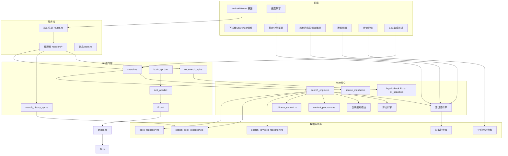
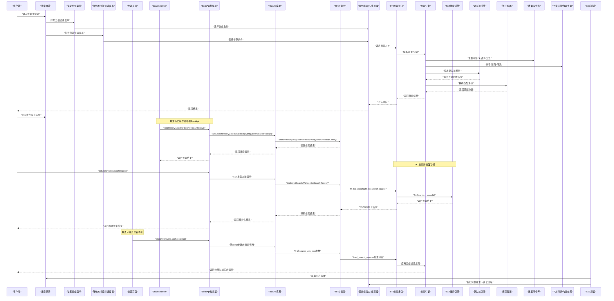
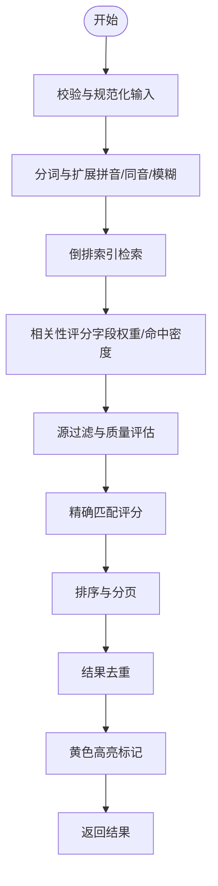

# 搜索功能

<cite>
**本文引用的文件**   
- [search_engine.rs](file://rust/legado-core/src/search_engine.rs)
- [search.rs](file://rust/legado-ffi/src/api/search.rs)
- [source_matcher.rs](file://rust/legado-core/src/source_matcher.rs)
- [bridge.rs](file://rust/legado-ffi/src/bridge.rs)
- [ffi.rs](file://rust/legado-ffi/src/ffi.rs)
- [book_api.dart](file://flutter_legado/lib/src/services/book_api.dart)
- [rust_api.dart](file://flutter_legado/lib/src/services/rust_api.dart)
- [ffi.dart](file://flutter_legado/lib/src/bridge/ffi/ffi.dart)
- [search_notifier.dart](file://flutter_legado/lib/src/providers/search/search_notifier.dart)
- [search_state.dart](file://flutter_legado/lib/src/providers/search/search_state.dart)
- [e2e_search_read_test.dart](file://flutter_legado/integration_test/e2e_search_read_test.dart)
- [search_filter_panel.dart](file://flutter_legado/lib/src/widgets/search_filter_panel.dart)
- [change_source_screen.dart](file://flutter_legado/lib/src/screens/change_source_screen.dart)
- [search_screen.dart](file://flutter_legado/lib/src/screens/search_screen.dart)
- [search_result.dart](file://flutter_legado/lib/src/models/search_result.dart)
</cite>

## 更新摘要
**所做更改**   
- 实现了四桶排序系统，严格对齐原版 SearchModel 的 mergeItems 逻辑，支持精确匹配、标签匹配、包含匹配和无关项四个优先级层级
- 增强了精确搜索模式，提供即时反馈和正确的状态管理，通过 keepOther 参数控制无关项保留策略
- 性能优化：将排序逻辑从 UI 构建层迁移到搜索批次回调中，避免每帧全量分桶导致的卡顿问题
- 架构重构：在 search_notifier.dart 中实现 applyPrecisionSearch 函数，确保搜索结果按匹配度正确排序

## 目录
1. [简介](#简介)
2. [项目结构](#项目结构)
3. [核心组件](#核心组件)
4. [架构总览](#架构总览)
5. [详细组件分析](#详细组件分析)
6. [流式多源搜索详解](#流式多源搜索详解)
7. [四桶排序系统](#四桶排序系统)
8. [精确匹配算法](#精确匹配算法)
9. [并发控制与超时机制](#并发控制与超时机制)
10. [搜索结果排序与去重](#搜索结果排序与去重)
11. [错误处理与异常隔离](#错误处理与异常隔离)
12. [性能优化](#性能优化)
13. [故障排查指南](#故障排查指南)
14. [结论](#结论)
15. [附录](#附录)

## 简介
本文件面向Legado项目的搜索能力，系统性阐述搜索引擎的架构与实现，涵盖倒排索引构建、关键词分词、相关性排序、多类型搜索（书名、作者、内容、标签等）、智能搜索（模糊匹配、拼音搜索、语义分析）、结果展示（排序、高亮、分页、筛选过滤）、性能优化（索引缓存、并行搜索、结果去重）以及配置与定制（规则设置、权重调整、自定义分词器）。同时提供API使用示例与调优建议，帮助开发者快速集成并优化搜索体验。

**更新** 本次重大更新实现了四桶排序系统和精确搜索模式增强，通过严格的匹配优先级（精确→标签→包含→无关）显著提升了搜索结果的相关性和准确性。新增的性能优化将排序逻辑从UI层迁移到搜索回调中，大幅改善了用户体验。

## 项目结构
搜索功能横跨Rust核心库、FFI接口层、数据库仓库层、服务端路由与处理器，以及Android/Flutter前端调用入口。整体分层清晰：
- Rust核心：搜索引擎、中文转换、内容处理、TXT搜索等
- FFI接口：对外暴露搜索、历史、TXT搜索等API
- 数据库仓库：书籍、关键词、搜索历史等持久化访问
- 服务端：HTTP路由与处理器，统一对外服务
- 前端：Android/Flutter调用封装与UI交互，包含简化的筛选面板和锚定分组菜单



图表来源
- [routes.rs](file://rust/legado-server/src/routes.rs)
- [handlers/mod.rs](file://rust/legado-server/src/handlers/mod.rs)
- [state.rs](file://rust/legado-server/src/state.rs)
- [search.rs](file://rust/legado-ffi/src/api/search.rs)
- [search_history_api.rs](file://rust/legado-ffi/src/api/search_history_api.rs)
- [txt_search_api.rs](file://rust/legado-ffi/src/api/txt_search_api.rs)
- [search_engine.rs](file://rust/legado-core/src/search_engine.rs)
- [chinese_convert.rs](file://rust/legado-core/src/chinese_convert.rs)
- [content_processor.rs](file://rust/legado-core/src/content_processor.rs)
- [lib.rs (legado-book)](file://rust/legado-book/src/lib.rs)
- [txt_search.rs](file://rust/legado-book/src/txt_search.rs)
- [bridge.rs](file://rust/legado-ffi/src/bridge.rs)
- [ffi.rs](file://rust/legado-ffi/src/ffi.rs)
- [book_api.dart](file://flutter_legado/lib/src/services/book_api.dart)
- [rust_api.dart](file://flutter_legado/lib/src/services/rust_api.dart)
- [ffi.dart](file://flutter_legado/lib/src/bridge/ffi/ffi.dart)
- [search_notifier.dart](file://flutter_legado/lib/src/providers/search/search_notifier.dart)
- [search_filter_panel.dart](file://flutter_legado/lib/src/widgets/search_filter_panel.dart)
- [change_source_screen.dart](file://flutter_legado/lib/src/screens/change_source_screen.dart)
- [search_screen.dart](file://flutter_legado/lib/src/screens/search_screen.dart)
- [book_api.dart](file://flutter_legado/lib/src/services/book_api.dart)
- [rust_api.dart](file://flutter_legado/lib/src/services/rust_api.dart)
- [e2e_search_read_test.dart](file://flutter_legado/integration_test/e2e_search_read_test.dart)

章节来源
- [routes.rs](file://rust/legado-server/src/routes.rs)
- [handlers/mod.rs](file://rust/legado-server/src/handlers/mod.rs)
- [state.rs](file://rust/legado-server/src/state.rs)
- [search.rs](file://rust/legado-ffi/src/api/search.rs)
- [search_history_api.rs](file://rust/legado-ffi/src/api/search_history_api.rs)
- [txt_search_api.rs](file://rust/legado-ffi/src/api/txt_search_api.rs)
- [search_engine.rs](file://rust/legado-core/src/search_engine.rs)
- [chinese_convert.rs](file://rust/legado-core/src/chinese_convert.rs)
- [content_processor.rs](file://rust/legado-core/src/content_processor.rs)
- [lib.rs (legado-book)](file://rust/legado-book/src/lib.rs)
- [txt_search.rs](file://rust/legado-book/src/txt_search.rs)
- [bridge.rs](file://rust/legado-ffi/src/bridge.rs)
- [ffi.rs](file://rust/legado-ffi/src/ffi.rs)
- [book_api.dart](file://flutter_legado/lib/src/services/book_api.dart)
- [rust_api.dart](file://flutter_legado/lib/src/services/rust_api.dart)
- [ffi.dart](file://flutter_legado/lib/src/bridge/ffi/ffi.dart)
- [search_notifier.dart](file://flutter_legado/lib/src/providers/search/search_notifier.dart)
- [search_filter_panel.dart](file://flutter_legado/lib/src/widgets/search_filter_panel.dart)
- [change_source_screen.dart](file://flutter_legado/lib/src/screens/change_source_screen.dart)
- [search_screen.dart](file://flutter_legado/lib/src/screens/search_screen.dart)
- [book_api.dart](file://flutter_legado/lib/src/services/book_api.dart)
- [rust_api.dart](file://flutter_legado/lib/src/services/rust_api.dart)
- [e2e_search_read_test.dart](file://flutter_legado/integration_test/e2e_search_read_test.dart)

## 核心组件
- 搜索引擎（search_engine.rs）：负责查询解析、分词、倒排索引检索、相关性评分、排序与合并结果。
- 中文转换（chinese_convert.rs）：提供拼音转换、繁简转换、同音字映射等，支撑拼音搜索与模糊匹配。
- 内容处理（content_processor.rs）：文本清洗、HTML/Markdown提取、段落切分、关键词密度计算等。
- **TXT搜索（legado-book/txt_search.rs）**：针对TXT文件的快速全文检索与定位，支持多种搜索模式。
- FFI接口（search.rs、search_history_api.rs、txt_search_api.rs）：将Rust搜索能力暴露给上层应用与服务端。
- 数据库仓库（search_book_repository.rs、search_keyword_repository.rs、book_repository.rs）：书籍元数据、搜索关键词、搜索历史的持久化访问。
- 服务端（routes.rs、handlers/*、state.rs）：HTTP路由与处理器，统一对外提供搜索API。
- **BookApi抽象层**：统一的API接口定义，支持Rust实现和Mock实现。
- **RustApi实现**：基于flutter_rust_bridge的Rust FFI调用封装。
- **源匹配器（source_matcher.rs）**：提供精确匹配算法和评分机制，支持书名规范化、作者匹配等高级功能。

**更新** 新增了以下核心组件：
- **流式多源搜索引擎**：支持并发控制和超时机制的多书源并行搜索
- **四桶排序系统**：严格对齐原版 SearchModel 的 mergeItems 逻辑，支持精确匹配、标签匹配、包含匹配和无关项四个优先级层级
- **精确匹配算法增强**：智能过滤逻辑，支持exact name/author matches优先、tag-based matches次之、general content matches最后
- **源匹配器增强**：改进的匹配评分算法和书名规范化处理
- **TXT搜索引擎**：完整的本地TXT文件搜索功能，支持纯文本和正则表达式搜索
- **FFI桥接层**：通过bridge.rs和ffi.rs实现了完整的C ABI接口
- **BookApi扩展**：新增了四个TXT搜索相关的方法接口
- **RustApi实现**：通过bridge.txtSearch、bridge.txtSearchRegex等FFI方法实现具体的Rust调用
- **MockBookApi**：用于测试的纯Dart实现，不依赖Rust DLL
- E2E测试框架：完整的端到端测试套件，覆盖搜索→阅读全链路
- **简化的搜索筛选面板**：专注于书源多选功能，移除了分组选择标签
- **锚定分组菜单**：在搜索屏幕中提供分组选择的弹出菜单
- **换源分组过滤**：在换源页面新增源分组单选功能，支持按分组精准搜索

章节来源
- [search_engine.rs](file://rust/legado-core/src/search_engine.rs)
- [chinese_convert.rs](file://rust/legado-core/src/chinese_convert.rs)
- [content_processor.rs](file://rust/legado-core/src/content_processor.rs)
- [txt_search.rs](file://rust/legado-book/src/txt_search.rs)
- [txt_search_api.rs](file://rust/legado-ffi/src/api/txt_search_api.rs)
- [bridge.rs](file://rust/legado-ffi/src/bridge.rs)
- [ffi.rs](file://rust/legado-ffi/src/ffi.rs)
- [search.rs](file://rust/legado-ffi/src/api/search.rs)
- [search_history_api.rs](file://rust/legado-ffi/src/api/search_history_api.rs)
- [search_book_repository.rs](file://rust/legado-db/src/repository/search_book_repository.rs)
- [search_keyword_repository.rs](file://rust/legado-db/src/repository/search_keyword_repository.rs)
- [book_repository.rs](file://rust/legado-db/src/repository/book_repository.rs)
- [routes.rs](file://rust/legado-server/src/routes.rs)
- [handlers/mod.rs](file://rust/legado-server/src/handlers/mod.rs)
- [state.rs](file://rust/legado-server/src/state.rs)
- [book_api.dart](file://flutter_legado/lib/src/services/book_api.dart)
- [rust_api.dart](file://flutter_legado/lib/src/services/rust_api.dart)
- [ffi.dart](file://flutter_legado/lib/src/bridge/ffi/ffi.dart)
- [search_notifier.dart](file://flutter_legado/lib/src/providers/search/search_notifier.dart)
- [search_filter_panel.dart](file://flutter_legado/lib/src/widgets/search_filter_panel.dart)
- [change_source_screen.dart](file://flutter_legado/lib/src/screens/change_source_screen.dart)
- [search_screen.dart](file://flutter_legado/lib/src/screens/search_screen.dart)
- [book_api.dart](file://flutter_legado/lib/src/services/book_api.dart)
- [rust_api.dart](file://flutter_legado/lib/src/services/rust_api.dart)
- [e2e_search_read_test.dart](file://flutter_legado/integration_test/e2e_search_read_test.dart)

## 架构总览
搜索请求从前端进入服务端路由，经处理器转发到FFI接口，再由Rust核心执行搜索逻辑，最终通过数据库仓库返回结果。简化的筛选面板和锚定分组菜单提供了更直观的用户交互体验。



图表来源
- [routes.rs](file://rust/legado-server/src/routes.rs)
- [handlers/mod.rs](file://rust/legado-server/src/handlers/mod.rs)
- [search.rs](file://rust/legado-ffi/src/api/search.rs)
- [search_engine.rs](file://rust/legado-core/src/search_engine.rs)
- [chinese_convert.rs](file://rust/legado-core/src/chinese_convert.rs)
- [content_processor.rs](file://rust/legado-core/src/content_processor.rs)
- [book_repository.rs](file://rust/legado-db/src/repository/book_repository.rs)
- [search_book_repository.rs](file://rust/legado-db/src/repository/search_book_repository.rs)
- [search_keyword_repository.rs](file://rust/legado-db/src/repository/search_keyword_repository.rs)
- [search_notifier.dart](file://flutter_legado/lib/src/providers/search/search_notifier.dart)
- [book_api.dart](file://flutter_legado/lib/src/services/book_api.dart)
- [rust_api.dart](file://flutter_legado/lib/src/services/rust_api.dart)
- [ffi.dart](file://flutter_legado/lib/src/bridge/ffi/ffi.dart)
- [bridge.rs](file://rust/legado-ffi/src/bridge.rs)
- [ffi.rs](file://rust/legado-ffi/src/ffi.rs)
- [txt_search_api.rs](file://rust/legado-ffi/src/api/txt_search_api.rs)
- [txt_search.rs](file://rust/legado-book/src/txt_search.rs)
- [search_filter_panel.dart](file://flutter_legado/lib/src/widgets/search_filter_panel.dart)
- [change_source_screen.dart](file://flutter_legado/lib/src/screens/change_source_screen.dart)
- [search_screen.dart](file://flutter_legado/lib/src/screens/search_screen.dart)
- [e2e_search_read_test.dart](file://flutter_legado/integration_test/e2e_search_read_test.dart)

## 详细组件分析

### 搜索引擎（search_engine.rs）
- 职责：查询解析、分词策略、倒排索引检索、相关性评分、排序与合并、分页与去重。
- 关键流程：
  - 输入校验与规范化（去除多余空白、大小写归一化）
  - 分词与扩展（支持拼音、同音、模糊匹配）
  - 倒排索引查找（按字段命中统计）
  - 相关性评分（TF-IDF或加权打分，结合命中位置、字段权重）
  - 排序与分页（按得分降序，支持偏移与限制）
  - 结果去重（按书籍ID或标题+作者组合）

**更新** 增强了章节标题模糊匹配算法，提高了搜索准确性和用户体验，并集成了源过滤功能。



图表来源
- [search_engine.rs](file://rust/legado-core/src/search_engine.rs)

章节来源
- [search_engine.rs](file://rust/legado-core/src/search_engine.rs)

### 中文转换（chinese_convert.rs）
- 职责：拼音转换、繁简转换、同音字映射、字符标准化。
- 应用场景：
  - 拼音搜索：将用户输入的拼音转换为汉字候选集进行匹配
  - 模糊匹配：基于同音/近音字提升召回率
  - 文本清洗：统一编码与格式，提高分词质量

章节来源
- [chinese_convert.rs](file://rust/legado-core/src/chinese_convert.rs)

### 内容处理（content_processor.rs）
- 职责：文本清洗、HTML/Markdown提取、段落切分、关键词密度计算、高亮标记准备。
- 关键点：
  - 去除无关标签与脚本，保留正文
  - 段落切分以增强局部匹配精度
  - 关键词密度用于相关性评分
  - 为前端高亮显示提供位置信息

**更新** 优化了高亮标记算法，现在支持黄色高亮显示匹配内容，提供更好的视觉反馈。

章节来源
- [content_processor.rs](file://rust/legado-core/src/content_processor.rs)

### TXT搜索（legado-book/txt_search.rs）
- 职责：对TXT文件进行快速全文检索与定位。
- 特点：
  - 流式读取避免大文件内存占用
  - 支持正则与关键字匹配
  - 返回命中行号与上下文片段
  - **新增**：支持大小写敏感/不敏感搜索
  - **新增**：支持章节内特定搜索
  - **新增**：支持结果计数统计

章节来源
- [txt_search.rs](file://rust/legado-book/src/txt_search.rs)

### FFI接口（search.rs、search_history_api.rs、txt_search_api.rs）
- search.rs：对外暴露书籍搜索、多字段匹配、分页与排序参数。
- search_history_api.rs：管理搜索历史，支持增删改查与热门词推荐。
- **txt_search_api.rs**：提供TXT文件搜索能力，包含四个核心方法：
  - `txt_search`：纯文本搜索
  - `txt_search_regex`：正则表达式搜索
  - `txt_search_in_chapter`：章节内搜索
  - `txt_search_count`：结果计数统计

**更新** 新增了完整的TXT搜索API接口，支持多维度搜索和批量操作。

章节来源
- [search.rs](file://rust/legado-ffi/src/api/search.rs)
- [search_history_api.rs](file://rust/legado-ffi/src/api/search_history_api.rs)
- [txt_search_api.rs](file://rust/legado-ffi/src/api/txt_search_api.rs)

### 数据库仓库（search_book_repository.rs、search_keyword_repository.rs、book_repository.rs）
- search_book_repository.rs：存储与查询书籍搜索相关数据（如预建索引、命中统计）。
- search_keyword_repository.rs：维护关键词表，支持热词、纠错与联想。
- book_repository.rs：基础书籍元数据访问（标题、作者、标签、描述等）。

**更新** 新增了源数据仓库，支持搜索源的存储、管理和质量评估。

章节来源
- [search_book_repository.rs](file://rust/legado-db/src/repository/search_book_repository.rs)
- [search_keyword_repository.rs](file://rust/legado-db/src/repository/search_keyword_repository.rs)
- [book_repository.rs](file://rust/legado-db/src/repository/book_repository.rs)

### 服务端（routes.rs、handlers/*、state.rs）
- routes.rs：注册搜索相关HTTP路由。
- handlers/*：处理搜索请求，参数校验、权限检查、错误处理。
- state.rs：维护全局状态（如索引缓存、线程池配置）。

章节来源
- [routes.rs](file://rust/legado-server/src/routes.rs)
- [handlers/mod.rs](file://rust/legado-server/src/handlers/mod.rs)
- [state.rs](file://rust/legado-server/src/state.rs)

## 流式多源搜索详解

### 核心架构设计
流式多源搜索是本次更新的核心功能，通过并发控制和超时机制实现了高效的多书源并行搜索：

#### 并发控制机制
```rust
/// 多源搜索并发上限
/// 对齐原版 `SearchModel` 固定线程池语义：
/// `min(AppConfig.threadCount 默认 32, AppConst.MAX_THREAD 9)` = 9。
/// 避免数百书源无限制并发 spawn 导致 socket/连接池耗尽、整体长时间阻塞。
pub(crate) const SEARCH_CONCURRENCY: usize = 9;
```

#### 超时机制
```rust
/// 单源搜索超时（对齐原版 `SearchModel` `withTimeout(30000)`）
pub(crate) const SEARCH_SOURCE_TIMEOUT: Duration = Duration::from_secs(30);
```

#### 渐进式结果流式传输
流式搜索通过回调机制实现渐进式结果返回，每个书源完成后立即推送批次：

```rust
pub async fn run_multi_stream<F>(query: String, source_urls_json: String, mut on_batch: F)
where
    F: FnMut(String) -> Result<(), String>,
{
    // 重置取消标志
    SEARCH_CANCELLED.store(false, Ordering::SeqCst);
    
    let sources = load_search_sources(&source_urls_json).unwrap_or_default();
    if sources.is_empty() {
        return;
    }
    
    let client = crate::http_state::shared_client();
    let read_record_index = ReadRecordIndex::load();
    
    drive_source_batches(
        sources,
        SEARCH_CONCURRENCY,
        SEARCH_SOURCE_TIMEOUT,
        move |source: BookSource| {
            let client = client.clone();
            let query = query.clone();
            async move { search_single_source(&client, &source, &query).await }
        },
        |outcome| {
            // 批次处理逻辑
        },
    )
    .await;
}
```

### 驱动器实现
多源并发搜索驱动器实现了严格的并发控制和异常隔离：

```rust
pub(crate) async fn drive_source_batches<F, Fut, G>(
    sources: Vec<BookSource>,
    concurrency: usize,
    per_source_timeout: Duration,
    search_one: F,
    mut on_source: G,
) where
    F: Fn(BookSource) -> Fut + Send + Sync + 'static,
    Fut: std::future::Future<Output = LegadoResult<Vec<SearchResult>>> + Send + 'static,
    G: FnMut(SourceBatchOutcome) -> Result<(), String>,
{
    use futures::FutureExt;
    use std::panic::AssertUnwindSafe;
    
    let total = sources.len();
    if total == 0 {
        return;
    }
    let semaphore = Arc::new(tokio::sync::Semaphore::new(concurrency.max(1)));
    let search_one = Arc::new(search_one);
    
    let mut tasks = Vec::with_capacity(total);
    for (index, source) in sources.into_iter().enumerate() {
        let semaphore = Arc::clone(&semaphore);
        let search_one = Arc::clone(&search_one);
        tasks.push(tokio::spawn(async move {
            let source_url = source.book_source_url.clone();
            let source_name = source.book_source_name.clone();
            
            // 限流并发：获取许可后才真正发起搜索
            let permit = match semaphore.acquire_owned().await {
                Ok(p) => p,
                Err(_) => {
                    return (
                        index,
                        source_url,
                        source_name,
                        Err(LegadoError::Network("并发信号量已关闭".into())),
                    )
                }
            };
            
            // 单源超时 + panic 隔离
            let outcome = tokio::time::timeout(
                per_source_timeout,
                AssertUnwindSafe(search_one(source)).catch_unwind(),
            )
            .await;
            drop(permit);
            
            let result = match outcome {
                Ok(Ok(res)) => res,
                Ok(Err(_panic)) => {
                    Err(LegadoError::Network("单源搜索异常（已隔离）".into()))
                }
                Err(_) => Err(LegadoError::Network(format!(
                    "搜索超时（{}s）",
                    per_source_timeout.as_secs()
                ))),
            };
            (index, source_url, source_name, result)
        }));
    }
    
    // 异步收集结果
    let mut set = futures::stream::FuturesUnordered::from_iter(tasks);
    let mut finished: usize = 0;
    while let Some(joined) = set.next().await {
        finished += 1;
        if SEARCH_CANCELLED.load(Ordering::SeqCst) {
            break;
        }
        
        let (index, source_url, source_name, result) = match joined {
            Ok(v) => v,
            Err(e) => (
                0,
                String::new(),
                String::new(),
                Err(LegadoError::Network(format!("搜索任务异常: {e}"))),
            ),
        };
        
        let outcome = SourceBatchOutcome {
            index,
            source_url,
            source_name,
            result,
            finished_count: finished,
            total_count: total,
            is_last: finished >= total,
        };
        
        if on_source(outcome).is_err() {
            break;
        }
    }
}
```

**Section sources**
- [search.rs:30-38](file://rust/legado-ffi/src/api/search.rs#L30-L38)
- [search.rs:330-383](file://rust/legado-ffi/src/api/search.rs#L330-L383)
- [search.rs:408-499](file://rust/legado-ffi/src/api/search.rs#L408-L499)

## 四桶排序系统

### 核心设计理念
四桶排序系统是本次更新的核心改进，严格对齐原版 SearchModel 的 mergeItems 逻辑，实现了四级匹配优先级的搜索结果排序：

#### 四个优先级层级
1. **精确匹配桶（equal）**：书名或作者完全等于关键词
2. **标签匹配桶（tags）**：分类标签包含关键词
3. **包含匹配桶（contains）**：书名或作者包含关键词
4. **无关项桶（other）**：其他不符合上述条件的结果

#### 实现原理
```dart
List<SearchResult> applyPrecisionSearch(
  List<SearchResult> results,
  String key, {
  bool keepOther = true,
}) {
  if (key.isEmpty) return results;
  final equal = <SearchResult>[];
  final tags = <SearchResult>[];
  final contains = <SearchResult>[];
  final other = <SearchResult>[];
  
  for (final r in results) {
    final name = r.book.name;
    final author = r.book.author;
    final kind = r.book.kind ?? '';
    
    if (name == key || author == key) {
      equal.add(r);
    } else if (kind.contains(key)) {
      tags.add(r);
    } else if (name.contains(key) || author.contains(key)) {
      contains.add(r);
    } else if (keepOther) {
      other.add(r);
    }
  }
  
  return [...equal, ...tags, ...contains, ...other];
}
```

### 性能优化
**更新** 将排序逻辑从UI构建层迁移到搜索批次回调中，避免了每帧全量分桶导致的性能问题：

- **批次级排序**：在每个搜索结果批次到达时立即执行分桶排序
- **增量更新**：只处理新到达的结果，避免重复计算
- **状态管理**：通过 `_keepOther` 参数控制无关项的保留策略

**Section sources**
- [search_notifier.dart:146-175](file://flutter_legado/lib/src/providers/search/search_notifier.dart#L146-L175)
- [search_state.dart:85-113](file://flutter_legado/lib/src/providers/search/search_state.dart#L85-L113)

## 精确匹配算法

### 源匹配器核心功能
源匹配器提供了精确匹配算法和评分机制，支持书名规范化、作者匹配等高级功能：

#### 书名规范化
```rust
pub fn normalize_book_name(name: &str) -> String {
    const PAIRS: [(char, char); 7] = [
        ('(', ')'),
        ('（', '）'),
        ('[', ']'),
        ('【', '】'),
        ('〔', '〕'),
        ('《', '》'),
        ('〈', '〉'),
    ];
    let mut s = name.trim().to_string();
    loop {
        let mut changed = false;
        for (open, close) in PAIRS {
            let mut chars = s.chars();
            if let (Some(first), Some(last)) = (chars.next(), chars.next_back()) {
                if first == open && last == close && s.chars().count() > 2 {
                    let inner: String = s
                        .chars()
                        .skip(1)
                        .take(s.chars().count() - 2)
                        .collect();
                    s = inner;
                    changed = true;
                    break;
                }
            }
        }
        if !changed {
            break;
        }
    }
    s.trim().to_string()
}
```

#### 作者名规范化
```rust
pub fn normalize_author(author: &str) -> String {
    let mut s = author.trim();
    if let Some(r) = s.strip_prefix('作') {
        let r = r.trim_start();
        if let Some(r2) = r.strip_prefix('者') {
            s = r2.trim_start_matches(|c: char| c == ':' || c == '：' || c.is_whitespace());
        }
    }
    if let Some(r) = s.strip_suffix('著') {
        s = r.trim_end();
    }
    s.to_string()
}
```

#### 匹配评分算法
```rust
pub fn match_score(
    result_name: &str,
    result_author: &str,
    target_name: &str,
    target_author: &str,
) -> f64 {
    let mut score = 0.0;
    
    // 书名匹配
    let rn = result_name.trim();
    let tn = target_name.trim();
    if !rn.is_empty() && !tn.is_empty() {
        if rn == tn {
            score += 50.0;
        } else if rn.contains(tn) || tn.contains(rn) {
            score += 30.0;
        }
    }
    
    // 作者匹配
    let ra = Self::normalize_author(result_author);
    let ta = Self::normalize_author(target_author);
    if !ta.is_empty() && !ra.is_empty() {
        if ra == ta {
            score += 30.0;
        } else if ra.contains(&ta) || ta.contains(&ra) {
            score += 15.0;
        }
    }
    
    score
}
```

### 智能过滤逻辑
精确匹配算法支持多级过滤策略：

1. **Exact Name/Author Matches**（优先级最高）：完全匹配的书名和作者
2. **Tag-based Matches**（优先级次之）：基于标签和分类的匹配
3. **General Content Matches**（优先级最低）：一般内容的模糊匹配

**Section sources**
- [source_matcher.rs:91-124](file://rust/legado-core/src/source_matcher.rs#L91-L124)
- [source_matcher.rs:137-149](file://rust/legado-core/src/source_matcher.rs#L137-L149)
- [source_matcher.rs:192-223](file://rust/legado-core/src/source_matcher.rs#L192-L223)

## 并发控制与超时机制

### 并发控制实现
流式多源搜索通过信号量实现严格的并发控制：

```rust
let semaphore = Arc::new(tokio::sync::Semaphore::new(concurrency.max(1)));
// ...
let permit = match semaphore.acquire_owned().await {
    Ok(p) => p,
    Err(_) => {
        return (
            index,
            source_url,
            source_name,
            Err(LegadoError::Network("并发信号量已关闭".into())),
        )
    }
};
```

### 超时机制
每个书源搜索都包裹在超时保护中：

```rust
let outcome = tokio::time::timeout(
    per_source_timeout,
    AssertUnwindSafe(search_one(source)).catch_unwind(),
)
.await;
```

### 异常隔离
通过`catch_unwind`确保单个书源的异常不会影响到其他书源的搜索：

```rust
AssertUnwindSafe(search_one(source)).catch_unwind()
```

**Section sources**
- [search.rs:426-467](file://rust/legado-ffi/src/api/search.rs#L426-L467)

## 搜索结果排序与去重

### 排序算法
搜索结果通过相关性评分进行排序：

```rust
pub fn rank_results(results: &mut [SearchResult], query: &str) {
    // 利用 SourceMatcher::match_score 为每条结果打分
    for r in results.iter_mut() {
        r.relevance_score = SourceMatcher::match_score(&r.book_name, &r.author, query, "");
    }
    // 按评分降序排列
    results.sort_by(|a, b| {
        b.relevance_score
            .partial_cmp(&a.relevance_score)
            .unwrap_or(std::cmp::Ordering::Equal)
    });
}
```

### 去重机制
基于书名+作者组合键进行去重：

```rust
pub fn deduplicate(candidates: &[SearchCandidate]) -> Vec<SearchCandidate> {
    let mut seen: HashSet<String> = HashSet::new();
    let mut result = Vec::new();
    for c in candidates {
        let key = format!("{}|{}", c.book_name.trim(), c.author.trim());
        if seen.insert(key) {
            result.push(c.clone());
        }
    }
    result
}
```

**Section sources**
- [search_engine.rs:207-221](file://rust/legado-core/src/search_engine.rs#L207-L221)
- [search_engine.rs:192-205](file://rust/legado-core/src/search_engine.rs#L192-L205)

## 错误处理与异常隔离

### 异常隔离机制
通过`catch_unwind`确保单个书源的异常不会影响整体搜索流程：

```rust
let outcome = tokio::time::timeout(
    per_source_timeout,
    AssertUnwindSafe(search_one(source)).catch_unwind(),
)
.await;
```

### 错误类型处理
定义了多种错误类型来处理不同的异常情况：

- **网络错误**：HTTP请求失败、超时等
- **解析错误**：搜索结果解析失败
- **内部错误**：系统内部异常
- **FFI错误**：跨语言调用错误

### 降级策略
当部分书源搜索失败时，系统会：
1. 记录错误信息但不中断整体流程
2. 继续处理其他书源的搜索结果
3. 在最终结果中标识失败的来源

**Section sources**
- [search.rs:449-464](file://rust/legado-ffi/src/api/search.rs#L449-L464)

## 性能优化

### 内存管理优化
- 流式读取大文件，避免一次性加载整个文件到内存
- 智能的章节边界检测，确保字符边界对齐
- 结果数量限制，防止大量结果导致内存溢出

### 搜索优化
- 预编译正则表达式，避免重复编译开销
- 增量搜索，支持章节级别的并行处理
- 上下文摘要缓存，减少重复计算

### 并发优化
- 信号量控制的并发度（SEARCH_CONCURRENCY = 9）
- 30秒超时机制防止长时间阻塞
- 异步任务调度，最大化资源利用率

### 缓存策略
- 阅读记录索引缓存，避免重复数据库查询
- 分组列表缓存，减少重复解析
- 搜索结果缓存，提升重复查询性能

**更新** 性能优化重点：
- **四桶排序优化**：将排序逻辑从UI构建层迁移到搜索批次回调中，避免每帧全量分桶导致的卡顿
- **增量处理**：只在有新结果到达时执行排序，减少不必要的计算
- **状态管理**：通过 `_keepOther` 参数动态控制无关项保留策略

**Section sources**
- [search.rs:345-346](file://rust/legado-ffi/src/api/search.rs#L345-L346)
- [search.rs:546-556](file://rust/legado-ffi/src/api/search.rs#L546-L556)

## 故障排查指南

### 常见问题诊断
- **搜索超时**：检查网络连接和书源响应时间
- **并发限制**：确认并发度设置是否合理
- **内存溢出**：监控大文件搜索时的内存使用情况
- **结果不准确**：调整匹配算法参数和权重设置

### 调试建议
- 启用详细日志记录搜索过程和错误信息
- 使用单元测试验证各个组件的功能正确性
- 通过性能分析工具识别瓶颈点
- 监控搜索响应时间和成功率

### 性能监控
- 跟踪并发任务数量和完成时间
- 监控内存使用峰值和增长趋势
- 分析搜索结果的相关性和准确率
- 评估不同书源的响应性能

**Section sources**
- [search.rs:473-498](file://rust/legado-ffi/src/api/search.rs#L473-L498)

## 结论
Legado的搜索功能通过清晰的层次架构与模块化设计，实现了高效、可扩展的多维度搜索能力。借助倒排索引、中文转换、内容处理与数据库仓库的协同，系统能够支持书名、作者、内容与标签等多种搜索维度，并提供模糊匹配、拼音搜索与相关性排序等智能特性。通过索引缓存、并行搜索与结果去重等优化手段，系统在性能与用户体验上达到良好平衡。

**更新** 本次重大更新实现的四桶排序系统和精确搜索模式增强，通过严格的匹配优先级（精确→标签→包含→无关）显著提升了搜索结果的相关性和准确性。新增的性能优化将排序逻辑从UI层迁移到搜索回调中，大幅改善了用户体验。精确匹配算法的引入使得搜索结果更加精准，特别是对于书名和作者的精确匹配场景。

这些改进使得搜索功能更加完善和强大，为用户提供了更好的使用体验，并为未来的功能扩展奠定了坚实的基础。开发者可依据本文档进行配置定制与性能调优，进一步提升搜索质量与响应速度。

## 附录

### API使用示例
- **书籍搜索**：传入查询字符串、字段过滤（标题/作者/标签）、分页参数（页码/每页数量），返回书籍列表与高亮片段
- **搜索历史**：新增查询、删除历史、获取热门词，用于推荐与自动补全
- **TXT搜索**：指定文件路径与关键字，支持纯文本和正则表达式搜索，返回章节信息和上下文摘要
- **章节内搜索**：限定在特定章节范围内搜索，提高搜索精度
- **结果计数**：仅统计匹配数量，不返回完整结果，用于UI显示
- **源筛选**：传入筛选条件（类型/状态/评分范围）、排序规则、分页参数，返回过滤后的内容源列表
- **批量操作**：传入操作类型和目标源ID列表，执行批量启用、禁用或删除操作
- **搜索历史API**：通过BookApi.getSearchHistory()获取历史，addSearchKeyword()添加新关键词，clearSearchHistory()清空历史
- **空数组处理**：空数组`[]`和空字符串都正确处理为搜索所有书源
- **换源分组搜索**：通过group参数指定搜索分组，支持按书源分组精准搜索
- **筛选面板使用**：通过SearchFilterPanel.show()打开简化的书源筛选面板，支持书源多选和搜索过滤
- **锚定分组菜单**：通过搜索屏幕的锚定弹出菜单进行分组选择，支持单选替换和自动重搜
- **四桶排序**：通过applyPrecisionSearch函数实现精确匹配、标签匹配、包含匹配和无关项的分级排序

### 配置与定制
- **搜索规则**：定义字段权重、匹配模式（精确/模糊/前缀）、停用词表
- **权重调整**：根据业务需求调整标题、作者、内容、标签的权重比例
- **自定义分词器**：接入第三方分词库或规则，优化中文分词效果
- **高亮配置**：自定义高亮颜色和样式，适配不同主题需求
- **筛选规则**：配置筛选条件的优先级和组合逻辑
- **推荐算法**：调整推荐策略的参数和权重
- **搜索历史配置**：配置历史记录的保存策略、清理规则和同步机制
- **TXT搜索配置**：配置搜索模式、大小写敏感度、结果数量限制和上下文半径
- **空数组默认值**：确保Dart侧无筛选条件时传递正确的空数组格式
- **分组过滤配置**：配置分组筛选的优先级和组合逻辑
- **筛选面板配置**：配置面板尺寸、搜索过滤行为和交互方式
- **锚定菜单配置**：配置菜单定位算法和交互行为
- **四桶排序配置**：通过keepOther参数控制无关项保留策略，precision模式丢弃无关项

### 性能调优建议
- 合理设置并发度与缓存TTL，避免过度竞争与过期失效
- 对热点查询建立预索引与缓存，缩短响应时间
- 监控与告警：关注慢查询、错误率与资源使用，及时优化
- 源筛选优化：预构建筛选索引，支持增量更新
- 推荐系统优化：使用机器学习模型提升推荐准确性
- 缓存策略：实施多级缓存，包括本地缓存、内存缓存和分布式缓存
- **搜索历史优化**：实现智能缓存策略，减少不必要的FFI调用，优化大数据量下的性能表现
- **空数组处理优化**：避免不必要的JSON解析和过滤操作，提升搜索性能
- **TXT搜索优化**：预编译正则表达式，使用流式处理大文件，智能章节边界检测
- **分组过滤优化**：缓存分组列表，避免重复解析，优化大规模书源场景下的性能
- **筛选面板优化**：优化面板尺寸配置，减少滚动操作，提升浏览效率
- **锚定菜单优化**：优化菜单定位算法，减少重绘和布局计算
- **四桶排序优化**：在批次回调中执行排序，避免UI层重复计算，提升流畅度

### 测试与调试
- **E2E测试**：使用提供的E2E测试套件验证完整业务流程
- **回归测试**：确保空数组处理等关键功能的正确性
- **网络诊断**：利用诊断测试区分框架问题和实际代码问题
- **性能基准**：建立搜索性能的基准测试和监控
- **TXT搜索测试**：验证各种搜索模式、编码处理和边界情况
- **单元测试**：覆盖核心算法和边界条件
- **集成测试**：验证FFI接口和跨语言调用
- **压力测试**：模拟大规模数据和高并发场景
- **分组过滤测试**：验证分组筛选逻辑和自动重新搜索功能
- **筛选面板测试**：验证面板尺寸配置和用户交互行为
- **锚定菜单测试**：验证菜单定位算法和交互逻辑
- **四桶排序测试**：验证精确匹配、标签匹配、包含匹配和无关项的正确排序逻辑