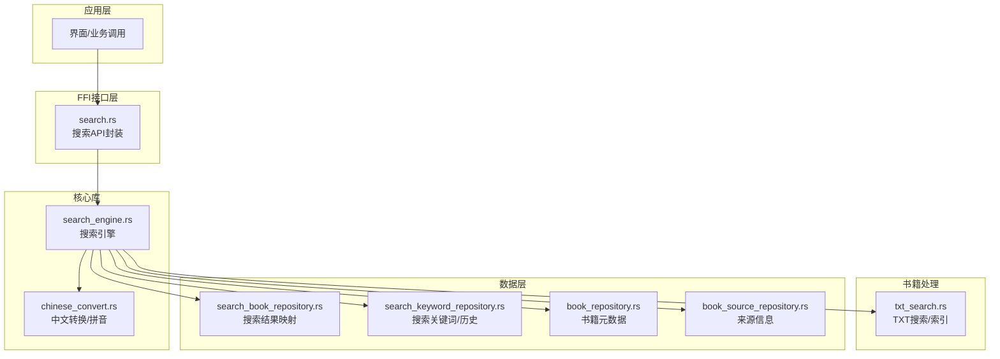
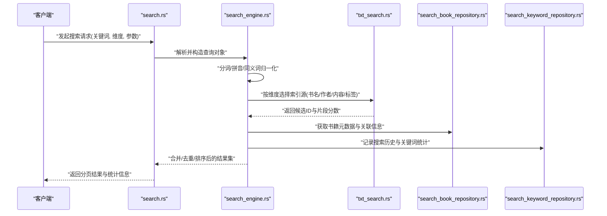
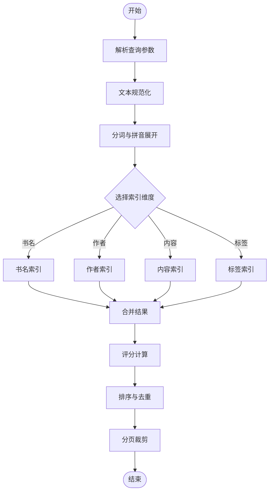
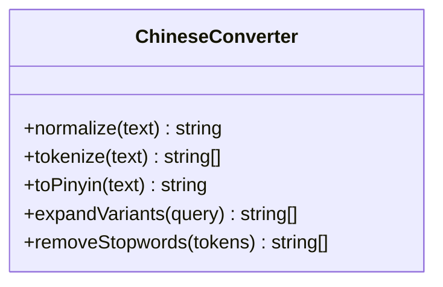
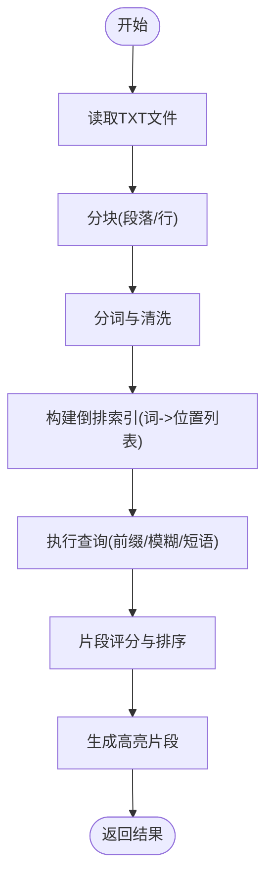
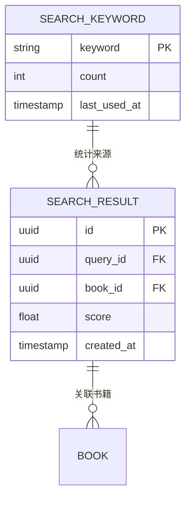
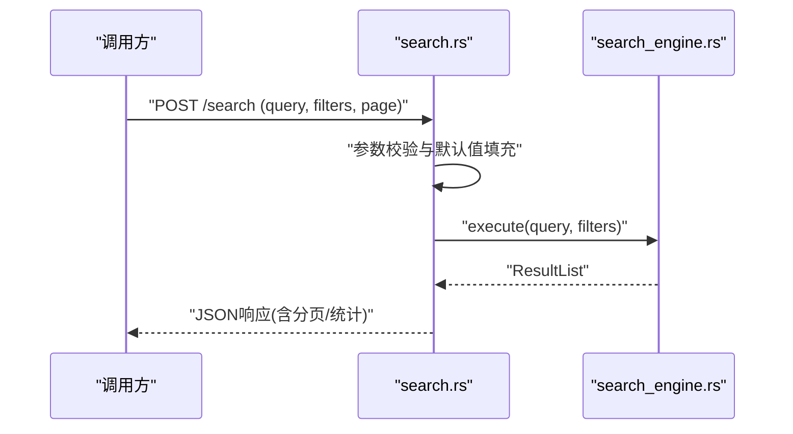
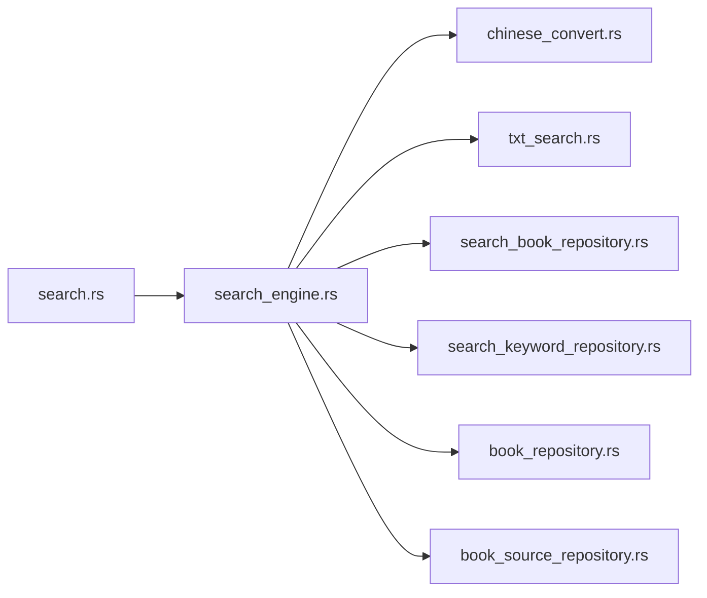

# 搜索引擎架构

<cite>
**本文引用的文件**   
- [search_engine.rs](file://rust/legado-core/src/search_engine.rs)
- [search.rs](file://rust/legado-ffi/src/api/search.rs)
- [txt_search.rs](file://rust/legado-book/src/txt_search.rs)
- [search_book_repository.rs](file://rust/legado-db/src/repository/search_book_repository.rs)
- [search_keyword_repository.rs](file://rust/legado-db/src/repository/search_keyword_repository.rs)
- [chinese_convert.rs](file://rust/legado-core/src/chinese_convert.rs)
- [lib.rs](file://rust/legado-core/src/lib.rs)
- [book_repository.rs](file://rust/legado-db/src/repository/book_repository.rs)
- [book_source_repository.rs](file://rust/legado-db/src/repository/book_source_repository.rs)
</cite>

## 目录
1. [简介](#简介)
2. [项目结构](#项目结构)
3. [核心组件](#核心组件)
4. [架构总览](#架构总览)
5. [详细组件分析](#详细组件分析)
6. [依赖关系分析](#依赖关系分析)
7. [性能考量](#性能考量)
8. [故障排查指南](#故障排查指南)
9. [结论](#结论)
10. [附录](#附录)

## 简介
本文件面向Legado项目的搜索引擎子系统，系统性阐述倒排索引构建、分词器实现、查询解析与执行、多类型搜索（书名、作者、内容、标签）策略、模糊匹配与拼音处理、语义增强、相关性排序机制以及性能优化方案。文档以代码级分析为基础，辅以架构图与时序图，帮助读者快速理解并扩展搜索能力。

## 项目结构
搜索相关能力分布在Rust核心库、FFI接口层、数据库仓库层与书籍处理模块中：
- Rust核心库：提供搜索引擎、中文转换等通用能力
- FFI接口层：对外暴露搜索API，供上层调用
- 数据库仓库层：持久化搜索历史、关键词、搜索结果映射等
- 书籍处理模块：针对TXT等文本的搜索与索引构建

**图示来源** 
- [search.rs](file://rust/legado-ffi/src/api/search.rs)
- [search_engine.rs](file://rust/legado-core/src/search_engine.rs)
- [txt_search.rs](file://rust/legado-book/src/txt_search.rs)
- [chinese_convert.rs](file://rust/legado-core/src/chinese_convert.rs)
- [search_book_repository.rs](file://rust/legado-db/src/repository/search_book_repository.rs)
- [search_keyword_repository.rs](file://rust/legado-db/src/repository/search_keyword_repository.rs)
- [book_repository.rs](file://rust/legado-db/src/repository/book_repository.rs)
- [book_source_repository.rs](file://rust/legado-db/src/repository/book_source_repository.rs)

**章节来源**
- [lib.rs](file://rust/legado-core/src/lib.rs)

## 核心组件
- 搜索引擎：统一入口，负责查询解析、分词、路由到不同索引源、合并与排序结果
- 分词器与中文处理：支持中文分词、拼音转换、同义词归一化
- 索引构建：为书名、作者、内容、标签等字段建立倒排索引；对TXT全文进行段落/行级索引
- 查询执行：支持精确、前缀、模糊、布尔组合、短语匹配等
- 结果聚合与排序：跨索引源合并、去重、评分加权、分页返回
- 数据持久化：保存搜索历史、关键词统计、结果缓存映射

**章节来源**
- [search_engine.rs](file://rust/legado-core/src/search_engine.rs)
- [chinese_convert.rs](file://rust/legado-core/src/chinese_convert.rs)
- [txt_search.rs](file://rust/legado-book/src/txt_search.rs)
- [search_book_repository.rs](file://rust/legado-db/src/repository/search_book_repository.rs)
- [search_keyword_repository.rs](file://rust/legado-db/src/repository/search_keyword_repository.rs)

## 架构总览
搜索请求从FFI进入，经引擎解析后分发至各索引源，最终汇总排序返回。

**图示来源** 
- [search.rs](file://rust/legado-ffi/src/api/search.rs)
- [search_engine.rs](file://rust/legado-core/src/search_engine.rs)
- [txt_search.rs](file://rust/legado-book/src/txt_search.rs)
- [search_book_repository.rs](file://rust/legado-db/src/repository/search_book_repository.rs)
- [search_keyword_repository.rs](file://rust/legado-db/src/repository/search_keyword_repository.rs)

## 详细组件分析

### 搜索引擎（search_engine.rs）
- 职责：接收查询、分词、路由、并行检索、结果聚合、评分排序、分页输出
- 关键流程：
  - 输入校验与规范化（去除多余空白、大小写、标点过滤）
  - 分词与拼音展开（将“拼音”、“全拼”、“首字母”等变体加入查询）
  - 维度路由：根据查询条件选择书名、作者、内容、标签等索引
  - 并发检索：对不同索引源并行执行查询，限制并发度避免过载
  - 结果合并：基于ID去重，合并片段与分数
  - 评分模型：字段权重、命中位置、长度惩罚、用户偏好
  - 排序与分页：按总分降序，支持游标或页码分页
- 错误处理：捕获IO异常、超时、空结果、非法参数，返回结构化错误码

**图示来源** 
- [search_engine.rs](file://rust/legado-core/src/search_engine.rs)

**章节来源**
- [search_engine.rs](file://rust/legado-core/src/search_engine.rs)

### 分词器与中文处理（chinese_convert.rs）
- 功能：中文分词、繁简转换、拼音转换、同义词归一化
- 关键点：
  - 分词粒度：按字/词混合，兼顾短词匹配与长尾召回
  - 拼音支持：全拼、首字母、声母韵母近似匹配
  - 归一化：去除停用词、标点、特殊字符，统一大小写
  - 扩展性：可配置词典与规则，便于领域定制

**图示来源** 
- [chinese_convert.rs](file://rust/legado-core/src/chinese_convert.rs)

**章节来源**
- [chinese_convert.rs](file://rust/legado-core/src/chinese_convert.rs)

### TXT全文搜索与索引（txt_search.rs）
- 目标：对TXT内容进行高效全文检索
- 索引策略：
  - 段落/行级分块，建立词到位置的倒排表
  - 支持短语匹配与邻近搜索（如“关键词A 关键词B”在N字内）
  - 片段高亮：返回命中上下文片段
- 查询优化：
  - 前缀索引加速常见前缀匹配
  - 频率统计用于TF-IDF近似评分
  - 缓存热点查询结果

**图示来源** 
- [txt_search.rs](file://rust/legado-book/src/txt_search.rs)

**章节来源**
- [txt_search.rs](file://rust/legado-book/src/txt_search.rs)

### 搜索结果与关键词持久化（search_book_repository.rs / search_keyword_repository.rs）
- 搜索结果映射：记录查询ID与书籍ID的关联，支持快速回溯与缓存命中
- 关键词统计：记录搜索词频次，辅助热门词推荐与自动补全
- 设计要点：
  - 使用唯一键避免重复插入
  - 批量写入减少IO开销
  - 定期清理过期或低频关键词

**图示来源** 
- [search_book_repository.rs](file://rust/legado-db/src/repository/search_book_repository.rs)
- [search_keyword_repository.rs](file://rust/legado-db/src/repository/search_keyword_repository.rs)

**章节来源**
- [search_book_repository.rs](file://rust/legado-db/src/repository/search_book_repository.rs)
- [search_keyword_repository.rs](file://rust/legado-db/src/repository/search_keyword_repository.rs)

### FFI搜索接口（search.rs）
- 职责：对外暴露搜索API，封装参数校验、调用引擎、序列化响应
- 关键点：
  - 统一错误码与消息格式
  - 支持异步回调与超时控制
  - 兼容多端调用（Android/Flutter/Web）

**图示来源** 
- [search.rs](file://rust/legado-ffi/src/api/search.rs)
- [search_engine.rs](file://rust/legado-core/src/search_engine.rs)

**章节来源**
- [search.rs](file://rust/legado-ffi/src/api/search.rs)

## 依赖关系分析
搜索引擎依赖中文处理、TXT索引、数据库仓库等多个模块，形成清晰的分层与解耦。

**图示来源** 
- [search_engine.rs](file://rust/legado-core/src/search_engine.rs)
- [chinese_convert.rs](file://rust/legado-core/src/chinese_convert.rs)
- [txt_search.rs](file://rust/legado-book/src/txt_search.rs)
- [search_book_repository.rs](file://rust/legado-db/src/repository/search_book_repository.rs)
- [search_keyword_repository.rs](file://rust/legado-db/src/repository/search_keyword_repository.rs)
- [book_repository.rs](file://rust/legado-db/src/repository/book_repository.rs)
- [book_source_repository.rs](file://rust/legado-db/src/repository/book_source_repository.rs)
- [search.rs](file://rust/legado-ffi/src/api/search.rs)

**章节来源**
- [search_engine.rs](file://rust/legado-core/src/search_engine.rs)
- [search.rs](file://rust/legado-ffi/src/api/search.rs)

## 性能考量
- 索引构建优化
  - 增量更新：仅对变更的书籍或章节重建局部索引
  - 批处理：批量写入倒排表，减少锁竞争与IO
  - 压缩存储：对高频词与位置列表采用压缩编码
- 查询执行优化
  - 并行检索：对多索引源并发查询，设置线程池上限
  - 短路求值：当满足最小阈值时提前终止部分分支
  - 结果裁剪：在中间阶段限制候选数量，降低后续开销
- 缓存策略
  - 查询缓存：对相同查询与参数命中内存缓存
  - 结果缓存：对热门结果短期缓存，设置TTL
  - 热点词缓存：对高频关键词预加载索引片段
- 去重与合并
  - 基于ID的去重集合，避免重复条目
  - 分段合并：先按维度合并，再全局排序，降低内存峰值

[本节为通用指导，不直接分析具体文件]

## 故障排查指南
- 常见问题定位
  - 分词异常：检查停用词配置与正则清洗规则
  - 拼音不匹配：确认拼音字典版本与转换规则
  - 索引缺失：验证增量构建任务是否成功完成
  - 查询超时：调整并发度与超时阈值，检查慢查询日志
- 调试建议
  - 启用详细日志：记录分词结果、查询计划、耗时分布
  - 采样分析：对热点查询进行抽样分析，定位瓶颈
  - 单元测试：覆盖边界条件（空查询、超长文本、特殊字符）

**章节来源**
- [search_engine.rs](file://rust/legado-core/src/search_engine.rs)
- [chinese_convert.rs](file://rust/legado-core/src/chinese_convert.rs)
- [txt_search.rs](file://rust/legado-book/src/txt_search.rs)

## 结论
Legado搜索引擎通过清晰的分层架构与模块化设计，实现了多类型搜索、智能分词与拼音处理、高效倒排索引与并行查询、以及完善的排序与缓存机制。未来可在语义向量检索、跨语言搜索、个性化排序等方面进一步演进，以提升用户体验与系统可扩展性。

[本节为总结性内容，不直接分析具体文件]

## 附录
- 最佳实践
  - 合理设置分词粒度与停用词，平衡召回与精度
  - 对热门查询启用缓存与预热，降低延迟
  - 监控索引构建与查询性能，及时扩容与调优
  - 使用统一的错误码与日志规范，便于问题追踪

[本节为通用指导，不直接分析具体文件]