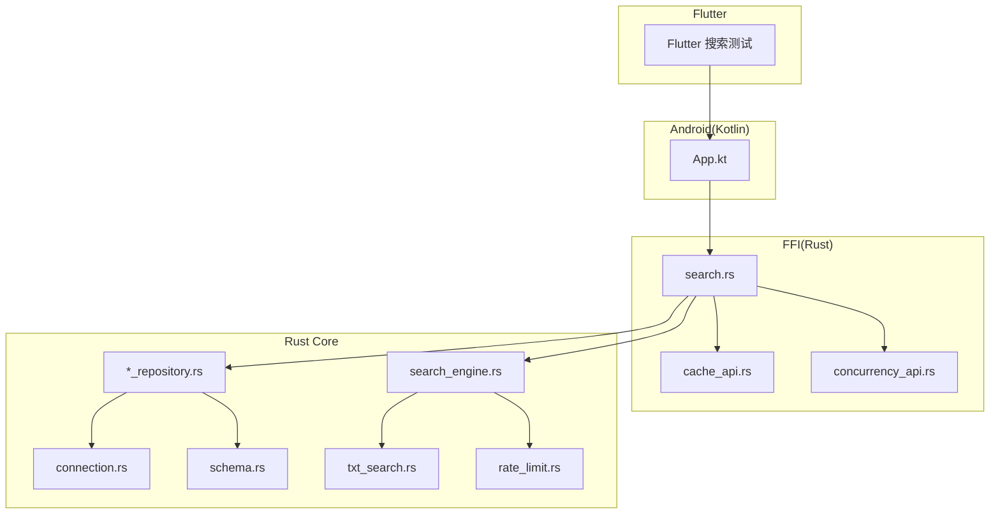
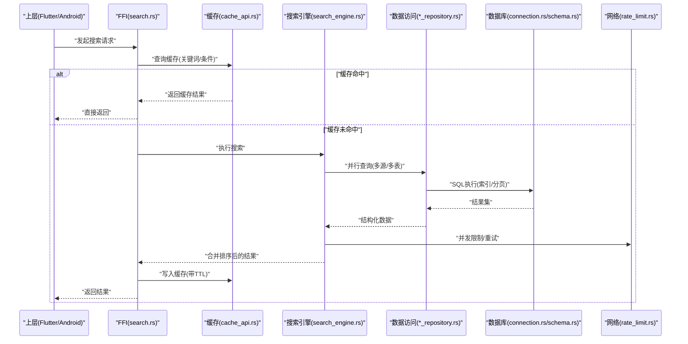
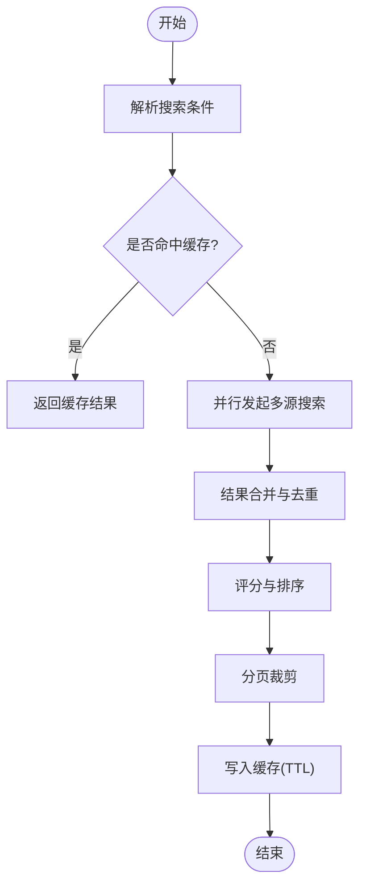
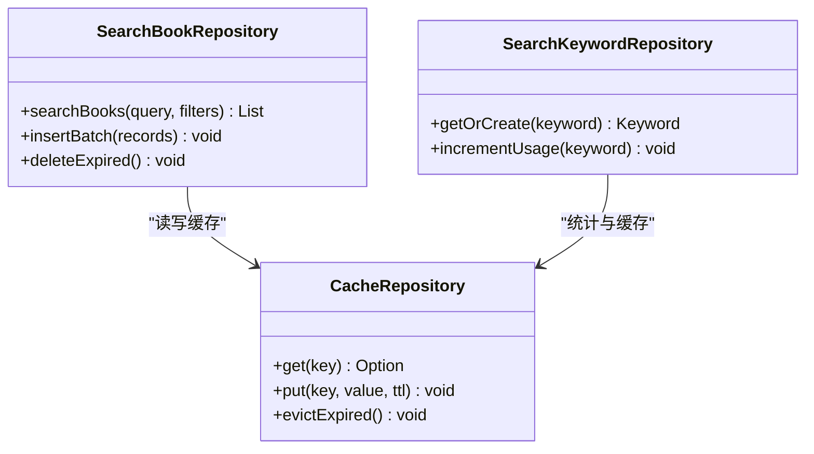
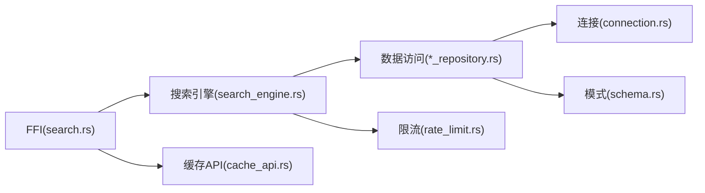

# 搜索性能优化

<cite>
**本文引用的文件**   
- [search_engine.rs](file://rust/legado-core/src/search_engine.rs)
- [search_book_repository.rs](file://rust/legado-db/src/repository/search_book_repository.rs)
- [search_keyword_repository.rs](file://rust/legado-db/src/repository/search_keyword_repository.rs)
- [cache_repository.rs](file://rust/legado-db/src/repository/cache_repository.rs)
- [cache_api.rs](file://rust/legado-ffi/src/api/cache_api.rs)
- [search.rs](file://rust/legado-ffi/src/api/search.rs)
- [txt_search.rs](file://rust/legado-book/src/txt_search.rs)
- [concurrency_api.rs](file://rust/legado-js/src/host_api/concurrency_api.rs)
- [rate_limit.rs](file://rust/legado-net/src/rate_limit.rs)
- [connection.rs](file://rust/legado-db/src/connection.rs)
- [schema.rs](file://rust/legado-db/src/schema.rs)
- [App.kt](file://app/src/main/java/io/legado/app/App.kt)
- [bookshelf_provider_test.dart](file://flutter_legado/test/unit/bookshelf_provider_test.dart)
- [search_provider_test.dart](file://flutter_legado/test/unit/search_provider_test.dart)
</cite>

## 目录
1. [简介](#简介)
2. [项目结构](#项目结构)
3. [核心组件](#核心组件)
4. [架构总览](#架构总览)
5. [详细组件分析](#详细组件分析)
6. [依赖关系分析](#依赖关系分析)
7. [性能考量](#性能考量)
8. [故障排查指南](#故障排查指南)
9. [结论](#结论)
10. [附录](#附录)

## 简介
本文件聚焦于Legado项目的搜索性能优化，围绕索引查询、内存与CPU计算、缓存策略、并发控制、数据库查询优化、内存管理与GC调优、以及监控与基准测试等维度进行系统化说明。文档以仓库中的Rust核心库、FFI接口、Android应用层与Flutter测试为线索，给出可落地的优化建议与实践路径，并辅以流程图与时序图帮助理解关键流程。

## 项目结构
Legado采用多语言混合架构：
- Rust核心库负责搜索引擎、数据访问、网络与并发控制等高性能能力；
- FFI层暴露给上层（Android/Kotlin与Flutter）调用；
- Android应用层提供UI与业务编排；
- Flutter侧包含搜索相关的单元测试，便于回归验证性能稳定性。

图表来源
- [search_engine.rs:1-200](file://rust/legado-core/src/search_engine.rs#L1-L200)
- [search.rs:1-200](file://rust/legado-ffi/src/api/search.rs#L1-L200)
- [cache_api.rs:1-200](file://rust/legado-ffi/src/api/cache_api.rs#L1-L200)
- [concurrency_api.rs:1-200](file://rust/legado-js/src/host_api/concurrency_api.rs#L1-L200)
- [search_book_repository.rs:1-200](file://rust/legado-db/src/repository/search_book_repository.rs#L1-L200)
- [cache_repository.rs:1-200](file://rust/legado-db/src/repository/cache_repository.rs#L1-L200)
- [connection.rs:1-200](file://rust/legado-db/src/connection.rs#L1-L200)
- [schema.rs:1-200](file://rust/legado-db/src/schema.rs#L1-L200)
- [txt_search.rs:1-200](file://rust/legado-book/src/txt_search.rs#L1-L200)
- [rate_limit.rs:1-200](file://rust/legado-net/src/rate_limit.rs#L1-L200)

章节来源
- [App.kt:1-200](file://app/src/main/java/io/legado/app/App.kt#L1-L200)
- [search_provider_test.dart:1-200](file://flutter_legado/test/unit/search_provider_test.dart#L1-L200)
- [bookshelf_provider_test.dart:1-200](file://flutter_legado/test/unit/bookshelf_provider_test.dart#L1-L200)

## 核心组件
- 搜索引擎（search_engine.rs）：聚合多源搜索、结果合并与排序、规则解析与匹配、文本检索（含TXT）。
- 数据访问层（*_repository.rs）：封装SQLite读写、事务与批量操作、索引利用与查询计划优化。
- FFI接口（search.rs、cache_api.rs）：对外暴露搜索与缓存能力，统一错误码与异步回调。
- 并发控制（concurrency_api.rs、rate_limit.rs）：线程池、任务调度、限流与重试。
- 连接与模式（connection.rs、schema.rs）：数据库连接池、迁移与表结构定义。
- 本地文本搜索（txt_search.rs）：针对TXT文件的快速全文检索实现。

章节来源
- [search_engine.rs:1-200](file://rust/legado-core/src/search_engine.rs#L1-L200)
- [search_book_repository.rs:1-200](file://rust/legado-db/src/repository/search_book_repository.rs#L1-L200)
- [search_keyword_repository.rs:1-200](file://rust/legado-db/src/repository/search_keyword_repository.rs#L1-L200)
- [cache_repository.rs:1-200](file://rust/legado-db/src/repository/cache_repository.rs#L1-L200)
- [search.rs:1-200](file://rust/legado-ffi/src/api/search.rs#L1-L200)
- [cache_api.rs:1-200](file://rust/legado-ffi/src/api/cache_api.rs#L1-L200)
- [concurrency_api.rs:1-200](file://rust/legado-js/src/host_api/concurrency_api.rs#L1-L200)
- [rate_limit.rs:1-200](file://rust/legado-net/src/rate_limit.rs#L1-L200)
- [connection.rs:1-200](file://rust/legado-db/src/connection.rs#L1-L200)
- [schema.rs:1-200](file://rust/legado-db/src/schema.rs#L1-L200)
- [txt_search.rs:1-200](file://rust/legado-book/src/txt_search.rs#L1-L200)

## 架构总览
搜索请求从上层进入FFI层，经搜索引擎协调数据访问与缓存，最终返回结果。关键路径包括：
- 请求入口与参数校验（FFI）
- 缓存命中判断（查询结果缓存、热点数据缓存）
- 并行多源搜索（线程池+限流）
- 数据库查询（索引扫描、分页、预取）
- 结果合并、去重与排序
- 响应序列化与回传

图表来源
- [search.rs:1-200](file://rust/legado-ffi/src/api/search.rs#L1-L200)
- [cache_api.rs:1-200](file://rust/legado-ffi/src/api/cache_api.rs#L1-L200)
- [search_engine.rs:1-200](file://rust/legado-core/src/search_engine.rs#L1-L200)
- [search_book_repository.rs:1-200](file://rust/legado-db/src/repository/search_book_repository.rs#L1-L200)
- [connection.rs:1-200](file://rust/legado-db/src/connection.rs#L1-L200)
- [schema.rs:1-200](file://rust/legado-db/src/schema.rs#L1-L200)
- [rate_limit.rs:1-200](file://rust/legado-net/src/rate_limit.rs#L1-L200)

## 详细组件分析

### 搜索引擎（search_engine.rs）
- 功能要点
  - 多源聚合：按规则解析不同数据源的搜索接口，统一结果模型。
  - 文本检索：对TXT内容进行分词与倒排索引式匹配，提升本地检索速度。
  - 结果处理：去重、评分、排序与分页裁剪，减少上层渲染压力。
- 性能关键点
  - 避免重复解析规则，使用编译期或启动期预编译。
  - 文本搜索采用内存映射与块级读取，降低IO开销。
  - 合并阶段使用堆排序或Top-K算法，控制内存峰值。

图表来源
- [search_engine.rs:1-200](file://rust/legado-core/src/search_engine.rs#L1-L200)
- [txt_search.rs:1-200](file://rust/legado-book/src/txt_search.rs#L1-L200)

章节来源
- [search_engine.rs:1-200](file://rust/legado-core/src/search_engine.rs#L1-L200)
- [txt_search.rs:1-200](file://rust/legado-book/src/txt_search.rs#L1-L200)

### 数据访问层（search_book_repository.rs、search_keyword_repository.rs、cache_repository.rs）
- 功能要点
  - 封装SQLite查询，支持批量插入、事务与索引优化。
  - 关键词与搜索结果缓存持久化，结合TTL策略。
- 性能关键点
  - 合理使用复合索引与覆盖索引，减少回表。
  - 使用EXPLAIN ANALYZE分析查询计划，避免全表扫描。
  - 批量写入采用事务包裹，减少磁盘同步次数。

图表来源
- [search_book_repository.rs:1-200](file://rust/legado-db/src/repository/search_book_repository.rs#L1-L200)
- [search_keyword_repository.rs:1-200](file://rust/legado-db/src/repository/search_keyword_repository.rs#L1-L200)
- [cache_repository.rs:1-200](file://rust/legado-db/src/repository/cache_repository.rs#L1-L200)

章节来源
- [search_book_repository.rs:1-200](file://rust/legado-db/src/repository/search_book_repository.rs#L1-L200)
- [search_keyword_repository.rs:1-200](file://rust/legado-db/src/repository/search_keyword_repository.rs#L1-L200)
- [cache_repository.rs:1-200](file://rust/legado-db/src/repository/cache_repository.rs#L1-L200)

### FFI接口（search.rs、cache_api.rs）
- 功能要点
  - 对外暴露搜索与缓存API，统一错误码与异步回调。
  - 参数校验、上下文传递与超时控制。
- 性能关键点
  - 避免在FFI层做重型计算，尽量下沉到Rust核心。
  - 使用零拷贝或最小化序列化，减少跨语言边界开销。

章节来源
- [search.rs:1-200](file://rust/legado-ffi/src/api/search.rs#L1-L200)
- [cache_api.rs:1-200](file://rust/legado-ffi/src/api/cache_api.rs#L1-L200)

### 并发控制（concurrency_api.rs、rate_limit.rs）
- 功能要点
  - 线程池管理、任务调度与优先级队列。
  - 速率限制、令牌桶与指数退避重试。
- 性能关键点
  - 合理设置线程数与队列长度，避免过度上下文切换。
  - 限流保护后端服务，防止雪崩。

章节来源
- [concurrency_api.rs:1-200](file://rust/legado-js/src/host_api/concurrency_api.rs#L1-L200)
- [rate_limit.rs:1-200](file://rust/legado-net/src/rate_limit.rs#L1-L200)

### 数据库连接与模式（connection.rs、schema.rs）
- 功能要点
  - 连接池配置、读写分离与事务隔离级别。
  - 表结构定义、索引与约束。
- 性能关键点
  - 调整连接池大小与超时，避免连接耗尽。
  - 通过外键与唯一约束保证数据一致性，减少脏读。

章节来源
- [connection.rs:1-200](file://rust/legado-db/src/connection.rs#L1-L200)
- [schema.rs:1-200](file://rust/legado-db/src/schema.rs#L1-L200)

### Android应用层（App.kt）
- 功能要点
  - 初始化全局配置、日志与崩溃上报。
  - 与FFI层交互，编排搜索流程。
- 性能关键点
  - 延迟加载非关键模块，缩短冷启动时间。
  - 使用协程与背压控制UI更新频率。

章节来源
- [App.kt:1-200](file://app/src/main/java/io/legado/app/App.kt#L1-L200)

### Flutter测试（search_provider_test.dart、bookshelf_provider_test.dart）
- 功能要点
  - 验证搜索Provider行为与性能回归。
  - 模拟网络与缓存场景，确保稳定性。
- 性能关键点
  - 使用Mock与固定种子数据，提高测试确定性。
  - 记录耗时指标，纳入CI门禁。

章节来源
- [search_provider_test.dart:1-200](file://flutter_legado/test/unit/search_provider_test.dart#L1-L200)
- [bookshelf_provider_test.dart:1-200](file://flutter_legado/test/unit/bookshelf_provider_test.dart#L1-L200)

## 依赖关系分析
搜索链路的关键依赖如下：
- FFI层依赖搜索引擎与缓存API；
- 搜索引擎依赖数据访问层与网络限流；
- 数据访问层依赖数据库连接与模式定义；
- 并发控制贯穿搜索与网络请求。

图表来源
- [search.rs:1-200](file://rust/legado-ffi/src/api/search.rs#L1-L200)
- [search_engine.rs:1-200](file://rust/legado-core/src/search_engine.rs#L1-L200)
- [cache_api.rs:1-200](file://rust/legado-ffi/src/api/cache_api.rs#L1-L200)
- [search_book_repository.rs:1-200](file://rust/legado-db/src/repository/search_book_repository.rs#L1-L200)
- [connection.rs:1-200](file://rust/legado-db/src/connection.rs#L1-L200)
- [schema.rs:1-200](file://rust/legado-db/src/schema.rs#L1-L200)
- [rate_limit.rs:1-200](file://rust/legado-net/src/rate_limit.rs#L1-L200)

章节来源
- [search.rs:1-200](file://rust/legado-ffi/src/api/search.rs#L1-L200)
- [search_engine.rs:1-200](file://rust/legado-core/src/search_engine.rs#L1-L200)
- [cache_api.rs:1-200](file://rust/legado-ffi/src/api/cache_api.rs#L1-L200)
- [search_book_repository.rs:1-200](file://rust/legado-db/src/repository/search_book_repository.rs#L1-L200)
- [connection.rs:1-200](file://rust/legado-db/src/connection.rs#L1-L200)
- [schema.rs:1-200](file://rust/legado-db/src/schema.rs#L1-L200)
- [rate_limit.rs:1-200](file://rust/legado-net/src/rate_limit.rs#L1-L200)

## 性能考量
- 索引查询优化
  - 优先使用覆盖索引与复合索引，减少回表与排序开销。
  - 对高频查询建立物化视图或中间表，加速聚合。
- 内存使用优化
  - 使用对象池复用频繁创建的对象，减少分配与GC压力。
  - 流式处理大结果集，避免一次性加载到内存。
- CPU计算优化
  - 将规则解析与正则表达式预编译，避免运行时重复构建。
  - 合并阶段使用Top-K算法，控制比较次数。
- 缓存策略
  - 多级缓存：进程内缓存（LRU）、持久化缓存（SQLite/TTL）、热点数据缓存（内存映射）。
  - 缓存失效策略：基于时间、访问频率与变更事件触发。
- 并发搜索优化
  - 多线程并行查询与异步处理，配合任务调度器与优先级队列。
  - 限流与重试机制，保护后端与数据库。
- 数据库查询优化
  - SQL改写与索引利用，避免函数导致索引失效。
  - 使用EXPLAIN ANALYZE分析查询计划，定位慢查询。
- 内存管理与GC调优
  - 合理设置堆大小与回收阈值，减少STW停顿。
  - 避免循环引用与长生命周期持有短生命周期对象。
- 监控与分析
  - 采集P95/P99延迟、QPS、命中率、GC次数与时长。
  - 集成APM与火焰图，定位热点函数与锁竞争。

[本节为通用指导，不直接分析具体文件]

## 故障排查指南
- 常见问题
  - 缓存未命中率高：检查TTL设置与缓存键设计。
  - 数据库慢查询：查看EXPLAIN输出，补充缺失索引。
  - 并发阻塞：检查线程池大小与队列长度，避免饥饿。
  - 内存泄漏：使用内存快照与泄漏检测工具定位。
- 调试方法
  - 启用详细日志与Trace ID，串联跨层调用。
  - 使用性能剖析工具生成火焰图，识别CPU热点。
  - 编写基准测试与回归用例，纳入CI门禁。

章节来源
- [connection.rs:1-200](file://rust/legado-db/src/connection.rs#L1-L200)
- [schema.rs:1-200](file://rust/legado-db/src/schema.rs#L1-L200)
- [cache_api.rs:1-200](file://rust/legado-ffi/src/api/cache_api.rs#L1-L200)
- [search_engine.rs:1-200](file://rust/legado-core/src/search_engine.rs#L1-L200)

## 结论
Legado的搜索性能优化围绕“缓存优先、并发并行、索引驱动、内存友好”展开。通过FFI层统一入口、搜索引擎聚合与数据访问层优化，结合严格的并发控制与数据库索引策略，实现了高吞吐与低延迟的搜索体验。建议在持续迭代中完善监控与基准测试，确保性能基线稳定。

[本节为总结性内容，不直接分析具体文件]

## 附录
- 推荐实践清单
  - 为高频查询建立覆盖索引，避免函数导致索引失效。
  - 使用对象池与流式处理，降低内存峰值。
  - 多级缓存与TTL策略，提升命中率与一致性。
  - 并发控制与限流，保护后端资源。
  - 定期分析查询计划与性能指标，持续优化。

[本节为补充信息，不直接分析具体文件]