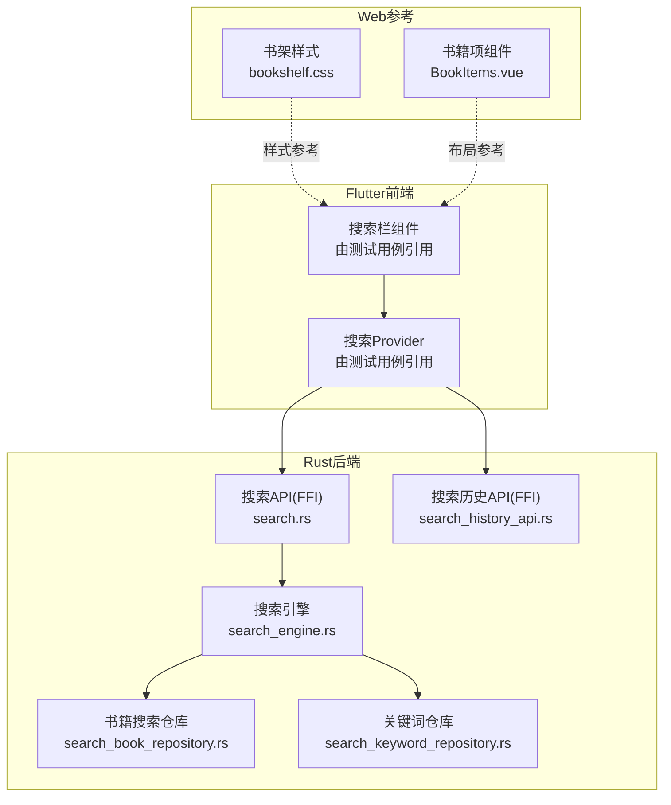
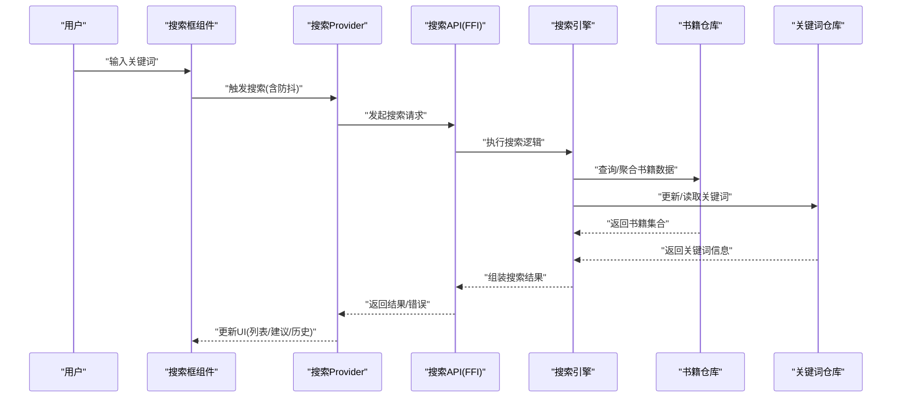
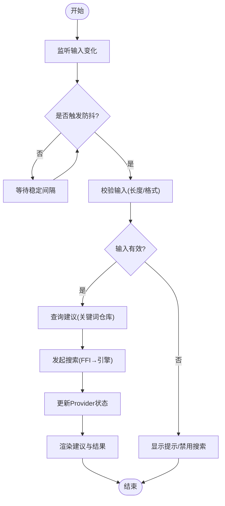
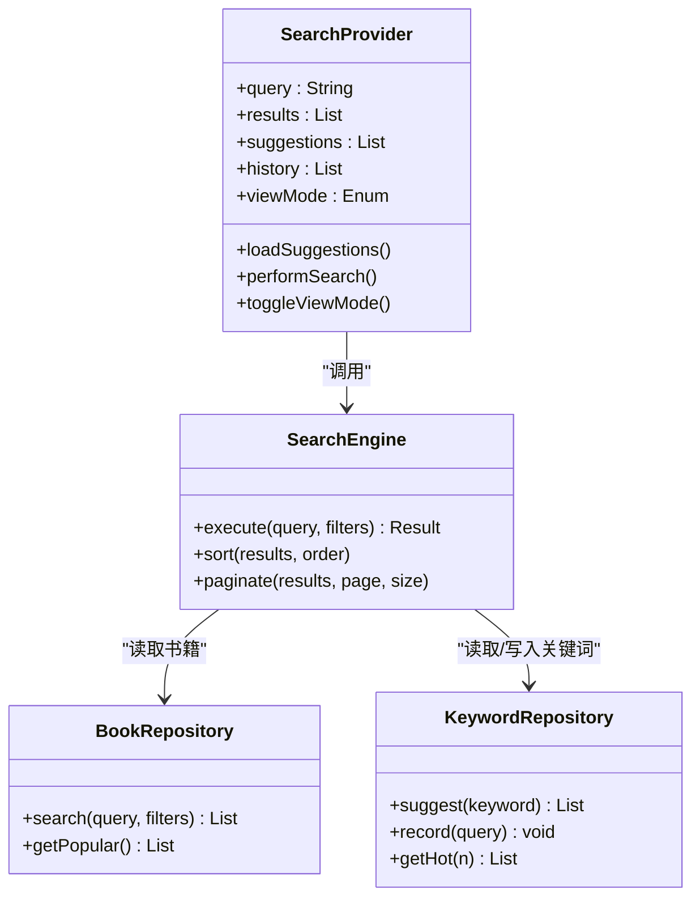
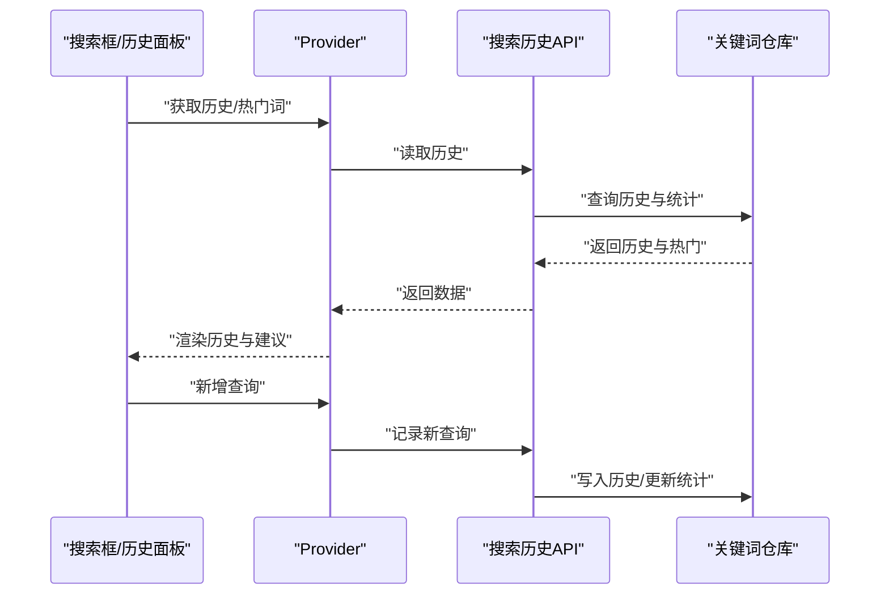
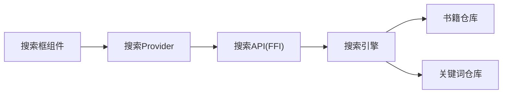

# 搜索界面组件

<cite>
**本文引用的文件**   
- [search_bar_widget_test.dart](file://flutter_legado/test/widget/search_bar_widget_test.dart)
- [search_provider_test.dart](file://flutter_legado/test/unit/search_provider_test.dart)
- [search.rs](file://rust/legado-ffi/src/api/search.rs)
- [search_history_api.rs](file://rust/legado-ffi/src/api/search_history_api.rs)
- [search_book_repository.rs](file://rust/legado-db/src/repository/search_book_repository.rs)
- [search_keyword_repository.rs](file://rust/legado-db/src/repository/search_keyword_repository.rs)
- [search_engine.rs](file://rust/legado-core/src/search_engine.rs)
- [bookshelf.css](file://modules/web/src/assets/bookshelf.css)
- [BookItems.vue](file://modules/web/src/components/BookItems.vue)
</cite>

## 目录
1. [简介](#简介)
2. [项目结构](#项目结构)
3. [核心组件](#核心组件)
4. [架构总览](#架构总览)
5. [详细组件分析](#详细组件分析)
6. [依赖分析](#依赖分析)
7. [性能考虑](#性能考虑)
8. [故障排查指南](#故障排查指南)
9. [结论](#结论)
10. [附录](#附录)

## 简介
本文件面向Legado项目的“搜索界面组件”，系统性梳理搜索框、结果展示列表、筛选面板等UI元素，以及输入提示、实时搜索、结果预览、错误处理等交互流程。同时覆盖搜索结果的多视图展示（卡片、网格、列表）、搜索历史管理（历史记录存储、热门搜索推荐、搜索建议）、搜索设置（规则配置、排序选项、显示设置）与响应式适配方案（移动端、平板端、桌面端）。文档以代码级为依据，提供架构图、时序图与流程图，并给出定位关键实现的文件路径以便快速查阅。

## 项目结构
搜索功能横跨Flutter前端、Rust后端与Web模块：
- Flutter层：测试用例体现搜索栏组件与Provider状态管理的存在与使用方式。
- Rust层：FFI暴露搜索API、搜索历史API；数据库仓库负责书籍与关键词的持久化；核心引擎封装搜索逻辑。
- Web层：样式与组件用于书架与书籍项渲染，可作为参考样式与布局思路。

图表来源 
- [search_bar_widget_test.dart](file://flutter_legado/test/widget/search_bar_widget_test.dart)
- [search_provider_test.dart](file://flutter_legado/test/unit/search_provider_test.dart)
- [search.rs](file://rust/legado-ffi/src/api/search.rs)
- [search_history_api.rs](file://rust/legado-ffi/src/api/search_history_api.rs)
- [search_engine.rs](file://rust/legado-core/src/search_engine.rs)
- [search_book_repository.rs](file://rust/legado-db/src/repository/search_book_repository.rs)
- [search_keyword_repository.rs](file://rust/legado-db/src/repository/search_keyword_repository.rs)
- [bookshelf.css](file://modules/web/src/assets/bookshelf.css)
- [BookItems.vue](file://modules/web/src/components/BookItems.vue)

章节来源
- [search_bar_widget_test.dart](file://flutter_legado/test/widget/search_bar_widget_test.dart)
- [search_provider_test.dart](file://flutter_legado/test/unit/search_provider_test.dart)
- [search.rs](file://rust/legado-ffi/src/api/search.rs)
- [search_history_api.rs](file://rust/legado-ffi/src/api/search_history_api.rs)
- [search_engine.rs](file://rust/legado-core/src/search_engine.rs)
- [search_book_repository.rs](file://rust/legado-db/src/repository/search_book_repository.rs)
- [search_keyword_repository.rs](file://rust/legado-db/src/repository/search_keyword_repository.rs)
- [bookshelf.css](file://modules/web/src/assets/bookshelf.css)
- [BookItems.vue](file://modules/web/src/components/BookItems.vue)

## 核心组件
- 搜索框组件
  - 职责：接收用户输入、触发实时搜索、展示输入建议、支持清空与快捷操作。
  - 交互要点：防抖输入、输入校验、键盘事件处理、无障碍标签。
  - 参考位置：通过Flutter测试用例可确认搜索栏组件的存在与基本行为。
  - 章节来源
    - [search_bar_widget_test.dart](file://flutter_legado/test/widget/search_bar_widget_test.dart)

- 结果展示列表
  - 职责：分页加载、多视图切换（卡片/网格/列表）、点击跳转详情。
  - 交互要点：骨架屏占位、下拉刷新、上拉加载更多、空态与错误态。
  - 参考位置：Flutter Provider测试用例体现数据流与状态更新。
  - 章节来源
    - [search_provider_test.dart](file://flutter_legado/test/unit/search_provider_test.dart)

- 筛选面板
  - 职责：按来源、分类、时间、评分等维度过滤结果，支持条件组合与重置。
  - 交互要点：面板展开收起、条件联动、默认值与最近选择记忆。

- 搜索历史与建议
  - 职责：记录历史查询、去重与限长、热门词统计、联想建议。
  - 交互要点：本地存储、异步读写、冲突合并、隐私清除。

- 搜索设置
  - 职责：排序规则（相关性/时间/评分）、显示设置（每页条数、视图模式）、网络与缓存策略。
  - 交互要点：即时生效或下次生效、默认回退、配置校验。

## 架构总览
搜索界面采用分层架构：Flutter UI层通过Provider管理状态，调用Rust FFI暴露的搜索接口；Rust核心引擎协调网络请求与解析，并通过数据库仓库持久化与检索书籍与关键词。

图表来源 
- [search.rs](file://rust/legado-ffi/src/api/search.rs)
- [search_engine.rs](file://rust/legado-core/src/search_engine.rs)
- [search_book_repository.rs](file://rust/legado-db/src/repository/search_book_repository.rs)
- [search_keyword_repository.rs](file://rust/legado-db/src/repository/search_keyword_repository.rs)

章节来源
- [search.rs](file://rust/legado-ffi/src/api/search.rs)
- [search_engine.rs](file://rust/legado-core/src/search_engine.rs)
- [search_book_repository.rs](file://rust/legado-db/src/repository/search_book_repository.rs)
- [search_keyword_repository.rs](file://rust/legado-db/src/repository/search_keyword_repository.rs)

## 详细组件分析

### 搜索框组件（输入提示与实时搜索）
- 设计要点
  - 输入监听与防抖：避免频繁触发搜索，降低网络压力。
  - 输入校验：长度限制、非法字符过滤、语言检测（可选）。
  - 输入建议：基于关键词仓库的联想与热门词推荐。
  - 键盘与无障碍：回车搜索、ESC清空、语义化标签。
- 交互流程
  - 用户输入 → Provider状态更新 → 触发搜索 → 展示建议与结果 → 错误态提示。
- 参考位置
  - 搜索栏组件的行为可通过测试用例验证。
- 章节来源
  - [search_bar_widget_test.dart](file://flutter_legado/test/widget/search_bar_widget_test.dart)
  - [search_provider_test.dart](file://flutter_legado/test/unit/search_provider_test.dart)

#### 实时搜索流程图

图表来源 
- [search_engine.rs](file://rust/legado-core/src/search_engine.rs)
- [search_keyword_repository.rs](file://rust/legado-db/src/repository/search_keyword_repository.rs)
- [search.rs](file://rust/legado-ffi/src/api/search.rs)

### 结果展示列表（卡片/网格/列表）
- 设计要点
  - 多视图切换：根据用户设置或设备宽度自动切换。
  - 分页加载：首屏最小可用集，滚动到底部继续加载。
  - 空态与错误态：无结果、网络异常、服务端错误的友好提示。
  - 骨架屏：提升感知性能。
- 参考位置
  - Provider测试用例体现数据驱动渲染与状态流转。
- 章节来源
  - [search_provider_test.dart](file://flutter_legado/test/unit/search_provider_test.dart)

#### 结果渲染类图（概念映射到仓库与引擎）

图表来源 
- [search_engine.rs](file://rust/legado-core/src/search_engine.rs)
- [search_book_repository.rs](file://rust/legado-db/src/repository/search_book_repository.rs)
- [search_keyword_repository.rs](file://rust/legado-db/src/repository/search_keyword_repository.rs)

### 筛选面板（多维过滤）
- 设计要点
  - 维度：来源、分类、时间范围、评分区间、标签等。
  - 组合：AND/OR逻辑、互斥条件、条件组保存。
  - 体验：条件计数、一键重置、最近条件记忆。
- 交互流程
  - 打开面板 → 选择条件 → 应用过滤 → 重新计算结果 → 同步Provider状态。

### 搜索历史管理与建议
- 设计要点
  - 存储：本地键值或轻量数据库，限制条目数量与过期策略。
  - 热门词：基于频次统计与时间衰减。
  - 建议：前缀匹配、同义词扩展、纠错提示。
- 参考位置
  - 搜索历史API与关键词仓库支撑历史与建议能力。
- 章节来源
  - [search_history_api.rs](file://rust/legado-ffi/src/api/search_history_api.rs)
  - [search_keyword_repository.rs](file://rust/legado-db/src/repository/search_keyword_repository.rs)

#### 历史与建议时序图

图表来源 
- [search_history_api.rs](file://rust/legado-ffi/src/api/search_history_api.rs)
- [search_keyword_repository.rs](file://rust/legado-db/src/repository/search_keyword_repository.rs)

### 搜索设置（规则、排序、显示）
- 设计要点
  - 排序：相关性、更新时间、评分、下载量等。
  - 显示：每页条数、视图模式、封面质量、懒加载开关。
  - 规则：自定义过滤规则、来源优先级、黑名单。
- 交互要点：即时生效/下次生效、默认回退、配置校验与提示。

### 响应式设计适配
- 设计要点
  - 移动端：单列列表、底部弹出筛选、手势优化。
  - 平板端：双栏布局（左侧筛选+右侧结果）、自适应网格列数。
  - 桌面端：三栏布局（搜索建议+结果+详情预览）、快捷键支持。
- 参考样式
  - Web模块中的书架样式与书籍项组件可作为布局与间距参考。
- 章节来源
  - [bookshelf.css](file://modules/web/src/assets/bookshelf.css)
  - [BookItems.vue](file://modules/web/src/components/BookItems.vue)

## 依赖分析
- 组件耦合
  - Flutter搜索框与Provider强耦合，Provider与Rust FFI弱耦合（接口契约）。
  - Rust引擎与仓库解耦，便于替换数据源与缓存策略。
- 外部依赖
  - 网络库（Rust侧）用于跨源抓取与解析。
  - 数据库（SQLite/Rust ORM）用于书籍与关键词持久化。
- 循环依赖
  - 通过接口与仓库抽象避免循环引用。

图表来源 
- [search.rs](file://rust/legado-ffi/src/api/search.rs)
- [search_engine.rs](file://rust/legado-core/src/search_engine.rs)
- [search_book_repository.rs](file://rust/legado-db/src/repository/search_book_repository.rs)
- [search_keyword_repository.rs](file://rust/legado-db/src/repository/search_keyword_repository.rs)

章节来源
- [search.rs](file://rust/legado-ffi/src/api/search.rs)
- [search_engine.rs](file://rust/legado-core/src/search_engine.rs)
- [search_book_repository.rs](file://rust/legado-db/src/repository/search_book_repository.rs)
- [search_keyword_repository.rs](file://rust/legado-db/src/repository/search_keyword_repository.rs)

## 性能考虑
- 输入防抖与节流：减少无效请求，提升响应性。
- 分页与虚拟列表：控制内存占用，提升滚动流畅度。
- 缓存策略：本地缓存热门结果与关键词，离线可用。
- 图片与资源：按需加载、压缩与占位图。
- 并发控制：限制并行请求数，避免雪崩。

## 故障排查指南
- 常见问题
  - 搜索无结果：检查关键词仓库数据、过滤条件、网络连通性。
  - 建议不更新：确认历史写入与统计任务是否正常。
  - 结果加载缓慢：查看分页大小、缓存命中率、网络延迟。
  - 视图错乱：检查Provider状态更新与UI重建时机。
- 调试建议
  - 在Provider层打印状态变更与错误堆栈。
  - 在FFI层记录请求参数与响应体。
  - 在仓库层监控SQL与索引命中情况。

章节来源
- [search_provider_test.dart](file://flutter_legado/test/unit/search_provider_test.dart)
- [search.rs](file://rust/legado-ffi/src/api/search.rs)
- [search_history_api.rs](file://rust/legado-ffi/src/api/search_history_api.rs)
- [search_book_repository.rs](file://rust/legado-db/src/repository/search_book_repository.rs)
- [search_keyword_repository.rs](file://rust/legado-db/src/repository/search_keyword_repository.rs)

## 结论
Legado的搜索界面组件通过Flutter UI、Rust FFI与数据库仓库的分层协作，实现了从输入到结果展示的完整闭环。结合多视图展示、筛选面板、历史与建议、设置与响应式适配，提供了高效且友好的搜索体验。建议在后续迭代中持续优化防抖策略、缓存命中率与可视化反馈，进一步提升用户体验与系统稳定性。

## 附录
- 术语表
  - 防抖：在一定时间内多次输入只触发一次搜索。
  - 骨架屏：加载过程中的占位图形，提升感知速度。
  - 分页：将大量结果分批次加载，降低内存与带宽压力。
- 参考样式与布局
  - 书架样式与书籍项组件可用于对齐视觉风格与间距规范。

章节来源
- [bookshelf.css](file://modules/web/src/assets/bookshelf.css)
- [BookItems.vue](file://modules/web/src/components/BookItems.vue)