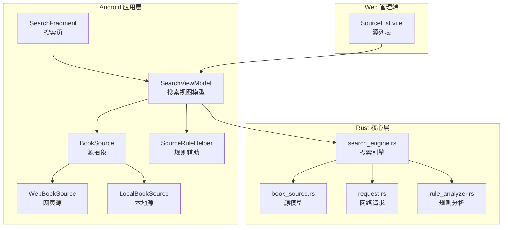
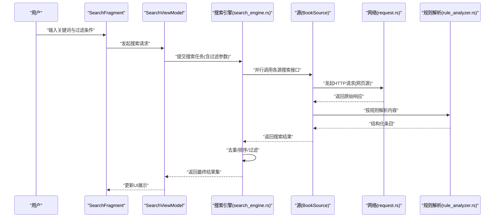
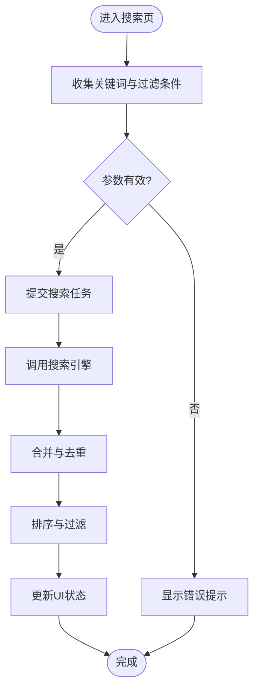
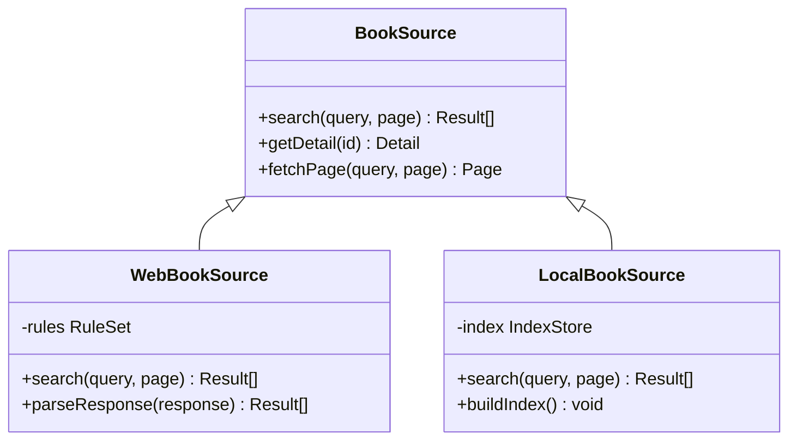
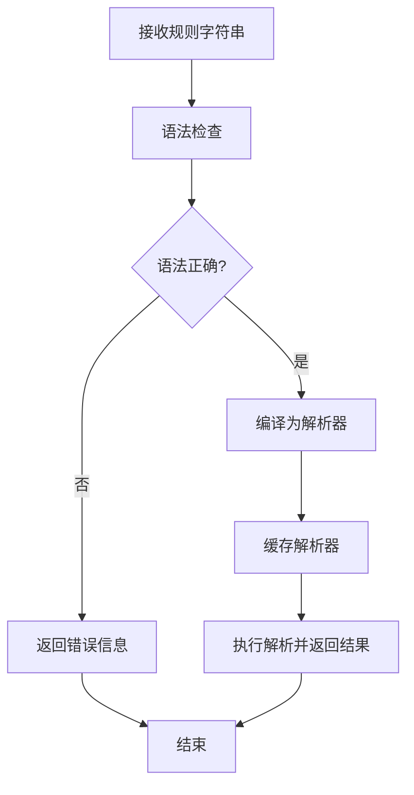
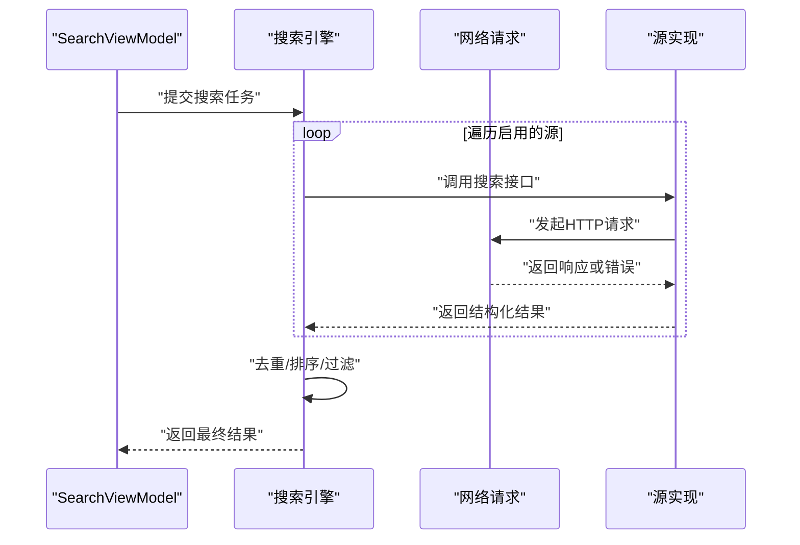
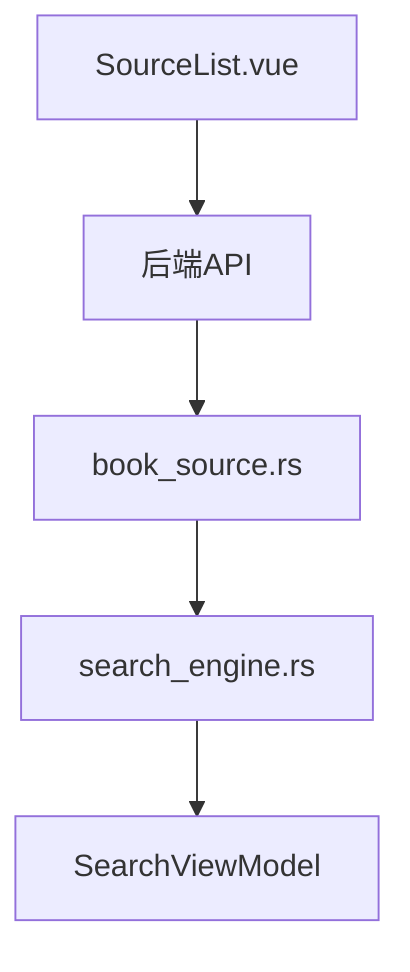
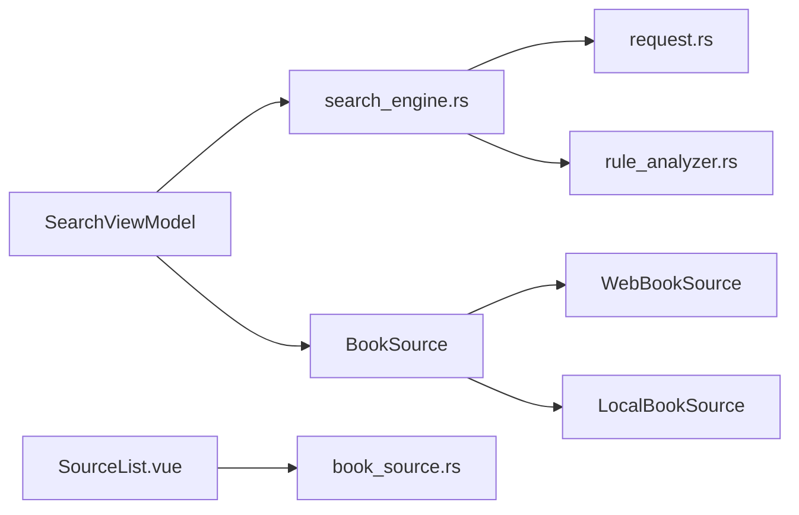

# 搜索源过滤系统

<cite>
**本文引用的文件**   
- [README.md](file://README.md)
- [app/src/main/java/io/legado/app/model/webBook/WebBookSource.kt](file://app/src/main/java/io/legado/app/model/webBook/WebBookSource.kt)
- [app/src/main/java/io/legado/app/model/localBook/LocalBookSource.kt](file://app/src/main/java/io/legado/app/model/localBook/LocalBookSource.kt)
- [app/src/main/java/io/legado/app/model/BookSource.kt](file://app/src/main/java/io/legado/app/model/BookSource.kt)
- [app/src/main/java/io/legado/app/help/source/SourceRuleHelper.kt](file://app/src/main/java/io/legado/app/help/source/SourceRuleHelper.kt)
- [app/src/main/java/io/legado/app/ui/book/search/SearchViewModel.kt](file://app/src/main/java/io/legado/app/ui/book/search/SearchViewModel.kt)
- [app/src/main/java/io/legado/app/ui/book/search/SearchFragment.kt](file://app/src/main/java/io/legado/app/ui/book/search/SearchFragment.kt)
- [rust/legado-core/src/search_engine.rs](file://rust/legado-core/src/search_engine.rs)
- [rust/legado-core/src/models/book_source.rs](file://rust/legado-core/src/models/book_source.rs)
- [rust/legado-net/src/request.rs](file://rust/legado-net/src/request.rs)
- [rust/legado-parser/src/rule_analyzer.rs](file://rust/legado-parser/src/rule_analyzer.rs)
- [modules/web/src/pages/source/SourceList.vue](file://modules/web/src/pages/source/SourceList.vue)
</cite>

## 目录
1. [简介](#简介)
2. [项目结构](#项目结构)
3. [核心组件](#核心组件)
4. [架构总览](#架构总览)
5. [详细组件分析](#详细组件分析)
6. [依赖关系分析](#依赖关系分析)
7. [性能考量](#性能考量)
8. [故障排查指南](#故障排查指南)
9. [结论](#结论)
10. [附录](#附录)

## 简介
本文件围绕“搜索源过滤系统”展开，聚焦 Legado 在书籍搜索与结果筛选过程中的关键实现：包括搜索入口、规则解析、网络请求、结果聚合与过滤、以及前端展示。文档从系统架构、数据流、处理逻辑、集成点、错误处理与性能特性等维度进行系统化说明，并提供可视化图示与排障建议，帮助读者快速理解并高效使用或扩展该子系统。

## 项目结构
Legado 采用多语言、多模块的混合架构：
- Android 应用层（Kotlin）负责 UI、业务编排与本地缓存
- Rust 核心库提供高性能的网络、解析、模型与搜索引擎能力
- Web 管理端（Vue）用于源管理与调试
- Flutter 跨平台界面作为补充

与“搜索源过滤系统”直接相关的代码主要分布在：
- app 模块：搜索页面、视图模型、源模型与规则辅助
- rust 模块：搜索引擎、网络请求、规则分析与数据模型
- modules/web：源列表与管理界面

**图表来源**
- [app/src/main/java/io/legado/app/ui/book/search/SearchFragment.kt](file://app/src/main/java/io/legado/app/ui/book/search/SearchFragment.kt)
- [app/src/main/java/io/legado/app/ui/book/search/SearchViewModel.kt](file://app/src/main/java/io/legado/app/ui/book/search/SearchViewModel.kt)
- [app/src/main/java/io/legado/app/model/BookSource.kt](file://app/src/main/java/io/legado/app/model/BookSource.kt)
- [app/src/main/java/io/legado/app/model/webBook/WebBookSource.kt](file://app/src/main/java/io/legado/app/model/webBook/WebBookSource.kt)
- [app/src/main/java/io/legado/app/model/localBook/LocalBookSource.kt](file://app/src/main/java/io/legado/app/model/localBook/LocalBookSource.kt)
- [app/src/main/java/io/legado/app/help/source/SourceRuleHelper.kt](file://app/src/main/java/io/legado/app/help/source/SourceRuleHelper.kt)
- [rust/legado-core/src/search_engine.rs](file://rust/legado-core/src/search_engine.rs)
- [rust/legado-core/src/models/book_source.rs](file://rust/legado-core/src/models/book_source.rs)
- [rust/legado-net/src/request.rs](file://rust/legado-net/src/request.rs)
- [rust/legado-parser/src/rule_analyzer.rs](file://rust/legado-parser/src/rule_analyzer.rs)
- [modules/web/src/pages/source/SourceList.vue](file://modules/web/src/pages/source/SourceList.vue)

**章节来源**
- [README.md](file://README.md)

## 核心组件
- 搜索入口与编排
  - SearchFragment：承载搜索 UI 与用户交互，触发搜索流程
  - SearchViewModel：协调搜索任务、分页、去重、排序与过滤
- 源抽象与实现
  - BookSource：统一的源接口，定义搜索、分页、内容获取等方法
  - WebBookSource：基于网页抓取的源实现，支持规则化解析
  - LocalBookSource：本地文件扫描与索引的源实现
- 规则与解析
  - SourceRuleHelper：封装规则校验、模板替换、字段映射等辅助方法
  - rule_analyzer.rs：规则语法分析与编译，生成可执行解析器
- 搜索引擎与网络
  - search_engine.rs：并发调度多个源、合并结果、统一排序与过滤
  - request.rs：HTTP/HTTPS 请求封装、重试、代理、超时控制
- 数据模型
  - book_source.rs：源配置、规则、元数据与状态的结构体定义

**章节来源**
- [app/src/main/java/io/legado/app/ui/book/search/SearchFragment.kt](file://app/src/main/java/io/legado/app/ui/book/search/SearchFragment.kt)
- [app/src/main/java/io/legado/app/ui/book/search/SearchViewModel.kt](file://app/src/main/java/io/legado/app/ui/book/search/SearchViewModel.kt)
- [app/src/main/java/io/legado/app/model/BookSource.kt](file://app/src/main/java/io/legado/app/model/BookSource.kt)
- [app/src/main/java/io/legado/app/model/webBook/WebBookSource.kt](file://app/src/main/java/io/legado/app/model/webBook/WebBookSource.kt)
- [app/src/main/java/io/legado/app/model/localBook/LocalBookSource.kt](file://app/src/main/java/io/legado/app/model/localBook/LocalBookSource.kt)
- [app/src/main/java/io/legado/app/help/source/SourceRuleHelper.kt](file://app/src/main/java/io/legado/app/help/source/SourceRuleHelper.kt)
- [rust/legado-core/src/search_engine.rs](file://rust/legado-core/src/search_engine.rs)
- [rust/legado-net/src/request.rs](file://rust/legado-net/src/request.rs)
- [rust/legado-parser/src/rule_analyzer.rs](file://rust/legado-parser/src/rule_analyzer.rs)
- [rust/legado-core/src/models/book_source.rs](file://rust/legado-core/src/models/book_source.rs)

## 架构总览
搜索源过滤系统的整体流程如下：
- 用户在搜索页输入关键词，选择过滤条件（如类型、地区、状态等）
- SearchViewModel 将请求下发至搜索引擎
- 搜索引擎并行调用各源的搜索接口（网页源通过规则解析，本地源通过索引）
- 结果经过去重、排序与过滤后返回给 UI 展示
- Web 管理端可对源进行编辑与测试，影响运行时行为

**图表来源**
- [app/src/main/java/io/legado/app/ui/book/search/SearchFragment.kt](file://app/src/main/java/io/legado/app/ui/book/search/SearchFragment.kt)
- [app/src/main/java/io/legado/app/ui/book/search/SearchViewModel.kt](file://app/src/main/java/io/legado/app/ui/book/search/SearchViewModel.kt)
- [rust/legado-core/src/search_engine.rs](file://rust/legado-core/src/search_engine.rs)
- [app/src/main/java/io/legado/app/model/BookSource.kt](file://app/src/main/java/io/legado/app/model/BookSource.kt)
- [rust/legado-net/src/request.rs](file://rust/legado-net/src/request.rs)
- [rust/legado-parser/src/rule_analyzer.rs](file://rust/legado-parser/src/rule_analyzer.rs)

## 详细组件分析

### 搜索入口与视图模型
- SearchFragment
  - 负责收集用户输入、显示加载状态、处理分页与错误提示
  - 将过滤条件（如类型、地区、是否完结等）传递给 ViewModel
- SearchViewModel
  - 维护搜索状态、结果集、分页信息
  - 调用搜索引擎执行并发搜索，并对结果进行去重、排序与过滤
  - 暴露 LiveData/StateFlow 供 UI 观察

**图表来源**
- [app/src/main/java/io/legado/app/ui/book/search/SearchFragment.kt](file://app/src/main/java/io/legado/app/ui/book/search/SearchFragment.kt)
- [app/src/main/java/io/legado/app/ui/book/search/SearchViewModel.kt](file://app/src/main/java/io/legado/app/ui/book/search/SearchViewModel.kt)

**章节来源**
- [app/src/main/java/io/legado/app/ui/book/search/SearchFragment.kt](file://app/src/main/java/io/legado/app/ui/book/search/SearchFragment.kt)
- [app/src/main/java/io/legado/app/ui/book/search/SearchViewModel.kt](file://app/src/main/java/io/legado/app/ui/book/search/SearchViewModel.kt)

### 源抽象与实现
- BookSource
  - 定义统一的搜索、分页、详情获取等接口
  - 提供默认实现与扩展点，便于新增源类型
- WebBookSource
  - 基于规则驱动的网页抓取，支持 XPath/JSONPath/正则等解析策略
  - 内置重试、代理、UA 设置等网络能力
- LocalBookSource
  - 扫描本地存储，构建索引，支持关键字匹配与元数据提取

**图表来源**
- [app/src/main/java/io/legado/app/model/BookSource.kt](file://app/src/main/java/io/legado/app/model/BookSource.kt)
- [app/src/main/java/io/legado/app/model/webBook/WebBookSource.kt](file://app/src/main/java/io/legado/app/model/webBook/WebBookSource.kt)
- [app/src/main/java/io/legado/app/model/localBook/LocalBookSource.kt](file://app/src/main/java/io/legado/app/model/localBook/LocalBookSource.kt)

**章节来源**
- [app/src/main/java/io/legado/app/model/BookSource.kt](file://app/src/main/java/io/legado/app/model/BookSource.kt)
- [app/src/main/java/io/legado/app/model/webBook/WebBookSource.kt](file://app/src/main/java/io/legado/app/model/webBook/WebBookSource.kt)
- [app/src/main/java/io/legado/app/model/localBook/LocalBookSource.kt](file://app/src/main/java/io/legado/app/model/localBook/LocalBookSource.kt)

### 规则与解析
- SourceRuleHelper
  - 封装规则校验、模板替换、字段映射、异常兜底
  - 为 UI 与源实现提供一致的规则处理能力
- rule_analyzer.rs
  - 解析规则语法，生成可执行的解析器
  - 支持多种表达式与函数，提升解析效率

**图表来源**
- [app/src/main/java/io/legado/app/help/source/SourceRuleHelper.kt](file://app/src/main/java/io/legado/app/help/source/SourceRuleHelper.kt)
- [rust/legado-parser/src/rule_analyzer.rs](file://rust/legado-parser/src/rule_analyzer.rs)

**章节来源**
- [app/src/main/java/io/legado/app/help/source/SourceRuleHelper.kt](file://app/src/main/java/io/legado/app/help/source/SourceRuleHelper.kt)
- [rust/legado-parser/src/rule_analyzer.rs](file://rust/legado-parser/src/rule_analyzer.rs)

### 搜索引擎与网络
- search_engine.rs
  - 并发调度多个源，限制并发度，避免资源耗尽
  - 合并结果，执行去重、排序与过滤
  - 支持超时与失败重试策略
- request.rs
  - 封装 HTTP/HTTPS 请求，支持代理、UA、Cookie、SSL 配置
  - 提供重试、退避、限流等机制

**图表来源**
- [rust/legado-core/src/search_engine.rs](file://rust/legado-core/src/search_engine.rs)
- [rust/legado-net/src/request.rs](file://rust/legado-net/src/request.rs)
- [app/src/main/java/io/legado/app/ui/book/search/SearchViewModel.kt](file://app/src/main/java/io/legado/app/ui/book/search/SearchViewModel.kt)

**章节来源**
- [rust/legado-core/src/search_engine.rs](file://rust/legado-core/src/search_engine.rs)
- [rust/legado-net/src/request.rs](file://rust/legado-net/src/request.rs)

### Web 管理端与源配置
- SourceList.vue
  - 展示已配置的源列表，支持启用/禁用、编辑、测试
  - 与后端 API 交互，同步源配置到运行环境

**图表来源**
- [modules/web/src/pages/source/SourceList.vue](file://modules/web/src/pages/source/SourceList.vue)
- [rust/legado-core/src/models/book_source.rs](file://rust/legado-core/src/models/book_source.rs)
- [rust/legado-core/src/search_engine.rs](file://rust/legado-core/src/search_engine.rs)
- [app/src/main/java/io/legado/app/ui/book/search/SearchViewModel.kt](file://app/src/main/java/io/legado/app/ui/book/search/SearchViewModel.kt)

**章节来源**
- [modules/web/src/pages/source/SourceList.vue](file://modules/web/src/pages/source/SourceList.vue)
- [rust/legado-core/src/models/book_source.rs](file://rust/legado-core/src/models/book_source.rs)

## 依赖关系分析
- Android 层依赖 Rust 核心库提供的搜索引擎、网络与解析能力
- Web 管理端通过 API 与后端交互，影响源配置与运行时行为
- 源实现与规则解析解耦，便于扩展新源类型与解析策略

**图表来源**
- [app/src/main/java/io/legado/app/ui/book/search/SearchViewModel.kt](file://app/src/main/java/io/legado/app/ui/book/search/SearchViewModel.kt)
- [rust/legado-core/src/search_engine.rs](file://rust/legado-core/src/search_engine.rs)
- [app/src/main/java/io/legado/app/model/BookSource.kt](file://app/src/main/java/io/legado/app/model/BookSource.kt)
- [app/src/main/java/io/legado/app/model/webBook/WebBookSource.kt](file://app/src/main/java/io/legado/app/model/webBook/WebBookSource.kt)
- [app/src/main/java/io/legado/app/model/localBook/LocalBookSource.kt](file://app/src/main/java/io/legado/app/model/localBook/LocalBookSource.kt)
- [rust/legado-net/src/request.rs](file://rust/legado-net/src/request.rs)
- [rust/legado-parser/src/rule_analyzer.rs](file://rust/legado-parser/src/rule_analyzer.rs)
- [modules/web/src/pages/source/SourceList.vue](file://modules/web/src/pages/source/SourceList.vue)
- [rust/legado-core/src/models/book_source.rs](file://rust/legado-core/src/models/book_source.rs)

**章节来源**
- [app/src/main/java/io/legado/app/ui/book/search/SearchViewModel.kt](file://app/src/main/java/io/legado/app/ui/book/search/SearchViewModel.kt)
- [rust/legado-core/src/search_engine.rs](file://rust/legado-core/src/search_engine.rs)
- [app/src/main/java/io/legado/app/model/BookSource.kt](file://app/src/main/java/io/legado/app/model/BookSource.kt)
- [rust/legado-net/src/request.rs](file://rust/legado-net/src/request.rs)
- [rust/legado-parser/src/rule_analyzer.rs](file://rust/legado-parser/src/rule_analyzer.rs)
- [modules/web/src/pages/source/SourceList.vue](file://modules/web/src/pages/source/SourceList.vue)
- [rust/legado-core/src/models/book_source.rs](file://rust/legado-core/src/models/book_source.rs)

## 性能考量
- 并发控制：搜索引擎限制并发度，避免过多网络请求导致阻塞或崩溃
- 结果去重：基于标题、作者、链接等关键字段进行去重，减少冗余
- 规则缓存：规则解析器缓存，避免重复编译开销
- 网络优化：支持代理、超时、重试与退避，提高稳定性
- UI 异步：ViewModel 使用协程/响应式流，避免主线程阻塞

[本节为通用指导，不直接分析具体文件]

## 故障排查指南
- 搜索无结果
  - 检查源是否启用、规则是否正确、网络是否可达
  - 查看日志中的错误码与提示信息
- 结果重复或排序异常
  - 确认去重键与排序字段配置
  - 检查规则解析是否稳定
- 网络请求失败
  - 检查代理、UA、SSL 配置
  - 查看重试与退避策略是否合理

**章节来源**
- [rust/legado-core/src/search_engine.rs](file://rust/legado-core/src/search_engine.rs)
- [rust/legado-net/src/request.rs](file://rust/legado-net/src/request.rs)
- [rust/legado-parser/src/rule_analyzer.rs](file://rust/legado-parser/src/rule_analyzer.rs)

## 结论
搜索源过滤系统在 Legado 中承担关键角色，通过清晰的层次划分与模块化设计，实现了高内聚、低耦合的搜索与过滤能力。Android 层负责交互与编排，Rust 核心层提供高性能的网络、解析与调度，Web 管理端则提供便捷的源管理能力。整体架构具备良好的可扩展性与稳定性，适合持续演进与功能增强。

[本节为总结性内容，不直接分析具体文件]

## 附录
- 相关术语
  - 源：提供书籍搜索与内容获取能力的模块
  - 规则：描述如何从原始响应中提取结构化数据的配置
  - 搜索引擎：协调多源搜索、合并与过滤的核心组件
- 最佳实践
  - 合理配置规则，避免复杂解析导致性能下降
  - 控制并发与重试策略，平衡速度与稳定性
  - 定期清理无效源，保持搜索结果质量

[本节为补充信息，不直接分析具体文件]