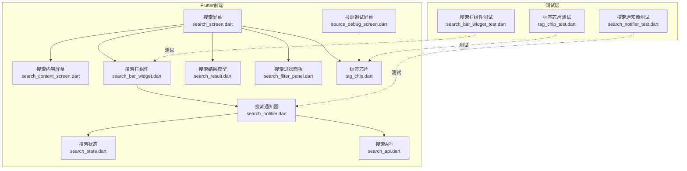
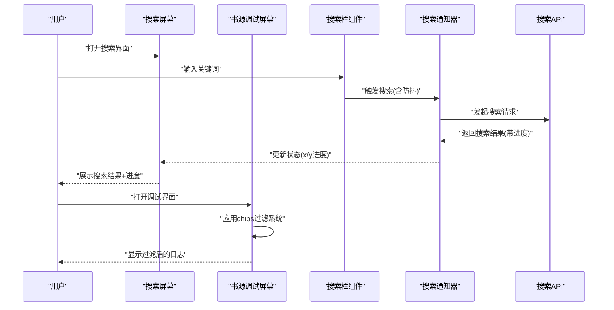
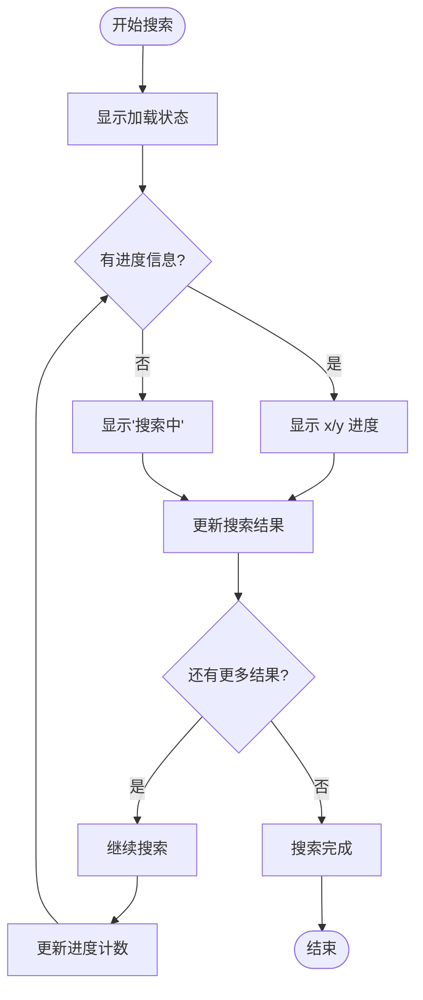
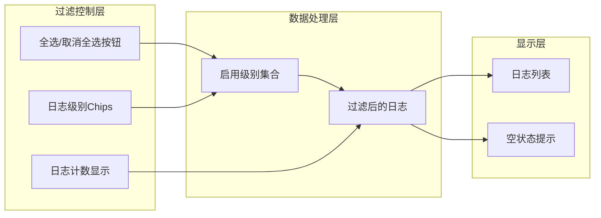
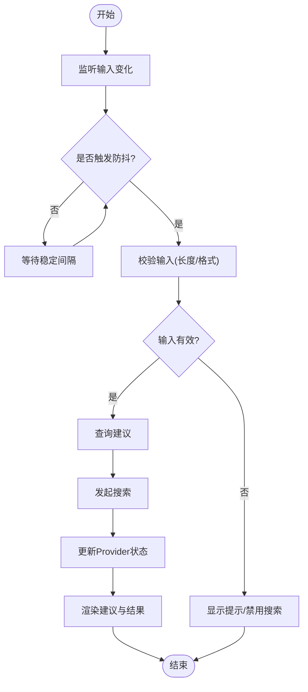
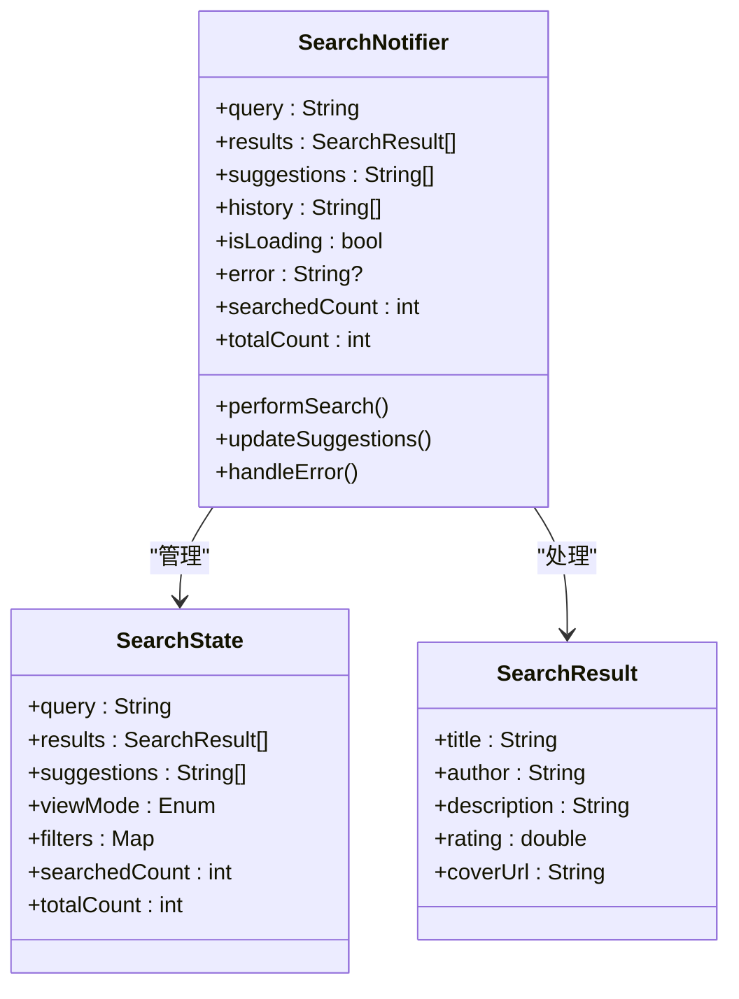
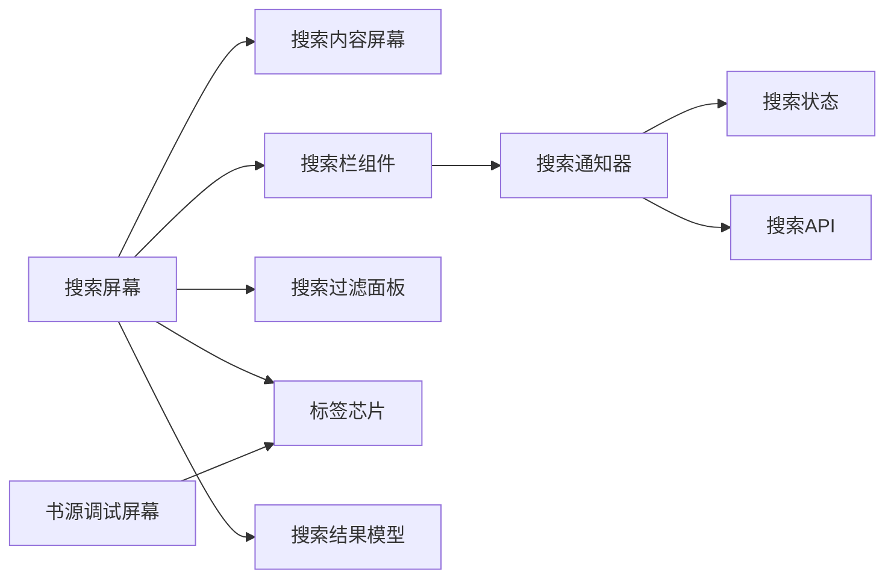

# 搜索界面组件

<cite>
**本文引用的文件**   
- [search_screen.dart](file://flutter_legado/lib/src/screens/search_screen.dart)
- [source_debug_screen.dart](file://flutter_legado/lib/src/screens/source_debug_screen.dart)
- [search_content_screen.dart](file://flutter_legado/lib/src/screens/search_content_screen.dart)
- [search_bar_widget.dart](file://flutter_legado/lib/src/widgets/search_bar_widget.dart)
- [search_notifier.dart](file://flutter_legado/lib/src/providers/search/search_notifier.dart)
- [search_state.dart](file://flutter_legado/lib/src/providers/search/search_state.dart)
- [search_result.dart](file://flutter_legado/lib/src/models/search_result.dart)
- [search_filter_panel.dart](file://flutter_legado/lib/src/widgets/search_filter_panel.dart)
- [tag_chip.dart](file://flutter_legado/lib/src/widgets/tag_chip.dart)
- [search_api.dart](file://flutter_legado/lib/src/bridge/api/search.dart)
- [search_bar_widget_test.dart](file://flutter_legado/test/widget/search_bar_widget_test.dart)
- [search_notifier_test.dart](file://flutter_legado/test/unit/search_notifier_test.dart)
- [tag_chip_test.dart](file://flutter_legado/test/widget/tag_chip_test.dart)
</cite>

## 更新摘要
**变更内容**   
- 增强了搜索界面的实时搜索进度显示，采用x/y格式展示搜索进度状态
- 在搜索结果中添加了类别标签和字数信息的显示功能
- source_debug_screen.dart实现了新的chips基础过滤系统，使用水平滚动容器替代固定行布局
- 优化了搜索界面的响应式设计和用户体验

## 目录
1. [简介](#简介)
2. [项目结构](#项目结构)
3. [核心组件](#核心组件)
4. [架构总览](#架构总览)
5. [详细组件分析](#详细组件分析)
6. [依赖分析](#依赖分析)
7. [性能考虑](#性能考虑)
8. [故障排查指南](#故障排查指南)
9. [结论](#结论)
10. [附录](#附录)

## 简介
本文件面向Legado项目的"搜索界面组件"，系统性梳理搜索框、结果展示列表、筛选面板等UI元素，以及输入提示、实时搜索、结果预览、错误处理等交互流程。重点关注最新的实时搜索进度显示增强功能，通过x/y格式提供直观的搜索进度反馈，同时支持类别标签和字数信息的展示。此外，还涵盖了source_debug_screen中的新chips基础过滤系统，通过水平滚动容器优化了窄屏设备的显示效果。文档覆盖搜索结果的多视图展示、搜索历史管理、搜索设置与响应式适配方案，并提供具体的UI组件代码示例和样式配置说明。

## 项目结构
搜索功能横跨Flutter前端：
- Flutter层：包含搜索屏幕、调试屏幕、内容屏幕、搜索栏组件、状态管理和API桥接。
- 测试层：单元测试和Widget测试确保搜索功能的稳定性。

**图表来源** 
- [search_screen.dart](file://flutter_legado/lib/src/screens/search_screen.dart)
- [source_debug_screen.dart](file://flutter_legado/lib/src/screens/source_debug_screen.dart)
- [search_content_screen.dart](file://flutter_legado/lib/src/screens/search_content_screen.dart)
- [search_bar_widget.dart](file://flutter_legado/lib/src/widgets/search_bar_widget.dart)
- [search_notifier.dart](file://flutter_legado/lib/src/providers/search/search_notifier.dart)
- [search_state.dart](file://flutter_legado/lib/src/providers/search/search_state.dart)
- [search_result.dart](file://flutter_legado/lib/src/models/search_result.dart)
- [search_filter_panel.dart](file://flutter_legado/lib/src/widgets/search_filter_panel.dart)
- [tag_chip.dart](file://flutter_legado/lib/src/widgets/tag_chip.dart)
- [search_api.dart](file://flutter_legado/lib/src/bridge/api/search.dart)
- [search_bar_widget_test.dart](file://flutter_legado/test/widget/search_bar_widget_test.dart)
- [search_notifier_test.dart](file://flutter_legado/test/unit/search_notifier_test.dart)
- [tag_chip_test.dart](file://flutter_legado/test/widget/tag_chip_test.dart)

章节来源
- [search_screen.dart](file://flutter_legado/lib/src/screens/search_screen.dart)
- [source_debug_screen.dart](file://flutter_legado/lib/src/screens/source_debug_screen.dart)
- [search_content_screen.dart](file://flutter_legado/lib/src/screens/search_content_screen.dart)
- [search_bar_widget.dart](file://flutter_legado/lib/src/widgets/search_bar_widget.dart)
- [search_notifier.dart](file://flutter_legado/lib/src/providers/search/search_notifier.dart)
- [search_state.dart](file://flutter_legado/lib/src/providers/search/search_state.dart)
- [search_result.dart](file://flutter_legado/lib/src/models/search_result.dart)
- [search_filter_panel.dart](file://flutter_legado/lib/src/widgets/search_filter_panel.dart)
- [tag_chip.dart](file://flutter_legado/lib/src/widgets/tag_chip.dart)
- [search_api.dart](file://flutter_legado/lib/src/bridge/api/search.dart)
- [search_bar_widget_test.dart](file://flutter_legado/test/widget/search_bar_widget_test.dart)
- [search_notifier_test.dart](file://flutter_legado/test/unit/search_notifier_test.dart)
- [tag_chip_test.dart](file://flutter_legado/test/widget/tag_chip_test.dart)

## 核心组件
- 搜索屏幕
  - 职责：主搜索界面容器，管理搜索状态和导航逻辑。
  - 交互要点：搜索结果点击导航、返回处理、状态同步。
  - **更新**：增强了实时搜索进度显示，采用x/y格式展示搜索进度，支持类别标签和字数信息。

- 书源调试屏幕
  - 职责：书源调试工具，支持按日志级别过滤的调试输出。
  - 交互要点：日志级别过滤、调试执行、结果展示。
  - **更新**：实现了新的chips基础过滤系统，使用水平滚动容器防止溢出。

- 搜索内容屏幕
  - 职责：搜索结果展示界面，支持多种视图模式。
  - 交互要点：分页加载、下拉刷新、上拉加载更多、空态与错误态。

- 搜索栏组件
  - 职责：接收用户输入、触发实时搜索、展示输入建议、支持清空与快捷操作。
  - 交互要点：防抖输入、输入校验、键盘事件处理、无障碍标签。

- 搜索通知器
  - 职责：管理搜索状态和业务逻辑，协调数据流。
  - 交互要点：状态管理、错误处理、缓存策略。

- 搜索结果模型
  - 职责：定义搜索结果的数据结构和序列化。
  - 特性：支持书籍信息、评分、作者、描述等字段。

- 搜索过滤面板
  - 职责：书源多选筛选面板，支持搜索和批量操作。
  - **更新**：分组选择功能已迁移至搜索屏幕的锚定弹出菜单，面板仅保留书源多选功能。

- 标签芯片组件
  - 职责：可点击、可删除的标签组件，用于显示分类和筛选信息。
  - **新增**：支持自定义颜色、删除回调和点击回调。

## 架构总览
搜索界面采用分层架构：Flutter UI层通过Provider管理状态，调用API桥接进行搜索；状态管理负责数据流和UI更新。

**图表来源** 
- [search_screen.dart](file://flutter_legado/lib/src/screens/search_screen.dart)
- [source_debug_screen.dart](file://flutter_legado/lib/src/screens/source_debug_screen.dart)
- [search_bar_widget.dart](file://flutter_legado/lib/src/widgets/search_bar_widget.dart)
- [search_notifier.dart](file://flutter_legado/lib/src/providers/search/search_notifier.dart)
- [search_api.dart](file://flutter_legado/lib/src/bridge/api/search.dart)

章节来源
- [search_screen.dart](file://flutter_legado/lib/src/screens/search_screen.dart)
- [source_debug_screen.dart](file://flutter_legado/lib/src/screens/source_debug_screen.dart)
- [search_bar_widget.dart](file://flutter_legado/lib/src/widgets/search_bar_widget.dart)
- [search_notifier.dart](file://flutter_legado/lib/src/providers/search/search_notifier.dart)
- [search_api.dart](file://flutter_legado/lib/src/bridge/api/search.dart)

## 详细组件分析

### 搜索屏幕（实时搜索进度增强）
- 设计要点
  - 实时进度显示：采用x/y格式展示搜索进度，如"搜索中 3/10"，提供清晰的进度反馈。
  - 类别标签支持：在搜索结果中显示书籍的分类标签和字数信息。
  - 锚定弹出菜单：使用 `GlobalKey` 精确定位三点头部菜单，弹出分组选择菜单。
  - 分组选择逻辑：支持单选分组、取消分组、全部书源选择和书源多选入口。
  - 自动重搜索：选择分组后如有关键词自动重新搜索，提升用户体验。
- 参考位置
  - `_showGroupScopeMenu()` 方法实现了完整的分组选择逻辑。
  - `_menuButtonKey` 用于精确定位弹出菜单位置。
  - 搜索结果项中的类别标签显示逻辑。
- 章节来源
  - [search_screen.dart:31-32](file://flutter_legado/lib/src/screens/search_screen.dart#L31-L32)
  - [search_screen.dart:117-154](file://flutter_legado/lib/src/screens/search_screen.dart#L117-L154)
  - [search_screen.dart:180-187](file://flutter_legado/lib/src/screens/search_screen.dart#L180-L187)
  - [search_screen.dart:214-255](file://flutter_legado/lib/src/screens/search_screen.dart#L214-L255)
  - [search_screen.dart:278-384](file://flutter_legado/lib/src/screens/search_screen.dart#L278-L384)
  - [search_screen.dart:372-455](file://flutter_legado/lib/src/screens/search_screen.dart#L372-L455)

#### 实时搜索进度流程图

**图表来源** 
- [search_screen.dart:180-187](file://flutter_legado/lib/src/screens/search_screen.dart#L180-L187)
- [search_screen.dart:214-255](file://flutter_legado/lib/src/screens/search_screen.dart#L214-L255)

### 书源调试屏幕（Chips过滤系统）
- 设计要点
  - Chips基础过滤：实现基于FilterChip的日志级别过滤系统。
  - 水平滚动容器：使用SingleChildScrollView配合横向滚动，防止窄屏设备溢出。
  - 动态过滤：支持全选/取消全选、单个级别切换。
  - 视觉反馈：不同日志级别使用不同的颜色和背景色。
- 交互流程
  - 用户选择日志级别 → 实时更新过滤条件 → 动态显示匹配的日志条目。
- 参考位置
  - 日志级别过滤栏的实现。
  - 水平滚动的chips布局。
- 章节来源
  - [source_debug_screen.dart:233-311](file://flutter_legado/lib/src/screens/source_debug_screen.dart#L233-L311)
  - [source_debug_screen.dart:265-300](file://flutter_legado/lib/src/screens/source_debug_screen.dart#L265-L300)

#### Chips过滤系统架构图

**图表来源** 
- [source_debug_screen.dart:233-311](file://flutter_legado/lib/src/screens/source_debug_screen.dart#L233-L311)

### 搜索栏组件（输入提示与实时搜索）
- 设计要点
  - 输入监听与防抖：避免频繁触发搜索，降低网络压力。
  - 输入校验：长度限制、非法字符过滤、语言检测（可选）。
  - 输入建议：基于关键词仓库的联想与热门词推荐。
  - 键盘与无障碍：回车搜索、ESC清空、语义化标签。
- 交互流程
  - 用户输入 → Provider状态更新 → 触发搜索 → 展示建议与结果 → 错误态提示。
- 参考位置
  - 搜索栏组件的行为可通过测试用例验证。
- 章节来源
  - [search_bar_widget.dart](file://flutter_legado/lib/src/widgets/search_bar_widget.dart)
  - [search_bar_widget_test.dart](file://flutter_legado/test/widget/search_bar_widget_test.dart)

#### 实时搜索流程图

### 搜索内容屏幕（多视图展示）
- 设计要点
  - 多视图切换：根据用户设置或设备宽度自动切换。
  - 分页加载：首屏最小可用集，滚动到底部继续加载。
  - 空态与错误态：无结果、网络异常、服务端错误的友好提示。
  - 骨架屏：提升感知性能。
- 参考位置
  - 搜索内容屏幕体现数据驱动渲染与状态流转。
- 章节来源
  - [search_content_screen.dart](file://flutter_legado/lib/src/screens/search_content_screen.dart)

### 搜索通知器（状态管理）
- 设计要点
  - 状态管理：统一管理搜索状态、结果、加载状态、错误信息。
  - 业务逻辑：封装搜索算法、过滤条件、排序规则。
  - 缓存策略：本地缓存搜索结果，提升响应速度。
  - **更新**：支持渐进搜索进度跟踪，维护searchedCount和totalCount。
- 交互要点：状态更新、错误处理、异步操作管理。
- 参考位置
  - 搜索通知器的测试用例验证了状态管理的正确性。
- 章节来源
  - [search_notifier.dart](file://flutter_legado/lib/src/providers/search/search_notifier.dart)
  - [search_notifier_test.dart](file://flutter_legado/test/unit/search_notifier_test.dart)

#### 状态管理类图

**图表来源** 
- [search_notifier.dart](file://flutter_legado/lib/src/providers/search/search_notifier.dart)
- [search_state.dart](file://flutter_legado/lib/src/providers/search/search_state.dart)
- [search_result.dart](file://flutter_legado/lib/src/models/search_result.dart)

### 搜索过滤面板（书源多选）
- 设计要点
  - 书源多选：支持搜索、全选/取消全选、批量操作。
  - 高度优化：初始高度调整为0.9，避免列表截断。
  - **更新**：分组选择功能已迁移至搜索屏幕的锚定弹出菜单，面板仅保留书源多选。
- 参考位置
  - 搜索过滤面板现在专注于书源多选功能。
- 章节来源
  - [search_filter_panel.dart](file://flutter_legado/lib/src/widgets/search_filter_panel.dart)

### 标签芯片组件（TagChip）
- 设计要点
  - 可复用组件：支持自定义标签文本、颜色、删除回调和点击回调。
  - 视觉设计：圆角矩形设计，支持主题适配。
  - 交互功能：点击标签触发onTap回调，点击关闭图标触发onDeleted回调。
- 使用场景：搜索结果中的分类标签、筛选条件标签等。
- 参考位置
  - 标签芯片组件的完整实现和测试用例。
- 章节来源
  - [tag_chip.dart](file://flutter_legado/lib/src/widgets/tag_chip.dart)
  - [tag_chip_test.dart](file://flutter_legado/test/widget/tag_chip_test.dart)

### 搜索API（数据桥接）
- 设计要点
  - API接口：封装搜索相关的网络请求。
  - 错误处理：统一的错误捕获和处理机制。
  - 数据转换：将原始数据转换为应用可用的模型。
  - **更新**：支持渐进搜索流式返回，提供实时进度信息。
- 参考位置
  - 搜索API定义了与后端通信的接口规范。
- 章节来源
  - [search_api.dart](file://flutter_legado/lib/src/bridge/api/search.dart)

## 依赖分析
- 组件耦合
  - Flutter搜索屏幕与搜索内容屏幕强耦合，通过状态管理解耦。
  - 搜索栏组件与搜索通知器弱耦合（通过回调接口）。
  - 搜索屏幕与搜索过滤面板通过Provider解耦。
  - 书源调试屏幕与标签芯片组件通过组合关系耦合。
  - 所有组件与搜索API通过接口契约解耦。
- 外部依赖
  - Flutter框架用于UI构建和导航。
  - 状态管理库用于数据流管理。
- 循环依赖
  - 通过接口和抽象避免循环引用。

**图表来源** 
- [search_screen.dart](file://flutter_legado/lib/src/screens/search_screen.dart)
- [source_debug_screen.dart](file://flutter_legado/lib/src/screens/source_debug_screen.dart)
- [search_content_screen.dart](file://flutter_legado/lib/src/screens/search_content_screen.dart)
- [search_bar_widget.dart](file://flutter_legado/lib/src/widgets/search_bar_widget.dart)
- [search_notifier.dart](file://flutter_legado/lib/src/providers/search/search_notifier.dart)
- [search_state.dart](file://flutter_legado/lib/src/providers/search/search_state.dart)
- [search_filter_panel.dart](file://flutter_legado/lib/src/widgets/search_filter_panel.dart)
- [tag_chip.dart](file://flutter_legado/lib/src/widgets/tag_chip.dart)
- [search_api.dart](file://flutter_legado/lib/src/bridge/api/search.dart)
- [search_result.dart](file://flutter_legado/lib/src/models/search_result.dart)

章节来源
- [search_screen.dart](file://flutter_legado/lib/src/screens/search_screen.dart)
- [source_debug_screen.dart](file://flutter_legado/lib/src/screens/source_debug_screen.dart)
- [search_content_screen.dart](file://flutter_legado/lib/src/screens/search_content_screen.dart)
- [search_bar_widget.dart](file://flutter_legado/lib/src/widgets/search_bar_widget.dart)
- [search_notifier.dart](file://flutter_legado/lib/src/providers/search/search_notifier.dart)
- [search_state.dart](file://flutter_legado/lib/src/providers/search/search_state.dart)
- [search_filter_panel.dart](file://flutter_legado/lib/src/widgets/search_filter_panel.dart)
- [tag_chip.dart](file://flutter_legado/lib/src/widgets/tag_chip.dart)
- [search_api.dart](file://flutter_legado/lib/src/bridge/api/search.dart)
- [search_result.dart](file://flutter_legado/lib/src/models/search_result.dart)

## 性能考虑
- 输入防抖与节流：减少无效请求，提升响应性。
- 分页与虚拟列表：控制内存占用，提升滚动流畅度。
- 缓存策略：本地缓存搜索结果和关键词，离线可用。
- 图片与资源：按需加载、压缩与占位图。
- 并发控制：限制并行请求数，避免雪崩。
- **更新**：实时搜索进度显示减少了不必要的UI重建，提升了性能。
- **更新**：水平滚动的chips布局避免了窄屏设备的溢出问题。
- **更新**：渐进搜索流式返回提供了更好的用户体验。

## 故障排查指南
- 常见问题
  - 搜索无结果：检查关键词、过滤条件、网络连通性。
  - 导航失败：确认路由配置和参数传递。
  - 结果加载缓慢：查看分页大小、缓存命中率、网络延迟。
  - 视图错乱：检查状态更新与UI重建时机。
  - **更新**：进度显示异常：检查searchedCount和totalCount是否正确更新。
  - **更新**：Chips过滤不生效：检查_enabledLevels集合是否正确维护。
  - **更新**：类别标签显示异常：检查book.kind和wordCount字段是否存在。
- 调试建议
  - 在搜索通知器层打印状态变更与错误堆栈。
  - 在API层记录请求参数与响应体。
  - 使用Flutter DevTools监控性能指标。
  - **更新**：检查进度数据的来源和更新逻辑。
  - **更新**：验证chips过滤系统的状态同步机制。
- 章节来源
  - [search_notifier_test.dart](file://flutter_legado/test/unit/search_notifier_test.dart)
  - [search_bar_widget_test.dart](file://flutter_legado/test/widget/search_bar_widget_test.dart)
  - [tag_chip_test.dart](file://flutter_legado/test/widget/tag_chip_test.dart)

## 结论
Legado的搜索界面组件通过Flutter UI的分层协作，实现了从输入到结果展示的完整闭环。最新的实时搜索进度显示增强功能，通过x/y格式提供了直观的搜索进度反馈，同时支持类别标签和字数信息的展示，大幅提升了用户体验。source_debug_screen中的新chips基础过滤系统通过水平滚动容器优化了窄屏设备的显示效果。结合锚定弹出菜单、自动重搜索功能、多视图展示、搜索历史与建议、状态管理与响应式适配，为用户提供了高效且友好的搜索体验。建议在后续迭代中持续优化防抖策略、缓存命中率与可视化反馈，进一步提升用户体验与系统稳定性。

## 附录
- 术语表
  - 防抖：在一定时间内多次输入只触发一次搜索。
  - 骨架屏：加载过程中的占位图形，提升感知速度。
  - 分页：将大量结果分批次加载，降低内存与带宽压力。
  - 导航：在Flutter中使用Navigator进行页面跳转。
  - 锚定菜单：基于特定位置的弹出菜单，提供更好的用户体验。
  - Chips：Material Design中的可点击标签组件。
  - 渐进搜索：流式返回搜索结果，提供实时进度反馈。
- 最新变更
  - 增强了实时搜索进度显示，采用x/y格式展示搜索进度。
  - 在搜索结果中添加了类别标签和字数信息显示。
  - source_debug_screen实现了新的chips基础过滤系统。
  - 使用水平滚动容器替代固定行布局，防止溢出。
  - 新增了标签芯片组件(TagChip)，支持可点击、可删除的标签功能。

**章节来源**
- [search_screen.dart](file://flutter_legado/lib/src/screens/search_screen.dart)
- [source_debug_screen.dart](file://flutter_legado/lib/src/screens/source_debug_screen.dart)
- [search_filter_panel.dart](file://flutter_legado/lib/src/widgets/search_filter_panel.dart)
- [tag_chip.dart](file://flutter_legado/lib/src/widgets/tag_chip.dart)
- [search_bar_widget_test.dart](file://flutter_legado/test/widget/search_bar_widget_test.dart)
- [search_notifier_test.dart](file://flutter_legado/test/unit/search_notifier_test.dart)
- [tag_chip_test.dart](file://flutter_legado/test/widget/tag_chip_test.dart)