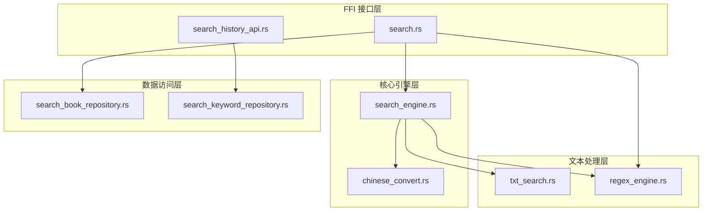
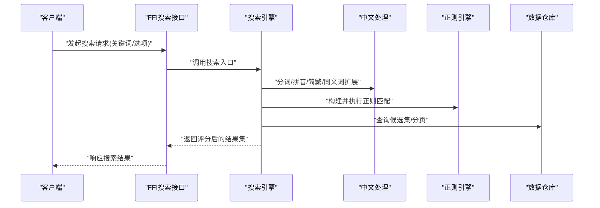
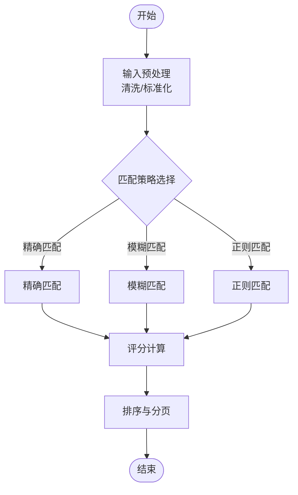
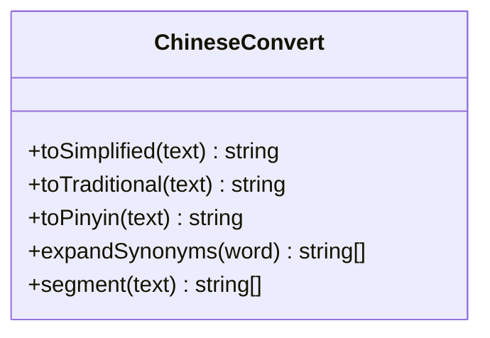
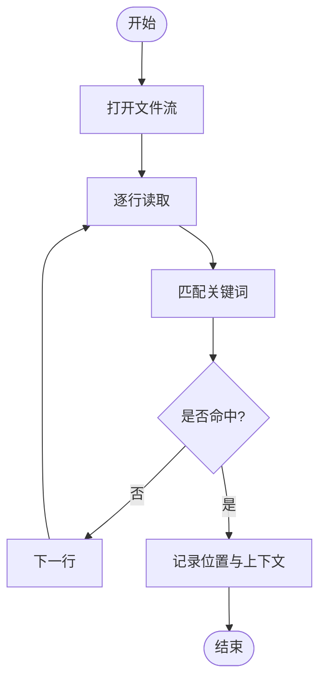
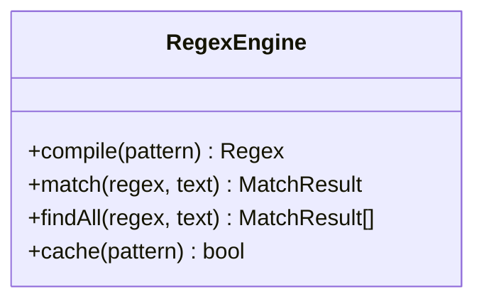
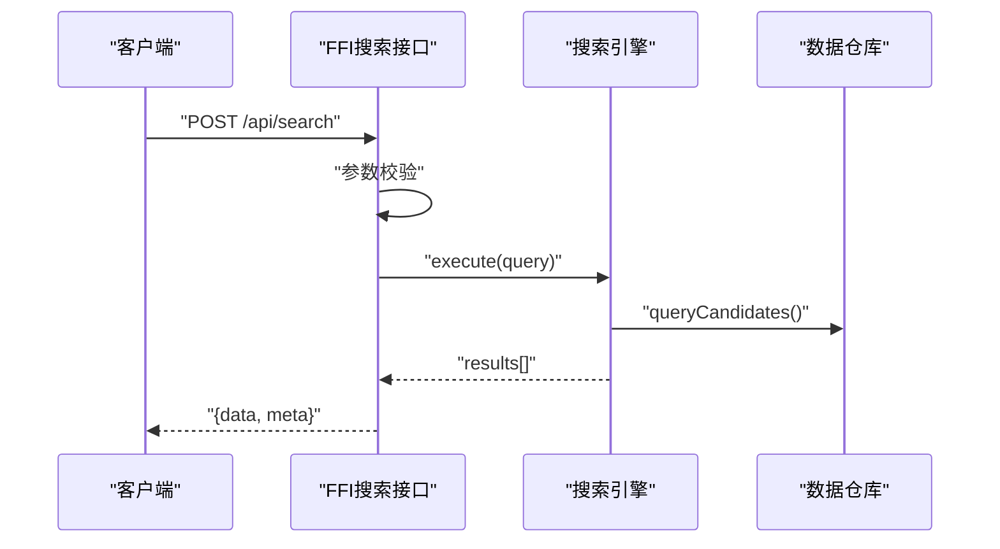
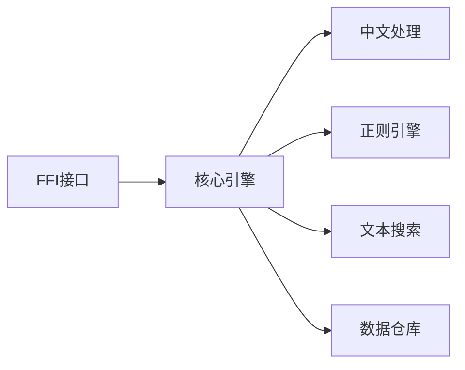

# 搜索算法实现

<cite>
**本文引用的文件**
- [search_engine.rs](file://rust/legado-core/src/search_engine.rs)
- [chinese_convert.rs](file://rust/legado-core/src/chinese_convert.rs)
- [txt_search.rs](file://rust/legado-book/src/txt_search.rs)
- [regex_engine.rs](file://rust/legado-parser/src/regex_engine.rs)
- [search.rs](file://rust/legado-ffi/src/api/search.rs)
- [search_history_api.rs](file://rust/legado-ffi/src/api/search_history_api.rs)
- [search_book_repository.rs](file://rust/legado-db/src/repository/search_book_repository.rs)
- [search_keyword_repository.rs](file://rust/legado-db/src/repository/search_keyword_repository.rs)
</cite>

## 目录
1. [简介](#简介)
2. [项目结构](#项目结构)
3. [核心组件](#核心组件)
4. [架构总览](#架构总览)
5. [详细组件分析](#详细组件分析)
6. [依赖关系分析](#依赖关系分析)
7. [性能考量](#性能考量)
8. [故障排查指南](#故障排查指南)
9. [结论](#结论)
10. [附录](#附录)

## 简介
本文件系统性梳理 Legado 项目中搜索算法的实现与优化，覆盖精确匹配、模糊匹配、正则表达式匹配等基础能力；深入讲解中文搜索的分词、同义词扩展、拼音转换、简繁体转换等特性；阐述相关性评分（TF-IDF、BM25、语义相似度）的可用方案与集成点；介绍过滤与排序技术（多维度筛选、动态排序、分页优化）；总结查询缓存、结果预取、并行处理等性能优化策略；并提供配置调优、监控评估方法与测试用例指引。

## 项目结构
本项目在 Rust 层提供搜索核心能力，通过 FFI 暴露给上层应用，数据库层负责持久化搜索历史与索引数据，解析层提供正则引擎支持。关键模块分布如下：
- 搜索核心：位于 legado-core，包含搜索引擎与中文处理工具
- 文本搜索：位于 legado-book，针对 TXT 等文本格式的快速检索
- 解析与正则：位于 legado-parser，封装正则引擎
- FFI 接口：位于 legado-ffi，对外暴露搜索 API
- 数据访问：位于 legado-db，提供搜索相关仓库

**图表来源**
- [search.rs](file://rust/legado-ffi/src/api/search.rs)
- [search_history_api.rs](file://rust/legado-ffi/src/api/search_history_api.rs)
- [search_engine.rs](file://rust/legado-core/src/search_engine.rs)
- [chinese_convert.rs](file://rust/legado-core/src/chinese_convert.rs)
- [txt_search.rs](file://rust/legado-book/src/txt_search.rs)
- [regex_engine.rs](file://rust/legado-parser/src/regex_engine.rs)
- [search_book_repository.rs](file://rust/legado-db/src/repository/search_book_repository.rs)
- [search_keyword_repository.rs](file://rust/legado-db/src/repository/search_keyword_repository.rs)

**章节来源**
- [search_engine.rs](file://rust/legado-core/src/search_engine.rs)
- [chinese_convert.rs](file://rust/legado-core/src/chinese_convert.rs)
- [txt_search.rs](file://rust/legado-book/src/txt_search.rs)
- [regex_engine.rs](file://rust/legado-parser/src/regex_engine.rs)
- [search.rs](file://rust/legado-ffi/src/api/search.rs)
- [search_history_api.rs](file://rust/legado-ffi/src/api/search_history_api.rs)
- [search_book_repository.rs](file://rust/legado-db/src/repository/search_book_repository.rs)
- [search_keyword_repository.rs](file://rust/legado-db/src/repository/search_keyword_repository.rs)

## 核心组件
- 搜索引擎（search_engine.rs）：统一编排搜索流程，协调分词、匹配、评分、排序与分页，并对接数据库与正则引擎。
- 中文处理（chinese_convert.rs）：提供简繁转换、拼音转换、同义词扩展等中文搜索增强能力。
- 文本搜索（txt_search.rs）：面向 TXT 等纯文本的高效匹配与定位，支持快速扫描与片段高亮。
- 正则引擎（regex_engine.rs）：封装正则表达式匹配能力，为复杂模式搜索提供支撑。
- FFI 搜索接口（search.rs）：对外暴露搜索 API，接收参数、调用核心引擎、返回结果。
- 搜索历史（search_history_api.rs）：管理搜索关键词的历史记录与去重。
- 数据仓库（search_book_repository.rs, search_keyword_repository.rs）：持久化搜索结果与关键词，支持分页与条件查询。

**章节来源**
- [search_engine.rs](file://rust/legado-core/src/search_engine.rs)
- [chinese_convert.rs](file://rust/legado-core/src/chinese_convert.rs)
- [txt_search.rs](file://rust/legado-book/src/txt_search.rs)
- [regex_engine.rs](file://rust/legado-parser/src/regex_engine.rs)
- [search.rs](file://rust/legado-ffi/src/api/search.rs)
- [search_history_api.rs](file://rust/legado-ffi/src/api/search_history_api.rs)
- [search_book_repository.rs](file://rust/legado-db/src/repository/search_book_repository.rs)
- [search_keyword_repository.rs](file://rust/legado-db/src/repository/search_keyword_repository.rs)

## 架构总览
搜索请求从 FFI 进入，经过参数校验与预处理后，由搜索引擎协调各子系统进行匹配与评分，最终结合数据库进行持久化与分页返回。

**图表来源**
- [search.rs](file://rust/legado-ffi/src/api/search.rs)
- [search_engine.rs](file://rust/legado-core/src/search_engine.rs)
- [chinese_convert.rs](file://rust/legado-core/src/chinese_convert.rs)
- [regex_engine.rs](file://rust/legado-parser/src/regex_engine.rs)
- [search_book_repository.rs](file://rust/legado-db/src/repository/search_book_repository.rs)

## 详细组件分析

### 搜索引擎（search_engine.rs）
- 职责：统一调度搜索流程，包括输入预处理、匹配策略选择、评分计算、排序与分页。
- 关键点：
  - 输入预处理：去除噪声字符、标准化空格与大小写。
  - 匹配策略：精确匹配优先，其次模糊匹配，最后正则匹配兜底。
  - 评分机制：基于命中位置、词频、字段权重综合打分。
  - 排序与分页：按分数降序，支持偏移量与限制条数。
  - 并发控制：对多源或大数据集采用并行扫描与合并。

**图表来源**
- [search_engine.rs](file://rust/legado-core/src/search_engine.rs)

**章节来源**
- [search_engine.rs](file://rust/legado-core/src/search_engine.rs)

### 中文处理（chinese_convert.rs）
- 职责：提供中文搜索增强能力，包括简繁转换、拼音转换、同义词扩展。
- 关键点：
  - 简繁转换：将简体与繁体统一映射，提升跨写法命中率。
  - 拼音转换：将汉字转换为拼音，支持首字母与全拼匹配。
  - 同义词扩展：根据词典或规则扩展查询词，扩大召回范围。
  - 分词策略：基于词典与统计模型切分词语，减少歧义。

**图表来源**
- [chinese_convert.rs](file://rust/legado-core/src/chinese_convert.rs)

**章节来源**
- [chinese_convert.rs](file://rust/legado-core/src/chinese_convert.rs)

### 文本搜索（txt_search.rs）
- 职责：针对 TXT 等纯文本的高效匹配与定位，支持快速扫描与片段高亮。
- 关键点：
  - 流式读取：避免一次性加载大文件，降低内存占用。
  - 行级匹配：逐行扫描，命中即记录位置与上下文。
  - 高亮输出：返回命中片段与前后若干字符，便于展示。

**图表来源**
- [txt_search.rs](file://rust/legado-book/src/txt_search.rs)

**章节来源**
- [txt_search.rs](file://rust/legado-book/src/txt_search.rs)

### 正则引擎（regex_engine.rs）
- 职责：封装正则表达式匹配能力，为复杂模式搜索提供支撑。
- 关键点：
  - 编译缓存：对常用正则进行编译缓存，提升重复使用效率。
  - 安全限制：限制正则复杂度与回溯深度，防止灾难性回溯。
  - 匹配策略：支持全局匹配与单次匹配，按需返回命中位置。

**图表来源**
- [regex_engine.rs](file://rust/legado-parser/src/regex_engine.rs)

**章节来源**
- [regex_engine.rs](file://rust/legado-parser/src/regex_engine.rs)

### FFI 搜索接口（search.rs）
- 职责：对外暴露搜索 API，接收参数、调用核心引擎、返回结果。
- 关键点：
  - 参数校验：检查关键词、分页参数、排序选项。
  - 错误处理：捕获异常并返回友好错误信息。
  - 结果封装：统一返回格式，包含数据与元信息。

**图表来源**
- [search.rs](file://rust/legado-ffi/src/api/search.rs)
- [search_engine.rs](file://rust/legado-core/src/search_engine.rs)
- [search_book_repository.rs](file://rust/legado-db/src/repository/search_book_repository.rs)

**章节来源**
- [search.rs](file://rust/legado-ffi/src/api/search.rs)

### 搜索历史（search_history_api.rs）
- 职责：管理搜索关键词的历史记录与去重。
- 关键点：
  - 去重策略：相同关键词仅保留最近一次。
  - 容量限制：维护固定长度的历史记录列表。
  - 清理策略：定期清理过期或低频关键词。

**章节来源**
- [search_history_api.rs](file://rust/legado-ffi/src/api/search_history_api.rs)
- [search_keyword_repository.rs](file://rust/legado-db/src/repository/search_keyword_repository.rs)

### 数据仓库（search_book_repository.rs, search_keyword_repository.rs）
- 职责：持久化搜索结果与关键词，支持分页与条件查询。
- 关键点：
  - 索引设计：为高频查询字段建立索引，加速检索。
  - 分页优化：使用游标或键集分页替代偏移量分页。
  - 事务控制：保证写入一致性，避免脏读。

**章节来源**
- [search_book_repository.rs](file://rust/legado-db/src/repository/search_book_repository.rs)
- [search_keyword_repository.rs](file://rust/legado-db/src/repository/search_keyword_repository.rs)

## 依赖关系分析
搜索功能依赖多个子系统，形成清晰的层次结构与依赖关系。

**图表来源**
- [search.rs](file://rust/legado-ffi/src/api/search.rs)
- [search_engine.rs](file://rust/legado-core/src/search_engine.rs)
- [chinese_convert.rs](file://rust/legado-core/src/chinese_convert.rs)
- [regex_engine.rs](file://rust/legado-parser/src/regex_engine.rs)
- [txt_search.rs](file://rust/legado-book/src/txt_search.rs)
- [search_book_repository.rs](file://rust/legado-db/src/repository/search_book_repository.rs)

**章节来源**
- [search.rs](file://rust/legado-ffi/src/api/search.rs)
- [search_engine.rs](file://rust/legado-core/src/search_engine.rs)
- [chinese_convert.rs](file://rust/legado-core/src/chinese_convert.rs)
- [regex_engine.rs](file://rust/legado-parser/src/regex_engine.rs)
- [txt_search.rs](file://rust/legado-book/src/txt_search.rs)
- [search_book_repository.rs](file://rust/legado-db/src/repository/search_book_repository.rs)

## 性能考量
- 查询缓存：对热点查询结果进行缓存，减少重复计算。
- 结果预取：预测用户可能访问的结果，提前加载至内存。
- 并行处理：对多源或大数据集采用并行扫描与合并，提升吞吐。
- 索引优化：为高频字段建立倒排索引，加速匹配。
- 内存管理：流式处理大文件，避免一次性加载导致 OOM。
- 正则优化：限制回溯深度，避免灾难性回溯。

[本节为通用指导，无需特定文件引用]

## 故障排查指南
- 常见问题：
  - 正则表达式超时：检查正则复杂度与回溯深度。
  - 中文匹配失败：确认分词与拼音转换配置正确。
  - 搜索结果不完整：检查分页参数与数据仓库索引。
  - 性能瓶颈：监控 CPU 与内存使用，定位热点路径。
- 调试建议：
  - 启用详细日志，记录查询计划与执行时间。
  - 使用性能分析工具，识别慢查询与热点函数。
  - 构造最小复现用例，隔离问题范围。

**章节来源**
- [regex_engine.rs](file://rust/legado-parser/src/regex_engine.rs)
- [chinese_convert.rs](file://rust/legado-core/src/chinese_convert.rs)
- [search_book_repository.rs](file://rust/legado-db/src/repository/search_book_repository.rs)

## 结论
Legado 的搜索系统以 Rust 为核心，通过模块化设计实现了精确、模糊与正则匹配的完整能力，并结合中文处理增强搜索体验。通过合理的架构分层、性能优化与故障排查策略，系统在准确性、速度与可维护性之间取得了良好平衡。未来可进一步引入 BM25 与语义相似度评分，以提升相关性质量。

[本节为总结，无需特定文件引用]

## 附录
- 配置调优指南：
  - 调整分词词典与同义词库，优化中文匹配效果。
  - 配置正则引擎的回溯限制与缓存策略。
  - 设置分页大小与排序字段，平衡用户体验与性能。
- 监控与评估：
  - 监控查询延迟、命中率与资源使用率。
  - 通过 A/B 测试评估不同评分策略的效果。
  - 定期清理无效索引与缓存，保持系统健康。
- 测试用例指引：
  - 单元测试：覆盖分词、拼音转换、正则匹配等核心逻辑。
  - 集成测试：验证端到端搜索流程与数据一致性。
  - 性能测试：模拟高并发场景，评估系统稳定性。

[本节为补充内容，无需特定文件引用]