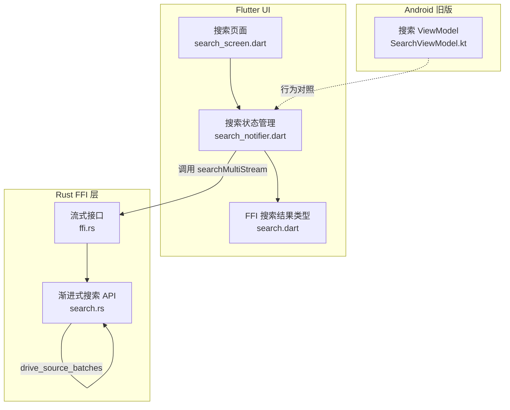
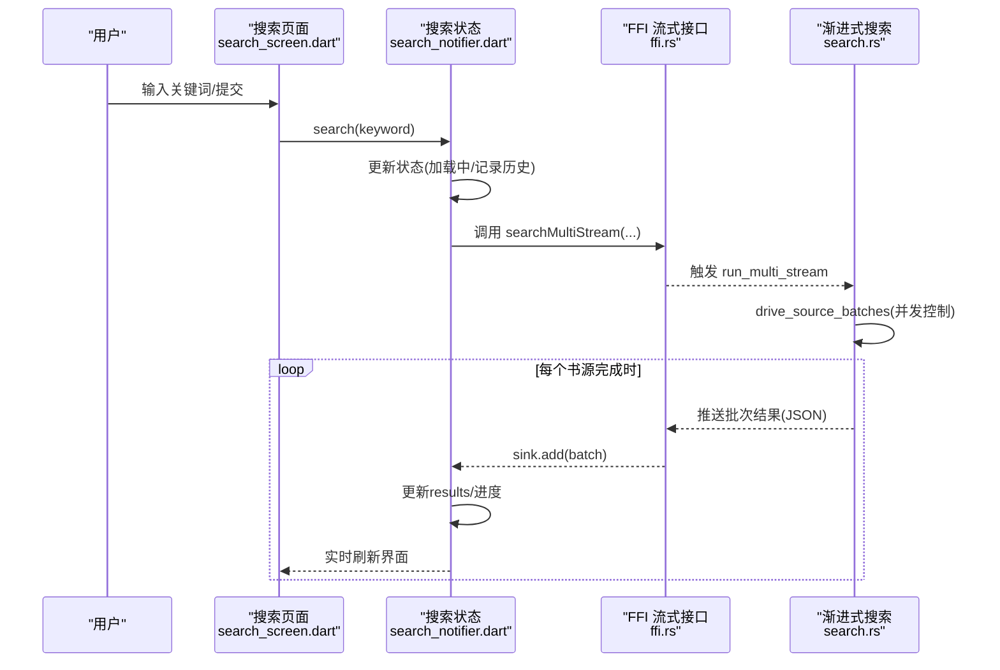
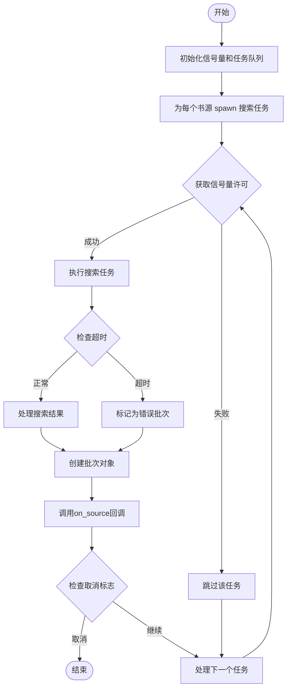
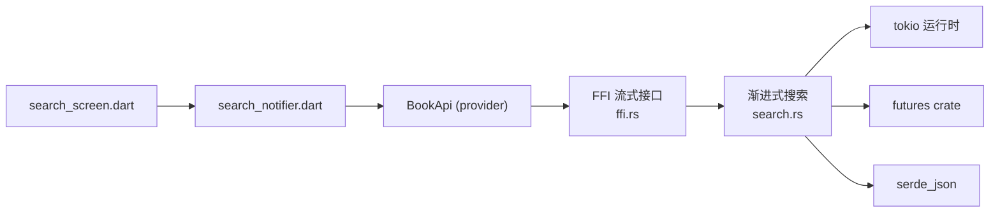

# 渐进式多源搜索

<cite>
**本文引用的文件**
- [search.rs](file://rust/legado-ffi/src/api/search.rs)
- [ffi.rs](file://rust/legado-ffi/src/ffi.rs)
- [search_notifier.dart](file://flutter_legado/lib/src/providers/search/search_notifier.dart)
- [search_screen.dart](file://flutter_legado/lib/src/screens/search_screen.dart)
- [search.dart](file://flutter_legado/lib/src/bridge/api/search.dart)
- [SearchViewModel.kt](file://app/src/main/java/io/legado/app/ui/book/search/SearchViewModel.kt)
</cite>

## 更新摘要
**所做更改**
- 新增真正的渐进式多源搜索实现，通过 StreamSink 提供渐进式结果流
- 新增 drive_source_batches 函数实现批量并发搜索，使用信号量限制并发度
- 更新 Flutter 侧集成以支持实时显示搜索结果而非等待所有源完成
- 增强错误处理和进度反馈机制

## 目录
1. [简介](#简介)
2. [项目结构](#项目结构)
3. [核心组件](#核心组件)
4. [架构总览](#架构总览)
5. [详细组件分析](#详细组件分析)
6. [依赖关系分析](#依赖关系分析)
7. [性能考量](#性能考量)
8. [故障排查指南](#故障排查指南)
9. [结论](#结论)
10. [附录](#附录)

## 简介
本文件围绕"渐进式多源搜索"这一目标，系统性梳理 Legado 在 Rust 核心与 Flutter UI 层中的搜索能力现状、演进路径与实现要点。当前阶段：
- **重大更新**：实现了真正的渐进式多源搜索，通过 StreamSink 提供渐进式结果流，支持实时显示搜索结果而非等待所有源完成
- 新增 drive_source_batches 函数实现批量并发搜索，使用信号量限制并发度防止系统资源耗尽
- Flutter 侧已完全集成渐进式搜索，支持逐源渲染和实时进度反馈
- Android 旧版为逐源流式搜索（协程 flow）+ x/y 进度，现已对齐

## 项目结构
本项目采用"Rust 核心引擎 + Flutter UI"的跨平台架构，搜索相关代码主要分布在：
- Rust FFI 层：渐进式搜索 API 和批量并发处理
- Flutter UI：搜索页面、状态管理与流式数据接收
- Android 旧版：SearchViewModel 等作为行为对照

**图表来源**
- [search_screen.dart:1-408](file://flutter_legado/lib/src/screens/search_screen.dart#L1-L408)
- [search_notifier.dart:1-322](file://flutter_legado/lib/src/providers/search/search_notifier.dart#L1-L322)
- [search.dart:1-71](file://flutter_legado/lib/src/bridge/api/search.dart#L1-L71)
- [search.rs:1-2048](file://rust/legado-ffi/src/api/search.rs#L1-L2048)
- [ffi.rs:1-1969](file://rust/legado-ffi/src/ffi.rs#L1-L1969)
- [SearchViewModel.kt:1-168](file://app/src/main/java/io/legado/app/ui/book/search/SearchViewModel.kt#L1-L168)

**章节来源**
- [README.md:1-121](file://README.md#L1-L121)

## 核心组件
- **渐进式搜索驱动器（drive_source_batches）**
  - 基于 tokio::sync::Semaphore 实现并发控制，限制同时进行的单源搜索数量
  - 支持超时控制和异常隔离，单个源失败不影响其他源执行
  - 每完成一个书源即推送批次结果，包含进度信息（finished_count/total_count）
- **流式搜索接口（run_multi_stream）**
  - 通过 StreamSink 将搜索结果分批推送给 Flutter 端
  - 支持取消操作和错误处理
  - 批次数据结构 SearchSourceBatch 包含完整的进度和结果信息
- **Flutter 流式集成（SearchNotifier）**
  - 使用 StreamSubscription 接收 Rust 端的渐进式结果
  - 实时更新 UI 状态，支持去重和合并逻辑
  - 维护搜索序号避免竞态条件
- **并发控制机制**
  - SEARCH_CONCURRENCY = 9 限制最大并发数
  - 信号量确保不会耗尽系统资源
  - 单源超时保护（30秒）防止长时间阻塞

**章节来源**
- [search.rs:1-2048](file://rust/legado-ffi/src/api/search.rs#L1-L2048)
- [ffi.rs:1-1969](file://rust/legado-ffi/src/ffi.rs#L1-L1969)
- [search_notifier.dart:1-322](file://flutter_legado/lib/src/providers/search/search_notifier.dart#L1-L322)

## 架构总览
下图展示了从 Flutter 到 Rust 的渐进式搜索调用链与数据流向，以及流式结果的实时传递过程。

**图表来源**
- [search_screen.dart:1-408](file://flutter_legado/lib/src/screens/search_screen.dart#L1-L408)
- [search_notifier.dart:1-322](file://flutter_legado/lib/src/providers/search/search_notifier.dart#L1-L322)
- [ffi.rs:369-387](file://rust/legado-ffi/src/ffi.rs#L369-L387)
- [search.rs:330-383](file://rust/legado-ffi/src/api/search.rs#L330-L383)

## 详细组件分析

### 渐进式搜索驱动器（drive_source_batches）
- **核心功能**
  - 使用信号量控制并发度，防止系统资源耗尽
  - 支持超时控制和异常隔离，单个源失败不阻断整体流程
  - 每完成一个书源即调用回调函数推送批次结果
- **关键参数**
  - sources: 待搜索的书源列表
  - concurrency: 最大并发数（默认9）
  - per_source_timeout: 单源超时时间（默认30秒）
  - search_one: 单源搜索函数
  - on_source: 批次结果回调函数
- **错误处理**
  - 任务级 JoinError 兜底隔离
  - 单源 panic 捕获并转为错误批次
  - 超时任务标记为错误但不中断其他源

**图表来源**
- [search.rs:408-499](file://rust/legado-ffi/src/api/search.rs#L408-L499)

**章节来源**
- [search.rs:408-499](file://rust/legado-ffi/src/api/search.rs#L408-L499)

### 流式搜索接口（run_multi_stream）
- **接口设计**
  - 异步函数，通过回调函数推送批次结果
  - 支持 JSON 字符串格式的数据传输
  - 内置阅读记录标识附加逻辑
- **批次数据结构**
  - source_index: 书源索引
  - books: 该书源的搜索结果
  - error: 错误信息（可选）
  - finished_count/total_count: 进度信息
  - is_last: 是否为最后一个批次
- **集成方式**
  - 通过 flutter_rust_bridge 的 StreamSink 绑定
  - Dart 侧表现为 Stream<String>
  - 支持 sink 关闭时的提前终止

**章节来源**
- [search.rs:330-383](file://rust/legado-ffi/src/api/search.rs#L330-L383)
- [ffi.rs:369-387](file://rust/legado-ffi/src/ffi.rs#L369-L387)

### Flutter 流式集成（SearchNotifier）
- **流式处理**
  - 使用 StreamSubscription 接收 Rust 端的渐进式结果
  - 支持去重和合并逻辑，避免重复显示
  - 实时更新 UI 状态，包括结果列表和进度信息
- **状态管理**
  - 维护搜索序号避免竞态条件
  - 支持取消进行中的搜索
  - 错误处理和重试机制
- **用户体验**
  - 实时显示搜索结果，无需等待所有源完成
  - 显示搜索进度（finished_count/total_count）
  - 支持精准筛选和分组搜索

**章节来源**
- [search_notifier.dart:106-171](file://flutter_legado/lib/src/providers/search/search_notifier.dart#L106-L171)

### 并发控制机制
- **信号量控制**
  - 使用 tokio::sync::Semaphore 限制并发度
  - 默认并发数为 9，对齐原版 SearchModel 语义
  - 防止大量书源同时请求导致系统资源耗尽
- **超时保护**
  - 单源搜索超时时间为 30 秒
  - 超时任务被标记为错误但不影响其他源
  - 避免长时间阻塞导致的用户体验问题
- **异常隔离**
  - 单个书源的错误不会影响其他书源执行
  - 使用 catch_unwind 捕获 panic 并转为错误
  - 任务级 JoinError 兜底处理

**章节来源**
- [search.rs:30-38](file://rust/legado-ffi/src/api/search.rs#L30-L38)
- [search.rs:426-467](file://rust/legado-ffi/src/api/search.rs#L426-L467)

## 依赖关系分析
- **Rust 层依赖**
  - search.rs 依赖 tokio 异步运行时和 futures crate
  - 使用 serde_json 进行 JSON 序列化/反序列化
  - 依赖 legado-core 的核心搜索引擎
- **Flutter 层依赖**
  - search_notifier.dart 依赖 flutter_riverpod 状态管理
  - 使用 StreamSubscription 处理异步流数据
  - 依赖 BookApi 进行 FFI 调用
- **外部集成点**
  - flutter_rust_bridge 提供 StreamSink 绑定
  - 原生 Android 搜索行为作为参考实现

**图表来源**
- [search_screen.dart:1-408](file://flutter_legado/lib/src/screens/search_screen.dart#L1-L408)
- [search_notifier.dart:1-322](file://flutter_legado/lib/src/providers/search/search_notifier.dart#L1-L322)
- [ffi.rs:369-387](file://rust/legado-ffi/src/ffi.rs#L369-L387)
- [search.rs:1-2048](file://rust/legado-ffi/src/api/search.rs#L1-L2048)

**章节来源**
- [search_screen.dart:1-408](file://flutter_legado/lib/src/screens/search_screen.dart#L1-L408)
- [search_notifier.dart:1-322](file://flutter_legado/lib/src/providers/search/search_notifier.dart#L1-L322)
- [ffi.rs:369-387](file://rust/legado-ffi/src/ffi.rs#L369-L387)
- [search.rs:1-2048](file://rust/legado-ffi/src/api/search.rs#L1-L2048)

## 性能考量
- **并发优化**
  - 信号量限制并发度，防止系统资源耗尽
  - 异步 I/O 操作提升吞吐量
  - 批量处理减少网络请求开销
- **内存管理**
  - 流式处理避免一次性加载大量数据
  - 及时释放不再使用的资源
  - 合理的缓冲区大小设置
- **用户体验**
  - 实时显示搜索结果，提升响应速度
  - 进度反馈让用户了解搜索状态
  - 支持取消操作，避免无效等待
- **错误处理**
  - 单个源失败不影响整体搜索
  - 超时保护避免长时间阻塞
  - 详细的错误信息便于调试

## 故障排查指南
- **搜索结果为空**
  - 检查 query 是否为空、sources 是否为空
  - 确认书源配置是否正确
  - 验证网络连接状态
- **渐进式搜索无响应**
  - 检查 StreamSink 是否正确绑定
  - 确认 Flutter 端的 StreamSubscription 是否正常工作
  - 查看 Rust 端的日志输出
- **并发过高导致卡顿**
  - 调整 SEARCH_CONCURRENCY 常量
  - 检查是否有死锁或资源竞争
  - 监控系统资源使用情况
- **超时频繁发生**
  - 调整单源超时时间
  - 检查网络延迟情况
  - 优化书源解析规则
- **内存占用过高**
  - 检查是否有内存泄漏
  - 优化数据结构设计
  - 及时释放不再使用的资源

**章节来源**
- [search.rs:1-2048](file://rust/legado-ffi/src/api/search.rs#L1-L2048)
- [search_notifier.dart:1-322](file://flutter_legado/lib/src/providers/search/search_notifier.dart#L1-L322)

## 结论
Legado 已成功实现真正的渐进式多源搜索功能，通过 StreamSink 提供渐进式结果流，支持实时显示搜索结果而非等待所有源完成。**重大更新**：新增了 drive_source_batches 函数实现批量并发搜索，使用信号量限制并发度防止系统资源耗尽。Flutter 侧已完全集成渐进式搜索，支持逐源渲染和实时进度反馈。

关键改进包括：
- Rust 端实现了真正的流式 API，替代了之前的一次性返回模式
- 并发控制机制确保系统稳定性，防止资源耗尽
- Flutter 端提供了良好的用户体验，支持实时结果展示和进度反馈
- 错误处理和超时机制提升了系统的健壮性

未来可以继续优化：
- 根据实际使用情况调整并发参数
- 进一步优化内存使用和性能表现
- 扩展更多搜索功能和过滤选项

## 附录
- 术语说明
  - 渐进式搜索：按批次逐步返回结果，UI 即时增量更新
  - 多源搜索：同时向多个书源发起搜索，聚合结果后统一处理
  - 流式搜索：通过 StreamSink 实时推送搜索结果
  - 并发控制：使用信号量限制同时进行的搜索任务数量
  - 批次结果：单个书源搜索完成后返回的结果集合