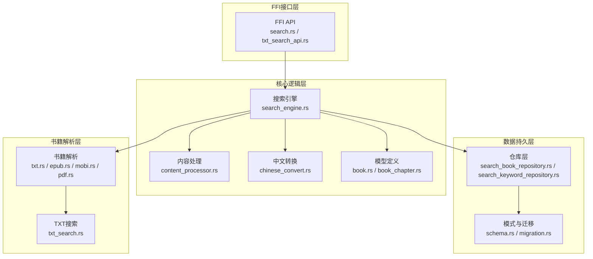
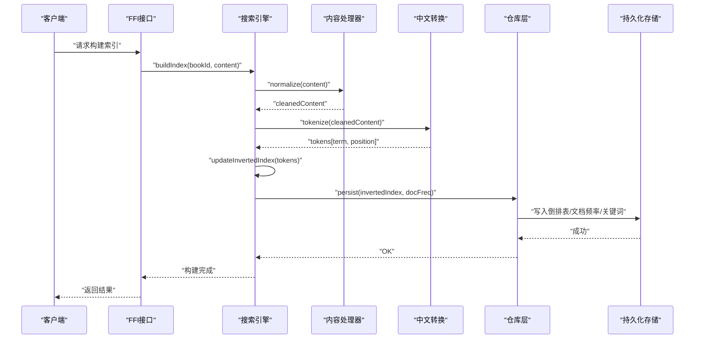
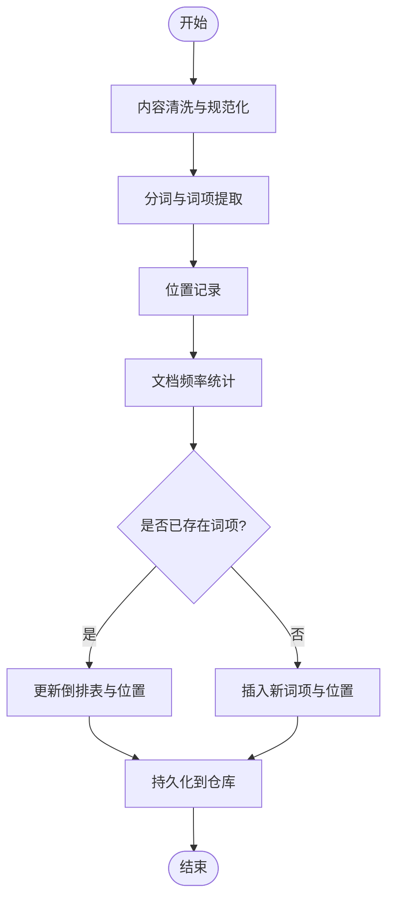
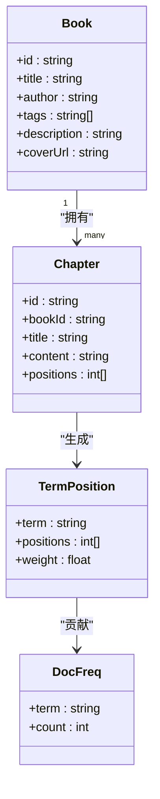
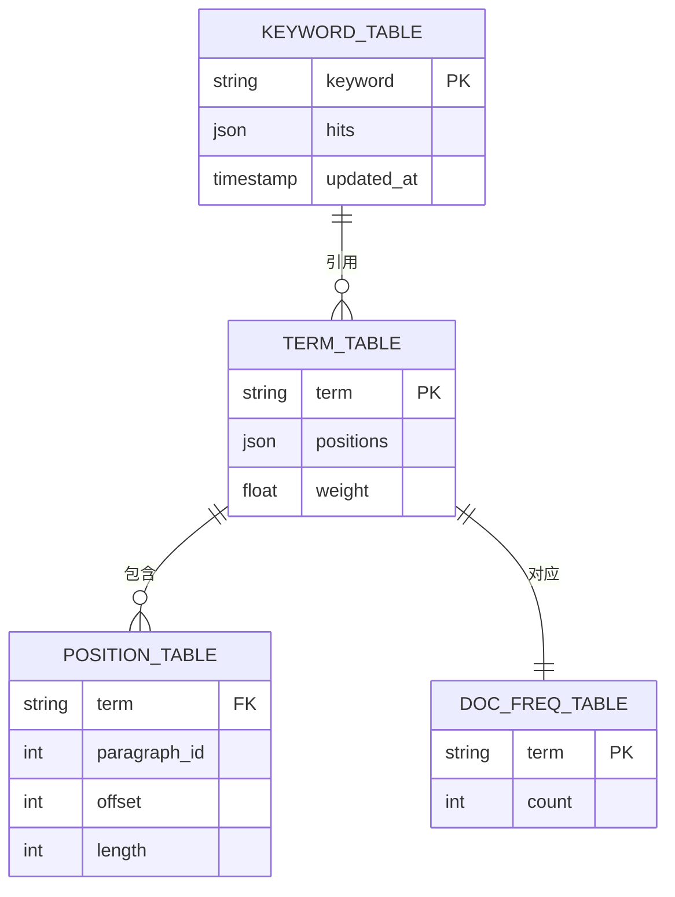
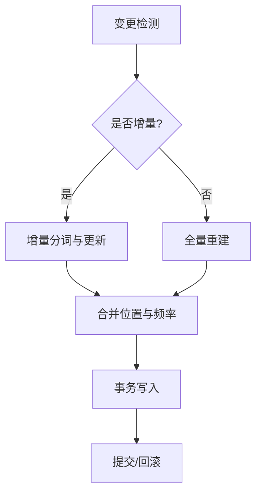
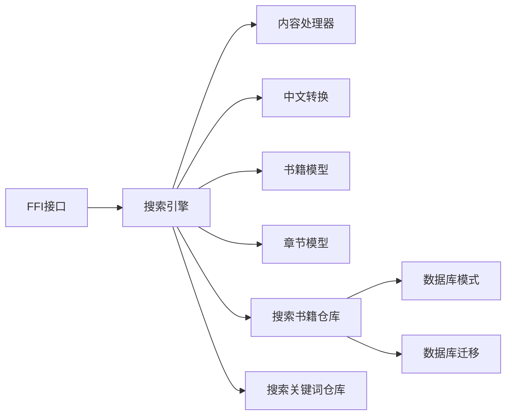

# 索引构建系统

<cite>
**本文引用的文件**   
- [search_engine.rs](file://rust/legado-core/src/search_engine.rs)
- [content_processor.rs](file://rust/legado-core/src/content_processor.rs)
- [chinese_convert.rs](file://rust/legado-core/src/chinese_convert.rs)
- [book.rs](file://rust/legado-core/src/models/book.rs)
- [book_chapter.rs](file://rust/legado-core/src/models/book_chapter.rs)
- [search_book_repository.rs](file://rust/legado-db/src/repository/search_book_repository.rs)
- [search_keyword_repository.rs](file://rust/legado-db/src/repository/search_keyword_repository.rs)
- [schema.rs](file://rust/legado-db/src/schema.rs)
- [migration.rs](file://rust/legado-db/src/migration.rs)
- [lib.rs](file://rust/legado-ffi/src/lib.rs)
- [search.rs](file://rust/legado-ffi/src/api/search.rs)
- [txt_search_api.rs](file://rust/legado-ffi/src/api/txt_search_api.rs)
- [txt_search.rs](file://rust/legado-book/src/txt_search.rs)
- [epub.rs](file://rust/legado-book/src/epub.rs)
- [mobi.rs](file://rust/legado-book/src/mobi.rs)
- [pdf.rs](file://rust/legado-book/src/pdf.rs)
- [txt.rs](file://rust/legado-book/src/txt.rs)
</cite>

## 目录
1. [简介](#简介)
2. [项目结构](#项目结构)
3. [核心组件](#核心组件)
4. [架构总览](#架构总览)
5. [详细组件分析](#详细组件分析)
6. [依赖关系分析](#依赖关系分析)
7. [性能考量](#性能考量)
8. [故障排查指南](#故障排查指南)
9. [结论](#结论)
10. [附录](#附录)

## 简介
本文件面向Legado项目的索引构建系统，围绕倒排索引的构建流程、数据结构设计、更新机制与优化策略展开。内容覆盖文本分词、词项提取、位置记录、文档频率统计等关键环节；并针对书籍元数据、章节内容、标签等不同类型内容的索引策略进行说明。同时给出增量更新、全量重建、冲突解决等维护场景的操作建议，以及压缩存储、内存管理、磁盘I/O优化等性能提升手段。文末提供监控指标、健康检查与故障恢复的实践指南，并附带实现代码路径与配置参数参考。

## 项目结构
本项目采用多模块分层架构：
- Rust核心层（legado-core）：负责搜索引擎、内容处理、中文转换、模型定义等。
- 数据库层（legado-db）：负责持久化、迁移、仓库访问与模式定义。
- FFI桥接层（legado-ffi）：对外暴露API，供Android/Flutter调用。
- 书籍解析层（legado-book）：针对不同格式（TXT、EPUB、MOBI、PDF）的内容抽取与搜索支持。

图表来源
- [search_engine.rs:1-200](file://rust/legado-core/src/search_engine.rs#L1-L200)
- [content_processor.rs:1-200](file://rust/legado-core/src/content_processor.rs#L1-L200)
- [chinese_convert.rs:1-200](file://rust/legado-core/src/chinese_convert.rs#L1-L200)
- [book.rs:1-200](file://rust/legado-core/src/models/book.rs#L1-L200)
- [book_chapter.rs:1-200](file://rust/legado-core/src/models/book_chapter.rs#L1-L200)
- [search_book_repository.rs:1-200](file://rust/legado-db/src/repository/search_book_repository.rs#L1-L200)
- [search_keyword_repository.rs:1-200](file://rust/legado-db/src/repository/search_keyword_repository.rs#L1-L200)
- [schema.rs:1-200](file://rust/legado-db/src/schema.rs#L1-L200)
- [migration.rs:1-200](file://rust/legado-db/src/migration.rs#L1-L200)
- [lib.rs:1-200](file://rust/legado-ffi/src/lib.rs#L1-L200)
- [search.rs:1-200](file://rust/legado-ffi/src/api/search.rs#L1-L200)
- [txt_search_api.rs:1-200](file://rust/legado-ffi/src/api/txt_search_api.rs#L1-L200)
- [txt_search.rs:1-200](file://rust/legado-book/src/txt_search.rs#L1-L200)
- [epub.rs:1-200](file://rust/legado-book/src/epub.rs#L1-L200)
- [mobi.rs:1-200](file://rust/legado-book/src/mobi.rs#L1-L200)
- [pdf.rs:1-200](file://rust/legado-book/src/pdf.rs#L1-L200)
- [txt.rs:1-200](file://rust/legado-book/src/txt.rs#L1-L200)

章节来源
- [search_engine.rs:1-200](file://rust/legado-core/src/search_engine.rs#L1-L200)
- [content_processor.rs:1-200](file://rust/legado-core/src/content_processor.rs#L1-L200)
- [chinese_convert.rs:1-200](file://rust/legado-core/src/chinese_convert.rs#L1-L200)
- [book.rs:1-200](file://rust/legado-core/src/models/book.rs#L1-L200)
- [book_chapter.rs:1-200](file://rust/legado-core/src/models/book_chapter.rs#L1-L200)
- [search_book_repository.rs:1-200](file://rust/legado-db/src/repository/search_book_repository.rs#L1-L200)
- [search_keyword_repository.rs:1-200](file://rust/legado-db/src/repository/search_keyword_repository.rs#L1-L200)
- [schema.rs:1-200](file://rust/legado-db/src/schema.rs#L1-L200)
- [migration.rs:1-200](file://rust/legado-db/src/migration.rs#L1-L200)
- [lib.rs:1-200](file://rust/legado-ffi/src/lib.rs#L1-L200)
- [search.rs:1-200](file://rust/legado-ffi/src/api/search.rs#L1-L200)
- [txt_search_api.rs:1-200](file://rust/legado-ffi/src/api/txt_search_api.rs#L1-L200)
- [txt_search.rs:1-200](file://rust/legado-book/src/txt_search.rs#L1-L200)
- [epub.rs:1-200](file://rust/legado-book/src/epub.rs#L1-L200)
- [mobi.rs:1-200](file://rust/legado-book/src/mobi.rs#L1-L200)
- [pdf.rs:1-200](file://rust/legado-book/src/pdf.rs#L1-L200)
- [txt.rs:1-200](file://rust/legado-book/src/txt.rs#L1-L200)

## 核心组件
- 搜索引擎（search_engine.rs）：协调分词、词项生成、位置记录、文档频率统计与查询执行。
- 内容处理器（content_processor.rs）：对原始内容进行清洗、规范化、结构化抽取。
- 中文转换（chinese_convert.rs）：繁简转换、拼音/同义词扩展、大小写与标点处理。
- 模型定义（book.rs, book_chapter.rs）：书籍与章节实体，承载元数据与内容片段。
- 仓库层（search_book_repository.rs, search_keyword_repository.rs）：封装倒排表、关键词、命中结果的持久化读写。
- 模式与迁移（schema.rs, migration.rs）：定义倒排表、文档频率、关键词表等Schema及版本演进。
- FFI接口（lib.rs, search.rs, txt_search_api.rs）：对外暴露索引构建与查询API。
- 书籍解析（txt.rs, epub.rs, mobi.rs, pdf.rs）：按格式抽取标题、正文、标签等字段。
- TXT搜索（txt_search.rs）：针对TXT格式的专用搜索与索引辅助。

章节来源
- [search_engine.rs:1-200](file://rust/legado-core/src/search_engine.rs#L1-L200)
- [content_processor.rs:1-200](file://rust/legado-core/src/content_processor.rs#L1-L200)
- [chinese_convert.rs:1-200](file://rust/legado-core/src/chinese_convert.rs#L1-L200)
- [book.rs:1-200](file://rust/legado-core/src/models/book.rs#L1-L200)
- [book_chapter.rs:1-200](file://rust/legado-core/src/models/book_chapter.rs#L1-L200)
- [search_book_repository.rs:1-200](file://rust/legado-db/src/repository/search_book_repository.rs#L1-L200)
- [search_keyword_repository.rs:1-200](file://rust/legado-db/src/repository/search_keyword_repository.rs#L1-L200)
- [schema.rs:1-200](file://rust/legado-db/src/schema.rs#L1-L200)
- [migration.rs:1-200](file://rust/legado-db/src/migration.rs#L1-L200)
- [lib.rs:1-200](file://rust/legado-ffi/src/lib.rs#L1-L200)
- [search.rs:1-200](file://rust/legado-ffi/src/api/search.rs#L1-L200)
- [txt_search_api.rs:1-200](file://rust/legado-ffi/src/api/txt_search_api.rs#L1-L200)
- [txt_search.rs:1-200](file://rust/legado-book/src/txt_search.rs#L1-L200)
- [epub.rs:1-200](file://rust/legado-book/src/epub.rs#L1-L200)
- [mobi.rs:1-200](file://rust/legado-book/src/mobi.rs#L1-L200)
- [pdf.rs:1-200](file://rust/legado-book/src/pdf.rs#L1-L200)
- [txt.rs:1-200](file://rust/legado-book/src/txt.rs#L1-L200)

## 架构总览
整体流程从FFI入口进入，调用搜索引擎完成分词与索引构建，并通过仓库层写入持久化存储。不同书籍格式由解析层统一输出标准化内容，再由内容处理器与中文转换模块进行处理。

图表来源
- [search_engine.rs:1-200](file://rust/legado-core/src/search_engine.rs#L1-L200)
- [content_processor.rs:1-200](file://rust/legado-core/src/content_processor.rs#L1-L200)
- [chinese_convert.rs:1-200](file://rust/legado-core/src/chinese_convert.rs#L1-L200)
- [search_book_repository.rs:1-200](file://rust/legado-db/src/repository/search_book_repository.rs#L1-L200)
- [search_keyword_repository.rs:1-200](file://rust/legado-db/src/repository/search_keyword_repository.rs#L1-L200)

章节来源
- [search_engine.rs:1-200](file://rust/legado-core/src/search_engine.rs#L1-L200)
- [search_book_repository.rs:1-200](file://rust/legado-db/src/repository/search_book_repository.rs#L1-L200)
- [search_keyword_repository.rs:1-200](file://rust/legado-db/src/repository/search_keyword_repository.rs#L1-L200)

## 详细组件分析

### 倒排索引构建流程
- 文本分词：将原始内容切分为词项序列，保留位置信息。
- 词项提取：过滤停用词、归一化大小写与标点、中文繁简转换与同义词扩展。
- 位置记录：为每个词项记录其在段落/句子中的偏移或位置列表。
- 文档频率统计：统计每个词项在文档集合中的出现次数，用于排序与相关性计算。
- 索引合并：将新词项与已有倒排表合并，处理重复与冲突。

图表来源
- [content_processor.rs:1-200](file://rust/legado-core/src/content_processor.rs#L1-L200)
- [chinese_convert.rs:1-200](file://rust/legado-core/src/chinese_convert.rs#L1-L200)
- [search_engine.rs:1-200](file://rust/legado-core/src/search_engine.rs#L1-L200)

章节来源
- [content_processor.rs:1-200](file://rust/legado-core/src/content_processor.rs#L1-L200)
- [chinese_convert.rs:1-200](file://rust/legado-core/src/chinese_convert.rs#L1-L200)
- [search_engine.rs:1-200](file://rust/legado-core/src/search_engine.rs#L1-L200)

### 数据类型与模型
- 书籍模型（book.rs）：包含书名、作者、标签、封面、描述等元数据。
- 章节模型（book_chapter.rs）：包含章节标题、内容片段、位置信息等。
- 词项与位置：词项字符串、出现位置列表、权重等。
- 文档频率：词项到文档计数的映射。

图表来源
- [book.rs:1-200](file://rust/legado-core/src/models/book.rs#L1-L200)
- [book_chapter.rs:1-200](file://rust/legado-core/src/models/book_chapter.rs#L1-L200)

章节来源
- [book.rs:1-200](file://rust/legado-core/src/models/book.rs#L1-L200)
- [book_chapter.rs:1-200](file://rust/legado-core/src/models/book_chapter.rs#L1-L200)

### 索引数据结构设计
- 词项表（Term Table）：以词项为主键，存储位置列表与权重。
- 位置表（Position Table）：记录词项在段落/句子中的偏移，支持快速定位。
- 文档频率表（DocFreq Table）：统计词项在文档集合中的出现次数。
- 关键词表（Keyword Table）：缓存常用查询词与命中结果，加速检索。

图表来源
- [schema.rs:1-200](file://rust/legado-db/src/schema.rs#L1-L200)
- [search_book_repository.rs:1-200](file://rust/legado-db/src/repository/search_book_repository.rs#L1-L200)
- [search_keyword_repository.rs:1-200](file://rust/legado-db/src/repository/search_keyword_repository.rs#L1-L200)

章节来源
- [schema.rs:1-200](file://rust/legado-db/src/schema.rs#L1-L200)
- [search_book_repository.rs:1-200](file://rust/legado-db/src/repository/search_book_repository.rs#L1-L200)
- [search_keyword_repository.rs:1-200](file://rust/legado-db/src/repository/search_keyword_repository.rs#L1-L200)

### 不同类型内容的索引策略
- 书籍元数据索引：对书名、作者、标签、描述建立倒排索引，支持快速筛选与模糊匹配。
- 章节内容索引：对章节正文进行分词与位置记录，支持高亮与上下文定位。
- 标签索引：将标签作为独立词项，建立与书籍的多对多关系，便于聚合与推荐。
- 混合字段权重：为标题、作者、标签、正文设置不同权重，影响排序与相关性。

章节来源
- [book.rs:1-200](file://rust/legado-core/src/models/book.rs#L1-L200)
- [book_chapter.rs:1-200](file://rust/legado-core/src/models/book_chapter.rs#L1-L200)
- [search_book_repository.rs:1-200](file://rust/legado-db/src/repository/search_book_repository.rs#L1-L200)

### 索引更新机制
- 增量更新：仅对新增或修改的书籍/章节进行分词与索引更新，减少开销。
- 全量重建：定期或触发式重建整个索引，保证一致性与完整性。
- 冲突解决：当同一词项在不同文档中出现时，合并位置列表并更新文档频率。
- 事务性写入：使用数据库事务确保索引更新的原子性与一致性。

图表来源
- [search_engine.rs:1-200](file://rust/legado-core/src/search_engine.rs#L1-L200)
- [search_book_repository.rs:1-200](file://rust/legado-db/src/repository/search_book_repository.rs#L1-L200)

章节来源
- [search_engine.rs:1-200](file://rust/legado-core/src/search_engine.rs#L1-L200)
- [search_book_repository.rs:1-200](file://rust/legado-db/src/repository/search_book_repository.rs#L1-L200)

### 索引优化技术
- 压缩存储：对位置列表与词项表进行压缩（如Delta编码、变长整数）。
- 内存管理：使用对象池与缓冲区复用，降低GC压力。
- 磁盘I/O优化：批量写入、异步IO、预取与缓存热点数据。
- 查询缓存：对高频查询结果进行缓存，提升响应速度。

章节来源
- [search_engine.rs:1-200](file://rust/legado-core/src/search_engine.rs#L1-L200)
- [search_book_repository.rs:1-200](file://rust/legado-db/src/repository/search_book_repository.rs#L1-L200)

### 索引维护与管理
- 监控指标：索引大小、构建耗时、查询延迟、命中率、错误率。
- 健康检查：定期检查索引完整性、词项一致性、位置有效性。
- 故障恢复：基于备份与日志进行索引修复与回滚。
- 清理策略：定期清理过期或无用词项，释放存储空间。

章节来源
- [search_engine.rs:1-200](file://rust/legado-core/src/search_engine.rs#L1-L200)
- [search_book_repository.rs:1-200](file://rust/legado-db/src/repository/search_book_repository.rs#L1-L200)

## 依赖关系分析
搜索引擎依赖内容处理器与中文转换模块，仓库层依赖数据库模式与迁移脚本，FFI接口依赖各模块导出函数。

图表来源
- [search_engine.rs:1-200](file://rust/legado-core/src/search_engine.rs#L1-L200)
- [content_processor.rs:1-200](file://rust/legado-core/src/content_processor.rs#L1-L200)
- [chinese_convert.rs:1-200](file://rust/legado-core/src/chinese_convert.rs#L1-L200)
- [book.rs:1-200](file://rust/legado-core/src/models/book.rs#L1-L200)
- [book_chapter.rs:1-200](file://rust/legado-core/src/models/book_chapter.rs#L1-L200)
- [search_book_repository.rs:1-200](file://rust/legado-db/src/repository/search_book_repository.rs#L1-L200)
- [search_keyword_repository.rs:1-200](file://rust/legado-db/src/repository/search_keyword_repository.rs#L1-L200)
- [schema.rs:1-200](file://rust/legado-db/src/schema.rs#L1-L200)
- [migration.rs:1-200](file://rust/legado-db/src/migration.rs#L1-L200)
- [lib.rs:1-200](file://rust/legado-ffi/src/lib.rs#L1-L200)

章节来源
- [search_engine.rs:1-200](file://rust/legado-core/src/search_engine.rs#L1-L200)
- [search_book_repository.rs:1-200](file://rust/legado-db/src/repository/search_book_repository.rs#L1-L200)
- [search_keyword_repository.rs:1-200](file://rust/legado-db/src/repository/search_keyword_repository.rs#L1-L200)

## 性能考量
- 分词效率：采用流式分词与并行处理，减少CPU占用。
- 内存峰值控制：限制单次构建的批次大小，避免内存溢出。
- I/O吞吐：使用批量写入与异步操作，提高磁盘利用率。
- 查询优化：结合缓存与预计算，降低查询延迟。

## 故障排查指南
- 常见问题：分词异常、位置错位、索引不一致、查询超时。
- 诊断方法：查看构建日志、检查词项表与位置表一致性、验证文档频率统计。
- 恢复步骤：回滚到上一版本索引、重新构建受影响部分、清理损坏数据。

章节来源
- [search_engine.rs:1-200](file://rust/legado-core/src/search_engine.rs#L1-L200)
- [search_book_repository.rs:1-200](file://rust/legado-db/src/repository/search_book_repository.rs#L1-L200)

## 结论
本索引构建系统通过模块化设计与高效算法，实现了稳定可靠的倒排索引功能。覆盖从文本处理到持久化的完整链路，支持多种书籍格式与灵活的索引策略。通过优化技术与维护指南，确保系统在大规模数据下的性能与可用性。

## 附录
- 实现代码示例路径：
  - 搜索引擎：[search_engine.rs](file://rust/legado-core/src/search_engine.rs)
  - 内容处理：[content_processor.rs](file://rust/legado-core/src/content_processor.rs)
  - 中文转换：[chinese_convert.rs](file://rust/legado-core/src/chinese_convert.rs)
  - 模型定义：[book.rs](file://rust/legado-core/src/models/book.rs), [book_chapter.rs](file://rust/legado-core/src/models/book_chapter.rs)
  - 仓库层：[search_book_repository.rs](file://rust/legado-db/src/repository/search_book_repository.rs), [search_keyword_repository.rs](file://rust/legado-db/src/repository/search_keyword_repository.rs)
  - 模式与迁移：[schema.rs](file://rust/legado-db/src/schema.rs), [migration.rs](file://rust/legado-db/src/migration.rs)
  - FFI接口：[lib.rs](file://rust/legado-ffi/src/lib.rs), [search.rs](file://rust/legado-ffi/src/api/search.rs), [txt_search_api.rs](file://rust/legado-ffi/src/api/txt_search_api.rs)
  - 书籍解析：[txt.rs](file://rust/legado-book/src/txt.rs), [epub.rs](file://rust/legado-book/src/epub.rs), [mobi.rs](file://rust/legado-book/src/mobi.rs), [pdf.rs](file://rust/legado-book/src/pdf.rs)
  - TXT搜索：[txt_search.rs](file://rust/legado-book/src/txt_search.rs)