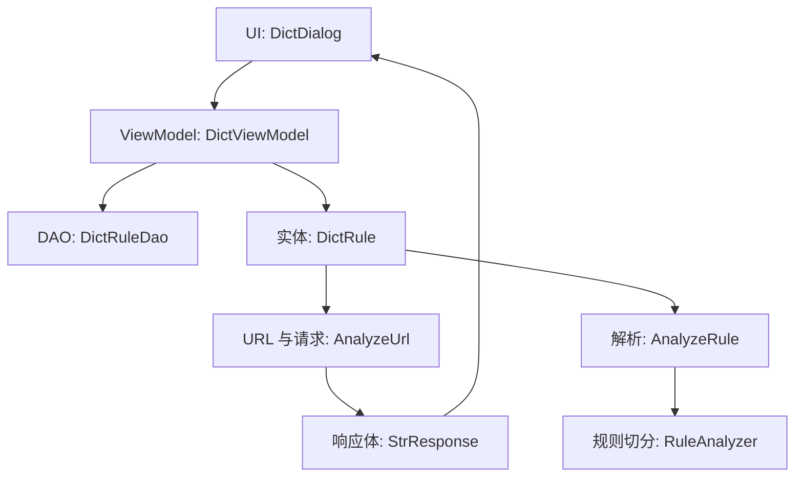
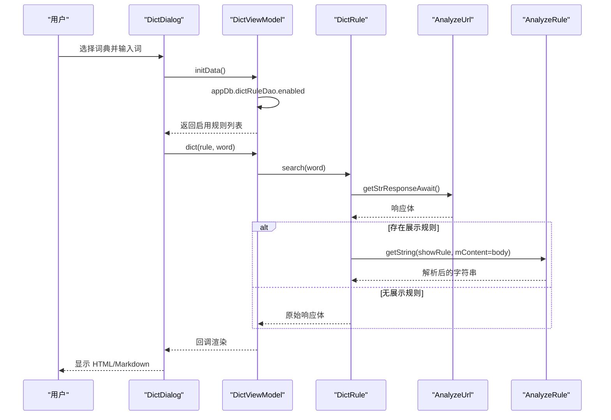
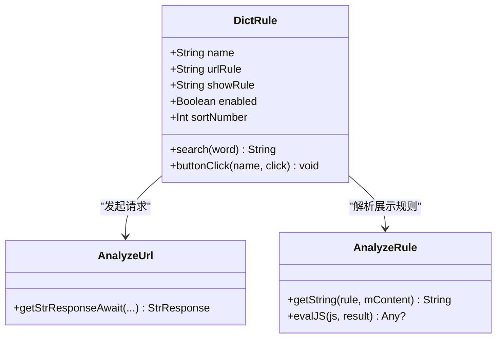
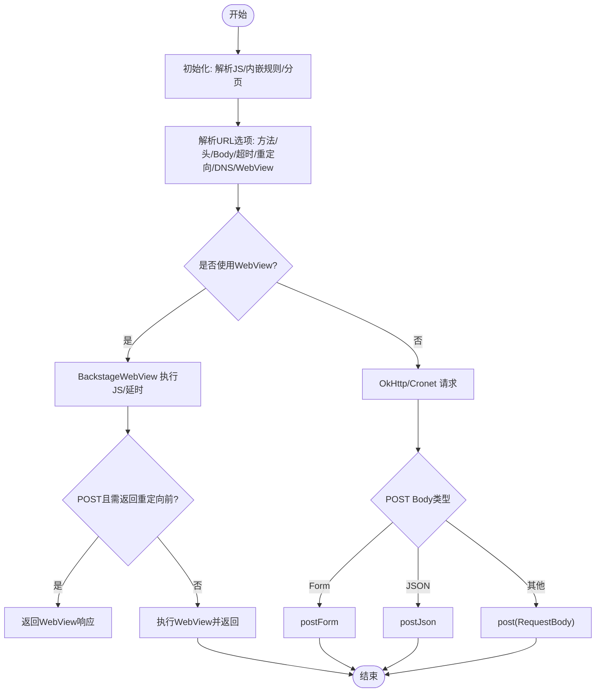
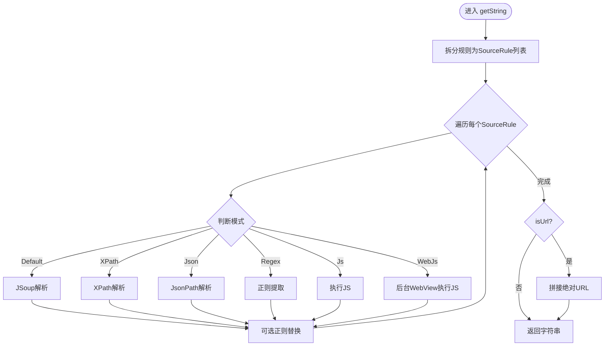
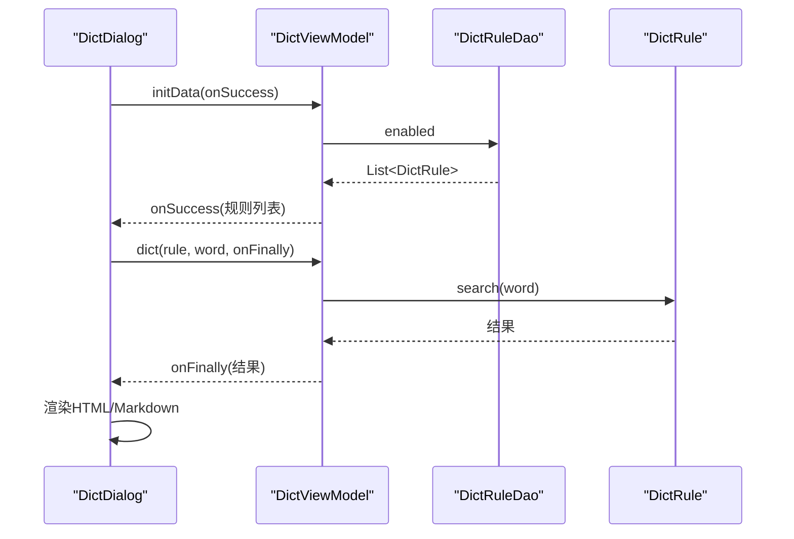
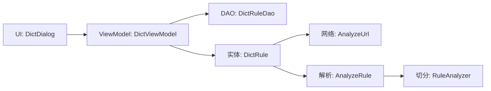

# 词典规则引擎

<cite>
**本文引用的文件**
- [DictRule.kt](file://app/src/main/java/io/legado/app/data/entities/DictRule.kt)
- [DictRuleDao.kt](file://app/src/main/java/io/legado/app/data/dao/DictRuleDao.kt)
- [AnalyzeUrl.kt](file://app/src/main/java/io/legado/app/model/analyzeRule/AnalyzeUrl.kt)
- [AnalyzeRule.kt](file://app/src/main/java/io/legado/app/model/analyzeRule/AnalyzeRule.kt)
- [RuleAnalyzer.kt](file://app/src/main/java/io/legado/app/model/analyzeRule/RuleAnalyzer.kt)
- [DictDialog.kt](file://app/src/main/java/io/legado/app/ui/dict/DictDialog.kt)
- [DictViewModel.kt](file://app/src/main/java/io/legado/app/ui/dict/DictViewModel.kt)
</cite>

## 目录
1. [简介](#简介)
2. [项目结构](#项目结构)
3. [核心组件](#核心组件)
4. [架构总览](#架构总览)
5. [详细组件分析](#详细组件分析)
6. [依赖关系分析](#依赖关系分析)
7. [性能考量](#性能考量)
8. [故障排查指南](#故障排查指南)
9. [结论](#结论)
10. [附录](#附录)

## 简介
本仓库包含一个“词典规则引擎”，用于根据用户配置的字典规则，动态发起网络请求并解析返回内容，最终在界面中以 HTML/Markdown 形式展示。该引擎由数据模型、规则解析器、网络访问与渲染层组成，支持 XPath、JSoup、JSONPath、正则与 JS/WebJs 等多种解析模式，并提供按钮点击等交互能力。

## 项目结构
词典功能主要位于 Android 应用模块中，涉及以下层次：
- 数据层：Room 实体 DictRule 与 DAO DictRuleDao，负责持久化与查询启用的词典规则。
- 规则解析层：AnalyzeUrl 负责 URL 构建与网络请求；AnalyzeRule 负责结果解析（XPath/JSoup/JsonPath/Regex/JS/WebJs）；RuleAnalyzer 提供通用规则切分与内嵌替换。
- 表现层：DictDialog 负责 UI 展示（标签页、HTML/Markdown 渲染、图片加载、按钮事件），DictViewModel 协调数据获取与错误处理。

**图表来源**
- [DictDialog.kt:41-161](file://app/src/main/java/io/legado/app/ui/dict/DictDialog.kt#L41-L161)
- [DictViewModel.kt:14-50](file://app/src/main/java/io/legado/app/ui/dict/DictViewModel.kt#L14-L50)
- [DictRuleDao.kt:11-30](file://app/src/main/java/io/legado/app/data/dao/DictRuleDao.kt#L11-L30)
- [DictRule.kt:15-55](file://app/src/main/java/io/legado/app/data/entities/DictRule.kt#L15-L55)
- [AnalyzeUrl.kt:156-298](file://app/src/main/java/io/legado/app/model/analyzeRule/AnalyzeUrl.kt#L156-L298)
- [AnalyzeRule.kt:296-377](file://app/src/main/java/io/legado/app/model/analyzeRule/AnalyzeRule.kt#L296-L377)
- [RuleAnalyzer.kt:165-332](file://app/src/main/java/io/legado/app/model/analyzeRule/RuleAnalyzer.kt#L165-L332)

**章节来源**
- [DictRule.kt:15-55](file://app/src/main/java/io/legado/app/data/entities/DictRule.kt#L15-L55)
- [DictRuleDao.kt:11-30](file://app/src/main/java/io/legado/app/data/dao/DictRuleDao.kt#L11-L30)
- [AnalyzeUrl.kt:156-298](file://app/src/main/java/io/legado/app/model/analyzeRule/AnalyzeUrl.kt#L156-L298)
- [AnalyzeRule.kt:296-377](file://app/src/main/java/io/legado/app/model/analyzeRule/AnalyzeRule.kt#L296-L377)
- [RuleAnalyzer.kt:165-332](file://app/src/main/java/io/legado/app/model/analyzeRule/RuleAnalyzer.kt#L165-L332)
- [DictDialog.kt:41-161](file://app/src/main/java/io/legado/app/ui/dict/DictDialog.kt#L41-L161)
- [DictViewModel.kt:14-50](file://app/src/main/java/io/legado/app/ui/dict/DictViewModel.kt#L14-L50)

## 核心组件
- 词典规则实体 DictRule：保存名称、URL 规则、展示规则、启用状态与排序；封装搜索与按钮点击逻辑。
- 规则解析器 AnalyzeRule：将内容按多种模式（XPath/JSoup/JsonPath/Regex/JS/WebJs）提取文本或列表，支持变量注入、正则替换与缓存。
- URL 处理器 AnalyzeUrl：解析 URL 模板、参数、方法、头、Body、超时、重定向、WebView 执行 JS 等，统一发起网络请求。
- 规则切分器 RuleAnalyzer：高效切分复杂规则串，支持平衡组与内嵌规则替换。
- UI 层 DictDialog + DictViewModel：加载启用规则、切换标签页、发起搜索、渲染 HTML/Markdown、处理图片与按钮事件。

**章节来源**
- [DictRule.kt:15-55](file://app/src/main/java/io/legado/app/data/entities/DictRule.kt#L15-L55)
- [AnalyzeRule.kt:56-113](file://app/src/main/java/io/legado/app/model/analyzeRule/AnalyzeRule.kt#L56-L113)
- [AnalyzeUrl.kt:81-151](file://app/src/main/java/io/legado/app/model/analyzeRule/AnalyzeUrl.kt#L81-L151)
- [RuleAnalyzer.kt:165-332](file://app/src/main/java/io/legado/app/model/analyzeRule/RuleAnalyzer.kt#L165-L332)
- [DictDialog.kt:41-161](file://app/src/main/java/io/legado/app/ui/dict/DictDialog.kt#L41-L161)
- [DictViewModel.kt:14-50](file://app/src/main/java/io/legado/app/ui/dict/DictViewModel.kt#L14-L50)

## 架构总览
词典规则引擎的整体调用链如下：
- 用户在 UI 选择某个词典规则并输入词项。
- ViewModel 从数据库读取启用的规则，调用实体的 search 方法。
- 实体通过 AnalyzeUrl 构造并发起请求，拿到响应体。
- 若配置了展示规则，则通过 AnalyzeRule 进行解析，否则直接返回原始响应。
- UI 层根据内容类型渲染为 HTML 或 Markdown，并处理图片与按钮事件。

**图表来源**
- [DictDialog.kt:89-151](file://app/src/main/java/io/legado/app/ui/dict/DictDialog.kt#L89-L151)
- [DictViewModel.kt:22-50](file://app/src/main/java/io/legado/app/ui/dict/DictViewModel.kt#L22-L50)
- [DictRule.kt:40-55](file://app/src/main/java/io/legado/app/data/entities/DictRule.kt#L40-L55)
- [AnalyzeUrl.kt:435-570](file://app/src/main/java/io/legado/app/model/analyzeRule/AnalyzeUrl.kt#L435-L570)
- [AnalyzeRule.kt:296-377](file://app/src/main/java/io/legado/app/model/analyzeRule/AnalyzeRule.kt#L296-L377)

## 详细组件分析

### 词典规则实体 DictRule
- 字段：名称、URL 规则、展示规则、启用标志、排序号。
- 行为：
  - search(word)：基于 urlRule 发起请求，若有 showRule 则用 AnalyzeRule 解析，否则返回原始响应。
  - buttonClick(name, click)：在规则上下文中执行 JS 片段，用于按钮交互。

**图表来源**
- [DictRule.kt:15-55](file://app/src/main/java/io/legado/app/data/entities/DictRule.kt#L15-L55)
- [AnalyzeUrl.kt:435-570](file://app/src/main/java/io/legado/app/model/analyzeRule/AnalyzeUrl.kt#L435-L570)
- [AnalyzeRule.kt:296-377](file://app/src/main/java/io/legado/app/model/analyzeRule/AnalyzeRule.kt#L296-L377)

**章节来源**
- [DictRule.kt:15-55](file://app/src/main/java/io/legado/app/data/entities/DictRule.kt#L15-L55)

### URL 与请求处理 AnalyzeUrl
- URL 模板解析：支持 JS/WebJs 嵌入、{{}} 内嵌规则、分页占位符、Query/表单编码、方法、头、Body、超时、重定向、WebView 延迟与脚本。
- 请求执行：可选择 WebView 或 OkHttp/Cronet，支持 POST/HEAD/GET，自动合并 Cookie，必要时补全 XML 头部。
- 错误处理：捕获常见网络异常并转换为带错误码的 StrResponse，便于上层区分超时、连接失败等。

**图表来源**
- [AnalyzeUrl.kt:156-298](file://app/src/main/java/io/legado/app/model/analyzeRule/AnalyzeUrl.kt#L156-L298)
- [AnalyzeUrl.kt:453-559](file://app/src/main/java/io/legado/app/model/analyzeRule/AnalyzeUrl.kt#L453-L559)

**章节来源**
- [AnalyzeUrl.kt:156-298](file://app/src/main/java/io/legado/app/model/analyzeRule/AnalyzeUrl.kt#L156-L298)
- [AnalyzeUrl.kt:453-559](file://app/src/main/java/io/legado/app/model/analyzeRule/AnalyzeUrl.kt#L453-L559)

### 内容解析 AnalyzeRule
- 多模式解析：默认 JSoup、XPath、JsonPath、Regex、JS、WebJs。
- 规则链：支持多个 SourceRule 串联，每步可注入变量、执行 JS、正则替换。
- 缓存：规则拆分与正则编译缓存，减少重复开销。
- URL 处理：当 isUrl=true 时，自动拼接 baseUrl/redirectUrl 为绝对地址。

**图表来源**
- [AnalyzeRule.kt:296-377](file://app/src/main/java/io/legado/app/model/analyzeRule/AnalyzeRule.kt#L296-L377)
- [AnalyzeRule.kt:588-631](file://app/src/main/java/io/legado/app/model/analyzeRule/AnalyzeRule.kt#L588-L631)
- [AnalyzeRule.kt:642-800](file://app/src/main/java/io/legado/app/model/analyzeRule/AnalyzeRule.kt#L642-L800)

**章节来源**
- [AnalyzeRule.kt:296-377](file://app/src/main/java/io/legado/app/model/analyzeRule/AnalyzeRule.kt#L296-L377)
- [AnalyzeRule.kt:588-631](file://app/src/main/java/io/legado/app/model/analyzeRule/AnalyzeRule.kt#L588-L631)
- [AnalyzeRule.kt:642-800](file://app/src/main/java/io/legado/app/model/analyzeRule/AnalyzeRule.kt#L642-L800)

### 规则切分 RuleAnalyzer
- 高效切分：避免正则回溯，使用位置推进与平衡组匹配，解决 JSONPath/JSoup/XPath 中的分隔符冲突。
- 内嵌规则：支持 {{...}} 或自定义起止标记的内嵌规则替换，可在 URL/规则串中动态注入值。
- 平衡组：对括号与引号进行深度跟踪，确保选择器完整性。

**章节来源**
- [RuleAnalyzer.kt:165-332](file://app/src/main/java/io/legado/app/model/analyzeRule/RuleAnalyzer.kt#L165-L332)

### UI 与交互 DictDialog + DictViewModel
- DictDialog：
  - 初始化 TabLayout，动态设置固定/滚动模式。
  - 切换标签时触发搜索，支持 Markdown 与 HTML 渲染，图片长按预览，按钮点击回调。
- DictViewModel：
  - 加载启用规则列表。
  - 执行搜索并处理错误，将结果回传给 UI。
  - 处理按钮点击事件，记录错误日志。

**图表来源**
- [DictDialog.kt:89-161](file://app/src/main/java/io/legado/app/ui/dict/DictDialog.kt#L89-L161)
- [DictViewModel.kt:14-50](file://app/src/main/java/io/legado/app/ui/dict/DictViewModel.kt#L14-L50)
- [DictRuleDao.kt:11-30](file://app/src/main/java/io/legado/app/data/dao/DictRuleDao.kt#L11-L30)
- [DictRule.kt:40-55](file://app/src/main/java/io/legado/app/data/entities/DictRule.kt#L40-L55)

**章节来源**
- [DictDialog.kt:89-161](file://app/src/main/java/io/legado/app/ui/dict/DictDialog.kt#L89-L161)
- [DictViewModel.kt:14-50](file://app/src/main/java/io/legado/app/ui/dict/DictViewModel.kt#L14-L50)

## 依赖关系分析
- 低耦合：UI 仅依赖 ViewModel；ViewModel 依赖 DAO 与实体；实体依赖规则解析器与网络处理器。
- 可扩展：新增解析模式只需扩展 AnalyzeRule 的模式分支；新增 URL 选项只需扩展 AnalyzeUrl 的选项解析。
- 外部依赖：OkHttp/Cronet、JS 引擎（Rhino）、JSoup、Markwon、Glide 等。

**图表来源**
- [DictDialog.kt:41-161](file://app/src/main/java/io/legado/app/ui/dict/DictDialog.kt#L41-L161)
- [DictViewModel.kt:14-50](file://app/src/main/java/io/legado/app/ui/dict/DictViewModel.kt#L14-L50)
- [DictRuleDao.kt:11-30](file://app/src/main/java/io/legado/app/data/dao/DictRuleDao.kt#L11-L30)
- [DictRule.kt:15-55](file://app/src/main/java/io/legado/app/data/entities/DictRule.kt#L15-L55)
- [AnalyzeUrl.kt:156-298](file://app/src/main/java/io/legado/app/model/analyzeRule/AnalyzeUrl.kt#L156-L298)
- [AnalyzeRule.kt:296-377](file://app/src/main/java/io/legado/app/model/analyzeRule/AnalyzeRule.kt#L296-L377)
- [RuleAnalyzer.kt:165-332](file://app/src/main/java/io/legado/app/model/analyzeRule/RuleAnalyzer.kt#L165-L332)

**章节来源**
- [DictRule.kt:15-55](file://app/src/main/java/io/legado/app/data/entities/DictRule.kt#L15-L55)
- [AnalyzeUrl.kt:156-298](file://app/src/main/java/io/legado/app/model/analyzeRule/AnalyzeUrl.kt#L156-L298)
- [AnalyzeRule.kt:296-377](file://app/src/main/java/io/legado/app/model/analyzeRule/AnalyzeRule.kt#L296-L377)
- [RuleAnalyzer.kt:165-332](file://app/src/main/java/io/legado/app/model/analyzeRule/RuleAnalyzer.kt#L165-L332)
- [DictDialog.kt:41-161](file://app/src/main/java/io/legado/app/ui/dict/DictDialog.kt#L41-L161)
- [DictViewModel.kt:14-50](file://app/src/main/java/io/legado/app/ui/dict/DictViewModel.kt#L14-L50)

## 性能考量
- 规则解析缓存：AnalyzeRule 对规则拆分与正则编译进行缓存，降低重复计算成本。
- 并发控制：AnalyzeUrl 使用速率限制器控制并发请求，避免压垮服务器。
- 网络优化：支持 Cronet、代理、DNS 直连、超时与重定向策略，提升稳定性与速度。
- UI 渲染：Markdown 与 HTML 渲染在 IO 线程准备，主线程更新视图，避免卡顿。

[本节为通用指导，不直接分析具体文件]

## 故障排查指南
- 网络错误分类：AnalyzeUrl 将超时、未知主机、连接拒绝、SSL 等错误映射为错误码，便于定位问题。
- 规则错误：AnalyzeRule 的正则编译失败会返回空，建议检查规则语法；非标准 JSON 会输出提示日志。
- UI 错误：DictViewModel 捕获按钮点击异常并记录日志，便于排查 JS 执行错误。

**章节来源**
- [AnalyzeUrl.kt:538-559](file://app/src/main/java/io/legado/app/model/analyzeRule/AnalyzeUrl.kt#L538-L559)
- [AnalyzeRule.kt:565-573](file://app/src/main/java/io/legado/app/model/analyzeRule/AnalyzeRule.kt#L565-L573)
- [DictViewModel.kt:37-50](file://app/src/main/java/io/legado/app/ui/dict/DictViewModel.kt#L37-L50)

## 结论
词典规则引擎以“规则驱动”的方式实现了灵活的词典查询与展示能力。通过多模式解析、强大的 URL 处理能力与稳定的 UI 渲染，能够适配多样化的后端接口与内容格式。建议在编写规则时充分利用内置模式与缓存机制，并结合错误码快速定位问题。

[本节为总结性内容，不直接分析具体文件]

## 附录
- 常用模式说明：
  - XPath：适合结构化 HTML/XML 提取。
  - JSoup：CSS 风格选择器，易用性强。
  - JsonPath：针对 JSON 数据的键路径提取。
  - Regex：灵活但需谨慎设计，注意转义与性能。
  - JS/WebJs：复杂逻辑与上下文操作，注意执行环境与安全。
- 最佳实践：
  - 合理拆分规则，利用 put 变量复用中间结果。
  - 使用缓存与限速，避免频繁请求。
  - 在规则中增加容错与降级逻辑，提升鲁棒性。

[本节为通用指导，不直接分析具体文件]