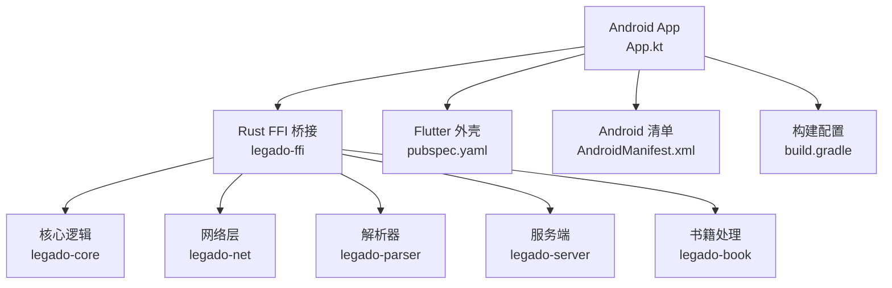
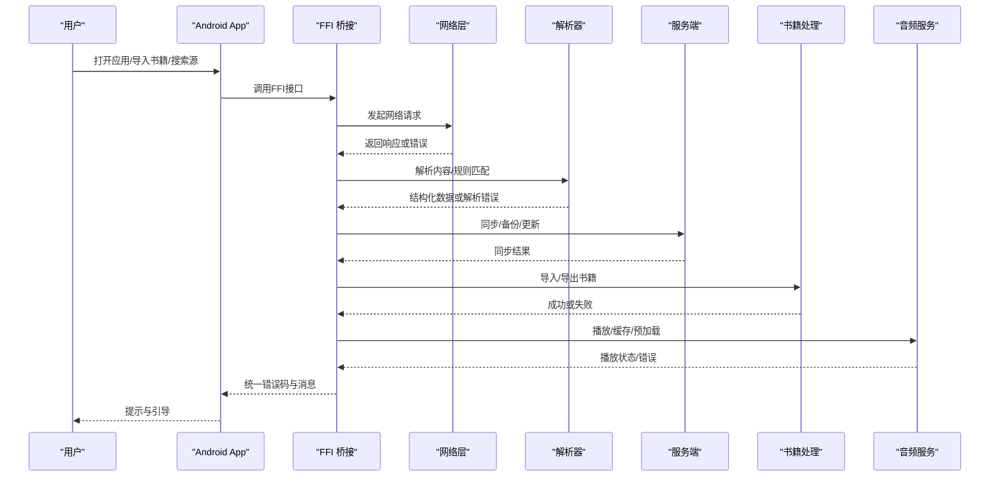
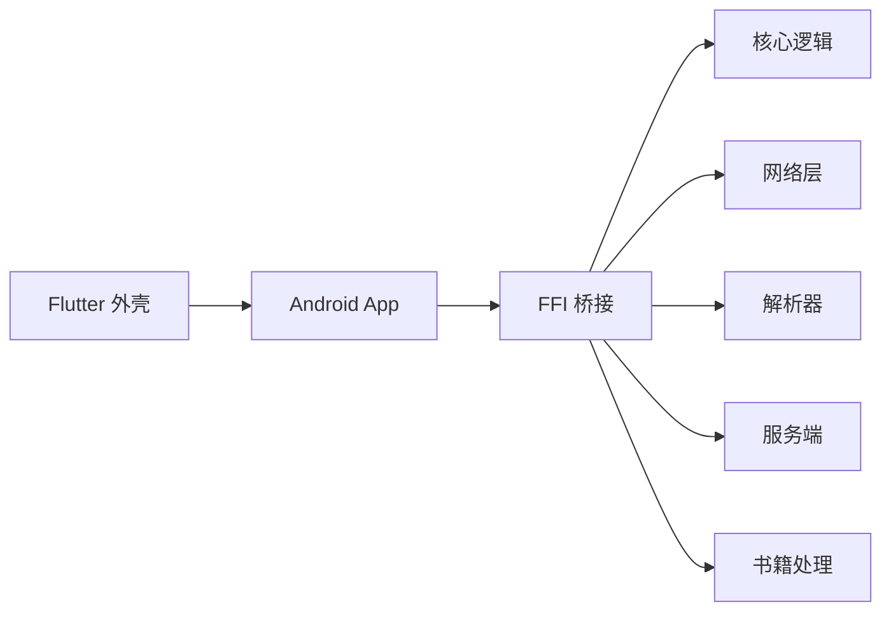

# 常见问题解答

<cite>
**本文引用的文件**   
- [README.md](file://README.md)
- [app/src/main/java/io/legado/app/App.kt](file://app/src/main/java/io/legado/app/App.kt)
- [app/src/main/AndroidManifest.xml](file://app/src/main/AndroidManifest.xml)
- [app/build.gradle](file://app/build.gradle)
- [rust/legado-core/src/error.rs](file://rust/legado-core/src/error.rs)
- [rust/legado-net/src/client.rs](file://rust/legado-net/src/client.rs)
- [rust/legado-net/src/retry.rs](file://rust/legado-net/src/retry.rs)
- [rust/legado-parser/src/analyze_rule.rs](file://rust/legado-parser/src/analyze_rule.rs)
- [rust/legado-server/src/server.rs](file://rust/legado-server/src/server.rs)
- [rust/legado-ffi/src/api/audio_api.rs](file://rust/legado-ffi/src/api/audio_api.rs)
- [rust/legado-book/src/lib.rs](file://rust/legado-book/src/lib.rs)
- [modules/book/src/main/java/me/ag2s/epublib/EPUBReader.java](file://modules/book/src/main/java/me/ag2s/epublib/EPUBReader.java)
- [flutter_legado/pubspec.yaml](file://flutter_legado/pubspec.yaml)
</cite>

## 目录
1. [简介](#简介)
2. [项目结构](#项目结构)
3. [核心组件](#核心组件)
4. [架构总览](#架构总览)
5. [详细组件分析](#详细组件分析)
6. [依赖分析](#依赖分析)
7. [性能考虑](#性能考虑)
8. [故障排查指南](#故障排查指南)
9. [结论](#结论)
10. [附录](#附录)

## 简介
本FAQ聚焦Legado在典型使用场景中的常见问题，覆盖应用安装失败、启动崩溃、书籍导入错误、网络源解析失败、同步服务异常、音频播放问题等。每个问题提供症状描述、可能原因、逐步解决方案与预防措施，并给出快速定位方法与自检清单，帮助非专业用户也能高效排障。

## 项目结构
Legado采用多模块架构：Android原生应用（Kotlin）、Rust核心库（FFI桥接）、Flutter跨平台外壳、Web管理端以及多个子模块（如book、rhino、web）。关键入口包括Android主进程初始化、Rust核心能力暴露、网络与解析引擎、服务器与音频服务等。

图表来源
- [app/src/main/java/io/legado/app/App.kt](file://app/src/main/java/io/legado/app/App.kt)
- [rust/legado-ffi/src/bridge.rs](file://rust/legado-ffi/src/bridge.rs)
- [rust/legado-core/src/lib.rs](file://rust/legado-core/src/lib.rs)
- [rust/legado-net/src/lib.rs](file://rust/legado-net/src/lib.rs)
- [rust/legado-parser/src/lib.rs](file://rust/legado-parser/src/lib.rs)
- [rust/legado-server/src/lib.rs](file://rust/legado-server/src/lib.rs)
- [rust/legado-book/src/lib.rs](file://rust/legado-book/src/lib.rs)
- [flutter_legado/pubspec.yaml](file://flutter_legado/pubspec.yaml)
- [app/src/main/AndroidManifest.xml](file://app/src/main/AndroidManifest.xml)
- [app/build.gradle](file://app/build.gradle)

章节来源
- [README.md](file://README.md)
- [app/src/main/java/io/legado/app/App.kt](file://app/src/main/java/io/legado/app/App.kt)
- [app/src/main/AndroidManifest.xml](file://app/src/main/AndroidManifest.xml)
- [app/build.gradle](file://app/build.gradle)

## 核心组件
- Android应用层：负责UI、权限、系统服务集成与应用生命周期管理。
- Rust核心层：提供统一错误模型、任务调度、缓存、加密、阅读状态等核心能力。
- 网络层：封装HTTP请求、重试策略、代理、SSL配置、Cookie管理等。
- 解析器：规则分析与HTML/JSON/XPath解析，支撑书源与RSS源。
- 服务端：提供本地或远程同步接口与WebSocket通信。
- 书籍处理：支持多种格式（EPUB/TXT/PDF/MOBI等）的读取与导出。
- 音频服务：离线缓存、预加载、播放控制与TTS集成。

章节来源
- [rust/legado-core/src/lib.rs](file://rust/legado-core/src/lib.rs)
- [rust/legado-net/src/lib.rs](file://rust/legado-net/src/lib.rs)
- [rust/legado-parser/src/lib.rs](file://rust/legado-parser/src/lib.rs)
- [rust/legado-server/src/lib.rs](file://rust/legado-server/src/lib.rs)
- [rust/legado-book/src/lib.rs](file://rust/legado-book/src/lib.rs)
- [rust/legado-ffi/src/api/audio_api.rs](file://rust/legado-ffi/src/api/audio_api.rs)

## 架构总览
下图展示从Android到Rust核心再到各子系统的关键交互路径，便于理解错误传播与定位。

图表来源
- [app/src/main/java/io/legado/app/App.kt](file://app/src/main/java/io/legado/app/App.kt)
- [rust/legado-ffi/src/bridge.rs](file://rust/legado-ffi/src/bridge.rs)
- [rust/legado-net/src/client.rs](file://rust/legado-net/src/client.rs)
- [rust/legado-parser/src/analyze_rule.rs](file://rust/legado-parser/src/analyze_rule.rs)
- [rust/legado-server/src/server.rs](file://rust/legado-server/src/server.rs)
- [rust/legado-book/src/lib.rs](file://rust/legado-book/src/lib.rs)
- [rust/legado-ffi/src/api/audio_api.rs](file://rust/legado-ffi/src/api/audio_api.rs)

## 详细组件分析

### 应用安装失败
症状
- 安装中断、签名校验失败、存储空间不足提示、权限被拒绝导致无法写入。

可能原因
- 安装包损坏或不兼容设备架构。
- 未开启“允许未知来源”或系统安全策略限制。
- 存储权限不足或外部存储不可写。
- 应用签名冲突（已存在同包名不同签名的应用）。

解决步骤
- 检查安装包完整性与版本兼容性。
- 在设置中开启“允许未知来源”，并授予存储权限。
- 清理剩余空间后重试安装。
- 卸载旧版同包名应用后再安装新版本。

预防建议
- 通过官方渠道下载稳定版本。
- 保持系统与存储健康，定期清理无用文件。

快速定位
- 查看系统安装日志与包管理器输出，确认失败阶段。
- 检查应用清单中的权限声明是否与实际需求一致。

章节来源
- [app/src/main/AndroidManifest.xml](file://app/src/main/AndroidManifest.xml)
- [app/build.gradle](file://app/build.gradle)

### 启动崩溃
症状
- 应用图标点击后闪退、白屏或卡在启动页。

可能原因
- 数据库迁移失败或Schema不匹配。
- 核心库初始化异常（Rust FFI加载失败）。
- 内存不足或关键资源缺失。
- 第三方依赖初始化错误（如Cronet、WebView）。

解决步骤
- 清除应用数据与缓存后重启。
- 检查是否有更新的数据库迁移脚本。
- 重新安装应用以修复核心库文件。
- 在低内存设备上减少后台任务与缓存大小。

预防建议
- 避免频繁切换版本；升级前备份重要数据。
- 关注应用更新日志中的破坏性变更。

快速定位
- 启用调试模式收集崩溃堆栈。
- 检查应用初始化顺序与依赖加载顺序。

章节来源
- [app/src/main/java/io/legado/app/App.kt](file://app/src/main/java/io/legado/app/App.kt)

### 书籍导入错误
症状
- 导入失败、章节为空、封面缺失、格式不支持或乱码。

可能原因
- 文件格式不被支持或损坏。
- EPUB/TXT/PDF等解析器遇到异常结构。
- 编码识别错误导致文本乱码。
- 磁盘写入失败或路径权限问题。

解决步骤
- 确认文件格式受支持且文件完整。
- 尝试其他导入方式（直接导入/网络抓取/批量导入）。
- 更换编码或手动修正文件头。
- 检查目标目录权限与可用空间。

预防建议
- 优先使用标准格式（推荐EPUB/TXT UTF-8）。
- 对批量导入进行分批次验证。

快速定位
- 查看导入日志与解析错误信息。
- 使用内置工具预览章节内容。

章节来源
- [rust/legado-book/src/lib.rs](file://rust/legado-book/src/lib.rs)
- [modules/book/src/main/java/me/ag2s/epublib/EPUBReader.java](file://modules/book/src/main/java/me/ag2s/epublib/EPUBReader.java)

### 网络源解析失败
症状
- 搜索结果空、章节列表为空、内容抓取失败、验证码拦截。

可能原因
- 网络请求超时或被限流。
- 规则表达式不匹配或语法错误。
- 反爬机制触发（验证码、UA检测、IP封禁）。
- SSL证书或代理配置异常。

解决步骤
- 检查网络连接与代理设置。
- 更新或替换书源规则，确保选择器正确。
- 调整请求间隔与并发数，降低触发风控概率。
- 配置正确的User-Agent与Cookie。

预防建议
- 维护常用书源，及时跟进站点变更。
- 合理设置重试与退避策略。

快速定位
- 启用源调试模式，查看请求与响应。
- 使用规则测试工具验证选择器。

章节来源
- [rust/legado-net/src/client.rs](file://rust/legado-net/src/client.rs)
- [rust/legado-net/src/retry.rs](file://rust/legado-net/src/retry.rs)
- [rust/legado-parser/src/analyze_rule.rs](file://rust/legado-parser/src/analyze_rule.rs)

### 同步服务异常
症状
- 同步失败、数据不一致、WebSocket断连、备份恢复出错。

可能原因
- 服务端端口占用或防火墙拦截。
- 认证令牌过期或权限不足。
- 数据版本不一致导致迁移失败。
- 网络不稳定造成传输中断。

解决步骤
- 检查服务端运行状态与端口监听。
- 重新登录获取新令牌，确认权限。
- 执行数据一致性校验与修复。
- 在网络稳定环境下重试同步。

预防建议
- 固定服务端地址与端口，配置自动重连。
- 定期备份与增量同步。

快速定位
- 查看服务端日志与客户端连接状态。
- 使用诊断工具检查握手与心跳。

章节来源
- [rust/legado-server/src/server.rs](file://rust/legado-server/src/server.rs)

### 音频播放问题
症状
- 无法播放、卡顿、无声、进度丢失、TTS合成失败。

可能原因
- 音频解码器不支持或硬件加速异常。
- 缓存目录权限不足或空间不足。
- 预加载失败导致首帧延迟。
- TTS引擎未安装或配置错误。

解决步骤
- 切换播放引擎（系统/ExoPlayer/自定义）。
- 清理音频缓存并释放空间。
- 关闭预加载或降低并发。
- 安装并配置合适的TTS引擎。

预防建议
- 使用稳定的音频格式与采样率。
- 监控缓存增长与内存占用。

快速定位
- 查看播放日志与错误码。
- 使用音频诊断工具检测解码链。

章节来源
- [rust/legado-ffi/src/api/audio_api.rs](file://rust/legado-ffi/src/api/audio_api.rs)

## 依赖分析
- Android层依赖Rust FFI提供的API，用于核心能力调用。
- Rust核心层依赖网络、解析、服务器、书籍处理等子模块。
- Flutter外壳通过插件与Android层交互，提供跨平台界面。
- 构建配置决定编译选项与依赖版本，影响稳定性与兼容性。

图表来源
- [app/build.gradle](file://app/build.gradle)
- [flutter_legado/pubspec.yaml](file://flutter_legado/pubspec.yaml)
- [rust/legado-ffi/src/bridge.rs](file://rust/legado-ffi/src/bridge.rs)
- [rust/legado-core/src/lib.rs](file://rust/legado-core/src/lib.rs)
- [rust/legado-net/src/lib.rs](file://rust/legado-net/src/lib.rs)
- [rust/legado-parser/src/lib.rs](file://rust/legado-parser/src/lib.rs)
- [rust/legado-server/src/lib.rs](file://rust/legado-server/src/lib.rs)
- [rust/legado-book/src/lib.rs](file://rust/legado-book/src/lib.rs)

章节来源
- [app/build.gradle](file://app/build.gradle)
- [flutter_legado/pubspec.yaml](file://flutter_legado/pubspec.yaml)

## 性能考虑
- 合理设置网络并发与重试次数，避免阻塞与风暴。
- 使用分页与懒加载减少内存占用。
- 对大文件导入进行分块处理与进度反馈。
- 启用缓存与预加载策略，提升用户体验。
- 监控CPU、内存与IO指标，定位瓶颈。

## 故障排查指南
通用流程
- 复现问题并记录环境信息（系统版本、应用版本、网络状况）。
- 收集日志与错误码，定位发生阶段。
- 逐步排除常见原因（权限、网络、缓存、依赖）。
- 验证修复效果并记录经验。

自检清单
- 应用权限是否齐全？
- 存储空间是否充足？
- 网络连接是否正常？
- 缓存与数据是否可清理？
- 依赖库是否最新且兼容？
- 规则与服务端配置是否正确？

章节来源
- [rust/legado-core/src/error.rs](file://rust/legado-core/src/error.rs)

## 结论
通过系统化梳理常见问题与对应解决方案，用户可以快速定位并解决安装、启动、导入、解析、同步与播放等环节的故障。建议结合日志与诊断工具，建立个人排障知识库，提高使用效率与稳定性。

## 附录
- 错误代码说明：参考核心错误定义与网络层错误映射，便于快速对照。
- 最佳实践：规范书源编写、合理配置网络与缓存、定期备份数据。
- 社区资源：参与书源共享与问题反馈，共同维护生态。