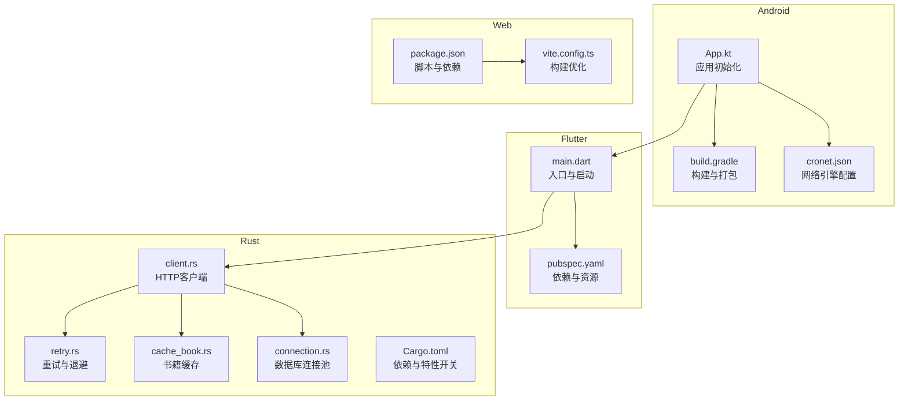
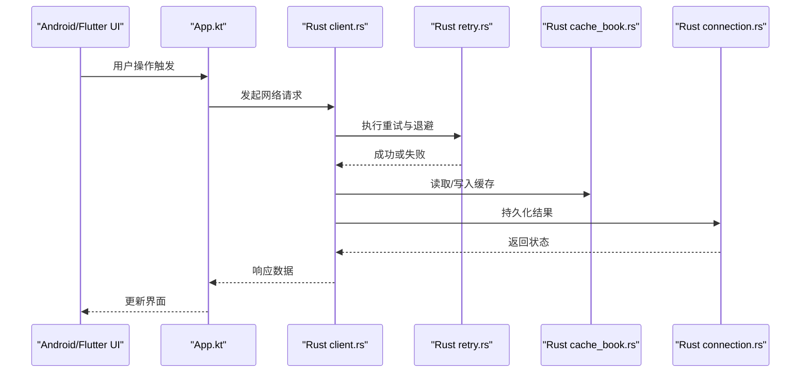
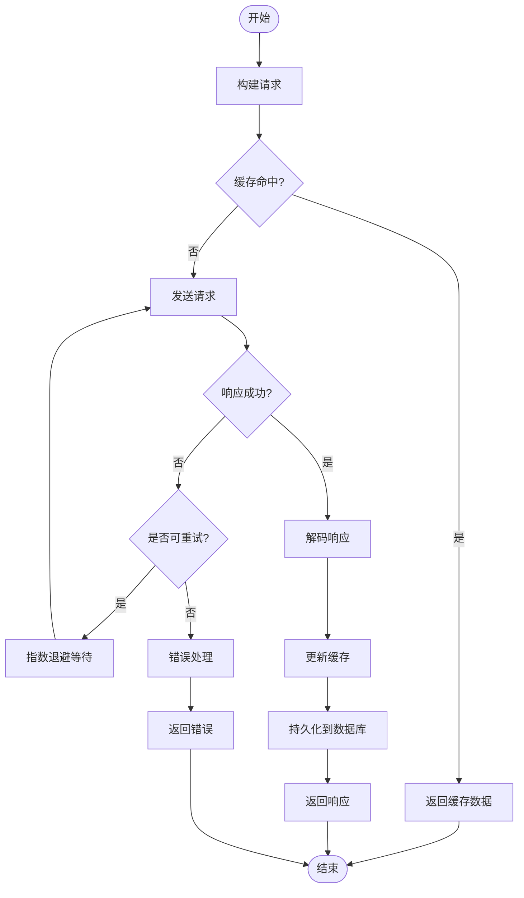
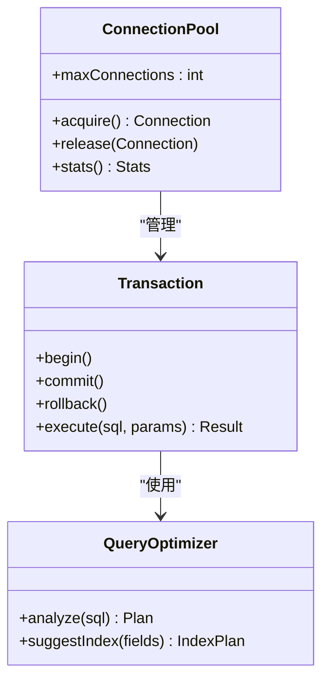
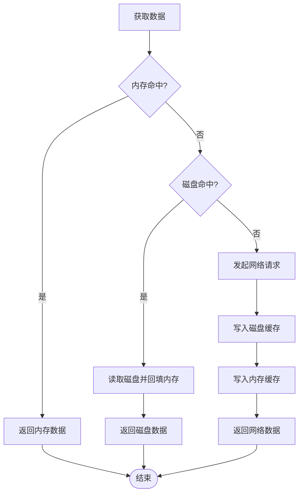
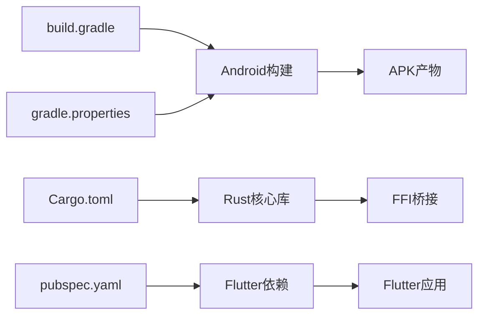

# 性能优化与调优

<cite>
**本文引用的文件**   
- [README.md](file://README.md)
- [build.gradle](file://build.gradle)
- [gradle.properties](file://gradle.properties)
- [app/build.gradle](file://app/build.gradle)
- [app/src/main/java/io/legado/app/App.kt](file://app/src/main/java/io/legado/app/App.kt)
- [app/src/main/assets/cronet.json](file://app/src/main/assets/cronet.json)
- [flutter_lego/pubspec.yaml](file://flutter_lego/pubspec.yaml)
- [flutter_lego/lib/main.dart](file://flutter_lego/lib/main.dart)
- [rust/Cargo.toml](file://rust/Cargo.toml)
- [rust/legado-net/src/client.rs](file://rust/legado-net/src/client.rs)
- [rust/legado-net/src/retry.rs](file://rust/legado-net/src/retry.rs)
- [rust/legado-core/src/cache_book.rs](file://rust/legado-core/src/cache_book.rs)
- [rust/legado-db/src/connection.rs](file://rust/legado-db/src/connection.rs)
- [modules/web/package.json](file://modules/web/package.json)
- [modules/web/vite.config.ts](file://modules/web/vite.config.ts)
</cite>

## 目录
1. [简介](#简介)
2. [项目结构](#项目结构)
3. [核心组件](#核心组件)
4. [架构总览](#架构总览)
5. [详细组件分析](#详细组件分析)
6. [依赖关系分析](#依赖关系分析)
7. [性能考量](#性能考量)
8. [故障排查指南](#故障排查指南)
9. [结论](#结论)
10. [附录](#附录)

## 简介
本指南面向Legado项目的性能优化与调优，覆盖Android、Flutter、Rust与Web多端。内容涵盖：
- 性能问题诊断方法与工具链（Android Profiler、Flutter Performance、Rust性能分析器、浏览器开发者工具）
- 内存管理、CPU使用率、IO操作、网络请求的优化策略
- 缓存策略、数据库查询、图片加载、异步处理等关键技术
- 基准测试与性能回归检测实践
- 结合仓库现有实现的具体优化案例与最佳实践

## 项目结构
Legado采用多模块、多语言协作的工程结构：
- Android应用层（Kotlin/Java），负责UI、业务编排与系统能力调用
- Flutter跨平台界面层，提供统一的交互体验
- Rust核心库，承担高性能计算、网络、数据库与FFI桥接
- Web管理端，用于配置与调试

图表来源
- [app/src/main/java/io/legado/app/App.kt](file://app/src/main/java/io/legado/app/App.kt)
- [app/build.gradle](file://app/build.gradle)
- [app/src/main/assets/cronet.json](file://app/src/main/assets/cronet.json)
- [flutter_lego/lib/main.dart](file://flutter_lego/lib/main.dart)
- [flutter_lego/pubspec.yaml](file://flutter_lego/pubspec.yaml)
- [rust/legado-net/src/client.rs](file://rust/legado-net/src/client.rs)
- [rust/legado-net/src/retry.rs](file://rust/legado-net/src/retry.rs)
- [rust/legado-core/src/cache_book.rs](file://rust/legado-core/src/cache_book.rs)
- [rust/legado-db/src/connection.rs](file://rust/legado-db/src/connection.rs)
- [modules/web/package.json](file://modules/web/package.json)
- [modules/web/vite.config.ts](file://modules/web/vite.config.ts)

章节来源
- [README.md](file://README.md)
- [build.gradle](file://build.gradle)
- [gradle.properties](file://gradle.properties)

## 核心组件
- 应用启动与初始化（Android）
  - 负责全局配置、日志、网络栈、数据库与缓存初始化
  - 关键路径：应用入口 -> 初始化网络（Cronet/OkHttp）-> 初始化数据库 -> 初始化缓存
- 网络层（Rust）
  - HTTP客户端封装、重试与退避、连接复用、压缩与缓存
  - 关键路径：发起请求 -> 中间件处理 -> 重试策略 -> 响应解码 -> 缓存写入
- 数据库层（Rust + Android Room）
  - SQLite连接池、迁移、读写分离、索引优化
  - 关键路径：事务开启 -> 预编译SQL -> 批量写入 -> 提交/回滚
- 缓存层（Rust + Android）
  - 磁盘与内存多级缓存、TTL、LRU淘汰、热点数据预热
- Web管理端（Vite + Vue）
  - 构建优化、按需加载、静态资源压缩与CDN

章节来源
- [app/src/main/java/io/legado/app/App.kt](file://app/src/main/java/io/legado/app/App.kt)
- [rust/legado-net/src/client.rs](file://rust/legado-net/src/client.rs)
- [rust/legado-db/src/connection.rs](file://rust/legado-db/src/connection.rs)
- [rust/legado-core/src/cache_book.rs](file://rust/legado-core/src/cache_book.rs)
- [modules/web/vite.config.ts](file://modules/web/vite.config.ts)

## 架构总览
整体架构强调“前端轻量、核心重算”的分层设计：
- Android/Flutter负责交互与渲染
- Rust核心承担高并发网络、解析与存储
- Web端提供管理与调试能力

图表来源
- [app/src/main/java/io/legado/app/App.kt](file://app/src/main/java/io/legado/app/App.kt)
- [rust/legado-net/src/client.rs](file://rust/legado-net/src/client.rs)
- [rust/legado-net/src/retry.rs](file://rust/legado-net/src/retry.rs)
- [rust/legado-core/src/cache_book.rs](file://rust/legado-core/src/cache_book.rs)
- [rust/legado-db/src/connection.rs](file://rust/legado-db/src/connection.rs)

## 详细组件分析

### 网络层优化（Rust HTTP客户端与重试）
- 连接复用与超时控制
  - 合理设置连接池大小、空闲超时、请求超时
  - 启用HTTP/2与Keep-Alive，减少握手开销
- 重试与退避
  - 指数退避+抖动，避免雪崩
  - 区分可重试错误（网络抖动、5xx）与不可重试错误（4xx）
- 压缩与缓存
  - 启用Gzip/Brotli压缩
  - 按URL与ETag进行条件请求与缓存命中
- 监控与指标
  - 记录请求耗时、成功率、重试次数、带宽占用

图表来源
- [rust/legado-net/src/client.rs](file://rust/legado-net/src/client.rs)
- [rust/legado-net/src/retry.rs](file://rust/legado-net/src/retry.rs)
- [rust/legado-core/src/cache_book.rs](file://rust/legado-core/src/cache_book.rs)
- [rust/legado-db/src/connection.rs](file://rust/legado-db/src/connection.rs)

章节来源
- [rust/legado-net/src/client.rs](file://rust/legado-net/src/client.rs)
- [rust/legado-net/src/retry.rs](file://rust/legado-net/src/retry.rs)

### 数据库层优化（SQLite连接池与查询）
- 连接池与事务
  - 限制最大连接数，避免锁竞争
  - 批量写入与事务包裹，减少磁盘同步次数
- 索引与查询计划
  - 为高频查询字段建立索引
  - 使用EXPLAIN分析慢查询，避免全表扫描
- 读写分离与分页
  - 读多写少场景下拆分读写连接
  - 分页加载，避免一次性拉取大量数据

图表来源
- [rust/legado-db/src/connection.rs](file://rust/legado-db/src/connection.rs)

章节来源
- [rust/legado-db/src/connection.rs](file://rust/legado-db/src/connection.rs)

### 缓存层优化（多级缓存与TTL）
- 内存缓存
  - LRU/LFU策略，限制最大条目与单条大小
  - 热点数据快速命中，降低IO压力
- 磁盘缓存
  - 按URL哈希命名，支持ETag与Last-Modified
  - 定期清理过期与低优先级缓存
- 预热与降级
  - 启动时预热常用数据
  - 缓存失效时降级到网络直连

图表来源
- [rust/legado-core/src/cache_book.rs](file://rust/legado-core/src/cache_book.rs)

章节来源
- [rust/legado-core/src/cache_book.rs](file://rust/legado-core/src/cache_book.rs)

### Android与Flutter启动与渲染优化
- Android启动
  - 延迟初始化非关键服务
  - 使用Cronet提升网络性能
- Flutter启动
  - 减少首屏Widget数量
  - 使用const构造与懒加载
- 渲染优化
  - 避免主线程阻塞
  - 图片按需加载与尺寸适配

章节来源
- [app/src/main/java/io/legado/app/App.kt](file://app/src/main/java/io/legado/app/App.kt)
- [app/src/main/assets/cronet.json](file://app/src/main/assets/cronet.json)
- [flutter_lego/lib/main.dart](file://flutter_lego/lib/main.dart)

### Web管理端构建优化
- Vite构建
  - 代码分割与按需加载
  - 静态资源压缩与缓存策略
- 依赖管理
  - 锁定版本，减少重复依赖

章节来源
- [modules/web/package.json](file://modules/web/package.json)
- [modules/web/vite.config.ts](file://modules/web/vite.config.ts)

## 依赖关系分析
- Gradle与构建
  - 通过build.gradle与gradle.properties控制编译选项、签名与混淆
- Rust依赖
  - Cargo.toml管理核心库依赖与特性开关
- Flutter依赖
  - pubspec.yaml声明插件与资源

图表来源
- [build.gradle](file://build.gradle)
- [gradle.properties](file://gradle.properties)
- [rust/Cargo.toml](file://rust/Cargo.toml)
- [flutter_lego/pubspec.yaml](file://flutter_lego/pubspec.yaml)

章节来源
- [build.gradle](file://build.gradle)
- [gradle.properties](file://gradle.properties)
- [rust/Cargo.toml](file://rust/Cargo.toml)
- [flutter_lego/pubspec.yaml](file://flutter_lego/pubspec.yaml)

## 性能考量
- 内存管理
  - 避免大对象在堆上长期驻留
  - 使用对象池与零拷贝技术
  - 及时释放Bitmap与流资源
- CPU使用率
  - 将密集计算下沉至Rust
  - 避免在主线程执行阻塞任务
  - 合理使用协程与线程池
- IO操作
  - 批量写入与异步IO
  - 使用缓冲与分块传输
  - 避免频繁小文件读写
- 网络请求
  - 连接复用与HTTP/2
  - 压缩与缓存
  - 合理的超时与重试策略
- 图片加载
  - 按需加载与尺寸适配
  - 使用高效格式（WebP）
  - 缓存缩略图与占位图
- 异步处理
  - 明确责任边界，避免回调地狱
  - 使用结构化并发与取消机制
  - 背压与限流保护

## 故障排查指南
- 工具链
  - Android Profiler：CPU、内存、网络、电池分析
  - Flutter Performance：帧率、布局重建、事件耗时
  - Rust性能分析器：perf、flamegraph、criterion基准
  - 浏览器开发者工具：Network、Performance、Memory面板
- 常见问题定位
  - 卡顿：检查主线程阻塞与过度绘制
  - 内存泄漏：使用LeakCanary与堆转储分析
  - 网络慢：抓包与服务器性能分析
  - 数据库慢：慢查询日志与索引缺失
- 回归检测
  - 集成基准测试到CI
  - 关键路径自动化监控
  - 阈值告警与自动回滚

章节来源
- [app/src/main/java/io/legado/app/App.kt](file://app/src/main/java/io/legado/app/App.kt)
- [rust/legado-net/src/client.rs](file://rust/legado-net/src/client.rs)
- [rust/legado-db/src/connection.rs](file://rust/legado-db/src/connection.rs)

## 结论
Legado的多层架构为性能优化提供了清晰切入点：
- 在网络层引入重试、压缩与缓存，显著降低延迟与带宽
- 在数据库层通过连接池、事务与索引优化提升吞吐
- 在缓存层实现多级缓存与预热，提高命中率
- 在前端侧通过启动优化与渲染优化改善用户体验
建议持续使用性能工具与基准测试，建立性能基线与回归检测机制，确保迭代过程中的性能稳定。

## 附录
- 基准测试方法
  - 定义关键路径用例（如列表加载、搜索、播放）
  - 使用criterion与JMH编写单元测试
  - CI中运行并对比历史数据
- 最佳实践清单
  - 所有外部IO必须异步
  - 禁止在主线程执行网络与磁盘IO
  - 使用连接池与对象池
  - 启用压缩与缓存
  - 监控关键指标并设置告警