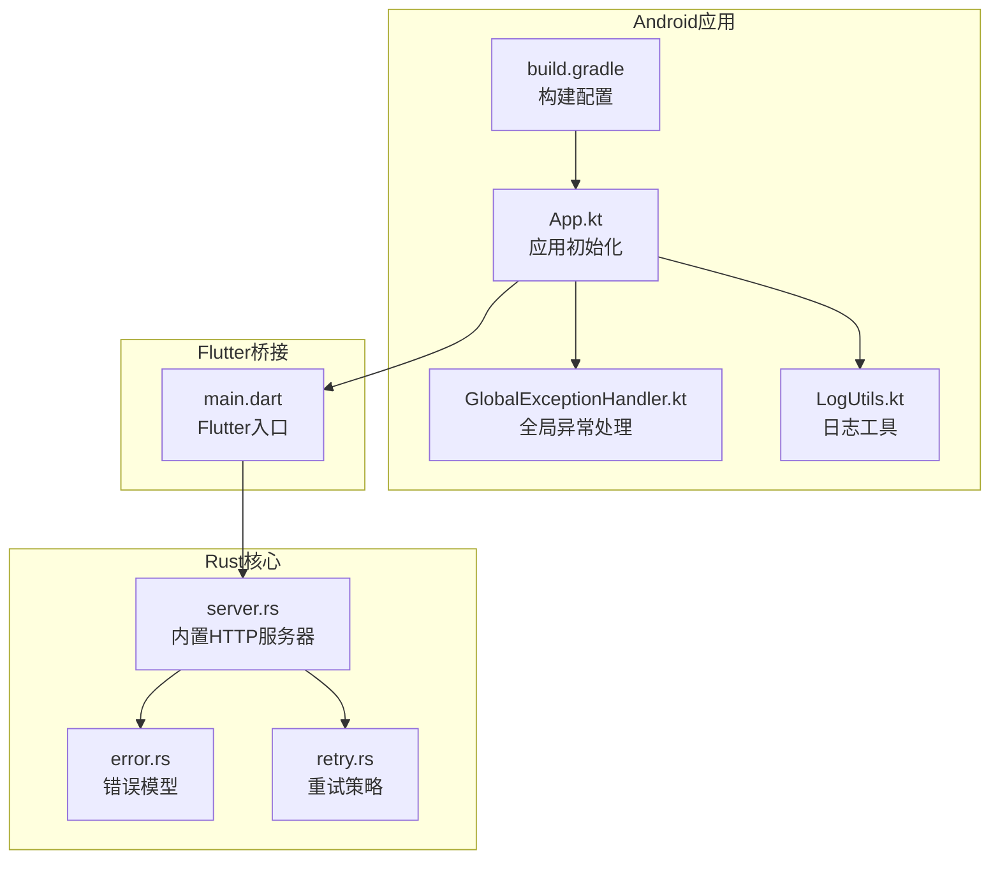
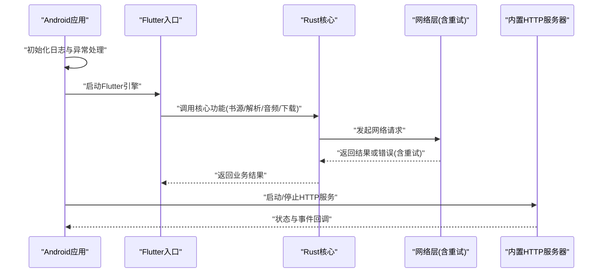
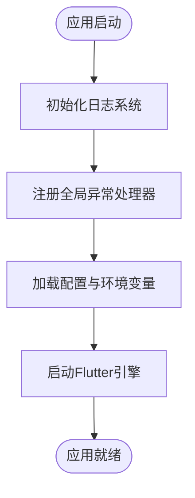
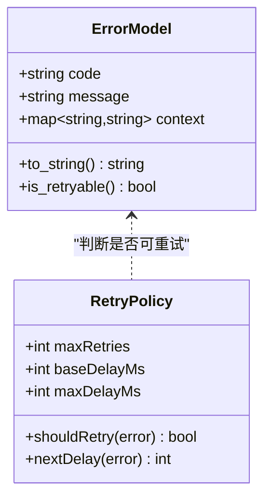
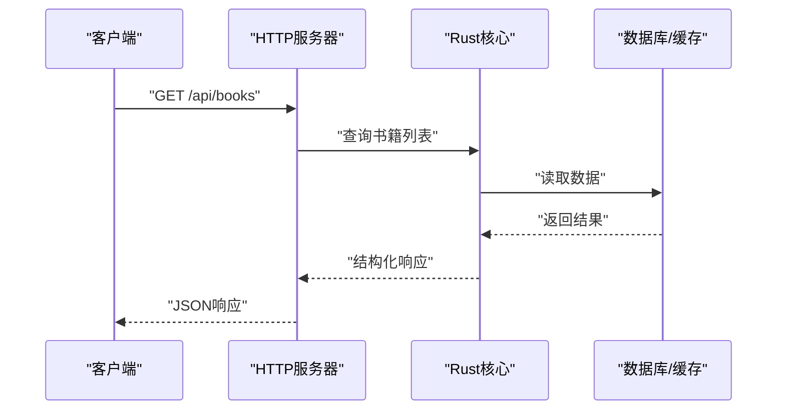
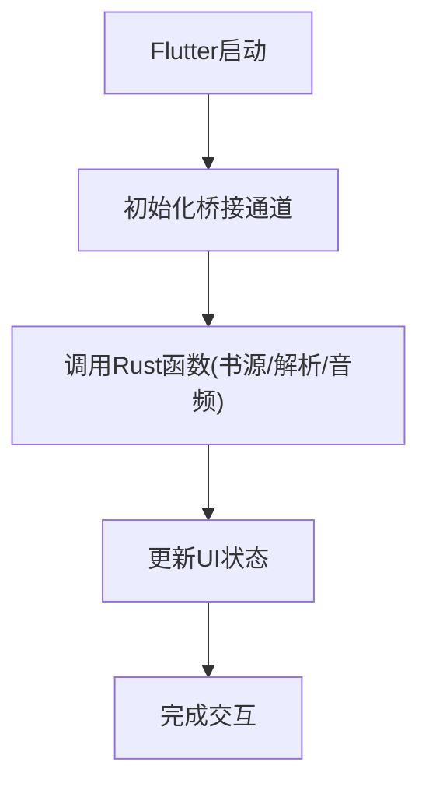
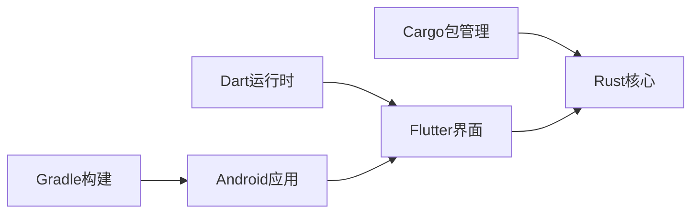

# 故障排除

<cite>
**本文引用的文件**   
- [README.md](file://README.md)
- [app/src/main/java/io/legado/app/App.kt](file://app/src/main/java/io/legado/app/App.kt)
- [app/src/main/java/io/legado/app/exception/GlobalExceptionHandler.kt](file://app/src/main/java/io/legado/app/exception/GlobalExceptionHandler.kt)
- [app/src/main/java/io/legado/app/utils/LogUtils.kt](file://app/src/main/java/io/legado/app/utils/LogUtils.kt)
- [rust/legado-core/src/error.rs](file://rust/legado-core/src/error.rs)
- [rust/legado-net/src/retry.rs](file://rust/legado-net/src/retry.rs)
- [rust/legado-server/src/server.rs](file://rust/legado-server/src/server.rs)
- [flutter_legado/lib/main.dart](file://flutter_legado/lib/main.dart)
- [app/build.gradle](file://app/build.gradle)
- [gradle.properties](file://gradle.properties)
- [Makefile](file://Makefile)
</cite>

## 目录
1. [简介](#简介)
2. [项目结构](#项目结构)
3. [核心组件](#核心组件)
4. [架构总览](#架构总览)
5. [详细组件分析](#详细组件分析)
6. [依赖分析](#依赖分析)
7. [性能考虑](#性能考虑)
8. [故障排查指南](#故障排查指南)
9. [结论](#结论)
10. [附录](#附录)

## 简介
本故障排除文档面向Legado（Android阅读与网络源管理应用）的用户与开发者，覆盖安装、启动、运行、性能、崩溃等常见问题的诊断与修复方法。文档同时提供日志收集与分析、性能调优策略、错误处理与容错机制说明、调试工具使用指南，以及问题报告模板与反馈渠道，帮助快速定位并解决问题。

## 项目结构
Legado采用多模块混合架构：
- Android原生应用（Kotlin/Java）负责UI、系统交互、服务与数据持久化
- Rust核心库通过Flutter桥接暴露能力，涵盖网络、解析、音频、下载、服务器等
- Flutter层提供跨平台界面与桥接入口
- Web端用于源码编辑与管理

图表来源
- [app/src/main/java/io/legado/app/App.kt](file://app/src/main/java/io/legado/app/App.kt)
- [app/src/main/java/io/legado/app/exception/GlobalExceptionHandler.kt](file://app/src/main/java/io/legado/app/exception/GlobalExceptionHandler.kt)
- [app/src/main/java/io/legado/app/utils/LogUtils.kt](file://app/src/main/java/io/legado/app/utils/LogUtils.kt)
- [rust/legado-core/src/error.rs](file://rust/legado-core/src/error.rs)
- [rust/legado-net/src/retry.rs](file://rust/legado-net/src/retry.rs)
- [rust/legado-server/src/server.rs](file://rust/legado-server/src/server.rs)
- [flutter_legado/lib/main.dart](file://flutter_legado/lib/main.dart)
- [app/build.gradle](file://app/build.gradle)

章节来源
- [README.md](file://README.md)
- [app/build.gradle](file://app/build.gradle)
- [gradle.properties](file://gradle.properties)
- [Makefile](file://Makefile)

## 核心组件
- 应用初始化与生命周期：负责全局配置、日志、异常捕获、服务启动
- 全局异常处理：统一捕获未处理异常，输出堆栈与上下文信息，便于定位崩溃
- 日志系统：集中记录应用日志、网络请求、IO操作、崩溃信息
- Rust核心错误模型：定义错误类型与转换，支撑上层稳定处理
- 网络重试机制：对不稳定网络进行指数退避与重试
- 内置HTTP服务器：为Web端或外部客户端提供服务接口

章节来源
- [app/src/main/java/io/legado/app/App.kt](file://app/src/main/java/io/legado/app/App.kt)
- [app/src/main/java/io/legado/app/exception/GlobalExceptionHandler.kt](file://app/src/main/java/io/legado/app/exception/GlobalExceptionHandler.kt)
- [app/src/main/java/io/legado/app/utils/LogUtils.kt](file://app/src/main/java/io/legado/app/utils/LogUtils.kt)
- [rust/legado-core/src/error.rs](file://rust/legado-core/src/error.rs)
- [rust/legado-net/src/retry.rs](file://rust/legado-net/src/retry.rs)
- [rust/legado-server/src/server.rs](file://rust/legado-server/src/server.rs)

## 架构总览
整体流程从Android应用启动开始，初始化日志与异常处理，随后加载Flutter引擎并通过桥接调用Rust核心能力。网络请求由Rust网络层处理，包含重试与错误恢复；内置HTTP服务器对外暴露API；所有关键路径均具备日志记录与异常上报。

图表来源
- [app/src/main/java/io/legado/app/App.kt](file://app/src/main/java/io/legado/app/App.kt)
- [flutter_legado/lib/main.dart](file://flutter_legado/lib/main.dart)
- [rust/legado-net/src/retry.rs](file://rust/legado-net/src/retry.rs)
- [rust/legado-server/src/server.rs](file://rust/legado-server/src/server.rs)

## 详细组件分析

### 应用初始化与异常处理
- 应用启动时注册全局异常处理器，确保未捕获异常也能被记录并上报
- 初始化日志框架，设置日志级别、输出目标（控制台、文件、网络）
- 根据构建配置启用/禁用调试特性与性能监控

图表来源
- [app/src/main/java/io/legado/app/App.kt](file://app/src/main/java/io/legado/app/App.kt)
- [app/src/main/java/io/legado/app/exception/GlobalExceptionHandler.kt](file://app/src/main/java/io/legado/app/exception/GlobalExceptionHandler.kt)
- [app/src/main/java/io/legado/app/utils/LogUtils.kt](file://app/src/main/java/io/legado/app/utils/LogUtils.kt)

章节来源
- [app/src/main/java/io/legado/app/App.kt](file://app/src/main/java/io/legado/app/App.kt)
- [app/src/main/java/io/legado/app/exception/GlobalExceptionHandler.kt](file://app/src/main/java/io/legado/app/exception/GlobalExceptionHandler.kt)
- [app/src/main/java/io/legado/app/utils/LogUtils.kt](file://app/src/main/java/io/legado/app/utils/LogUtils.kt)

### Rust错误模型与网络重试
- 错误模型统一封装各类错误（网络、解析、IO、权限），并提供可序列化与可转换能力
- 网络层实现指数退避重试，支持最大重试次数、超时控制、失败降级

图表来源
- [rust/legado-core/src/error.rs](file://rust/legado-core/src/error.rs)
- [rust/legado-net/src/retry.rs](file://rust/legado-net/src/retry.rs)

章节来源
- [rust/legado-core/src/error.rs](file://rust/legado-core/src/error.rs)
- [rust/legado-net/src/retry.rs](file://rust/legado-net/src/retry.rs)

### 内置HTTP服务器
- 提供REST API与WebSocket接口，供Web端或外部工具访问
- 支持路由注册、中间件、错误响应格式化
- 与Rust核心模块集成，读取/写入数据、触发任务

图表来源
- [rust/legado-server/src/server.rs](file://rust/legado-server/src/server.rs)

章节来源
- [rust/legado-server/src/server.rs](file://rust/legado-server/src/server.rs)

### Flutter桥接入口
- Flutter作为跨平台界面层，通过桥接调用Rust核心能力
- 处理用户输入、渲染UI、管理状态，并将复杂计算下沉到Rust

图表来源
- [flutter_legado/lib/main.dart](file://flutter_legado/lib/main.dart)

章节来源
- [flutter_legado/lib/main.dart](file://flutter_legado/lib/main.dart)

## 依赖分析
- Android模块依赖Gradle构建系统与Android SDK
- Flutter模块依赖Dart运行时与插件生态
- Rust模块通过Cargo管理依赖，提供FFI接口给Flutter与Android
- 各层之间通过明确的接口契约通信，降低耦合度

图表来源
- [app/build.gradle](file://app/build.gradle)
- [gradle.properties](file://gradle.properties)
- [Makefile](file://Makefile)

章节来源
- [app/build.gradle](file://app/build.gradle)
- [gradle.properties](file://gradle.properties)
- [Makefile](file://Makefile)

## 性能考虑
- 内存优化：避免大对象长期持有，合理使用缓存与懒加载，及时释放资源
- CPU优化：将密集计算下沉至Rust，减少主线程阻塞，使用异步并发
- IO优化：批量读写、压缩传输、合理缓存策略，减少磁盘与网络开销
- 网络优化：连接池、超时控制、重试退避、代理与SSL配置调优

[本节为通用指导，不直接分析具体文件]

## 故障排查指南

### 安装问题
- 现象：APK无法安装、签名校验失败、依赖缺失
- 排查步骤：
  - 检查设备系统版本与ABI兼容性
  - 确认已开启“允许未知来源”选项
  - 验证签名与包名一致性
  - 查看系统安装日志与包管理器输出
- 解决方法：
  - 重新构建对应ABI的APK
  - 清理缓存后重装
  - 检查第三方依赖冲突

章节来源
- [app/build.gradle](file://app/build.gradle)
- [gradle.properties](file://gradle.properties)

### 启动失败
- 现象：应用闪退、白屏、卡在启动页
- 排查步骤：
  - 查看全局异常日志与崩溃堆栈
  - 检查初始化顺序与依赖注入
  - 验证配置文件与权限申请
- 解决方法：
  - 修复空指针与非法参数
  - 调整初始化逻辑与资源加载
  - 补充必要权限声明

章节来源
- [app/src/main/java/io/legado/app/App.kt](file://app/src/main/java/io/legado/app/App.kt)
- [app/src/main/java/io/legado/app/exception/GlobalExceptionHandler.kt](file://app/src/main/java/io/legado/app/exception/GlobalExceptionHandler.kt)

### 运行异常
- 现象：页面卡顿、数据加载失败、播放中断
- 排查步骤：
  - 采集应用日志与网络请求日志
  - 检查数据库事务与锁竞争
  - 分析CPU与内存占用曲线
- 解决方法：
  - 优化异步任务调度
  - 增加缓存与预加载
  - 修复死锁与竞态条件

章节来源
- [app/src/main/java/io/legado/app/utils/LogUtils.kt](file://app/src/main/java/io/legado/app/utils/LogUtils.kt)
- [rust/legado-net/src/retry.rs](file://rust/legado-net/src/retry.rs)

### 性能问题
- 现象：滑动掉帧、搜索缓慢、下载卡顿
- 排查步骤：
  - 使用Profiler分析CPU、内存、IO、网络
  - 检查主线程阻塞与过度绘制
  - 评估算法复杂度与数据结构选择
- 解决方法：
  - 引入分页与虚拟列表
  - 使用Rust加速计算密集型任务
  - 优化图片加载与缓存策略

[本节为通用指导，不直接分析具体文件]

### 日志收集与分析
- 应用日志：通过LogUtils统一输出，包含时间戳、级别、模块、消息
- 系统日志：adb logcat抓取，过滤应用包名
- 网络日志：启用HTTP抓包或Rust网络层日志
- 崩溃日志：ANR与Crash堆栈，包含线程快照与寄存器状态
- 分析方法：
  - 按时间线串联多类日志
  - 使用关键字过滤异常与警告
  - 结合性能指标定位瓶颈

章节来源
- [app/src/main/java/io/legado/app/utils/LogUtils.kt](file://app/src/main/java/io/legado/app/utils/LogUtils.kt)

### 错误处理与异常恢复
- 异常捕获：全局处理器兜底未捕获异常，记录上下文
- 错误恢复：网络重试、降级回退、默认值填充
- 容错机制：熔断、限流、隔离舱模式
- 健壮性设计：幂等接口、超时控制、资源回收

章节来源
- [app/src/main/java/io/legado/app/exception/GlobalExceptionHandler.kt](file://app/src/main/java/io/legado/app/exception/GlobalExceptionHandler.kt)
- [rust/legado-core/src/error.rs](file://rust/legado-core/src/error.rs)
- [rust/legado-net/src/retry.rs](file://rust/legado-net/src/retry.rs)

### 调试工具与技巧
- Android Studio调试：断点、变量监视、内存泄漏检测
- Flutter DevTools：性能分析、Widget树、网络请求
- Rust调试器：gdb/lldb配合符号文件，查看底层堆栈
- 网络抓包：Charles/mitmproxy拦截HTTPS，解密TLS流量
- 实用技巧：
  - 使用日志标签区分模块
  - 开启详细日志仅用于问题复现场景
  - 录制屏幕与操作序列辅助复现

[本节为通用指导，不直接分析具体文件]

### 问题报告模板
- 问题描述：清晰说明现象与影响范围
- 环境信息：设备型号、系统版本、应用版本、构建类型
- 复现步骤：逐步列出操作步骤，确保可重复
- 日志附件：应用日志、系统日志、网络日志、崩溃堆栈
- 期望行为：描述预期结果与实际差异
- 反馈渠道：GitHub Issues、社区论坛、邮件支持

[本节为通用指导，不直接分析具体文件]

### 具体故障案例与解决方案
- 案例一：启动即崩溃
  - 现象：打开应用立即退出
  - 原因：全局异常处理器捕获NPE
  - 解决：修复初始化顺序，添加空值检查
- 案例二：网络请求频繁失败
  - 现象：书源加载缓慢或失败
  - 原因：超时设置过短，未启用重试
  - 解决：调整超时与重试策略，启用代理
- 案例三：内存泄漏导致卡顿
  - 现象：长时间使用后内存飙升
  - 原因：Activity引用未释放
  - 解决：使用弱引用，及时注销监听器

[本节为通用指导，不直接分析具体文件]

## 结论
通过系统化日志收集、结构化错误处理、合理的性能调优与完善的调试手段，可有效提升Legado的稳定性和用户体验。建议在生产环境中启用关键日志与监控，在开发阶段加强单元测试与集成测试，持续改进代码质量与健壮性。

## 附录
- 常用命令：
  - adb logcat -s io.legado.app:* > app.log
  - flutter pub get && flutter run
  - cargo build --release
- 参考文档：
  - README.md中的构建与使用说明
  - Gradle与Flutter官方文档

章节来源
- [README.md](file://README.md)
- [Makefile](file://Makefile)