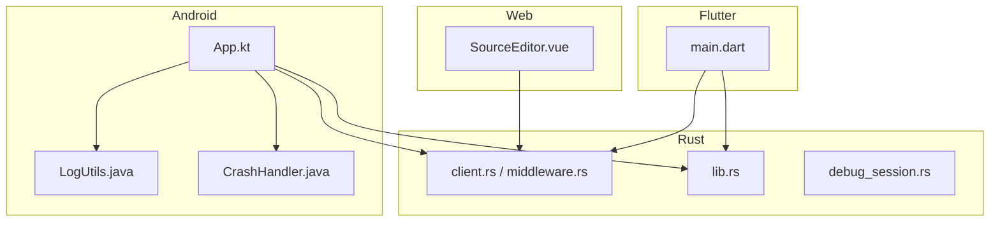
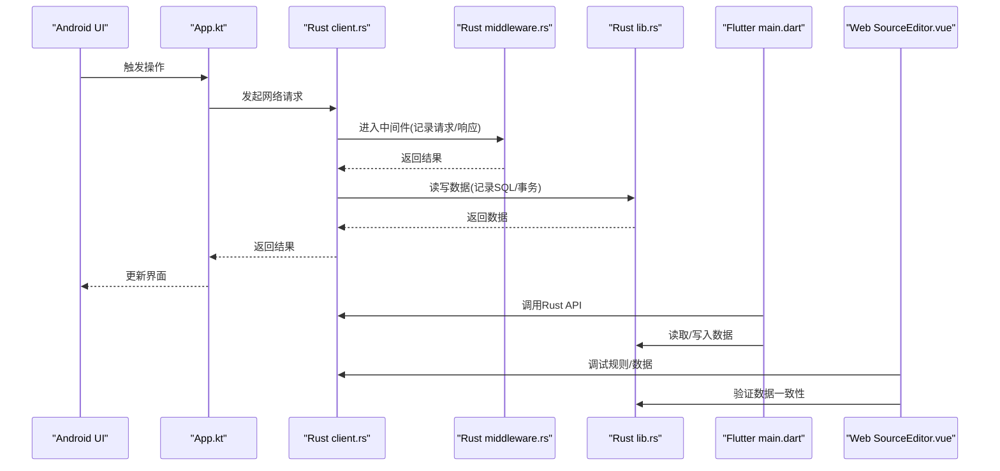
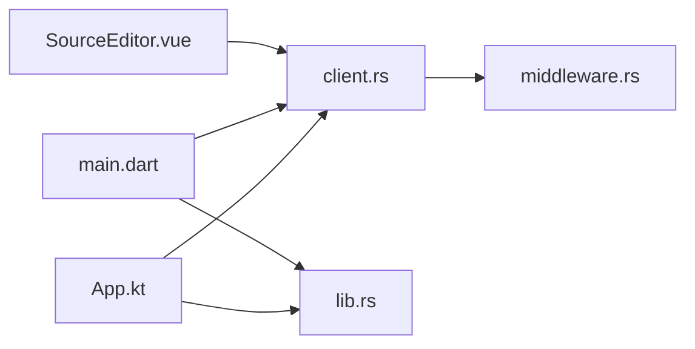

# 日志分析与调试

<cite>
**本文引用的文件**   
- [app/src/main/java/io/legado/app/App.kt](file://app/src/main/java/io/legado/app/App.kt)
- [app/src/main/java/io/legado/app/utils/LogUtils.java](file://app/src/main/java/io/legado/app/utils/LogUtils.java)
- [app/src/main/java/io/legado/app/utils/CrashHandler.java](file://app/src/main/java/io/legado/app/utils/CrashHandler.java)
- [rust/legado-net/src/client.rs](file://rust/legado-net/src/client.rs)
- [rust/legado-net/src/middleware.rs](file://rust/legado-net/src/middleware.rs)
- [rust/legado-db/src/lib.rs](file://rust/legado-db/src/lib.rs)
- [rust/legado-core/src/debug_session.rs](file://rust/legado-core/src/debug_session.rs)
- [flutter_legado/lib/src/main.dart](file://flutter_legado/lib/src/main.dart)
- [modules/web/src/views/SourceEditor.vue](file://modules/web/src/views/SourceEditor.vue)
</cite>

## 目录
1. [简介](#简介)
2. [项目结构](#项目结构)
3. [核心组件](#核心组件)
4. [架构总览](#架构总览)
5. [详细组件分析](#详细组件分析)
6. [依赖关系分析](#依赖关系分析)
7. [性能注意事项](#性能注意事项)
8. [故障排查指南](#故障排查指南)
9. [结论](#结论)
10. [附录](#附录)

## 简介
本指南面向Legado多端（Android、Flutter、Rust、Web）的日志与调试实践，覆盖应用日志、崩溃日志、系统日志、网络请求日志、数据库操作日志等类型；提供各平台查看方法（Android Logcat、Flutter DevTools、Rust日志输出、Web控制台）；解释日志级别、格式规范与过滤技巧；并给出错误模式识别、性能瓶颈定位、内存泄漏检测等方法论与实操建议。

## 项目结构
本项目采用多模块、多语言协作：
- Android应用层：Kotlin/Java实现UI与业务逻辑，使用LogUtils进行应用日志，CrashHandler捕获崩溃。
- Rust核心库：网络、数据库、解析、FFI桥接等，通过日志框架输出结构化日志。
- Flutter前端：跨平台UI与状态管理，配合DevTools进行调试。
- Web工具：源码编辑与调试界面，便于规则与数据校验。

图表来源 
- [app/src/main/java/io/legado/app/App.kt](file://app/src/main/java/io/legado/app/App.kt)
- [app/src/main/java/io/legado/app/utils/LogUtils.java](file://app/src/main/java/io/legado/app/utils/LogUtils.java)
- [app/src/main/java/io/legado/app/utils/CrashHandler.java](file://app/src/main/java/io/legado/app/utils/CrashHandler.java)
- [rust/legado-net/src/client.rs](file://rust/legado-net/src/client.rs)
- [rust/legado-net/src/middleware.rs](file://rust/legado-net/src/middleware.rs)
- [rust/legado-db/src/lib.rs](file://rust/legado-db/src/lib.rs)
- [rust/legado-core/src/debug_session.rs](file://rust/legado-core/src/debug_session.rs)
- [flutter_legado/lib/src/main.dart](file://flutter_legado/lib/src/main.dart)
- [modules/web/src/views/SourceEditor.vue](file://modules/web/src/views/SourceEditor.vue)

章节来源
- [app/src/main/java/io/legado/app/App.kt](file://app/src/main/java/io/legado/app/App.kt)
- [app/src/main/java/io/legado/app/utils/LogUtils.java](file://app/src/main/java/io/legado/app/utils/LogUtils.java)
- [app/src/main/java/io/legado/app/utils/CrashHandler.java](file://app/src/main/java/io/legado/app/utils/CrashHandler.java)
- [rust/legado-net/src/client.rs](file://rust/legado-net/src/client.rs)
- [rust/legado-net/src/middleware.rs](file://rust/legado-net/src/middleware.rs)
- [rust/legado-db/src/lib.rs](file://rust/legado-db/src/lib.rs)
- [rust/legado-core/src/debug_session.rs](file://rust/legado-core/src/debug_session.rs)
- [flutter_legado/lib/src/main.dart](file://flutter_legado/lib/src/main.dart)
- [modules/web/src/views/SourceEditor.vue](file://modules/web/src/views/SourceEditor.vue)

## 核心组件
- 应用日志（LogUtils）：统一封装日志输出，支持按模块/标签分类、级别控制、格式化输出，便于在Logcat中筛选。
- 崩溃处理（CrashHandler）：全局异常捕获，收集堆栈、设备信息、上下文，持久化或上报以便复现问题。
- 网络日志（Rust客户端与中间件）：记录请求URL、方法、头、耗时、状态码、重试次数等，辅助定位接口问题。
- 数据库日志（Rust DB层）：记录SQL执行、事务、迁移、慢查询，帮助排查数据一致性与性能问题。
- 调试会话（Rust debug_session）：提供运行时调试能力，如断点式调试、变量快照、事件流追踪。
- Flutter调试入口（main.dart）：初始化调试环境、绑定日志通道、开启DevTools。
- Web调试界面（SourceEditor.vue）：用于规则编辑与调试，结合后端API输出调试信息。

章节来源
- [app/src/main/java/io/legado/app/utils/LogUtils.java](file://app/src/main/java/io/legado/app/utils/LogUtils.java)
- [app/src/main/java/io/legado/app/utils/CrashHandler.java](file://app/src/main/java/io/legado/app/utils/CrashHandler.java)
- [rust/legado-net/src/client.rs](file://rust/legado-net/src/client.rs)
- [rust/legado-net/src/middleware.rs](file://rust/legado-net/src/middleware.rs)
- [rust/legado-db/src/lib.rs](file://rust/legado-db/src/lib.rs)
- [rust/legado-core/src/debug_session.rs](file://rust/legado-core/src/debug_session.rs)
- [flutter_legado/lib/src/main.dart](file://flutter_legado/lib/src/main.dart)
- [modules/web/src/views/SourceEditor.vue](file://modules/web/src/views/SourceEditor.vue)

## 架构总览
下图展示从Android到Rust的网络请求与日志链路，以及Flutter与Web侧的调试入口。

图表来源 
- [app/src/main/java/io/legado/app/App.kt](file://app/src/main/java/io/legado/app/App.kt)
- [rust/legado-net/src/client.rs](file://rust/legado-net/src/client.rs)
- [rust/legado-net/src/middleware.rs](file://rust/legado-net/src/middleware.rs)
- [rust/legado-db/src/lib.rs](file://rust/legado-db/src/lib.rs)
- [flutter_legado/lib/src/main.dart](file://flutter_legado/lib/src/main.dart)
- [modules/web/src/views/SourceEditor.vue](file://modules/web/src/views/SourceEditor.vue)

## 详细组件分析

### 应用日志（LogUtils）
- 功能要点
  - 统一日志门面，支持按Tag/模块分类，便于在Logcat中过滤。
  - 级别控制（DEBUG/INFO/WARN/ERROR），避免生产环境过度输出。
  - 格式化输出，包含时间戳、线程、类名、方法名等上下文。
- 使用建议
  - 关键路径使用INFO，异常与警告使用WARN/ERROR。
  - 敏感信息脱敏后再输出。
  - 结合Tag进行精准过滤，减少噪音。

章节来源
- [app/src/main/java/io/legado/app/utils/LogUtils.java](file://app/src/main/java/io/legado/app/utils/LogUtils.java)

### 崩溃处理（CrashHandler）
- 功能要点
  - 全局异常捕获，收集堆栈、设备信息、应用版本、用户操作上下文。
  - 持久化崩溃报告，支持导出与上报。
- 使用建议
  - 自定义异常类型，附带可复现场景的关键参数。
  - 对频繁崩溃进行聚合统计，定位根因。
  - 避免在崩溃回调中执行耗时操作。

章节来源
- [app/src/main/java/io/legado/app/utils/CrashHandler.java](file://app/src/main/java/io/legado/app/utils/CrashHandler.java)

### 网络请求日志（Rust客户端与中间件）
- 功能要点
  - 记录请求URL、方法、头、参数摘要、响应状态码、耗时、重试次数。
  - 中间件统一拦截，保证日志一致性。
- 使用建议
  - 对大Payload仅记录摘要，避免日志膨胀。
  - 区分成功与失败路径，重点记录错误链路与重试策略。
  - 结合TraceID关联上下游日志。

章节来源
- [rust/legado-net/src/client.rs](file://rust/legado-net/src/client.rs)
- [rust/legado-net/src/middleware.rs](file://rust/legado-net/src/middleware.rs)

### 数据库操作日志（Rust DB层）
- 功能要点
  - 记录SQL语句、执行耗时、事务边界、迁移步骤。
  - 慢查询告警与索引缺失提示。
- 使用建议
  - 对高频查询进行采样记录，避免影响性能。
  - 结合事务日志排查数据不一致问题。
  - 定期分析慢查询，优化SQL与索引。

章节来源
- [rust/legado-db/src/lib.rs](file://rust/legado-db/src/lib.rs)

### 调试会话（Rust debug_session）
- 功能要点
  - 提供运行时调试能力，包括变量快照、事件流追踪、断点式调试。
  - 与上层（Android/Flutter/Web）集成，暴露调试接口。
- 使用建议
  - 仅在开发/测试环境启用，避免性能损耗。
  - 限制调试会话时长与数据量，防止资源占用过高。

章节来源
- [rust/legado-core/src/debug_session.rs](file://rust/legado-core/src/debug_session.rs)

### Flutter调试入口（main.dart）
- 功能要点
  - 初始化调试环境，绑定日志通道，开启DevTools。
  - 提供热重载、性能分析、内存分析等能力。
- 使用建议
  - 使用DevTools的“性能”面板定位卡顿与帧率问题。
  - 使用“内存”面板检测内存泄漏与对象增长。

章节来源
- [flutter_legado/lib/src/main.dart](file://flutter_legado/lib/src/main.dart)

### Web调试界面（SourceEditor.vue）
- 功能要点
  - 规则编辑与调试，结合后端API输出调试信息。
  - 支持实时预览与错误提示。
- 使用建议
  - 利用浏览器控制台查看网络请求与错误。
  - 结合后端日志定位规则解析问题。

章节来源
- [modules/web/src/views/SourceEditor.vue](file://modules/web/src/views/SourceEditor.vue)

## 依赖关系分析
- Android与Rust通过FFI交互，日志需跨进程对齐格式与级别。
- Flutter与Rust通过桥接调用，日志需在两端关联TraceID。
- Web与后端通过HTTP/WebSocket通信，日志需包含请求ID与响应码。

图表来源 
- [app/src/main/java/io/legado/app/App.kt](file://app/src/main/java/io/legado/app/App.kt)
- [rust/legado-net/src/client.rs](file://rust/legado-net/src/client.rs)
- [rust/legado-net/src/middleware.rs](file://rust/legado-net/src/middleware.rs)
- [rust/legado-db/src/lib.rs](file://rust/legado-db/src/lib.rs)
- [flutter_legado/lib/src/main.dart](file://flutter_legado/lib/src/main.dart)
- [modules/web/src/views/SourceEditor.vue](file://modules/web/src/views/SourceEditor.vue)

章节来源
- [app/src/main/java/io/legado/app/App.kt](file://app/src/main/java/io/legado/app/App.kt)
- [rust/legado-net/src/client.rs](file://rust/legado-net/src/client.rs)
- [rust/legado-net/src/middleware.rs](file://rust/legado-net/src/middleware.rs)
- [rust/legado-db/src/lib.rs](file://rust/legado-db/src/lib.rs)
- [flutter_legado/lib/src/main.dart](file://flutter_legado/lib/src/main.dart)
- [modules/web/src/views/SourceEditor.vue](file://modules/web/src/views/SourceEditor.vue)

## 性能注意事项
- 日志级别控制：生产环境降低DEBUG输出，避免IO阻塞。
- 异步日志：将日志写入异步队列，减少主线程压力。
- 采样记录：对高频操作进行采样，避免日志风暴。
- 脱敏与压缩：敏感信息脱敏，大Payload仅记录摘要。
- 监控指标：结合CPU、内存、GC、I/O指标，定位性能瓶颈。

## 故障排查指南
- 错误模式识别
  - 网络超时/重试：检查中间件日志中的状态码与重试次数。
  - 数据库锁/死锁：关注事务日志与慢查询，分析锁竞争。
  - 内存泄漏：使用Flutter DevTools内存面板，观察对象增长趋势。
- 性能瓶颈定位
  - 热点函数：使用性能分析器定位CPU热点。
  - 网络延迟：分析请求耗时分布，定位慢接口。
  - I/O阻塞：检查磁盘读写与网络IO的等待时间。
- 高级调试技术
  - 断点调试：在关键路径设置断点，观察变量状态。
  - 事件追踪：使用TraceID串联跨进程日志。
  - 快照对比：对比前后版本的数据快照，定位回归问题。

章节来源
- [rust/legado-net/src/middleware.rs](file://rust/legado-net/src/middleware.rs)
- [rust/legado-db/src/lib.rs](file://rust/legado-db/src/lib.rs)
- [flutter_legado/lib/src/main.dart](file://flutter_legado/lib/src/main.dart)

## 结论
通过统一的日志体系与多平台调试工具，Legado实现了从应用层到核心库的全链路可观测性。遵循本文的方法论与实践建议，可有效提升问题定位效率与系统稳定性。

## 附录
- 平台查看方法
  - Android Logcat：按Tag过滤，查看应用日志与崩溃堆栈。
  - Flutter DevTools：性能、内存、网络、日志面板。
  - Rust日志输出：通过标准输出或日志文件，结合grep/awk分析。
  - Web控制台：Network、Console、Performance面板。
- 日志级别与格式
  - 级别：DEBUG < INFO < WARN < ERROR
  - 格式：时间戳 | 级别 | Tag | 线程 | 类.方法 | 消息
- 过滤技巧
  - 使用正则表达式匹配Tag与关键字。
  - 排除无关模块，聚焦问题域。
  - 结合时间窗口与TraceID缩小范围。