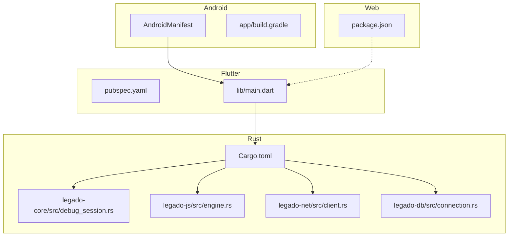
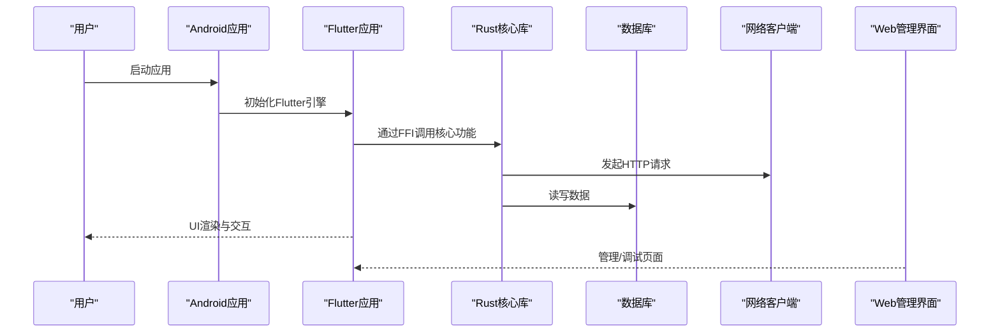
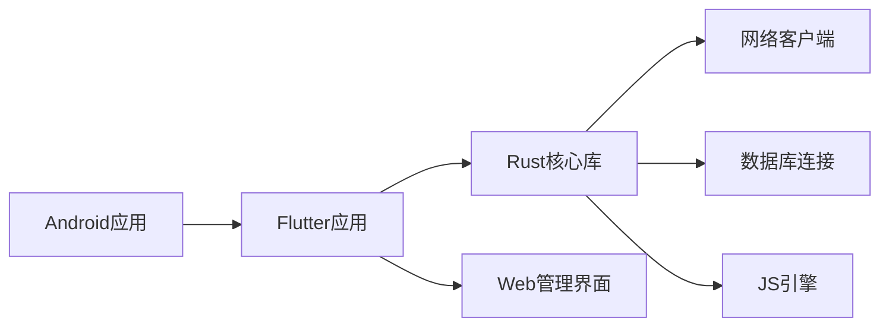

# 调试工具与技巧

<cite>
**本文引用的文件**   
- [README.md](file://README.md)
- [app/src/main/AndroidManifest.xml](file://app/src/main/AndroidManifest.xml)
- [app/build.gradle](file://app/build.gradle)
- [flutter_legado/pubspec.yaml](file://flutter_legado/pubspec.yaml)
- [flutter_legado/lib/main.dart](file://flutter_legado/lib/main.dart)
- [modules/web/package.json](file://modules/web/package.json)
- [rust/Cargo.toml](file://rust/Cargo.toml)
- [rust/legado-core/src/debug_session.rs](file://rust/legado-core/src/debug_session.rs)
- [rust/legado-js/src/engine.rs](file://rust/legado-js/src/engine.rs)
- [rust/legado-net/src/client.rs](file://rust/legado-net/src/client.rs)
- [rust/legado-db/src/connection.rs](file://rust/legado-db/src/connection.rs)
- [app/src/androidTest/java/io.legado.app/HttpTest.kt](file://app/src/androidTest/java/io.legado.app/HttpTest.kt)
- [app/src/test/java/io.legado.app/model/JsEngineCapabilitiesTest.kt](file://app/src/test/java/io.legado.app/model/JsEngineCapabilitiesTest.kt)
</cite>

## 目录
1. [简介](#简介)
2. [项目结构](#项目结构)
3. [核心组件](#核心组件)
4. [架构总览](#架构总览)
5. [详细组件分析](#详细组件分析)
6. [依赖关系分析](#依赖关系分析)
7. [性能考量](#性能考量)
8. [故障排查指南](#故障排查指南)
9. [结论](#结论)
10. [附录](#附录)

## 简介
本指南面向Legado项目的开发者与维护者，系统介绍跨端（Android、Flutter、Rust、Web）的调试工具与方法。内容覆盖：
- Android Studio调试、Flutter DevTools、Rust调试器（gdb/lldb）、网络抓包（Charles/Fiddler）、数据库调试
- JavaScript引擎调试、WebView调试、音视频调试、网络调试
- 远程调试、热重载、断点调试、变量监视等高级技巧
- 调试环境搭建与配置、实际调试案例与问题排查流程

## 项目结构
Legado采用多模块、多语言混合架构：
- Android应用层（Kotlin/Java）
- Flutter前端（Dart）
- Rust核心库（FFI桥接）
- Web管理界面（Vue/TS）
- 数据库与迁移（SQLite + migrations）

图表来源
- [app/src/main/AndroidManifest.xml](file://app/src/main/AndroidManifest.xml)
- [app/build.gradle](file://app/build.gradle)
- [flutter_legado/pubspec.yaml](file://flutter_legado/pubspec.yaml)
- [flutter_legado/lib/main.dart](file://flutter_legado/lib/main.dart)
- [rust/Cargo.toml](file://rust/Cargo.toml)
- [modules/web/package.json](file://modules/web/package.json)

章节来源
- [README.md](file://README.md)

## 核心组件
- Android应用入口与构建配置：用于启用调试符号、日志级别、签名与ProGuard规则
- Flutter应用入口：用于DevTools集成、热重载、性能面板
- Rust核心库：提供调试会话、JS引擎、网络客户端、数据库连接等关键能力
- Web管理界面：用于源码编辑与调试辅助

章节来源
- [app/build.gradle](file://app/build.gradle)
- [flutter_legado/lib/main.dart](file://flutter_legado/lib/main.dart)
- [rust/Cargo.toml](file://rust/Cargo.toml)
- [modules/web/package.json](file://modules/web/package.json)

## 架构总览
下图展示从Android到Flutter、再到Rust核心与Web管理界面的调用链与调试切入点。

图表来源
- [flutter_legado/lib/main.dart](file://flutter_legado/lib/main.dart)
- [rust/legado-net/src/client.rs](file://rust/legado-net/src/client.rs)
- [rust/legado-db/src/connection.rs](file://rust/legado-db/src/connection.rs)

## 详细组件分析

### Android调试
- 使用Android Studio进行断点调试、内存/CPU分析、布局检查
- 开启Logcat过滤关键字，结合ADB查看设备日志
- 使用Network Profiler或Charles/Fiddler进行HTTPS抓包（需安装信任证书）
- 在AndroidManifest中确认调试权限与网络访问声明

章节来源
- [app/src/main/AndroidManifest.xml](file://app/src/main/AndroidManifest.xml)

### Flutter调试
- 使用Flutter DevTools进行性能分析、Widget树检查、内存快照
- 启用热重载与热重启提升开发效率
- 使用print/log输出关键路径信息，结合DevTools控制台

章节来源
- [flutter_legado/lib/main.dart](file://flutter_legado/lib/main.dart)
- [flutter_legado/pubspec.yaml](file://flutter_legado/pubspec.yaml)

### Rust调试
- 使用cargo build --release/--debug生成二进制，配合lldb/gdb设置断点
- 在核心模块中添加结构化日志，便于定位问题
- 针对FFI边界，确保类型对齐与生命周期正确性

章节来源
- [rust/Cargo.toml](file://rust/Cargo.toml)
- [rust/legado-core/src/debug_session.rs](file://rust/legado-core/src/debug_session.rs)

### JavaScript引擎调试
- 使用Rhino引擎时，可通过日志与异常堆栈定位脚本错误
- 在测试用例中验证引擎能力与兼容性

章节来源
- [app/src/test/java/io.legado.app/model/JsEngineCapabilitiesTest.kt](file://app/src/test/java/io.legado.app/model/JsEngineCapabilitiesTest.kt)
- [rust/legado-js/src/engine.rs](file://rust/legado-js/src/engine.rs)

### WebView调试
- 启用Chrome DevTools远程调试，检查DOM、网络请求与Console输出
- 使用代理工具拦截并修改响应体，验证解析逻辑

章节来源
- [modules/web/package.json](file://modules/web/package.json)

### 网络调试
- 使用Charles/Fiddler进行抓包，注意HTTPS证书配置
- 在Rust网络客户端中增加重试与超时策略，便于观察失败场景

章节来源
- [rust/legado-net/src/client.rs](file://rust/legado-net/src/client.rs)
- [app/src/androidTest/java/io.legado.app/HttpTest.kt](file://app/src/androidTest/java/io.legado.app/HttpTest.kt)

### 数据库调试
- 使用SQLite浏览器或ADB shell直接查询数据库文件
- 检查migrations脚本与schema一致性

章节来源
- [rust/legado-db/src/connection.rs](file://rust/legado-db/src/connection.rs)

### 音视频调试
- 使用MediaSession与播放器状态监听，结合日志分析播放链路
- 在Android上使用Media Debug工具检查音频焦点与解码状态

章节来源
- [rust/legado-core/src/debug_session.rs](file://rust/legado-core/src/debug_session.rs)

## 依赖关系分析
下图展示各模块间的依赖与调试切入点。

图表来源
- [app/build.gradle](file://app/build.gradle)
- [flutter_legado/pubspec.yaml](file://flutter_legado/pubspec.yaml)
- [rust/Cargo.toml](file://rust/Cargo.toml)
- [modules/web/package.json](file://modules/web/package.json)

章节来源
- [app/build.gradle](file://app/build.gradle)
- [flutter_legado/pubspec.yaml](file://flutter_legado/pubspec.yaml)
- [rust/Cargo.toml](file://rust/Cargo.toml)
- [modules/web/package.json](file://modules/web/package.json)

## 性能考量
- 避免在主线程执行耗时操作，使用协程或后台任务
- 合理设置网络超时与重试策略，减少阻塞
- 使用Profiling工具识别热点代码与内存泄漏
- 对大数据集进行分页与缓存优化

## 故障排查指南
- 网络问题：检查代理与证书，确认DNS与SSL配置，抓取报文分析响应码
- 数据库问题：核对schema版本与migration脚本，检查事务与锁竞争
- JS脚本错误：查看异常堆栈与上下文变量，逐步缩小范围
- 音视频问题：检查媒体格式与解码器支持，确认音频焦点与播放状态
- 崩溃分析：收集堆栈与日志，复现步骤与环境信息

章节来源
- [rust/legado-net/src/client.rs](file://rust/legado-net/src/client.rs)
- [rust/legado-db/src/connection.rs](file://rust/legado-db/src/connection.rs)
- [rust/legado-js/src/engine.rs](file://rust/legado-js/src/engine.rs)

## 结论
通过系统化使用Android Studio、Flutter DevTools、Rust调试器与网络抓包工具，结合合理的日志与测试用例，可高效定位并解决跨端问题。建议建立统一的调试规范与文档，提升团队协作效率。

## 附录
- 常用命令与快捷键：列出Android Studio、Flutter CLI、Rust cargo的常用调试命令
- 环境准备清单：JDK、Android SDK、Flutter SDK、Rust Toolchain、Node.js
- 参考链接：官方文档与社区资源