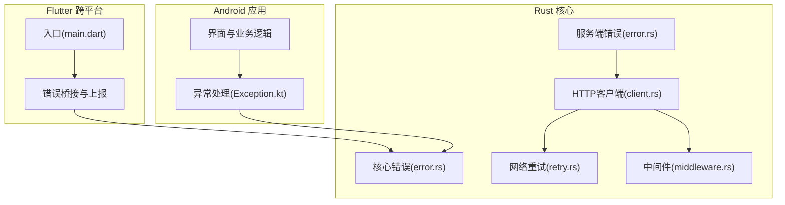
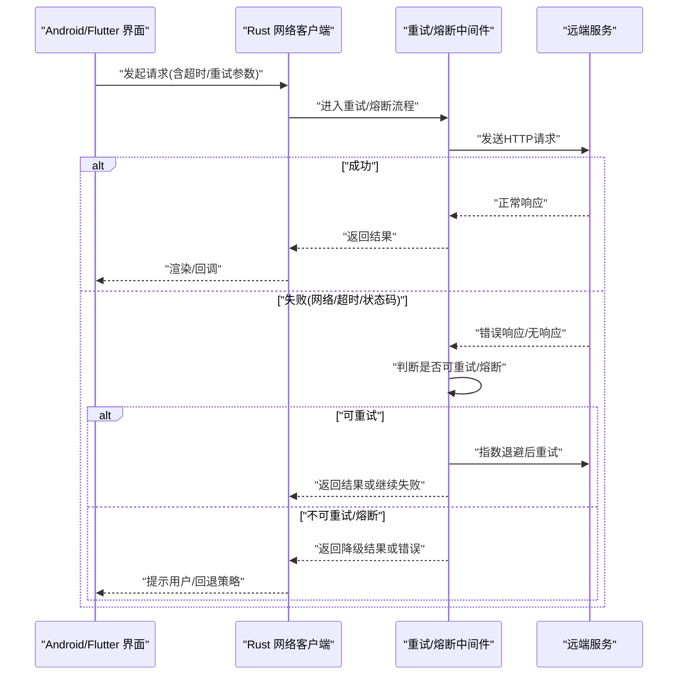
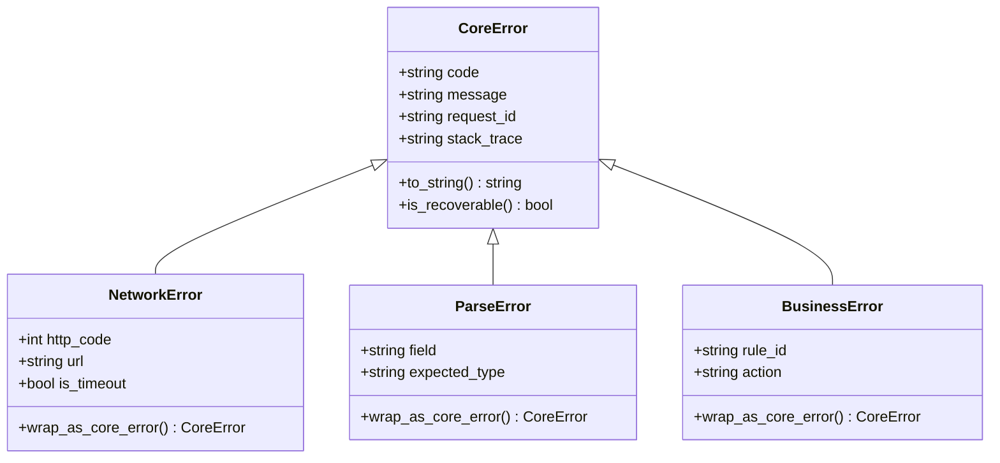
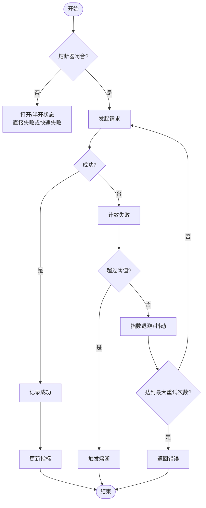
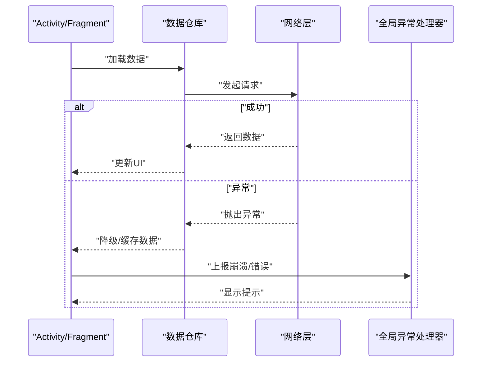
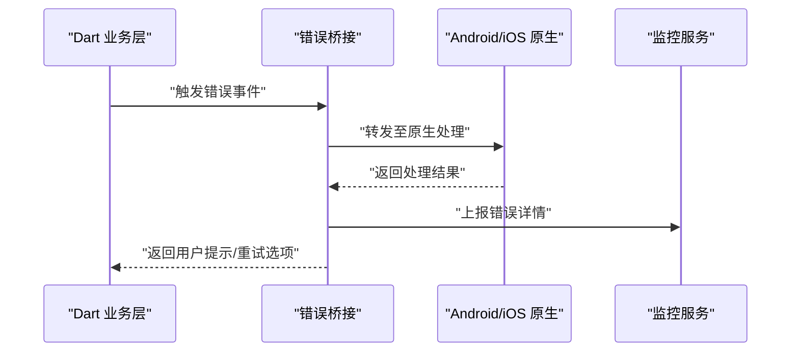
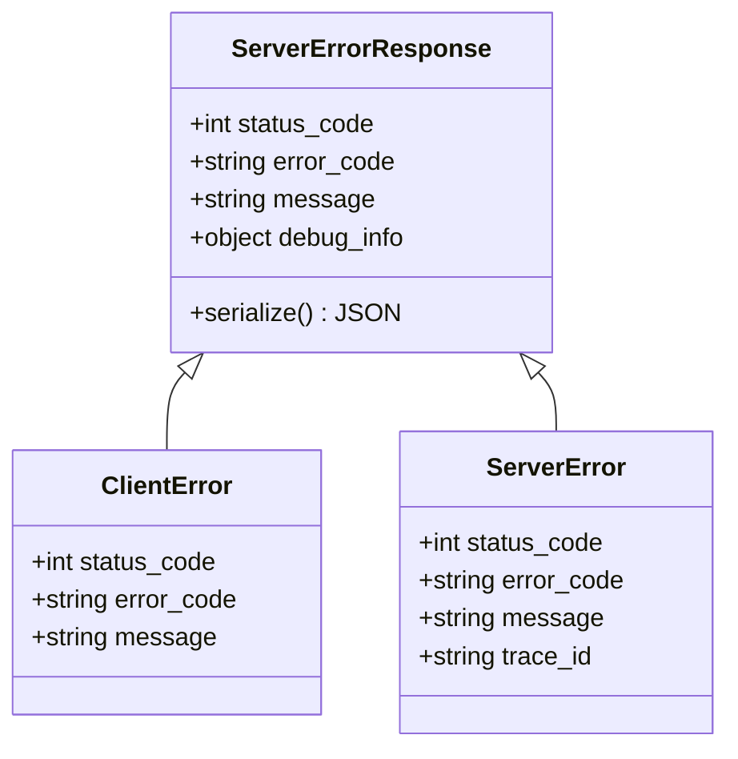
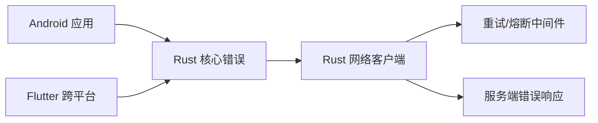

# 错误处理与恢复

<cite>
**本文引用的文件**   
- [rust/legado-core/src/error.rs](file://rust/legado-core/src/error.rs)
- [rust/legado-net/src/retry.rs](file://rust/legado-net/src/retry.rs)
- [rust/legado-net/src/client.rs](file://rust/legado-net/src/client.rs)
- [rust/legado-net/src/middleware.rs](file://rust/legado-net/src/middleware.rs)
- [rust/legado-server/src/error.rs](file://rust/legado-server/src/error.rs)
- [app/src/main/java/io/legado/app/exception/Exception.kt](file://app/src/main/java/io/legado/app/exception/Exception.kt)
- [flutter_legado/lib/src/main.dart](file://flutter_legado/lib/src/main.dart)
</cite>

## 目录
1. [简介](#简介)
2. [项目结构](#项目结构)
3. [核心组件](#核心组件)
4. [架构总览](#架构总览)
5. [详细组件分析](#详细组件分析)
6. [依赖关系分析](#依赖关系分析)
7. [性能考量](#性能考量)
8. [故障排查指南](#故障排查指南)
9. [结论](#结论)
10. [附录](#附录)

## 简介
本文件面向Legado项目的错误处理与恢复机制，覆盖Rust核心库的错误类型定义、Android应用的异常处理、Flutter跨平台错误处理、网络请求重试与熔断降级策略、数据一致性保证以及监控告警配置方法。目标是帮助开发者快速定位问题、统一错误分类、提升系统健壮性与可观测性。

## 项目结构
本项目采用多语言、多模块架构：
- Rust核心库（legado-core/net/server等）提供稳定的错误模型、网络层重试与中间件、服务端错误响应。
- Android应用（Kotlin）负责UI交互与本地异常捕获、日志上报。
- Flutter跨端（Dart）承担跨平台界面与错误桥接。
- Web管理端（Vue/TS）用于调试与运维。

**图示来源** 
- [app/src/main/java/io/legado/app/exception/Exception.kt](file://app/src/main/java/io/legado/app/exception/Exception.kt)
- [flutter_legado/lib/src/main.dart](file://flutter_legado/lib/src/main.dart)
- [rust/legado-core/src/error.rs](file://rust/legado-core/src/error.rs)
- [rust/legado-net/src/retry.rs](file://rust/legado-net/src/retry.rs)
- [rust/legado-net/src/client.rs](file://rust/legado-net/src/client.rs)
- [rust/legado-net/src/middleware.rs](file://rust/legado-net/src/middleware.rs)
- [rust/legado-server/src/error.rs](file://rust/legado-server/src/error.rs)

**章节来源**
- [app/src/main/java/io/legado/app/exception/Exception.kt](file://app/src/main/java/io/legado/app/exception/Exception.kt)
- [flutter_legado/lib/src/main.dart](file://flutter_legado/lib/src/main.dart)
- [rust/legado-core/src/error.rs](file://rust/legado-core/src/error.rs)
- [rust/legado-net/src/retry.rs](file://rust/legado-net/src/retry.rs)
- [rust/legado-net/src/client.rs](file://rust/legado-net/src/client.rs)
- [rust/legado-net/src/middleware.rs](file://rust/legado-net/src/middleware.rs)
- [rust/legado-server/src/error.rs](file://rust/legado-server/src/error.rs)

## 核心组件
- Rust核心错误模型：集中定义领域错误类型、错误码与上下文信息，便于跨模块传递与统一处理。
- 网络层重试与中间件：封装指数退避、抖动、熔断与限流，确保外部依赖不稳定时的自愈能力。
- Android异常处理：统一捕获未捕获异常、网络异常、IO异常，并转换为用户可见提示与上报。
- Flutter错误桥接：在跨平台侧聚合错误事件，转发至原生或后端服务进行持久化与告警。
- 服务端错误响应：标准化HTTP错误码、消息体结构与调试信息，便于前端与移动端解析。

**章节来源**
- [rust/legado-core/src/error.rs](file://rust/legado-core/src/error.rs)
- [rust/legado-net/src/retry.rs](file://rust/legado-net/src/retry.rs)
- [rust/legado-net/src/client.rs](file://rust/legado-net/src/client.rs)
- [rust/legado-net/src/middleware.rs](file://rust/legado-net/src/middleware.rs)
- [app/src/main/java/io/legado/app/exception/Exception.kt](file://app/src/main/java/io/legado/app/exception/Exception.kt)
- [flutter_legado/lib/src/main.dart](file://flutter_legado/lib/src/main.dart)
- [rust/legado-server/src/error.rs](file://rust/legado-server/src/error.rs)

## 架构总览
下图展示从上层到核心的错误流转路径：Android/Flutter发起请求，经Rust网络层执行，遇到错误时通过重试/熔断/降级策略恢复；最终由上层呈现给用户并上报监控。

**图示来源** 
- [rust/legado-net/src/client.rs](file://rust/legado-net/src/client.rs)
- [rust/legado-net/src/retry.rs](file://rust/legado-net/src/retry.rs)
- [rust/legado-net/src/middleware.rs](file://rust/legado-net/src/middleware.rs)

## 详细组件分析

### Rust核心错误模型
- 设计要点
  - 统一的错误枚举与上下文字段，包含错误码、消息、堆栈与关联ID。
  - 分层错误类型：网络错误、解析错误、IO错误、业务错误，避免混用。
  - 错误转换与包装：在各层边界处将底层错误转换为领域错误，保留原始原因。
- 复杂度与性能
  - 错误对象轻量级构造，避免频繁分配；必要时使用引用传递。
  - 堆栈采集按需启用，生产环境关闭以提升性能。
- 最佳实践
  - 明确区分“可恢复”与“不可恢复”错误，驱动重试与熔断决策。
  - 为关键路径添加错误上下文（如请求ID、源URL、规则ID）。

**图示来源** 
- [rust/legado-core/src/error.rs](file://rust/legado-core/src/error.rs)

**章节来源**
- [rust/legado-core/src/error.rs](file://rust/legado-core/src/error.rs)

### 网络请求重试与熔断
- 设计要点
  - 指数退避+随机抖动，避免雪崩。
  - 熔断器基于失败率/慢调用比例阈值，自动开关。
  - 限流器保护下游服务，防止过载。
- 流程图

**图示来源** 
- [rust/legado-net/src/retry.rs](file://rust/legado-net/src/retry.rs)
- [rust/legado-net/src/middleware.rs](file://rust/legado-net/src/middleware.rs)

**章节来源**
- [rust/legado-net/src/retry.rs](file://rust/legado-net/src/retry.rs)
- [rust/legado-net/src/middleware.rs](file://rust/legado-net/src/middleware.rs)

### Android应用异常处理
- 设计要点
  - 全局未捕获异常拦截，收集崩溃信息与上下文。
  - 网络异常统一映射为业务错误，避免UI层感知底层细节。
  - IO与数据库异常隔离，提供降级与缓存读取。
- 处理策略
  - 用户可见错误：友好提示与引导操作。
  - 不可见错误：后台上报与静默重试。
  - 关键路径：事务回滚与数据一致性保障。

**图示来源** 
- [app/src/main/java/io/legado/app/exception/Exception.kt](file://app/src/main/java/io/legado/app/exception/Exception.kt)

**章节来源**
- [app/src/main/java/io/legado/app/exception/Exception.kt](file://app/src/main/java/io/legado/app/exception/Exception.kt)

### Flutter跨平台错误处理
- 设计要点
  - 统一错误事件管道，聚合来自原生与网络层的错误。
  - 支持错误去重、采样上报与分级告警。
  - 与Android/iOS桥接，复用原生错误模型。
- 处理策略
  - 用户态错误：即时反馈与重试按钮。
  - 系统态错误：后台重试与自动恢复。
  - 监控集成：上报至后端或第三方平台。

**图示来源** 
- [flutter_legado/lib/src/main.dart](file://flutter_legado/lib/src/main.dart)

**章节来源**
- [flutter_legado/lib/src/main.dart](file://flutter_legado/lib/src/main.dart)

### 服务端错误响应
- 设计要点
  - 标准化HTTP错误码与JSON结构，包含错误码、消息、调试信息。
  - 区分客户端错误与服务端错误，便于前端差异化处理。
  - 敏感信息脱敏，避免泄露内部实现。
- 最佳实践
  - 错误码全局唯一，版本化管理。
  - 提供错误查询接口，便于运维定位。

**图示来源** 
- [rust/legado-server/src/error.rs](file://rust/legado-server/src/error.rs)

**章节来源**
- [rust/legado-server/src/error.rs](file://rust/legado-server/src/error.rs)

## 依赖关系分析
- 耦合度
  - 网络层依赖重试/熔断中间件，形成横向切面。
  - Android/Flutter依赖Rust核心错误模型，保持跨层一致。
- 循环依赖
  - 通过接口抽象与错误类型解耦，避免循环导入。
- 外部依赖
  - HTTP客户端、日志框架、监控SDK等，需配置超时与重试策略。

**图示来源** 
- [rust/legado-core/src/error.rs](file://rust/legado-core/src/error.rs)
- [rust/legado-net/src/client.rs](file://rust/legado-net/src/client.rs)
- [rust/legado-net/src/retry.rs](file://rust/legado-net/src/retry.rs)
- [rust/legado-server/src/error.rs](file://rust/legado-server/src/error.rs)

**章节来源**
- [rust/legado-core/src/error.rs](file://rust/legado-core/src/error.rs)
- [rust/legado-net/src/client.rs](file://rust/legado-net/src/client.rs)
- [rust/legado-net/src/retry.rs](file://rust/legado-net/src/retry.rs)
- [rust/legado-server/src/error.rs](file://rust/legado-server/src/error.rs)

## 性能考量
- 错误对象构造开销：避免在热路径频繁创建大对象，使用池化或引用。
- 堆栈采集开关：生产环境关闭，开发环境开启以辅助调试。
- 重试策略调优：根据网络质量动态调整退避时间与最大重试次数。
- 熔断阈值设置：基于历史成功率与延迟分位数动态计算。

## 故障排查指南
- 常见问题
  - 网络超时：检查超时配置与服务器负载。
  - 熔断触发：查看失败率与慢调用比例。
  - 解析错误：验证数据结构与版本兼容性。
- 排查步骤
  - 收集错误上下文（请求ID、时间戳、设备信息）。
  - 查看重试与熔断日志，确认策略生效。
  - 复现问题并对比不同环境行为。
- 工具建议
  - 使用结构化日志与分布式追踪。
  - 集成APM与错误监控平台。

## 结论
Legado项目在错误处理与恢复方面采用了分层设计、统一错误模型与智能重试/熔断策略，有效提升了系统在复杂网络环境与外部依赖不稳定情况下的健壮性。通过Android/Flutter的异常捕获与上报机制，结合Rust核心库的稳定实现，形成了端到端的错误治理闭环。建议持续优化错误分类、监控告警与自动化恢复能力，进一步提升用户体验与系统可靠性。

## 附录
- 错误分类建议
  - 网络错误：超时、连接失败、SSL错误。
  - 解析错误：JSON/XML格式错误、字段缺失。
  - 业务错误：权限不足、资源不存在、规则不匹配。
  - 系统错误：内存不足、磁盘满、权限拒绝。
- 监控告警配置
  - 错误率阈值：超过5%触发告警。
  - 慢调用比例：超过10%触发熔断。
  - 关键路径错误：立即通知并自动回滚。
- 最佳实践
  - 错误信息对用户友好，对开发者详细。
  - 重试与熔断策略可配置、可观察、可调整。
  - 数据一致性优先，必要时牺牲可用性。