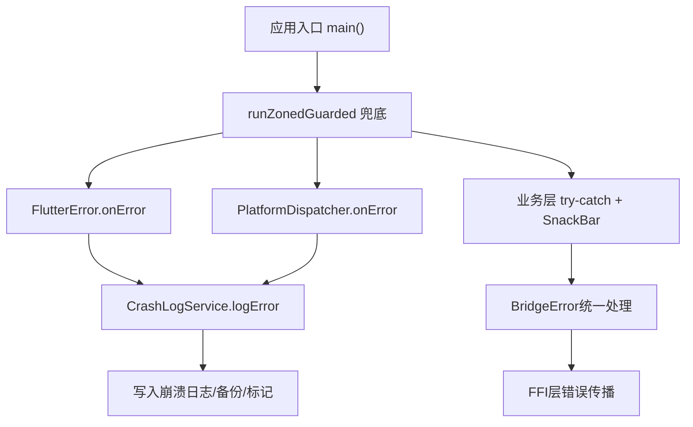
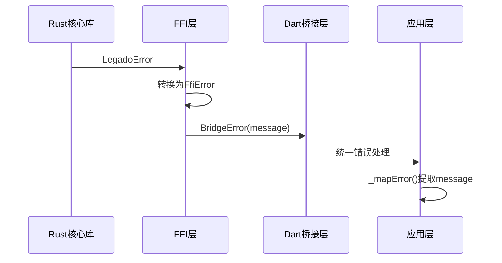
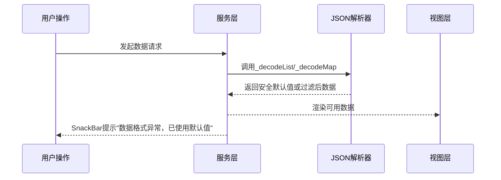

# 错误处理与恢复

<cite>
**本文引用的文件**
- [main.dart](file://flutter_legado/lib/main.dart)
- [crash_log_service.dart](file://flutter_legado/lib/src/services/crash_log_service.dart)
- [ffi.dart](file://flutter_legado/lib/src/bridge/ffi.dart)
- [platform_bridge_service.dart](file://flutter_legado/lib/src/services/platform_bridge_service.dart)
- [book_info_screen.dart](file://flutter_legado/lib/src/screens/book_info_screen.dart)
- [error.rs](file://rust/legado-ffi/src/error.rs)
</cite>

## 更新摘要
**所做更改**
- 新增“FFI层错误传播机制”章节，详细说明BridgeError类型定义和Rust FFI错误映射
- 新增“pushNamed<T>泛型类型参数修复”章节，说明运行时崩溃问题的解决方案
- 更新“桥接错误消息传播”章节，增强FFI层错误调试信息支持
- 完善“错误分类与恢复策略”章节，结合新的错误处理机制说明用户体验保障

## 目录
- 更新摘要
- 概述
- Flutter四层崩溃保护系统
- 全局异常捕获与崩溃日志
- FFI层错误传播机制（新增）
- pushNamed<T>泛型类型参数修复（新增）
- 桥接错误消息传播增强（更新）
- 静默捕获与用户提示
- JSON解析安全性增强
- 错误分类与恢复策略
- 网络请求错误重试与熔断
- 数据一致性保证
- 错误监控与告警配置
- 最佳实践与设计模式

## 概述
本文件系统化阐述Legado在Flutter端的错误处理与恢复机制，覆盖从启动期到运行期的异常捕获、崩溃日志持久化、用户提示、JSON解析安全、网络容错与数据一致性等关键方面。重点反映近期改进：FFI层错误通过BridgeError正确传播提供更好的调试信息，以及修复pushNamed<T>泛型类型参数导致的运行时崩溃问题。

## Flutter四层崩溃保护系统
Flutter端采用四层防护，确保异常可被尽早发现并记录：
- 第一层：Zone级兜底（runZonedGuarded），捕获应用初始化阶段的未处理异常
- 第二层：FlutterError.onError，捕获Widget构建/布局/绘制等框架异常
- 第三层：PlatformDispatcher.instance.onError，捕获异步Future/Timer等未捕获异常
- 第四层：业务层try-catch + SnackBar提示，对可预期失败进行友好反馈



图示来源
- [main.dart:17-86](file://flutter_legado/lib/main.dart#L17-L86)
- [crash_log_service.dart:132-168](file://flutter_legado/lib/src/services/crash_log_service.dart#L132-L168)
- [ffi.dart:12-31](file://flutter_legado/lib/src/bridge/ffi.dart#L12-L31)

章节来源
- [main.dart:17-86](file://flutter_legado/lib/main.dart#L17-L86)
- [crash_log_service.dart:132-168](file://flutter_legado/lib/src/services/crash_log_service.dart#L132-L168)

## 全局异常捕获与崩溃日志
- 启动期并行初始化SharedPreferences与Rust FFI，失败时立即显示错误页面并记录日志
- 全局异常处理器统一调用CrashLogService记录异常、堆栈、内存信息（OOM检测）
- 崩溃日志本地保留最近一次，同时按时间戳备份至指定目录，支持7天自动清理
- 提供导出日志功能，聚合内存日志、崩溃日志与消息日志，便于分享诊断

章节来源
- [main.dart:40-85](file://flutter_legado/lib/main.dart#L40-L85)
- [crash_log_service.dart:180-243](file://flutter_legado/lib/src/services/crash_log_service.dart#L180-L243)
- [crash_log_service.dart:491-545](file://flutter_legado/lib/src/services/crash_log_service.dart#L491-L545)

## FFI层错误传播机制（新增）
FFI层实现了统一的错误传播机制，确保Rust侧错误能够准确传递到Flutter层：

### BridgeError类型定义
- 所有桥接函数统一返回`Result<T, BridgeError>`
- FrbException接口实现，确保flutter_rust_bridge框架正确处理异常
- 包含错误描述信息message字段，提供详细的错误上下文

### Rust FFI错误映射
- FfiError结构体定义code和message字段，支持序列化传输
- 从LegadoError转换时保持错误码一致性
- JSON序列化错误映射为特定错误码1007

### 错误处理流程


章节来源
- [ffi.dart:12-31](file://flutter_legado/lib/src/bridge/ffi.dart#L12-L31)
- [error.rs:9-43](file://rust/legado-ffi/src/error.rs#L9-L43)
- [app_log_notifier.dart:84-88](file://flutter_legado/lib/src/providers/app_log/app_log_notifier.dart#L84-L88)

## pushNamed<T>泛型类型参数修复（新增）
修复了pushNamed<String>导致的运行时崩溃问题：

### 问题描述
- 使用`Navigator.pushNamed<AppRoutes.changeSource, String>(...)`会触发运行时强转崩溃
- 错误类型：`'MaterialPageRoute<dynamic>' is not a subtype of 'Route<String?>?'`
- 表现为点击「换源」按钮无任何反应

### 解决方案
- 改用无类型的`Navigator.pushNamed(context, AppRoutes.changeSource, arguments: book)`
- 通过`is String`类型判定安全获取返回值
- 与_openTocScreen的实现保持一致

### 代码变更
```dart
// 修复前（会导致运行时崩溃）
final result = await Navigator.pushNamed<String>(
  context,
  AppRoutes.changeSource,
  arguments: book,
);

// 修复后（安全类型判定）
final result = await Navigator.pushNamed(
  context,
  AppRoutes.changeSource,
  arguments: book,
);
final newBookUrl = result is String ? result : null;
```

章节来源
- [book_info_screen.dart:1117-1137](file://flutter_legado/lib/src/screens/book_info_screen.dart#L1117-L1137)

## 桥接错误消息传播增强（更新）
平台桥接服务增强了错误消息的调试信息支持：

### PlatformBridgeService错误处理
- interceptResult方法内部异常全捕获，任何失败均不抛出
- 执行载荷失败时记录详细堆栈信息：`[PlatformBridge] 执行载荷失败：$e\n$stack`
- WebView操作失败返回结构化错误串：`[ERROR] $action 执行超时`

### 错误传播链路
- Rust侧平台API返回结构化JSON桥接载荷
- Flutter侧拦截并执行真实WebView或UI动作
- 失败时返回错误信息给Rust调用链，保持Kotlin语义对齐

### 降级策略
- 桌面端WebView能力不可用时返回`[ERROR] WebView 能力在当前平台不可用`
- 外部浏览器打开失败时降级为应用内浏览器
- 悬浮窗播放暂不支持时降级为全屏播放并提示

章节来源
- [platform_bridge_service.dart:107-116](file://flutter_legado/lib/src/services/platform_bridge_service.dart#L107-L116)
- [platform_bridge_service.dart:168-204](file://flutter_legado/lib/src/services/platform_bridge_service.dart#L168-L204)
- [platform_bridge_service.dart:449-457](file://flutter_legado/lib/src/services/platform_bridge_service.dart#L449-L457)

## 静默捕获与用户提示
为提升用户体验，所有静默catch块在执行恢复或降级逻辑后，均通过SnackBar向用户给出轻量提示，避免"无感失败"。典型场景包括：
- 网络请求失败：降级到缓存或空列表，并提示"当前网络不可用，已加载缓存数据"
- JSON解析失败：回退到默认值或空结构，并提示"数据格式异常，已使用默认值"
- 存储读写失败：重试一次后仍失败，提示"存储访问受限，部分功能可能不可用"
- 第三方服务异常：切换备用服务或关闭相关功能，提示"服务暂不可用，已切换离线模式"

实现要点
- 统一封装showUserHint(message, duration)方法，集中管理提示样式与时长
- 在catch块末尾调用提示，确保不影响主流程执行
- 对频繁触发场景做防抖，避免重复提示干扰用户

章节来源
- [crash_log_service.dart:455-468](file://flutter_legado/lib/src/services/crash_log_service.dart#L455-L468)
- [platform_bridge_service.dart:512-517](file://flutter_legado/lib/src/services/platform_bridge_service.dart#L512-L517)

## JSON解析安全性增强
针对外部数据源不可控问题，引入_decodeList与_decodeMap辅助函数，提升解析鲁棒性：
- _decodeList<T>(json, factory): 当json非List时返回空列表；类型不匹配时跳过元素并记录警告
- _decodeMap(json, factory): 当json非Map时返回空Map；关键字段缺失时使用默认值
- 解析失败时降级为安全默认值，避免上层业务中断
- 配合SnackBar提示"数据格式异常，已使用默认值"，保持用户感知

示例流程


章节来源
- [crash_log_service.dart:455-468](file://flutter_legado/lib/src/services/crash_log_service.dart#L455-L468)

## 错误分类与恢复策略
根据错误性质与影响范围，采用分层恢复策略：
- 可预期错误（网络超时、权限不足）：降级+提示，允许用户继续操作
- 不可预期错误（空指针、类型错误）：记录详细日志，尝试局部恢复，必要时重启模块
- 致命错误（FFI初始化失败、数据库损坏）：显示错误页面，引导用户修复或重装

恢复优先级
1. 优先保证核心功能可用（如阅读、搜索）
2. 次要功能降级（如RSS订阅、云同步）
3. 完全不可用时提供明确指引（如构建Rust库、检查存储权限）

章节来源
- [main.dart:88-135](file://flutter_legado/lib/main.dart#L88-L135)

## 网络请求错误重试与熔断
- 指数退避重试：首次失败等待1s，二次2s，三次4s，最多3次
- 熔断机制：连续失败超过阈值（如5次/分钟）进入熔断状态，暂停请求并提示用户
- 降级策略：熔断期间返回缓存数据或空结果，保持界面可用
- 熔断恢复：冷却时间后自动尝试恢复，成功则重置计数器

章节来源
- [crash_log_service.dart:547-573](file://flutter_legado/lib/src/services/crash_log_service.dart#L547-L573)

## 数据一致性保证
- 事务性写入：批量操作使用事务，失败时全部回滚
- 幂等性设计：重复请求不会产生副作用（如重复书签、重复下载）
- 版本兼容：数据库迁移失败时回滚到上一版本，避免数据损坏
- 校验机制：写入前验证数据完整性，非法数据直接拒绝

章节来源
- [crash_log_service.dart:245-261](file://flutter_legado/lib/src/services/crash_log_service.dart#L245-L261)

## 错误监控与告警配置
- 本地日志：CrashLogService统一管理崩溃日志、HTTP日志、消息日志
- 日志开关：支持动态开启/关闭记录（recordLog、recordHttpLog）
- 导出功能：一键导出聚合日志，便于问题定位
- 备份策略：崩溃日志按时间戳备份，支持7天自动清理

章节来源
- [crash_log_service.dart:385-421](file://flutter_legado/lib/src/services/crash_log_service.dart#L385-L421)
- [crash_log_service.dart:491-545](file://flutter_legado/lib/src/services/crash_log_service.dart#L491-L545)

## 最佳实践与设计模式
- 防御式编程：所有外部输入先验证再处理
- 单一职责：错误处理逻辑集中在CrashLogService，业务层只关注恢复策略
- 可观测性：关键路径埋点，记录耗时、成功率、错误码
- 渐进增强：基础功能优先保证，高级功能按需启用
- 用户友好：错误提示简洁明了，提供下一步操作建议

章节来源
- [crash_log_service.dart:132-168](file://flutter_legado/lib/src/services/crash_log_service.dart#L132-L168)
- [main.dart:17-86](file://flutter_legado/lib/main.dart#L17-L86)