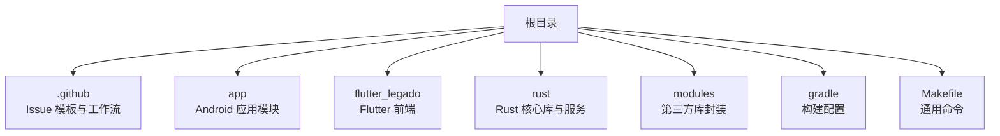
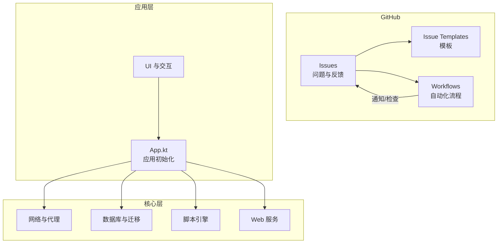
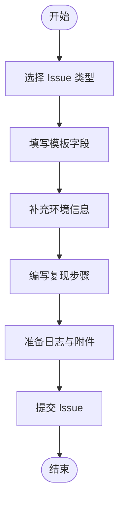
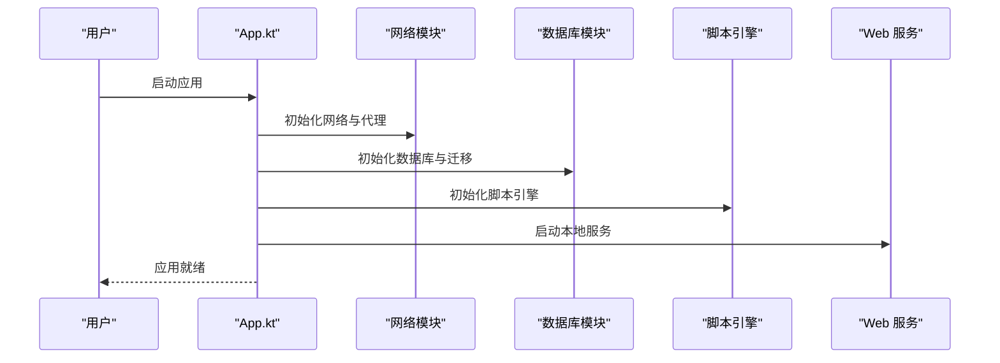
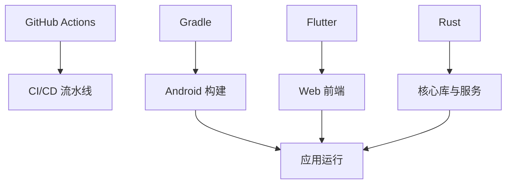

# 问题报告与反馈

<cite>
**本文档引用的文件**   
- [README.md](file://README.md)
- [.github/ISSUE_TEMPLATE](file://.github/ISSUE_TEMPLATE)
- [.github/workflows](file://.github/workflows)
- [app/src/main/java/io/legado/app/App.kt](file://app/src/main/java/io/legado/app/App.kt)
- [app/src/main/assets/disclaimer.md](file://app/src/main/assets/disclaimer.md)
- [app/src/main/assets/privacyPolicy.md](file://app/src/main/assets/privacyPolicy.md)
- [flutter_legado/README.md](file://flutter_legado/README.md)
- [rust/DEVELOPMENT.md](file://rust/DEVELOPMENT.md)
</cite>

## 目录
1. [简介](#简介)
2. [项目结构](#项目结构)
3. [核心组件](#核心组件)
4. [架构总览](#架构总览)
5. [详细组件分析](#详细组件分析)
6. [依赖分析](#依赖分析)
7. [性能注意事项](#性能注意事项)
8. [故障排查指南](#故障排查指南)
9. [结论](#结论)
10. [附录](#附录)

## 简介
本指南面向用户与贡献者，旨在帮助你高效、准确地提交问题报告与反馈，确保开发者能够快速定位并解决问题。内容涵盖：
- 如何准备高质量的问题描述与环境信息
- 复现步骤的编写规范
- 日志与附件的准备方法
- GitHub Issues 的使用方法与标签规范
- 不同类型问题的报告格式（Bug、功能请求、性能问题、安全问题等）
- 问题跟踪流程与响应时间说明
- 社区贡献指南与反馈渠道

请在使用应用遇到问题或希望提出改进建议时，参考本指南准备材料并提交至 GitHub Issues。

## 项目结构
Legado 是一个跨平台阅读与资源管理应用，包含 Android 原生模块、Flutter 前端、Rust 核心库以及 Web 管理界面。仓库根目录下的 .github 目录包含 Issue 模板与工作流配置，是问题报告与自动化流程的关键入口。

**图表来源** 
- [README.md:1-200](file://README.md#L1-L200)
- [.github/ISSUE_TEMPLATE](file://.github/ISSUE_TEMPLATE)
- [.github/workflows](file://.github/workflows)

**章节来源**
- [README.md:1-200](file://README.md#L1-L200)

## 核心组件
- 问题报告入口
  - GitHub Issues：用于提交 Bug、功能请求、性能与安全类问题
  - Issue 模板：位于 .github/ISSUE_TEMPLATE，提供标准化表单，帮助收集必要信息
- 应用启动与初始化
  - App.kt：应用主入口，负责初始化关键子系统（网络、数据库、JS 引擎等），有助于在报告中定位环境差异
- 文档与合规
  - disclaimer.md、privacyPolicy.md：法律声明与隐私政策，涉及数据收集与使用范围，影响日志与反馈内容的边界

**章节来源**
- [.github/ISSUE_TEMPLATE](file://.github/ISSUE_TEMPLATE)
- [app/src/main/java/io/legado/app/App.kt](file://app/src/main/java/io/legado/app/App.kt)
- [app/src/main/assets/disclaimer.md](file://app/src/main/assets/disclaimer.md)
- [app/src/main/assets/privacyPolicy.md](file://app/src/main/assets/privacyPolicy.md)

## 架构总览
下图展示 Legado 的整体架构与问题报告相关的工作流。用户在 GitHub 上创建 Issue 后，工作流可能触发自动化检查；应用侧通过 App 初始化各子系统，便于在问题中描述环境与行为。

**图表来源** 
- [.github/ISSUE_TEMPLATE](file://.github/ISSUE_TEMPLATE)
- [.github/workflows](file://.github/workflows)
- [app/src/main/java/io/legado/app/App.kt](file://app/src/main/java/io/legado/app/App.kt)

## 详细组件分析

### 问题报告入口与模板
- 使用 GitHub Issues 提交问题
  - 选择对应模板（如 Bug、功能请求、性能问题、安全问题等）
  - 按模板要求填写标题、环境信息、复现步骤、期望与实际结果、日志与附件
- 模板位置
  - .github/ISSUE_TEMPLATE：存放各类模板，确保信息完整一致

**图表来源** 
- [.github/ISSUE_TEMPLATE](file://.github/ISSUE_TEMPLATE)

**章节来源**
- [.github/ISSUE_TEMPLATE](file://.github/ISSUE_TEMPLATE)

### 应用初始化与环境信息
- App.kt 负责应用启动时的关键初始化，包括网络、数据库、脚本引擎等
- 在问题报告中，建议提供以下环境信息：
  - 设备型号与系统版本
  - 应用版本与构建类型（稳定版/测试版）
  - 网络环境（代理、DNS、证书设置）
  - 数据库状态（是否进行过迁移或导入）
  - 脚本引擎版本与自定义规则

**图表来源** 
- [app/src/main/java/io/legado/app/App.kt](file://app/src/main/java/io/legado/app/App.kt)

**章节来源**
- [app/src/main/java/io/legado/app/App.kt](file://app/src/main/java/io/legado/app/App.kt)

### 合规与隐私边界
- disclaimer.md 与 privacyPolicy.md 定义了数据收集与使用范围
- 在提交日志与反馈时，避免包含敏感个人信息
- 如需上传日志，请确认不包含账号、密码、密钥等敏感内容

**章节来源**
- [app/src/main/assets/disclaimer.md](file://app/src/main/assets/disclaimer.md)
- [app/src/main/assets/privacyPolicy.md](file://app/src/main/assets/privacyPolicy.md)

### Flutter 前端与 Rust 核心
- flutter_legado/README.md：Flutter 前端项目的说明与构建指引
- rust/DEVELOPMENT.md：Rust 核心库的开发与调试说明
- 当问题涉及跨端交互或核心逻辑时，可参考上述文档补充环境信息与复现步骤

**章节来源**
- [flutter_legado/README.md](file://flutter_legado/README.md)
- [rust/DEVELOPMENT.md](file://rust/DEVELOPMENT.md)

## 依赖分析
- 外部依赖与集成点
  - GitHub Actions：用于自动化检查与发布流程
  - Gradle：Android 构建与依赖管理
  - Flutter：跨平台前端构建
  - Rust：高性能核心库与服务器
- 问题报告时应明确涉及的依赖版本与配置，以便复现与定位

**图表来源** 
- [.github/workflows](file://.github/workflows)
- [README.md:1-200](file://README.md#L1-L200)

**章节来源**
- [.github/workflows](file://.github/workflows)
- [README.md:1-200](file://README.md#L1-L200)

## 性能注意事项
- 性能问题报告应包含：
  - 具体场景与操作步骤
  - 设备性能指标（CPU、内存、磁盘 IO）
  - 网络延迟与带宽情况
  - 日志中的耗时统计与错误堆栈
- 建议在稳定网络与最小化扩展环境下复现，排除干扰因素

[本节为通用指导，不直接分析具体文件]

## 故障排查指南
- 常见问题分类与处理建议
  - 崩溃与异常：提供崩溃日志、堆栈信息、最近操作序列
  - 加载失败：检查网络代理、证书、DNS 与目标站点可达性
  - 数据不一致：核对数据库迁移记录与导入源
  - 脚本执行错误：提供脚本内容与引擎版本
- 日志收集要点
  - 开启详细日志级别
  - 过滤无关输出，保留关键路径
  - 脱敏敏感信息后再上传

**章节来源**
- [app/src/main/java/io/legado/app/App.kt](file://app/src/main/java/io/legado/app/App.kt)
- [app/src/main/assets/disclaimer.md](file://app/src/main/assets/disclaimer.md)
- [app/src/main/assets/privacyPolicy.md](file://app/src/main/assets/privacyPolicy.md)

## 结论
通过遵循本指南，你可以提交高质量的问题报告与反馈，帮助开发者快速定位与解决问题。请在提交前仔细检查环境信息、复现步骤与日志完整性，并遵守合规与隐私要求。

[本节为总结性内容，不直接分析具体文件]

## 附录
- 标签规范建议
  - bug：功能缺陷或异常行为
  - feature-request：新功能或改进建议
  - performance：性能相关问题
  - security：安全漏洞或风险
  - documentation：文档错误或改进
  - question：使用咨询与疑问
- 问题跟踪流程
  - 提交 Issue → 自动检查（如有）→ 维护者审核与标注 → 复现与讨论 → 修复与验证 → 关闭或继续跟踪
- 反馈渠道
  - GitHub Issues：主要渠道
  - 社区讨论区：技术讨论与经验分享
  - 邮件或论坛：特定场景的沟通方式（如有）

[本节为通用指导，不直接分析具体文件]