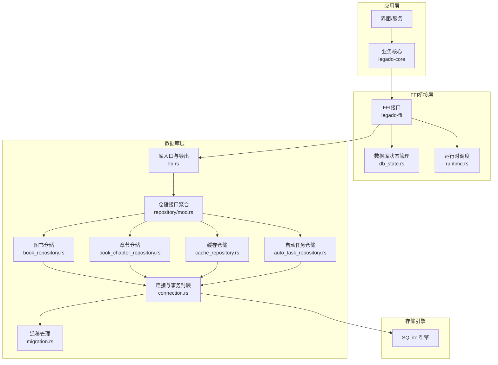
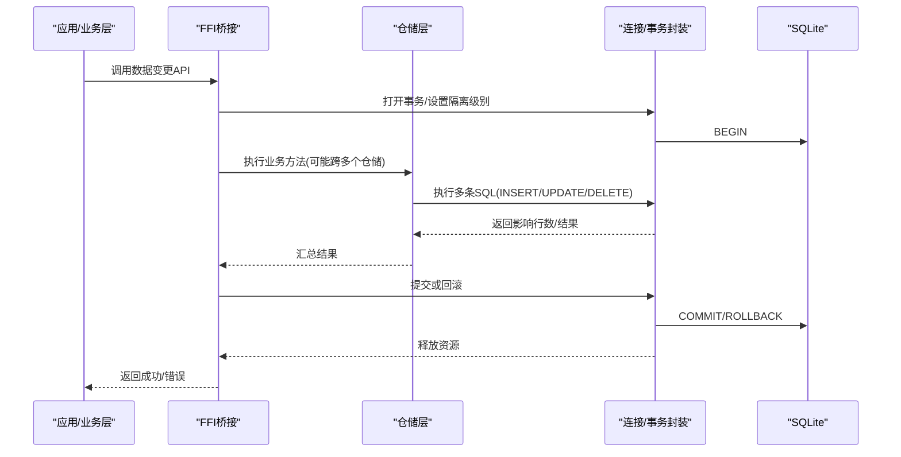
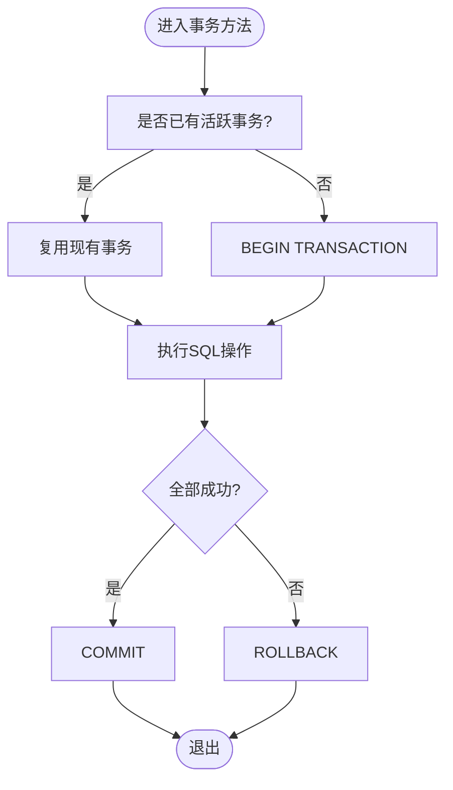
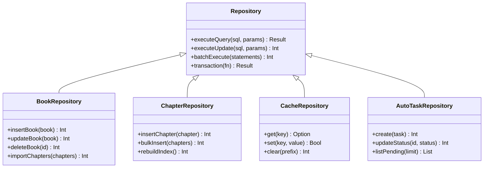
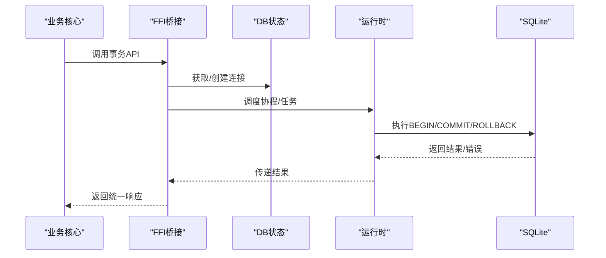
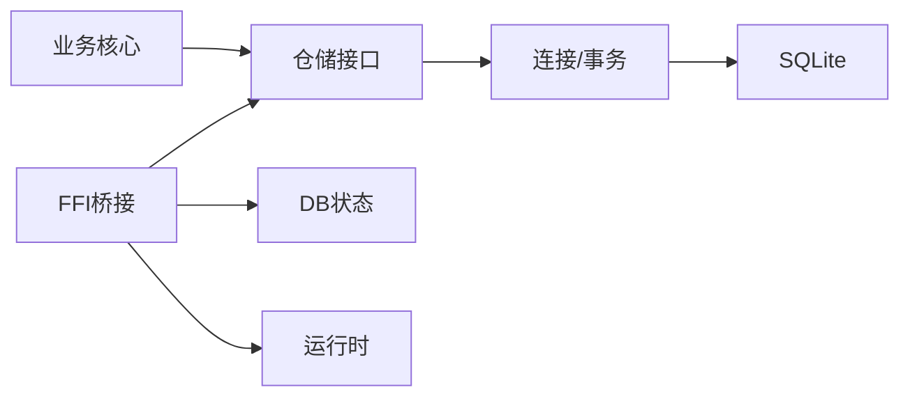

# 事务控制

<cite>
**本文引用的文件**   
- [lib.rs](file://rust/legado-db/src/lib.rs)
- [connection.rs](file://rust/legado-db/src/connection.rs)
- [migration.rs](file://rust/legado-db/src/migration.rs)
- [repository/mod.rs](file://rust/legado-db/src/repository/mod.rs)
- [book_repository.rs](file://rust/legado-db/src/repository/book_repository.rs)
- [book_chapter_repository.rs](file://rust/legado-db/src/repository/book_chapter_repository.rs)
- [cache_repository.rs](file://rust/legado-db/src/repository/cache_repository.rs)
- [auto_task_repository.rs](file://rust/legado-db/src/repository/auto_task_repository.rs)
- [db_state.rs](file://rust/legado-ffi/src/db_state.rs)
- [runtime.rs](file://rust/legado-ffi/src/runtime.rs)
- [bridge.rs](file://rust/legado-ffi/src/bridge.rs)
- [error.rs](file://rust/legado-ffi/src/error.rs)
- [read_aloud.rs](file://rust/legado-core/src/read_aloud.rs)
- [download_manager.rs](file://rust/legado-core/src/download_manager.rs)
- [auto_task.rs](file://rust/legado-core/src/auto_task.rs)
</cite>

## 目录
1. [简介](#简介)
2. [项目结构](#项目结构)
3. [核心组件](#核心组件)
4. [架构总览](#架构总览)
5. [详细组件分析](#详细组件分析)
6. [依赖关系分析](#依赖关系分析)
7. [性能考量](#性能考量)
8. [故障排查指南](#故障排查指南)
9. [结论](#结论)
10. [附录](#附录)

## 简介
本文件面向Legado项目中与数据库事务控制相关的实现，重点覆盖SQLite事务机制、读写分离策略、锁粒度控制、异步事务处理、事务边界设计以及监控调试工具。文档基于仓库中Rust侧的数据库层（legado-db）、FFI桥接（legado-ffi）与核心业务模块（legado-core）进行梳理，帮助读者理解从上层调用到底层SQLite的事务生命周期、并发控制与性能优化要点。

## 项目结构
本项目在Rust侧将数据库能力拆分为多个模块：
- legado-db：封装SQLite连接、迁移、仓储接口与具体仓储实现，提供事务化数据访问能力。
- legado-ffi：对外暴露FFI接口，管理数据库状态、运行时上下文与错误传播。
- legado-core：业务逻辑层，使用仓储接口完成读/写操作，并通过协程/任务调度驱动异步事务。

图表来源 
- [lib.rs](file://rust/legado-db/src/lib.rs)
- [connection.rs](file://rust/legado-db/src/connection.rs)
- [migration.rs](file://rust/legado-db/src/migration.rs)
- [repository/mod.rs](file://rust/legado-db/src/repository/mod.rs)
- [book_repository.rs](file://rust/legado-db/src/repository/book_repository.rs)
- [book_chapter_repository.rs](file://rust/legado-db/src/repository/book_chapter_repository.rs)
- [cache_repository.rs](file://rust/legado-db/src/repository/cache_repository.rs)
- [auto_task_repository.rs](file://rust/legado-db/src/repository/auto_task_repository.rs)
- [db_state.rs](file://rust/legado-ffi/src/db_state.rs)
- [runtime.rs](file://rust/legado-ffi/src/runtime.rs)
- [bridge.rs](file://rust/legado-ffi/src/bridge.rs)

章节来源
- [lib.rs](file://rust/legado-db/src/lib.rs)
- [connection.rs](file://rust/legado-db/src/connection.rs)
- [migration.rs](file://rust/legado-db/src/migration.rs)
- [repository/mod.rs](file://rust/legado-db/src/repository/mod.rs)

## 核心组件
- 连接与事务封装（connection.rs）：负责SQLite连接的获取、事务开启/提交/回滚、语句执行与结果映射。通常以RAII或显式作用域保证事务边界清晰。
- 仓储接口与实现（repository/*）：按领域划分仓储，统一抽象CRUD与批量操作，内部通过连接层发起事务性SQL。
- 迁移管理（migration.rs）：确保数据库版本演进的一致性，通常在应用启动时执行，必要时包裹在事务中以保障原子性。
- FFI与状态管理（legado-ffi）：对外暴露稳定的C/FFI接口，集中管理数据库句柄、线程/协程上下文、错误码与日志。
- 业务核心（legado-core）：协调多仓储协作，组织跨表/跨实体的复合事务，结合协程与任务队列实现异步批处理。

章节来源
- [connection.rs](file://rust/legado-db/src/connection.rs)
- [repository/mod.rs](file://rust/legado-db/src/repository/mod.rs)
- [migration.rs](file://rust/legado-db/src/migration.rs)
- [db_state.rs](file://rust/legado-ffi/src/db_state.rs)
- [runtime.rs](file://rust/legado-ffi/src/runtime.rs)
- [bridge.rs](file://rust/legado-ffi/src/bridge.rs)

## 架构总览
下图展示从上层调用到SQLite的事务路径，包括FFI桥接、仓储层、连接层与引擎交互。

图表来源 
- [bridge.rs](file://rust/legado-ffi/src/bridge.rs)
- [db_state.rs](file://rust/legado-ffi/src/db_state.rs)
- [runtime.rs](file://rust/legado-ffi/src/runtime.rs)
- [repository/mod.rs](file://rust/legado-db/src/repository/mod.rs)
- [connection.rs](file://rust/legado-db/src/connection.rs)

## 详细组件分析

### 连接与事务封装（connection.rs）
- 职责：封装SQLite连接生命周期、事务边界、语句准备与绑定、结果集遍历与错误转换。
- 事务模式：
  - 显式BEGIN/COMMIT/ROLLBACK：在函数作用域内开启事务，异常时自动回滚，正常结束提交。
  - 只读事务：对纯查询场景使用只读事务降低锁竞争。
  - 批量写入：合并多条DML为单次事务，减少磁盘同步开销。
- 隔离级别：根据场景选择READ UNCOMMITTED/READ COMMITTED/REPEATABLE READ/SERIALIZABLE（SQLite默认行为与PRAGMA配置）。
- 锁粒度：尽量限定更新范围，避免长事务持有行级锁；必要时退化为表级锁（谨慎使用）。

图表来源 
- [connection.rs](file://rust/legado-db/src/connection.rs)

章节来源
- [connection.rs](file://rust/legado-db/src/connection.rs)

### 仓储层（repository/*）
- repository/mod.rs：聚合各仓储接口，定义统一的CRUD与批量操作契约，便于事务编排。
- book_repository.rs / book_chapter_repository.rs：图书与章节数据的增删改查，典型包含批量导入、索引重建、统计更新等需要事务的场景。
- cache_repository.rs：缓存数据的快速存取，适合短事务、高并发读。
- auto_task_repository.rs：自动任务的状态流转与调度记录，常涉及状态机更新，需严格事务一致性。

图表来源 
- [repository/mod.rs](file://rust/legado-db/src/repository/mod.rs)
- [book_repository.rs](file://rust/legado-db/src/repository/book_repository.rs)
- [book_chapter_repository.rs](file://rust/legado-db/src/repository/book_chapter_repository.rs)
- [cache_repository.rs](file://rust/legado-db/src/repository/cache_repository.rs)
- [auto_task_repository.rs](file://rust/legado-db/src/repository/auto_task_repository.rs)

章节来源
- [repository/mod.rs](file://rust/legado-db/src/repository/mod.rs)
- [book_repository.rs](file://rust/legado-db/src/repository/book_repository.rs)
- [book_chapter_repository.rs](file://rust/legado-db/src/repository/book_chapter_repository.rs)
- [cache_repository.rs](file://rust/legado-db/src/repository/cache_repository.rs)
- [auto_task_repository.rs](file://rust/legado-db/src/repository/auto_task_repository.rs)

### FFI与状态管理（legado-ffi）
- db_state.rs：维护数据库连接池/句柄、当前事务上下文、线程安全访问策略。
- runtime.rs：协程/任务调度器集成，确保事务在正确的执行上下文中运行，避免跨线程共享连接导致的竞态。
- bridge.rs：对外暴露稳定接口，统一参数校验、错误码映射与日志输出。
- error.rs：定义错误类型与传播规则，便于上层捕获并做回滚决策。

图表来源 
- [bridge.rs](file://rust/legado-ffi/src/bridge.rs)
- [db_state.rs](file://rust/legado-ffi/src/db_state.rs)
- [runtime.rs](file://rust/legado-ffi/src/runtime.rs)
- [error.rs](file://rust/legado-ffi/src/error.rs)

章节来源
- [db_state.rs](file://rust/legado-ffi/src/db_state.rs)
- [runtime.rs](file://rust/legado-ffi/src/runtime.rs)
- [bridge.rs](file://rust/legado-ffi/src/bridge.rs)
- [error.rs](file://rust/legado-ffi/src/error.rs)

### 迁移管理（migration.rs）
- 职责：按版本号顺序执行DDL/DML脚本，支持增量升级与回滚策略。
- 事务化迁移：关键迁移步骤可包裹在事务中，确保部分失败不污染数据库状态。
- 幂等性：迁移脚本应具备幂等特性，避免重复执行导致异常。

章节来源
- [migration.rs](file://rust/legado-db/src/migration.rs)

### 业务核心中的事务编排（legado-core）
- read_aloud.rs：播放进度、书签、阅读统计等写入需与读取保持一致，适合短事务+只读优化。
- download_manager.rs：下载任务状态、分片记录、缓存清理等批量操作，适合批事务+重试。
- auto_task.rs：任务调度、状态机流转、执行日志，强一致要求，需严格事务边界。

章节来源
- [read_aloud.rs](file://rust/legado-core/src/read_aloud.rs)
- [download_manager.rs](file://rust/legado-core/src/download_manager.rs)
- [auto_task.rs](file://rust/legado-core/src/auto_task.rs)

## 依赖关系分析
- 耦合度：仓储层对连接层强依赖；FFI对状态与运行时依赖；业务核心对仓储抽象依赖，松耦合。
- 循环依赖：仓储之间应避免直接相互调用，通过业务核心编排。
- 外部依赖：SQLite引擎、FFI绑定、协程运行时。

图表来源 
- [repository/mod.rs](file://rust/legado-db/src/repository/mod.rs)
- [connection.rs](file://rust/legado-db/src/connection.rs)
- [db_state.rs](file://rust/legado-ffi/src/db_state.rs)
- [runtime.rs](file://rust/legado-ffi/src/runtime.rs)

章节来源
- [repository/mod.rs](file://rust/legado-db/src/repository/mod.rs)
- [connection.rs](file://rust/legado-db/src/connection.rs)
- [db_state.rs](file://rust/legado-ffi/src/db_state.rs)
- [runtime.rs](file://rust/legado-ffi/src/runtime.rs)

## 性能考量
- 事务粒度：尽量缩小事务范围，避免长事务持有锁；批量写入合并为单事务。
- 隔离级别：读多写少场景使用只读事务；写冲突频繁时考虑提高隔离级别或引入乐观锁。
- 索引与查询：为高频查询建立合适索引，避免全表扫描；分页查询使用游标或键集分页。
- 连接复用：避免频繁创建/销毁连接，使用连接池或单例连接（线程安全前提下）。
- WAL模式：启用WAL提升并发读性能，注意检查点策略与磁盘IO。
- 慢查询日志：开启SQLite PRAGMA并配合应用日志，定位热点SQL。
- 锁等待分析：监控锁等待链，识别阻塞源，必要时拆分事务或调整SQL。

[本节为通用指导，不直接分析具体文件]

## 故障排查指南
- 常见错误：
  - 数据库被锁定：检查是否存在长事务或未提交的写操作；确认只读事务是否正确设置。
  - 死锁：分析锁等待图，缩短事务，避免交叉锁顺序。
  - 迁移失败：回滚至上一版本，检查脚本幂等性与依赖顺序。
- 调试工具：
  - 慢查询日志：记录耗时超过阈值的SQL，结合索引优化。
  - 锁等待分析：打印锁持有者与等待者，定位阻塞链。
  - 性能统计：统计事务次数、平均耗时、失败率，观察趋势。
- 错误传播：
  - FFI层统一错误码，便于上层区分网络、权限、数据完整性等问题。
  - 业务层捕获特定异常，触发补偿或回滚。

章节来源
- [error.rs](file://rust/legado-ffi/src/error.rs)
- [bridge.rs](file://rust/legado-ffi/src/bridge.rs)
- [db_state.rs](file://rust/legado-ffi/src/db_state.rs)

## 结论
Legado项目在数据库事务控制上采用分层设计：FFI桥接负责上下文与错误传播，仓储层抽象数据访问，连接层封装事务与SQL执行，SQLite作为底层引擎。通过合理的事务边界、隔离级别与锁粒度控制，结合异步编排与监控工具，可实现高可用、高性能的数据访问。建议持续优化慢查询、减少锁竞争、完善错误处理与回滚策略。

[本节为总结，不直接分析具体文件]

## 附录
- 事务设计模式：
  - 工作单元：将一组相关操作封装为单一事务，确保原子性。
  - 读写分离：读操作走只读事务，写操作走写事务，降低锁竞争。
  - 补偿事务：对于分布式或复杂流程，使用补偿操作回滚中间状态。
- 最佳实践：
  - 明确事务边界，避免UI线程执行长事务。
  - 使用批量插入/更新减少磁盘同步次数。
  - 为高频查询建立索引，定期分析执行计划。
  - 启用WAL与合适的PRAGMA配置，平衡一致性与性能。
  - 完善日志与监控，及时发现性能瓶颈与异常。

[本节为概念性内容，不直接分析具体文件]