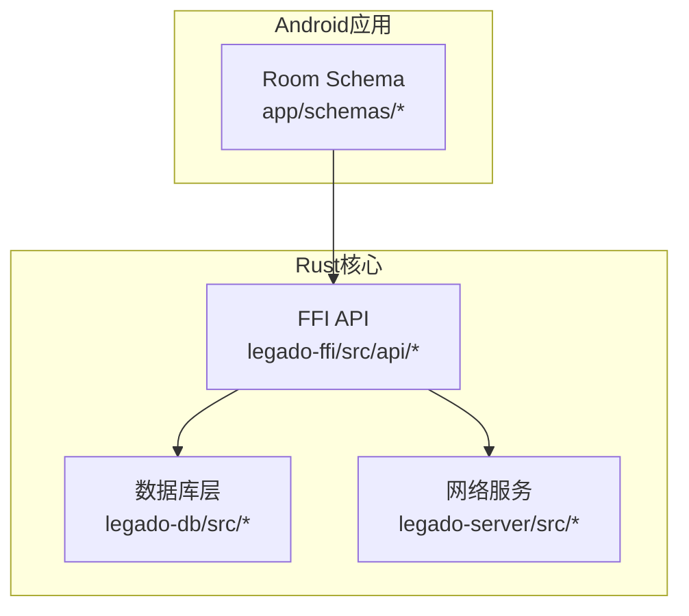
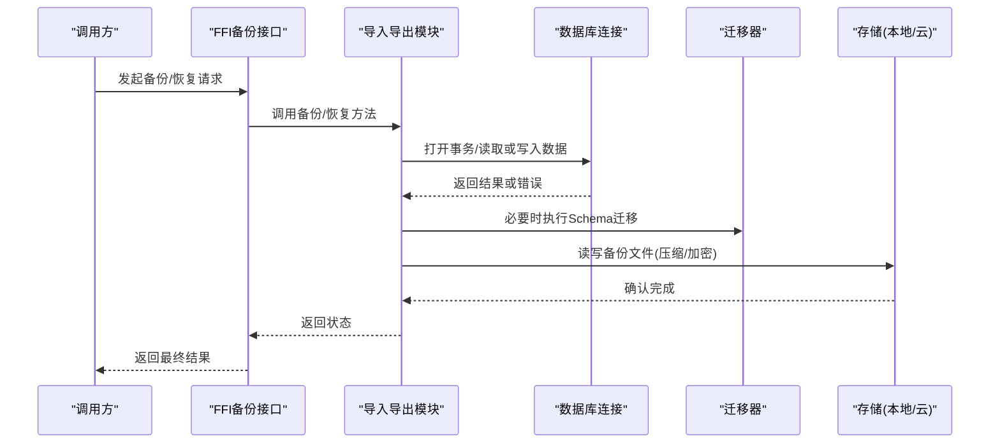
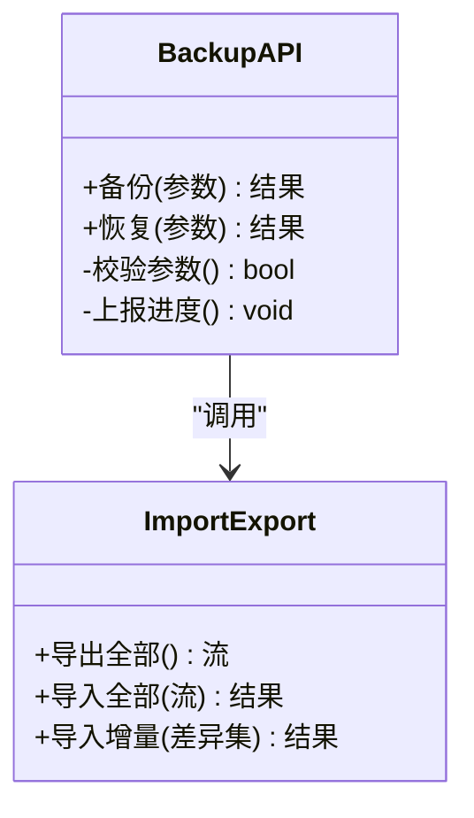
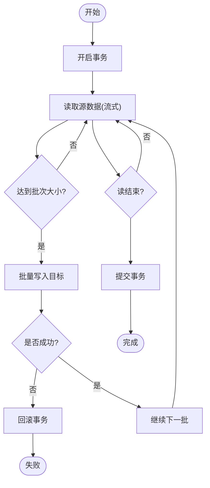
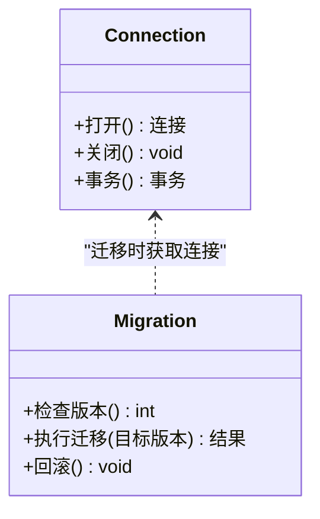
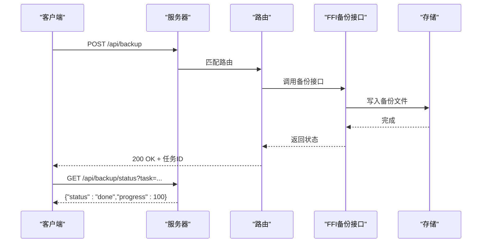
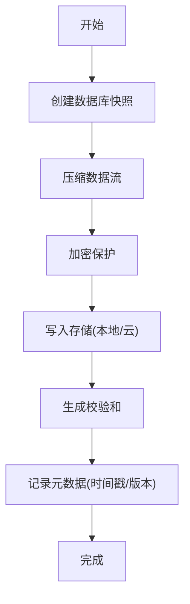
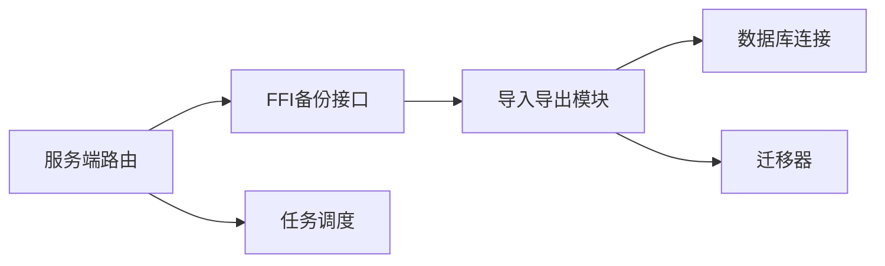

# 备份恢复

<cite>
**本文引用的文件**   
- [backup_api.rs](file://rust/legado-ffi/src/api/backup_api.rs)
- [book_import.rs](file://rust/legado-ffi/src/api/book_import.rs)
- [book_export.rs](file://rust/legado-ffi/src/api/book_export.rs)
- [import.rs](file://rust/legado-db/src/import.rs)
- [lib.rs](file://rust/legado-db/src/lib.rs)
- [connection.rs](file://rust/legado-db/src/connection.rs)
- [schema.rs](file://rust/legado-db/src/schema.rs)
- [migration.rs](file://rust/legado-db/src/migration.rs)
- [migrations.rs](file://rust/legado-db/src/migration/migrations.rs)
- [database schema 1.json](file://app/schemas/io.legado.app.data.AppDatabase/1.json)
- [database schema 95.json](file://app/schemas/io.legado.app.data.AppDatabase/95.json)
- [server.rs](file://rust/legado-server/src/server.rs)
- [routes.rs](file://rust/legado-server/src/routes.rs)
- [handlers/mod.rs](file://rust/legado-server/src/handlers/mod.rs)
</cite>

## 目录
1. [简介](#简介)
2. [项目结构](#项目结构)
3. [核心组件](#核心组件)
4. [架构总览](#架构总览)
5. [详细组件分析](#详细组件分析)
6. [依赖关系分析](#依赖关系分析)
7. [性能考量](#性能考量)
8. [故障排查指南](#故障排查指南)
9. [结论](#结论)
10. [附录](#附录)

## 简介
本文件面向Legado项目的数据库备份与恢复能力，系统性阐述完整备份机制（快照、压缩、加密）、增量同步策略（变更检测、差异传输、冲突解决）、导入导出功能（格式支持、批量操作、进度跟踪）、数据一致性保证（事务完整性、校验和验证、损坏检测）、存储策略（本地、云、网络）以及操作指南（命令行、API、自动化脚本），并给出故障恢复流程与灾难恢复预案。文档同时提供架构图与流程图，帮助读者快速理解实现要点与最佳实践。

## 项目结构
本项目采用多模块架构：Android应用层、Flutter跨平台界面、Rust核心库（含FFI桥接、数据库访问、网络服务）。备份恢复相关能力主要集中在Rust层的FFI API、数据库导入导出模块与服务端路由中；Android侧通过Room维护数据库Schema版本演进。

**图表来源** 
- [database schema 1.json](file://app/schemas/io.legado.app.data.AppDatabase/1.json)
- [database schema 95.json](file://app/schemas/io.legado.app.data.AppDatabase/95.json)
- [backup_api.rs](file://rust/legado-ffi/src/api/backup_api.rs)
- [import.rs](file://rust/legado-db/src/import.rs)
- [server.rs](file://rust/legado-server/src/server.rs)

**章节来源**
- [backup_api.rs](file://rust/legado-ffi/src/api/backup_api.rs)
- [import.rs](file://rust/legado-db/src/import.rs)
- [lib.rs](file://rust/legado-db/src/lib.rs)
- [connection.rs](file://rust/legado-db/src/connection.rs)
- [schema.rs](file://rust/legado-db/src/schema.rs)
- [migration.rs](file://rust/legado-db/src/migration.rs)
- [migrations.rs](file://rust/legado-db/src/migration/migrations.rs)
- [database schema 1.json](file://app/schemas/io.legado.app.data.AppDatabase/1.json)
- [database schema 95.json](file://app/schemas/io.legado.app.data.AppDatabase/95.json)
- [server.rs](file://rust/legado-server/src/server.rs)
- [routes.rs](file://rust/legado-server/src/routes.rs)

## 核心组件
- FFI备份接口：对外暴露备份/恢复的函数入口，供上层调用或Web服务端使用。
- 数据库导入导出：封装SQLite导入/导出逻辑，支持批量写入与流式处理。
- 连接与迁移：管理数据库连接、事务边界与Schema迁移，确保一致性。
- 服务端路由：将备份/恢复能力以HTTP API形式暴露，便于远程管理与自动化。

**章节来源**
- [backup_api.rs](file://rust/legado-ffi/src/api/backup_api.rs)
- [book_import.rs](file://rust/legado-ffi/src/api/book_import.rs)
- [book_export.rs](file://rust/legado-ffi/src/api/book_export.rs)
- [import.rs](file://rust/legado-db/src/import.rs)
- [lib.rs](file://rust/legado-db/src/lib.rs)
- [connection.rs](file://rust/legado-db/src/connection.rs)
- [schema.rs](file://rust/legado-db/src/schema.rs)
- [migration.rs](file://rust/legado-db/src/migration.rs)
- [migrations.rs](file://rust/legado-db/src/migration/migrations.rs)

## 架构总览
下图展示了从调用方到数据库层的备份/恢复主流程，包括FFI入口、导入导出、连接与迁移、以及可选的网络传输路径。

**图表来源** 
- [backup_api.rs](file://rust/legado-ffi/src/api/backup_api.rs)
- [import.rs](file://rust/legado-db/src/import.rs)
- [connection.rs](file://rust/legado-db/src/connection.rs)
- [migration.rs](file://rust/legado-db/src/migration.rs)

## 详细组件分析

### 备份接口（FFI）
- 职责：统一对外暴露备份与恢复的函数签名，接收参数（如目标路径、选项），协调导入导出与存储。
- 关键点：参数校验、错误码映射、异步/并发控制（由上层决定）。

**图表来源** 
- [backup_api.rs](file://rust/legado-ffi/src/api/backup_api.rs)
- [book_import.rs](file://rust/legado-ffi/src/api/book_import.rs)
- [book_export.rs](file://rust/legado-ffi/src/api/book_export.rs)

**章节来源**
- [backup_api.rs](file://rust/legado-ffi/src/api/backup_api.rs)
- [book_import.rs](file://rust/legado-ffi/src/api/book_import.rs)
- [book_export.rs](file://rust/legado-ffi/src/api/book_export.rs)

### 导入导出模块
- 职责：对SQLite数据进行全量导出/导入，支持流式处理与批量写入，提升吞吐并降低内存占用。
- 关键点：事务边界控制、分批提交、错误回滚、进度回调。

**图表来源** 
- [import.rs](file://rust/legado-db/src/import.rs)
- [lib.rs](file://rust/legado-db/src/lib.rs)

**章节来源**
- [import.rs](file://rust/legado-db/src/import.rs)
- [lib.rs](file://rust/legado-db/src/lib.rs)

### 连接与迁移
- 职责：管理数据库连接生命周期、事务隔离级别、Schema版本检查与迁移执行。
- 关键点：连接池/单连接策略、迁移幂等性、失败回退。

**图表来源** 
- [connection.rs](file://rust/legado-db/src/connection.rs)
- [schema.rs](file://rust/legado-db/src/schema.rs)
- [migration.rs](file://rust/legado-db/src/migration.rs)
- [migrations.rs](file://rust/legado-db/src/migration/migrations.rs)

**章节来源**
- [connection.rs](file://rust/legado-db/src/connection.rs)
- [schema.rs](file://rust/legado-db/src/schema.rs)
- [migration.rs](file://rust/legado-db/src/migration.rs)
- [migrations.rs](file://rust/legado-db/src/migration/migrations.rs)

### 服务端路由（HTTP API）
- 职责：将备份/恢复能力以REST/WebSocket接口暴露，支持远程触发、进度推送与断点续传。
- 关键点：鉴权、限流、任务队列、状态查询。

**图表来源** 
- [server.rs](file://rust/legado-server/src/server.rs)
- [routes.rs](file://rust/legado-server/src/routes.rs)
- [handlers/mod.rs](file://rust/legado-server/src/handlers/mod.rs)
- [backup_api.rs](file://rust/legado-ffi/src/api/backup_api.rs)

**章节来源**
- [server.rs](file://rust/legado-server/src/server.rs)
- [routes.rs](file://rust/legado-server/src/routes.rs)
- [handlers/mod.rs](file://rust/legado-server/src/handlers/mod.rs)

### 概念性总览（非代码映射）
以下流程图展示“完整备份”的概念步骤，便于理解整体思路：快照创建、压缩、加密、落盘、校验。

[此图为概念流程，不直接映射具体源码文件]

## 依赖关系分析
- FFI层依赖导入导出模块与存储服务抽象。
- 导入导出模块依赖数据库连接与迁移器。
- 服务端路由依赖FFI接口与任务调度。

**图表来源** 
- [backup_api.rs](file://rust/legado-ffi/src/api/backup_api.rs)
- [import.rs](file://rust/legado-db/src/import.rs)
- [connection.rs](file://rust/legado-db/src/connection.rs)
- [migration.rs](file://rust/legado-db/src/migration.rs)
- [server.rs](file://rust/legado-server/src/server.rs)

**章节来源**
- [backup_api.rs](file://rust/legado-ffi/src/api/backup_api.rs)
- [import.rs](file://rust/legado-db/src/import.rs)
- [connection.rs](file://rust/legado-db/src/connection.rs)
- [migration.rs](file://rust/legado-db/src/migration.rs)
- [server.rs](file://rust/legado-server/src/server.rs)

## 性能考量
- 流式处理：导入导出采用流式读写，避免一次性加载大文件导致内存峰值。
- 批量写入：按批次提交事务，减少IO与锁竞争。
- 压缩与加密：在I/O线程中进行，避免阻塞主流程；可配置算法与并行度。
- 连接复用：合理设置连接池大小，避免频繁创建销毁连接。
- 进度反馈：通过回调或事件上报进度，便于前端展示与中断恢复。

[本节为通用指导，不直接分析具体文件]

## 故障排查指南
- 备份失败常见原因：磁盘空间不足、权限问题、加密密钥错误、压缩库不可用。
- 恢复失败常见原因：备份文件损坏、Schema版本不兼容、事务冲突、网络超时。
- 定位手段：查看任务日志、校验和比对、回滚至最近可用备份、逐步缩小范围复现。
- 恢复建议：优先尝试增量恢复，若失败再回退到全量备份；必要时重建索引与统计信息。

**章节来源**
- [backup_api.rs](file://rust/legado-ffi/src/api/backup_api.rs)
- [import.rs](file://rust/legado-db/src/import.rs)
- [connection.rs](file://rust/legado-db/src/connection.rs)
- [migration.rs](file://rust/legado-db/src/migration.rs)

## 结论
Legado的备份恢复体系以FFI为统一入口，结合流式导入导出、连接与迁移管理、以及服务端路由，形成可扩展、可观测、可运维的数据保护方案。通过合理的压缩与加密策略、事务与校验机制、以及完善的故障恢复流程，可在不同存储与网络环境下稳定运行。

[本节为总结，不直接分析具体文件]

## 附录

### 操作指南（示例）
- 命令行工具：通过调用FFI导出的CLI命令进行备份/恢复，支持指定目标路径、压缩级别、加密密码等参数。
- API接口：使用HTTP接口触发备份/恢复任务，查询任务状态与下载备份文件。
- 自动化脚本：结合定时任务与对象存储SDK，实现定期全量备份与增量同步。

[本节为通用说明，不直接分析具体文件]

### 数据一致性保证
- 事务完整性：导入导出过程严格使用事务，失败自动回滚。
- 校验和验证：备份文件生成校验和，恢复前进行校验，防止损坏数据入库。
- 损坏检测：扫描备份文件头部与关键块，识别异常并提示修复或重新备份。

[本节为通用说明，不直接分析具体文件]

### 备份存储策略
- 本地存储：直接写入设备文件系统，适合单机场景。
- 云存储：对接对象存储（如S3兼容），支持分片上传与断点续传。
- 网络传输：通过HTTP/HTTPS或WebDAV传输，支持鉴权与限速。

[本节为通用说明，不直接分析具体文件]

### 增量同步策略（概念）
- 变更检测：基于时间戳或版本号对比，识别新增/修改/删除的记录。
- 差异数据传输：仅传输差异数据块，减少带宽消耗。
- 冲突解决：定义优先级规则（如服务端优先、时间戳最新优先）与合并策略。

[本节为概念说明，不直接分析具体文件]