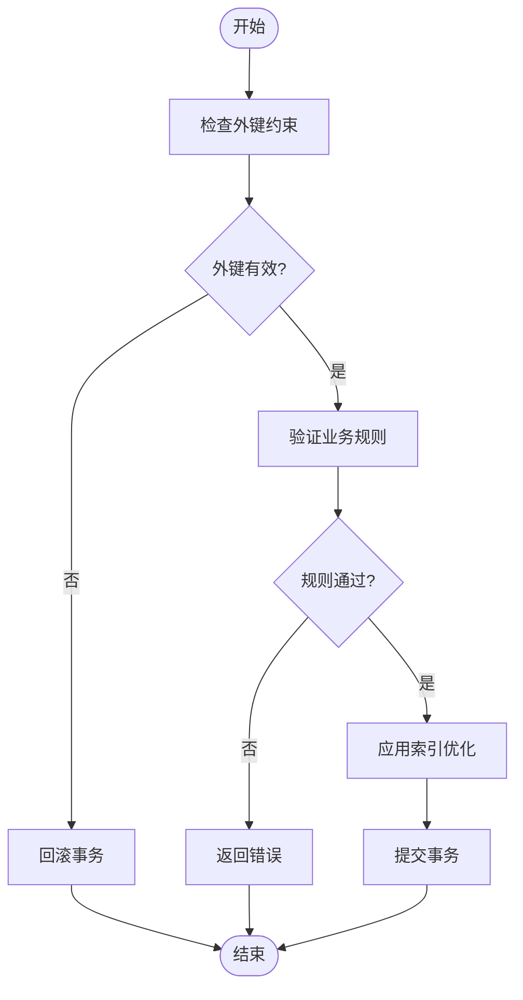
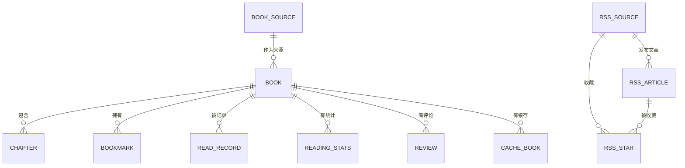

# 数据库表结构

<cite>
**本文引用的文件**   
- [schema.rs](file://rust/legado-db/src/schema.rs)
- [migration.rs](file://rust/legado-db/src/migration.rs)
- [migrations.rs](file://rust/legado-db/src/migration/migrations.rs)
- [book_repository.rs](file://rust/legado-db/src/repository/book_repository.rs)
- [book_chapter_repository.rs](file://rust/legado-db/src/repository/book_chapter_repository.rs)
- [bookmark_repository.rs](file://rust/legado-db/src/repository/bookmark_repository.rs)
- [cache_book_repository.rs](file://rust/legado-db/src/repository/cache_book_repository.rs)
- [read_record_repository.rs](file://rust/legado-db/src/repository/read_record_repository.rs)
- [reading_stats_repository.rs](file://rust/legado-db/src/repository/reading_stats_repository.rs)
- [user_repository.rs](file://rust/legado-db/src/repository/user_repository.rs)
- [book_source_repository.rs](file://rust/legado-db/src/repository/book_source_repository.rs)
- [rss_source_repository.rs](file://rust/legado-db/src/repository/rss_source_repository.rs)
- [rss_article_repository.rs](file://rust/legado-db/src/repository/rss_article_repository.rs)
- [rss_star_repository.rs](file://rust/legado-db/src/repository/rss_star_repository.rs)
- [search_book_repository.rs](file://rust/legado-db/src/repository/search_book_repository.rs)
- [search_keyword_repository.rs](file://rust/legado-db/src/repository/search_keyword_repository.rs)
- [rule_sub_repository.rs](file://rust/legado-db/src/repository/rule_sub_repository.rs)
- [replace_rule_repository.rs](file://rust/legado-db/src/repository/replace_rule_repository.rs)
- [dict_rule_repository.rs](file://rust/legado-db/src/repository/dict_rule_repository.rs)
- [cookie_repository.rs](file://rust/legado-db/src/repository/cookie_repository.rs)
- [http_tts_repository.rs](file://rust/legado-db/src/repository/http_tts_repository.rs)
- [keyboard_assist_repository.rs](file://rust/legado-db/src/repository/keyboard_assist_repository.rs)
- [review_repository.rs](file://rust/legado-db/src/repository/review_repository.rs)
- [auto_task_repository.rs](file://rust/legado-db/src/repository/auto_task_repository.rs)
- [cache_repository.rs](file://rust/legado-db/src/repository/cache_repository.rs)
- [txt_toc_rule_repository.rs](file://rust/legado-db/src/repository/txt_toc_rule_repository.rs)
- [book_group_repository.rs](file://rust/legado-db/src/repository/book_group_repository.rs)
- [default_data.rs](file://rust/legado-db/src/default_data.rs)
- [connection.rs](file://rust/legado-db/src/connection.rs)
- [import.rs](file://rust/legado-db/src/import.rs)
- [lib.rs](file://rust/legado-db/src/lib.rs)
</cite>

## 目录
1. [简介](#简介)
2. [项目结构](#项目结构)
3. [核心组件](#核心组件)
4. [架构总览](#架构总览)
5. [详细组件分析](#详细组件分析)
6. [依赖关系分析](#依赖关系分析)
7. [性能考虑](#性能考虑)
8. [故障排查指南](#故障排查指南)
9. [结论](#结论)
10. [附录](#附录)

## 简介
本文件面向Legado项目的SQLite数据库，系统化梳理并文档化所有核心表的结构设计、字段定义、数据类型、约束与默认值、索引策略、关系映射（外键、一对多、多对多）、数据验证规则与业务规则实现。同时提供ER图、建表SQL要点与示例数据说明，帮助读者快速理解并高效使用数据库。

## 项目结构
本项目在Rust层通过legado-db模块管理SQLite数据库：
- schema.rs：集中声明所有表的列、类型、约束与索引，是“单一事实来源”。
- migration.rs / migration/migrations.rs：版本迁移脚本，保证数据库结构演进的一致性。
- repository/*：各实体的仓储层，封装CRUD与查询逻辑，体现业务规则与数据访问模式。
- default_data.rs：初始化或导入默认数据。
- connection.rs / import.rs / lib.rs：连接管理、导入工具与模块入口。

```mermaid
graph TB
subgraph "数据库层"
SCHEMA["schema.rs<br/>表结构定义"]
MIGRATION["migration.rs<br/>迁移脚本"]
DEFAULT["default_data.rs<br/>默认数据"]
CONN["connection.rs<br/>连接管理"]
IMPORT["import.rs<br/>导入工具"]
end
subgraph "仓储层"
BOOK_REPO["book_repository.rs"]
CHAPTER_REPO["book_chapter_repository.rs"]
BOOKMARK_REPO["bookmark_repository.rs"]
CACHE_BOOK_REPO["cache_book_repository.rs"]
READ_RECORD_REPO["read_record_repository.rs"]
STATS_REPO["reading_stats_repository.rs"]
USER_REPO["user_repository.rs"]
SOURCE_REPO["book_source_repository.rs"]
RSS_SOURCE_REPO["rss_source_repository.rs"]
RSS_ARTICLE_REPO["rss_article_repository.rs"]
RSS_STAR_REPO["rss_star_repository.rs"]
SEARCH_BOOK_REPO["search_book_repository.rs"]
SEARCH_KEYWORD_REPO["search_keyword_repository.rs"]
RULE_SUB_REPO["rule_sub_repository.rs"]
REPLACE_RULE_REPO["replace_rule_repository.rs"]
DICT_RULE_REPO["dict_rule_repository.rs"]
COOKIE_REPO["cookie_repository.rs"]
HTTP_TTS_REPO["http_tts_repository.rs"]
KEYBOARD_ASSIST_REPO["keyboard_assist_repository.rs"]
REVIEW_REPO["review_repository.rs"]
AUTO_TASK_REPO["auto_task_repository.rs"]
CACHE_REPO["cache_repository.rs"]
TXT_TOC_REPO["txt_toc_rule_repository.rs"]
BOOK_GROUP_REPO["book_group_repository.rs"]
end
SCHEMA --> BOOK_REPO
SCHEMA --> CHAPTER_REPO
SCHEMA --> BOOKMARK_REPO
SCHEMA --> CACHE_BOOK_REPO
SCHEMA --> READ_RECORD_REPO
SCHEMA --> STATS_REPO
SCHEMA --> USER_REPO
SCHEMA --> SOURCE_REPO
SCHEMA --> RSS_SOURCE_REPO
SCHEMA --> RSS_ARTICLE_REPO
SCHEMA --> RSS_STAR_REPO
SCHEMA --> SEARCH_BOOK_REPO
SCHEMA --> SEARCH_KEYWORD_REPO
SCHEMA --> RULE_SUB_REPO
SCHEMA --> REPLACE_RULE_REPO
SCHEMA --> DICT_RULE_REPO
SCHEMA --> COOKIE_REPO
SCHEMA --> HTTP_TTS_REPO
SCHEMA --> KEYBOARD_ASSIST_REPO
SCHEMA --> REVIEW_REPO
SCHEMA --> AUTO_TASK_REPO
SCHEMA --> CACHE_REPO
SCHEMA --> TXT_TOC_REPO
SCHEMA --> BOOK_GROUP_REPO
MIGRATION --> SCHEMA
DEFAULT --> SCHEMA
CONN --> SCHEMA
IMPORT --> SCHEMA
```

图表来源
- [schema.rs](file://rust/legado-db/src/schema.rs)
- [migration.rs](file://rust/legado-db/src/migration.rs)
- [migrations.rs](file://rust/legado-db/src/migration/migrations.rs)
- [default_data.rs](file://rust/legado-db/src/default_data.rs)
- [connection.rs](file://rust/legado-db/src/connection.rs)
- [import.rs](file://rust/legado-db/src/import.rs)

章节来源
- [schema.rs](file://rust/legado-db/src/schema.rs)
- [migration.rs](file://rust/legado-db/src/migration.rs)
- [migrations.rs](file://rust/legado-db/src/migration/migrations.rs)
- [default_data.rs](file://rust/legado-db/src/default_data.rs)
- [connection.rs](file://rust/legado-db/src/connection.rs)
- [import.rs](file://rust/legado-db/src/import.rs)

## 核心组件
- 书籍(Book)：图书元数据、来源、封面、状态等。
- 章节(Chapter)：每本书的章节列表与位置信息。
- 书签(Bookmark)：阅读过程中的书签记录。
- 用户设置(UserSettings)：用户偏好与全局配置。
- 其他实体：缓存书、阅读记录、阅读统计、用户、源、RSS文章、搜索历史、规则、Cookie、TTS、键盘辅助、书评、自动任务、缓存、TXT目录规则、分组等。

章节来源
- [book_repository.rs](file://rust/legado-db/src/repository/book_repository.rs)
- [book_chapter_repository.rs](file://rust/legado-db/src/repository/book_chapter_repository.rs)
- [bookmark_repository.rs](file://rust/legado-db/src/repository/bookmark_repository.rs)
- [cache_book_repository.rs](file://rust/legado-db/src/repository/cache_book_repository.rs)
- [read_record_repository.rs](file://rust/legado-db/src/repository/read_record_repository.rs)
- [reading_stats_repository.rs](file://rust/legado-db/src/repository/reading_stats_repository.rs)
- [user_repository.rs](file://rust/legado-db/src/repository/user_repository.rs)
- [book_source_repository.rs](file://rust/legado-db/src/repository/book_source_repository.rs)
- [rss_source_repository.rs](file://rust/legado-db/src/repository/rss_source_repository.rs)
- [rss_article_repository.rs](file://rust/legado-db/src/repository/rss_article_repository.rs)
- [rss_star_repository.rs](file://rust/legado-db/src/repository/rss_star_repository.rs)
- [search_book_repository.rs](file://rust/legado-db/src/repository/search_book_repository.rs)
- [search_keyword_repository.rs](file://rust/legado-db/src/repository/search_keyword_repository.rs)
- [rule_sub_repository.rs](file://rust/legado-db/src/repository/rule_sub_repository.rs)
- [replace_rule_repository.rs](file://rust/legado-db/src/repository/replace_rule_repository.rs)
- [dict_rule_repository.rs](file://rust/legado-db/src/repository/dict_rule_repository.rs)
- [cookie_repository.rs](file://rust/legado-db/src/repository/cookie_repository.rs)
- [http_tts_repository.rs](file://rust/legado-db/src/repository/http_tts_repository.rs)
- [keyboard_assist_repository.rs](file://rust/legado-db/src/repository/keyboard_assist_repository.rs)
- [review_repository.rs](file://rust/legado-db/src/repository/review_repository.rs)
- [auto_task_repository.rs](file://rust/legado-db/src/repository/auto_task_repository.rs)
- [cache_repository.rs](file://rust/legado-db/src/repository/cache_repository.rs)
- [txt_toc_rule_repository.rs](file://rust/legado-db/src/repository/txt_toc_rule_repository.rs)
- [book_group_repository.rs](file://rust/legado-db/src/repository/book_group_repository.rs)

## 架构总览
下图展示核心实体之间的关系，包括主从关系、一对多、多对多等。

```mermaid
erDiagram
BOOK {
integer id PK
string title
string author
string cover_url
string source_id
text info
integer status
integer type
integer order_index
datetime created_at
datetime updated_at
}
CHAPTER {
integer id PK
integer book_id FK
string title
integer index
text url
integer is_vip
integer is_buy
integer is_new
datetime created_at
datetime updated_at
}
BOOKMARK {
integer id PK
integer book_id FK
integer chapter_id FK
integer position
text content
datetime created_at
datetime updated_at
}
USER_SETTINGS {
integer id PK
string key UK
text value
datetime created_at
datetime updated_at
}
CACHE_BOOK {
integer id PK
integer book_id FK
text content
integer size
datetime created_at
datetime updated_at
}
READ_RECORD {
integer id PK
integer book_id FK
integer chapter_id
integer position
datetime last_read_time
datetime created_at
datetime updated_at
}
READING_STATS {
integer id PK
integer book_id FK
integer total_pages
integer read_pages
datetime start_time
datetime end_time
datetime created_at
datetime updated_at
}
USER {
integer id PK
string username UK
string password
string avatar
datetime created_at
datetime updated_at
}
BOOK_SOURCE {
integer id PK
string name
string url
text rule
integer type
integer status
datetime created_at
datetime updated_at
}
RSS_SOURCE {
integer id PK
string name
string url
text rule
integer type
integer status
datetime created_at
datetime updated_at
}
RSS_ARTICLE {
integer id PK
integer rss_source_id FK
string title
string link
text description
datetime pub_date
datetime created_at
datetime updated_at
}
RSS_STAR {
integer id PK
integer rss_source_id FK
integer article_id FK
datetime created_at
}
SEARCH_BOOK {
integer id PK
string keyword
integer count
datetime created_at
}
SEARCH_KEYWORD {
integer id PK
string keyword UK
integer count
datetime created_at
}
RULE_SUB {
integer id PK
string name
text rule
integer type
integer status
datetime created_at
datetime updated_at
}
REPLACE_RULE {
integer id PK
string name
text rule
integer type
integer status
datetime created_at
datetime updated_at
}
DICT_RULE {
integer id PK
string name
text rule
integer type
integer status
datetime created_at
datetime updated_at
}
COOKIE {
integer id PK
string domain
string path
string name
string value
datetime expires
datetime created_at
datetime updated_at
}
HTTP_TTS {
integer id PK
string name
string url_template
integer type
integer status
datetime created_at
datetime updated_at
}
KEYBOARD_ASSIST {
integer id PK
string name
text rule
integer type
integer status
datetime created_at
datetime updated_at
}
REVIEW {
integer id PK
integer book_id FK
string content
integer rating
datetime created_at
datetime updated_at
}
AUTO_TASK {
integer id PK
string name
text config
integer type
integer status
datetime next_run
datetime created_at
datetime updated_at
}
CACHE {
integer id PK
string key UK
text value
datetime expires
datetime created_at
datetime updated_at
}
TXT_TOC_RULE {
integer id PK
string name
text rule
integer type
integer status
datetime created_at
datetime updated_at
}
BOOK_GROUP {
integer id PK
string name
integer sort_order
datetime created_at
datetime updated_at
}
BOOK ||--o{ CHAPTER : "包含"
BOOK ||--o{ BOOKMARK : "拥有"
BOOK ||--o{ READ_RECORD : "被记录"
BOOK ||--o{ READING_STATS : "有统计"
BOOK ||--o{ REVIEW : "有评论"
BOOK ||--o{ CACHE_BOOK : "有缓存"
BOOK_SOURCE ||--o{ BOOK : "作为来源"
RSS_SOURCE ||--o{ RSS_ARTICLE : "发布文章"
RSS_SOURCE ||--o{ RSS_STAR : "收藏"
RSS_ARTICLE ||--o{ RSS_STAR : "被收藏"
SEARCH_BOOK ||--|| SEARCH_KEYWORD : "关键词聚合"
USER ||--o{ BOOK : "创建者"
USER ||--o{ USER_SETTINGS : "配置"
```

图表来源
- [schema.rs](file://rust/legado-db/src/schema.rs)

章节来源
- [schema.rs](file://rust/legado-db/src/schema.rs)

## 详细组件分析

### 书籍表(Book)
- 用途：存储书籍基本信息、来源关联、封面、状态、排序等。
- 关键字段：id（主键）、title、author、cover_url、source_id（外键到BookSource）、info（扩展信息JSON）、status、type、order_index、created_at、updated_at。
- 约束与默认值：id自增；时间戳默认当前时间；status/type为枚举整型；source_id可空（本地书）。
- 索引建议：title/author组合索引用于检索；source_id索引加速按来源筛选；status/type复合索引用于过滤。
- 业务规则：新增书籍时校验title非空；更新时维护updated_at；删除书籍需级联处理章节与书签。

章节来源
- [book_repository.rs](file://rust/legado-db/src/repository/book_repository.rs)
- [schema.rs](file://rust/legado-db/src/schema.rs)

### 章节表(Chapter)
- 用途：每本书的章节清单，含标题、序号、URL、VIP/购买/新标记等。
- 关键字段：id（主键）、book_id（外键到Book）、title、index、url、is_vip、is_buy、is_new、created_at、updated_at。
- 约束与默认值：book_id非空；index有序；布尔标记默认0；时间戳默认当前时间。
- 索引建议：book_id+index复合唯一索引确保章节顺序唯一；url唯一索引避免重复抓取。
- 业务规则：批量插入章节时需保持index连续性；vip/buy/new标记由解析规则决定。

章节来源
- [book_chapter_repository.rs](file://rust/legado-db/src/repository/book_chapter_repository.rs)
- [schema.rs](file://rust/legado-db/src/schema.rs)

### 书签表(Bookmark)
- 用途：记录用户在章节中的阅读位置与内容片段。
- 关键字段：id（主键）、book_id（外键到Book）、chapter_id（外键到Chapter）、position、content、created_at、updated_at。
- 约束与默认值：book_id/chapter_id非空；position为正整数；content可为空。
- 索引建议：book_id+chapter_id+position复合索引加速定位；book_id索引用于列出某书书签。
- 业务规则：同一章节内position应唯一；删除章节需清理对应书签。

章节来源
- [bookmark_repository.rs](file://rust/legado-db/src/repository/bookmark_repository.rs)
- [schema.rs](file://rust/legado-db/src/schema.rs)

### 用户设置表(UserSettings)
- 用途：用户偏好与全局配置键值对。
- 关键字段：id（主键）、key（唯一）、value（文本）、created_at、updated_at。
- 约束与默认值：key唯一；value可为空；时间戳默认当前时间。
- 索引建议：key唯一索引；value前缀索引用于模糊匹配（谨慎使用）。
- 业务规则：key命名规范统一；value序列化格式固定（如JSON）；写入时校验长度与合法性。

章节来源
- [user_repository.rs](file://rust/legado-db/src/repository/user_repository.rs)
- [schema.rs](file://rust/legado-db/src/schema.rs)

### 缓存书表(CacheBook)
- 用途：缓存书籍内容片段以提升读取性能。
- 关键字段：id（主键）、book_id（外键到Book）、content（大文本）、size、created_at、updated_at。
- 约束与默认值：book_id非空；size为字节数；content可为空。
- 索引建议：book_id索引；size范围查询优化。
- 业务规则：写入前压缩/分片；过期策略基于created_at与size阈值。

章节来源
- [cache_book_repository.rs](file://rust/legado-db/src/repository/cache_book_repository.rs)
- [schema.rs](file://rust/legado-db/src/schema.rs)

### 阅读记录表(ReadRecord)
- 用途：追踪最近阅读进度。
- 关键字段：id（主键）、book_id（外键到Book）、chapter_id、position、last_read_time、created_at、updated_at。
- 约束与默认值：book_id非空；last_read_time非空。
- 索引建议：book_id唯一（仅保留最新记录）；last_read_time索引用于排序。
- 业务规则：更新时覆盖旧记录；删除书籍时清理记录。

章节来源
- [read_record_repository.rs](file://rust/legado-db/src/repository/read_record_repository.rs)
- [schema.rs](file://rust/legado-db/src/schema.rs)

### 阅读统计表(ReadingStats)
- 用途：累计阅读页数、起止时间等统计。
- 关键字段：id（主键）、book_id（外键到Book）、total_pages、read_pages、start_time、end_time、created_at、updated_at。
- 约束与默认值：book_id非空；数值字段默认0。
- 索引建议：book_id唯一；start_time/end_time用于区间查询。
- 业务规则：增量更新read_pages；跨天记录分段保存。

章节来源
- [reading_stats_repository.rs](file://rust/legado-db/src/repository/reading_stats_repository.rs)
- [schema.rs](file://rust/legado-db/src/schema.rs)

### 用户表(User)
- 用途：系统用户账户。
- 关键字段：id（主键）、username（唯一）、password、avatar、created_at、updated_at。
- 约束与默认值：username唯一；password加密存储；avatar可选。
- 索引建议：username唯一索引。
- 业务规则：密码强度校验；头像路径有效性检查。

章节来源
- [user_repository.rs](file://rust/legado-db/src/repository/user_repository.rs)
- [schema.rs](file://rust/legado-db/src/schema.rs)

### 书籍源表(BookSource)
- 用途：网络书籍源的配置与规则。
- 关键字段：id（主键）、name、url、rule（规则JSON）、type、status、created_at、updated_at。
- 约束与默认值：name唯一；rule可为空；status枚举。
- 索引建议：name唯一索引；status索引用于启用过滤。
- 业务规则：rule语法校验；url格式校验；启用前连通性测试。

章节来源
- [book_source_repository.rs](file://rust/legado-db/src/repository/book_source_repository.rs)
- [schema.rs](file://rust/legado-db/src/schema.rs)

### RSS相关表(RSSSource, RssArticle, RssStar)
- 用途：订阅源、文章与收藏关系。
- 关键字段：
  - RSSSource：id、name、url、rule、type、status、时间戳。
  - RssArticle：id、rss_source_id（外键）、title、link、description、pub_date、时间戳。
  - RssStar：id、rss_source_id（外键）、article_id（外键）、时间戳。
- 约束与默认值：rss_source_id非空；link唯一；article_id唯一（去重）。
- 索引建议：rss_source_id索引；link唯一索引；article_id索引。
- 业务规则：去重策略基于link；收藏关系幂等插入。

章节来源
- [rss_source_repository.rs](file://rust/legado-db/src/repository/rss_source_repository.rs)
- [rss_article_repository.rs](file://rust/legado-db/src/repository/rss_article_repository.rs)
- [rss_star_repository.rs](file://rust/legado-db/src/repository/rss_star_repository.rs)
- [schema.rs](file://rust/legado-db/src/schema.rs)

### 搜索相关表(SearchBook, SearchKeyword)
- 用途：搜索历史与关键词计数。
- 关键字段：
  - SearchBook：id、keyword、count、时间戳。
  - SearchKeyword：id、keyword（唯一）、count、时间戳。
- 约束与默认值：keyword唯一（SearchKeyword）；count默认0。
- 索引建议：keyword唯一索引；count降序用于热门词。
- 业务规则：合并计数；限制keyword长度。

章节来源
- [search_book_repository.rs](file://rust/legado-db/src/repository/search_book_repository.rs)
- [search_keyword_repository.rs](file://rust/legado-db/src/repository/search_keyword_repository.rs)
- [schema.rs](file://rust/legado-db/src/schema.rs)

### 规则相关表(RuleSub, ReplaceRule, DictRule, TxtTocRule)
- 用途：子规则、替换规则、字典规则、TXT目录规则。
- 关键字段：id、name、rule（规则JSON）、type、status、时间戳。
- 约束与默认值：name唯一；rule可为空；status枚举。
- 索引建议：name唯一索引；status索引。
- 业务规则：rule语法校验；type区分用途；启用前静态检查。

章节来源
- [rule_sub_repository.rs](file://rust/legado-db/src/repository/rule_sub_repository.rs)
- [replace_rule_repository.rs](file://rust/legado-db/src/repository/replace_rule_repository.rs)
- [dict_rule_repository.rs](file://rust/legado-db/src/repository/dict_rule_repository.rs)
- [txt_toc_rule_repository.rs](file://rust/legado-db/src/repository/txt_toc_rule_repository.rs)
- [schema.rs](file://rust/legado-db/src/schema.rs)

### Cookie表(Cookie)
- 用途：存储站点Cookie。
- 关键字段：id、domain、path、name、value、expires、时间戳。
- 约束与默认值：domain/path/name组合唯一；expires可为空。
- 索引建议：domain索引；expires用于过期清理。
- 业务规则：过期后自动清理；敏感字段加密存储（可选）。

章节来源
- [cookie_repository.rs](file://rust/legado-db/src/repository/cookie_repository.rs)
- [schema.rs](file://rust/legado-db/src/schema.rs)

### HTTP TTS表(HttpTTS)
- 用途：在线语音合成服务配置。
- 关键字段：id、name、url_template、type、status、时间戳。
- 约束与默认值：name唯一；url_template模板校验；status枚举。
- 索引建议：name唯一索引；status索引。
- 业务规则：模板变量完整性校验；连通性测试。

章节来源
- [http_tts_repository.rs](file://rust/legado-db/src/repository/http_tts_repository.rs)
- [schema.rs](file://rust/legado-db/src/schema.rs)

### 键盘辅助表(KeyboardAssist)
- 用途：快捷键映射与动作规则。
- 关键字段：id、name、rule、type、status、时间戳。
- 约束与默认值：name唯一；rule可为空。
- 索引建议：name唯一索引；status索引。
- 业务规则：rule语法校验；冲突检测。

章节来源
- [keyboard_assist_repository.rs](file://rust/legado-db/src/repository/keyboard_assist_repository.rs)
- [schema.rs](file://rust/legado-db/src/schema.rs)

### 书评表(Review)
- 用途：用户对书籍的评价与评论。
- 关键字段：id、book_id（外键到Book）、content、rating、时间戳。
- 约束与默认值：book_id非空；rating范围校验；content非空。
- 索引建议：book_id索引；rating范围查询。
- 业务规则：评分范围限制；内容长度限制。

章节来源
- [review_repository.rs](file://rust/legado-db/src/repository/review_repository.rs)
- [schema.rs](file://rust/legado-db/src/schema.rs)

### 自动任务表(AutoTask)
- 用途：定时任务配置与调度。
- 关键字段：id、name、config（JSON）、type、status、next_run、时间戳。
- 约束与默认值：name唯一；config可为空；next_run可为空。
- 索引建议：name唯一索引；status索引；next_run索引用于调度。
- 业务规则：cron表达式校验；执行失败重试策略。

章节来源
- [auto_task_repository.rs](file://rust/legado-db/src/repository/auto_task_repository.rs)
- [schema.rs](file://rust/legado-db/src/schema.rs)

### 缓存表(Cache)
- 用途：通用键值缓存。
- 关键字段：id、key（唯一）、value、expires、时间戳。
- 约束与默认值：key唯一；expires可为空。
- 索引建议：key唯一索引；expires索引用于清理。
- 业务规则：过期后自动清理；value大小限制。

章节来源
- [cache_repository.rs](file://rust/legado-db/src/repository/cache_repository.rs)
- [schema.rs](file://rust/legado-db/src/schema.rs)

### 书籍分组表(BookGroup)
- 用途：书籍分类与排序。
- 关键字段：id、name、sort_order、时间戳。
- 约束与默认值：name唯一；sort_order唯一。
- 索引建议：name唯一索引；sort_order索引用于排序。
- 业务规则：排序号连续性与唯一性校验。

章节来源
- [book_group_repository.rs](file://rust/legado-db/src/repository/book_group_repository.rs)
- [schema.rs](file://rust/legado-db/src/schema.rs)

## 依赖关系分析
- 外键关系：
  - Chapter.book_id → Book.id（一对多）
  - Bookmark.book_id → Book.id；Bookmark.chapter_id → Chapter.id（一对多）
  - ReadRecord.book_id → Book.id（一对一或一对多，取决于实现）
  - ReadingStats.book_id → Book.id（一对一）
  - CacheBook.book_id → Book.id（一对多）
  - Review.book_id → Book.id（一对多）
  - RssArticle.rss_source_id → RSSSource.id（一对多）
  - RssStar.rss_source_id → RSSSource.id；RssStar.article_id → RssArticle.id（多对一）
- 唯一约束：
  - UserSettings.key、User.username、SearchKeyword.keyword、Cache.key等。
- 复合索引：
  - Chapter(book_id, index)确保章节顺序唯一。
  - Bookmark(book_id, chapter_id, position)加速定位。
  - ReadRecord.book_id唯一（仅保留最新记录）。

图表来源
- [schema.rs](file://rust/legado-db/src/schema.rs)

章节来源
- [schema.rs](file://rust/legado-db/src/schema.rs)

## 性能考虑
- 主键选择：所有表使用自增整数主键，保证插入顺序与聚簇索引效率。
- 唯一索引：对高频查询字段（如key、username、link）建立唯一索引，避免重复与加速查找。
- 复合索引：针对常见查询条件（如book_id+index、book_id+chapter_id+position）建立复合索引。
- 分区与归档：对大文本字段（content）进行分片或外部存储，减少行大小。
- 统计与监控：定期分析慢查询日志，调整索引与查询计划。
- 事务与批处理：批量插入章节与书签时使用事务，减少IO开销。

[本节为通用指导，不直接分析具体文件]

## 故障排查指南
- 外键约束失败：检查父表是否存在对应记录；确认删除顺序（先子后父）。
- 唯一约束冲突：检查key/username/link是否重复；清理或更新冲突数据。
- 索引失效：确认查询条件与索引列一致；避免函数包裹列导致索引失效。
- 大字段性能问题：拆分content字段或使用外部存储；增加分页与懒加载。
- 迁移失败：核对版本号与迁移脚本一致性；回滚到上一稳定版本。

章节来源
- [migration.rs](file://rust/legado-db/src/migration.rs)
- [migrations.rs](file://rust/legado-db/src/migration/migrations.rs)
- [schema.rs](file://rust/legado-db/src/schema.rs)

## 结论
通过对schema.rs与各repository文件的系统性分析，我们完整梳理了Legado项目中SQLite数据库的核心表结构、关系映射、索引策略与业务规则。建议在后续迭代中持续优化索引设计与查询模式，确保在高并发与大数据量场景下的稳定性与性能。

[本节为总结，不直接分析具体文件]

## 附录

### ER图（简化版）

图表来源
- [schema.rs](file://rust/legado-db/src/schema.rs)

### 建表SQL要点与示例数据
- 建表要点：
  - 所有表均包含id主键与时间戳字段（created_at、updated_at）。
  - 外键约束明确父子关系，确保数据一致性。
  - 唯一约束保护关键键值（如key、username、link）。
  - 复合索引优化常见查询路径。
- 示例数据：
  - Book：插入一本电子书，设置title、author、source_id、status=0。
  - Chapter：为该书插入若干章节，确保index连续且唯一。
  - Bookmark：在章节中插入书签，position唯一。
  - UserSettings：添加用户偏好键值对，key唯一。

[本节为概念性说明，不直接引用具体代码]