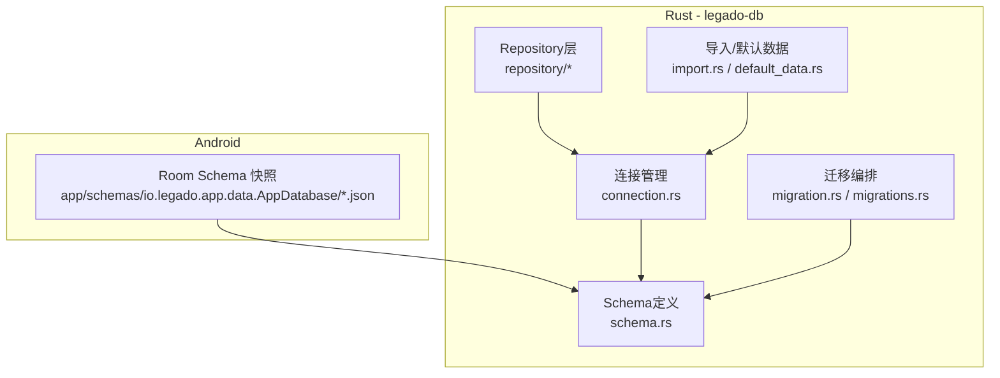
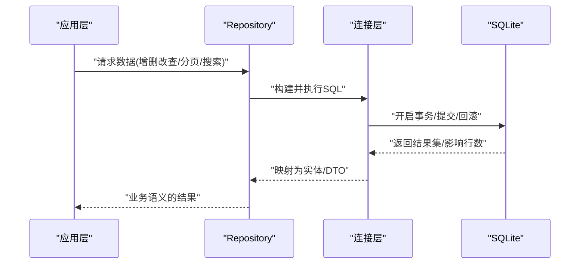
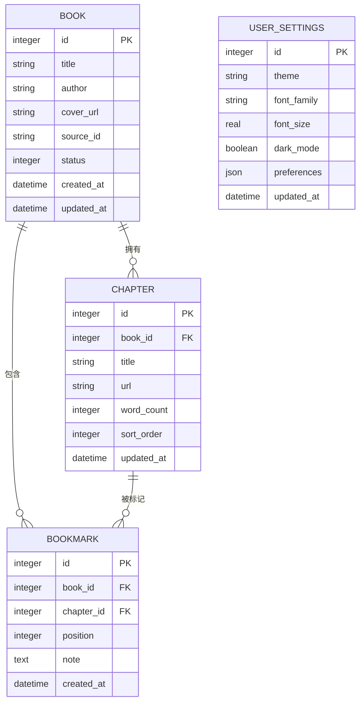
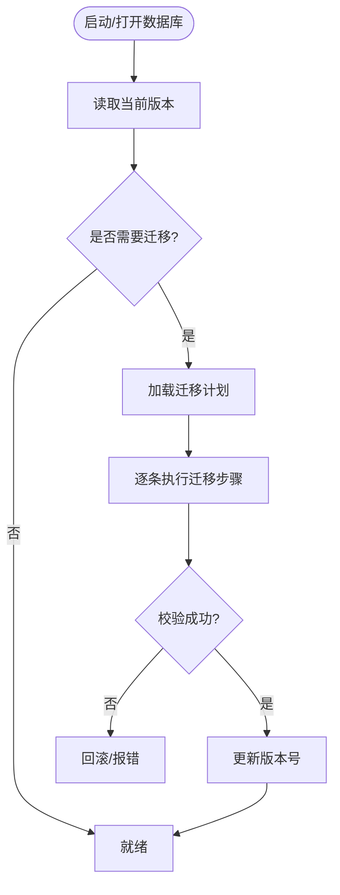
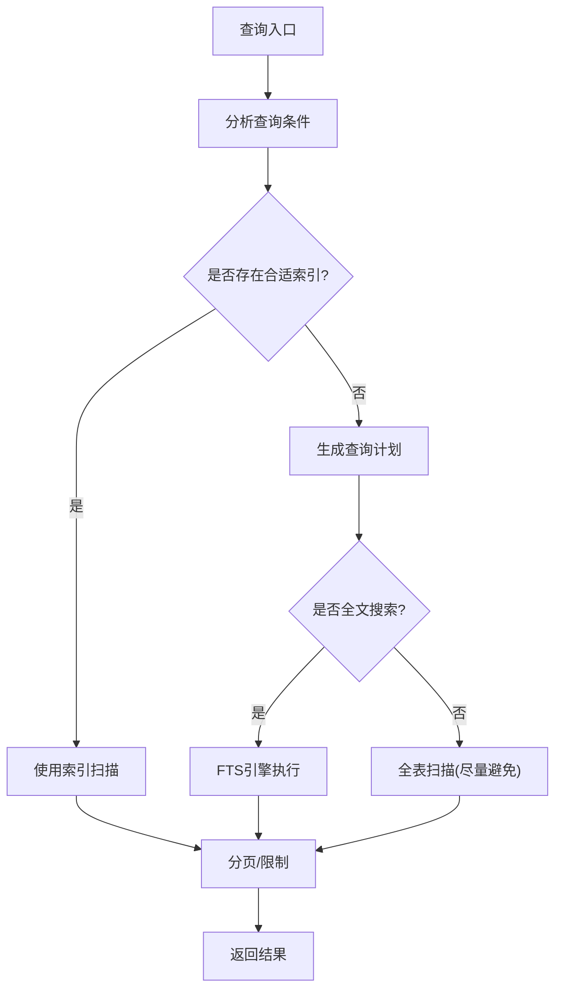
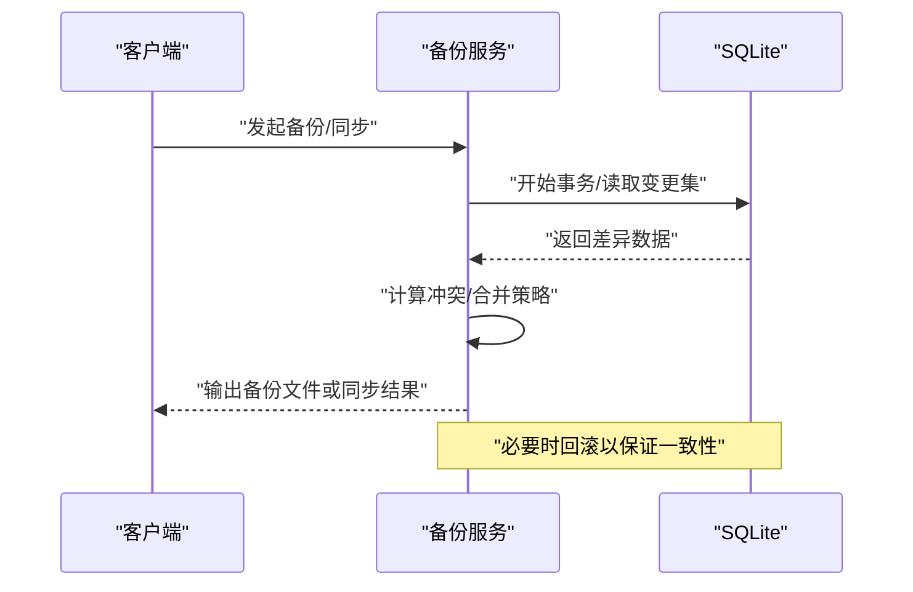
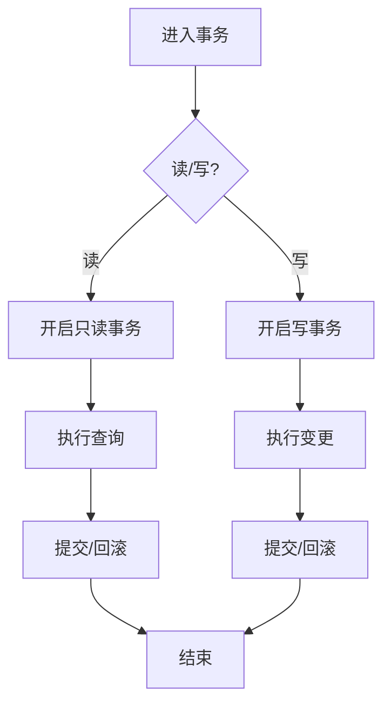
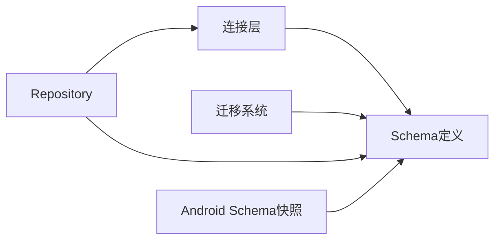

# 数据库设计

<cite>
**本文引用的文件**   
- [app/schemas/io.legado.app.data.AppDatabase/1.json](file://app/schemas/io.legado.app.data.AppDatabase/1.json)
- [app/schemas/io.legado.app.data.AppDatabase/95.json](file://app/schemas/io.legado.app.data.AppDatabase/95.json)
- [rust/legado-db/src/schema.rs](file://rust/legado-db/src/schema.rs)
- [rust/legado-db/src/migration.rs](file://rust/legado-db/src/migration.rs)
- [rust/legado-db/src/migration/migrations.rs](file://rust/legado-db/src/migration/migrations.rs)
- [rust/legado-db/src/connection.rs](file://rust/legado-db/src/connection.rs)
- [rust/legado-db/src/repository/mod.rs](file://rust/legado-db/src/repository/mod.rs)
- [rust/legado-db/src/repository/book_repository.rs](file://rust/legado-db/src/repository/book_repository.rs)
- [rust/legado-db/src/repository/book_chapter_repository.rs](file://rust/legado-db/src/repository/book_chapter_repository.rs)
- [rust/legado-db/src/repository/bookmark_repository.rs](file://rust/legado-db/src/repository/bookmark_repository.rs)
- [rust/legado-db/src/repository/user_repository.rs](file://rust/legado-db/src/repository/user_repository.rs)
- [rust/legado-db/src/import.rs](file://rust/legado-db/src/import.rs)
- [rust/legado-db/src/default_data.rs](file://rust/legado-db/src/default_data.rs)
- [rust/legado-db/tests/integration_test.rs](file://rust/legado-db/tests/integration_test.rs)
</cite>

## 目录
1. [简介](#简介)
2. [项目结构](#项目结构)
3. [核心组件](#核心组件)
4. [架构总览](#架构总览)
5. [详细组件分析](#详细组件分析)
6. [依赖分析](#依赖分析)
7. [性能考虑](#性能考虑)
8. [故障排查指南](#故障排查指南)
9. [结论](#结论)
10. [附录](#附录)

## 简介
本文件面向Legado项目的SQLite数据库设计与实现，覆盖表结构设计（书籍、章节、书签、用户设置等）、迁移与版本管理、查询优化与索引、备份恢复、事务与并发控制，以及数据访问模式与ORM使用实践。文档以仓库中Rust侧的数据库模块为核心依据，并结合Android端Schema快照进行对照说明，帮助读者从概念到代码层面全面理解数据库体系。

## 项目结构
- Android端：通过Room生成并维护多版本JSON Schema快照，位于 app/schemas/io.legado.app.data.AppDatabase/ 目录下，用于验证数据库结构与迁移正确性。
- Rust端：legado-db 模块负责SQLite连接、Schema定义、迁移脚本、Repository层封装、导入导出与默认数据初始化等。

图表来源
- [app/schemas/io.legado.app.data.AppDatabase/1.json](file://app/schemas/io.legado.app.data.AppDatabase/1.json)
- [app/schemas/io.legado.app.data.AppDatabase/95.json](file://app/schemas/io.legado.app.data.AppDatabase/95.json)
- [rust/legado-db/src/connection.rs](file://rust/legado-db/src/connection.rs)
- [rust/legado-db/src/schema.rs](file://rust/legado-db/src/schema.rs)
- [rust/legado-db/src/migration.rs](file://rust/legado-db/src/migration.rs)
- [rust/legado-db/src/migration/migrations.rs](file://rust/legado-db/src/migration/migrations.rs)

章节来源
- [app/schemas/io.legado.app.data.AppDatabase/1.json](file://app/schemas/io.legado.app.data.AppDatabase/1.json)
- [app/schemas/io.legado.app.data.AppDatabase/95.json](file://app/schemas/io.legado.app.data.AppDatabase/95.json)
- [rust/legado-db/src/connection.rs](file://rust/legado-db/src/connection.rs)
- [rust/legado-db/src/schema.rs](file://rust/legado-db/src/schema.rs)
- [rust/legado-db/src/migration.rs](file://rust/legado-db/src/migration.rs)
- [rust/legado-db/src/migration/migrations.rs](file://rust/legado-db/src/migration/migrations.rs)

## 核心组件
- 连接管理：统一SQLite连接池/单例、WAL模式、PRAGMA配置、事务边界。
- Schema定义：集中声明表、索引、外键约束与触发器。
- 迁移系统：版本化增量升级、回滚策略、兼容性校验。
- Repository层：对实体CRUD、复杂查询、批量操作进行抽象封装。
- 导入与默认数据：初始数据注入、历史数据兼容导入。

章节来源
- [rust/legado-db/src/connection.rs](file://rust/legado-db/src/connection.rs)
- [rust/legado-db/src/schema.rs](file://rust/legado-db/src/schema.rs)
- [rust/legado-db/src/migration.rs](file://rust/legado-db/src/migration.rs)
- [rust/legado-db/src/migration/migrations.rs](file://rust/legado-db/src/migration/migrations.rs)
- [rust/legado-db/src/repository/mod.rs](file://rust/legado-db/src/repository/mod.rs)
- [rust/legado-db/src/import.rs](file://rust/legado-db/src/import.rs)
- [rust/legado-db/src/default_data.rs](file://rust/legado-db/src/default_data.rs)

## 架构总览
下图展示从上层调用到SQLite的完整路径：应用层通过Repository访问数据，Repository基于连接层执行SQL；Schema与迁移确保结构一致性与可演进性。

图表来源
- [rust/legado-db/src/repository/mod.rs](file://rust/legado-db/src/repository/mod.rs)
- [rust/legado-db/src/connection.rs](file://rust/legado-db/src/connection.rs)

## 详细组件分析

### 表结构与关系映射（书籍、章节、书签、用户设置）
- 书籍表：存储书名、作者、封面、来源、状态、时间戳等元数据，作为阅读与同步的核心实体。
- 章节表：归属某本书，记录标题、URL、字数、排序、更新时间等，支撑目录与分页加载。
- 书签表：关联书籍与章节，记录位置、备注、时间戳，支持快速跳转与分享。
- 用户设置表：保存主题、字体、阅读偏好、网络参数等个性化配置。
- 其他辅助表：如缓存书、搜索历史、RSS源与文章、替换规则、键盘辅助等，服务于功能扩展。

图表来源
- [rust/legado-db/src/schema.rs](file://rust/legado-db/src/schema.rs)

章节来源
- [rust/legado-db/src/schema.rs](file://rust/legado-db/src/schema.rs)

### 数据库迁移策略（版本管理、增量升级、兼容性）
- 版本管理：每个迁移对应一个版本号，按顺序执行，保证向后兼容。
- 增量升级：仅变更差异部分（新增列、新建表、重建索引），避免全量重建。
- 兼容性保证：在迁移前检查当前版本，失败时提供回滚或降级路径；对关键数据做校验与修复。
- 测试保障：集成测试覆盖迁移路径，确保跨版本升级稳定。

图表来源
- [rust/legado-db/src/migration.rs](file://rust/legado-db/src/migration.rs)
- [rust/legado-db/src/migration/migrations.rs](file://rust/legado-db/src/migration/migrations.rs)
- [rust/legado-db/tests/integration_test.rs](file://rust/legado-db/tests/integration_test.rs)

章节来源
- [rust/legado-db/src/migration.rs](file://rust/legado-db/src/migration.rs)
- [rust/legado-db/src/migration/migrations.rs](file://rust/legado-db/src/migration/migrations.rs)
- [rust/legado-db/tests/integration_test.rs](file://rust/legado-db/tests/integration_test.rs)

### 查询优化与索引设计
- 复合索引：针对高频过滤与排序字段组合创建索引（如书籍来源+状态+更新时间）。
- 全文搜索：对书名、作者、章节标题建立FTS索引，提升关键词检索性能。
- 分页查询：使用游标式分页或基于主键的分页，避免深分页带来的性能问题。
- 覆盖索引：尽量让查询命中索引而不回表，减少IO。
- 统计信息：定期ANALYZE，确保查询计划最优。

图表来源
- [rust/legado-db/src/schema.rs](file://rust/legado-db/src/schema.rs)

章节来源
- [rust/legado-db/src/schema.rs](file://rust/legado-db/src/schema.rs)

### 备份恢复机制（完整备份、增量同步、冲突解决）
- 完整备份：通过SQLite的备份API或导出SQL脚本，生成一致性快照。
- 增量同步：基于时间戳或版本号对比，仅同步变更数据，降低带宽与I/O。
- 冲突解决：合并策略（最新写入优先、字段级合并、人工确认），并在日志中记录冲突详情。
- 校验与回滚：备份后校验完整性，失败时自动回滚到上一可用版本。

图表来源
- [rust/legado-db/src/import.rs](file://rust/legado-db/src/import.rs)

章节来源
- [rust/legado-db/src/import.rs](file://rust/legado-db/src/import.rs)

### 事务处理与并发控制（读写分离、锁机制、死锁预防）
- 读写分离：读操作走只读连接，写操作走写连接，降低锁竞争。
- 锁机制：合理使用行级锁与事务隔离级别，避免长事务持有锁。
- 死锁预防：固定加锁顺序、缩短事务时长、重试机制。
- WAL模式：提高并发读性能，减少阻塞。

图表来源
- [rust/legado-db/src/connection.rs](file://rust/legado-db/src/connection.rs)

章节来源
- [rust/legado-db/src/connection.rs](file://rust/legado-db/src/connection.rs)

### 数据访问模式与ORM使用指南（Repository、DAO、实体映射）
- Repository模式：将数据访问逻辑封装在Repository中，对外暴露领域语义方法。
- DAO接口：定义最小化的数据访问契约，便于测试与替换实现。
- 实体映射：实体与表结构一一对应，字段类型与约束保持一致。
- 最佳实践：
  - 使用批量插入/更新减少往返次数。
  - 分页查询采用游标式以避免深分页。
  - 复杂查询使用视图或CTE提升可读性与性能。
  - 对热点查询建立覆盖索引。

章节来源
- [rust/legado-db/src/repository/mod.rs](file://rust/legado-db/src/repository/mod.rs)
- [rust/legado-db/src/repository/book_repository.rs](file://rust/legado-db/src/repository/book_repository.rs)
- [rust/legado-db/src/repository/book_chapter_repository.rs](file://rust/legado-db/src/repository/book_chapter_repository.rs)
- [rust/legado-db/src/repository/bookmark_repository.rs](file://rust/legado-db/src/repository/bookmark_repository.rs)
- [rust/legado-db/src/repository/user_repository.rs](file://rust/legado-db/src/repository/user_repository.rs)

### 具体SQL示例与调优建议
- 复合索引示例：为“书籍来源+状态+更新时间”建立复合索引，加速列表筛选与排序。
- 全文搜索示例：对“书名、作者、章节标题”启用FTS，使用MATCH语法进行关键词检索。
- 分页查询示例：使用基于主键的游标分页，避免OFFSET深分页。
- 调优建议：
  - 开启WAL模式，提升并发读性能。
  - 定期ANALYZE更新统计信息。
  - 监控慢查询，针对性添加索引或改写SQL。
  - 合理拆分大事务，减少锁持有时间。

章节来源
- [rust/legado-db/src/schema.rs](file://rust/legado-db/src/schema.rs)

## 依赖分析
- 连接层依赖Schema定义，确保建表与约束一致。
- 迁移系统依赖Schema与迁移脚本，按版本顺序执行。
- Repository依赖连接层与Schema，屏蔽底层SQL细节。
- Android端Schema快照与Rust端Schema需保持语义一致，避免两端不一致导致的兼容问题。

图表来源
- [rust/legado-db/src/connection.rs](file://rust/legado-db/src/connection.rs)
- [rust/legado-db/src/schema.rs](file://rust/legado-db/src/schema.rs)
- [rust/legado-db/src/migration.rs](file://rust/legado-db/src/migration.rs)
- [rust/legado-db/src/repository/mod.rs](file://rust/legado-db/src/repository/mod.rs)
- [app/schemas/io.legado.app.data.AppDatabase/95.json](file://app/schemas/io.legado.app.data.AppDatabase/95.json)

章节来源
- [rust/legado-db/src/connection.rs](file://rust/legado-db/src/connection.rs)
- [rust/legado-db/src/schema.rs](file://rust/legado-db/src/schema.rs)
- [rust/legado-db/src/migration.rs](file://rust/legado-db/src/migration.rs)
- [rust/legado-db/src/repository/mod.rs](file://rust/legado-db/src/repository/mod.rs)
- [app/schemas/io.legado.app.data.AppDatabase/95.json](file://app/schemas/io.legado.app.data.AppDatabase/95.json)

## 性能考虑
- 索引策略：优先为高频过滤与排序字段建立索引，避免过度索引导致写入退化。
- 查询优化：使用EXPLAIN ANALYZE分析执行计划，消除全表扫描与不必要的JOIN。
- 事务粒度：缩小事务范围，减少锁竞争与死锁概率。
- 并发模型：读多写少场景下启用WAL与只读连接，提升吞吐。
- 缓存与预热：对热点数据（如书架列表、常用设置）进行内存缓存与预热。

[本节为通用指导，不直接分析具体文件]

## 故障排查指南
- 迁移失败：检查当前版本与目标版本的差异，查看迁移日志定位失败步骤，必要时回滚。
- 查询缓慢：使用EXPLAIN ANALYZE分析执行计划，补充缺失索引或改写SQL。
- 死锁与锁等待：缩短事务时长，固定加锁顺序，增加重试与超时机制。
- 备份异常：校验备份完整性，检查磁盘空间与权限，必要时切换备份策略。

章节来源
- [rust/legado-db/src/migration.rs](file://rust/legado-db/src/migration.rs)
- [rust/legado-db/src/connection.rs](file://rust/legado-db/src/connection.rs)
- [rust/legado-db/tests/integration_test.rs](file://rust/legado-db/tests/integration_test.rs)

## 结论
Legado的数据库设计以清晰的Schema定义、稳健的迁移系统与高效的Repository层为核心，结合索引优化、事务与并发控制、备份恢复机制，形成一套可扩展、可维护且高性能的数据持久化方案。建议在后续迭代中持续监控性能指标，完善索引与查询计划，确保数据一致性与用户体验。

[本节为总结性内容，不直接分析具体文件]

## 附录
- Android端Schema快照：用于验证Room生成的数据库结构与迁移正确性，建议与Rust端Schema保持语义一致。
- 默认数据与导入：通过默认数据与导入流程，确保新环境快速可用与历史数据平滑迁移。

章节来源
- [app/schemas/io.legado.app.data.AppDatabase/1.json](file://app/schemas/io.legado.app.data.AppDatabase/1.json)
- [app/schemas/io.legado.app.data.AppDatabase/95.json](file://app/schemas/io.legado.app.data.AppDatabase/95.json)
- [rust/legado-db/src/default_data.rs](file://rust/legado-db/src/default_data.rs)
- [rust/legado-db/src/import.rs](file://rust/legado-db/src/import.rs)