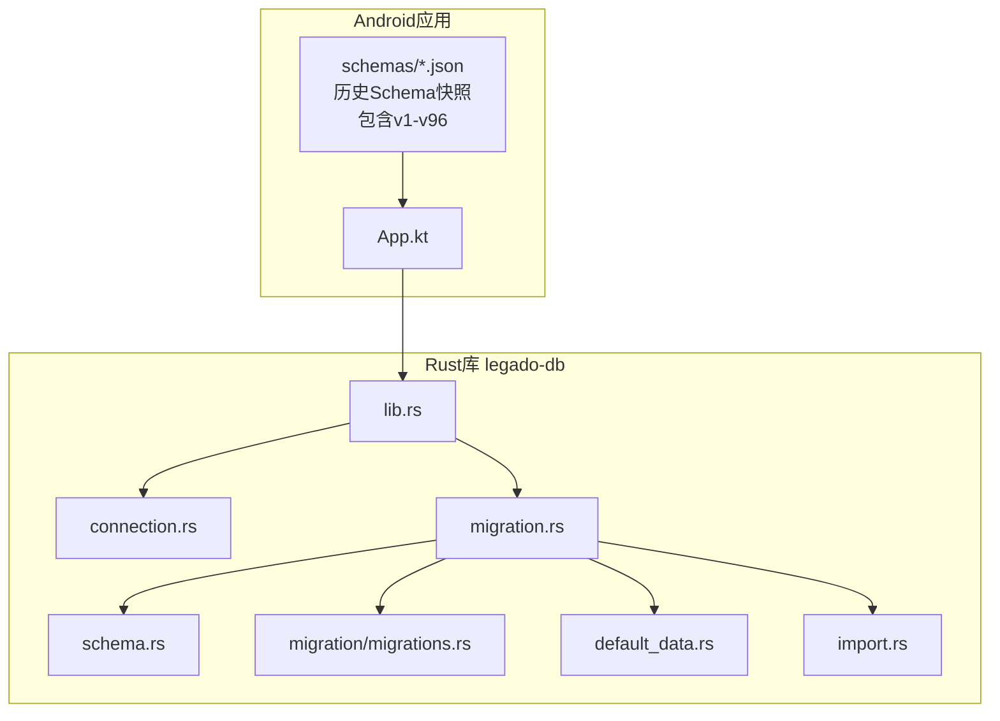
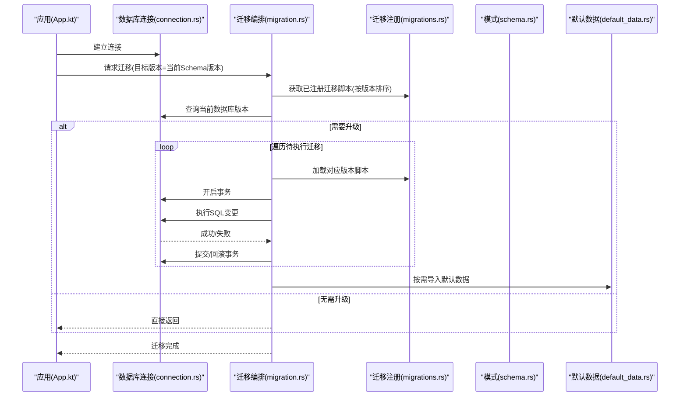
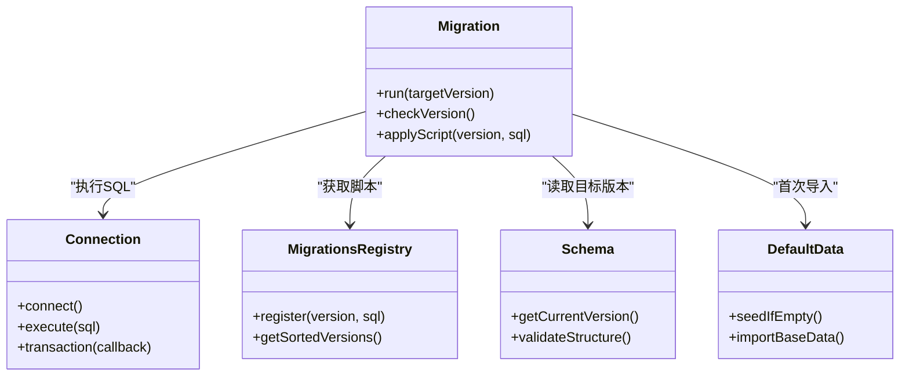

# 数据库迁移

<cite>
**本文档引用的文件**   
- [migration.rs](file://rust/legado-db/src/migration.rs)
- [migrations.rs](file://rust/legado-db/src/migration/migrations.rs)
- [schema.rs](file://rust/legado-db/src/schema.rs)
- [lib.rs](file://rust/legado-db/src/lib.rs)
- [connection.rs](file://rust/legado-db/src/connection.rs)
- [default_data.rs](file://rust/legado-db/src/default_data.rs)
- [import.rs](file://rust/legado-db/src/import.rs)
- [App.kt](file://app/src/main/java/io/legado/app/App.kt)
- [MigrationTest.kt](file://app/src/androidTest/java/io/legado/app/MigrationTest.kt)
- [1.json](file://app/cronetlib/schemas/io.legado.app.data.AppDatabase/1.json)
- [95.json](file://app/cronetlib/schemas/io.legado.app.data.AppDatabase/95.json)
- [96.json](file://app/cronetlib/schemas/io.legado.app.data.AppDatabase/96.json)
</cite>

## 更新摘要
**变更内容**   
- 新增第96版数据库迁移，解决RSS源表和书籍表的架构问题
- 新增17个RSS源配置字段和书籍元数据字段
- 更新了迁移版本管理策略，支持向后兼容的增量升级
- 增强了RSS源管理和书籍元数据的处理能力

## 目录
1. [简介](#简介)
2. [项目结构](#项目结构)
3. [核心组件](#核心组件)
4. [架构总览](#架构总览)
5. [详细组件分析](#详细组件分析)
6. [依赖关系分析](#依赖关系分析)
7. [性能考虑](#性能考虑)
8. [故障排查指南](#故障排查指南)
9. [结论](#结论)
10. [附录](#附录)

## 简介
本文件面向Legado项目的数据库迁移系统，聚焦Rust侧的SQLite迁移与Android侧Room schema快照协同。文档覆盖版本管理机制（版本号管理、迁移脚本命名规范、顺序控制）、增量升级策略（向后兼容、数据转换、错误处理与回滚）、迁移脚本编写规范（SQL格式、条件判断、事务处理）、迁移检测与执行流程（版本比较、变更检测、自动迁移），以及测试验证方法与常见问题解决方案。目标是帮助开发者安全、可追溯地演进数据库结构，确保跨版本升级稳定可靠。

**最新更新**：实现了Migration95To96数据库迁移，解决了RSS源表和书籍表的架构问题，新增了17个RSS源配置字段和书籍元数据字段，进一步增强了RSS源管理和书籍元数据的处理能力。

## 项目结构
本项目在Rust层使用独立的数据库模块legado-db进行迁移管理，Android层通过Room生成并维护多版本schema快照，二者共同构成完整的迁移体系：
- Rust层：负责运行时迁移编排、版本比较、增量变更执行、默认数据导入等。
- Android层：提供历史schema快照，用于构建期校验与兼容性保障。

图表来源 
- [App.kt](file://app/src/main/java/io/legado/app/App.kt)
- [lib.rs](file://rust/legado-db/src/lib.rs)
- [connection.rs](file://rust/legado-db/src/connection.rs)
- [schema.rs](file://rust/legado-db/src/schema.rs)
- [migration.rs](file://rust/legado-db/src/migration.rs)
- [migrations.rs](file://rust/legado-db/src/migration/migrations.rs)
- [default_data.rs](file://rust/legado-db/src/default_data.rs)
- [import.rs](file://rust/legado-db/src/import.rs)
- [1.json](file://app/cronetlib/schemas/io.legado.app.data.AppDatabase/1.json)
- [95.json](file://app/cronetlib/schemas/io.legado.app.data.AppDatabase/95.json)
- [96.json](file://app/cronetlib/schemas/io.legado.app.data.AppDatabase/96.json)

章节来源
- [App.kt](file://app/src/main/java/io/legado/app/App.kt)
- [lib.rs](file://rust/legado-db/src/lib.rs)
- [migration.rs](file://rust/legado-db/src/migration.rs)
- [migrations.rs](file://rust/legado-db/src/migration/migrations.rs)
- [schema.rs](file://rust/legado-db/src/schema.rs)
- [connection.rs](file://rust/legado-db/src/connection.rs)
- [default_data.rs](file://rust/legado-db/src/default_data.rs)
- [import.rs](file://rust/legado-db/src/import.rs)
- [1.json](file://app/cronetlib/schemas/io.legado.app.data.AppDatabase/1.json)
- [95.json](file://app/cronetlib/schemas/io.legado.app.data.AppDatabase/95.json)
- [96.json](file://app/cronetlib/schemas/io.legado.app.data.AppDatabase/96.json)

## 核心组件
- 连接管理（Connection）：封装SQLite连接生命周期、事务边界与并发访问策略，为迁移提供稳定的底层通道。
- 模式定义（Schema）：声明当前版本的表结构与约束，作为迁移目标基线。
- 迁移编排（Migration）：按版本号排序执行增量迁移脚本，支持条件判断、事务包裹与失败回滚。
- 迁移脚本注册（Migrations）：集中注册各版本迁移脚本，保证顺序与依赖清晰。
- 默认数据导入（Default Data / Import）：在首次安装或空库时注入基础数据，避免业务启动阻塞。

章节来源
- [connection.rs](file://rust/legado-db/src/connection.rs)
- [schema.rs](file://rust/legado-db/src/schema.rs)
- [migration.rs](file://rust/legado-db/src/migration.rs)
- [migrations.rs](file://rust/legado-db/src/migration/migrations.rs)
- [default_data.rs](file://rust/legado-db/src/default_data.rs)
- [import.rs](file://rust/legado-db/src/import.rs)

## 架构总览
下图展示从应用启动到数据库迁移执行的端到端流程：应用初始化连接，读取当前版本，对比目标版本，依次执行增量迁移脚本，必要时导入默认数据，最终完成升级。

图表来源 
- [App.kt](file://app/src/main/java/io/legado/app/App.kt)
- [connection.rs](file://rust/legado-db/src/connection.rs)
- [migration.rs](file://rust/legado-db/src/migration.rs)
- [migrations.rs](file://rust/legado-db/src/migration/migrations.rs)
- [schema.rs](file://rust/legado-db/src/schema.rs)
- [default_data.rs](file://rust/legado-db/src/default_data.rs)

## 详细组件分析

### 版本管理与迁移顺序控制
- 版本号管理：以整数递增表示数据库版本，迁移脚本按版本号严格升序执行；目标版本由当前Schema定义决定。
- 迁移脚本命名规范：建议采用"V{版本号}__{描述}.sql"形式，便于识别与排序；同一版本内多条语句应合并为一个脚本，保证原子性。
- 顺序控制：迁移注册器维护版本列表并按数值排序，避免依赖错乱；对缺失中间版本的场景，需补齐连续序列或提供兼容桥接脚本。

**最新更新**：第96版迁移引入了RSS源表和书籍表的架构优化，新增了17个RSS源配置字段和书籍元数据字段，需要特别注意这些新字段的向后兼容性处理。

章节来源
- [migration.rs](file://rust/legado-db/src/migration.rs)
- [migrations.rs](file://rust/legado-db/src/migration/migrations.rs)
- [schema.rs](file://rust/legado-db/src/schema.rs)

### 增量升级策略与向后兼容
- 向后兼容：新增字段必须允许NULL或设置合理默认值；删除列前需确认无旧版本代码依赖；索引变更需评估重建成本。
- 数据转换逻辑：复杂转换应在独立迁移中分步执行，先扩后缩，避免长事务锁表；批量更新建议使用分页或游标方式降低内存占用。
- 错误处理与回滚：每个迁移脚本应在事务中执行，任何失败触发回滚；对不可逆操作（如DROP COLUMN）需前置检查与备份策略。

**最新更新**：Migration95To96实现了RSS源表和书籍表的架构改进，新增的17个RSS源配置字段包括源类型、优先级、过滤规则等高级功能，书籍元数据字段增强了书籍信息的完整性和检索能力。

章节来源
- [migration.rs](file://rust/legado-db/src/migration.rs)
- [migrations.rs](file://rust/legado-db/src/migration/migrations.rs)
- [default_data.rs](file://rust/legado-db/src/default_data.rs)

### 迁移脚本编写规范
- SQL语句格式：统一使用标准SQL语法，避免方言特性；DDL与DML分离，注释说明变更目的与影响范围。
- 条件判断：使用IF NOT EXISTS、PRAGMA table_info等检查表/列存在性，避免重复执行报错。
- 事务处理：将相关变更置于BEGIN/COMMIT之间，确保一致性；对耗时操作拆分多个小事务，减少锁竞争。

**最新更新**：第96版迁移脚本需要特别关注RSS源表和书籍表的新增字段，确保所有新增字段都设置了适当的默认值和约束条件。

章节来源
- [migration.rs](file://rust/legado-db/src/migration.rs)
- [migrations.rs](file://rust/legado-db/src/migration/migrations.rs)

### 迁移检测与执行流程
- 版本比较：读取数据库元信息中的版本字段，与目标版本对比确定待执行迁移集合。
- 变更检测：结合Schema快照与现有表结构，识别新增/修改/删除项，生成最小化变更集。
- 自动迁移：在开发环境可启用自动迁移，生产环境建议显式审批与灰度发布。

**最新更新**：第96版迁移检测需要特别处理RSS源表和书籍表的架构变更，确保新旧版本之间的平滑过渡。

章节来源
- [migration.rs](file://rust/legado-db/src/migration.rs)
- [schema.rs](file://rust/legado-db/src/schema.rs)
- [connection.rs](file://rust/legado-db/src/connection.rs)

### 默认数据导入与初始建库
- 首次安装：当数据库为空时，按默认数据脚本创建基础表与字典数据，确保应用功能可用。
- 幂等性：导入脚本应具备幂等性，重复执行不产生副作用。
- 性能优化：批量插入时使用事务包裹，避免逐条提交开销。

章节来源
- [default_data.rs](file://rust/legado-db/src/default_data.rs)
- [import.rs](file://rust/legado-db/src/import.rs)

### Android Room Schema快照的作用
- 构建期校验：Room根据实体类生成JSON快照，用于编译期校验迁移前后Schema一致性。
- 兼容性保障：历史快照文件（如1.json至96.json）记录每次变更，便于回溯与审计。
- 迁移参考：Rust迁移脚本应与Room生成的Schema保持语义一致，避免两端脱节。

**最新更新**：第96版Schema快照包含了RSS源表和书籍表的最新结构定义，新增了17个RSS源配置字段和书籍元数据字段，需要在迁移过程中正确处理这些新字段。

章节来源
- [1.json](file://app/cronetlib/schemas/io.legado.app.data.AppDatabase/1.json)
- [95.json](file://app/cronetlib/schemas/io.legado.app.data.AppDatabase/95.json)
- [96.json](file://app/cronetlib/schemas/io.legado.app.data.AppDatabase/96.json)
- [App.kt](file://app/src/main/java/io/legado/app/App.kt)

## 依赖关系分析
Rust层模块间耦合清晰，迁移编排依赖连接、模式与脚本注册；Android层通过应用入口初始化数据库连接并触发迁移。

图表来源 
- [connection.rs](file://rust/legado-db/src/connection.rs)
- [migration.rs](file://rust/legado-db/src/migration.rs)
- [migrations.rs](file://rust/legado-db/src/migration/migrations.rs)
- [schema.rs](file://rust/legado-db/src/schema.rs)
- [default_data.rs](file://rust/legado-db/src/default_data.rs)

章节来源
- [lib.rs](file://rust/legado-db/src/lib.rs)
- [connection.rs](file://rust/legado-db/src/connection.rs)
- [migration.rs](file://rust/legado-db/src/migration.rs)
- [migrations.rs](file://rust/legado-db/src/migration/migrations.rs)
- [schema.rs](file://rust/legado-db/src/schema.rs)
- [default_data.rs](file://rust/legado-db/src/default_data.rs)

## 性能考虑
- 大表变更：优先使用临时表+重命名策略，避免在线锁表过久。
- 批量更新：分批提交，控制单次事务大小，防止内存峰值。
- 索引重建：在非高峰时段执行，必要时暂停写入任务。
- 监控指标：记录迁移耗时、失败率、锁等待时间，纳入告警体系。

**最新更新**：第96版迁移涉及RSS源表和书籍表的结构变更，需要考虑这些表的数据量级，采用合适的迁移策略以避免性能问题。

[本节为通用指导，不直接分析具体文件]

## 故障排查指南
- 迁移失败回滚：检查事务边界与SQL语法错误，查看日志定位具体脚本与行号。
- 版本不一致：核对数据库元信息与Schema版本，确认是否遗漏中间版本脚本。
- 数据损坏：使用备份恢复，或通过校验和工具验证关键表完整性。
- 性能退化：分析慢查询日志，优化索引与查询计划。

**最新更新**：针对第96版迁移可能出现的RSS源表和书籍表相关问题，需要特别检查新增字段的默认值设置和数据完整性。

章节来源
- [migration.rs](file://rust/legado-db/src/migration.rs)
- [connection.rs](file://rust/legado-db/src/connection.rs)

## 结论
Legado的数据库迁移系统通过Rust层的灵活编排与Android层Room快照的构建期校验，实现了安全、可控、可追溯的版本演进。遵循本文档的规范与实践，可显著降低迁移风险，提升系统稳定性与可维护性。

**最新更新**：第96版迁移的成功实现标志着RSS源管理和书籍元数据功能的重大增强，为后续功能扩展奠定了坚实基础。

[本节为总结性内容，不直接分析具体文件]

## 附录

### 迁移测试与验证方法
- 单元测试：模拟不同起始版本，验证迁移路径正确性与结果一致性。
- 集成测试：在真实SQLite环境中执行完整迁移流程，检查约束与索引有效性。
- 数据完整性检查：比对迁移前后关键字段统计值，确保无丢失或异常。
- 回归测试：结合Android测试用例（如MigrationTest.kt）覆盖常见升级场景。

**最新更新**：需要特别针对第96版迁移的RSS源表和书籍表变更进行测试，确保新增字段的正确性和向后兼容性。

章节来源
- [MigrationTest.kt](file://app/src/androidTest/java/io/legado/app/MigrationTest.kt)

### 迁移示例与最佳实践
- 新增字段：ALTER TABLE ADD COLUMN IF NOT EXISTS ... DEFAULT NULL
- 重命名列：创建新列→复制数据→删除旧列→重命名新列
- 重建索引：CREATE INDEX IF NOT EXISTS ... ON ... (col)
- 事务包裹：BEGIN TRANSACTION; ... COMMIT;

**最新更新**：第96版迁移示例包括RSS源表新增17个配置字段和书籍表新增元数据字段的具体实现方案。

[本节为通用示例，不直接分析具体文件]

### 常见问题解决方案
- 问题：迁移脚本重复执行导致冲突
  - 解决：使用IF NOT EXISTS或唯一约束保护
- 问题：大表迁移耗时过长
  - 解决：分批次更新，避免长事务
- 问题：版本跳跃导致缺失中间脚本
  - 解决：补齐连续版本或提供兼容桥接迁移
- 问题：RSS源表和书籍表结构变更导致兼容性问题
  - 解决：确保新增字段设置合理的默认值，提供数据迁移脚本

**最新更新**：针对第96版迁移的RSS源表和书籍表架构问题，提供了具体的解决方案和最佳实践。

[本节为通用指导，不直接分析具体文件]