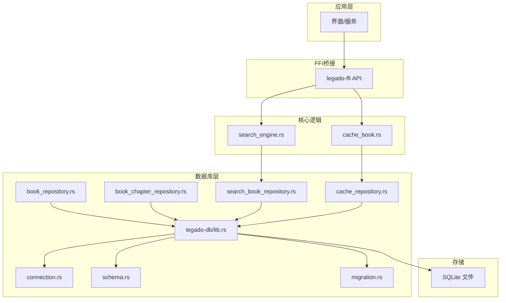
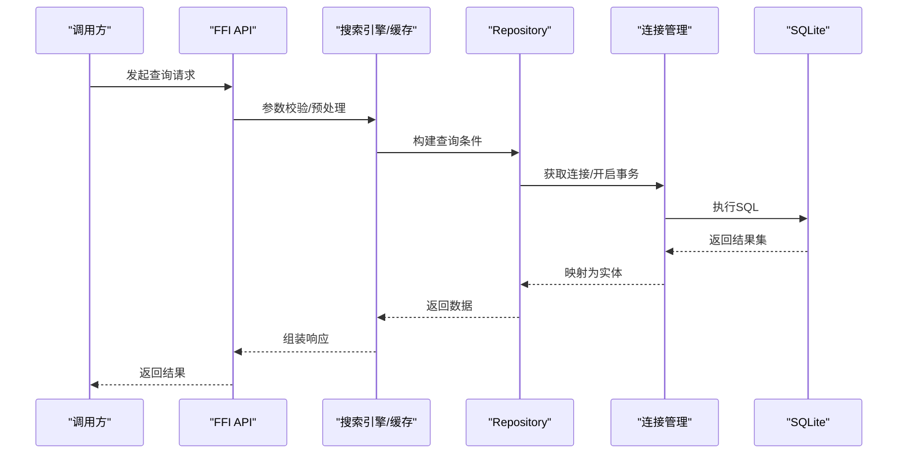

# 查询优化

<cite>
**本文引用的文件**   
- [legado-db/lib.rs](file://rust/legado-db/src/lib.rs)
- [legado-db/connection.rs](file://rust/legado-db/src/connection.rs)
- [legado-db/schema.rs](file://rust/legado-db/src/schema.rs)
- [legado-db/migration.rs](file://rust/legado-db/src/migration.rs)
- [legado-db/repository/book_repository.rs](file://rust/legado-db/src/repository/book_repository.rs)
- [legado-db/repository/book_chapter_repository.rs](file://rust/legado-db/src/repository/book_chapter_repository.rs)
- [legado-db/repository/search_book_repository.rs](file://rust/legado-db/src/repository/search_book_repository.rs)
- [legado-db/repository/cache_repository.rs](file://rust/legado-db/src/repository/cache_repository.rs)
- [legado-core/search_engine.rs](file://rust/legado-core/src/search_engine.rs)
- [legado-core/cache_book.rs](file://rust/legado-core/src/cache_book.rs)
- [legado-ffi/api/search.rs](file://rust/legado-ffi/src/api/search.rs)
</cite>

## 目录
1. [简介](#简介)
2. [项目结构](#项目结构)
3. [核心组件](#核心组件)
4. [架构总览](#架构总览)
5. [详细组件分析](#详细组件分析)
6. [依赖关系分析](#依赖关系分析)
7. [性能考量](#性能考量)
8. [故障排查指南](#故障排查指南)
9. [结论](#结论)
10. [附录](#附录)

## 简介
本文件面向Legado项目的数据库查询优化，聚焦SQLite在Android与Rust层的使用实践。内容涵盖索引设计原则、查询计划分析与执行计划优化、复合索引策略（选择性优先、前缀匹配、覆盖索引）、全文搜索（FTS虚拟表配置、搜索算法与排序优化）、分页查询优化（LIMIT/OFFSET优化、游标分页、延迟加载）、连接池与缓存策略（连接复用、查询缓存、结果集缓存），以及查询性能监控与分析工具使用方法，并附带可复现的优化案例与对比思路。

## 项目结构
本项目在Rust侧通过模块化组织数据库访问：
- legado-db：封装SQLite连接、Schema定义、迁移、Repository层数据访问
- legado-core：业务逻辑与搜索引擎、缓存模型等
- legado-ffi：对外暴露的API桥接层，供上层调用

图表来源
- [legado-db/lib.rs](file://rust/legado-db/src/lib.rs)
- [legado-db/connection.rs](file://rust/legado-db/src/connection.rs)
- [legado-db/schema.rs](file://rust/legado-db/src/schema.rs)
- [legado-db/migration.rs](file://rust/legado-db/src/migration.rs)
- [legado-db/repository/book_repository.rs](file://rust/legado-db/src/repository/book_repository.rs)
- [legado-db/repository/book_chapter_repository.rs](file://rust/legado-db/src/repository/book_chapter_repository.rs)
- [legado-db/repository/search_book_repository.rs](file://rust/legado-db/src/repository/search_book_repository.rs)
- [legado-db/repository/cache_repository.rs](file://rust/legado-db/src/repository/cache_repository.rs)
- [legado-core/search_engine.rs](file://rust/legado-core/src/search_engine.rs)
- [legado-core/cache_book.rs](file://rust/legado-core/src/cache_book.rs)
- [legado-ffi/api/search.rs](file://rust/legado-ffi/src/api/search.rs)

章节来源
- [legado-db/lib.rs](file://rust/legado-db/src/lib.rs)
- [legado-db/connection.rs](file://rust/legado-db/src/connection.rs)
- [legado-db/schema.rs](file://rust/legado-db/src/schema.rs)
- [legado-db/migration.rs](file://rust/legado-db/src/migration.rs)
- [legado-core/search_engine.rs](file://rust/legado-core/src/search_engine.rs)
- [legado-core/cache_book.rs](file://rust/legado-core/src/cache_book.rs)
- [legado-ffi/api/search.rs](file://rust/legado-ffi/src/api/search.rs)

## 核心组件
- 连接管理：负责SQLite连接的创建、复用与事务控制，避免频繁打开/关闭带来的开销
- Schema与迁移：集中定义表结构与索引，确保版本演进一致性
- Repository层：按领域划分的数据访问接口，封装CRUD与复杂查询
- 搜索引擎：整合关键词检索、FTS与排序策略
- 缓存模块：内存/持久化缓存，降低重复查询成本

章节来源
- [legado-db/connection.rs](file://rust/legado-db/src/connection.rs)
- [legado-db/schema.rs](file://rust/legado-db/src/schema.rs)
- [legado-db/migration.rs](file://rust/legado-db/src/migration.rs)
- [legado-db/repository/book_repository.rs](file://rust/legado-db/src/repository/book_repository.rs)
- [legado-db/repository/search_book_repository.rs](file://rust/legado-db/src/repository/search_book_repository.rs)
- [legado-core/search_engine.rs](file://rust/legado-core/src/search_engine.rs)
- [legado-core/cache_book.rs](file://rust/legado-core/src/cache_book.rs)

## 架构总览
下图展示从FFI到Repository再到SQLite的典型查询路径，便于定位优化点。

图表来源
- [legado-ffi/api/search.rs](file://rust/legado-ffi/src/api/search.rs)
- [legado-core/search_engine.rs](file://rust/legado-core/src/search_engine.rs)
- [legado-db/repository/search_book_repository.rs](file://rust/legado-db/src/repository/search_book_repository.rs)
- [legado-db/connection.rs](file://rust/legado-db/src/connection.rs)
- [legado-db/lib.rs](file://rust/legado-db/src/lib.rs)

## 详细组件分析

### 连接管理与连接池
- 目标：减少连接创建/销毁开销，提升并发下的稳定性
- 关键点：
  - 使用连接池或单例连接+读写分离（读多写少场景）
  - 合理设置PRAGMA（如journal_mode、synchronous、cache_size、mmap_size）
  - 事务批量写入，避免逐条提交
  - 超时与重试机制，防止阻塞

章节来源
- [legado-db/connection.rs](file://rust/legado-db/src/connection.rs)
- [legado-db/lib.rs](file://rust/legado-db/src/lib.rs)

### Schema与索引设计
- 目标：以查询模式驱动索引设计，平衡读写性能与存储占用
- 关键原则：
  - 选择性高的列优先（高基数列放在复合索引前列）
  - 前缀匹配优化（WHERE a=? AND b LIKE 'prefix%' 时，建(a,b)索引）
  - 覆盖索引（SELECT仅查索引列，避免回表）
  - 避免过度索引（写放大、空间膨胀）
- 建议：
  - 对高频过滤、排序、分组字段建立索引
  - 使用EXPLAIN QUERY PLAN验证索引命中
  - 定期清理无用索引

章节来源
- [legado-db/schema.rs](file://rust/legado-db/src/schema.rs)
- [legado-db/migration.rs](file://rust/legado-db/src/migration.rs)

### 查询计划分析与执行计划优化
- 分析方法：
  - EXPLAIN QUERY PLAN 查看扫描方式（全表扫描/索引扫描）
  - 关注“SCAN”、“SEARCH”、“USING INDEX”等关键字
  - 结合统计信息（ANALYZE）提升选择度估计准确性
- 优化手段：
  - 改写OR为UNION ALL（在某些情况下更易走索引）
  - 将子查询物化为临时表或CTE
  - 限制返回列，减少IO与CPU消耗
  - 合理使用JOIN顺序与条件

章节来源
- [legado-db/lib.rs](file://rust/legado-db/src/lib.rs)
- [legado-db/repository/book_repository.rs](file://rust/legado-db/src/repository/book_repository.rs)

### 复合索引策略
- 选择性优先：将区分度高的列置于前面，提高过滤效率
- 前缀匹配：WHERE a=? AND b LIKE 'xxx%' 时，(a,b)索引能同时满足等值与范围
- 覆盖索引：SELECT a,b FROM t WHERE a=?; 若索引包含a,b则无需回表
- 排序优化：ORDER BY与索引前缀一致可减少额外排序

章节来源
- [legado-db/schema.rs](file://rust/legado-db/src/schema.rs)
- [legado-db/repository/book_chapter_repository.rs](file://rust/legado-db/src/repository/book_chapter_repository.rs)

### 全文搜索（FTS）
- 适用场景：文本模糊搜索、分词匹配、相关性排序
- 实现要点：
  - 使用FTS虚拟表（如FTS5）承载索引与搜索
  - 配置tokenizer（如unicode61）与语言支持
  - 搜索结果排序：结合rank函数与业务权重
  - 增量更新：维护主表与FTS同步
- 优化技巧：
  - 限定搜索范围（先主键过滤再FTS）
  - 分页采用游标式（基于last_id）避免OFFSET深翻页
  - 合并多次查询，减少往返

章节来源
- [legado-db/repository/search_book_repository.rs](file://rust/legado-db/src/repository/search_book_repository.rs)
- [legado-core/search_engine.rs](file://rust/legado-core/src/search_engine.rs)
- [legado-ffi/api/search.rs](file://rust/legado-ffi/src/api/search.rs)

### 分页查询优化
- LIMIT/OFFSET优化：
  - 大偏移量时改用“游标分页”（基于上一页最后一条记录的ID或时间戳）
  - 配合索引进行高效定位
- 延迟加载：
  - 首屏只加载必要字段，详情按需加载
- 预取策略：
  - 预测下一页数据提前加载，提升交互流畅度

章节来源
- [legado-db/repository/book_chapter_repository.rs](file://rust/legado-db/src/repository/book_chapter_repository.rs)
- [legado-core/cache_book.rs](file://rust/legado-core/src/cache_book.rs)

### 连接池与缓存策略
- 连接复用：
  - 短生命周期任务复用连接，长事务独占连接
  - 读写分离（读库连接池+写库连接）
- 查询缓存：
  - 热点查询结果缓存（内存LRU/磁盘）
  - 缓存失效策略（TTL、事件触发）
- 结果集缓存：
  - 列表页缓存，详情页直连DB
  - 跨进程共享缓存（注意一致性）

章节来源
- [legado-db/connection.rs](file://rust/legado-db/src/connection.rs)
- [legado-core/cache_book.rs](file://rust/legado-core/src/cache_book.rs)
- [legado-db/repository/cache_repository.rs](file://rust/legado-db/src/repository/cache_repository.rs)

## 依赖关系分析

图表来源
- [legado-ffi/api/search.rs](file://rust/legado-ffi/src/api/search.rs)
- [legado-core/search_engine.rs](file://rust/legado-core/src/search_engine.rs)
- [legado-db/repository/search_book_repository.rs](file://rust/legado-db/src/repository/search_book_repository.rs)
- [legado-db/lib.rs](file://rust/legado-db/src/lib.rs)
- [legado-db/connection.rs](file://rust/legado-db/src/connection.rs)

章节来源
- [legado-ffi/api/search.rs](file://rust/legado-ffi/src/api/search.rs)
- [legado-core/search_engine.rs](file://rust/legado-core/src/search_engine.rs)
- [legado-db/repository/search_book_repository.rs](file://rust/legado-db/src/repository/search_book_repository.rs)
- [legado-db/lib.rs](file://rust/legado-db/src/lib.rs)
- [legado-db/connection.rs](file://rust/legado-db/src/connection.rs)

## 性能考量
- 索引命中率与选择度：通过EXPLAIN与统计信息评估
- IO与CPU权衡：覆盖索引减少回表；避免不必要的计算列
- 事务粒度：批量写入用事务包裹，减少日志刷盘次数
- 缓存命中率：热点数据缓存显著降低DB压力
- 分页深度：避免大OFFSET，使用游标分页
- 全文搜索：FTS5分词与排序策略直接影响体验

[本节为通用指导，不直接分析具体文件]

## 故障排查指南
- 慢查询定位：
  - 启用SQLite日志或使用EXPLAIN QUERY PLAN
  - 检查是否出现全表扫描、临时表、文件排序
- 索引问题：
  - 确认WHERE/JOIN/ORDER BY字段是否与索引前缀匹配
  - 统计信息过期导致选择度估计偏差，必要时ANALYZE
- 连接问题：
  - 连接池耗尽、死锁、超时
  - 调整PRAGMA与连接池大小
- 缓存一致性：
  - 缓存未失效导致脏读
  - 引入版本号或事件通知

章节来源
- [legado-db/connection.rs](file://rust/legado-db/src/connection.rs)
- [legado-db/lib.rs](file://rust/legado-db/src/lib.rs)

## 结论
Legado项目在SQLite查询优化上围绕“连接管理、索引设计、查询计划、全文搜索、分页与缓存”形成闭环。通过Repository分层与核心搜索/缓存模块的配合，能够在保证一致性的前提下显著提升查询性能。建议持续跟踪EXPLAIN输出与线上指标，迭代优化索引与查询逻辑。

[本节为总结性内容，不直接分析具体文件]

## 附录

### 优化案例与对比思路
- 案例一：书籍列表分页
  - 优化前：LIMIT/OFFSET大偏移导致全表扫描
  - 优化后：基于last_id游标分页，配合(book_id, update_time)索引
  - 预期效果：首尾翻页耗时下降明显
- 案例二：书名模糊搜索
  - 优化前：LIKE '%keyword%' 全表扫描
  - 优化后：FTS5分词索引 + rank排序 + 游标分页
  - 预期效果：搜索响应时间稳定，结果相关性提升
- 案例三：章节列表加载
  - 优化前：每次加载全部字段
  - 优化后：延迟加载正文，首屏仅加载标题与序号
  - 预期效果：首屏渲染更快，内存占用更低

[本节为概念性说明，不直接分析具体文件]

### 监控与分析工具
- SQLite内置：
  - EXPLAIN QUERY PLAN：查看执行计划
  - ANALYZE：更新统计信息
  - PRAGMA：journal_mode、synchronous、cache_size、mmap_size等
- 应用层：
  - 记录慢查询SQL与耗时
  - 缓存命中率与连接池状态监控
  - 错误码与异常堆栈收集

[本节为通用指导，不直接分析具体文件]