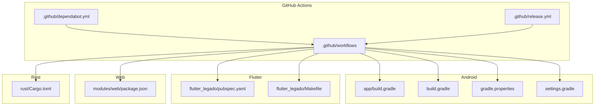
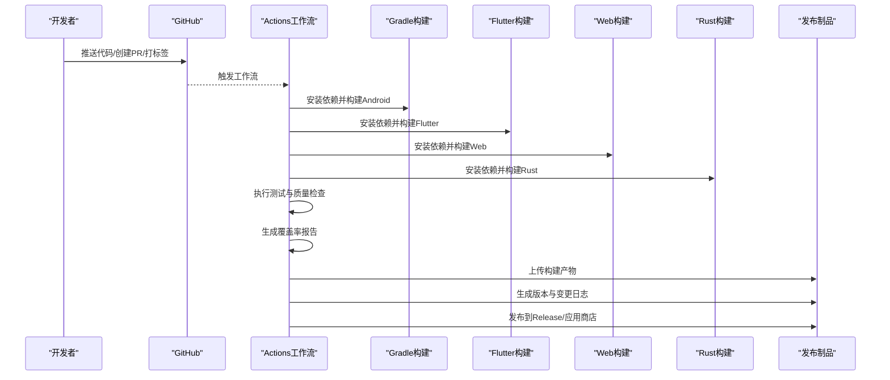
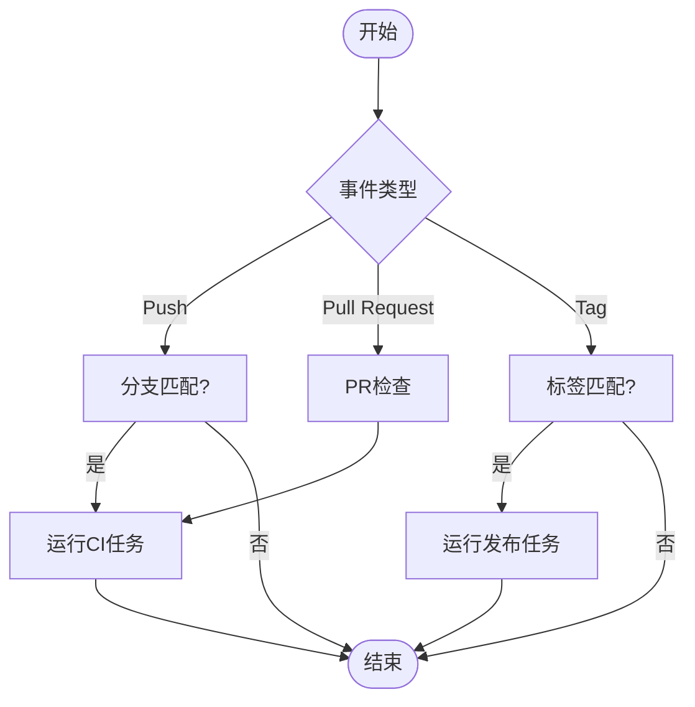
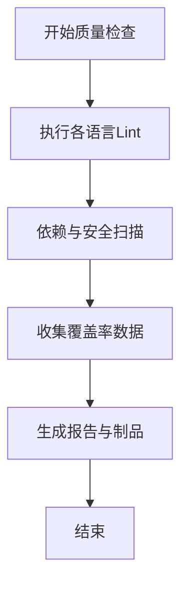
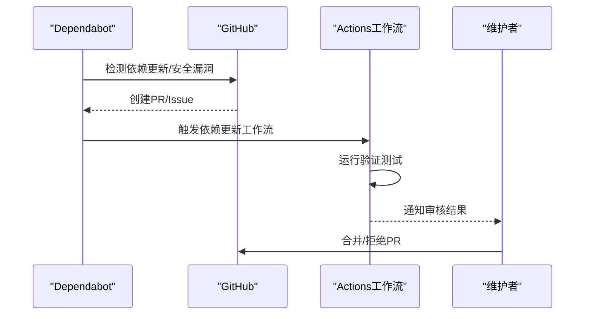
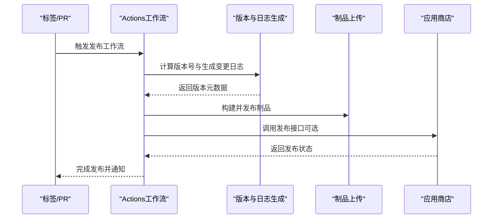
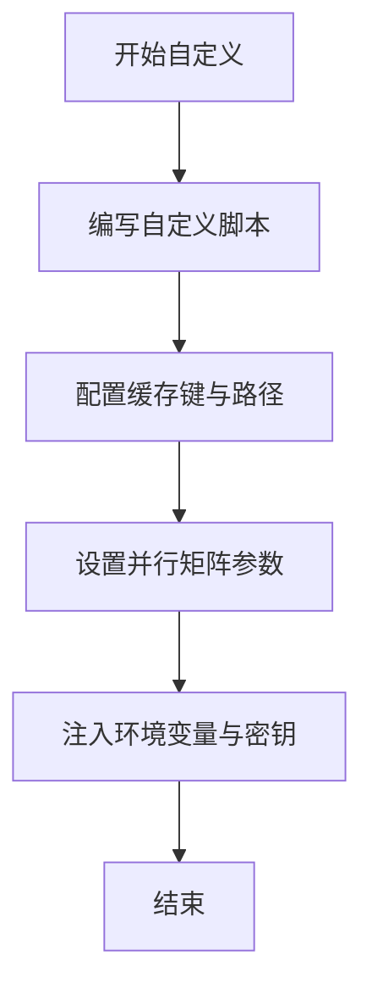
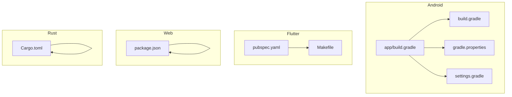

# CI/CD流水线

<cite>
**本文引用的文件**   
- [.github/workflows](file://.github/workflows)
- [.github/dependabot.yml](file://.github/dependabot.yml)
- [.github/release.yml](file://.github/release.yml)
- [app/build.gradle](file://app/build.gradle)
- [build.gradle](file://build.gradle)
- [gradle.properties](file://gradle.properties)
- [settings.gradle](file://settings.gradle)
- [Makefile](file://Makefile)
- [flutter_legado/pubspec.yaml](file://flutter_legado/pubspec.yaml)
- [flutter_legado/Makefile](file://flutter_legado/Makefile)
- [modules/web/package.json](file://modules/web/package.json)
- [rust/Cargo.toml](file://rust/Cargo.toml)
</cite>

## 目录
1. [简介](#简介)
2. [项目结构](#项目结构)
3. [核心组件](#核心组件)
4. [架构总览](#架构总览)
5. [详细组件分析](#详细组件分析)
6. [依赖分析](#依赖分析)
7. [性能考虑](#性能考虑)
8. [故障排除指南](#故障排除指南)
9. [结论](#结论)
10. [附录](#附录)

## 简介
本文件面向Legado项目的CI/CD流水线，系统化梳理GitHub Actions工作流、持续集成策略、依赖更新管理、自动化发布流程以及可观测性与告警配置。文档兼顾技术深度与可读性，帮助开发者快速理解并扩展流水线能力，包括构建、测试、代码质量检查、版本发布、覆盖率统计、缓存优化与并行执行等。

## 项目结构
仓库采用多模块工程组织：Android应用（app）、Flutter跨平台前端（flutter_legado）、Web管理端（modules/web）、Rust核心库（rust）以及Gradle根工程。CI/CD相关配置集中在.github目录，包含工作流定义、依赖更新策略与发布模板。



**图示来源** 
- [.github/workflows](file://.github/workflows)
- [.github/dependabot.yml](file://.github/dependabot.yml)
- [.github/release.yml](file://.github/release.yml)
- [app/build.gradle](file://app/build.gradle)
- [build.gradle](file://build.gradle)
- [gradle.properties](file://gradle.properties)
- [settings.gradle](file://settings.gradle)
- [flutter_legado/pubspec.yaml](file://flutter_legado/pubspec.yaml)
- [flutter_legado/Makefile](file://flutter_legado/Makefile)
- [modules/web/package.json](file://modules/web/package.json)
- [rust/Cargo.toml](file://rust/Cargo.toml)

**章节来源**
- [.github/workflows](file://.github/workflows)
- [.github/dependabot.yml](file://.github/dependabot.yml)
- [.github/release.yml](file://.github/release.yml)
- [app/build.gradle](file://app/build.gradle)
- [build.gradle](file://build.gradle)
- [gradle.properties](file://gradle.properties)
- [settings.gradle](file://settings.gradle)
- [flutter_legado/pubspec.yaml](file://flutter_legado/pubspec.yaml)
- [flutter_legado/Makefile](file://flutter_legado/Makefile)
- [modules/web/package.json](file://modules/web/package.json)
- [rust/Cargo.toml](file://rust/Cargo.toml)

## 核心组件
- GitHub Actions工作流：定义触发条件、环境准备、构建任务、测试执行、质量检查、产物归档与发布。
- Gradle构建系统：Android与Kotlin模块的编译、打包、签名与测试。
- Flutter构建：跨平台应用构建与测试。
- Web构建：前端资源构建与静态部署。
- Rust构建：核心库编译与测试。
- 依赖管理：Dependabot自动扫描与升级。
- 发布流程：版本号管理、变更日志生成、制品上传与应用商店发布。

**章节来源**
- [app/build.gradle](file://app/build.gradle)
- [build.gradle](file://build.gradle)
- [gradle.properties](file://gradle.properties)
- [settings.gradle](file://settings.gradle)
- [flutter_legado/pubspec.yaml](file://flutter_legado/pubspec.yaml)
- [flutter_legado/Makefile](file://flutter_legado/Makefile)
- [modules/web/package.json](file://modules/web/package.json)
- [rust/Cargo.toml](file://rust/Cargo.toml)

## 架构总览
下图展示从代码提交到发布的全链路流程：触发器（分支推送、PR、标签）驱动Actions运行，依次执行依赖安装、构建、测试、质量检查、覆盖率统计、制品归档；在满足发布条件时自动生成版本、生成变更日志并上传至Release或应用商店。



**图示来源** 
- [.github/workflows](file://.github/workflows)
- [app/build.gradle](file://app/build.gradle)
- [flutter_legado/pubspec.yaml](file://flutter_legado/pubspec.yaml)
- [modules/web/package.json](file://modules/web/package.json)
- [rust/Cargo.toml](file://rust/Cargo.toml)

## 详细组件分析

### 工作流触发与分支策略
- 触发条件：支持push、pull_request、workflow_dispatch、release事件；可按分支过滤（如main、develop、feature/*）。
- 分支管理：主干分支保护规则、PR必须通过检查才能合并；特性分支独立构建与测试。
- PR检查：运行轻量级构建与测试，确保代码质量与稳定性。



**图示来源** 
- [.github/workflows](file://.github/workflows)

**章节来源**
- [.github/workflows](file://.github/workflows)

### 构建与测试执行
- Android构建：使用Gradle进行编译、打包、签名与单元测试；可选集成Instrumented测试。
- Flutter构建：解析pubspec依赖，执行构建与单元测试；可输出多平台产物。
- Web构建：基于package.json脚本进行依赖安装与构建，产出静态资源。
- Rust构建：基于Cargo进行编译与测试，必要时交叉编译目标平台。
- 并行执行：将不同模块的构建与测试并行化，缩短整体耗时。

```mermaid
sequenceDiagram
participant WA as "Actions工作流"
participant AND as "Android构建"
participant FL as "Flutter构建"
participant WEB as "Web构建"
participant RS as "Rust构建"
WA->>AND : 并行启动Android构建与测试
WA->>FL : 并行启动Flutter构建与测试
WA->>WEB : 并行启动Web构建
WA->>RS : 并行启动Rust构建与测试
AND-->>WA : 返回构建结果与测试报告
FL-->>WA : 返回构建结果与测试报告
WEB-->>WA : 返回构建产物
RS-->>WA : 返回构建结果与测试报告
```

**图示来源** 
- [app/build.gradle](file://app/build.gradle)
- [flutter_legado/pubspec.yaml](file://flutter_legado/pubspec.yaml)
- [modules/web/package.json](file://modules/web/package.json)
- [rust/Cargo.toml](file://rust/Cargo.toml)

**章节来源**
- [app/build.gradle](file://app/build.gradle)
- [flutter_legado/pubspec.yaml](file://flutter_legado/pubspec.yaml)
- [modules/web/package.json](file://modules/web/package.json)
- [rust/Cargo.toml](file://rust/Cargo.toml)

### 代码质量检查与覆盖率统计
- 代码风格与静态分析：集成Kotlin/Java、Dart、TypeScript/Rust的lint工具，统一规范。
- 安全扫描：依赖漏洞扫描（如npm audit、cargo-audit、Gradle安全插件），阻断高危问题。
- 覆盖率统计：收集单元测试与集成测试覆盖率，生成HTML报告并上传为制品。



**图示来源** 
- [.github/workflows](file://.github/workflows)

**章节来源**
- [.github/workflows](file://.github/workflows)

### 依赖更新管理与安全扫描
- Dependabot配置：按包管理器（Gradle、npm、Cargo、pub）监控依赖更新，自动创建PR。
- 安全策略：对高危漏洞立即拦截，低危漏洞定期提醒；支持白名单与例外处理。
- 版本升级：遵循语义化版本，主版本升级需人工审核；补丁与次要版本可自动合并。



**图示来源** 
- [.github/dependabot.yml](file://.github/dependabot.yml)
- [.github/workflows](file://.github/workflows)

**章节来源**
- [.github/dependabot.yml](file://.github/dependabot.yml)
- [.github/workflows](file://.github/workflows)

### 自动化发布流程
- 版本管理：基于Git标签或PR标题约定生成版本号；支持预发布与稳定版区分。
- 变更日志：根据提交信息与PR描述自动生成变更日志，分类功能、修复与破坏性变更。
- 制品发布：上传APK/IPA/Web包与Rust库至Release；可选对接应用商店API进行发布。
- 回滚策略：保留历史版本与校验和，支持一键回滚。



**图示来源** 
- [.github/release.yml](file://.github/release.yml)
- [.github/workflows](file://.github/workflows)

**章节来源**
- [.github/release.yml](file://.github/release.yml)
- [.github/workflows](file://.github/workflows)

### 工作流自定义与扩展
- 自定义脚本：在步骤中嵌入Shell/PowerShell脚本，实现特定逻辑（如环境准备、数据预处理）。
- 缓存策略：缓存Gradle、npm、Cargo、pub依赖与构建产物，显著加速重复构建。
- 并行执行：将独立任务拆分为矩阵或多作业并行执行，提升吞吐。
- 环境变量与密钥：使用GitHub Secrets管理敏感信息，避免硬编码。



**图示来源** 
- [.github/workflows](file://.github/workflows)

**章节来源**
- [.github/workflows](file://.github/workflows)

## 依赖分析
- 模块耦合：Android、Flutter、Web、Rust之间通过制品与API契约解耦；CI负责各自构建与测试。
- 外部依赖：Gradle插件、npm包、Cargo crate、Flutter插件的版本锁定与更新策略。
- 潜在风险：循环依赖、版本冲突、第三方服务不可用；通过依赖快照与隔离构建缓解。



**图示来源** 
- [app/build.gradle](file://app/build.gradle)
- [build.gradle](file://build.gradle)
- [gradle.properties](file://gradle.properties)
- [settings.gradle](file://settings.gradle)
- [flutter_legado/pubspec.yaml](file://flutter_legado/pubspec.yaml)
- [flutter_legado/Makefile](file://flutter_legado/Makefile)
- [modules/web/package.json](file://modules/web/package.json)
- [rust/Cargo.toml](file://rust/Cargo.toml)

**章节来源**
- [app/build.gradle](file://app/build.gradle)
- [build.gradle](file://build.gradle)
- [gradle.properties](file://gradle.properties)
- [settings.gradle](file://settings.gradle)
- [flutter_legado/pubspec.yaml](file://flutter_legado/pubspec.yaml)
- [flutter_legado/Makefile](file://flutter_legado/Makefile)
- [modules/web/package.json](file://modules/web/package.json)
- [rust/Cargo.toml](file://rust/Cargo.toml)

## 性能考虑
- 构建缓存：利用GitHub Actions缓存机制存储依赖与中间产物，减少下载与编译时间。
- 并行化：将不同模块的构建与测试并行执行，充分利用Runner资源。
- 增量构建：仅重新构建变更模块，跳过未改动部分。
- 资源限制：合理设置Runner规格与超时，避免资源争用与失败。

[本节为通用指导，不直接分析具体文件]

## 故障排除指南
- 常见错误：依赖下载失败、签名证书缺失、环境变量未配置、测试超时。
- 诊断方法：查看Actions日志、导出构建产物、启用调试模式、复现本地环境。
- 恢复策略：清理缓存、重试失败步骤、降级依赖版本、隔离问题模块。
- 监控告警：配置通知渠道（邮件、Slack、企业微信），关键失败即时告警。

**章节来源**
- [.github/workflows](file://.github/workflows)

## 结论
本CI/CD流水线覆盖从代码提交到发布的完整生命周期，结合多模块构建、并行执行、依赖管理与自动化发布，保障Legado项目的质量与交付效率。通过缓存优化、质量门禁与监控告警，进一步提升稳定性与可维护性。建议持续迭代工作流配置，适配业务需求与技术演进。

[本节为总结性内容，不直接分析具体文件]

## 附录
- 最佳实践：
  - 使用语义化版本与清晰的提交规范，便于自动生成变更日志。
  - 将敏感信息存入GitHub Secrets，避免泄露。
  - 定期审查Dependabot PR，平衡安全性与兼容性。
  - 为关键任务添加重试与超时控制，提高鲁棒性。
- 参考命令与路径：
  - Gradle构建与测试：参见[app/build.gradle](file://app/build.gradle)、[build.gradle](file://build.gradle)。
  - Flutter构建与测试：参见[flutter_legado/pubspec.yaml](file://flutter_legado/pubspec.yaml)、[flutter_legado/Makefile](file://flutter_legado/Makefile)。
  - Web构建：参见[modules/web/package.json](file://modules/web/package.json)。
  - Rust构建与测试：参见[rust/Cargo.toml](file://rust/Cargo.toml)。
  - 工作流与依赖管理：参见[.github/workflows](file://.github/workflows)、[.github/dependabot.yml](file://.github/dependabot.yml)、[.github/release.yml](file://.github/release.yml)。

**章节来源**
- [app/build.gradle](file://app/build.gradle)
- [build.gradle](file://build.gradle)
- [flutter_legado/pubspec.yaml](file://flutter_legado/pubspec.yaml)
- [flutter_legado/Makefile](file://flutter_legado/Makefile)
- [modules/web/package.json](file://modules/web/package.json)
- [rust/Cargo.toml](file://rust/Cargo.toml)
- [.github/workflows](file://.github/workflows)
- [.github/dependabot.yml](file://.github/dependabot.yml)
- [.github/release.yml](file://.github/release.yml)