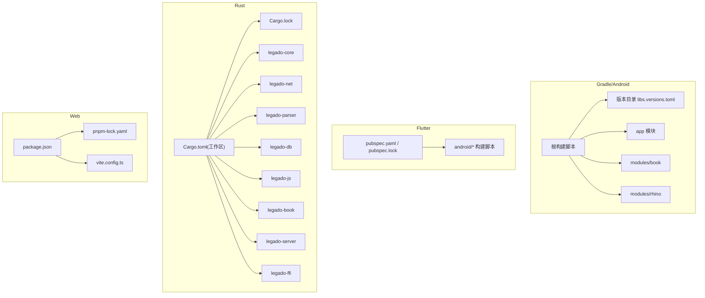
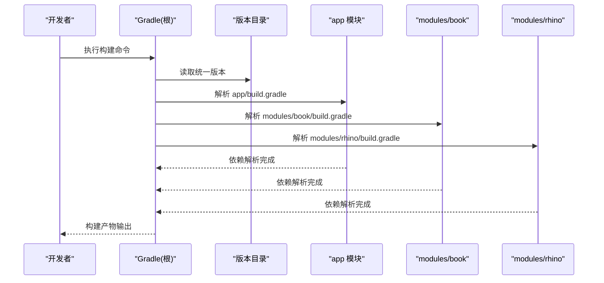
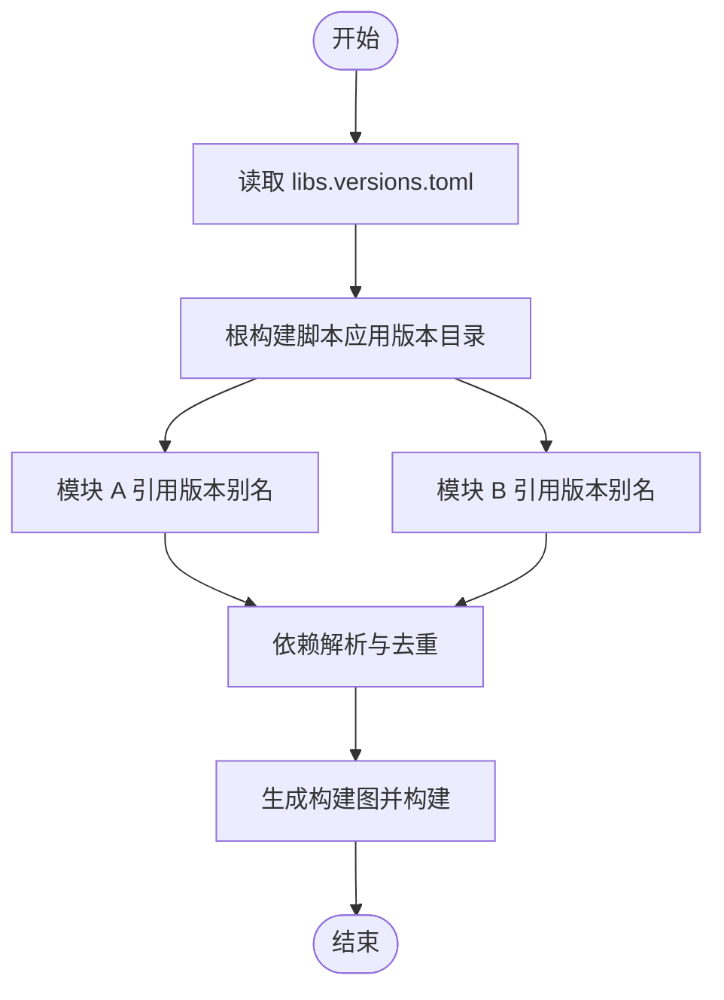
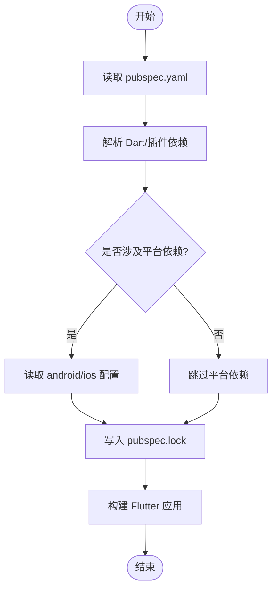
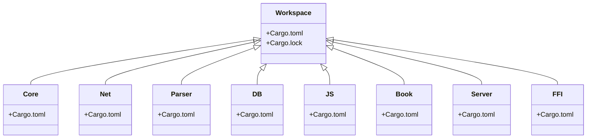
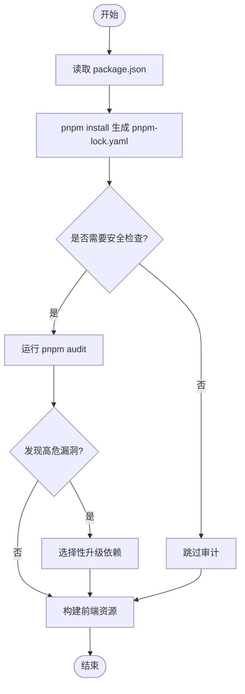
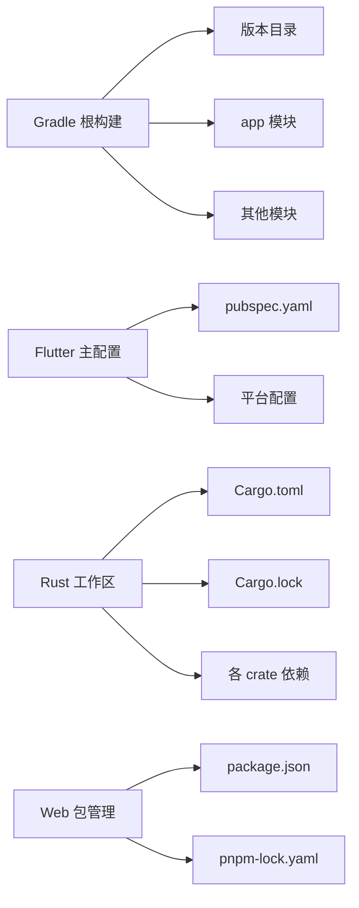

# 依赖管理

<cite>
**本文引用的文件**   
- [gradle/libs.versions.toml](file://gradle/libs.versions.toml)
- [build.gradle](file://build.gradle)
- [settings.gradle](file://settings.gradle)
- [app/build.gradle](file://app/build.gradle)
- [modules/book/build.gradle](file://modules/book/build.gradle)
- [modules/rhino/build.gradle](file://modules/rhino/build.gradle)
- [flutter_legado/pubspec.yaml](file://flutter_legado/pubspec.yaml)
- [flutter_legado/pubspec.lock](file://flutter_legado/pubspec.lock)
- [flutter_legado/android/build.gradle.kts](file://flutter_legado/android/build.gradle.kts)
- [flutter_legado/android/app/build.gradle.kts](file://flutter_legado/android/app/build.gradle.kts)
- [rust/Cargo.toml](file://rust/Cargo.toml)
- [rust/Cargo.lock](file://rust/Cargo.lock)
- [rust/legado-core/Cargo.toml](file://rust/legado-core/Cargo.toml)
- [rust/legado-net/Cargo.toml](file://rust/legado-net/Cargo.toml)
- [rust/legado-parser/Cargo.toml](file://rust/legado-parser/Cargo.toml)
- [rust/legado-db/Cargo.toml](file://rust/legado-db/Cargo.toml)
- [rust/legado-js/Cargo.toml](file://rust/legado-js/Cargo.toml)
- [rust/legado-book/Cargo.toml](file://rust/legado-book/Cargo.toml)
- [rust/legado-server/Cargo.toml](file://rust/legado-server/Cargo.toml)
- [rust/legado-ffi/Cargo.toml](file://rust/legado-ffi/Cargo.toml)
- [web/package.json](file://web/package.json)
- [web/pnpm-lock.yaml](file://web/pnpm-lock.yaml)
- [web/vite.config.ts](file://web/vite.config.ts)
- [.github/dependabot.yml](file://.github/dependabot.yml)
</cite>

## 目录
1. [简介](#简介)
2. [项目结构](#项目结构)
3. [核心组件](#核心组件)
4. [架构总览](#架构总览)
5. [详细组件分析](#详细组件分析)
6. [依赖关系分析](#依赖关系分析)
7. [性能与优化](#性能与优化)
8. [故障排查指南](#故障排查指南)
9. [结论](#结论)
10. [附录](#附录)

## 简介
本仓库是一个多语言、多模块的工程，包含 Android（Gradle/Kotlin）、Flutter、Rust（Cargo）以及 Web（pnpm/Vite）等子系统。依赖管理的目标是：
- 统一版本来源，避免“各自为政”的版本漂移
- 锁定依赖树，确保可重复构建与发布
- 提供冲突解决策略与安全更新流程
- 兼顾本地开发与 CI 的稳定性与效率

## 项目结构
从依赖管理视角，仓库按子系统划分：
- Gradle/Android：根级版本目录 + 各模块 build 脚本
- Flutter：pubspec.yaml 及平台特定配置
- Rust：工作区 Cargo.toml 与各 crate 的依赖声明
- Web：package.json 与 pnpm 锁文件
- 自动化：Dependabot 安全与版本更新

**图表来源** 
- [build.gradle](file://build.gradle)
- [settings.gradle](file://settings.gradle)
- [gradle/libs.versions.toml](file://gradle/libs.versions.toml)
- [flutter_legado/pubspec.yaml](file://flutter_legado/pubspec.yaml)
- [flutter_legado/pubspec.lock](file://flutter_legado/pubspec.lock)
- [flutter_legado/android/build.gradle.kts](file://flutter_legado/android/build.gradle.kts)
- [flutter_legado/android/app/build.gradle.kts](file://flutter_legado/android/app/build.gradle.kts)
- [rust/Cargo.toml](file://rust/Cargo.toml)
- [rust/Cargo.lock](file://rust/Cargo.lock)
- [web/package.json](file://web/package.json)
- [web/pnpm-lock.yaml](file://web/pnpm-lock.yaml)
- [web/vite.config.ts](file://web/vite.config.ts)

**章节来源**
- [build.gradle](file://build.gradle)
- [settings.gradle](file://settings.gradle)

## 核心组件
- Gradle 版本统一管理：通过版本目录集中声明版本号，模块按需引用，保证一致性
- Flutter 依赖：通过 pubspec.yaml 声明 Dart/插件依赖，平台相关依赖在 android/ios 等子工程维护
- Rust 包管理：工作区模式组织多 crate，Cargo.lock 锁定精确版本
- Web 依赖：pnpm 作为包管理器，package.json 声明依赖，pnpm-lock.yaml 锁定版本

**章节来源**
- [gradle/libs.versions.toml](file://gradle/libs.versions.toml)
- [flutter_legado/pubspec.yaml](file://flutter_legado/pubspec.yaml)
- [flutter_legado/pubspec.lock](file://flutter_legado/pubspec.lock)
- [rust/Cargo.toml](file://rust/Cargo.toml)
- [rust/Cargo.lock](file://rust/Cargo.lock)
- [web/package.json](file://web/package.json)
- [web/pnpm-lock.yaml](file://web/pnpm-lock.yaml)

## 架构总览
下图展示各子系统的依赖管理与构建入口之间的关系。

**图表来源** 
- [build.gradle](file://build.gradle)
- [settings.gradle](file://settings.gradle)
- [gradle/libs.versions.toml](file://gradle/libs.versions.toml)
- [app/build.gradle](file://app/build.gradle)
- [modules/book/build.gradle](file://modules/book/build.gradle)
- [modules/rhino/build.gradle](file://modules/rhino/build.gradle)

## 详细组件分析

### Gradle 版本统一管理
- 版本目录位置：gradle/libs.versions.toml
- 使用方式：根构建脚本启用版本目录，模块通过版本别名引用依赖，避免硬编码版本号
- 优势：集中管理、减少冲突、便于批量升级

建议实践
- 所有第三方库版本号集中在版本目录中
- 模块仅引用版本别名，不直接写版本号
- 对关键依赖添加注释说明用途与升级注意事项

**图表来源** 
- [gradle/libs.versions.toml](file://gradle/libs.versions.toml)
- [build.gradle](file://build.gradle)
- [app/build.gradle](file://app/build.gradle)
- [modules/book/build.gradle](file://modules/book/build.gradle)
- [modules/rhino/build.gradle](file://modules/rhino/build.gradle)

**章节来源**
- [gradle/libs.versions.toml](file://gradle/libs.versions.toml)
- [build.gradle](file://build.gradle)
- [settings.gradle](file://settings.gradle)
- [app/build.gradle](file://app/build.gradle)
- [modules/book/build.gradle](file://modules/book/build.gradle)
- [modules/rhino/build.gradle](file://modules/rhino/build.gradle)

### Flutter 依赖管理
- 主配置：flutter_legado/pubspec.yaml
- 锁定文件：flutter_legado/pubspec.lock
- 平台依赖：android/ios 等平台特定配置由各自工程维护

建议实践
- 将公共依赖集中在 pubspec.yaml，平台相关依赖放在对应平台配置
- 使用 pub upgrade --dry-run 预览变更，再决定是否升级
- 对关键插件进行兼容性测试，避免破坏性升级

**图表来源** 
- [flutter_legado/pubspec.yaml](file://flutter_legado/pubspec.yaml)
- [flutter_legado/pubspec.lock](file://flutter_legado/pubspec.lock)
- [flutter_legado/android/build.gradle.kts](file://flutter_legado/android/build.gradle.kts)
- [flutter_legado/android/app/build.gradle.kts](file://flutter_legado/android/app/build.gradle.kts)

**章节来源**
- [flutter_legado/pubspec.yaml](file://flutter_legado/pubspec.yaml)
- [flutter_legado/pubspec.lock](file://flutter_legado/pubspec.lock)
- [flutter_legado/android/build.gradle.kts](file://flutter_legado/android/build.gradle.kts)
- [flutter_legado/android/app/build.gradle.kts](file://flutter_legado/android/app/build.gradle.kts)

### Rust 包管理（Cargo）
- 工作区：rust/Cargo.toml 定义多 crate 工作区
- 锁定文件：rust/Cargo.lock 锁定精确版本
- 各 crate：legado-core/net/parser/db/js/book/server/ffi 等独立声明依赖

建议实践
- 在工作区统一约束版本范围，避免跨 crate 版本不一致
- 使用 cargo update 谨慎升级，配合测试验证
- 对安全敏感依赖开启定期扫描

**图表来源** 
- [rust/Cargo.toml](file://rust/Cargo.toml)
- [rust/Cargo.lock](file://rust/Cargo.lock)
- [rust/legado-core/Cargo.toml](file://rust/legado-core/Cargo.toml)
- [rust/legado-net/Cargo.toml](file://rust/legado-net/Cargo.toml)
- [rust/legado-parser/Cargo.toml](file://rust/legado-parser/Cargo.toml)
- [rust/legado-db/Cargo.toml](file://rust/legado-db/Cargo.toml)
- [rust/legado-js/Cargo.toml](file://rust/legado-js/Cargo.toml)
- [rust/legado-book/Cargo.toml](file://rust/legado-book/Cargo.toml)
- [rust/legado-server/Cargo.toml](file://rust/legado-server/Cargo.toml)
- [rust/legado-ffi/Cargo.toml](file://rust/legado-ffi/Cargo.toml)

**章节来源**
- [rust/Cargo.toml](file://rust/Cargo.toml)
- [rust/Cargo.lock](file://rust/Cargo.lock)
- [rust/legado-core/Cargo.toml](file://rust/legado-core/Cargo.toml)
- [rust/legado-net/Cargo.toml](file://rust/legado-net/Cargo.toml)
- [rust/legado-parser/Cargo.toml](file://rust/legado-parser/Cargo.toml)
- [rust/legado-db/Cargo.toml](file://rust/legado-db/Cargo.toml)
- [rust/legado-js/Cargo.toml](file://rust/legado-js/Cargo.toml)
- [rust/legado-book/Cargo.toml](file://rust/legado-book/Cargo.toml)
- [rust/legado-server/Cargo.toml](file://rust/legado-server/Cargo.toml)
- [rust/legado-ffi/Cargo.toml](file://rust/legado-ffi/Cargo.toml)

### Web 项目依赖管理（pnpm）
- 主配置：web/package.json
- 锁定文件：web/pnpm-lock.yaml
- 构建工具：web/vite.config.ts

建议实践
- 使用 pnpm 提升安装速度与磁盘占用效率
- 通过 pnpm outdated 查看可升级依赖，结合 pnpm audit 检查漏洞
- 对生产构建进行依赖树分析与体积优化

**图表来源** 
- [web/package.json](file://web/package.json)
- [web/pnpm-lock.yaml](file://web/pnpm-lock.yaml)
- [web/vite.config.ts](file://web/vite.config.ts)

**章节来源**
- [web/package.json](file://web/package.json)
- [web/pnpm-lock.yaml](file://web/pnpm-lock.yaml)
- [web/vite.config.ts](file://web/vite.config.ts)

## 依赖关系分析
- Gradle：根构建脚本与版本目录驱动，模块间通过共享版本别名降低耦合
- Flutter：pubspec.yaml 与平台配置分离，平台依赖由各自工程维护
- Rust：工作区模式统一约束，Cargo.lock 保证可重复构建
- Web：pnpm 锁定依赖树，审计与升级流程标准化

**图表来源** 
- [build.gradle](file://build.gradle)
- [settings.gradle](file://settings.gradle)
- [gradle/libs.versions.toml](file://gradle/libs.versions.toml)
- [flutter_legado/pubspec.yaml](file://flutter_legado/pubspec.yaml)
- [flutter_legado/pubspec.lock](file://flutter_legado/pubspec.lock)
- [flutter_legado/android/build.gradle.kts](file://flutter_legado/android/build.gradle.kts)
- [flutter_legado/android/app/build.gradle.kts](file://flutter_legado/android/app/build.gradle.kts)
- [rust/Cargo.toml](file://rust/Cargo.toml)
- [rust/Cargo.lock](file://rust/Cargo.lock)
- [web/package.json](file://web/package.json)
- [web/pnpm-lock.yaml](file://web/pnpm-lock.yaml)

**章节来源**
- [build.gradle](file://build.gradle)
- [settings.gradle](file://settings.gradle)
- [gradle/libs.versions.toml](file://gradle/libs.versions.toml)
- [flutter_legado/pubspec.yaml](file://flutter_legado/pubspec.yaml)
- [flutter_legado/pubspec.lock](file://flutter_legado/pubspec.lock)
- [flutter_legado/android/build.gradle.kts](file://flutter_legado/android/build.gradle.kts)
- [flutter_legado/android/app/build.gradle.kts](file://flutter_legado/android/app/build.gradle.kts)
- [rust/Cargo.toml](file://rust/Cargo.toml)
- [rust/Cargo.lock](file://rust/Cargo.lock)
- [web/package.json](file://web/package.json)
- [web/pnpm-lock.yaml](file://web/pnpm-lock.yaml)

## 性能与优化
- Gradle
  - 启用并行构建与增量编译
  - 使用版本目录减少解析开销
  - 合理拆分模块，避免过度耦合
- Flutter
  - 使用 release profile 构建
  - 按需引入插件，避免臃肿
  - 平台依赖最小化
- Rust
  - 使用 release 构建优化二进制大小与性能
  - 通过 cargo tree 分析依赖深度与冗余
- Web
  - 使用 pnpm 提升安装速度
  - 通过构建工具进行代码分割与压缩
  - 定期清理未使用的依赖

[本节为通用指导，无需具体文件引用]

## 故障排查指南
常见问题与处理步骤
- 依赖冲突
  - Gradle：使用依赖报告定位冲突，必要时强制指定版本或排除传递依赖
  - Flutter：使用 pub deps 查看依赖树，必要时在 pubspec 中显式声明版本
  - Rust：使用 cargo tree 查找冲突，调整版本范围或替换依赖
  - Web：使用 pnpm why 分析依赖来源，必要时在 package.json 中覆盖版本
- 安全漏洞
  - Web：运行 pnpm audit，根据建议修复或降级
  - Rust：使用 cargo-audit 扫描，及时升级受影响 crate
  - Gradle/Flutter：关注上游公告，评估影响后升级
- 构建失败
  - 清理缓存后重试
  - 检查网络代理与镜像源
  - 确认工具链版本匹配

**章节来源**
- [.github/dependabot.yml](file://.github/dependabot.yml)

## 结论
本仓库通过统一的依赖管理策略，将 Gradle、Flutter、Rust 与 Web 四个子系统纳入一致的管理流程。借助版本目录、锁定文件与工作区模式，实现了版本可控、冲突可解、安全可管的目标。建议持续完善自动化更新与安全检查，保持依赖生态的健康与稳定。

[本节为总结性内容，无需具体文件引用]

## 附录
- 依赖更新策略
  - 定期运行依赖审计与升级预览
  - 小步快跑，分模块升级，充分回归测试
  - 对关键依赖建立白名单与灰度发布机制
- 最佳实践清单
  - 集中版本来源，禁止模块内硬编码
  - 锁定依赖树，提交锁定文件到版本控制
  - 使用自动化工具（如 Dependabot）辅助更新
  - 对平台特定依赖进行隔离与维护

[本节为补充信息，无需具体文件引用]