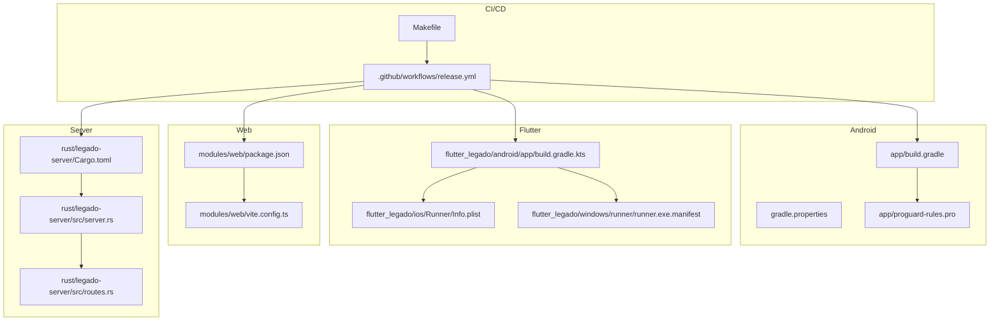
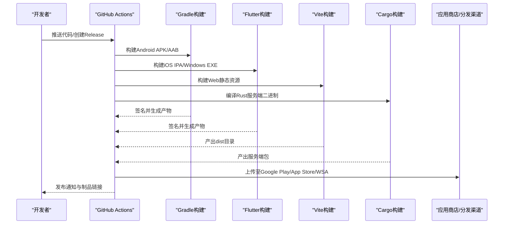
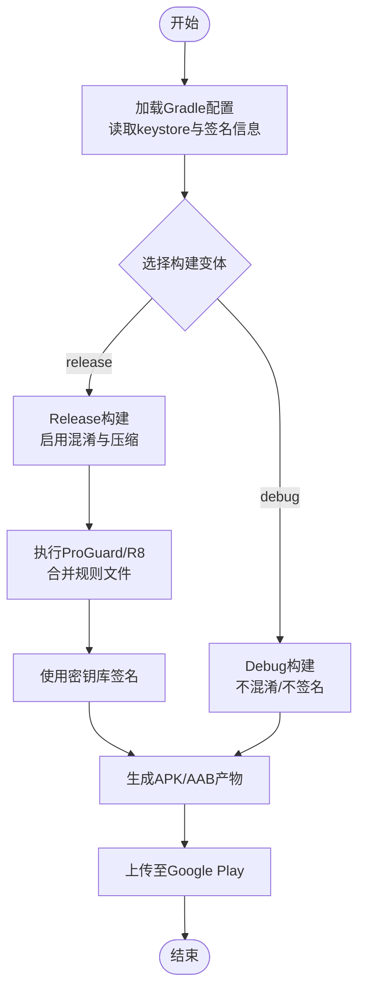
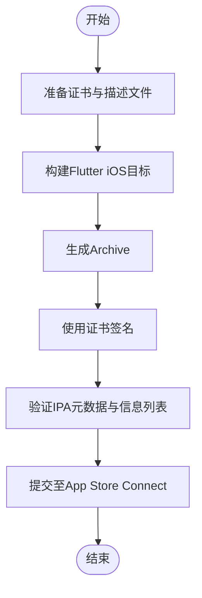
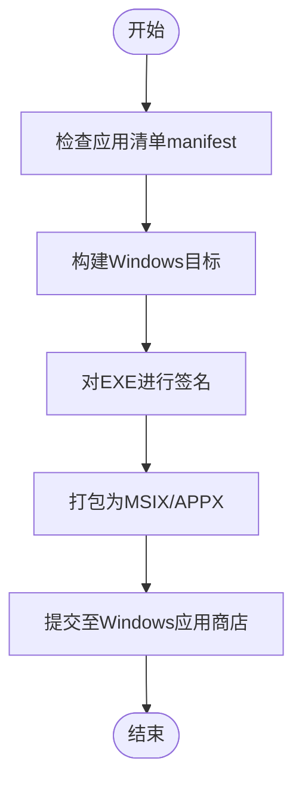
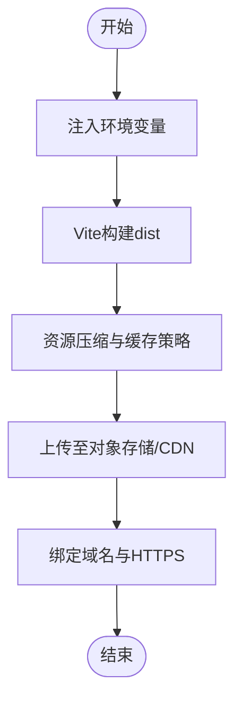
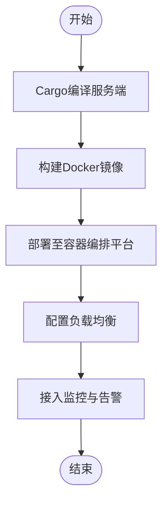
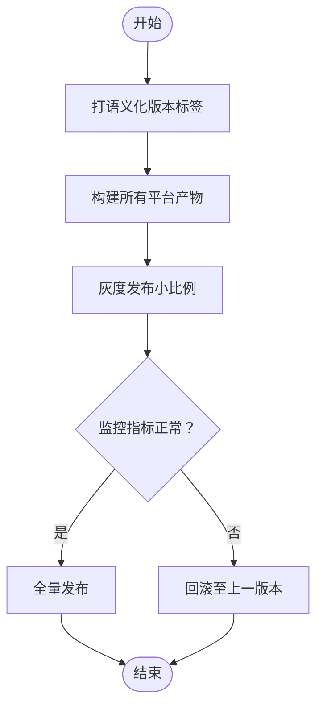
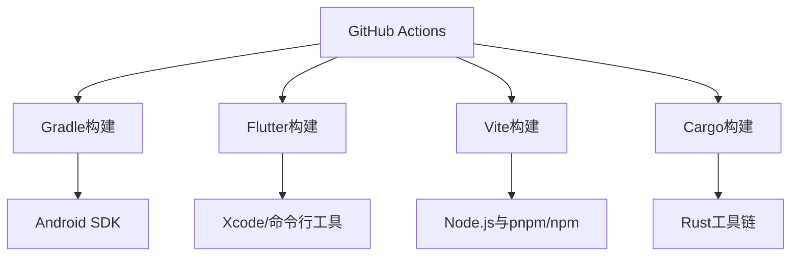

# 发布和部署

<cite>
**本文引用的文件**   
- [build.gradle](file://build.gradle)
- [app/build.gradle](file://app/build.gradle)
- [gradle.properties](file://gradle.properties)
- [settings.gradle](file://settings.gradle)
- [Makefile](file://Makefile)
- [.github/workflows/release.yml](file://.github/workflows/release.yml)
- [flutter_legado/android/app/build.gradle.kts](file://flutter_legado/android/app/build.gradle.kts)
- [flutter_legado/ios/Runner/Info.plist](file://flutter_legado/ios/Runner/Info.plist)
- [flutter_legado/windows/runner/runner.exe.manifest](file://flutter_legado/windows/runner/runner.exe.manifest)
- [modules/web/package.json](file://modules/web/package.json)
- [modules/web/vite.config.ts](file://modules/web/vite.config.ts)
- [rust/legado-server/Cargo.toml](file://rust/legado-server/Cargo.toml)
- [rust/legado-server/src/server.rs](file://rust/legado-server/src/server.rs)
- [rust/legado-server/src/routes.rs](file://rust/legado-server/src/routes.rs)
- [app/proguard-rules.pro](file://app/proguard-rules.pro)
- [app/cronet-proguard-rules.pro](file://app/cronet-proguard-rules.pro)
</cite>

## 目录
1. [简介](#简介)
2. [项目结构](#项目结构)
3. [核心组件](#核心组件)
4. [架构总览](#架构总览)
5. [详细组件分析](#详细组件分析)
6. [依赖分析](#依赖分析)
7. [性能考虑](#性能考虑)
8. [故障排查指南](#故障排查指南)
9. [结论](#结论)
10. [附录](#附录)

## 简介
本文件面向Legado项目的发布与部署，覆盖Android/iOS应用签名与证书管理、代码混淆与压缩、多平台发布流程（Google Play Store、App Store、Windows应用商店）、Web静态资源与CDN策略、服务器容器化与云服务部署、负载均衡配置、版本管理与回滚策略（语义化版本控制、热更新、灰度发布），以及发布后的监控与维护。文档以仓库现有构建脚本、CI工作流、前端与后端工程配置为依据，提供可操作的步骤与最佳实践。

## 项目结构
本项目为多模块、多语言混合工程：
- Android原生应用位于 app 模块，使用Gradle构建，包含ProGuard混淆规则与Cronet优化配置。
- Flutter跨端应用位于 flutter_legado，支持Android、iOS、Windows、macOS、Linux等目标。
- Web管理界面位于 modules/web，基于Vite构建。
- Rust服务端位于 rust/legado-server，提供HTTP/WebSocket服务。
- CI/CD通过GitHub Actions的release工作流驱动自动化构建与发布。

图表来源
- [app/build.gradle](file://app/build.gradle)
- [gradle.properties](file://gradle.properties)
- [app/proguard-rules.pro](file://app/proguard-rules.pro)
- [flutter_legado/android/app/build.gradle.kts](file://flutter_legado/android/app/build.gradle.kts)
- [flutter_legado/ios/Runner/Info.plist](file://flutter_legado/ios/Runner/Info.plist)
- [flutter_legado/windows/runner/runner.exe.manifest](file://flutter_legado/windows/runner/runner.exe.manifest)
- [modules/web/package.json](file://modules/web/package.json)
- [modules/web/vite.config.ts](file://modules/web/vite.config.ts)
- [rust/legado-server/Cargo.toml](file://rust/legado-server/Cargo.toml)
- [rust/legado-server/src/server.rs](file://rust/legado-server/src/server.rs)
- [rust/legado-server/src/routes.rs](file://rust/legado-server/src/routes.rs)
- [.github/workflows/release.yml](file://.github/workflows/release.yml)
- [Makefile](file://Makefile)

章节来源
- [build.gradle](file://build.gradle)
- [settings.gradle](file://settings.gradle)
- [Makefile](file://Makefile)

## 核心组件
- 构建系统
  - Gradle（Android）：定义签名、变体、混淆、产物输出等。
  - Flutter（多平台）：Android/iOS/Windows构建配置与打包。
  - Vite（Web）：前端构建、资源优化、环境变量注入。
  - Cargo（Rust Server）：服务端编译与依赖管理。
- 安全与混淆
  - ProGuard/R8（Android）：代码混淆、压缩、死代码消除。
  - iOS代码签名与App Store Connect集成。
  - Windows应用清单与签名。
- 持续集成与发布
  - GitHub Actions工作流触发构建、测试、上传制品。
  - Makefile统一常用命令入口。

章节来源
- [app/build.gradle](file://app/build.gradle)
- [flutter_legado/android/app/build.gradle.kts](file://flutter_legado/android/app/build.gradle.kts)
- [modules/web/vite.config.ts](file://modules/web/vite.config.ts)
- [rust/legado-server/Cargo.toml](file://rust/legado-server/Cargo.toml)
- [.github/workflows/release.yml](file://.github/workflows/release.yml)
- [Makefile](file://Makefile)

## 架构总览
下图展示从代码提交到多平台产物的端到端流水线，包括构建、签名、混淆、打包、上传与发布。

图表来源
- [.github/workflows/release.yml](file://.github/workflows/release.yml)
- [app/build.gradle](file://app/build.gradle)
- [flutter_legado/android/app/build.gradle.kts](file://flutter_legado/android/app/build.gradle.kts)
- [modules/web/vite.config.ts](file://modules/web/vite.config.ts)
- [rust/legado-server/Cargo.toml](file://rust/legado-server/Cargo.toml)

## 详细组件分析

### Android应用签名与发布
- 密钥库与签名
  - 在Gradle中配置keystore路径、别名、密码，生成签名的APK或AAB。
  - 建议使用独立的安全存储（如CI Secrets）保存敏感信息。
- 混淆与压缩
  - 启用R8/ProGuard，合并proguard-rules.pro与cronet-proguard-rules.pro。
  - 针对Cronet网络栈进行特殊保留规则，避免运行时崩溃。
- 构建变体
  - debug/release变体分离，release开启混淆、资源压缩、符号剥离。
- Google Play Store发布
  - 优先使用AAB格式；配置内部测试轨道、白名单、隐私政策。
  - 使用Play Console API或Fastlane自动化上传。

图表来源
- [app/build.gradle](file://app/build.gradle)
- [app/proguard-rules.pro](file://app/proguard-rules.pro)
- [app/cronet-proguard-rules.pro](file://app/cronet-proguard-rules.pro)

章节来源
- [app/build.gradle](file://app/build.gradle)
- [app/proguard-rules.pro](file://app/proguard-rules.pro)
- [app/cronet-proguard-rules.pro](file://app/cronet-proguard-rules.pro)
- [gradle.properties](file://gradle.properties)

### iOS应用签名与发布
- 证书与描述文件
  - 在Xcode或命令行中使用Apple Developer账号的证书与描述文件对IPA签名。
  - Info.plist中配置Bundle ID、权限声明、CFBundleVersion等。
- App Store提交
  - 使用Xcode Archive或xcrun altool/whatsnew生成并提交至App Store Connect。
  - 配置TestFlight用于内测分发。
- 安全加固
  - 启用Bitcode（如适用）、Strip Symbols、Enable Hardened Runtime。

图表来源
- [flutter_legado/ios/Runner/Info.plist](file://flutter_legado/ios/Runner/Info.plist)

章节来源
- [flutter_legado/ios/Runner/Info.plist](file://flutter_legado/ios/Runner/Info.plist)

### Windows应用商店发布
- 应用清单与签名
  - 使用runner.exe.manifest定义应用元数据与权限。
  - 通过SignTool或CI中的签名任务对EXE进行数字签名。
- 打包与提交
  - 生成MSIX或APPX包，提交至Microsoft Store或企业内部分发。

图表来源
- [flutter_legado/windows/runner/runner.exe.manifest](file://flutter_legado/windows/runner/runner.exe.manifest)

章节来源
- [flutter_legado/windows/runner/runner.exe.manifest](file://flutter_legado/windows/runner/runner.exe.manifest)

### Web部署策略
- 静态资源构建
  - 使用Vite构建dist目录，启用资源压缩、Tree-shaking、缓存策略。
  - 通过环境变量注入API地址、功能开关等。
- CDN与域名绑定
  - 将dist上传至对象存储（如OSS/S3），配置CDN加速与HTTPS。
  - 绑定自定义域名，设置CORS与安全头。
- 版本与回滚
  - 按版本号组织静态资源路径，保留历史版本以便快速回滚。

图表来源
- [modules/web/package.json](file://modules/web/package.json)
- [modules/web/vite.config.ts](file://modules/web/vite.config.ts)

章节来源
- [modules/web/package.json](file://modules/web/package.json)
- [modules/web/vite.config.ts](file://modules/web/vite.config.ts)

### 服务器部署方案
- Docker容器化
  - 将Rust服务端编译为静态二进制，放入轻量镜像（如alpine）。
  - 暴露HTTP/WebSocket端口，挂载必要卷（日志、配置）。
- 云服务部署
  - 使用云平台（阿里云、腾讯云、AWS等）托管容器或虚拟机实例。
  - 配置自动扩缩容与健康检查。
- 负载均衡
  - 前置Nginx/云LB，实现多实例负载分担与优雅重启。

图表来源
- [rust/legado-server/Cargo.toml](file://rust/legado-server/Cargo.toml)
- [rust/legado-server/src/server.rs](file://rust/legado-server/src/server.rs)
- [rust/legado-server/src/routes.rs](file://rust/legado-server/src/routes.rs)

章节来源
- [rust/legado-server/Cargo.toml](file://rust/legado-server/Cargo.toml)
- [rust/legado-server/src/server.rs](file://rust/legado-server/src/server.rs)
- [rust/legado-server/src/routes.rs](file://rust/legado-server/src/routes.rs)

### 版本管理与回滚策略
- 语义化版本控制
  - 遵循MAJOR.MINOR.PATCH规范，变更日志与标签同步。
- 热更新机制
  - Web侧通过动态配置中心下发规则与脚本，无需重新安装包。
  - Android可使用增量更新或插件化框架（视业务需求）。
- 灰度发布
  - 按用户比例或设备维度逐步放量，结合监控指标决策全量。
- 回滚策略
  - 保留最近N个稳定版本，一键切换流量或回退包体。

[本节为概念性流程，不直接分析具体文件]

## 依赖分析
- 构建依赖
  - Gradle插件与Android SDK版本需与CI环境一致。
  - Flutter工具链与Xcode版本需匹配目标平台要求。
  - Vite与Node版本锁定，确保构建一致性。
  - Rust工具链与Cargo依赖版本固定。
- 外部依赖
  - 应用商店SDK（Google Play、App Store Connect、Microsoft Store）。
  - 云服务与CDN提供商的CLI/SDK。

图表来源
- [build.gradle](file://build.gradle)
- [settings.gradle](file://settings.gradle)
- [modules/web/package.json](file://modules/web/package.json)
- [rust/legado-server/Cargo.toml](file://rust/legado-server/Cargo.toml)
- [.github/workflows/release.yml](file://.github/workflows/release.yml)

章节来源
- [build.gradle](file://build.gradle)
- [settings.gradle](file://settings.gradle)
- [modules/web/package.json](file://modules/web/package.json)
- [rust/legado-server/Cargo.toml](file://rust/legado-server/Cargo.toml)
- [.github/workflows/release.yml](file://.github/workflows/release.yml)

## 性能考虑
- Android
  - 启用R8/ProGuard减少包体与启动时间；按需裁剪资源与第三方库。
  - Cronet网络栈优化连接池与缓存策略。
- iOS
  - 启用Strip Symbols与Dead Code Stripping；减少未用资源。
- Web
  - 启用Gzip/Brotli压缩；合理使用HTTP缓存与ETag。
  - 图片与字体懒加载，按需加载路由与组件。
- 服务器
  - 使用异步I/O与连接复用；合理设置线程池与缓冲区大小。
  - 数据库查询优化与索引设计；缓存热点数据。

[本节为通用指导，不直接分析具体文件]

## 故障排查指南
- 构建失败
  - 检查Gradle/Flutter/Vite/Cargo版本与依赖冲突。
  - 查看CI日志定位错误堆栈与缺失环境变量。
- 签名问题
  - 校验keystore与证书有效期、密码与别名是否匹配。
  - iOS确认描述文件与Bundle ID一致。
- 运行异常
  - Android检查ProGuard保留规则是否误删关键类。
  - Web检查环境变量与CORS配置。
  - 服务器检查端口占用、防火墙与SSL证书。
- 发布失败
  - 应用商店控制台查看审核反馈与错误码。
  - CDN对象存储权限与路径是否正确。

章节来源
- [.github/workflows/release.yml](file://.github/workflows/release.yml)
- [app/proguard-rules.pro](file://app/proguard-rules.pro)
- [app/cronet-proguard-rules.pro](file://app/cronet-proguard-rules.pro)
- [flutter_legado/ios/Runner/Info.plist](file://flutter_legado/ios/Runner/Info.plist)
- [modules/web/vite.config.ts](file://modules/web/vite.config.ts)
- [rust/legado-server/src/server.rs](file://rust/legado-server/src/server.rs)

## 结论
通过统一的构建系统与CI流水线，Legado实现了多平台应用的自动化构建、签名与发布。结合语义化版本控制、灰度发布与完善的监控体系，可在保证质量的前提下快速迭代与稳定交付。建议持续完善安全配置（密钥管理、最小权限原则）、性能优化（资源压缩、缓存策略）与可观测性（日志、指标、追踪），以提升整体发布效率与用户体验。

[本节为总结性内容，不直接分析具体文件]

## 附录
- 常用命令
  - 使用Makefile统一入口，封装构建、测试、打包、发布等命令。
- 参考文件
  - 构建脚本与配置文件路径已在各小节列出，便于查阅与扩展。

[本节为补充说明，不直接分析具体文件]