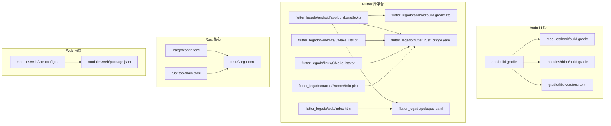
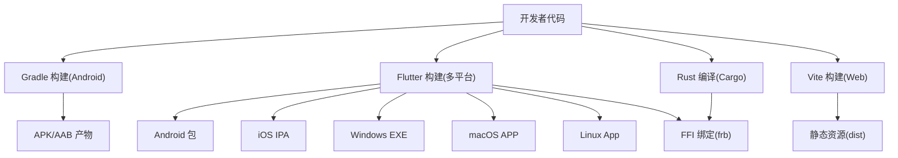
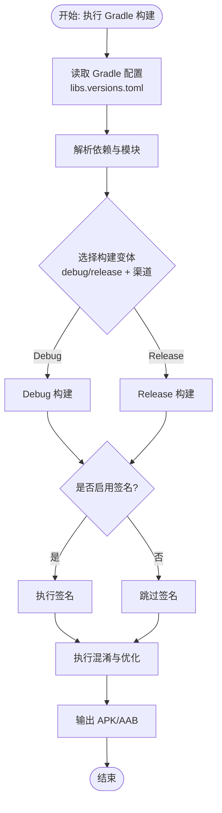
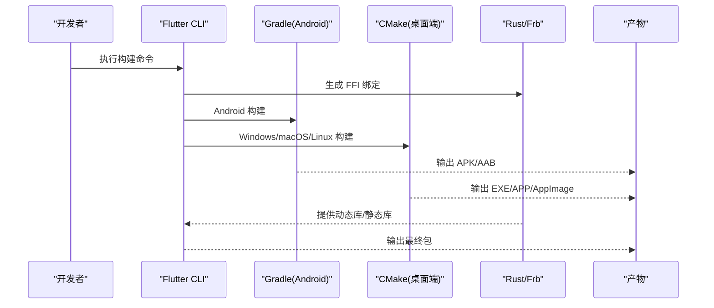
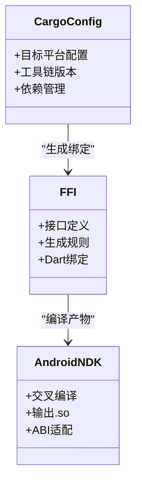
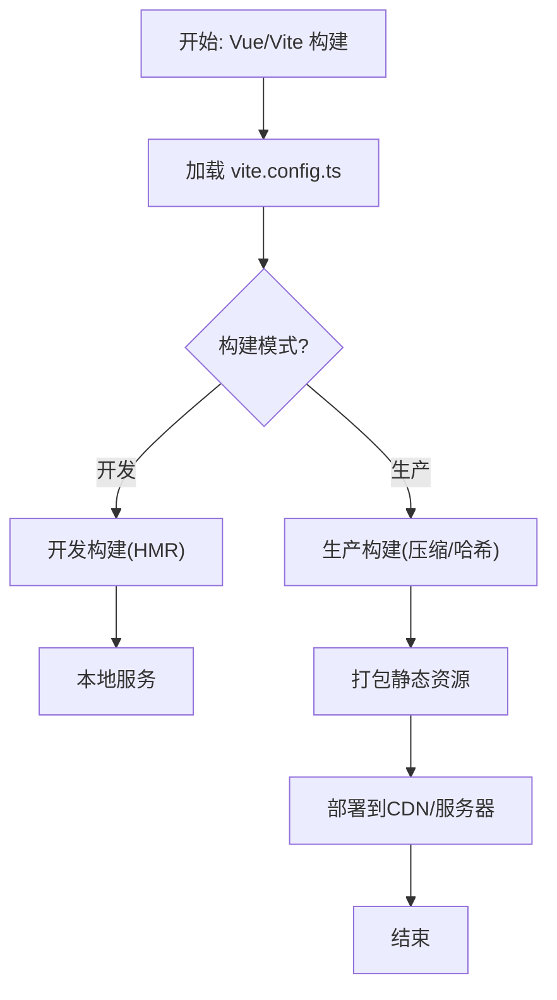
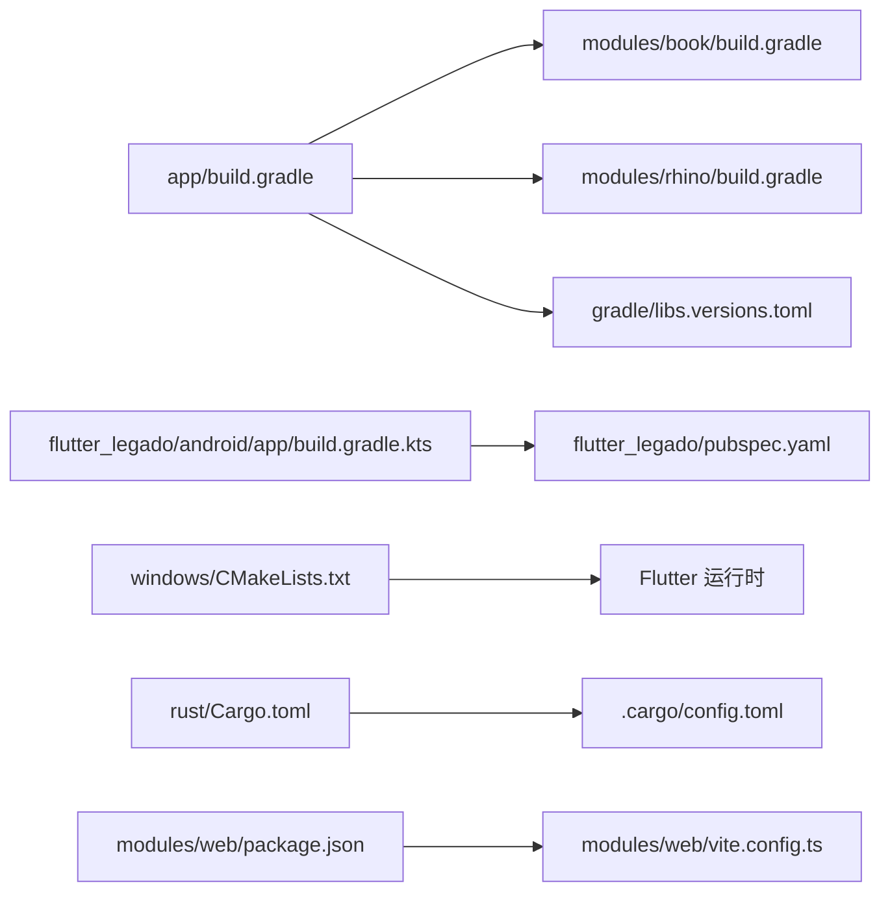

# 多平台构建

<cite>
**本文引用的文件**   
- [app/build.gradle](file://app/build.gradle)
- [app/download.gradle](file://app/download.gradle)
- [app/proguard-rules.pro](file://app/proguard-rules.pro)
- [app/cronet-proguard-rules.pro](file://app/cronet-proguard-rules.pro)
- [gradle/libs.versions.toml](file://gradle/libs.versions.toml)
- [flutter_legado/android/app/build.gradle.kts](file://flutter_legado/android/app/build.gradle.kts)
- [flutter_legado/android/build.gradle.kts](file://flutter_legado/android/build.gradle.kts)
- [flutter_legado/android/gradle.properties](file://flutter_legado/android/gradle.properties)
- [flutter_legado/android/settings.gradle.kts](file://flutter_legado/android/settings.gradle.kts)
- [flutter_legado/scripts/build-apk.ps1](file://flutter_legado/scripts/build-apk.ps1)
- [flutter_legado/scripts/build-windows.ps1](file://flutter_legado/scripts/build-windows.ps1)
- [flutter_legado/scripts/build-windows.bat](file://flutter_legado/scripts/build-windows.bat)
- [flutter_legado/flutter_rust_bridge.yaml](file://flutter_legado/flutter_rust_bridge.yaml)
- [flutter_legado/pubspec.yaml](file://flutter_legado/pubspec.yaml)
- [flutter_legado/windows/CMakeLists.txt](file://flutter_legado/windows/CMakeLists.txt)
- [flutter_legado/linux/CMakeLists.txt](file://flutter_legado/linux/CMakeLists.txt)
- [flutter_legado/macos/Runner/Info.plist](file://flutter_legado/macos/Runner/Info.plist)
- [flutter_legado/web/index.html](file://flutter_legado/web/index.html)
- [modules/book/build.gradle](file://modules/book/build.gradle)
- [modules/rhino/build.gradle](file://modules/rhino/build.gradle)
- [rust/Cargo.toml](file://rust/Cargo.toml)
- [rust/.cargo/config.toml](file://rust/.cargo/config.toml)
- [rust/rust-toolchain.toml](file://rust/rust-toolchain.toml)
- [rust/scripts/build-android.sh](file://rust/scripts/build-android.sh)
- [rust/scripts/build-android.ps1](file://rust/scripts/build-android.ps1)
- [modules/web/package.json](file://modules/web/package.json)
- [modules/web/vite.config.ts](file://modules/web/vite.config.ts)
- [Makefile](file://Makefile)
</cite>

## 目录
1. [简介](#简介)
2. [项目结构](#项目结构)
3. [核心组件](#核心组件)
4. [架构总览](#架构总览)
5. [详细组件分析](#详细组件分析)
6. [依赖关系分析](#依赖关系分析)
7. [性能与优化](#性能与优化)
8. [故障排查指南](#故障排查指南)
9. [结论](#结论)
10. [附录：常用命令与脚本](#附录常用命令与脚本)

## 简介
本文件面向多平台构建，覆盖 Android APK、Flutter（Android/iOS/Windows/macOS/Linux）、Rust 交叉编译与 FFI、以及 Web 前端（Vue.js）的构建流程。文档基于仓库中的 Gradle、Flutter、Rust、Web 工程配置与脚本进行说明，提供命令示例、常见问题与优化建议，帮助开发者在不同平台上稳定产出可分发产物。

## 项目结构
仓库采用多模块、多语言混合工程组织方式：
- app：原生 Android 应用模块（Kotlin/Java），包含资源、清单、ProGuard 规则与下载任务等。
- modules：Android 子模块（book、rhino、web），用于功能解耦与复用。
- flutter_legado：Flutter 跨平台工程，内置 Android、iOS、Windows、macOS、Linux、Web 各平台配置与脚本。
- rust：Rust 核心库与 FFI 层，按功能拆分为多个 crate，并提供交叉编译脚本。
- modules/web：Vue.js 前端工程，使用 Vite 构建。
- 根级 Makefile：统一入口，协调多语言构建。

图表来源 
- [app/build.gradle](file://app/build.gradle)
- [modules/book/build.gradle](file://modules/book/build.gradle)
- [modules/rhino/build.gradle](file://modules/rhino/build.gradle)
- [gradle/libs.versions.toml](file://gradle/libs.versions.toml)
- [flutter_legado/android/app/build.gradle.kts](file://flutter_legado/android/app/build.gradle.kts)
- [flutter_legado/android/build.gradle.kts](file://flutter_legado/android/build.gradle.kts)
- [flutter_legado/windows/CMakeLists.txt](file://flutter_legado/windows/CMakeLists.txt)
- [flutter_legado/linux/CMakeLists.txt](file://flutter_legado/linux/CMakeLists.txt)
- [flutter_legado/macos/Runner/Info.plist](file://flutter_legado/macos/Runner/Info.plist)
- [flutter_legado/web/index.html](file://flutter_legado/web/index.html)
- [flutter_legado/flutter_rust_bridge.yaml](file://flutter_legado/flutter_rust_bridge.yaml)
- [flutter_legado/pubspec.yaml](file://flutter_legado/pubspec.yaml)
- [rust/.cargo/config.toml](file://rust/.cargo/config.toml)
- [rust/rust-toolchain.toml](file://rust/rust-toolchain.toml)
- [rust/Cargo.toml](file://rust/Cargo.toml)
- [modules/web/vite.config.ts](file://modules/web/vite.config.ts)
- [modules/web/package.json](file://modules/web/package.json)

章节来源
- [app/build.gradle](file://app/build.gradle)
- [flutter_legado/android/app/build.gradle.kts](file://flutter_legado/android/app/build.gradle.kts)
- [flutter_legado/pubspec.yaml](file://flutter_legado/pubspec.yaml)
- [rust/Cargo.toml](file://rust/Cargo.toml)
- [modules/web/package.json](file://modules/web/package.json)

## 核心组件
- Android 构建系统：Gradle + Kotlin DSL，集中版本管理 libs.versions.toml，模块化依赖与 ProGuard 混淆。
- Flutter 构建系统：Flutter CLI + CMake（桌面端）+ Gradle（Android），通过 flutter_rust_bridge 生成 Rust FFI 绑定。
- Rust 工具链：Cargo + .cargo/config.toml 目标配置，rust-toolchain.toml 锁定工具链版本，scripts 提供交叉编译。
- Web 前端：Vite + TypeScript，打包静态资源并输出到服务器或 CDN。

章节来源
- [gradle/libs.versions.toml](file://gradle/libs.versions.toml)
- [flutter_legado/flutter_rust_bridge.yaml](file://flutter_legado/flutter_rust_bridge.yaml)
- [rust/.cargo/config.toml](file://rust/.cargo/config.toml)
- [rust/rust-toolchain.toml](file://rust/rust-toolchain.toml)
- [modules/web/vite.config.ts](file://modules/web/vite.config.ts)

## 架构总览
下图展示从源码到各平台产物的整体构建链路，包括 Flutter 调用 Rust FFI、Android 原生模块、以及 Web 前端的构建产物。

图表来源 
- [app/build.gradle](file://app/build.gradle)
- [flutter_legado/android/app/build.gradle.kts](file://flutter_legado/android/app/build.gradle.kts)
- [flutter_legado/windows/CMakeLists.txt](file://flutter_legado/windows/CMakeLists.txt)
- [flutter_legado/linux/CMakeLists.txt](file://flutter_legado/linux/CMakeLists.txt)
- [flutter_legado/macos/Runner/Info.plist](file://flutter_legado/macos/Runner/Info.plist)
- [flutter_legado/flutter_rust_bridge.yaml](file://flutter_legado/flutter_rust_bridge.yaml)
- [rust/Cargo.toml](file://rust/Cargo.toml)
- [modules/web/vite.config.ts](file://modules/web/vite.config.ts)

## 详细组件分析

### Android APK 构建流程（Gradle、签名、多渠道）
- 构建入口与模块依赖
  - 根级与 app 模块的 build.gradle 定义 Android 构建参数、依赖与插件。
  - modules 下的 book、rhino 等子模块通过 Gradle 聚合到主应用。
- 版本与依赖管理
  - gradle/libs.versions.toml 统一管理第三方库版本，便于升级与一致性。
- 签名与发布
  - 在 app 模块中配置签名信息（keystore、alias、密码等），支持 debug/release 不同签名策略。
- 多渠道打包
  - 通过 productFlavors 或 flavorDimensions 定义渠道变量，结合 buildTypes 实现差异化构建。
- 混淆与优化
  - proguard-rules.pro 与 cronet-proguard-rules.pro 分别对通用代码与 Cronet 网络库进行混淆与保留规则配置。
- 下载与资源处理
  - download.gradle 可能用于外部资源下载与预处理，确保构建时资源可用。

图表来源 
- [app/build.gradle](file://app/build.gradle)
- [gradle/libs.versions.toml](file://gradle/libs.versions.toml)
- [app/proguard-rules.pro](file://app/proguard-rules.pro)
- [app/cronet-proguard-rules.pro](file://app/cronet-proguard-rules.pro)
- [app/download.gradle](file://app/download.gradle)

章节来源
- [app/build.gradle](file://app/build.gradle)
- [gradle/libs.versions.toml](file://gradle/libs.versions.toml)
- [app/proguard-rules.pro](file://app/proguard-rules.pro)
- [app/cronet-proguard-rules.pro](file://app/cronet-proguard-rules.pro)
- [app/download.gradle](file://app/download.gradle)

### Flutter 跨平台打包（Android、iOS、Windows、macOS、Linux）
- 公共配置
  - pubspec.yaml 声明依赖与资源；flutter_rust_bridge.yaml 配置 FFI 生成规则。
- Android
  - android/app/build.gradle.kts 定义 Android 构建参数、签名、资源与插件；android/build.gradle.kts 为 Android 根配置。
- iOS
  - Runner/Info.plist 与应用标识、权限相关；Xcode Workspace 管理构建。
- Windows
  - windows/CMakeLists.txt 配置 CMake 构建，链接 Flutter 运行时与 Rust FFI 产物。
- macOS
  - macos/Runner/Info.plist 与 Xcode 配置；构建产物为 .app。
- Linux
  - linux/CMakeLists.txt 配置 CMake 构建，生成可执行文件或包。
- Web
  - web/index.html 作为入口；Flutter Web 构建输出静态资源。

图表来源 
- [flutter_legado/android/app/build.gradle.kts](file://flutter_legado/android/app/build.gradle.kts)
- [flutter_legado/android/build.gradle.kts](file://flutter_legado/android/build.gradle.kts)
- [flutter_legado/windows/CMakeLists.txt](file://flutter_legado/windows/CMakeLists.txt)
- [flutter_legado/linux/CMakeLists.txt](file://flutter_legado/linux/CMakeLists.txt)
- [flutter_legado/macos/Runner/Info.plist](file://flutter_legado/macos/Runner/Info.plist)
- [flutter_legado/web/index.html](file://flutter_legado/web/index.html)
- [flutter_legado/flutter_rust_bridge.yaml](file://flutter_legado/flutter_rust_bridge.yaml)
- [flutter_legado/pubspec.yaml](file://flutter_legado/pubspec.yaml)

章节来源
- [flutter_legado/android/app/build.gradle.kts](file://flutter_legado/android/app/build.gradle.kts)
- [flutter_legado/android/build.gradle.kts](file://flutter_legado/android/build.gradle.kts)
- [flutter_legado/windows/CMakeLists.txt](file://flutter_legado/windows/CMakeLists.txt)
- [flutter_legado/linux/CMakeLists.txt](file://flutter_legado/linux/CMakeLists.txt)
- [flutter_legado/macos/Runner/Info.plist](file://flutter_legado/macos/Runner/Info.plist)
- [flutter_legado/web/index.html](file://flutter_legado/web/index.html)
- [flutter_legado/flutter_rust_bridge.yaml](file://flutter_legado/flutter_rust_bridge.yaml)
- [flutter_legado/pubspec.yaml](file://flutter_legado/pubspec.yaml)

### Rust 交叉编译与 FFI
- 工具链与目标
  - rust-toolchain.toml 锁定工具链版本；.cargo/config.toml 设置目标平台与工具路径。
- Cargo 配置
  - rust/Cargo.toml 定义 crate 结构与依赖，按功能划分模块（core、db、ffi、net、parser、server、js 等）。
- FFI 集成
  - flutter_rust_bridge.yaml 指定接口与生成规则，Flutter 侧自动生成 Dart 绑定。
- 交叉编译脚本
  - scripts/build-android.sh/.ps1 提供 Android NDK 交叉编译流程，输出 .so 供 Android 使用。

图表来源 
- [rust/.cargo/config.toml](file://rust/.cargo/config.toml)
- [rust/rust-toolchain.toml](file://rust/rust-toolchain.toml)
- [rust/Cargo.toml](file://rust/Cargo.toml)
- [flutter_legado/flutter_rust_bridge.yaml](file://flutter_legado/flutter_rust_bridge.yaml)
- [rust/scripts/build-android.sh](file://rust/scripts/build-android.sh)
- [rust/scripts/build-android.ps1](file://rust/scripts/build-android.ps1)

章节来源
- [rust/.cargo/config.toml](file://rust/.cargo/config.toml)
- [rust/rust-toolchain.toml](file://rust/rust-toolchain.toml)
- [rust/Cargo.toml](file://rust/Cargo.toml)
- [flutter_legado/flutter_rust_bridge.yaml](file://flutter_legado/flutter_rust_bridge.yaml)
- [rust/scripts/build-android.sh](file://rust/scripts/build-android.sh)
- [rust/scripts/build-android.ps1](file://rust/scripts/build-android.ps1)

### Web 前端构建（Vue.js + Vite）
- 项目配置
  - package.json 声明依赖与脚本；vite.config.ts 配置构建选项、代理、资源优化等。
- 构建流程
  - 开发模式：热更新与本地调试。
  - 生产模式：压缩、Tree-shaking、资源哈希与 CDN 部署。
- 部署
  - 将 dist 目录上传至静态服务器或 CDN，配置缓存与 HTTPS。

图表来源 
- [modules/web/vite.config.ts](file://modules/web/vite.config.ts)
- [modules/web/package.json](file://modules/web/package.json)

章节来源
- [modules/web/vite.config.ts](file://modules/web/vite.config.ts)
- [modules/web/package.json](file://modules/web/package.json)

## 依赖关系分析
- Android 依赖
  - app 模块依赖 modules/book、modules/rhino 等子模块；统一版本由 libs.versions.toml 管理。
- Flutter 依赖
  - pubspec.yaml 声明 Dart 依赖；Android 侧通过 Gradle 管理 Android 依赖；桌面端通过 CMake 链接 Flutter 运行时。
- Rust 依赖
  - Cargo 管理 crate 间依赖；.cargo/config.toml 指定目标平台与工具链。
- Web 依赖
  - package.json 管理 Node 依赖；Vite 构建时解析依赖并打包。

图表来源 
- [app/build.gradle](file://app/build.gradle)
- [modules/book/build.gradle](file://modules/book/build.gradle)
- [modules/rhino/build.gradle](file://modules/rhino/build.gradle)
- [gradle/libs.versions.toml](file://gradle/libs.versions.toml)
- [flutter_legado/android/app/build.gradle.kts](file://flutter_legado/android/app/build.gradle.kts)
- [flutter_legado/pubspec.yaml](file://flutter_legado/pubspec.yaml)
- [flutter_legado/windows/CMakeLists.txt](file://flutter_legado/windows/CMakeLists.txt)
- [rust/Cargo.toml](file://rust/Cargo.toml)
- [rust/.cargo/config.toml](file://rust/.cargo/config.toml)
- [modules/web/package.json](file://modules/web/package.json)
- [modules/web/vite.config.ts](file://modules/web/vite.config.ts)

章节来源
- [app/build.gradle](file://app/build.gradle)
- [modules/book/build.gradle](file://modules/book/build.gradle)
- [modules/rhino/build.gradle](file://modules/rhino/build.gradle)
- [gradle/libs.versions.toml](file://gradle/libs.versions.toml)
- [flutter_legado/android/app/build.gradle.kts](file://flutter_legado/android/app/build.gradle.kts)
- [flutter_legado/pubspec.yaml](file://flutter_legado/pubspec.yaml)
- [flutter_legado/windows/CMakeLists.txt](file://flutter_legado/windows/CMakeLists.txt)
- [rust/Cargo.toml](file://rust/Cargo.toml)
- [rust/.cargo/config.toml](file://rust/.cargo/config.toml)
- [modules/web/package.json](file://modules/web/package.json)
- [modules/web/vite.config.ts](file://modules/web/vite.config.ts)

## 性能与优化
- Android
  - 启用 R8/ProGuard 混淆与裁剪；按需开启资源压缩与图片优化；合理配置 ABI 以减小包体积。
- Flutter
  - 使用 --release 构建；启用分层渲染与 GPU 加速；减少不必要的重绘；合理使用缓存。
- Rust
  - 使用 release 构建；启用 LTO；针对目标 CPU 优化；避免不必要的装箱与拷贝。
- Web
  - 启用 gzip/brotli 压缩；拆分路由与懒加载；使用 CDN 与缓存策略；减少首屏资源大小。

[本节为通用指导，不直接分析具体文件]

## 故障排查指南
- Android 构建失败
  - 检查 Gradle 版本与 JDK 版本匹配；确认 keystore 路径与密码正确；查看 libs.versions.toml 依赖冲突。
- Flutter 构建失败
  - 确认 Flutter SDK 与 Dart 版本；检查 CMake/NDK/Xcode 环境；清理构建缓存后重试。
- Rust 交叉编译失败
  - 检查 rust-toolchain.toml 版本；确认 .cargo/config.toml 目标平台配置；验证 NDK 路径与 ABI。
- Web 构建失败
  - 检查 Node 版本与 pnpm/npm 一致性；确认 vite.config.ts 代理与端口；清理 node_modules 后重装依赖。

章节来源
- [app/build.gradle](file://app/build.gradle)
- [gradle/libs.versions.toml](file://gradle/libs.versions.toml)
- [flutter_legado/android/app/build.gradle.kts](file://flutter_legado/android/app/build.gradle.kts)
- [flutter_legado/windows/CMakeLists.txt](file://flutter_legado/windows/CMakeLists.txt)
- [rust/.cargo/config.toml](file://rust/.cargo/config.toml)
- [rust/rust-toolchain.toml](file://rust/rust-toolchain.toml)
- [modules/web/vite.config.ts](file://modules/web/vite.config.ts)

## 结论
本项目通过 Gradle、Flutter、Rust 与 Vite 的组合实现了多平台构建能力。统一的配置管理与脚本化流程确保了构建的一致性与可重复性。遵循本文档的流程与优化建议，可在 Android、iOS、Windows、macOS、Linux 与 Web 上高效产出高质量产物。

[本节为总结，不直接分析具体文件]

## 附录：常用命令与脚本
- Android
  - 构建 Debug/Release：参考 app/build.gradle 与 gradle/libs.versions.toml 的配置。
  - 签名与多渠道：在 app 模块中配置签名与 flavors。
- Flutter
  - Android：flutter build apk / flutter build appbundle
  - iOS：flutter build ios
  - Windows：flutter build windows
  - macOS：flutter build macos
  - Linux：flutter build linux
  - Web：flutter build web
- Rust
  - 生成 FFI：根据 flutter_rust_bridge.yaml 运行 frb 生成。
  - 交叉编译：使用 rust/scripts/build-android.sh/.ps1 输出 .so。
- Web
  - 开发：pnpm dev（或 npm/yarn 对应命令）
  - 生产：pnpm build（或 npm/yarn 对应命令）
- 统一入口
  - 根级 Makefile 提供一键构建多平台产物的命令。

章节来源
- [app/build.gradle](file://app/build.gradle)
- [gradle/libs.versions.toml](file://gradle/libs.versions.toml)
- [flutter_legado/android/app/build.gradle.kts](file://flutter_legado/android/app/build.gradle.kts)
- [flutter_legado/flutter_rust_bridge.yaml](file://flutter_legado/flutter_rust_bridge.yaml)
- [rust/scripts/build-android.sh](file://rust/scripts/build-android.sh)
- [rust/scripts/build-android.ps1](file://rust/scripts/build-android.ps1)
- [modules/web/package.json](file://modules/web/package.json)
- [modules/web/vite.config.ts](file://modules/web/vite.config.ts)
- [Makefile](file://Makefile)