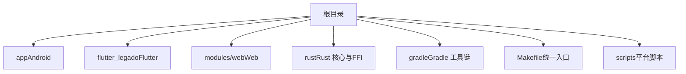
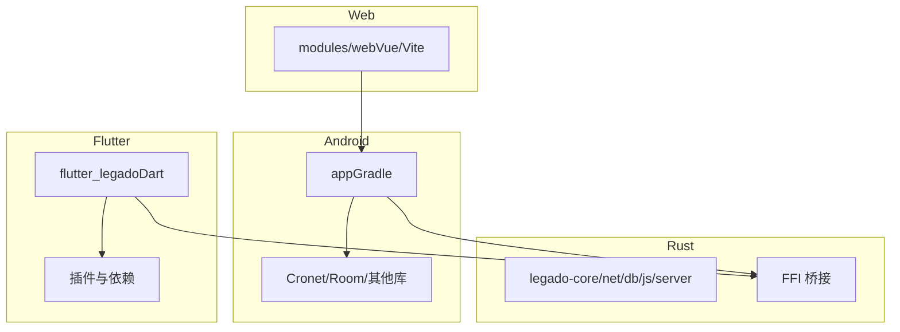
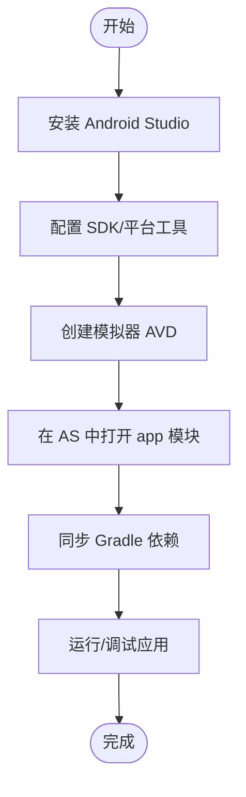
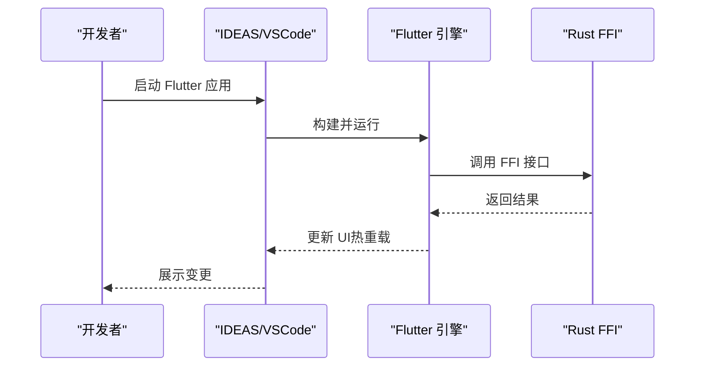
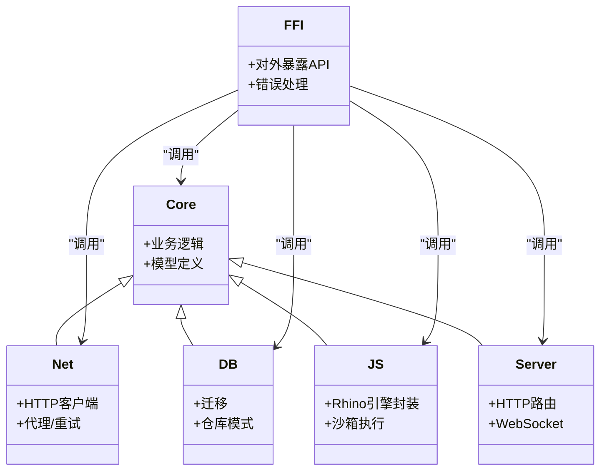
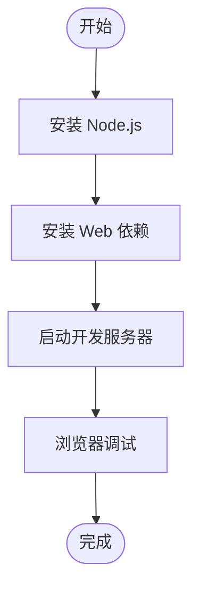
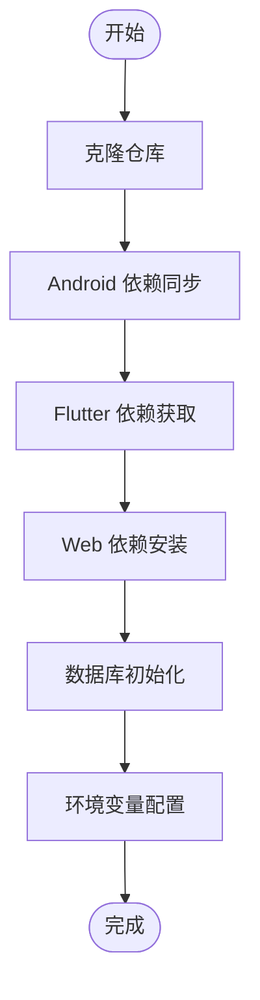
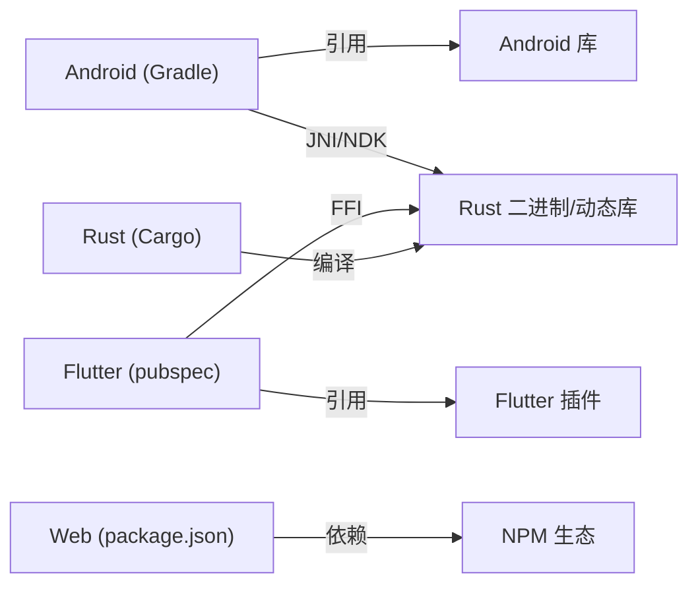

# 开发环境搭建

<cite>
**本文引用的文件**   
- [README.md](file://README.md)
- [Makefile](file://Makefile)
- [gradle.properties](file://gradle.properties)
- [app/build.gradle](file://app/build.gradle)
- [flutter_legado/pubspec.yaml](file://flutter_legado/pubspec.yaml)
- [flutter_legado/Makefile](file://flutter_legado/Makefile)
- [modules/web/package.json](file://modules/web/package.json)
- [rust/Cargo.toml](file://rust/Cargo.toml)
- [rust/rust-toolchain.toml](file://rust/rust-toolchain.toml)
- [rust/.cargo/config.toml](file://rust/.cargo/config.toml)
- [rust/DEVELOPMENT.md](file://rust/DEVELOPMENT.md)
- [scripts/build-android.ps1](file://scripts/build-android.ps1)
- [scripts/build-android.sh](file://scripts/build-android.sh)
</cite>

## 目录
1. [简介](#简介)
2. [项目结构](#项目结构)
3. [核心组件](#核心组件)
4. [架构总览](#架构总览)
5. [详细组件分析](#详细组件分析)
6. [依赖关系分析](#依赖关系分析)
7. [性能注意事项](#性能注意事项)
8. [故障排查指南](#故障排查指南)
9. [结论](#结论)
10. [附录](#附录)

## 简介
本指南面向首次参与 Legado 项目的开发者，提供从系统准备到多语言、多平台环境搭建的完整步骤。内容覆盖：
- Android 开发环境（Android Studio、SDK、模拟器、调试）
- Flutter 开发环境（Flutter SDK、IDE、热重载、性能分析）
- Rust 开发环境（Rustup、Cargo、调试器、交叉编译）
- Web 开发环境（Node.js、IDE、开发服务器、调试）
- 项目初始化（依赖安装、数据库初始化、配置项）
- 常见问题与解决方案

## 项目结构
Legado 采用多模块、多语言协作的工程结构：
- app：Android 原生应用主工程（Kotlin/Java + Gradle）
- flutter_legado：Flutter 跨平台实现（Dart + Flutter）
- modules/web：Web 管理端（Vue/Vite + TypeScript）
- rust：Rust 核心库与 FFI 桥接（Cargo Workspace）
- gradle、Makefile：构建脚本与版本管理
- scripts：平台相关构建脚本

**图表来源**
- [Makefile](file://Makefile)
- [app/build.gradle](file://app/build.gradle)
- [flutter_legado/pubspec.yaml](file://flutter_legado/pubspec.yaml)
- [modules/web/package.json](file://modules/web/package.json)
- [rust/Cargo.toml](file://rust/Cargo.toml)

**章节来源**
- [README.md](file://README.md)
- [Makefile](file://Makefile)

## 核心组件
- Android 应用层：基于 Gradle 构建，使用 Kotlin/Java，集成 Cronet、Room 等组件
- Flutter 跨平台层：通过 Dart 实现 UI 与业务逻辑，与 Rust 通过 FFI 交互
- Rust 核心层：提供高性能解析、网络、音频、数据库访问等能力，并通过 FFI 暴露给上层
- Web 管理端：基于 Vue/Vite，用于源码编辑与管理

**章节来源**
- [app/build.gradle](file://app/build.gradle)
- [flutter_legado/pubspec.yaml](file://flutter_legado/pubspec.yaml)
- [rust/Cargo.toml](file://rust/Cargo.toml)
- [modules/web/package.json](file://modules/web/package.json)

## 架构总览
下图展示了各子系统之间的依赖与交互关系，以及构建流程的关键节点。

**图表来源**
- [app/build.gradle](file://app/build.gradle)
- [flutter_legado/pubspec.yaml](file://flutter_legado/pubspec.yaml)
- [rust/Cargo.toml](file://rust/Cargo.toml)
- [modules/web/package.json](file://modules/web/package.json)

## 详细组件分析

### Android 开发环境
- 安装 Android Studio（推荐最新稳定版），启用 Kotlin 与 Java 支持
- 配置 SDK：在 Android Studio 中打开 SDK Manager，安装目标 API 级别与常用工具包
- 模拟器设置：创建 AVD（建议 x86_64 镜像并开启硬件加速）
- 调试工具：Logcat、Profiler、Layout Inspector、Device File Explorer
- 构建与运行：使用 Gradle 任务或 IDE 直接运行 app 模块

**图表来源**
- [app/build.gradle](file://app/build.gradle)
- [gradle.properties](file://gradle.properties)

**章节来源**
- [app/build.gradle](file://app/build.gradle)
- [gradle.properties](file://gradle.properties)

### Flutter 开发环境
- 安装 Flutter SDK（确保与 Dart 版本兼容）
- 配置 IDE：在 Android Studio 或 VS Code 中安装 Flutter/Dart 插件
- 热重载：启动 Flutter 应用后修改代码即可实时刷新
- 性能分析：使用 DevTools 进行 CPU/内存/网络分析
- 与 Rust 交互：通过 FFI 调用 Rust 提供的能力

**图表来源**
- [flutter_legado/pubspec.yaml](file://flutter_legado/pubspec.yaml)
- [rust/Cargo.toml](file://rust/Cargo.toml)

**章节来源**
- [flutter_legado/pubspec.yaml](file://flutter_legado/pubspec.yaml)
- [flutter_legado/Makefile](file://flutter_legado/Makefile)

### Rust 开发环境
- 安装 Rustup：管理多个 Rust 工具链与组件
- 配置 Cargo：工作区包含 core、net、db、js、server、ffi 等 crate
- 调试器：使用 lldb/gdb 配合 IDE 进行断点调试
- 交叉编译：为 Android/iOS/Windows/macOS/Linux 构建二进制

**图表来源**
- [rust/Cargo.toml](file://rust/Cargo.toml)
- [rust/rust-toolchain.toml](file://rust/rust-toolchain.toml)
- [rust/.cargo/config.toml](file://rust/.cargo/config.toml)

**章节来源**
- [rust/Cargo.toml](file://rust/Cargo.toml)
- [rust/rust-toolchain.toml](file://rust/rust-toolchain.toml)
- [rust/.cargo/config.toml](file://rust/.cargo/config.toml)
- [rust/DEVELOPMENT.md](file://rust/DEVELOPMENT.md)

### Web 开发环境
- 安装 Node.js（LTS 版本）与包管理器（pnpm/npm/yarn）
- 安装依赖：进入 modules/web 目录执行包管理器命令
- 开发服务器：启动 Vite 开发服务器，支持热更新
- 调试工具：浏览器开发者工具、网络面板、性能面板

**图表来源**
- [modules/web/package.json](file://modules/web/package.json)

**章节来源**
- [modules/web/package.json](file://modules/web/package.json)

### 项目初始化步骤
- 克隆仓库并进入根目录
- 安装 Android 依赖（Gradle 同步）
- 安装 Flutter 依赖（pub get）
- 安装 Web 依赖（pnpm install）
- 初始化数据库（按 README 指引执行迁移或导入默认数据）
- 配置环境变量（如 Gradle、Rust、Flutter 路径）

**图表来源**
- [Makefile](file://Makefile)
- [README.md](file://README.md)

**章节来源**
- [Makefile](file://Makefile)
- [README.md](file://README.md)

## 依赖关系分析
- Android 依赖由 Gradle 管理，版本集中在 gradle/libs.versions.toml（若存在）或 build.gradle
- Flutter 依赖由 pubspec.yaml 管理
- Rust 依赖由 Cargo.toml 与工作区管理
- Web 依赖由 package.json 管理

**图表来源**
- [app/build.gradle](file://app/build.gradle)
- [flutter_legado/pubspec.yaml](file://flutter_legado/pubspec.yaml)
- [rust/Cargo.toml](file://rust/Cargo.toml)
- [modules/web/package.json](file://modules/web/package.json)

**章节来源**
- [app/build.gradle](file://app/build.gradle)
- [flutter_legado/pubspec.yaml](file://flutter_legado/pubspec.yaml)
- [rust/Cargo.toml](file://rust/Cargo.toml)
- [modules/web/package.json](file://modules/web/package.json)

## 性能注意事项
- Android：启用 ProGuard/R8 混淆，合理配置 Cronet 缓存策略
- Flutter：避免频繁重建 Widget，合理使用 Provider/Bloc，使用 DevTools 定位卡顿
- Rust：使用 release 构建优化，避免不必要的分配，利用异步 I/O
- Web：按需加载资源，压缩静态资源，使用 CDN 加速

[本节为通用指导，不直接分析具体文件]

## 故障排查指南
- Android 构建失败：检查 JDK 版本、Gradle 版本、SDK 路径；清理构建缓存后重试
- Flutter 依赖问题：确认网络连接，尝试更换镜像源；删除 .dart_tool 后重新 pub get
- Rust 编译错误：检查 rust-toolchain 与 cargo 配置；清理 target 目录后重试
- Web 启动失败：检查端口占用，确认 Node.js 版本；清除 node_modules 后重装依赖

**章节来源**
- [gradle.properties](file://gradle.properties)
- [flutter_legado/Makefile](file://flutter_legado/Makefile)
- [rust/.cargo/config.toml](file://rust/.cargo/config.toml)
- [modules/web/package.json](file://modules/web/package.json)

## 结论
通过本指南，您可以完成 Legado 的多语言、多平台开发环境搭建。建议在本地验证每个子系统的构建与运行，确保依赖与环境正确配置后再进行功能开发。遇到问题时优先参考各子系统的构建日志与官方文档。

[本节为总结性内容，不直接分析具体文件]

## 附录
- 快速命令参考：
  - Android：./gradlew assembleDebug
  - Flutter：flutter pub get && flutter run
  - Rust：cargo build --release
  - Web：cd modules/web && pnpm dev

**章节来源**
- [Makefile](file://Makefile)
- [flutter_legado/Makefile](file://flutter_legado/Makefile)
- [rust/Cargo.toml](file://rust/Cargo.toml)
- [modules/web/package.json](file://modules/web/package.json)