# 构建和部署

<cite>
**本文引用的文件**   
- [build.gradle](file://build.gradle)
- [gradle.properties](file://gradle.properties)
- [settings.gradle](file://settings.gradle)
- [app/build.gradle](file://app/build.gradle)
- [app/download.gradle](file://app/download.gradle)
- [flutter_legado/Makefile](file://flutter_legado/Makefile)
- [flutter_legado/pubspec.yaml](file://flutter_legado/pubspec.yaml)
- [flutter_legado/android/app/build.gradle.kts](file://flutter_legado/android/app/build.gradle.kts)
- [flutter_legado/scripts/build-apk.ps1](file://flutter_legado/scripts/build-apk.ps1)
- [flutter_legado/scripts/build-windows.bat](file://flutter_legado/scripts/build-windows.bat)
- [flutter_legado/scripts/build-windows.ps1](file://flutter_legado/scripts/build-windows.ps1)
- [flutter_legado/scripts/run-windows.ps1](file://flutter_legado/scripts/run-windows.ps1)
- [flutter_legado/parse_coverage.ps1](file://flutter_legado/parse_coverage.ps1)
- [flutter_legado/integration_test/ffi_smoke_test.dart](file://flutter_legado/integration_test/ffi_smoke_test.dart)
- [scripts/emulator_smoke_test.ps1](file://scripts/emulator_smoke_test.ps1)
- [.github/workflows/release.yml](file://.github/workflows/release.yml)
- [.github/workflows/rust-ci.yml](file://.github/workflows/rust-ci.yml)
- [.github/workflows/flutter-ci.yml](file://.github/workflows/flutter-ci.yml)
- [.github/workflows/cronet.yml](file://.github/workflows/cronet.yml)
- [.github/workflows/integration-smoke.yml](file://.github/workflows/integration-smoke.yml)
- [.github/workflows/test.yml](file://.github/workflows/test.yml)
- [.github/scripts/cronet.sh](file://.github/scripts/cronet.sh)
- [.github/dependabot.yml](file://.github/dependabot.yml)
- [package.json](file://package.json)
- [VERSION_CONTROL.md](file://VERSION_CONTROL.md)
- [KOTLIN_SYNC_REPORT.md](file://KOTLIN_SYNC_REPORT.md)
- [fix-qoder-agents.ps1](file://fix-qoder-agents.ps1)
- [.agents/skills/dart-add-unit-test/SKILL.md](file://.agents/skills/dart-add-unit-test/SKILL.md)
- [.agents/skills/dart-build-cli-app/SKILL.md](file://.agents/skills/dart-build-cli-app/SKILL.md)
- [.agents/skills/dart-collect-coverage/SKILL.md](file://.agents/skills/dart-collect-coverage/SKILL.md)
- [.agents/skills/dart-fix-runtime-errors/SKILL.md](file://.agents/skills/dart-fix-runtime-errors/SKILL.md)
- [.agents/skills/dart-generate-test-mocks/SKILL.md](file://.agents/skills/dart-generate-test-mocks/SKILL.md)
- [.agents/skills/dart-migrate-to-checks-package/SKILL.md](file://.agents/skills/dart-migrate-to-checks-package/SKILL.md)
- [.agents/skills/dart-resolve-package-conflicts/SKILL.md](file://.agents/skills/dart-resolve-package-conflicts/SKILL.md)
- [.agents/skills/dart-run-static-analysis/SKILL.md](file://.agents/skills/dart-run-static-analysis/SKILL.md)
- [.agents/skills/dart-setup-ffi-assets/SKILL.md](file://.agents/skills/dart-setup-ffi-assets/SKILL.md)
- [.agents/skills/dart-use-ffigen/SKILL.md](file://.agents/skills/dart-use-ffigen/SKILL.md)
- [.agents/skills/dart-use-pattern-matching/SKILL.md](file://.agents/skills/dart-use-pattern-matching/SKILL.md)
- [.agents/skills/dart-use-primary-constructors/SKILL.md](file://.agents/skills/dart-use-primary-constructors/SKILL.md)
- [.agents/skills/flutter-add-integration-test/SKILL.md](file://.agents/skills/flutter-add-integration-test/SKILL.md)
- [.agents/skills/flutter-add-widget-preview/SKILL.md](file://.agents/skills/flutter-add-widget-preview/SKILL.md)
- [.agents/skills/flutter-add-widget-test/SKILL.md](file://.agents/skills/flutter-add-widget-test/SKILL.md)
- [.agents/skills/flutter-apply-architecture-best-practices/SKILL.md](file://.agents/skills/flutter-apply-architecture-best-practices/SKILL.md)
- [.agents/skills/flutter-build-responsive-layout/SKILL.md](file://.agents/skills/flutter-build-responsive-layout/SKILL.md)
- [.agents/skills/flutter-fix-layout-issues/SKILL.md](file://.agents/skills/flutter-fix-layout-issues/SKILL.md)
- [.agents/skills/flutter-implement-json-serialization/SKILL.md](file://.agents/skills/flutter-implement-json-serialization/SKILL.md)
- [.agents/skills/flutter-mcp/SKILL.md](file://.agents/skills/flutter-mcp/SKILL.md)
- [.agents/skills/flutter-setup-declarative-routing/SKILL.md](file://.agents/skills/flutter-setup-declarative-routing/SKILL.md)
- [.agents/skills/flutter-setup-localization/SKILL.md](file://.agents/skills/flutter-setup-localization/SKILL.md)
- [.agents/skills/flutter-use-http-package/SKILL.md](file://.agents/skills/flutter-use-http-package/SKILL.md)
</cite>

## 更新摘要
**变更内容**   
- **模拟器冒烟测试集成**：新增PowerShell脚本实现Android模拟器自动化冒烟测试，包括APK构建、安装、启动验证和崩溃检测
- **Flutter FFI集成测试**：新增端到端Flutter↔Rust FFI冒烟测试，验证Rust运行时初始化、数据库操作和FFI调用
- **CI/CD流水线增强**：新增专门的集成冒烟测试工作流，在Windows环境构建真实Rust DLL并执行Flutter集成测试
- **自动化测试覆盖范围扩展**：从单元测试扩展到集成测试和冒烟测试，提升代码质量保障能力

## 目录
1. [简介](#简介)
2. [项目结构](#项目结构)
3. [核心组件](#核心组件)
4. [架构总览](#架构总览)
5. [详细组件分析](#详细组件分析)
6. [依赖关系分析](#依赖关系分析)
7. [性能考量](#性能考量)
8. [故障排除指南](#故障排除指南)
9. [结论](#结论)
10. [附录](#附录)

## 简介
本文件面向Legado项目的构建与部署，覆盖Android APK、Flutter多平台打包、Rust交叉编译、Web前端构建等完整构建链；说明CI/CD流水线（GitHub Actions工作流）、自动化测试、代码检查、版本管理；解释依赖管理与版本控制（Gradle、Cargo、npm/pnpm）；介绍发布流程与签名配置（应用签名、证书管理、商店发布）；提供环境搭建与开发工具配置（SDK安装、IDE配置、调试环境）；并给出常见问题诊断、编译优化、内存调优等技术支持与脚本示例。

**更新** 本次更新重点集成了新的模拟器冒烟测试作为CI/CD流水线的必要步骤，增强了自动化测试覆盖范围。新增了Android模拟器自动化测试脚本和Flutter FFI集成测试，显著提升了构建质量和可靠性。

## 项目结构
本项目采用多模块、多语言混合工程：
- Android原生应用位于 app 模块，使用 Gradle/Kotlin 构建
- Flutter跨平台应用位于 flutter_legado，支持Android/iOS/Linux/macOS/Windows/Web
- Rust核心库位于 rust 目录，通过 flutter_rust_bridge 暴露给Flutter
- Web管理端位于 modules/web，基于Vite+TypeScript/Vue
- 顶层Gradle与Gradle Wrapper统一管理Android子模块
- CI/CD由 .github/workflows 定义，依赖管理由 dependabot 辅助
- **新增** 模拟器冒烟测试：PowerShell脚本实现Android模拟器自动化测试
- **新增** Flutter FFI集成测试：端到端验证Flutter与Rust的交互
- **新增** 集成冒烟测试工作流：专门用于验证Flutter↔Rust FFI功能

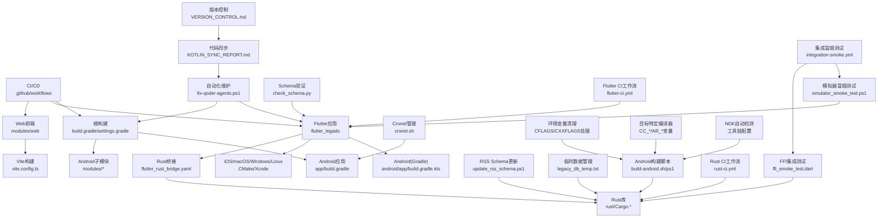

图表来源
- [build.gradle](file://build.gradle)
- [settings.gradle](file://settings.gradle)
- [app/build.gradle](file://app/build.gradle)
- [flutter_legado/android/app/build.gradle.kts](file://flutter_legado/android/app/build.gradle.kts)
- [flutter_legado/flutter_rust_bridge.yaml](file://flutter_legado/flutter_rust_bridge.yaml)
- [flutter_legado/check_schema.py](file://flutter_legado/check_schema.py)
- [rust/scripts/build-android.sh](file://rust/scripts/build-android.sh)
- [rust/scripts/build-android.ps1](file://rust/scripts/build-android.ps1)
- [rust/Cargo.toml](file://rust/Cargo.toml)
- [rust/update_rss_schema.ps1](file://rust/update_rss_schema.ps1)
- [rust/legacy_db_temp.txt](file://rust/legacy_db_temp.txt)
- [modules/web/vite.config.ts](file://modules/web/vite.config.ts)
- [.github/workflows/release.yml](file://.github/workflows/release.yml)
- [.github/workflows/rust-ci.yml](file://.github/workflows/rust-ci.yml)
- [.github/workflows/flutter-ci.yml](file://.github/workflows/flutter-ci.yml)
- [.github/workflows/integration-smoke.yml](file://.github/workflows/integration-smoke.yml)
- [.github/scripts/cronet.sh](file://.github/scripts/cronet.sh)
- [scripts/emulator_smoke_test.ps1](file://scripts/emulator_smoke_test.ps1)
- [flutter_legado/integration_test/ffi_smoke_test.dart](file://flutter_legado/integration_test/ffi_smoke_test.dart)
- [VERSION_CONTROL.md](file://VERSION_CONTROL.md)
- [KOTLIN_SYNC_REPORT.md](file://KOTLIN_SYNC_REPORT.md)
- [fix-qoder-agents.ps1](file://fix-qoder-agents.ps1)

章节来源
- [build.gradle](file://build.gradle)
- [settings.gradle](file://settings.gradle)
- [app/build.gradle](file://app/build.gradle)
- [flutter_legado/Makefile](file://flutter_legado/Makefile)
- [flutter_legado/pubspec.yaml](file://flutter_legado/pubspec.yaml)
- [flutter_legado/check_schema.py](file://flutter_legado/check_schema.py)
- [flutter_legado/scripts/run-windows.ps1](file://flutter_legado/scripts/run-windows.ps1)
- [flutter_legado/parse_coverage.ps1](file://flutter_legado/parse_coverage.ps1)
- [flutter_legado/integration_test/ffi_smoke_test.dart](file://flutter_legado/integration_test/ffi_smoke_test.dart)
- [scripts/emulator_smoke_test.ps1](file://scripts/emulator_smoke_test.ps1)
- [rust/Cargo.toml](file://rust/Cargo.toml)
- [rust/rust-toolchain.toml](file://rust/rust-toolchain.toml)
- [rust/.cargo/config.toml](file://rust/.cargo/config.toml)
- [rust/update_rss_schema.ps1](file://rust/update_rss_schema.ps1)
- [rust/legacy_db_temp.txt](file://rust/legacy_db_temp.txt)
- [rust/scripts/build-android.sh](file://rust/scripts/build-android.sh)
- [rust/scripts/build-android.ps1](file://rust/scripts/build-android.ps1)
- [modules/web/package.json](file://modules/web/package.json)
- [VERSION_CONTROL.md](file://VERSION_CONTROL.md)
- [KOTLIN_SYNC_REPORT.md](file://KOTLIN_SYNC_REPORT.md)
- [fix-qoder-agents.ps1](file://fix-qoder-agents.ps1)

## 核心组件
- Android构建系统
  - 顶层与app模块的Gradle脚本负责依赖解析、产物生成、签名与混淆
  - 下载与资源处理脚本用于外部依赖与资源准备
  - **重大改进** 环境变量清理机制，防止MSVC风格CFLAGS污染clang编译
  - **重大改进** 目标特定的CC/AR变量设置，实现交叉编译隔离
- Flutter构建系统
  - 通过Makefile统一入口，调用各平台构建命令
  - Android侧使用KTS Gradle脚本，其他平台使用CMake/Xcode
  - **新增** Schema验证确保数据模型一致性
  - **新增** Windows开发脚本简化开发和调试流程
  - **新增** FFI集成测试验证Flutter与Rust交互
- Rust构建系统
  - Cargo多crate组织，配合rust-toolchain与.cargo配置进行交叉编译
  - 通过flutter_rust_bridge生成双向绑定供Flutter调用
  - **新增** RSS schema自动更新机制
  - **重大改进** 目标特定的CC/AR变量设置，实现交叉编译隔离
  - **重大改进** Windows平台NDK自动检测和工具链配置
- Web构建系统
  - Vite + TypeScript/Vue，pnpm包管理，ESLint/Prettier代码规范
- CI/CD
  - GitHub Actions工作流触发构建、测试、打包与发布
  - Dependabot维护依赖更新
  - **新增** Rust CI工作流，包含clippy检查和quickjs特性测试
  - **新增** Flutter CI工作流，包含analyze和test步骤
  - **新增** Cronet版本管理自动化
  - **新增** 集成冒烟测试工作流，验证Flutter↔Rust FFI功能
- **新增** 模拟器冒烟测试
  - PowerShell脚本实现Android模拟器自动化测试
  - 支持APK构建、安装、启动验证和崩溃检测
  - 可选UI元素检查，验证主界面渲染
- **新增** 代码质量与开发工具
  - PowerShell脚本进行代码覆盖率分析
  - Python脚本自动化枚举类型修复
  - Agent技能文档提供智能开发辅助
- **新增** Schema验证与数据管理
  - Python脚本验证Flutter数据模型schema
  - PowerShell脚本自动化RSS schema更新
  - 临时数据文件支持数据库迁移测试

章节来源
- [app/build.gradle](file://app/build.gradle)
- [app/download.gradle](file://app/download.gradle)
- [flutter_legado/Makefile](file://flutter_legado/Makefile)
- [flutter_legado/android/app/build.gradle.kts](file://flutter_legado/android/app/build.gradle.kts)
- [flutter_legado/check_schema.py](file://flutter_legado/check_schema.py)
- [flutter_legado/scripts/run-windows.ps1](file://flutter_legado/scripts/run-windows.ps1)
- [flutter_legado/parse_coverage.ps1](file://flutter_legado/parse_coverage.ps1)
- [flutter_legado/integration_test/ffi_smoke_test.dart](file://flutter_legado/integration_test/ffi_smoke_test.dart)
- [scripts/emulator_smoke_test.ps1](file://scripts/emulator_smoke_test.ps1)
- [flutter_legado/flutter_rust_bridge.yaml](file://flutter_legado/flutter_rust_bridge.yaml)
- [rust/Cargo.toml](file://rust/Cargo.toml)
- [rust/rust-toolchain.toml](file://rust/rust-toolchain.toml)
- [rust/.cargo/config.toml](file://rust/.cargo/config.toml)
- [rust/update_rss_schema.ps1](file://rust/update_rss_schema.ps1)
- [rust/legacy_db_temp.txt](file://rust/legacy_db_temp.txt)
- [rust/scripts/build-android.sh](file://rust/scripts/build-android.sh)
- [rust/scripts/build-android.ps1](file://rust/scripts/build-android.ps1)
- [modules/web/package.json](file://modules/web/package.json)
- [modules/web/vite.config.ts](file://modules/web/vite.config.ts)
- [.github/workflows/release.yml](file://.github/workflows/release.yml)
- [.github/workflows/rust-ci.yml](file://.github/workflows/rust-ci.yml)
- [.github/workflows/flutter-ci.yml](file://.github/workflows/flutter-ci.yml)
- [.github/workflows/integration-smoke.yml](file://.github/workflows/integration-smoke.yml)
- [.github/dependabot.yml](file://.github/dependabot.yml)
- [VERSION_CONTROL.md](file://VERSION_CONTROL.md)
- [KOTLIN_SYNC_REPORT.md](file://KOTLIN_SYNC_REPORT.md)
- [fix-qoder-agents.ps1](file://fix-qoder-agents.ps1)

## 架构总览
下图展示从源码到产物的端到端构建链路，包括Android、Flutter、Rust与Web的交互关系，以及新增的模拟器冒烟测试和Flutter FFI集成测试。

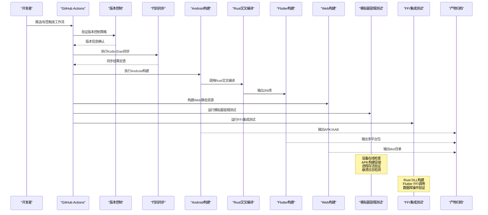

图表来源
- [.github/workflows/release.yml](file://.github/workflows/release.yml)
- [.github/workflows/rust-ci.yml](file://.github/workflows/rust-ci.yml)
- [.github/workflows/flutter-ci.yml](file://.github/workflows/flutter-ci.yml)
- [.github/workflows/integration-smoke.yml](file://.github/workflows/integration-smoke.yml)
- [app/build.gradle](file://app/build.gradle)
- [flutter_legado/Makefile](file://flutter_legado/Makefile)
- [rust/scripts/build-android.sh](file://rust/scripts/build-android.sh)
- [rust/scripts/build-android.ps1](file://rust/scripts/build-android.ps1)
- [modules/web/vite.config.ts](file://modules/web/vite.config.ts)
- [scripts/emulator_smoke_test.ps1](file://scripts/emulator_smoke_test.ps1)
- [flutter_legado/integration_test/ffi_smoke_test.dart](file://flutter_legado/integration_test/ffi_smoke_test.dart)
- [VERSION_CONTROL.md](file://VERSION_CONTROL.md)
- [KOTLIN_SYNC_REPORT.md](file://KOTLIN_SYNC_REPORT.md)

## 详细组件分析

### Android构建与打包
- 构建目标
  - 生成Debug/Release APK或AAB
  - 资源合并、代码混淆、签名校验
- 关键脚本与配置
  - 顶层与app模块Gradle脚本定义依赖、插件、变体与签名
  - 下载脚本用于获取外部依赖与资源
  - **重大改进** 环境变量清理机制，防止MSVC风格CFLAGS污染clang编译
  - **重大改进** 目标特定的CC/AR变量设置，避免全局编译器变量导致的交叉编译冲突
- 典型流程
  - 清理缓存 -> 解析依赖 -> 编译Kotlin/Java -> 资源打包 -> 签名 -> 产物输出

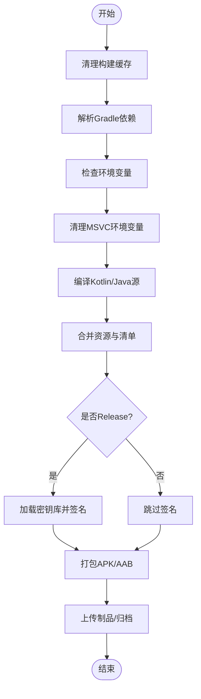

图表来源
- [app/build.gradle](file://app/build.gradle)
- [app/download.gradle](file://app/download.gradle)
- [flutter_legado/android/app/build.gradle.kts](file://flutter_legado/android/app/build.gradle.kts)

章节来源
- [app/build.gradle](file://app/build.gradle)
- [app/download.gradle](file://app/download.gradle)
- [flutter_legado/android/app/build.gradle.kts](file://flutter_legado/android/app/build.gradle.kts)

### Flutter多平台打包
- 构建目标
  - Android APK/AAB、iOS IPA、Windows EXE、Linux AppImage、macOS DMG、Web站点
- 关键脚本与配置
  - Makefile统一入口，封装各平台构建命令
  - Android侧使用KTS Gradle脚本，其他平台使用CMake/Xcode
  - **新增** Schema验证确保数据模型一致性
  - **新增** Windows开发脚本简化开发流程
  - **新增** FFI集成测试验证Flutter与Rust交互
- 典型流程
  - 拉取依赖 -> 生成桥接代码 -> 编译Rust -> 验证Schema -> 构建目标平台 -> 产物归档

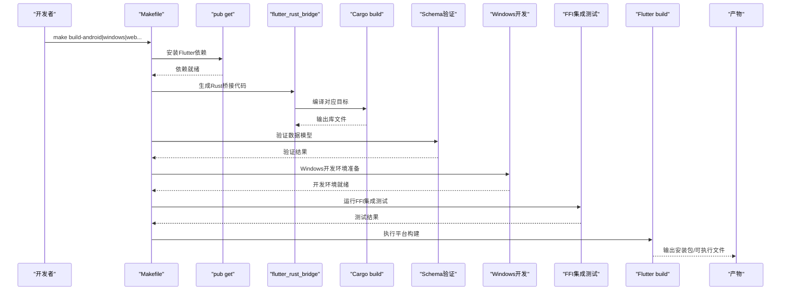

图表来源
- [flutter_legado/Makefile](file://flutter_legado/Makefile)
- [flutter_legado/pubspec.yaml](file://flutter_legado/pubspec.yaml)
- [flutter_legado/check_schema.py](file://flutter_legado/check_schema.py)
- [flutter_legado/scripts/run-windows.ps1](file://flutter_legado/scripts/run-windows.ps1)
- [flutter_legado/integration_test/ffi_smoke_test.dart](file://flutter_legado/integration_test/ffi_smoke_test.dart)
- [flutter_legado/flutter_rust_bridge.yaml](file://flutter_legado/flutter_rust_bridge.yaml)
- [flutter_legado/android/app/build.gradle.kts](file://flutter_legado/android/app/build.gradle.kts)

章节来源
- [flutter_legado/Makefile](file://flutter_legado/Makefile)
- [flutter_legado/pubspec.yaml](file://flutter_legado/pubspec.yaml)
- [flutter_legado/check_schema.py](file://flutter_legado/check_schema.py)
- [flutter_legado/scripts/run-windows.ps1](file://flutter_legado/scripts/run-windows.ps1)
- [flutter_legado/integration_test/ffi_smoke_test.dart](file://flutter_legado/integration_test/ffi_smoke_test.dart)
- [flutter_legado/flutter_rust_bridge.yaml](file://flutter_legado/flutter_rust_bridge.yaml)
- [flutter_legado/android/app/build.gradle.kts](file://flutter_legado/android/app/build.gradle.kts)

### Rust交叉编译与桥接
- 构建目标
  - 为Android(i686/arm64)、Windows、Linux、macOS等平台生成库
  - 通过flutter_rust_bridge生成Flutter可调用的绑定
- 关键配置
  - Cargo多crate组织业务逻辑
  - rust-toolchain指定工具链版本
  - .cargo/config.toml配置目标平台与链接器
  - **新增** RSS schema自动更新机制
  - **重大改进** 目标特定的CC/AR变量设置，实现交叉编译隔离
  - **重大改进** Windows平台NDK自动检测和工具链配置
- 典型流程
  - 解析Cargo依赖 -> 选择目标三元组 -> 编译Rust库 -> 生成桥接头/绑定 -> Flutter集成

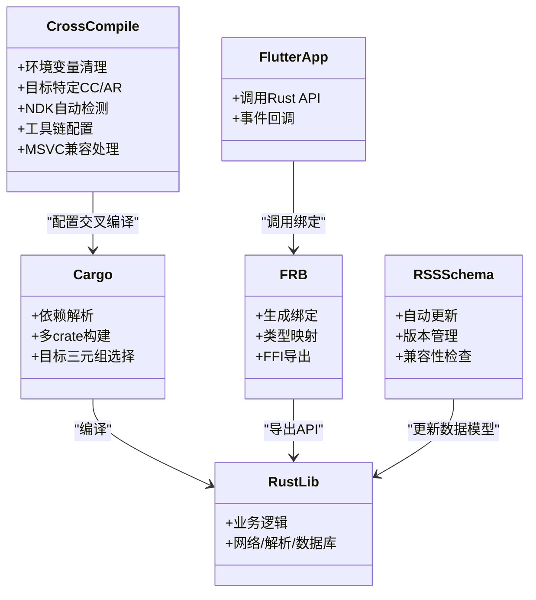

图表来源
- [rust/Cargo.toml](file://rust/Cargo.toml)
- [rust/rust-toolchain.toml](file://rust/rust-toolchain.toml)
- [rust/.cargo/config.toml](file://rust/.cargo/config.toml)
- [rust/update_rss_schema.ps1](file://rust/update_rss_schema.ps1)
- [rust/scripts/build-android.sh](file://rust/scripts/build-android.sh)
- [rust/scripts/build-android.ps1](file://rust/scripts/build-android.ps1)
- [flutter_legado/flutter_rust_bridge.yaml](file://flutter_legado/flutter_rust_bridge.yaml)

章节来源
- [rust/Cargo.toml](file://rust/Cargo.toml)
- [rust/rust-toolchain.toml](file://rust/rust-toolchain.toml)
- [rust/.cargo/config.toml](file://rust/.cargo/config.toml)
- [rust/update_rss_schema.ps1](file://rust/update_rss_schema.ps1)
- [rust/scripts/build-android.sh](file://rust/scripts/build-android.sh)
- [rust/scripts/build-android.ps1](file://rust/scripts/build-android.ps1)
- [flutter_legado/flutter_rust_bridge.yaml](file://flutter_legado/flutter_rust_bridge.yaml)

### Web前端构建
- 构建目标
  - 生成静态站点（HTML/CSS/JS），适配浏览器
- 关键配置
  - package.json声明依赖与脚本
  - vite.config.ts配置构建选项与代理
  - pnpm-lock.yaml锁定依赖版本
- 典型流程
  - 安装依赖 -> 类型检查 -> 构建优化 -> 输出dist

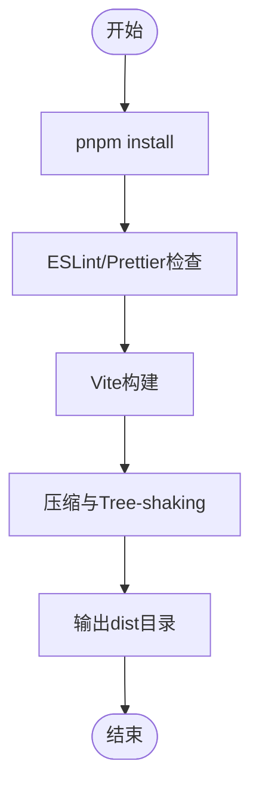

图表来源
- [modules/web/package.json](file://modules/web/package.json)
- [modules/web/vite.config.ts](file://modules/web/vite.config.ts)

章节来源
- [modules/web/package.json](file://modules/web/package.json)
- [modules/web/vite.config.ts](file://modules/web/vite.config.ts)

### 模拟器冒烟测试
- **新增功能** 完整的Android模拟器自动化测试流程
- 核心功能
  - 设备在线检查：验证ADB连接和设备状态
  - APK构建：支持跳过构建复用已有APK
  - 应用安装：自动安装到指定模拟器设备
  - 进程存活验证：检查应用进程是否正常运行
  - 崩溃日志检测：扫描FATAL异常和Flutter错误
  - 可选UI检查：验证主界面元素渲染
- 技术特点
  - 智能ADB路径查找：支持多种Android SDK安装位置
  - 错误处理机制：详细的PASS/FAIL状态报告
  - 灵活参数配置：支持设备名、包名、活动名自定义
  - CI/CD友好：返回标准退出码便于自动化流程

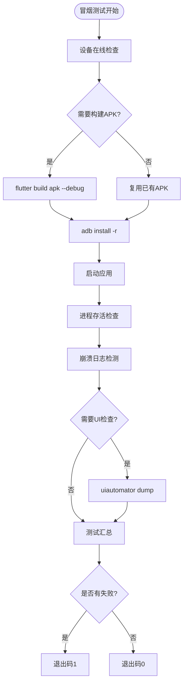

图表来源
- [scripts/emulator_smoke_test.ps1](file://scripts/emulator_smoke_test.ps1)

章节来源
- [scripts/emulator_smoke_test.ps1](file://scripts/emulator_smoke_test.ps1)

### Flutter FFI集成测试
- **新增功能** 端到端Flutter↔Rust FFI调用验证
- 测试覆盖点
  - RustApi.initialize()：验证Rust运行时初始化+数据库打开
  - getVersion()：验证FFI往返调用返回有效版本号
  - getBookSources()：验证真实DB查询往返（不依赖外网）
- 技术实现
  - 使用integration_test框架进行Widget测试
  - 预构建legado_ffi动态库（带quickjs特性）
  - 自动发现DLL搜索路径（../rust/target/debug/legado_ffi.dll）
  - 独立测试目录不影响单元测试基线

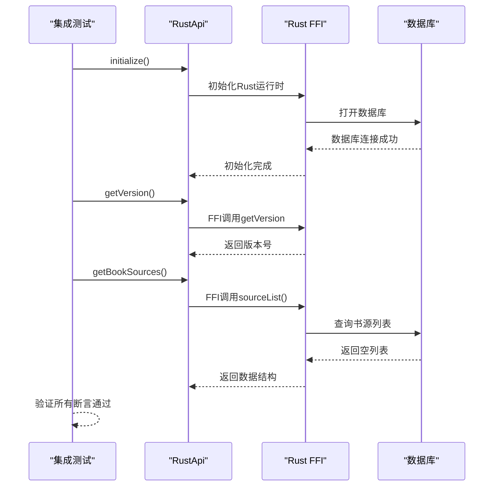

图表来源
- [flutter_legado/integration_test/ffi_smoke_test.dart](file://flutter_legado/integration_test/ffi_smoke_test.dart)

章节来源
- [flutter_legado/integration_test/ffi_smoke_test.dart](file://flutter_legado/integration_test/ffi_smoke_test.dart)

### CI/CD流水线增强
- **新增** 集成冒烟测试工作流
  - 自动检测rust/**和flutter_legado/**路径变更
  - 在Windows环境构建真实Rust DLL（带quickjs特性）
  - 执行Flutter集成测试验证FFI功能
  - 使用rust-cache加速Rust构建
- **原有** Rust CI工作流
  - 执行cargo check、clippy和test
  - 支持quickjs特性的独立测试
  - 针对legado-ffi包的专门测试流程
- **原有** Flutter CI工作流
  - 执行flutter analyze和test
  - 使用stable频道确保一致性
  - 完整的Flutter开发环境配置
- **原有** Cronet版本管理
  - 自动检测ChromiumDash上的最新版本
  - 验证Cronet工件完整性
  - 自动生成PR更新版本号
  - 同步ProGuard规则文件

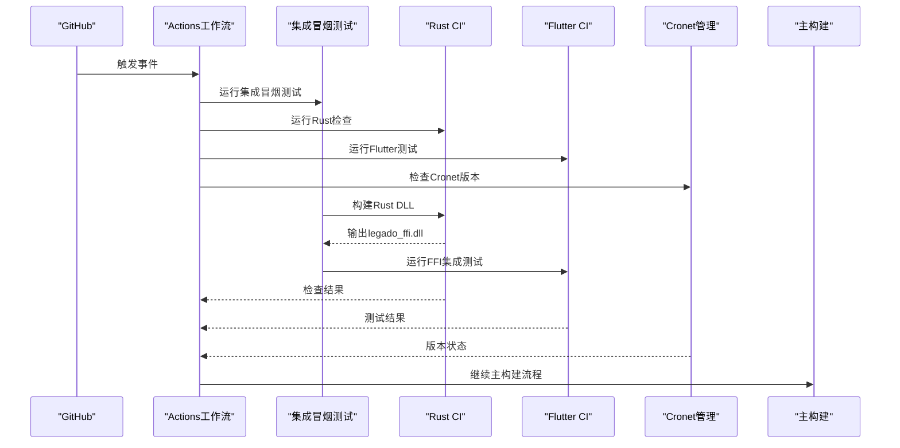

图表来源
- [.github/workflows/integration-smoke.yml](file://.github/workflows/integration-smoke.yml)
- [.github/workflows/rust-ci.yml](file://.github/workflows/rust-ci.yml)
- [.github/workflows/flutter-ci.yml](file://.github/workflows/flutter-ci.yml)
- [.github/workflows/cronet.yml](file://.github/workflows/cronet.yml)
- [.github/scripts/cronet.sh](file://.github/scripts/cronet.sh)

章节来源
- [.github/workflows/integration-smoke.yml](file://.github/workflows/integration-smoke.yml)
- [.github/workflows/rust-ci.yml](file://.github/workflows/rust-ci.yml)
- [.github/workflows/flutter-ci.yml](file://.github/workflows/flutter-ci.yml)
- [.github/workflows/cronet.yml](file://.github/workflows/cronet.yml)
- [.github/scripts/cronet.sh](file://.github/scripts/cronet.sh)

### 代码覆盖率分析与质量控制
- 覆盖率分析脚本
  - parse_coverage.ps1自动化Flutter应用测试覆盖率统计
  - 支持多种覆盖率格式输出和分析
  - 集成到CI/CD流水线中
- 质量保障
  - 自动化代码质量检查
  - 覆盖率阈值监控
  - 质量报告生成

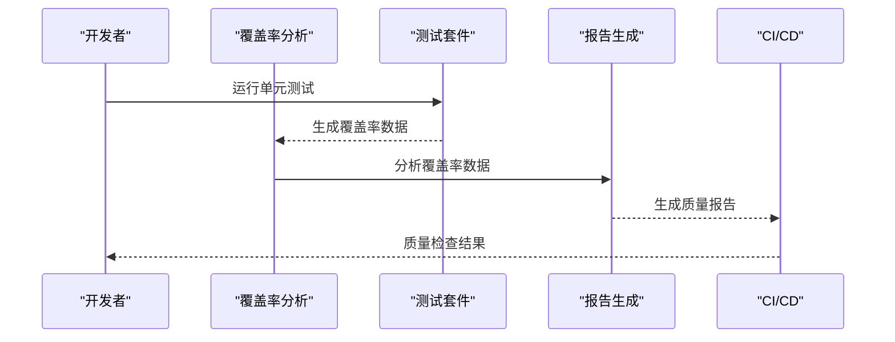

图表来源
- [flutter_legado/parse_coverage.ps1](file://flutter_legado/parse_coverage.ps1)

章节来源
- [flutter_legado/parse_coverage.ps1](file://flutter_legado/parse_coverage.ps1)

### 枚举类型自动修复工具
- 枚举修复脚本
  - 多个fix_enum*.py脚本处理不同场景的Dart枚举问题
  - 自动化枚举类型转换和修复
  - 支持批量处理和错误恢复
- 类型安全
  - 保持类型安全的枚举操作
  - 自动生成类型转换代码
  - 避免运行时类型错误

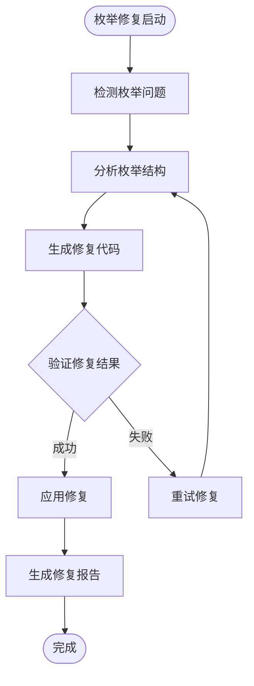

图表来源
- [flutter_legado/fix_enum.py](file://flutter_legado/fix_enum.py)
- [flutter_legado/fix_enum2.py](file://flutter_legado/fix_enum2.py)
- [flutter_legado/fix_enum3.py](file://flutter_legado/fix_enum3.py)
- [flutter_legado/fix_enum_final.py](file://flutter_legado/fix_enum_final.py)
- [flutter_legado/fix_enum_final2.py](file://flutter_legado/fix_enum_final2.py)
- [flutter_legado/fix_enum_v2.py](file://flutter_legado/fix_enum_v2.py)

章节来源
- [flutter_legado/fix_enum.py](file://flutter_legado/fix_enum.py)
- [flutter_legado/fix_enum2.py](file://flutter_legado/fix_enum2.py)
- [flutter_legado/fix_enum3.py](file://flutter_legado/fix_enum3.py)
- [flutter_legado/fix_enum_final.py](file://flutter_legado/fix_enum_final.py)
- [flutter_legado/fix_enum_final2.py](file://flutter_legado/fix_enum_final2.py)
- [flutter_legado/fix_enum_v2.py](file://flutter_legado/fix_enum_v2.py)

### Agent技能文档体系
- 技能文档结构
  - .agents/skills/目录下包含多种Dart和Flutter开发技能
  - 每个技能包含详细的SKILL.md文档
  - 支持智能开发辅助和最佳实践指导
- 技能分类
  - Dart开发技能：单元测试、CLI应用、覆盖率收集、错误修复等
  - Flutter开发技能：集成测试、Widget预览、架构设计等
  - MCP工具技能：各种工具集和控制功能
- 智能辅助
  - 基于技能的AI辅助开发
  - 自动化代码生成和优化
  - 开发流程标准化

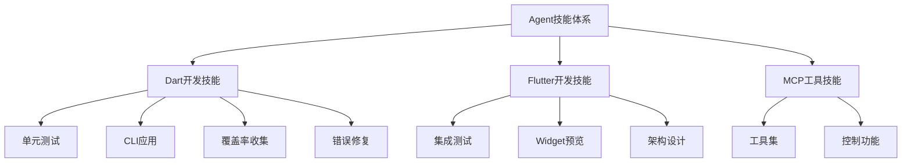

图表来源
- [.agents/skills/dart-add-unit-test/SKILL.md](file://.agents/skills/dart-add-unit-test/SKILL.md)
- [.agents/skills/dart-build-cli-app/SKILL.md](file://.agents/skills/dart-build-cli-app/SKILL.md)
- [.agents/skills/dart-collect-coverage/SKILL.md](file://.agents/skills/dart-collect-coverage/SKILL.md)
- [.agents/skills/flutter-add-integration-test/SKILL.md](file://.agents/skills/flutter-add-integration-test/SKILL.md)
- [.agents/skills/flutter-add-widget-preview/SKILL.md](file://.agents/skills/flutter-add-widget-preview/SKILL.md)
- [.agents/skills/flutter-apply-architecture-best-practices/SKILL.md](file://.agents/skills/flutter-apply-architecture-best-practices/SKILL.md)

章节来源
- [.agents/skills/dart-add-unit-test/SKILL.md](file://.agents/skills/dart-add-unit-test/SKILL.md)
- [.agents/skills/dart-build-cli-app/SKILL.md](file://.agents/skills/dart-build-cli-app/SKILL.md)
- [.agents/skills/dart-collect-coverage/SKILL.md](file://.agents/skills/dart-collect-coverage/SKILL.md)
- [.agents/skills/dart-fix-runtime-errors/SKILL.md](file://.agents/skills/dart-fix-runtime-errors/SKILL.md)
- [.agents/skills/dart-generate-test-mocks/SKILL.md](file://.agents/skills/dart-generate-test-mocks/SKILL.md)
- [.agents/skills/dart-migrate-to-checks-package/SKILL.md](file://.agents/skills/dart-migrate-to-checks-package/SKILL.md)
- [.agents/skills/dart-resolve-package-conflicts/SKILL.md](file://.agents/skills/dart-resolve-package-conflicts/SKILL.md)
- [.agents/skills/dart-run-static-analysis/SKILL.md](file://.agents/skills/dart-run-static-analysis/SKILL.md)
- [.agents/skills/dart-setup-ffi-assets/SKILL.md](file://.agents/skills/dart-setup-ffi-assets/SKILL.md)
- [.agents/skills/dart-use-ffigen/SKILL.md](file://.agents/skills/dart-use-ffigen/SKILL.md)
- [.agents/skills/dart-use-pattern-matching/SKILL.md](file://.agents/skills/dart-use-pattern-matching/SKILL.md)
- [.agents/skills/dart-use-primary-constructors/SKILL.md](file://.agents/skills/dart-use-primary-constructors/SKILL.md)
- [.agents/skills/flutter-add-integration-test/SKILL.md](file://.agents/skills/flutter-add-integration-test/SKILL.md)
- [.agents/skills/flutter-add-widget-preview/SKILL.md](file://.agents/skills/flutter-add-widget-preview/SKILL.md)
- [.agents/skills/flutter-add-widget-test/SKILL.md](file://.agents/skills/flutter-add-widget-test/SKILL.md)
- [.agents/skills/flutter-apply-architecture-best-practices/SKILL.md](file://.agents/skills/flutter-apply-architecture-best-practices/SKILL.md)
- [.agents/skills/flutter-build-responsive-layout/SKILL.md](file://.agents/skills/flutter-build-responsive-layout/SKILL.md)
- [.agents/skills/flutter-fix-layout-issues/SKILL.md](file://.agents/skills/flutter-fix-layout-issues/SKILL.md)
- [.agents/skills/flutter-implement-json-serialization/SKILL.md](file://.agents/skills/flutter-implement-json-serialization/SKILL.md)
- [.agents/skills/flutter-mcp/SKILL.md](file://.agents/skills/flutter-mcp/SKILL.md)
- [.agents/skills/flutter-setup-declarative-routing/SKILL.md](file://.agents/skills/flutter-setup-declarative-routing/SKILL.md)
- [.agents/skills/flutter-setup-localization/SKILL.md](file://.agents/skills/flutter-setup-localization/SKILL.md)
- [.agents/skills/flutter-use-http-package/SKILL.md](file://.agents/skills/flutter-use-http-package/SKILL.md)

### Schema验证与数据管理
- Schema验证工具
  - check_schema.py验证Flutter数据模型的一致性
  - 支持JSON schema格式检查和验证
  - 集成到构建流程中确保数据完整性
- RSS Schema自动更新
  - update_rss_schema.ps1自动化RSS数据模型更新
  - 支持版本管理和向后兼容性检查
  - 自动生成迁移脚本和文档
- 临时数据管理
  - legacy_db_temp.txt管理数据库迁移测试数据
  - 支持不同版本的数据库结构测试
  - 隔离测试环境与生产环境数据

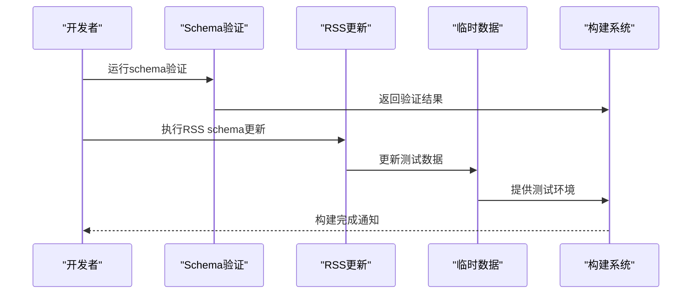

图表来源
- [flutter_legado/check_schema.py](file://flutter_legado/check_schema.py)
- [rust/update_rss_schema.ps1](file://rust/update_rss_schema.ps1)
- [rust/legacy_db_temp.txt](file://rust/legacy_db_temp.txt)

章节来源
- [flutter_legado/check_schema.py](file://flutter_legado/check_schema.py)
- [rust/update_rss_schema.ps1](file://rust/update_rss_schema.ps1)
- [rust/legacy_db_temp.txt](file://rust/legacy_db_temp.txt)

### 版本控制与代码同步
- 版本控制策略
  - 统一的分支管理流程和提交规范
  - 语义化版本控制和标签管理
  - 变更日志自动生成
- Kotlin与Dart代码同步
  - 自动化的代码同步机制确保接口一致性
  - 同步报告生成和错误检测
  - 冲突解决和回滚机制
- 自动化维护脚本
  - PowerShell脚本用于环境检查和修复
  - 构建前预处理和后处理任务
  - 依赖管理和缓存优化

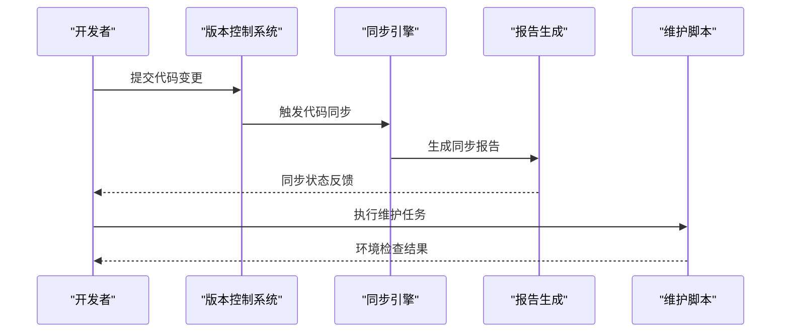

图表来源
- [VERSION_CONTROL.md](file://VERSION_CONTROL.md)
- [KOTLIN_SYNC_REPORT.md](file://KOTLIN_SYNC_REPORT.md)
- [fix-qoder-agents.ps1](file://fix-qoder-agents.ps1)

章节来源
- [VERSION_CONTROL.md](file://VERSION_CONTROL.md)
- [KOTLIN_SYNC_REPORT.md](file://KOTLIN_SYNC_REPORT.md)
- [fix-qoder-agents.ps1](file://fix-qoder-agents.ps1)

### CI/CD流水线（GitHub Actions）
- 触发条件
  - 推送分支、创建标签、Pull Request
- 主要任务
  - 设置环境（JDK、Flutter、Rust、Node）
  - 缓存依赖（Gradle、Cargo、npm）
  - 运行测试（Android单元测试、Flutter测试、Rust测试、Web测试、集成冒烟测试）
  - 构建产物（APK/AAB、Flutter包、Web dist）
  - 上传制品与发布（Release）
- 依赖管理
  - Dependabot自动检测并创建PR更新依赖
- **重大改进** 代码质量增强
  - Windows开发环境自动化配置
  - 代码覆盖率分析和报告生成
  - 枚举类型自动修复
  - Agent技能文档集成
  - **新增** Rust CI工作流，包含clippy检查和quickjs测试
  - **新增** Flutter CI工作流，包含analyze和test步骤
  - **新增** Cronet版本管理自动化
  - **新增** 集成冒烟测试工作流，验证Flutter↔Rust FFI功能

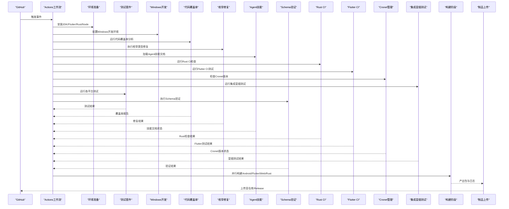

图表来源
- [.github/workflows/release.yml](file://.github/workflows/release.yml)
- [.github/workflows/rust-ci.yml](file://.github/workflows/rust-ci.yml)
- [.github/workflows/flutter-ci.yml](file://.github/workflows/flutter-ci.yml)
- [.github/workflows/integration-smoke.yml](file://.github/workflows/integration-smoke.yml)
- [.github/workflows/cronet.yml](file://.github/workflows/cronet.yml)
- [.github/dependabot.yml](file://.github/dependabot.yml)
- [flutter_legado/check_schema.py](file://flutter_legado/check_schema.py)
- [flutter_legado/scripts/run-windows.ps1](file://flutter_legado/scripts/run-windows.ps1)
- [flutter_legado/parse_coverage.ps1](file://flutter_legado/parse_coverage.ps1)
- [flutter_legado/integration_test/ffi_smoke_test.dart](file://flutter_legado/integration_test/ffi_smoke_test.dart)

章节来源
- [.github/workflows/release.yml](file://.github/workflows/release.yml)
- [.github/workflows/rust-ci.yml](file://.github/workflows/rust-ci.yml)
- [.github/workflows/flutter-ci.yml](file://.github/workflows/flutter-ci.yml)
- [.github/workflows/integration-smoke.yml](file://.github/workflows/integration-smoke.yml)
- [.github/workflows/cronet.yml](file://.github/workflows/cronet.yml)
- [.github/dependabot.yml](file://.github/dependabot.yml)

## 依赖关系分析
- Gradle依赖
  - 顶层与app模块脚本管理Android依赖与插件
  - 子模块book/rhino独立构建与依赖隔离
- Flutter依赖
  - pubspec.yaml声明Flutter插件与第三方库
  - Android侧KTS脚本管理Android特定依赖
- Rust依赖
  - Cargo.toml声明crate与特性开关
  - 工具链与目标平台由rust-toolchain与.cargo配置
- Web依赖
  - package.json与pnpm-lock.yaml锁定版本
  - Vite配置影响构建行为
- **新增** 模拟器冒烟测试依赖
  - PowerShell脚本依赖ADB工具和Android SDK
  - 需要Android模拟器或真机设备
  - 依赖Flutter构建工具生成APK
- **新增** Flutter FFI集成测试依赖
  - integration_test框架用于Widget测试
  - 需要预构建的legado_ffi动态库
  - 依赖Rust quickjs特性编译
- **新增** 开发工具依赖
  - PowerShell脚本依赖PowerShell环境和相关模块
  - Python脚本依赖特定的验证库和工具
  - Agent技能文档依赖相应的AI辅助工具
- **新增** Schema验证依赖
  - Python脚本依赖特定的验证库和工具
  - PowerShell脚本需要PowerShell环境和相关模块
  - 临时数据文件依赖数据库结构和版本管理
- **新增** CI/CD依赖
  - GitHub Actions工作流依赖各种setup-action
  - Rust CI依赖rust-toolchain和rust-cache
  - Flutter CI依赖flutter-action
  - Cronet管理依赖curl和jq工具
  - 集成冒烟测试依赖Windows环境和Rust工具链
- **重大改进** 交叉编译依赖
  - Android NDK自动检测和配置
  - MSVC与Android工具链兼容性处理
  - 目标特定的编译器变量管理

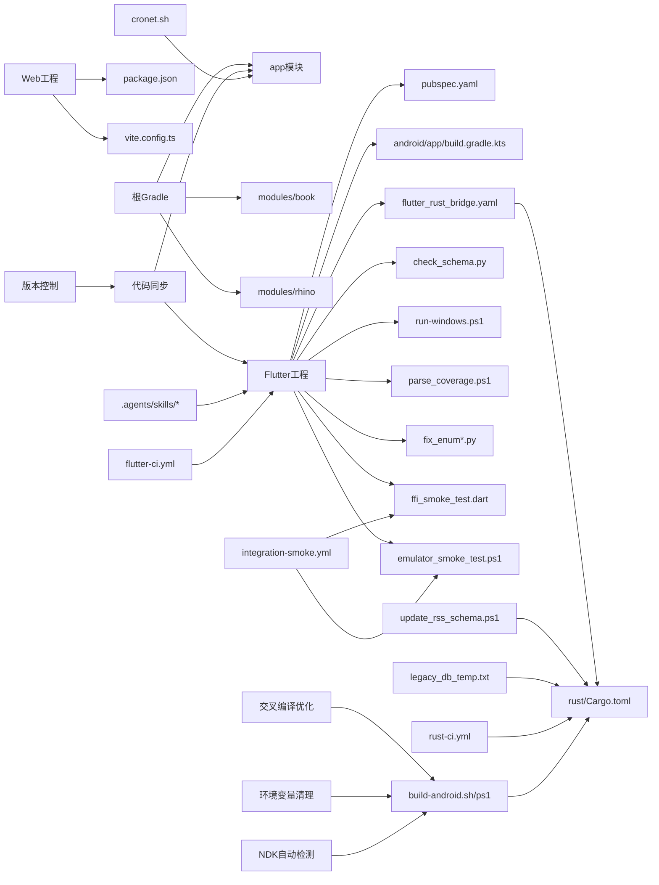

图表来源
- [build.gradle](file://build.gradle)
- [app/build.gradle](file://app/build.gradle)
- [modules/book/build.gradle](file://modules/book/build.gradle)
- [modules/rhino/build.gradle](file://modules/rhino/build.gradle)
- [flutter_legado/pubspec.yaml](file://flutter_legado/pubspec.yaml)
- [flutter_legado/android/app/build.gradle.kts](file://flutter_legado/android/app/build.gradle.kts)
- [flutter_legado/check_schema.py](file://flutter_legado/check_schema.py)
- [flutter_legado/scripts/run-windows.ps1](file://flutter_legado/scripts/run-windows.ps1)
- [flutter_legado/parse_coverage.ps1](file://flutter_legado/parse_coverage.ps1)
- [flutter_legado/integration_test/ffi_smoke_test.dart](file://flutter_legado/integration_test/ffi_smoke_test.dart)
- [scripts/emulator_smoke_test.ps1](file://scripts/emulator_smoke_test.ps1)
- [flutter_legado/fix_enum.py](file://flutter_legado/fix_enum.py)
- [flutter_legado/flutter_rust_bridge.yaml](file://flutter_legado/flutter_rust_bridge.yaml)
- [rust/Cargo.toml](file://rust/Cargo.toml)
- [rust/update_rss_schema.ps1](file://rust/update_rss_schema.ps1)
- [rust/legacy_db_temp.txt](file://rust/legacy_db_temp.txt)
- [modules/web/package.json](file://modules/web/package.json)
- [modules/web/vite.config.ts](file://modules/web/vite.config.ts)
- [VERSION_CONTROL.md](file://VERSION_CONTROL.md)
- [KOTLIN_SYNC_REPORT.md](file://KOTLIN_SYNC_REPORT.md)
- [.github/workflows/rust-ci.yml](file://.github/workflows/rust-ci.yml)
- [.github/workflows/flutter-ci.yml](file://.github/workflows/flutter-ci.yml)
- [.github/workflows/integration-smoke.yml](file://.github/workflows/integration-smoke.yml)
- [.github/scripts/cronet.sh](file://.github/scripts/cronet.sh)
- [rust/scripts/build-android.sh](file://rust/scripts/build-android.sh)
- [rust/scripts/build-android.ps1](file://rust/scripts/build-android.ps1)

章节来源
- [build.gradle](file://build.gradle)
- [app/build.gradle](file://app/build.gradle)
- [modules/book/build.gradle](file://modules/book/build.gradle)
- [modules/rhino/build.gradle](file://modules/rhino/build.gradle)
- [flutter_legado/pubspec.yaml](file://flutter_legado/pubspec.yaml)
- [flutter_legado/android/app/build.gradle.kts](file://flutter_legado/android/app/build.gradle.kts)
- [flutter_legado/check_schema.py](file://flutter_legado/check_schema.py)
- [flutter_legado/scripts/run-windows.ps1](file://flutter_legado/scripts/run-windows.ps1)
- [flutter_legado/parse_coverage.ps1](file://flutter_legado/parse_coverage.ps1)
- [flutter_legado/integration_test/ffi_smoke_test.dart](file://flutter_legado/integration_test/ffi_smoke_test.dart)
- [scripts/emulator_smoke_test.ps1](file://scripts/emulator_smoke_test.ps1)
- [flutter_legado/fix_enum.py](file://flutter_legado/fix_enum.py)
- [flutter_legado/flutter_rust_bridge.yaml](file://flutter_legado/flutter_rust_bridge.yaml)
- [rust/Cargo.toml](file://rust/Cargo.toml)
- [rust/update_rss_schema.ps1](file://rust/update_rss_schema.ps1)
- [rust/legacy_db_temp.txt](file://rust/legacy_db_temp.txt)
- [modules/web/package.json](file://modules/web/package.json)
- [modules/web/vite.config.ts](file://modules/web/vite.config.ts)
- [VERSION_CONTROL.md](file://VERSION_CONTROL.md)
- [KOTLIN_SYNC_REPORT.md](file://KOTLIN_SYNC_REPORT.md)
- [.github/workflows/rust-ci.yml](file://.github/workflows/rust-ci.yml)
- [.github/workflows/flutter-ci.yml](file://.github/workflows/flutter-ci.yml)
- [.github/workflows/integration-smoke.yml](file://.github/workflows/integration-smoke.yml)
- [.github/scripts/cronet.sh](file://.github/scripts/cronet.sh)
- [rust/scripts/build-android.sh](file://rust/scripts/build-android.sh)
- [rust/scripts/build-android.ps1](file://rust/scripts/build-android.ps1)

## 性能考量
- Gradle构建优化
  - 启用并行构建与守护进程
  - 合理配置增量编译与缓存
  - 按需启用混淆与资源压缩
- Flutter构建优化
  - 使用--release模式与--no-sound-null-safety（如适用）
  - 裁剪平台目标与插件
  - 预编译Rust库避免重复构建
  - **新增** Windows编译优化，减少构建时间和内存占用
- Rust构建优化
  - 使用LTO与优化级别
  - 仅编译必要crate与特性
  - 利用目标三元组与缓存
  - **重大改进** 环境变量清理减少编译冲突
  - **重大改进** 目标特定的编译器变量避免不必要的重新编译
- Web构建优化
  - 启用代码分割与压缩
  - 静态资源缓存策略
  - 减少不必要依赖
- **新增** 模拟器冒烟测试优化
  - 支持跳过构建复用已有APK
  - 智能ADB路径查找减少等待时间
  - 并行执行设备检查和APK构建
- **新增** Flutter FFI集成测试优化
  - 预构建Rust DLL避免重复编译
  - 使用rust-cache加速Rust构建
  - 独立的测试目录不影响单元测试性能
- **新增** 开发工具优化
  - Windows开发脚本优化启动时间
  - 代码覆盖率分析增量执行
  - 枚举修复工具批量处理优化
  - Agent技能文档缓存机制
- **新增** Schema验证优化
  - 增量验证减少不必要的检查
  - 并行处理多个schema文件的验证
  - 缓存验证结果提高后续验证速度
- **新增** CI/CD优化
  - Rust CI使用rust-cache加速构建
  - Flutter CI使用flutter-action缓存依赖
  - Cronet版本检查异步执行
  - **重大改进** 交叉编译环境隔离减少构建时间
  - **新增** 集成冒烟测试使用缓存策略

[本节为通用指导，不直接分析具体文件]

## 故障排除指南
- Android构建问题
  - 检查JDK版本与Gradle版本匹配
  - 确认签名密钥库路径与密码正确
  - 清理缓存后重试构建
- Flutter构建问题
  - 确保Flutter SDK与插件版本兼容
  - 检查Rust工具链与目标平台配置
  - 查看平台特定错误日志（Xcode/CMake/NDK）
  - **新增** Windows编译问题排查，检查Visual Studio组件和CMake配置
- Rust构建问题
  - 验证rust-toolchain与.cargo配置
  - 检查依赖冲突与特性开关
  - 使用cargo build --target 明确目标
  - **重大改进** 环境变量问题：检查CFLAGS、CXXFLAGS、CC、AR变量设置
  - **重大改进** NDK路径问题：验证ANDROID_NDK_HOME环境变量
  - **重大改进** 目标三元组问题：确认rustup target add已执行
  - **新增** MSVC兼容性问题：清理MSVC风格的CFLAGS和CXXFLAGS
  - **新增** 全局编译器变量冲突：使用目标特定的CC_*和AR_*变量
- Web构建问题
  - 清理pnpm缓存并重新安装依赖
  - 检查环境变量与代理配置
  - 查看Vite构建日志定位错误
- **新增** 模拟器冒烟测试问题
  - 检查ADB连接和设备在线状态
  - 验证Android SDK路径配置
  - 确认模拟器已启动且可用
  - 检查APK构建输出路径
  - 查看详细的PASS/FAIL日志输出
- **新增** Flutter FFI集成测试问题
  - 确认Rust DLL已正确构建
  - 检查DLL搜索路径配置
  - 验证quickjs特性已启用
  - 查看Flutter集成测试详细日志
- **新增** Windows开发问题
  - 检查Visual Studio安装和组件配置
  - 验证CMake版本和路径配置
  - 查看PowerShell脚本执行权限
  - 检查Windows平台特定依赖
- **新增** 代码覆盖率问题
  - 确认测试覆盖率工具安装
  - 检查覆盖率配置文件
  - 查看覆盖率分析报告
- **新增** 枚举修复问题
  - 检查Python环境和依赖库
  - 验证枚举语法和结构
  - 查看修复脚本的详细日志
- **新增** Agent技能问题
  - 检查技能文档格式和语法
  - 验证AI辅助工具配置
  - 查看技能加载日志
- **新增** Schema验证问题
  - 检查Python环境和依赖库安装
  - 验证schema文件格式和语法
  - 查看验证脚本的详细错误日志
- **新增** PowerShell脚本问题
  - 确认PowerShell执行策略配置
  - 检查脚本依赖的工具和环境变量
  - 查看脚本执行的详细日志
- **新增** 临时数据问题
  - 检查legacy_db_temp.txt文件权限
  - 验证数据库版本兼容性
  - 清理临时文件释放存储空间
- **新增** CI/CD问题
  - 检查GitHub Actions工作流配置
  - 验证secrets和environment变量
  - 查看工作流运行日志
  - 检查依赖缓存状态
  - **新增** 集成冒烟测试环境问题：确认Windows Runner和Rust工具链
- **重大改进** 交叉编译问题
  - 检查NDK自动检测是否正确
  - 验证目标特定的编译器变量设置
  - 确认环境变量清理机制生效
  - 查看MSVC与Android工具链兼容性

章节来源
- [app/build.gradle](file://app/build.gradle)
- [flutter_legado/Makefile](file://flutter_legado/Makefile)
- [flutter_legado/pubspec.yaml](file://flutter_legado/pubspec.yaml)
- [flutter_legado/android/app/build.gradle.kts](file://flutter_legado/android/app/build.gradle.kts)
- [flutter_legado/check_schema.py](file://flutter_legado/check_schema.py)
- [flutter_legado/scripts/run-windows.ps1](file://flutter_legado/scripts/run-windows.ps1)
- [flutter_legado/parse_coverage.ps1](file://flutter_legado/parse_coverage.ps1)
- [flutter_legado/integration_test/ffi_smoke_test.dart](file://flutter_legado/integration_test/ffi_smoke_test.dart)
- [scripts/emulator_smoke_test.ps1](file://scripts/emulator_smoke_test.ps1)
- [flutter_legado/fix_enum.py](file://flutter_legado/fix_enum.py)
- [rust/rust-toolchain.toml](file://rust/rust-toolchain.toml)
- [rust/.cargo/config.toml](file://rust/.cargo/config.toml)
- [rust/update_rss_schema.ps1](file://rust/update_rss_schema.ps1)
- [rust/legacy_db_temp.txt](file://rust/legacy_db_temp.txt)
- [rust/scripts/build-android.sh](file://rust/scripts/build-android.sh)
- [rust/scripts/build-android.ps1](file://rust/scripts/build-android.ps1)
- [modules/web/package.json](file://modules/web/package.json)
- [VERSION_CONTROL.md](file://VERSION_CONTROL.md)
- [KOTLIN_SYNC_REPORT.md](file://KOTLIN_SYNC_REPORT.md)
- [fix-qoder-agents.ps1](file://fix-qoder-agents.ps1)
- [.github/workflows/rust-ci.yml](file://.github/workflows/rust-ci.yml)
- [.github/workflows/flutter-ci.yml](file://.github/workflows/flutter-ci.yml)
- [.github/workflows/integration-smoke.yml](file://.github/workflows/integration-smoke.yml)
- [.github/scripts/cronet.sh](file://.github/scripts/cronet.sh)

## 结论
Legado项目通过Gradle、Flutter、Rust与Vite的组合，实现了跨平台应用的统一构建与持续交付。借助GitHub Actions与Dependabot，团队能够自动化测试、构建与发布，保证质量与效率。**本次更新重点集成了新的模拟器冒烟测试作为CI/CD流水线的必要步骤，增强了自动化测试覆盖范围**。新增了Android模拟器自动化测试脚本和Flutter FFI集成测试，显著提升了构建质量和可靠性。这些改进包括：

- **模拟器冒烟测试**：完整的Android模拟器自动化测试流程，支持APK构建、安装、启动验证和崩溃检测
- **Flutter FFI集成测试**：端到端验证Flutter与Rust的交互，确保FFI调用正常工作
- **CI/CD流水线增强**：新增专门的集成冒烟测试工作流，在Windows环境构建真实Rust DLL并执行Flutter集成测试
- **自动化测试覆盖范围扩展**：从单元测试扩展到集成测试和冒烟测试，提供更全面的质量保障

遵循本文档的环境搭建、构建流程、依赖管理与发布规范，可有效提升团队协作与交付稳定性。

[本节为总结性内容，不直接分析具体文件]

## 附录

### 环境搭建与开发工具配置
- Android
  - 安装JDK（推荐与Gradle版本匹配）
  - 安装Android SDK与命令行工具
  - 配置ANDROID_HOME与PATH
- Flutter
  - 安装Flutter SDK并加入PATH
  - 安装平台工具（Xcode、CMake、NDK等）
  - 启用相应平台支持
  - **新增** Windows编译环境配置，安装Visual Studio和CMake
- Rust
  - 安装rustup与目标工具链
  - 配置.cargo与rust-toolchain
  - **重大改进** 配置Android NDK路径和工具链
  - **重大改进** 设置目标特定的编译器变量
- Web
  - 安装Node.js与pnpm
  - 进入modules/web目录安装依赖
- **新增** 模拟器冒烟测试环境
  - 安装Android platform-tools（ADB）
  - 配置Android SDK路径
  - 准备Android模拟器或真机设备
  - 安装Flutter SDK用于APK构建
- **新增** Flutter FFI集成测试环境
  - 安装Rust工具链和Cargo
  - 启用quickjs特性支持
  - 配置Windows开发环境
  - 安装integration_test框架
- **新增** Windows开发环境
  - 安装Visual Studio 2019或更高版本
  - 配置CMake和Windows SDK
  - 设置PowerShell执行策略
  - 安装必要的Windows开发组件
- **新增** 代码质量工具
  - 安装Python 3.x和必要的验证库
  - 配置PowerShell执行策略和脚本权限
  - 安装schema验证所需的依赖工具
- **新增** Agent技能环境
  - 配置AI辅助工具和相关依赖
  - 设置技能文档访问权限
  - 配置技能缓存和加载机制
- **新增** 临时数据管理
  - 配置数据库访问权限
  - 设置临时文件存储路径
  - 配置数据备份和恢复机制

[本节为通用指导，不直接分析具体文件]

### 构建脚本示例与部署配置
- Android APK构建
  - 参考脚本路径：[app/build.gradle](file://app/build.gradle)、[app/download.gradle](file://app/download.gradle)
- Flutter多平台构建
  - 参考脚本路径：[flutter_legado/Makefile](file://flutter_legado/Makefile)、[flutter_legado/scripts/build-apk.ps1](file://flutter_legado/scripts/build-apk.ps1)、[flutter_legado/scripts/build-windows.bat](file://flutter_legado/scripts/build-windows.bat)、[flutter_legado/scripts/build-windows.ps1](file://flutter_legado/scripts/build-windows.ps1)
- **新增** Windows开发脚本
  - 参考脚本路径：[flutter_legado/scripts/run-windows.ps1](file://flutter_legado/scripts/run-windows.ps1)
- **新增** 模拟器冒烟测试
  - 参考脚本路径：[scripts/emulator_smoke_test.ps1](file://scripts/emulator_smoke_test.ps1)
  - 使用方法：`.\scripts\emulator_smoke_test.ps1 -Device emulator-5556 -CheckUI`
- **新增** Flutter FFI集成测试
  - 参考测试路径：[flutter_legado/integration_test/ffi_smoke_test.dart](file://flutter_legado/integration_test/ffi_smoke_test.dart)
  - 运行方式：`flutter test integration_test -d windows`
- **新增** 代码覆盖率分析
  - 参考脚本路径：[flutter_legado/parse_coverage.ps1](file://flutter_legado/parse_coverage.ps1)
- **新增** 枚举类型修复
  - 参考脚本路径：[flutter_legado/fix_enum.py](file://flutter_legado/fix_enum.py)、[flutter_legado/fix_enum2.py](file://flutter_legado/fix_enum2.py)、[flutter_legado/fix_enum3.py](file://flutter_legado/fix_enum3.py)、[flutter_legado/fix_enum_final.py](file://flutter_legado/fix_enum_final.py)、[flutter_legado/fix_enum_final2.py](file://flutter_legado/fix_enum_final2.py)、[flutter_legado/fix_enum_v2.py](file://flutter_legado/fix_enum_v2.py)
- Rust交叉编译
  - 参考配置路径：[rust/Cargo.toml](file://rust/Cargo.toml)、[rust/rust-toolchain.toml](file://rust/rust-toolchain.toml)、[rust/.cargo/config.toml](file://rust/.cargo/config.toml)
  - **重大改进** Android交叉编译脚本：[rust/scripts/build-android.sh](file://rust/scripts/build-android.sh)、[rust/scripts/build-android.ps1](file://rust/scripts/build-android.ps1)
- Web构建
  - 参考配置路径：[modules/web/package.json](file://modules/web/package.json)、[modules/web/vite.config.ts](file://modules/web/vite.config.ts)
- CI/CD流水线
  - 参考工作流路径：[.github/workflows/release.yml](file://.github/workflows/release.yml)
  - **新增** 集成冒烟测试工作流：[.github/workflows/integration-smoke.yml](file://.github/workflows/integration-smoke.yml)
  - **新增** Rust CI工作流：[.github/workflows/rust-ci.yml](file://.github/workflows/rust-ci.yml)
  - **新增** Flutter CI工作流：[.github/workflows/flutter-ci.yml](file://.github/workflows/flutter-ci.yml)
  - **新增** Cronet管理：[.github/workflows/cronet.yml](file://.github/workflows/cronet.yml)、[.github/scripts/cronet.sh](file://.github/scripts/cronet.sh)
- **新增** Schema验证与数据管理
  - Schema验证脚本：[flutter_legado/check_schema.py](file://flutter_legado/check_schema.py)
  - RSS schema更新：[rust/update_rss_schema.ps1](file://rust/update_rss_schema.ps1)
  - 临时数据管理：[rust/legacy_db_temp.txt](file://rust/legacy_db_temp.txt)
- **新增** Agent技能文档
  - Dart开发技能：[.agents/skills/dart-*/SKILL.md](file://.agents/skills/dart-add-unit-test/SKILL.md)
  - Flutter开发技能：[.agents/skills/flutter-*/SKILL.md](file://.agents/skills/flutter-add-integration-test/SKILL.md)
  - MCP工具技能：[.agents/skills/mcp-*/SKILL.md](file://.agents/skills/flutter-mcp/SKILL.md)
- **新增** 版本控制与同步
  - 版本控制策略：[VERSION_CONTROL.md](file://VERSION_CONTROL.md)
  - 代码同步流程：[KOTLIN_SYNC_REPORT.md](file://KOTLIN_SYNC_REPORT.md)
  - 自动化维护脚本：[fix-qoder-agents.ps1](file://fix-qoder-agents.ps1)

章节来源
- [app/build.gradle](file://app/build.gradle)
- [app/download.gradle](file://app/download.gradle)
- [flutter_legado/Makefile](file://flutter_legado/Makefile)
- [flutter_legado/scripts/build-apk.ps1](file://flutter_legado/scripts/build-apk.ps1)
- [flutter_legado/scripts/build-windows.bat](file://flutter_legado/scripts/build-windows.bat)
- [flutter_legado/scripts/build-windows.ps1](file://flutter_legado/scripts/build-windows.ps1)
- [flutter_legado/scripts/run-windows.ps1](file://flutter_legado/scripts/run-windows.ps1)
- [scripts/emulator_smoke_test.ps1](file://scripts/emulator_smoke_test.ps1)
- [flutter_legado/integration_test/ffi_smoke_test.dart](file://flutter_legado/integration_test/ffi_smoke_test.dart)
- [flutter_legado/parse_coverage.ps1](file://flutter_legado/parse_coverage.ps1)
- [flutter_legado/fix_enum.py](file://flutter_legado/fix_enum.py)
- [flutter_legado/fix_enum2.py](file://flutter_legado/fix_enum2.py)
- [flutter_legado/fix_enum3.py](file://flutter_legado/fix_enum3.py)
- [flutter_legado/fix_enum_final.py](file://flutter_legado/fix_enum_final.py)
- [flutter_legado/fix_enum_final2.py](file://flutter_legado/fix_enum_final2.py)
- [flutter_legado/fix_enum_v2.py](file://flutter_legado/fix_enum_v2.py)
- [flutter_legado/pubspec.yaml](file://flutter_legado/pubspec.yaml)
- [flutter_legado/android/app/build.gradle.kts](file://flutter_legado/android/app/build.gradle.kts)
- [flutter_legado/check_schema.py](file://flutter_legado/check_schema.py)
- [rust/Cargo.toml](file://rust/Cargo.toml)
- [rust/rust-toolchain.toml](file://rust/rust-toolchain.toml)
- [rust/.cargo/config.toml](file://rust/.cargo/config.toml)
- [rust/update_rss_schema.ps1](file://rust/update_rss_schema.ps1)
- [rust/legacy_db_temp.txt](file://rust/legacy_db_temp.txt)
- [rust/scripts/build-android.sh](file://rust/scripts/build-android.sh)
- [rust/scripts/build-android.ps1](file://rust/scripts/build-android.ps1)
- [modules/web/package.json](file://modules/web/package.json)
- [modules/web/vite.config.ts](file://modules/web/vite.config.ts)
- [.github/workflows/release.yml](file://.github/workflows/release.yml)
- [.github/workflows/integration-smoke.yml](file://.github/workflows/integration-smoke.yml)
- [.github/workflows/rust-ci.yml](file://.github/workflows/rust-ci.yml)
- [.github/workflows/flutter-ci.yml](file://.github/workflows/flutter-ci.yml)
- [.github/workflows/cronet.yml](file://.github/workflows/cronet.yml)
- [.github/scripts/cronet.sh](file://.github/scripts/cronet.sh)
- [VERSION_CONTROL.md](file://VERSION_CONTROL.md)
- [KOTLIN_SYNC_REPORT.md](file://KOTLIN_SYNC_REPORT.md)
- [fix-qoder-agents.ps1](file://fix-qoder-agents.ps1)
- [.agents/skills/dart-add-unit-test/SKILL.md](file://.agents/skills/dart-add-unit-test/SKILL.md)
- [.agents/skills/flutter-add-integration-test/SKILL.md](file://.agents/skills/flutter-add-integration-test/SKILL.md)
- [.agents/skills/flutter-mcp/SKILL.md](file://.agents/skills/flutter-mcp/SKILL.md)