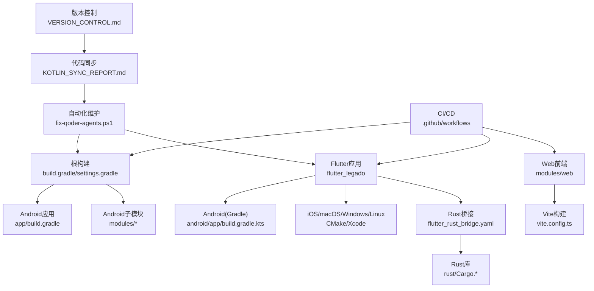
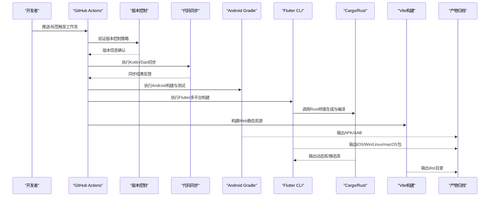
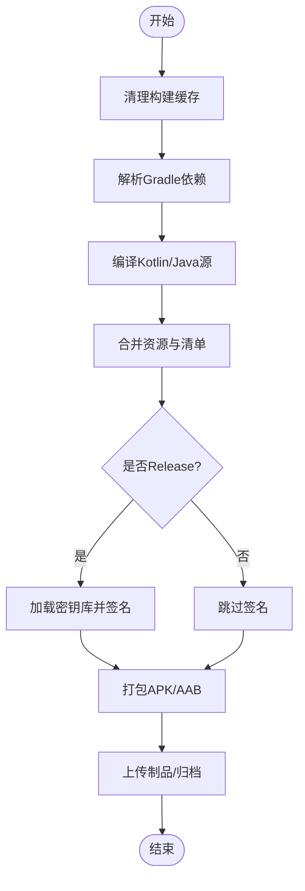
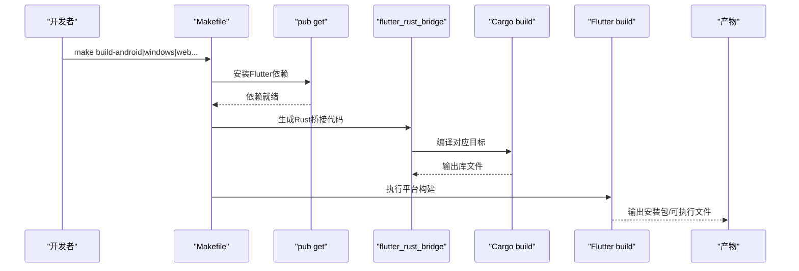
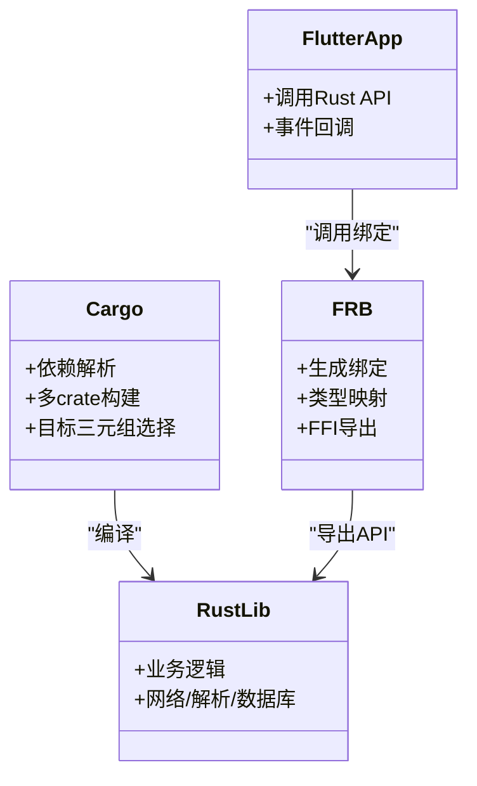
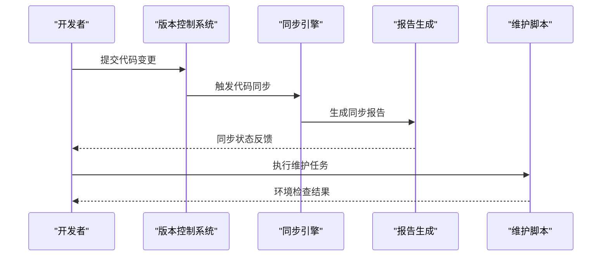
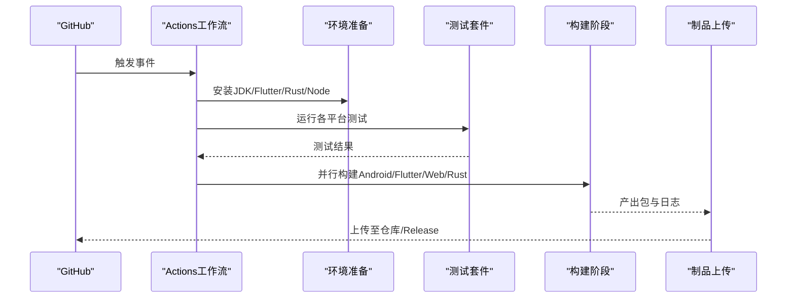
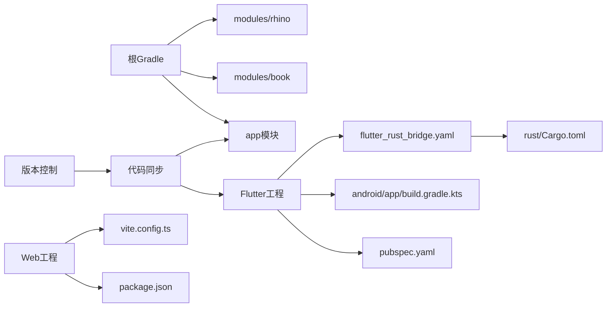

# 构建和部署

<cite>
**本文引用的文件**   
- [build.gradle](file://build.gradle)
- [gradle.properties](file://gradle.properties)
- [settings.gradle](file://settings.gradle)
- [app/build.gradle](file://app/build.gradle)
- [app/download.gradle](file://app/download.gradle)
- [flutter_legado/Makefile](file://flutter_legado/Makefile)
- [flutter_legado/pubspec.yaml](file://flutter_legado/pubspec.yaml)
- [flutter_legado/android/app/build.gradle.kts](file://flutter_legado/android/app/build.gradle.kts)
- [flutter_legado/scripts/build-apk.ps1](file://flutter_legado/scripts/build-apk.ps1)
- [flutter_legado/scripts/build-windows.bat](file://flutter_legado/scripts/build-windows.bat)
- [flutter_legado/scripts/build-windows.ps1](file://flutter_legado/scripts/build-windows.ps1)
- [flutter_legado/flutter_rust_bridge.yaml](file://flutter_legado/flutter_rust_bridge.yaml)
- [rust/Cargo.toml](file://rust/Cargo.toml)
- [rust/rust-toolchain.toml](file://rust/rust-toolchain.toml)
- [rust/.cargo/config.toml](file://rust/.cargo/config.toml)
- [modules/book/build.gradle](file://modules/book/build.gradle)
- [modules/rhino/build.gradle](file://modules/rhino/build.gradle)
- [modules/web/package.json](file://modules/web/package.json)
- [modules/web/vite.config.ts](file://modules/web/vite.config.ts)
- [.github/workflows/release.yml](file://.github/workflows/release.yml)
- [.github/dependabot.yml](file://.github/dependabot.yml)
- [package.json](file://package.json)
- [VERSION_CONTROL.md](file://VERSION_CONTROL.md)
- [KOTLIN_SYNC_REPORT.md](file://KOTLIN_SYNC_REPORT.md)
- [fix-qoder-agents.ps1](file://fix-qoder-agents.ps1)
</cite>

## 更新摘要
**变更内容**   
- 更新了版本控制文档以反映当前开发实践和工作流程
- 新增Kotlin与Dart代码库同步流程文档（282行）
- 创建PowerShell脚本用于自动化维护任务（92行）
- 完善了多语言代码库的同步机制说明
- 增强了自动化构建和维护脚本的集成

## 目录
1. [简介](#简介)
2. [项目结构](#项目结构)
3. [核心组件](#核心组件)
4. [架构总览](#架构总览)
5. [详细组件分析](#详细组件分析)
6. [依赖关系分析](#依赖关系分析)
7. [性能考量](#性能考量)
8. [故障排除指南](#故障排除指南)
9. [结论](#结论)
10. [附录](#附录)

## 简介
本文件面向Legado项目的构建与部署，覆盖Android APK、Flutter多平台打包、Rust交叉编译、Web前端构建等完整构建链；说明CI/CD流水线（GitHub Actions工作流）、自动化测试、代码检查、版本管理；解释依赖管理与版本控制（Gradle、Cargo、npm/pnpm）；介绍发布流程与签名配置（应用签名、证书管理、商店发布）；提供环境搭建与开发工具配置（SDK安装、IDE配置、调试环境）；并给出常见问题诊断、编译优化、内存调优等技术支持与脚本示例。

**更新** 本次更新重点介绍了新增的版本控制实践、Kotlin与Dart代码库同步机制，以及自动化维护脚本对构建系统的增强。

## 项目结构
本项目采用多模块、多语言混合工程：
- Android原生应用位于 app 模块，使用 Gradle/Kotlin 构建
- Flutter跨平台应用位于 flutter_legado，支持Android/iOS/Linux/macOS/Windows/Web
- Rust核心库位于 rust 目录，通过 flutter_rust_bridge 暴露给Flutter
- Web管理端位于 modules/web，基于Vite+TypeScript/Vue
- 顶层Gradle与Gradle Wrapper统一管理Android子模块
- CI/CD由 .github/workflows 定义，依赖管理由 dependabot 辅助
- **新增** 版本控制策略和代码同步机制

图表来源
- [build.gradle](file://build.gradle)
- [settings.gradle](file://settings.gradle)
- [app/build.gradle](file://app/build.gradle)
- [flutter_legado/android/app/build.gradle.kts](file://flutter_legado/android/app/build.gradle.kts)
- [flutter_legado/flutter_rust_bridge.yaml](file://flutter_legado/flutter_rust_bridge.yaml)
- [rust/Cargo.toml](file://rust/Cargo.toml)
- [modules/web/vite.config.ts](file://modules/web/vite.config.ts)
- [.github/workflows/release.yml](file://.github/workflows/release.yml)
- [VERSION_CONTROL.md](file://VERSION_CONTROL.md)
- [KOTLIN_SYNC_REPORT.md](file://KOTLIN_SYNC_REPORT.md)
- [fix-qoder-agents.ps1](file://fix-qoder-agents.ps1)

章节来源
- [build.gradle](file://build.gradle)
- [settings.gradle](file://settings.gradle)
- [app/build.gradle](file://app/build.gradle)
- [flutter_legado/Makefile](file://flutter_legado/Makefile)
- [flutter_legado/pubspec.yaml](file://flutter_legado/pubspec.yaml)
- [rust/Cargo.toml](file://rust/Cargo.toml)
- [modules/web/package.json](file://modules/web/package.json)
- [VERSION_CONTROL.md](file://VERSION_CONTROL.md)
- [KOTLIN_SYNC_REPORT.md](file://KOTLIN_SYNC_REPORT.md)
- [fix-qoder-agents.ps1](file://fix-qoder-agents.ps1)

## 核心组件
- Android构建系统
  - 顶层与app模块的Gradle脚本负责依赖解析、产物生成、签名与混淆
  - 下载与资源处理脚本用于外部依赖与资源准备
- Flutter构建系统
  - 通过Makefile统一入口，调用各平台构建命令
  - Android侧使用KTS Gradle脚本，其他平台使用CMake/Xcode
- Rust构建系统
  - Cargo多crate组织，配合rust-toolchain与.cargo配置进行交叉编译
  - 通过flutter_rust_bridge生成双向绑定供Flutter调用
- Web构建系统
  - Vite + TypeScript/Vue，pnpm包管理，ESLint/Prettier代码规范
- CI/CD
  - GitHub Actions工作流触发构建、测试、打包与发布
  - Dependabot维护依赖更新
- **新增** 版本控制与代码同步
  - 统一的版本控制策略和分支管理流程
  - Kotlin与Dart代码库的自动同步机制
  - PowerShell自动化维护脚本

章节来源
- [app/build.gradle](file://app/build.gradle)
- [app/download.gradle](file://app/download.gradle)
- [flutter_legado/Makefile](file://flutter_legado/Makefile)
- [flutter_legado/android/app/build.gradle.kts](file://flutter_legado/android/app/build.gradle.kts)
- [flutter_legado/flutter_rust_bridge.yaml](file://flutter_legado/flutter_rust_bridge.yaml)
- [rust/Cargo.toml](file://rust/Cargo.toml)
- [rust/rust-toolchain.toml](file://rust/rust-toolchain.toml)
- [rust/.cargo/config.toml](file://rust/.cargo/config.toml)
- [modules/web/package.json](file://modules/web/package.json)
- [modules/web/vite.config.ts](file://modules/web/vite.config.ts)
- [.github/workflows/release.yml](file://.github/workflows/release.yml)
- [.github/dependabot.yml](file://.github/dependabot.yml)
- [VERSION_CONTROL.md](file://VERSION_CONTROL.md)
- [KOTLIN_SYNC_REPORT.md](file://KOTLIN_SYNC_REPORT.md)
- [fix-qoder-agents.ps1](file://fix-qoder-agents.ps1)

## 架构总览
下图展示从源码到产物的端到端构建链路，包括Android、Flutter、Rust与Web的交互关系，以及新增的版本控制和代码同步机制。

图表来源
- [.github/workflows/release.yml](file://.github/workflows/release.yml)
- [app/build.gradle](file://app/build.gradle)
- [flutter_legado/Makefile](file://flutter_legado/Makefile)
- [flutter_legado/flutter_rust_bridge.yaml](file://flutter_legado/flutter_rust_bridge.yaml)
- [flutter_legado/android/app/build.gradle.kts](file://flutter_legado/android/app/build.gradle.kts)
- [rust/Cargo.toml](file://rust/Cargo.toml)
- [modules/web/vite.config.ts](file://modules/web/vite.config.ts)
- [VERSION_CONTROL.md](file://VERSION_CONTROL.md)
- [KOTLIN_SYNC_REPORT.md](file://KOTLIN_SYNC_REPORT.md)

## 详细组件分析

### Android构建与打包
- 构建目标
  - 生成Debug/Release APK或AAB
  - 资源合并、代码混淆、签名校验
- 关键脚本与配置
  - 顶层与app模块Gradle脚本定义依赖、插件、变体与签名
  - 下载脚本用于获取外部依赖与资源
- 典型流程
  - 清理缓存 -> 解析依赖 -> 编译Kotlin/Java -> 资源打包 -> 签名 -> 产物输出

图表来源
- [app/build.gradle](file://app/build.gradle)
- [app/download.gradle](file://app/download.gradle)
- [flutter_legado/android/app/build.gradle.kts](file://flutter_legado/android/app/build.gradle.kts)

章节来源
- [app/build.gradle](file://app/build.gradle)
- [app/download.gradle](file://app/download.gradle)
- [flutter_legado/android/app/build.gradle.kts](file://flutter_legado/android/app/build.gradle.kts)

### Flutter多平台打包
- 构建目标
  - Android APK/AAB、iOS IPA、Windows EXE、Linux AppImage、macOS DMG、Web站点
- 关键脚本与配置
  - Makefile统一入口，封装各平台构建命令
  - Android侧使用KTS Gradle脚本，其他平台使用CMake/Xcode
- 典型流程
  - 拉取依赖 -> 生成桥接代码 -> 编译Rust -> 构建目标平台 -> 产物归档

图表来源
- [flutter_legado/Makefile](file://flutter_legado/Makefile)
- [flutter_legado/pubspec.yaml](file://flutter_legado/pubspec.yaml)
- [flutter_legado/flutter_rust_bridge.yaml](file://flutter_legado/flutter_rust_bridge.yaml)
- [flutter_legado/android/app/build.gradle.kts](file://flutter_legado/android/app/build.gradle.kts)

章节来源
- [flutter_legado/Makefile](file://flutter_legado/Makefile)
- [flutter_legado/pubspec.yaml](file://flutter_legado/pubspec.yaml)
- [flutter_legado/flutter_rust_bridge.yaml](file://flutter_legado/flutter_rust_bridge.yaml)
- [flutter_legado/android/app/build.gradle.kts](file://flutter_legado/android/app/build.gradle.kts)

### Rust交叉编译与桥接
- 构建目标
  - 为Android(i686/arm64)、Windows、Linux、macOS等平台生成库
  - 通过flutter_rust_bridge生成Flutter可调用的绑定
- 关键配置
  - Cargo多crate组织业务逻辑
  - rust-toolchain指定工具链版本
  - .cargo/config.toml配置目标平台与链接器
- 典型流程
  - 解析Cargo依赖 -> 选择目标三元组 -> 编译Rust库 -> 生成桥接头/绑定 -> Flutter集成

图表来源
- [rust/Cargo.toml](file://rust/Cargo.toml)
- [rust/rust-toolchain.toml](file://rust/rust-toolchain.toml)
- [rust/.cargo/config.toml](file://rust/.cargo/config.toml)
- [flutter_legado/flutter_rust_bridge.yaml](file://flutter_legado/flutter_rust_bridge.yaml)

章节来源
- [rust/Cargo.toml](file://rust/Cargo.toml)
- [rust/rust-toolchain.toml](file://rust/rust-toolchain.toml)
- [rust/.cargo/config.toml](file://rust/.cargo/config.toml)
- [flutter_legado/flutter_rust_bridge.yaml](file://flutter_legado/flutter_rust_bridge.yaml)

### Web前端构建
- 构建目标
  - 生成静态站点（HTML/CSS/JS），适配浏览器
- 关键配置
  - package.json声明依赖与脚本
  - vite.config.ts配置构建选项与代理
  - pnpm-lock.yaml锁定依赖版本
- 典型流程
  - 安装依赖 -> 类型检查 -> 构建优化 -> 输出dist

图表来源
- [modules/web/package.json](file://modules/web/package.json)
- [modules/web/vite.config.ts](file://modules/web/vite.config.ts)

章节来源
- [modules/web/package.json](file://modules/web/package.json)
- [modules/web/vite.config.ts](file://modules/web/vite.config.ts)

### 版本控制与代码同步
- 版本控制策略
  - 统一的分支管理流程和提交规范
  - 语义化版本控制和标签管理
  - 变更日志自动生成
- Kotlin与Dart代码同步
  - 自动化的代码同步机制确保接口一致性
  - 同步报告生成和错误检测
  - 冲突解决和回滚机制
- 自动化维护脚本
  - PowerShell脚本用于环境检查和修复
  - 构建前预处理和后处理任务
  - 依赖管理和缓存优化

图表来源
- [VERSION_CONTROL.md](file://VERSION_CONTROL.md)
- [KOTLIN_SYNC_REPORT.md](file://KOTLIN_SYNC_REPORT.md)
- [fix-qoder-agents.ps1](file://fix-qoder-agents.ps1)

章节来源
- [VERSION_CONTROL.md](file://VERSION_CONTROL.md)
- [KOTLIN_SYNC_REPORT.md](file://KOTLIN_SYNC_REPORT.md)
- [fix-qoder-agents.ps1](file://fix-qoder-agents.ps1)

### CI/CD流水线（GitHub Actions）
- 触发条件
  - 推送分支、创建标签、Pull Request
- 主要任务
  - 设置环境（JDK、Flutter、Rust、Node）
  - 缓存依赖（Gradle、Cargo、npm）
  - 运行测试（Android单元测试、Flutter测试、Rust测试、Web测试）
  - 构建产物（APK/AAB、Flutter包、Web dist）
  - 上传制品与发布（Release）
- 依赖管理
  - Dependabot自动检测并创建PR更新依赖

图表来源
- [.github/workflows/release.yml](file://.github/workflows/release.yml)
- [.github/dependabot.yml](file://.github/dependabot.yml)

章节来源
- [.github/workflows/release.yml](file://.github/workflows/release.yml)
- [.github/dependabot.yml](file://.github/dependabot.yml)

## 依赖关系分析
- Gradle依赖
  - 顶层与app模块脚本管理Android依赖与插件
  - 子模块book/rhino独立构建与依赖隔离
- Flutter依赖
  - pubspec.yaml声明Flutter插件与第三方库
  - Android侧KTS脚本管理Android特定依赖
- Rust依赖
  - Cargo.toml声明crate与特性开关
  - 工具链与目标平台由rust-toolchain与.cargo配置
- Web依赖
  - package.json与pnpm-lock.yaml锁定版本
  - Vite配置影响构建行为
- **新增** 版本控制依赖
  - 版本控制策略文件协调多语言代码库
  - 同步脚本依赖特定的工具和配置

图表来源
- [build.gradle](file://build.gradle)
- [app/build.gradle](file://app/build.gradle)
- [modules/book/build.gradle](file://modules/book/build.gradle)
- [modules/rhino/build.gradle](file://modules/rhino/build.gradle)
- [flutter_legado/pubspec.yaml](file://flutter_legado/pubspec.yaml)
- [flutter_legado/android/app/build.gradle.kts](file://flutter_legado/android/app/build.gradle.kts)
- [flutter_legado/flutter_rust_bridge.yaml](file://flutter_legado/flutter_rust_bridge.yaml)
- [rust/Cargo.toml](file://rust/Cargo.toml)
- [modules/web/package.json](file://modules/web/package.json)
- [modules/web/vite.config.ts](file://modules/web/vite.config.ts)
- [VERSION_CONTROL.md](file://VERSION_CONTROL.md)
- [KOTLIN_SYNC_REPORT.md](file://KOTLIN_SYNC_REPORT.md)

章节来源
- [build.gradle](file://build.gradle)
- [app/build.gradle](file://app/build.gradle)
- [modules/book/build.gradle](file://modules/book/build.gradle)
- [modules/rhino/build.gradle](file://modules/rhino/build.gradle)
- [flutter_legado/pubspec.yaml](file://flutter_legado/pubspec.yaml)
- [flutter_legado/android/app/build.gradle.kts](file://flutter_legado/android/app/build.gradle.kts)
- [flutter_legado/flutter_rust_bridge.yaml](file://flutter_legado/flutter_rust_bridge.yaml)
- [rust/Cargo.toml](file://rust/Cargo.toml)
- [modules/web/package.json](file://modules/web/package.json)
- [modules/web/vite.config.ts](file://modules/web/vite.config.ts)
- [VERSION_CONTROL.md](file://VERSION_CONTROL.md)
- [KOTLIN_SYNC_REPORT.md](file://KOTLIN_SYNC_REPORT.md)

## 性能考量
- Gradle构建优化
  - 启用并行构建与守护进程
  - 合理配置增量编译与缓存
  - 按需启用混淆与资源压缩
- Flutter构建优化
  - 使用--release模式与--no-sound-null-safety（如适用）
  - 裁剪平台目标与插件
  - 预编译Rust库避免重复构建
- Rust构建优化
  - 使用LTO与优化级别
  - 仅编译必要crate与特性
  - 利用目标三元组与缓存
- Web构建优化
  - 启用代码分割与压缩
  - 静态资源缓存策略
  - 减少不必要依赖
- **新增** 同步性能优化
  - 增量同步减少不必要的代码复制
  - 并行处理多个代码库的同步任务
  - 缓存同步结果提高后续同步速度

[本节为通用指导，不直接分析具体文件]

## 故障排除指南
- Android构建问题
  - 检查JDK版本与Gradle版本匹配
  - 确认签名密钥库路径与密码正确
  - 清理缓存后重试构建
- Flutter构建问题
  - 确保Flutter SDK与插件版本兼容
  - 检查Rust工具链与目标平台配置
  - 查看平台特定错误日志（Xcode/CMake/NDK）
- Rust构建问题
  - 验证rust-toolchain与.cargo配置
  - 检查依赖冲突与特性开关
  - 使用cargo build --target 明确目标
- Web构建问题
  - 清理pnpm缓存并重新安装依赖
  - 检查环境变量与代理配置
  - 查看Vite构建日志定位错误
- **新增** 版本控制问题
  - 检查分支策略和提交规范
  - 验证代码同步脚本的执行权限
  - 查看同步报告中的错误信息
- **新增** 自动化脚本问题
  - 确认PowerShell执行策略配置
  - 检查脚本依赖的工具和环境变量
  - 查看脚本执行的详细日志

章节来源
- [app/build.gradle](file://app/build.gradle)
- [flutter_legado/Makefile](file://flutter_legado/Makefile)
- [flutter_legado/pubspec.yaml](file://flutter_legado/pubspec.yaml)
- [flutter_legado/android/app/build.gradle.kts](file://flutter_legado/android/app/build.gradle.kts)
- [rust/rust-toolchain.toml](file://rust/rust-toolchain.toml)
- [rust/.cargo/config.toml](file://rust/.cargo/config.toml)
- [modules/web/package.json](file://modules/web/package.json)
- [VERSION_CONTROL.md](file://VERSION_CONTROL.md)
- [KOTLIN_SYNC_REPORT.md](file://KOTLIN_SYNC_REPORT.md)
- [fix-qoder-agents.ps1](file://fix-qoder-agents.ps1)

## 结论
Legado项目通过Gradle、Flutter、Rust与Vite的组合，实现了跨平台应用的统一构建与持续交付。借助GitHub Actions与Dependabot，团队能够自动化测试、构建与发布，保证质量与效率。**本次更新重点增强了版本控制策略、Kotlin与Dart代码库的同步机制，以及自动化维护脚本的集成**。遵循本文档的环境搭建、构建流程、依赖管理与发布规范，可有效提升团队协作与交付稳定性。

[本节为总结性内容，不直接分析具体文件]

## 附录

### 环境搭建与开发工具配置
- Android
  - 安装JDK（推荐与Gradle版本匹配）
  - 安装Android SDK与命令行工具
  - 配置ANDROID_HOME与PATH
- Flutter
  - 安装Flutter SDK并加入PATH
  - 安装平台工具（Xcode、CMake、NDK等）
  - 启用相应平台支持
- Rust
  - 安装rustup与目标工具链
  - 配置.cargo与rust-toolchain
- Web
  - 安装Node.js与pnpm
  - 进入modules/web目录安装依赖
- **新增** 版本控制工具
  - 配置Git客户端和SSH密钥
  - 设置代码同步相关的环境变量
  - 安装PowerShell脚本执行所需的工具

[本节为通用指导，不直接分析具体文件]

### 构建脚本示例与部署配置
- Android APK构建
  - 参考脚本路径：[app/build.gradle](file://app/build.gradle)、[app/download.gradle](file://app/download.gradle)
- Flutter多平台构建
  - 参考脚本路径：[flutter_legado/Makefile](file://flutter_legado/Makefile)、[flutter_legado/scripts/build-apk.ps1](file://flutter_legado/scripts/build-apk.ps1)、[flutter_legado/scripts/build-windows.bat](file://flutter_legado/scripts/build-windows.bat)、[flutter_legado/scripts/build-windows.ps1](file://flutter_legado/scripts/build-windows.ps1)
- Rust交叉编译
  - 参考配置路径：[rust/Cargo.toml](file://rust/Cargo.toml)、[rust/rust-toolchain.toml](file://rust/rust-toolchain.toml)、[rust/.cargo/config.toml](file://rust/.cargo/config.toml)
- Web构建
  - 参考配置路径：[modules/web/package.json](file://modules/web/package.json)、[modules/web/vite.config.ts](file://modules/web/vite.config.ts)
- CI/CD流水线
  - 参考工作流路径：[.github/workflows/release.yml](file://.github/workflows/release.yml)
- **新增** 版本控制与同步
  - 版本控制策略：[VERSION_CONTROL.md](file://VERSION_CONTROL.md)
  - 代码同步流程：[KOTLIN_SYNC_REPORT.md](file://KOTLIN_SYNC_REPORT.md)
  - 自动化维护脚本：[fix-qoder-agents.ps1](file://fix-qoder-agents.ps1)

章节来源
- [app/build.gradle](file://app/build.gradle)
- [app/download.gradle](file://app/download.gradle)
- [flutter_legado/Makefile](file://flutter_legado/Makefile)
- [flutter_legado/scripts/build-apk.ps1](file://flutter_legado/scripts/build-apk.ps1)
- [flutter_legado/scripts/build-windows.bat](file://flutter_legado/scripts/build-windows.bat)
- [flutter_legado/scripts/build-windows.ps1](file://flutter_legado/scripts/build-windows.ps1)
- [flutter_legado/pubspec.yaml](file://flutter_legado/pubspec.yaml)
- [flutter_legado/android/app/build.gradle.kts](file://flutter_legado/android/app/build.gradle.kts)
- [rust/Cargo.toml](file://rust/Cargo.toml)
- [rust/rust-toolchain.toml](file://rust/rust-toolchain.toml)
- [rust/.cargo/config.toml](file://rust/.cargo/config.toml)
- [modules/web/package.json](file://modules/web/package.json)
- [modules/web/vite.config.ts](file://modules/web/vite.config.ts)
- [.github/workflows/release.yml](file://.github/workflows/release.yml)
- [VERSION_CONTROL.md](file://VERSION_CONTROL.md)
- [KOTLIN_SYNC_REPORT.md](file://KOTLIN_SYNC_REPORT.md)
- [fix-qoder-agents.ps1](file://fix-qoder-agents.ps1)