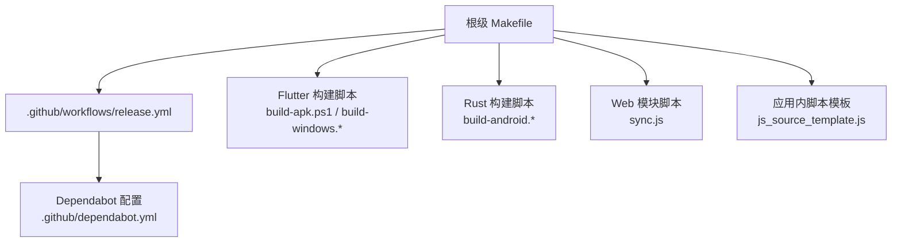
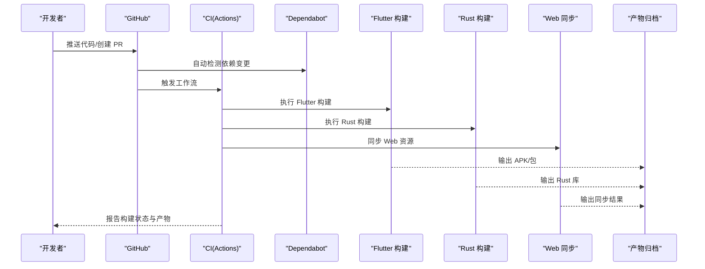
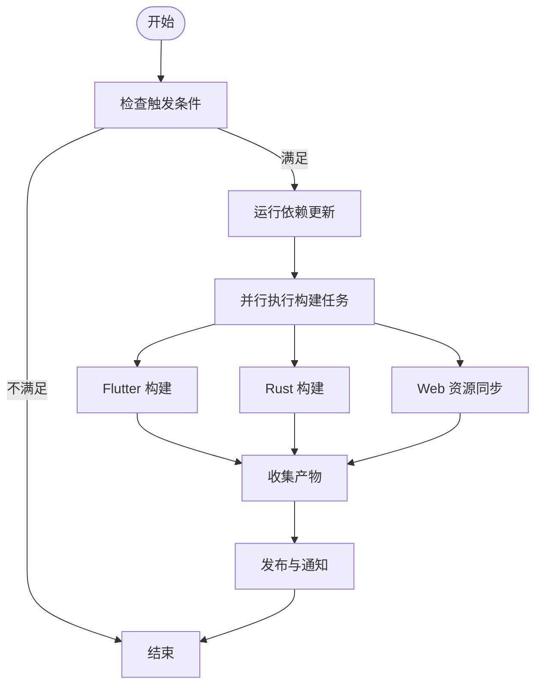
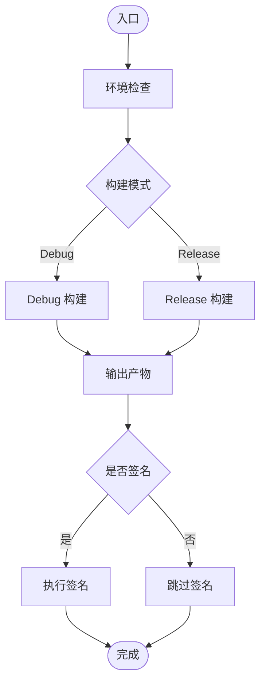
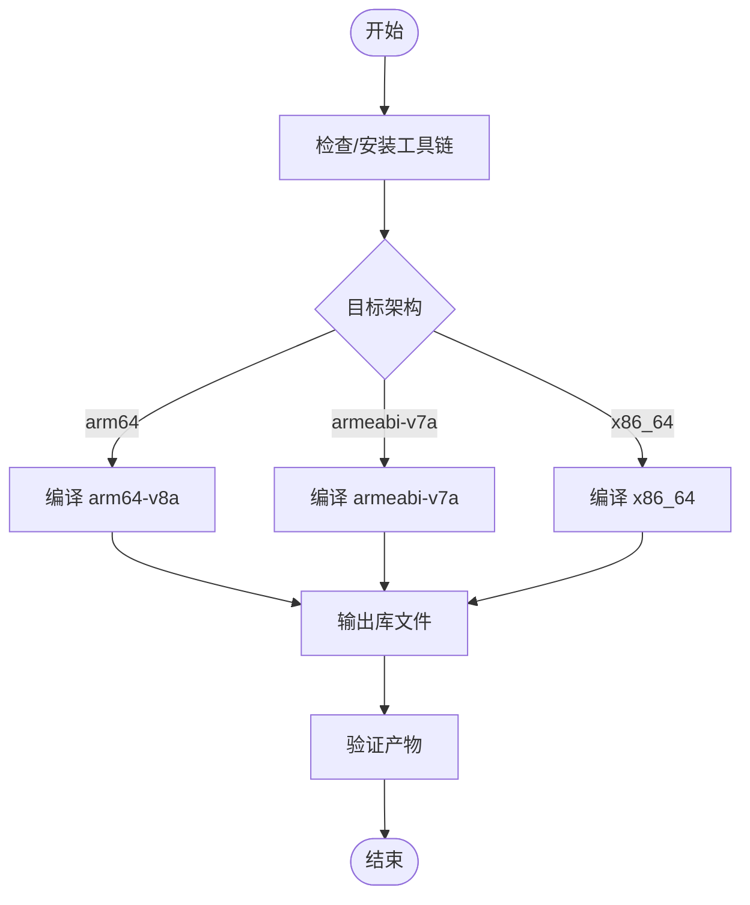
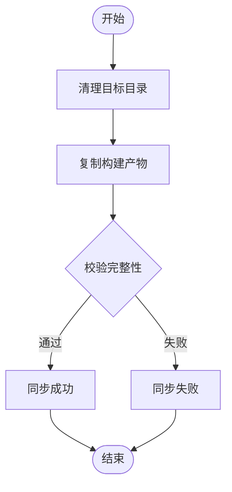
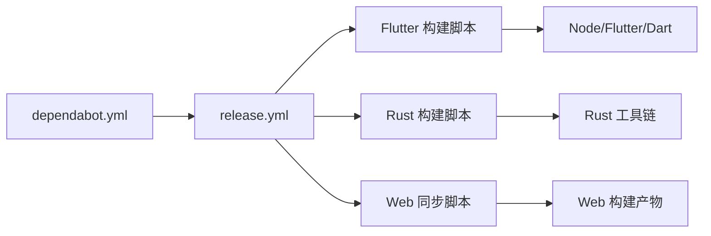

# 自动化脚本

<cite>
**本文引用的文件**   
- [README.md](file://README.md)
- [Makefile](file://Makefile)
- [.github/workflows/release.yml](file://.github/workflows/release.yml)
- [.github/dependabot.yml](file://.github/dependabot.yml)
- [flutter_legado/scripts/build-apk.ps1](file://flutter_legado/scripts/build-apk.ps1)
- [flutter_legado/scripts/build-windows.bat](file://flutter_legado/scripts/build-windows.bat)
- [flutter_legado/scripts/build-windows.ps1](file://flutter_legado/scripts/build-windows.ps1)
- [flutter_legado/scripts/generate-bridge.ps1](file://flutter_legado/scripts/generate-bridge.ps1)
- [flutter_legado/scripts/generate-bridge.sh](file://flutter_legado/scripts/generate-bridge.sh)
- [rust/scripts/build-android.ps1](file://rust/scripts/build-android.ps1)
- [rust/scripts/build-android.sh](file://rust/scripts/build-android.sh)
- [app/src/main/assets/scripts/js_source_template.js](file://app/src/main/assets/scripts/js_source_template.js)
- [modules/web/scripts/sync.js](file://modules/web/scripts/sync.js)
</cite>

## 目录
1. [简介](#简介)
2. [项目结构](#项目结构)
3. [核心组件](#核心组件)
4. [架构总览](#架构总览)
5. [详细组件分析](#详细组件分析)
6. [依赖关系分析](#依赖关系分析)
7. [性能与可靠性考虑](#性能与可靠性考虑)
8. [故障排查指南](#故障排查指南)
9. [结论](#结论)
10. [附录](#附录)

## 简介
本文件聚焦于 Legado 项目中的“自动化脚本”体系，涵盖持续集成工作流、构建脚本、桥接代码生成、资源同步以及应用内脚本模板等。目标是帮助开发者快速理解并正确使用这些脚本，提升构建效率与发布质量。

## 项目结构
本项目在多个子系统中包含自动化脚本：
- GitHub Actions 工作流：定义仓库级别的 CI/CD 流程（如依赖更新、版本发布）。
- Flutter 构建脚本：用于 Android APK 与 Windows 平台的构建与产物处理。
- Rust 构建脚本：面向 Android 的 Rust 库构建与打包。
- Web 模块脚本：用于前端资源的同步与部署准备。
- 应用内脚本模板：为 JS 源提供可复用的模板文件。

图表来源
- [Makefile](file://Makefile)
- [.github/workflows/release.yml](file://.github/workflows/release.yml)
- [.github/dependabot.yml](file://.github/dependabot.yml)
- [flutter_legado/scripts/build-apk.ps1](file://flutter_legado/scripts/build-apk.ps1)
- [flutter_legado/scripts/build-windows.bat](file://flutter_legado/scripts/build-windows.bat)
- [flutter_legado/scripts/build-windows.ps1](file://flutter_legado/scripts/build-windows.ps1)
- [rust/scripts/build-android.ps1](file://rust/scripts/build-android.ps1)
- [rust/scripts/build-android.sh](file://rust/scripts/build-android.sh)
- [modules/web/scripts/sync.js](file://modules/web/scripts/sync.js)
- [app/src/main/assets/scripts/js_source_template.js](file://app/src/main/assets/scripts/js_source_template.js)

章节来源
- [README.md](file://README.md)
- [Makefile](file://Makefile)

## 核心组件
- 持续集成与发布工作流
  - 通过 GitHub Actions 编排依赖更新与发布任务，统一触发条件与产物管理。
- Flutter 构建脚本
  - 提供跨平台构建能力（Android、Windows），封装常用参数与环境检查。
- Rust 构建脚本
  - 针对 Android 目标进行 Rust 库编译与打包，便于与上层 Kotlin/Java 集成。
- Web 同步脚本
  - 将 Web 模块资源同步到指定位置，保证前后端一致性。
- 应用内脚本模板
  - 为 JS 源提供标准化模板，降低编写成本与错误率。

章节来源
- [.github/workflows/release.yml](file://.github/workflows/release.yml)
- [.github/dependabot.yml](file://.github/dependabot.yml)
- [flutter_legado/scripts/build-apk.ps1](file://flutter_legado/scripts/build-apk.ps1)
- [flutter_legado/scripts/build-windows.bat](file://flutter_legado/scripts/build-windows.bat)
- [flutter_legado/scripts/build-windows.ps1](file://flutter_legado/scripts/build-windows.ps1)
- [rust/scripts/build-android.ps1](file://rust/scripts/build-android.ps1)
- [rust/scripts/build-android.sh](file://rust/scripts/build-android.sh)
- [modules/web/scripts/sync.js](file://modules/web/scripts/sync.js)
- [app/src/main/assets/scripts/js_source_template.js](file://app/src/main/assets/scripts/js_source_template.js)

## 架构总览
下图展示了从代码提交到产物的自动化流水线：

图表来源
- [.github/workflows/release.yml](file://.github/workflows/release.yml)
- [.github/dependabot.yml](file://.github/dependabot.yml)
- [flutter_legado/scripts/build-apk.ps1](file://flutter_legado/scripts/build-apk.ps1)
- [flutter_legado/scripts/build-windows.ps1](file://flutter_legado/scripts/build-windows.ps1)
- [rust/scripts/build-android.ps1](file://rust/scripts/build-android.ps1)
- [modules/web/scripts/sync.js](file://modules/web/scripts/sync.js)

## 详细组件分析

### 持续集成与发布工作流（GitHub Actions）
- 作用
  - 统一触发条件（分支、标签、PR）、并行执行多阶段任务（依赖检查、构建、测试、发布）。
  - 与 Dependabot 联动，自动维护依赖版本。
- 关键流程
  - 依赖更新：扫描依赖变更并生成 PR。
  - 构建阶段：调用 Flutter/Rust 构建脚本，产出各平台包。
  - 发布阶段：上传产物至发布渠道，生成版本说明。

图表来源
- [.github/workflows/release.yml](file://.github/workflows/release.yml)
- [.github/dependabot.yml](file://.github/dependabot.yml)

章节来源
- [.github/workflows/release.yml](file://.github/workflows/release.yml)
- [.github/dependabot.yml](file://.github/dependabot.yml)

### Flutter 构建脚本
- 作用
  - 封装 Android 与 Windows 的构建命令，统一环境变量与参数传递。
  - 支持调试/发布模式切换与产物路径管理。
- 典型用法
  - Android：生成 APK/AAB，设置签名与构建变体。
  - Windows：生成可执行文件与安装包。

图表来源
- [flutter_legado/scripts/build-apk.ps1](file://flutter_legado/scripts/build-apk.ps1)
- [flutter_legado/scripts/build-windows.bat](file://flutter_legado/scripts/build-windows.bat)
- [flutter_legado/scripts/build-windows.ps1](file://flutter_legado/scripts/build-windows.ps1)

章节来源
- [flutter_legado/scripts/build-apk.ps1](file://flutter_legado/scripts/build-apk.ps1)
- [flutter_legado/scripts/build-windows.bat](file://flutter_legado/scripts/build-windows.bat)
- [flutter_legado/scripts/build-windows.ps1](file://flutter_legado/scripts/build-windows.ps1)

### Rust 构建脚本（Android）
- 作用
  - 为 Android 目标编译 Rust 库，生成 .so 或静态库供上层使用。
  - 支持多架构交叉编译与工具链选择。
- 关键点
  - 工具链安装与校验。
  - 目标架构参数传递。
  - 产物路径与命名规范。

图表来源
- [rust/scripts/build-android.ps1](file://rust/scripts/build-android.ps1)
- [rust/scripts/build-android.sh](file://rust/scripts/build-android.sh)

章节来源
- [rust/scripts/build-android.ps1](file://rust/scripts/build-android.ps1)
- [rust/scripts/build-android.sh](file://rust/scripts/build-android.sh)

### Web 模块同步脚本
- 作用
  - 将 Web 模块的资源（HTML/CSS/JS）同步到应用 assets 或服务器目录。
  - 确保前端与后端资源一致，减少手动操作。
- 典型步骤
  - 清理目标目录。
  - 复制最新构建产物。
  - 校验文件完整性。

图表来源
- [modules/web/scripts/sync.js](file://modules/web/scripts/sync.js)

章节来源
- [modules/web/scripts/sync.js](file://modules/web/scripts/sync.js)

### 应用内脚本模板（JS 源）
- 作用
  - 为 JS 源提供标准模板，包含必要的方法声明、注释与示例。
  - 降低开发者上手成本，提高源码一致性。
- 内容要点
  - 元数据字段（名称、版本、描述等）。
  - 接口方法（请求、解析、分页等）。
  - 错误处理与日志记录建议。

章节来源
- [app/src/main/assets/scripts/js_source_template.js](file://app/src/main/assets/scripts/js_source_template.js)

## 依赖关系分析
- 工作流依赖
  - release.yml 依赖 Flutter/Rust 构建脚本与 Web 同步脚本。
  - dependabot.yml 驱动依赖更新 PR，影响后续构建。
- 构建脚本依赖
  - Flutter 构建脚本依赖 Node/Flutter/Dart SDK。
  - Rust 构建脚本依赖 Rust 工具链与目标平台交叉编译器。
- Web 同步脚本依赖
  - 依赖 Web 模块的构建产物与目标目录权限。

图表来源
- [.github/workflows/release.yml](file://.github/workflows/release.yml)
- [.github/dependabot.yml](file://.github/dependabot.yml)
- [flutter_legado/scripts/build-apk.ps1](file://flutter_legado/scripts/build-apk.ps1)
- [rust/scripts/build-android.ps1](file://rust/scripts/build-android.ps1)
- [modules/web/scripts/sync.js](file://modules/web/scripts/sync.js)

章节来源
- [.github/workflows/release.yml](file://.github/workflows/release.yml)
- [.github/dependabot.yml](file://.github/dependabot.yml)
- [flutter_legado/scripts/build-apk.ps1](file://flutter_legado/scripts/build-apk.ps1)
- [rust/scripts/build-android.ps1](file://rust/scripts/build-android.ps1)
- [modules/web/scripts/sync.js](file://modules/web/scripts/sync.js)

## 性能与可靠性考虑
- 并行化
  - 在 CI 中并行执行 Flutter/Rust/Web 任务，缩短整体构建时间。
- 缓存
  - 缓存依赖包与中间产物，避免重复下载与编译。
- 幂等性
  - 构建脚本应支持重复执行而不产生副作用。
- 错误隔离
  - 单个任务失败不应阻塞其他独立任务。
- 产物校验
  - 对生成的二进制与资源进行完整性校验，防止损坏产物进入发布流程。

[本节为通用指导，无需特定文件引用]

## 故障排查指南
- 常见问题
  - 环境缺失：确认 Node/Flutter/Rust 工具链已正确安装且版本匹配。
  - 权限问题：检查目标目录写入权限与签名密钥可用性。
  - 网络超时：配置代理或镜像源以加速依赖下载。
  - 资源不同步：重新运行 Web 同步脚本并校验产物路径。
- 定位方法
  - 查看 CI 日志定位失败阶段。
  - 本地复现构建命令，逐步缩小问题范围。
  - 启用详细日志输出，关注异常堆栈。

章节来源
- [.github/workflows/release.yml](file://.github/workflows/release.yml)
- [flutter_legado/scripts/build-apk.ps1](file://flutter_legado/scripts/build-apk.ps1)
- [rust/scripts/build-android.ps1](file://rust/scripts/build-android.ps1)
- [modules/web/scripts/sync.js](file://modules/web/scripts/sync.js)

## 结论
Legado 的自动化脚本体系覆盖了从依赖管理、多平台构建到资源同步的全链路。通过合理组织脚本与 CI 工作流，能够显著提升开发效率与发布质量。建议持续优化缓存策略、增强错误提示，并完善文档以降低使用门槛。

[本节为总结性内容，无需特定文件引用]

## 附录
- 快速启动
  - 使用根级 Makefile 聚合常用命令，简化日常操作。
- 扩展建议
  - 增加单元测试与集成测试阶段，提升稳定性。
  - 引入制品库管理，集中存储与分发构建产物。

章节来源
- [Makefile](file://Makefile)