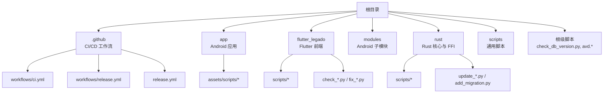
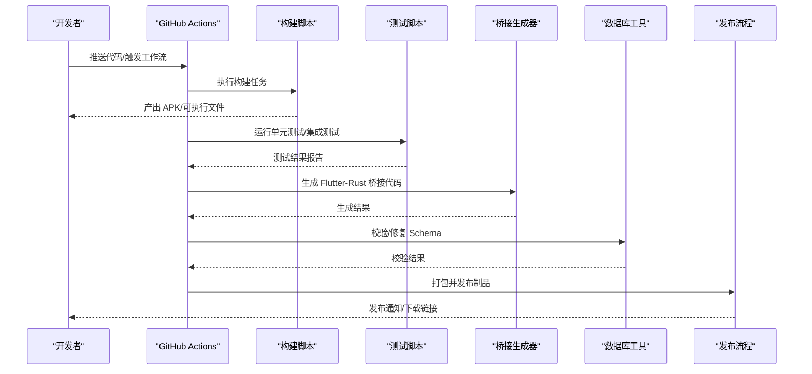
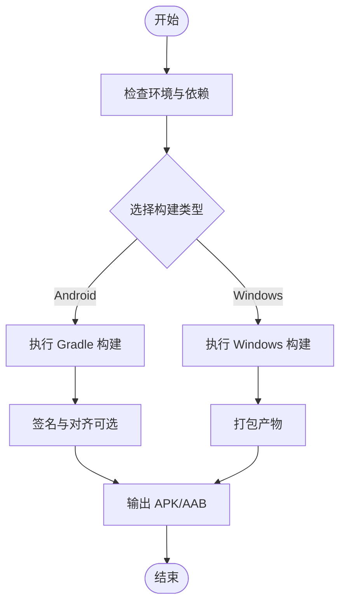
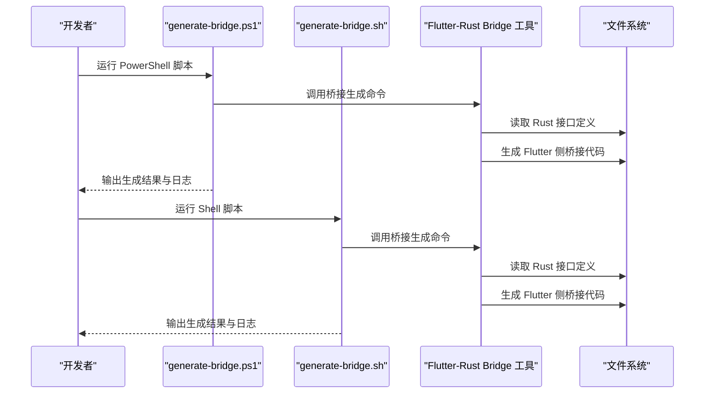
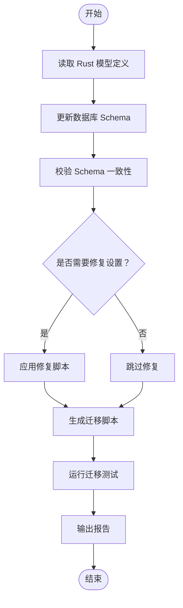
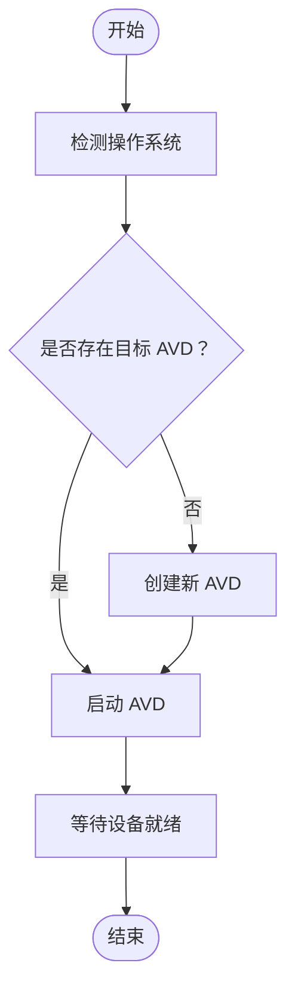
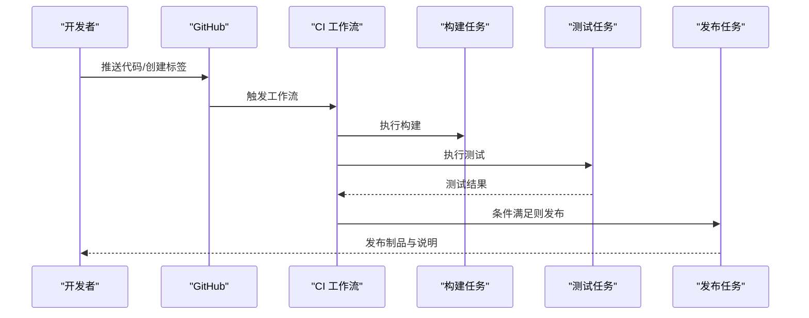
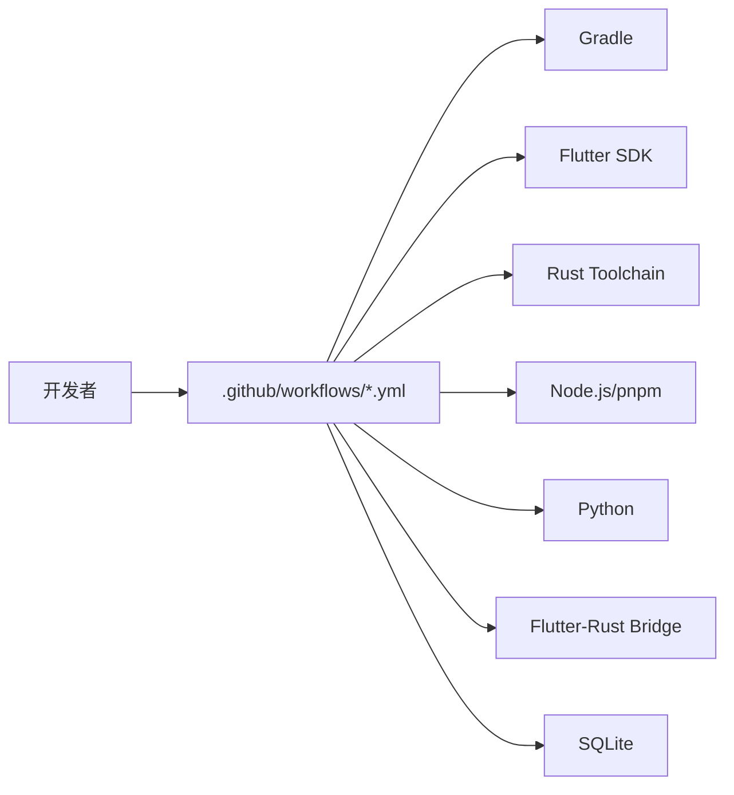

# 自动化脚本工具

<cite>
**本文引用的文件**   
- [README.md](file://README.md)
- [Makefile](file://Makefile)
- [app/src/main/assets/scripts/README.md](file://app/src/main/assets/scripts/README.md)
- [flutter_legado/scripts/build-apk.ps1](file://flutter_legado/scripts/build-apk.ps1)
- [flutter_legado/scripts/build-windows.bat](file://flutter_legado/scripts/build-windows.bat)
- [flutter_legado/scripts/build-windows.ps1](file://flutter_legado/scripts/build-windows.ps1)
- [flutter_legado/scripts/generate-bridge.ps1](file://flutter_legado/scripts/generate-bridge.ps1)
- [flutter_legado/scripts/generate-bridge.sh](file://flutter_legado/scripts/generate-bridge.sh)
- [rust/scripts/build-android.ps1](file://rust/scripts/build-android.ps1)
- [rust/scripts/build-android.sh](file://rust/scripts/build-android.sh)
- [rust/update_schema.py](file://rust/update_schema.py)
- [rust/update_rss_schema.ps1](file://rust/update_rss_schema.ps1)
- [rust/add_migration.py](file://rust/add_migration.py)
- [rust/test_migration.rs](file://rust/test_migration.rs)
- [flutter_legado/check_db.py](file://flutter_legado/check_db.py)
- [flutter_legado/check_schema.py](file://flutter_legado/check_schema.py)
- [flutter_legado/fix_settings.py](file://flutter_legado/fix_settings.py)
- [check_db_version.py](file://check_db_version.py)
- [avd.bat](file://avd.bat)
- [avd.sh](file://avd.sh)
- [package.json](file://package.json)
- [.github/workflows/ci.yml](file://.github/workflows/ci.yml)
- [.github/workflows/release.yml](file://.github/workflows/release.yml)
- [.github/release.yml](file://.github/release.yml)
</cite>

## 目录
1. [简介](#简介)
2. [项目结构](#项目结构)
3. [核心组件](#核心组件)
4. [架构总览](#架构总览)
5. [详细组件分析](#详细组件分析)
6. [依赖关系分析](#依赖关系分析)
7. [性能与稳定性考虑](#性能与稳定性考虑)
8. [故障排查指南](#故障排查指南)
9. [结论](#结论)
10. [附录](#附录)

## 简介
本文件面向“自动化脚本工具”主题，对 Legado 仓库中与构建、发布、数据库迁移、桥接代码生成、Android 环境准备以及 CI/CD 流水线相关的脚本进行系统化梳理。目标是帮助开发者快速定位并理解各脚本的职责、输入输出、执行顺序与常见问题，从而高效地维护与扩展自动化流程。

## 项目结构
Legado 采用多语言、多模块的工程组织方式：
- Android 应用层（Kotlin/Java）
- Flutter 跨平台前端
- Rust 核心库与 FFI 桥接
- Web 管理端（Vue/TS）
- GitHub Actions 工作流
- 大量辅助脚本（Shell/PowerShell/Python）

下图给出与自动化脚本相关的关键目录与文件的概览关系：

图表来源
- [README.md](file://README.md)
- [Makefile](file://Makefile)

章节来源
- [README.md](file://README.md)
- [Makefile](file://Makefile)

## 核心组件
围绕自动化脚本，本项目包含以下关键能力：
- 构建与打包：Android APK、Windows 可执行、Flutter 产物
- 桥接代码生成：Flutter ↔ Rust 的桥接代码自动生成
- 数据库与迁移：Schema 校验、修复、迁移脚本生成与测试
- 环境准备：Android AVD 创建与启动
- 持续集成与发布：GitHub Actions 触发构建、测试、发布

章节来源
- [Makefile](file://Makefile)
- [package.json](file://package.json)

## 架构总览
下图展示从开发者触发到产物产出的端到端自动化流程，涵盖本地脚本与 CI 工作流的协作关系：

图表来源
- [.github/workflows/ci.yml](file://.github/workflows/ci.yml)
- [.github/workflows/release.yml](file://.github/workflows/release.yml)
- [flutter_legado/scripts/generate-bridge.sh](file://flutter_legado/scripts/generate-bridge.sh)
- [flutter_legado/scripts/generate-bridge.ps1](file://flutter_legado/scripts/generate-bridge.ps1)
- [rust/update_schema.py](file://rust/update_schema.py)
- [check_db_version.py](file://check_db_version.py)

## 详细组件分析

### 构建与打包脚本
- Android APK 构建（PowerShell）
  - 职责：调用 Gradle 构建 Android 应用包
  - 典型输入：签名配置、构建变体、环境变量
  - 典型输出：APK/AAB 文件
  - 参考路径：[flutter_legado/scripts/build-apk.ps1](file://flutter_legado/scripts/build-apk.ps1)

- Windows 构建（批处理/PowerShell）
  - 职责：构建 Flutter Windows 目标或相关依赖
  - 典型输入：目标平台、构建模式（Debug/Release）
  - 典型输出：Windows 可执行文件或安装包
  - 参考路径：[flutter_legado/scripts/build-windows.bat](file://flutter_legado/scripts/build-windows.bat), [flutter_legado/scripts/build-windows.ps1](file://flutter_legado/scripts/build-windows.ps1)

- Android 构建（Rust 侧脚本）
  - 职责：在 Rust 环境中为 Android 构建原生库或依赖
  - 参考路径：[rust/scripts/build-android.ps1](file://rust/scripts/build-android.ps1), [rust/scripts/build-android.sh](file://rust/scripts/build-android.sh)

图表来源
- [flutter_legado/scripts/build-apk.ps1](file://flutter_legado/scripts/build-apk.ps1)
- [flutter_legado/scripts/build-windows.bat](file://flutter_legado/scripts/build-windows.bat)
- [flutter_legado/scripts/build-windows.ps1](file://flutter_legado/scripts/build-windows.ps1)
- [rust/scripts/build-android.ps1](file://rust/scripts/build-android.ps1)
- [rust/scripts/build-android.sh](file://rust/scripts/build-android.sh)

章节来源
- [flutter_legado/scripts/build-apk.ps1](file://flutter_legado/scripts/build-apk.ps1)
- [flutter_legado/scripts/build-windows.bat](file://flutter_legado/scripts/build-windows.bat)
- [flutter_legado/scripts/build-windows.ps1](file://flutter_legado/scripts/build-windows.ps1)
- [rust/scripts/build-android.ps1](file://rust/scripts/build-android.ps1)
- [rust/scripts/build-android.sh](file://rust/scripts/build-android.sh)

### 桥接代码生成
- Flutter ↔ Rust 桥接生成器
  - 职责：根据 Rust 接口定义生成 Flutter 侧桥接代码，确保类型一致与 API 可用
  - 支持平台：Windows（PowerShell）、Unix（Shell）
  - 参考路径：[flutter_legado/scripts/generate-bridge.ps1](file://flutter_legado/scripts/generate-bridge.ps1), [flutter_legado/scripts/generate-bridge.sh](file://flutter_legado/scripts/generate-bridge.sh)

图表来源
- [flutter_legado/scripts/generate-bridge.ps1](file://flutter_legado/scripts/generate-bridge.ps1)
- [flutter_legado/scripts/generate-bridge.sh](file://flutter_legado/scripts/generate-bridge.sh)

章节来源
- [flutter_legado/scripts/generate-bridge.ps1](file://flutter_legado/scripts/generate-bridge.ps1)
- [flutter_legado/scripts/generate-bridge.sh](file://flutter_legado/scripts/generate-bridge.sh)

### 数据库与迁移工具
- Schema 更新与校验
  - 职责：根据 Rust 模型更新数据库 Schema，或在 Flutter 侧校验/修复设置与 Schema
  - 参考路径：[rust/update_schema.py](file://rust/update_schema.py), [flutter_legado/check_schema.py](file://flutter_legado/check_schema.py), [flutter_legado/fix_settings.py](file://flutter_legado/fix_settings.py)

- RSS Schema 更新
  - 职责：针对 RSS 相关数据结构的 Schema 更新脚本
  - 参考路径：[rust/update_rss_schema.ps1](file://rust/update_rss_schema.ps1)

- 迁移脚本生成与测试
  - 职责：生成迁移脚本并运行迁移测试，保证版本升级一致性
  - 参考路径：[rust/add_migration.py](file://rust/add_migration.py), [rust/test_migration.rs](file://rust/test_migration.rs)

- 数据库版本检查
  - 职责：检查当前数据库版本与期望版本是否一致
  - 参考路径：[check_db_version.py](file://check_db_version.py)

图表来源
- [rust/update_schema.py](file://rust/update_schema.py)
- [flutter_legado/check_schema.py](file://flutter_legado/check_schema.py)
- [flutter_legado/fix_settings.py](file://flutter_legado/fix_settings.py)
- [rust/update_rss_schema.ps1](file://rust/update_rss_schema.ps1)
- [rust/add_migration.py](file://rust/add_migration.py)
- [rust/test_migration.rs](file://rust/test_migration.rs)
- [check_db_version.py](file://check_db_version.py)

章节来源
- [rust/update_schema.py](file://rust/update_schema.py)
- [flutter_legado/check_schema.py](file://flutter_legado/check_schema.py)
- [flutter_legado/fix_settings.py](file://flutter_legado/fix_settings.py)
- [rust/update_rss_schema.ps1](file://rust/update_rss_schema.ps1)
- [rust/add_migration.py](file://rust/add_migration.py)
- [rust/test_migration.rs](file://rust/test_migration.rs)
- [check_db_version.py](file://check_db_version.py)

### 环境准备脚本（Android AVD）
- 职责：创建或启动 Android 虚拟设备，便于本地调试与自动化测试
- 参考路径：[avd.bat](file://avd.bat), [avd.sh](file://avd.sh)

图表来源
- [avd.bat](file://avd.bat)
- [avd.sh](file://avd.sh)

章节来源
- [avd.bat](file://avd.bat)
- [avd.sh](file://avd.sh)

### 持续集成与发布（GitHub Actions）
- CI 工作流
  - 职责：在代码推送或 PR 时触发构建、测试、静态检查等
  - 参考路径：[.github/workflows/ci.yml](file://.github/workflows/ci.yml)

- 发布工作流
  - 职责：在标签或特定分支触发时，构建产物并创建发布说明与附件
  - 参考路径：[.github/workflows/release.yml](file://.github/workflows/release.yml), [.github/release.yml](file://.github/release.yml)

图表来源
- [.github/workflows/ci.yml](file://.github/workflows/ci.yml)
- [.github/workflows/release.yml](file://.github/workflows/release.yml)
- [.github/release.yml](file://.github/release.yml)

章节来源
- [.github/workflows/ci.yml](file://.github/workflows/ci.yml)
- [.github/workflows/release.yml](file://.github/workflows/release.yml)
- [.github/release.yml](file://.github/release.yml)

### 内置脚本资源（应用内）
- 应用内 assets/scripts 目录提供运行时可用的脚本模板或示例
- 参考路径：[app/src/main/assets/scripts/README.md](file://app/src/main/assets/scripts/README.md)

章节来源
- [app/src/main/assets/scripts/README.md](file://app/src/main/assets/scripts/README.md)

## 依赖关系分析
- 构建脚本依赖
  - Gradle（Android 构建）
  - Flutter SDK（跨平台构建）
  - Rust Toolchain（原生库与 FFI）
  - Node.js/pnpm（Web 前端与工具链）
- 桥接生成依赖
  - Flutter-Rust Bridge 工具（frb）
- 数据库工具依赖
  - Python（Schema 更新与校验）
  - SQLite（数据库操作）
- CI 依赖
  - GitHub Actions 环境（预置 JDK、Flutter、Rust、Node）

图表来源
- [.github/workflows/ci.yml](file://.github/workflows/ci.yml)
- [.github/workflows/release.yml](file://.github/workflows/release.yml)
- [package.json](file://package.json)

章节来源
- [.github/workflows/ci.yml](file://.github/workflows/ci.yml)
- [.github/workflows/release.yml](file://.github/workflows/release.yml)
- [package.json](file://package.json)

## 性能与稳定性考虑
- 并行化与缓存
  - 在 CI 中缓存 Gradle、Flutter、Rust 依赖，减少重复下载与编译时间
  - 将构建与测试任务拆分，提高并发度
- 幂等性与回滚
  - 数据库迁移脚本需具备幂等性，支持失败回滚
  - 桥接生成器应能增量更新，避免全量重写导致冲突
- 错误隔离与重试
  - 网络请求（如下载依赖）增加重试机制
  - 关键步骤失败时应快速失败并输出详细日志
- 资源限制
  - 控制并发构建数量，避免内存溢出
  - 合理设置超时与资源上限

## 故障排查指南
- 构建失败
  - 检查 JDK/Flutter/Rust 版本与环境变量
  - 查看构建日志中的依赖下载与编译错误
  - 参考路径：[flutter_legado/scripts/build-apk.ps1](file://flutter_legado/scripts/build-apk.ps1), [flutter_legado/scripts/build-windows.ps1](file://flutter_legado/scripts/build-windows.ps1)

- 桥接生成异常
  - 确认 Rust 接口定义未变更或未正确导出
  - 检查 frb 工具安装与权限
  - 参考路径：[flutter_legado/scripts/generate-bridge.ps1](file://flutter_legado/scripts/generate-bridge.ps1), [flutter_legado/scripts/generate-bridge.sh](file://flutter_legado/scripts/generate-bridge.sh)

- 数据库不一致
  - 使用 check_db_version.py 检查版本差异
  - 运行 update_schema.py 与 add_migration.py 生成并验证迁移
  - 参考路径：[check_db_version.py](file://check_db_version.py), [rust/update_schema.py](file://rust/update_schema.py), [rust/add_migration.py](file://rust/add_migration.py)

- AVD 无法启动
  - 检查 Android SDK 与模拟器镜像是否匹配
  - 清理旧 AVD 后重新创建
  - 参考路径：[avd.bat](file://avd.bat), [avd.sh](file://avd.sh)

章节来源
- [flutter_legado/scripts/build-apk.ps1](file://flutter_legado/scripts/build-apk.ps1)
- [flutter_legado/scripts/build-windows.ps1](file://flutter_legado/scripts/build-windows.ps1)
- [flutter_legado/scripts/generate-bridge.ps1](file://flutter_legado/scripts/generate-bridge.ps1)
- [flutter_legado/scripts/generate-bridge.sh](file://flutter_legado/scripts/generate-bridge.sh)
- [check_db_version.py](file://check_db_version.py)
- [rust/update_schema.py](file://rust/update_schema.py)
- [rust/add_migration.py](file://rust/add_migration.py)
- [avd.bat](file://avd.bat)
- [avd.sh](file://avd.sh)

## 结论
Legado 的自动化脚本体系覆盖了从构建、测试、桥接生成到数据库迁移与发布的完整链路。通过清晰的脚本分工与 CI/CD 集成，团队可以高效地进行跨平台开发与发布。建议持续优化脚本的可观测性、幂等性与容错能力，以提升整体交付效率与稳定性。

## 附录
- 常用命令速查
  - 构建 Android APK：参考 [flutter_legado/scripts/build-apk.ps1](file://flutter_legado/scripts/build-apk.ps1)
  - 构建 Windows 应用：参考 [flutter_legado/scripts/build-windows.ps1](file://flutter_legado/scripts/build-windows.ps1)
  - 生成桥接代码：参考 [flutter_legado/scripts/generate-bridge.ps1](file://flutter_legado/scripts/generate-bridge.ps1)
  - 更新数据库 Schema：参考 [rust/update_schema.py](file://rust/update_schema.py)
  - 检查数据库版本：参考 [check_db_version.py](file://check_db_version.py)
  - 准备 AVD：参考 [avd.sh](file://avd.sh)