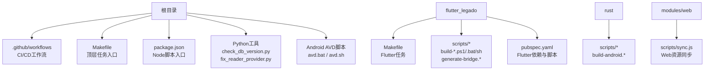
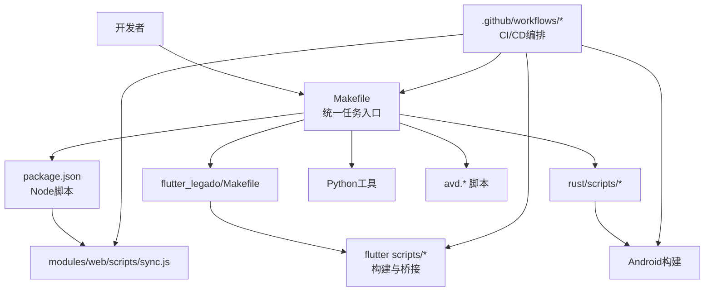
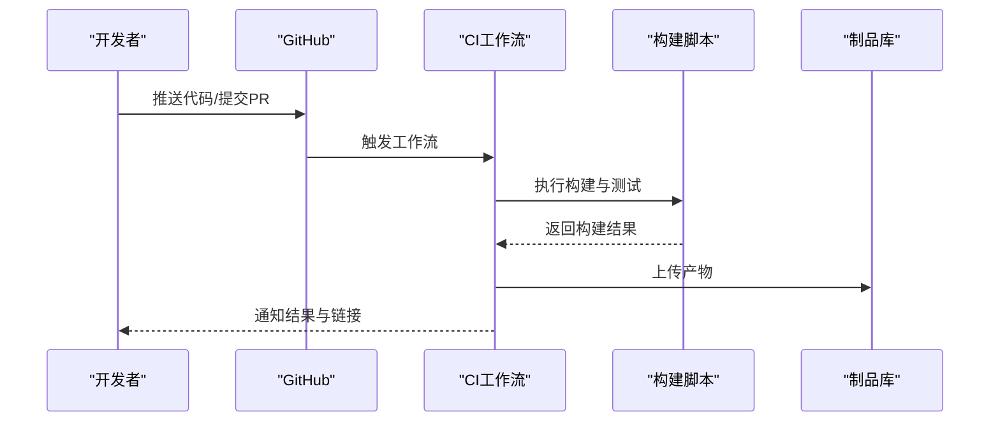
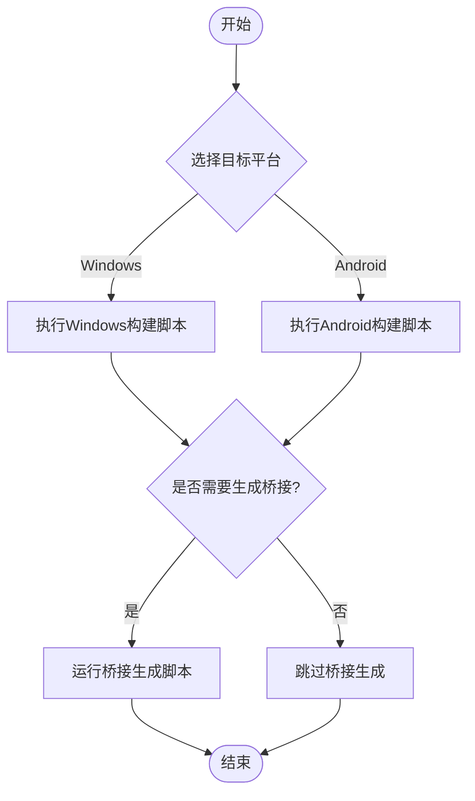
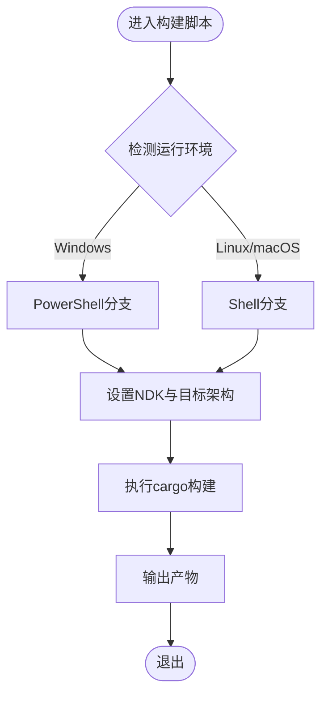
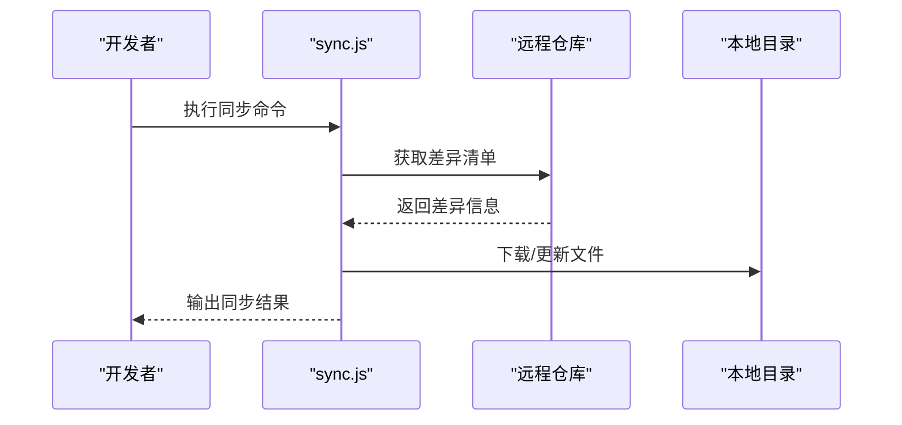
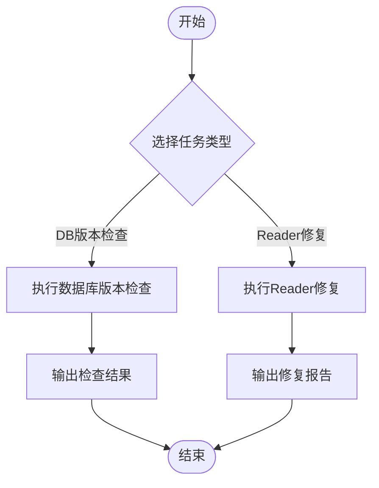
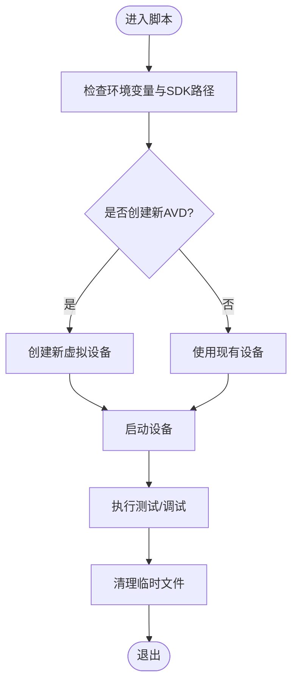
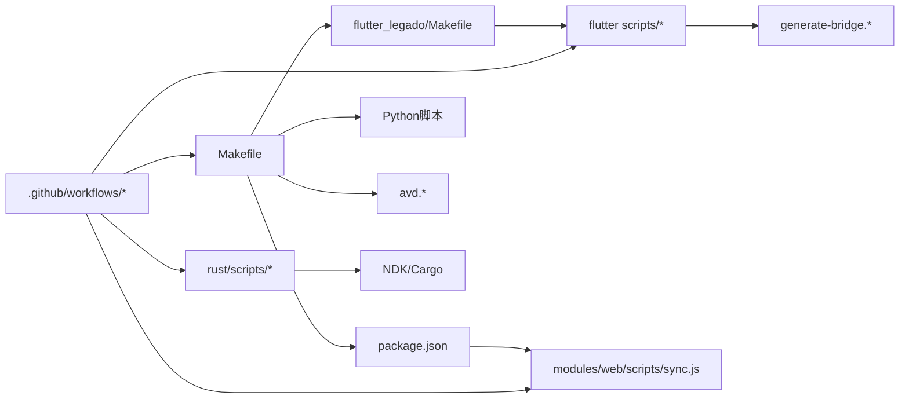

# 自动化脚本工具集

<cite>
**本文引用的文件**   
- [Makefile](file://Makefile)
- [package.json](file://package.json)
- [.github/workflows/ci.yml](file://.github/workflows/ci.yml)
- [.github/workflows/release.yml](file://.github/workflows/release.yml)
- [.github/dependabot.yml](file://.github/dependabot.yml)
- [flutter_legado/scripts/build-apk.ps1](file://flutter_legado/scripts/build-apk.ps1)
- [flutter_legado/scripts/build-windows.bat](file://flutter_legado/scripts/build-windows.bat)
- [flutter_legado/scripts/build-windows.ps1](file://flutter_legado/scripts/build-windows.ps1)
- [flutter_legado/scripts/generate-bridge.ps1](file://flutter_legado/scripts/generate-bridge.ps1)
- [flutter_legado/scripts/generate-bridge.sh](file://flutter_legado/scripts/generate-bridge.sh)
- [flutter_legado/Makefile](file://flutter_legado/Makefile)
- [flutter_legado/pubspec.yaml](file://flutter_legado/pubspec.yaml)
- [modules/web/scripts/sync.js](file://modules/web/scripts/sync.js)
- [rust/scripts/build-android.ps1](file://rust/scripts/build-android.ps1)
- [rust/scripts/build-android.sh](file://rust/scripts/build-android.sh)
- [check_db_version.py](file://check_db_version.py)
- [fix_reader_provider.py](file://fix_reader_provider.py)
- [avd.bat](file://avd.bat)
- [avd.sh](file://avd.sh)
</cite>

## 目录
1. [简介](#简介)
2. [项目结构](#项目结构)
3. [核心组件](#核心组件)
4. [架构总览](#架构总览)
5. [详细组件分析](#详细组件分析)
6. [依赖关系分析](#依赖关系分析)
7. [性能与稳定性考虑](#性能与稳定性考虑)
8. [故障排查指南](#故障排查指南)
9. [结论](#结论)
10. [附录](#附录)

## 简介
本文件面向Legado项目的“自动化脚本工具集”，聚焦于构建、发布、测试、同步与平台适配等关键流程的脚本化能力。内容涵盖：
- CI/CD流水线（GitHub Actions）
- Flutter多端构建脚本（Windows/Android）
- Rust子模块构建脚本
- Web资源同步脚本
- Python辅助脚本（数据库版本检查、代码修复等）
- Android虚拟设备管理脚本
- 顶层Makefile与包管理配置

通过系统化梳理，帮助开发者快速定位并正确使用这些脚本，提升开发与交付效率。

## 项目结构
自动化相关脚本分布在多个子模块与根目录中，按职责划分如下：
- 根级：CI工作流、依赖管理、顶层构建入口、通用Python工具
- Flutter子模块：跨平台构建脚本、桥接生成、Flutter工程配置
- Rust子模块：Android构建脚本
- Web子模块：资源同步脚本
- Android工具：AVD管理脚本

**图表来源**
- [Makefile](file://Makefile)
- [package.json](file://package.json)
- [.github/workflows/ci.yml](file://.github/workflows/ci.yml)
- [.github/workflows/release.yml](file://.github/workflows/release.yml)
- [.github/dependabot.yml](file://.github/dependabot.yml)
- [flutter_legado/Makefile](file://flutter_legado/Makefile)
- [flutter_legado/pubspec.yaml](file://flutter_legado/pubspec.yaml)
- [flutter_legado/scripts/build-apk.ps1](file://flutter_legado/scripts/build-apk.ps1)
- [flutter_legado/scripts/build-windows.bat](file://flutter_legado/scripts/build-windows.bat)
- [flutter_legado/scripts/build-windows.ps1](file://flutter_legado/scripts/build-windows.ps1)
- [flutter_legado/scripts/generate-bridge.ps1](file://flutter_legado/scripts/generate-bridge.ps1)
- [flutter_legado/scripts/generate-bridge.sh](file://flutter_legado/scripts/generate-bridge.sh)
- [modules/web/scripts/sync.js](file://modules/web/scripts/sync.js)
- [rust/scripts/build-android.ps1](file://rust/scripts/build-android.ps1)
- [rust/scripts/build-android.sh](file://rust/scripts/build-android.sh)
- [check_db_version.py](file://check_db_version.py)
- [fix_reader_provider.py](file://fix_reader_provider.py)
- [avd.bat](file://avd.bat)
- [avd.sh](file://avd.sh)

**章节来源**
- [Makefile](file://Makefile)
- [package.json](file://package.json)
- [.github/workflows/ci.yml](file://.github/workflows/ci.yml)
- [.github/workflows/release.yml](file://.github/workflows/release.yml)
- [.github/dependabot.yml](file://.github/dependabot.yml)
- [flutter_legado/Makefile](file://flutter_legado/Makefile)
- [flutter_legado/pubspec.yaml](file://flutter_legado/pubspec.yaml)
- [modules/web/scripts/sync.js](file://modules/web/scripts/sync.js)
- [rust/scripts/build-android.ps1](file://rust/scripts/build-android.ps1)
- [rust/scripts/build-android.sh](file://rust/scripts/build-android.sh)
- [check_db_version.py](file://check_db_version.py)
- [fix_reader_provider.py](file://fix_reader_provider.py)
- [avd.bat](file://avd.bat)
- [avd.sh](file://avd.sh)

## 核心组件
- CI/CD流水线
  - GitHub Actions工作流负责持续集成与发布，包括构建、测试、产物上传与发布流程。
- Flutter构建与桥接
  - 提供Windows与Android构建脚本，以及Rust-Frontend桥接代码生成脚本。
- Rust构建脚本
  - 针对Android平台的构建脚本，统一Rust侧构建入口。
- Web资源同步
  - Node脚本用于Web资源同步与一致性校验。
- Python工具
  - 数据库版本检查与Reader Provider修复等辅助脚本。
- Android AVD管理
  - Windows与Shell脚本用于创建与管理Android虚拟设备。

**章节来源**
- [.github/workflows/ci.yml](file://.github/workflows/ci.yml)
- [.github/workflows/release.yml](file://.github/workflows/release.yml)
- [.github/dependabot.yml](file://.github/dependabot.yml)
- [flutter_legado/scripts/build-apk.ps1](file://flutter_legado/scripts/build-apk.ps1)
- [flutter_legado/scripts/build-windows.bat](file://flutter_legado/scripts/build-windows.bat)
- [flutter_legado/scripts/build-windows.ps1](file://flutter_legado/scripts/build-windows.ps1)
- [flutter_legado/scripts/generate-bridge.ps1](file://flutter_legado/scripts/generate-bridge.ps1)
- [flutter_legado/scripts/generate-bridge.sh](file://flutter_legado/scripts/generate-bridge.sh)
- [rust/scripts/build-android.ps1](file://rust/scripts/build-android.ps1)
- [rust/scripts/build-android.sh](file://rust/scripts/build-android.sh)
- [modules/web/scripts/sync.js](file://modules/web/scripts/sync.js)
- [check_db_version.py](file://check_db_version.py)
- [fix_reader_provider.py](file://fix_reader_provider.py)
- [avd.bat](file://avd.bat)
- [avd.sh](file://avd.sh)

## 架构总览
自动化脚本体系围绕“统一入口 + 多平台脚本 + CI编排”展开：
- 顶层Makefile作为统一任务入口，协调各子模块脚本
- Node/Python/PowerShell/Bash脚本分别承担不同平台与语言生态的任务
- GitHub Actions编排端到端流水线，触发构建、测试与发布

**图表来源**
- [Makefile](file://Makefile)
- [package.json](file://package.json)
- [flutter_legado/Makefile](file://flutter_legado/Makefile)
- [flutter_legado/scripts/build-apk.ps1](file://flutter_legado/scripts/build-apk.ps1)
- [flutter_legado/scripts/build-windows.bat](file://flutter_legado/scripts/build-windows.bat)
- [flutter_legado/scripts/build-windows.ps1](file://flutter_legado/scripts/build-windows.ps1)
- [flutter_legado/scripts/generate-bridge.ps1](file://flutter_legado/scripts/generate-bridge.ps1)
- [flutter_legado/scripts/generate-bridge.sh](file://flutter_legado/scripts/generate-bridge.sh)
- [rust/scripts/build-android.ps1](file://rust/scripts/build-android.ps1)
- [rust/scripts/build-android.sh](file://rust/scripts/build-android.sh)
- [modules/web/scripts/sync.js](file://modules/web/scripts/sync.js)
- [.github/workflows/ci.yml](file://.github/workflows/ci.yml)
- [.github/workflows/release.yml](file://.github/workflows/release.yml)

## 详细组件分析

### CI/CD流水线（GitHub Actions）
- 作用：在推送或拉取请求时执行构建、测试、静态检查与发布；支持依赖更新提醒与发布流程。
- 关键要点：
  - 使用矩阵策略覆盖多平台与多配置
  - 缓存依赖加速构建
  - 产物归档与发布到仓库或外部存储
  - 依赖管理（Dependabot）自动维护依赖版本

**图表来源**
- [.github/workflows/ci.yml](file://.github/workflows/ci.yml)
- [.github/workflows/release.yml](file://.github/workflows/release.yml)
- [.github/dependabot.yml](file://.github/dependabot.yml)

**章节来源**
- [.github/workflows/ci.yml](file://.github/workflows/ci.yml)
- [.github/workflows/release.yml](file://.github/workflows/release.yml)
- [.github/dependabot.yml](file://.github/dependabot.yml)

### Flutter构建与桥接脚本
- 作用：封装Flutter构建命令，支持Windows与Android目标；提供Rust桥接代码生成。
- 关键要点：
  - PowerShell与批处理脚本兼容Windows环境
  - Shell脚本适用于Linux/macOS环境
  - 桥接生成脚本统一前后端接口定义

**图表来源**
- [flutter_legado/scripts/build-windows.bat](file://flutter_legado/scripts/build-windows.bat)
- [flutter_legado/scripts/build-windows.ps1](file://flutter_legado/scripts/build-windows.ps1)
- [flutter_legado/scripts/build-apk.ps1](file://flutter_legado/scripts/build-apk.ps1)
- [flutter_legado/scripts/generate-bridge.ps1](file://flutter_legado/scripts/generate-bridge.ps1)
- [flutter_legado/scripts/generate-bridge.sh](file://flutter_legado/scripts/generate-bridge.sh)

**章节来源**
- [flutter_legado/scripts/build-windows.bat](file://flutter_legado/scripts/build-windows.bat)
- [flutter_legado/scripts/build-windows.ps1](file://flutter_legado/scripts/build-windows.ps1)
- [flutter_legado/scripts/build-apk.ps1](file://flutter_legado/scripts/build-apk.ps1)
- [flutter_legado/scripts/generate-bridge.ps1](file://flutter_legado/scripts/generate-bridge.ps1)
- [flutter_legado/scripts/generate-bridge.sh](file://flutter_legado/scripts/generate-bridge.sh)
- [flutter_legado/Makefile](file://flutter_legado/Makefile)
- [flutter_legado/pubspec.yaml](file://flutter_legado/pubspec.yaml)

### Rust Android构建脚本
- 作用：为Android平台构建Rust依赖与二进制，供Flutter/Android层调用。
- 关键要点：
  - 区分PowerShell与Shell脚本以适配不同环境
  - 设置NDK路径与目标架构
  - 输出产物位置与签名配置

**图表来源**
- [rust/scripts/build-android.ps1](file://rust/scripts/build-android.ps1)
- [rust/scripts/build-android.sh](file://rust/scripts/build-android.sh)

**章节来源**
- [rust/scripts/build-android.ps1](file://rust/scripts/build-android.ps1)
- [rust/scripts/build-android.sh](file://rust/scripts/build-android.sh)

### Web资源同步脚本
- 作用：同步Web前端资源，确保本地与远程一致，便于调试与发布。
- 关键要点：
  - Node.js脚本执行同步逻辑
  - 支持增量同步与冲突处理
  - 可集成至CI流程保证一致性

**图表来源**
- [modules/web/scripts/sync.js](file://modules/web/scripts/sync.js)

**章节来源**
- [modules/web/scripts/sync.js](file://modules/web/scripts/sync.js)

### Python辅助脚本
- 作用：数据库版本检查与Reader Provider修复等开发辅助任务。
- 关键要点：
  - check_db_version.py：校验数据库版本一致性
  - fix_reader_provider.py：批量修复Reader Provider相关问题

**图表来源**
- [check_db_version.py](file://check_db_version.py)
- [fix_reader_provider.py](file://fix_reader_provider.py)

**章节来源**
- [check_db_version.py](file://check_db_version.py)
- [fix_reader_provider.py](file://fix_reader_provider.py)

### Android AVD管理脚本
- 作用：创建、启动与管理Android虚拟设备，便于自动化测试与调试。
- 关键要点：
  - 提供Windows与Shell两种实现
  - 支持指定SDK路径与设备配置
  - 可与CI集成进行无头测试

**图表来源**
- [avd.bat](file://avd.bat)
- [avd.sh](file://avd.sh)

**章节来源**
- [avd.bat](file://avd.bat)
- [avd.sh](file://avd.sh)

## 依赖关系分析
- 顶层Makefile协调各子模块脚本，形成统一入口
- Node脚本通过package.json暴露命令，被Makefile或其他脚本调用
- Flutter脚本依赖Flutter SDK与Rust桥接生成
- Rust脚本依赖NDK与Cargo工具链
- Python脚本依赖Python解释器与特定库
- CI工作流依赖GitHub Actions环境与缓存机制

**图表来源**
- [Makefile](file://Makefile)
- [package.json](file://package.json)
- [flutter_legado/Makefile](file://flutter_legado/Makefile)
- [flutter_legado/scripts/build-apk.ps1](file://flutter_legado/scripts/build-apk.ps1)
- [flutter_legado/scripts/build-windows.bat](file://flutter_legado/scripts/build-windows.bat)
- [flutter_legado/scripts/build-windows.ps1](file://flutter_legado/scripts/build-windows.ps1)
- [flutter_legado/scripts/generate-bridge.ps1](file://flutter_legado/scripts/generate-bridge.ps1)
- [flutter_legado/scripts/generate-bridge.sh](file://flutter_legado/scripts/generate-bridge.sh)
- [modules/web/scripts/sync.js](file://modules/web/scripts/sync.js)
- [rust/scripts/build-android.ps1](file://rust/scripts/build-android.ps1)
- [rust/scripts/build-android.sh](file://rust/scripts/build-android.sh)
- [.github/workflows/ci.yml](file://.github/workflows/ci.yml)
- [.github/workflows/release.yml](file://.github/workflows/release.yml)

**章节来源**
- [Makefile](file://Makefile)
- [package.json](file://package.json)
- [flutter_legado/Makefile](file://flutter_legado/Makefile)
- [flutter_legado/scripts/build-apk.ps1](file://flutter_legado/scripts/build-apk.ps1)
- [flutter_legado/scripts/build-windows.bat](file://flutter_legado/scripts/build-windows.bat)
- [flutter_legado/scripts/build-windows.ps1](file://flutter_legado/scripts/build-windows.ps1)
- [flutter_legado/scripts/generate-bridge.ps1](file://flutter_legado/scripts/generate-bridge.ps1)
- [flutter_legado/scripts/generate-bridge.sh](file://flutter_legado/scripts/generate-bridge.sh)
- [modules/web/scripts/sync.js](file://modules/web/scripts/sync.js)
- [rust/scripts/build-android.ps1](file://rust/scripts/build-android.ps1)
- [rust/scripts/build-android.sh](file://rust/scripts/build-android.sh)
- [.github/workflows/ci.yml](file://.github/workflows/ci.yml)
- [.github/workflows/release.yml](file://.github/workflows/release.yml)

## 性能与稳定性考虑
- 缓存策略：CI中使用依赖缓存减少重复安装时间
- 并行执行：构建任务尽可能并行化以提升吞吐
- 错误隔离：各脚本独立处理异常，避免连锁失败
- 幂等性：脚本设计遵循幂等原则，支持重试与恢复
- 资源限制：合理分配内存与CPU，避免OOM与超时

[本节为通用指导，不直接分析具体文件]

## 故障排查指南
- 构建失败
  - 检查环境变量（如NDK路径、Flutter SDK路径）
  - 查看CI日志定位具体步骤失败原因
  - 验证依赖版本与兼容性
- 桥接生成问题
  - 确认前后端接口定义一致
  - 检查生成脚本权限与执行环境
- Web同步异常
  - 验证网络连接与权限
  - 检查差异清单与冲突解决策略
- Python脚本错误
  - 确认Python版本与依赖库安装
  - 查看输出日志定位具体问题
- AVD无法启动
  - 检查SDK路径与设备配置
  - 确认HAXM/WSL2等虚拟化支持

**章节来源**
- [.github/workflows/ci.yml](file://.github/workflows/ci.yml)
- [.github/workflows/release.yml](file://.github/workflows/release.yml)
- [flutter_legado/scripts/build-windows.bat](file://flutter_legado/scripts/build-windows.bat)
- [flutter_legado/scripts/build-windows.ps1](file://flutter_legado/scripts/build-windows.ps1)
- [flutter_legado/scripts/build-apk.ps1](file://flutter_legado/scripts/build-apk.ps1)
- [flutter_legado/scripts/generate-bridge.ps1](file://flutter_legado/scripts/generate-bridge.ps1)
- [flutter_legado/scripts/generate-bridge.sh](file://flutter_legado/scripts/generate-bridge.sh)
- [modules/web/scripts/sync.js](file://modules/web/scripts/sync.js)
- [check_db_version.py](file://check_db_version.py)
- [fix_reader_provider.py](file://fix_reader_provider.py)
- [avd.bat](file://avd.bat)
- [avd.sh](file://avd.sh)

## 结论
Legado项目的自动化脚本工具集覆盖了从开发到发布的完整生命周期。通过统一的Makefile入口、多平台脚本支持与CI编排，实现了高效、稳定、可重复的构建与交付流程。建议团队遵循现有规范，扩展脚本功能时保持向后兼容与文档更新。

[本节为总结性内容，不直接分析具体文件]

## 附录
- 常用命令参考
  - 顶层构建：通过Makefile统一入口
  - Flutter构建：使用对应平台脚本
  - Rust构建：执行Android构建脚本
  - Web同步：运行Node脚本
  - Python工具：根据需求选择脚本
  - AVD管理：使用对应系统脚本

[本节为补充说明，不直接分析具体文件]