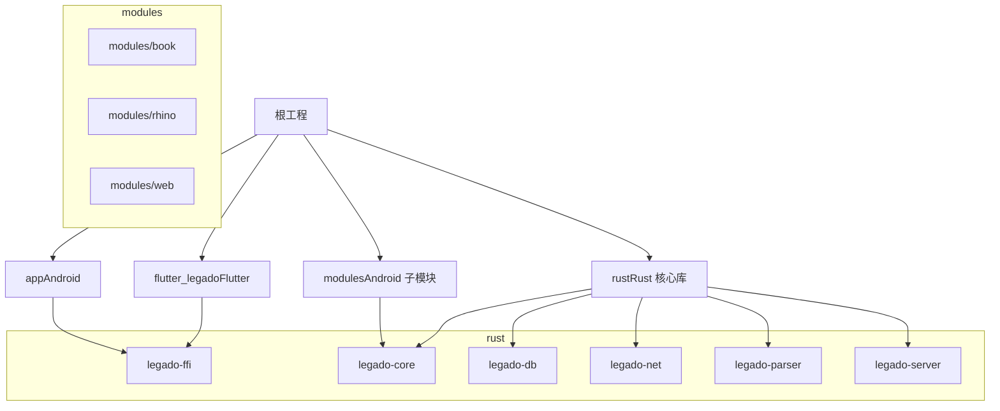
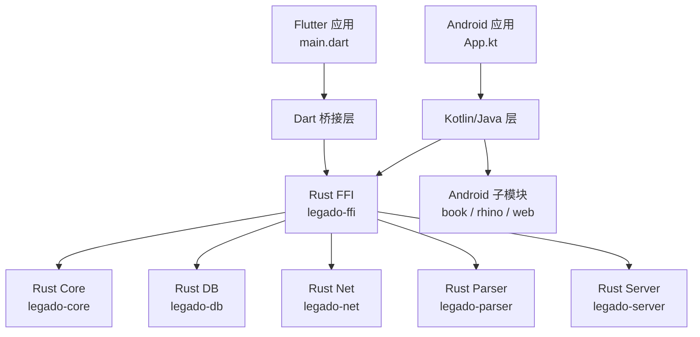
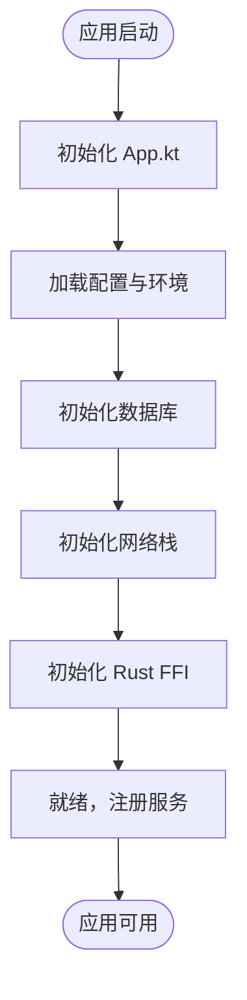
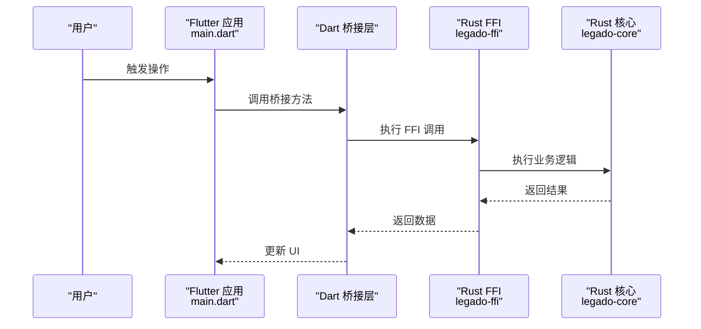
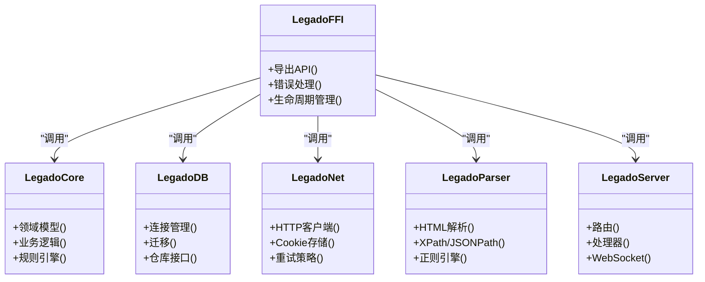
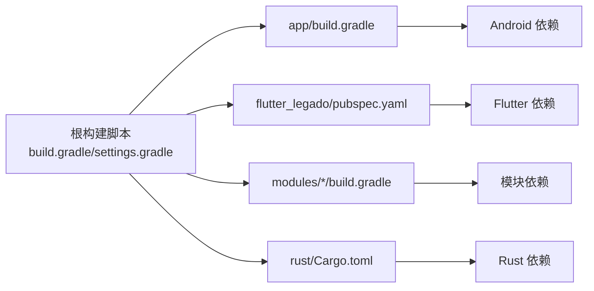

# 项目基础设施

<cite>
**本文引用的文件**   
- [README.md](file://README.md)
- [build.gradle](file://build.gradle)
- [settings.gradle](file://settings.gradle)
- [gradle.properties](file://gradle.properties)
- [Makefile](file://Makefile)
- [app/build.gradle](file://app/build.gradle)
- [app/src/main/java/io/legado/app/App.kt](file://app/src/main/java/io/legado/app/App.kt)
- [flutter_legado/pubspec.yaml](file://flutter_legado/pubspec.yaml)
- [flutter_legado/lib/main.dart](file://flutter_legado/lib/main.dart)
- [modules/book/build.gradle](file://modules/book/build.gradle)
- [modules/rhino/build.gradle](file://modules/rhino/build.gradle)
- [modules/web/package.json](file://modules/web/package.json)
- [rust/Cargo.toml](file://rust/Cargo.toml)
- [rust/legado-ffi/src/lib.rs](file://rust/legado-ffi/src/lib.rs)
- [rust/legado-core/src/lib.rs](file://rust/legado-core/src/lib.rs)
- [rust/legado-db/src/lib.rs](file://rust/legado-db/src/lib.rs)
- [rust/legado-net/src/lib.rs](file://rust/legado-net/src/lib.rs)
- [rust/legado-parser/src/lib.rs](file://rust/legado-parser/src/lib.rs)
- [rust/legado-server/src/lib.rs](file://rust/legado-server/src/lib.rs)
</cite>

## 目录
1. [简介](#简介)
2. [项目结构](#项目结构)
3. [核心组件](#核心组件)
4. [架构总览](#架构总览)
5. [详细组件分析](#详细组件分析)
6. [依赖关系分析](#依赖关系分析)
7. [性能考量](#性能考量)
8. [故障排查指南](#故障排查指南)
9. [结论](#结论)
10. [附录](#附录)

## 简介
本项目是一个跨平台阅读与内容聚合应用，采用多语言、多模块的工程组织方式：
- Android 原生应用（Kotlin/Java）提供主界面与系统能力集成
- Flutter 工程用于跨平台 UI 与桥接层
- Rust 核心库通过 FFI 暴露给上层，承担高性能计算、网络、解析、数据库等关键能力
- Web 管理端（Vue）用于源码编辑与管理
- Gradle + Makefile 统一构建流程，支持 Android、Flutter、Rust 与 Web 的协同编译

本基础设施文档聚焦于构建系统、模块划分、入口点与跨语言集成方式，帮助开发者快速理解并扩展项目。

## 项目结构
整体结构由根级构建脚本与多个子工程组成：
- app：Android 应用模块，包含资源、清单与 Kotlin/Java 代码
- flutter_legado：Flutter 跨平台工程，含 Android/iOS/Web/Desktop 目标
- modules：Android 子模块（book、rhino、web），分别负责书籍处理、脚本引擎与 Web 管理前端
- rust：Rust 核心库集合，通过 FFI 暴露 API
- gradle 与根级构建脚本：统一版本与构建配置

图表来源
- [build.gradle](file://build.gradle)
- [settings.gradle](file://settings.gradle)
- [app/build.gradle](file://app/build.gradle)
- [modules/book/build.gradle](file://modules/book/build.gradle)
- [modules/rhino/build.gradle](file://modules/rhino/build.gradle)
- [modules/web/package.json](file://modules/web/package.json)
- [rust/Cargo.toml](file://rust/Cargo.toml)

章节来源
- [build.gradle](file://build.gradle)
- [settings.gradle](file://settings.gradle)
- [gradle.properties](file://gradle.properties)

## 核心组件
- Android 应用入口与初始化
  - App.kt 作为 Application 子类，负责全局初始化、依赖注入与子系统启动
- Flutter 应用入口
  - main.dart 启动 Flutter 应用，并通过桥接调用 Rust FFI
- Rust FFI 与核心库
  - legado-ffi 暴露 FFI API；legado-core 定义领域模型与业务逻辑；legado-db 数据访问；legado-net 网络；legado-parser 解析；legado-server 服务端能力
- Android 子模块
  - book：书籍格式处理（EPUB/TXT/UMD 等）
  - rhino：JavaScript 脚本引擎
  - web：Web 管理端（Vue）打包产物集成

章节来源
- [app/src/main/java/io/legado/app/App.kt](file://app/src/main/java/io/legado/app/App.kt)
- [flutter_legado/lib/main.dart](file://flutter_legado/lib/main.dart)
- [rust/legado-ffi/src/lib.rs](file://rust/legado-ffi/src/lib.rs)
- [rust/legado-core/src/lib.rs](file://rust/legado-core/src/lib.rs)
- [rust/legado-db/src/lib.rs](file://rust/legado-db/src/lib.rs)
- [rust/legado-net/src/lib.rs](file://rust/legado-net/src/lib.rs)
- [rust/legado-parser/src/lib.rs](file://rust/legado-parser/src/lib.rs)
- [rust/legado-server/src/lib.rs](file://rust/legado-server/src/lib.rs)
- [modules/book/build.gradle](file://modules/book/build.gradle)
- [modules/rhino/build.gradle](file://modules/rhino/build.gradle)
- [modules/web/package.json](file://modules/web/package.json)

## 架构总览
下图展示了从 Android/Flutter 到 Rust 核心库的调用路径与职责边界：

图表来源
- [app/src/main/java/io/legado/app/App.kt](file://app/src/main/java/io/legado/app/App.kt)
- [flutter_legado/lib/main.dart](file://flutter_legado/lib/main.dart)
- [rust/legado-ffi/src/lib.rs](file://rust/legado-ffi/src/lib.rs)
- [rust/legado-core/src/lib.rs](file://rust/legado-core/src/lib.rs)
- [rust/legado-db/src/lib.rs](file://rust/legado-db/src/lib.rs)
- [rust/legado-net/src/lib.rs](file://rust/legado-net/src/lib.rs)
- [rust/legado-parser/src/lib.rs](file://rust/legado-parser/src/lib.rs)
- [rust/legado-server/src/lib.rs](file://rust/legado-server/src/lib.rs)

## 详细组件分析

### Android 应用与初始化
- App.kt 作为应用入口，完成全局配置、日志、网络、数据库与任务调度等初始化
- 通过依赖注入或单例模式暴露核心服务，供 UI 与后台任务使用
- 与 Rust FFI 的交互在 Kotlin 层进行封装，屏蔽底层细节

图表来源
- [app/src/main/java/io/legado/app/App.kt](file://app/src/main/java/io/legado/app/App.kt)
- [rust/legado-ffi/src/lib.rs](file://rust/legado-ffi/src/lib.rs)

章节来源
- [app/src/main/java/io/legado/app/App.kt](file://app/src/main/java/io/legado/app/App.kt)

### Flutter 应用与桥接
- main.dart 启动 Flutter 应用，初始化主题、路由与状态管理
- 通过 flutter_rust_bridge 生成绑定，调用 Rust FFI 提供的能力
- 将 UI 事件转换为 FFI 调用，并将结果回传到 Dart 层

图表来源
- [flutter_legado/lib/main.dart](file://flutter_legado/lib/main.dart)
- [rust/legado-ffi/src/lib.rs](file://rust/legado-ffi/src/lib.rs)
- [rust/legado-core/src/lib.rs](file://rust/legado-core/src/lib.rs)

章节来源
- [flutter_legado/lib/main.dart](file://flutter_legado/lib/main.dart)
- [flutter_legado/pubspec.yaml](file://flutter_legado/pubspec.yaml)

### Rust 核心库与 FFI
- legado-ffi：对外暴露 FFI API，负责类型转换、错误处理与生命周期管理
- legado-core：领域模型、规则解析、阅读状态、自动任务等核心逻辑
- legado-db：SQLite 迁移、仓库模式与数据持久化
- legado-net：HTTP 客户端、代理、重试、速率限制与 Cookie 管理
- legado-parser：HTML/XPath/JSONPath/正则表达式解析
- legado-server：内置 HTTP/WebSocket 服务，提供调试与管理接口

图表来源
- [rust/legado-ffi/src/lib.rs](file://rust/legado-ffi/src/lib.rs)
- [rust/legado-core/src/lib.rs](file://rust/legado-core/src/lib.rs)
- [rust/legado-db/src/lib.rs](file://rust/legado-db/src/lib.rs)
- [rust/legado-net/src/lib.rs](file://rust/legado-net/src/lib.rs)
- [rust/legado-parser/src/lib.rs](file://rust/legado-parser/src/lib.rs)
- [rust/legado-server/src/lib.rs](file://rust/legado-server/src/lib.rs)

章节来源
- [rust/legado-ffi/src/lib.rs](file://rust/legado-ffi/src/lib.rs)
- [rust/legado-core/src/lib.rs](file://rust/legado-core/src/lib.rs)
- [rust/legado-db/src/lib.rs](file://rust/legado-db/src/lib.rs)
- [rust/legado-net/src/lib.rs](file://rust/legado-net/src/lib.rs)
- [rust/legado-parser/src/lib.rs](file://rust/legado-parser/src/lib.rs)
- [rust/legado-server/src/lib.rs](file://rust/legado-server/src/lib.rs)

### Android 子模块
- modules/book：书籍格式处理与元数据提取
- modules/rhino：JavaScript 脚本引擎集成，支持动态规则与扩展
- modules/web：Web 管理端（Vue）打包产物，提供源码编辑与调试

章节来源
- [modules/book/build.gradle](file://modules/book/build.gradle)
- [modules/rhino/build.gradle](file://modules/rhino/build.gradle)
- [modules/web/package.json](file://modules/web/package.json)

## 依赖关系分析
- 构建系统
  - 根 build.gradle 与 settings.gradle 统一管理子模块与版本
  - gradle.properties 定义全局属性（如 Kotlin/AGP 版本）
  - Makefile 协调多工程构建（Android、Flutter、Rust、Web）
- 模块依赖
  - Android 应用依赖 Rust FFI 与 Android 子模块
  - Flutter 通过 flutter_rust_bridge 依赖 Rust FFI
  - Rust 各子库之间通过 Cargo 管理依赖

图表来源
- [build.gradle](file://build.gradle)
- [settings.gradle](file://settings.gradle)
- [gradle.properties](file://gradle.properties)
- [app/build.gradle](file://app/build.gradle)
- [flutter_legado/pubspec.yaml](file://flutter_legado/pubspec.yaml)
- [modules/book/build.gradle](file://modules/book/build.gradle)
- [modules/rhino/build.gradle](file://modules/rhino/build.gradle)
- [modules/web/package.json](file://modules/web/package.json)
- [rust/Cargo.toml](file://rust/Cargo.toml)

章节来源
- [build.gradle](file://build.gradle)
- [settings.gradle](file://settings.gradle)
- [gradle.properties](file://gradle.properties)
- [Makefile](file://Makefile)

## 性能考量
- Rust 核心库承担 CPU 密集任务（解析、加密、压缩、网络 I/O），显著降低主线程压力
- 异步与协程：Android/Kotlin 与 Rust 均使用异步模型，避免阻塞 UI
- 缓存策略：本地缓存与预读机制减少重复请求与解析开销
- 构建优化：Gradle 并行构建与增量编译，Rust 发布模式优化二进制体积与运行速度

## 故障排查指南
- 构建失败
  - 检查 Gradle 版本与 Android SDK 配置
  - 确认 Rust 工具链与目标平台设置
  - 清理缓存后重新构建
- FFI 调用异常
  - 核对类型映射与生命周期管理
  - 检查错误码与异常传播
- 运行时崩溃
  - 查看日志输出与堆栈信息
  - 隔离问题模块（Android/Flutter/Rust）

## 结论
本项目通过多语言、多模块的工程组织，实现了高性能与可扩展的阅读与内容聚合能力。Android 与 Flutter 作为前端，Rust 作为核心引擎，配合统一的构建系统与清晰的模块边界，为后续功能扩展与维护提供了坚实基础。

## 附录
- 开发环境准备与构建命令请参考根级 README 与 Makefile
- 新增模块时，需在对应构建脚本中声明依赖并遵循现有命名规范