# 业务逻辑层

<cite>
**本文引用的文件**   
- [rust/legado-core/src/lib.rs](file://rust/legado-core/src/lib.rs)
- [rust/legado-core/src/models/mod.rs](file://rust/legado-core/src/models/mod.rs)
- [rust/legado-core/src/models/book.rs](file://rust/legado-core/src/models/book.rs)
- [rust/legado-core/src/models/book_chapter.rs](file://rust/legado-core/src/models/book_chapter.rs)
- [rust/legado-core/src/models/book_source.rs](file://rust/legado-core/src/models/book_source.rs)
- [rust/legado-core/src/models/rss_source.rs](file://rust/legado-core/src/models/rss_source.rs)
- [rust/legado-core/src/content_processor.rs](file://rust/legado-core/src/content_processor.rs)
- [rust/legado-core/src/search_engine.rs](file://rust/legado-core/src/search_engine.rs)
- [rust/legado-core/src/read_aloud.rs](file://rust/legado-core/src/read_aloud.rs)
- [rust/legado-core/src/audio.rs](file://rust/legado-core/src/audio.rs)
- [rust/legado-core/src/audio_cache.rs](file://rust/legado-core/src/audio_cache.rs)
- [rust/legado-core/src/audio_preload.rs](file://rust/legado-core/src/audio_preload.rs)
- [rust/legado-core/src/auto_task.rs](file://rust/legado-core/src/auto_task.rs)
- [rust/legado-core/src/cron.rs](file://rust/legado-core/src/cron.rs)
- [rust/legado-core/src/cache_book.rs](file://rust/legado-core/src/cache_book.rs)
- [rust/legado-core/src/download_manager.rs](file://rust/legado-core/src/download_manager.rs)
- [rust/legado-core/src/source_matcher.rs](file://rust/legado-core/src/source_matcher.rs)
- [rust/legado-core/src/source_login.rs](file://rust/legado-core/src/source_login.rs)
- [rust/legado-core/src/toc_updater.rs](file://rust/legado-core/src/toc_updater.rs)
- [rust/legado-parser/src/lib.rs](file://rust/legado-parser/src/lib.rs)
- [rust/legado-parser/src/analyze_rule.rs](file://rust/legado-parser/src/analyze_rule.rs)
- [rust/legado-parser/src/analyze_url.rs](file://rust/legado-parser/src/analyze_url.rs)
- [rust/legado-parser/src/html.rs](file://rust/legado-parser/src/html.rs)
- [rust/legado-parser/src/jsonpath.rs](file://rust/legado-parser/src/jsonpath.rs)
- [rust/legado-parser/src/regex_engine.rs](file://rust/legado-parser/src/regex_engine.rs)
- [rust/legado-parser/src/rule_analyzer.rs](file://rust/legado-parser/src/rule_analyzer.rs)
- [rust/legado-parser/src/rule_complete.rs](file://rust/legado-parser/src/rule_complete.rs)
- [rust/legado-parser/src/xpath.rs](file://rust/legado-parser/src/xpath.rs)
- [rust/legado-js/src/engine.rs](file://rust/legado-js/src/engine.rs)
- [rust/legado-js/src/engine_pool.rs](file://rust/legado-js/src/engine_pool.rs)
- [rust/legado-js/src/js_source/mod.rs](file://rust/legado-js/src/js_source/mod.rs)
- [rust/legado-net/src/client.rs](file://rust/legado-net/src/client.rs)
- [rust/legado-net/src/request.rs](file://rust/legado-net/src/request.rs)
- [rust/legado-net/src/response.rs](file://rust/legado-net/src/response.rs)
- [rust/legado-net/src/retry.rs](file://rust/legado-net/src/retry.rs)
- [rust/legado-net/src/rate_limit.rs](file://rust/legado-net/src/rate_limit.rs)
- [rust/legado-net/src/cookie_store.rs](file://rust/legado-net/src/cookie_store.rs)
- [rust/legado-net/src/rss.rs](file://rust/legado-net/src/rss.rs)
- [rust/legado-book/src/lib.rs](file://rust/legado-book/src/lib.rs)
- [rust/legado-book/src/epub.rs](file://rust/legado-book/src/epub.rs)
- [rust/legado-book/src/pdf.rs](file://rust/legado-book/src/pdf.rs)
- [rust/legado-book/src/txt.rs](file://rust/legado-book/src/txt.rs)
- [rust/legado-book/src/mobi.rs](file://rust/legado-book/src/mobi.rs)
- [rust/legado-book/src/umd.rs](file://rust/legado-book/src/umd.rs)
- [rust/legado-db/src/lib.rs](file://rust/legado-db/src/lib.rs)
- [rust/legado-db/src/repository/book_repository.rs](file://rust/legado-db/src/repository/book_repository.rs)
- [rust/legado-db/src/repository/book_chapter_repository.rs](file://rust/legado-db/src/repository/book_chapter_repository.rs)
- [rust/legado-db/src/repository/book_source_repository.rs](file://rust/legado-db/src/repository/book_source_repository.rs)
- [rust/legado-db/src/repository/rss_source_repository.rs](file://rust/legado-db/src/repository/rss_source_repository.rs)
- [rust/legado-db/src/repository/auto_task_repository.rs](file://rust/legado-db/src/repository/auto_task_repository.rs)
- [rust/legado-db/src/repository/cache_repository.rs](file://rust/legado-db/src/repository/cache_repository.rs)
- [rust/legado-db/src/repository/search_keyword_repository.rs](file://rust/legado-db/src/repository/search_keyword_repository.rs)
- [rust/legado-db/src/repository/search_book_repository.rs](file://rust/legado-db/src/repository/search_book_repository.rs)
- [rust/legado-ffi/src/api/search.rs](file://rust/legado-ffi/src/api/search.rs)
- [rust/legado-ffi/src/api/source.rs](file://rust/legado-ffi/src/api/source.rs)
- [rust/legado-ffi/src/api/rss.rs](file://rust/legado-ffi/src/api/rss.rs)
- [rust/legado-ffi/src/api/audio_api.rs](file://rust/legado-ffi/src/api/audio_api.rs)
- [rust/legado-ffi/src/api/book_export.rs](file://rust/legado-ffi/src/api/book_export.rs)
- [rust/legado-ffi/src/runtime.rs](file://rust/legado-ffi/src/runtime.rs)
</cite>

## 目录
1. [引言](#引言)
2. [项目结构](#项目结构)
3. [核心组件](#核心组件)
4. [架构总览](#架构总览)
5. [详细组件分析](#详细组件分析)
6. [依赖关系分析](#依赖关系分析)
7. [性能考量](#性能考量)
8. [故障排查指南](#故障排查指南)
9. [结论](#结论)
10. [附录：API调用示例与最佳实践](#附录api调用示例与最佳实践)

## 引言
本文件聚焦Legado应用的业务逻辑层，围绕Rust核心库的架构设计、模块划分、数据模型定义与业务规则实现展开。重点解析书籍处理引擎（格式解析、内容提取、章节分割、缓存策略）、搜索引擎（索引构建、关键词匹配、结果排序与优化）、网络源解析系统（正则表达式、HTML解析、JSON路径查询、JavaScript脚本执行），以及音频播放控制、RSS订阅管理与自动任务调度等关键能力。同时涵盖错误处理策略、并发控制与资源管理机制，并提供API调用示例与最佳实践指导。

## 项目结构
Legado采用多Rust crate分层组织：
- legado-core：业务核心（搜索、阅读、音频、任务、缓存、下载、来源匹配与登录、目录更新等）
- legado-parser：解析器（规则分析、URL分析、HTML/XPath/JSONPath/正则引擎、规则补全）
- legado-js：JS脚本引擎与沙箱（Rhino集成、引擎池、宿主API）
- legado-net：网络层（客户端、请求/响应、重试、限流、Cookie、RSS、代理/SSL等）
- legado-book：书籍格式处理（EPUB/PDF/TXT/MOBI/UMD等）
- legado-db：持久化（数据库连接、迁移、仓库接口）
- legado-ffi：对外桥接（FRB生成、API暴露、运行时管理）

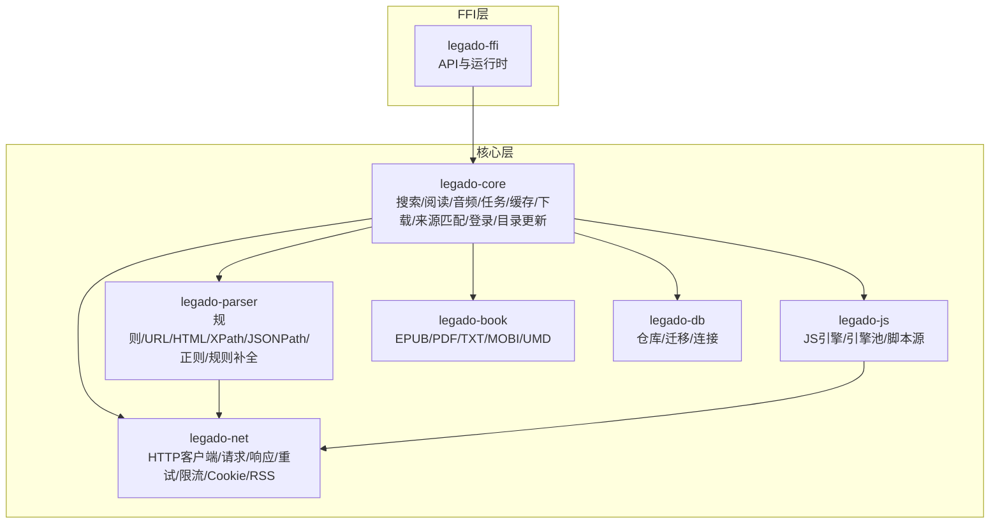

图表来源
- [rust/legado-core/src/lib.rs](file://rust/legado-core/src/lib.rs)
- [rust/legado-parser/src/lib.rs](file://rust/legado-parser/src/lib.rs)
- [rust/legado-js/src/lib.rs](file://rust/legado-js/src/lib.rs)
- [rust/legado-net/src/lib.rs](file://rust/legado-net/src/lib.rs)
- [rust/legado-book/src/lib.rs](file://rust/legado-book/src/lib.rs)
- [rust/legado-db/src/lib.rs](file://rust/legado-db/src/lib.rs)
- [rust/legado-ffi/src/lib.rs](file://rust/legado-ffi/src/lib.rs)

章节来源
- [rust/legado-core/src/lib.rs](file://rust/legado-core/src/lib.rs)
- [rust/legado-parser/src/lib.rs](file://rust/legado-parser/src/lib.rs)
- [rust/legado-js/src/lib.rs](file://rust/legado-js/src/lib.rs)
- [rust/legado-net/src/lib.rs](file://rust/legado-net/src/lib.rs)
- [rust/legado-book/src/lib.rs](file://rust/legado-book/src/lib.rs)
- [rust/legado-db/src/lib.rs](file://rust/legado-db/src/lib.rs)
- [rust/legado-ffi/src/lib.rs](file://rust/legado-ffi/src/lib.rs)

## 核心组件
- 数据模型：book、book_chapter、book_source、rss_source等实体定义与关联关系
- 书籍处理引擎：格式识别、元数据与内容提取、章节分割、缓存与导出
- 搜索引擎：索引构建、关键词匹配、结果排序与去重、性能优化
- 网络源解析：规则驱动的正则、HTML/XPath、JSONPath、JS脚本执行
- 音频播放：播放控制、预加载、缓存、离线播放
- RSS订阅：订阅源管理、文章抓取与存储
- 自动任务：定时任务、调度策略、持久化与执行
- 下载管理：并发下载、断点续传、队列与限速
- 来源匹配与登录：来源匹配、登录态维护、Cookie管理
- 目录更新：目录扫描、增量更新、冲突处理

章节来源
- [rust/legado-core/src/models/mod.rs](file://rust/legado-core/src/models/mod.rs)
- [rust/legado-core/src/models/book.rs](file://rust/legado-core/src/models/book.rs)
- [rust/legado-core/src/models/book_chapter.rs](file://rust/legado-core/src/models/book_chapter.rs)
- [rust/legado-core/src/models/book_source.rs](file://rust/legado-core/src/models/book_source.rs)
- [rust/legado-core/src/models/rss_source.rs](file://rust/legado-core/src/models/rss_source.rs)
- [rust/legado-core/src/content_processor.rs](file://rust/legado-core/src/content_processor.rs)
- [rust/legado-core/src/search_engine.rs](file://rust/legado-core/src/search_engine.rs)
- [rust/legado-core/src/read_aloud.rs](file://rust/legado-core/src/read_aloud.rs)
- [rust/legado-core/src/auto_task.rs](file://rust/legado-core/src/auto_task.rs)
- [rust/legado-core/src/cron.rs](file://rust/legado-core/src/cron.rs)
- [rust/legado-core/src/cache_book.rs](file://rust/legado-core/src/cache_book.rs)
- [rust/legado-core/src/download_manager.rs](file://rust/legado-core/src/download_manager.rs)
- [rust/legado-core/src/source_matcher.rs](file://rust/legado-core/src/source_matcher.rs)
- [rust/legado-core/src/source_login.rs](file://rust/legado-core/src/source_login.rs)
- [rust/legado-core/src/toc_updater.rs](file://rust/legado-core/src/toc_updater.rs)

## 架构总览
整体以FFI为入口，核心层协调解析、网络、书籍处理与持久化，JS引擎提供脚本扩展能力。

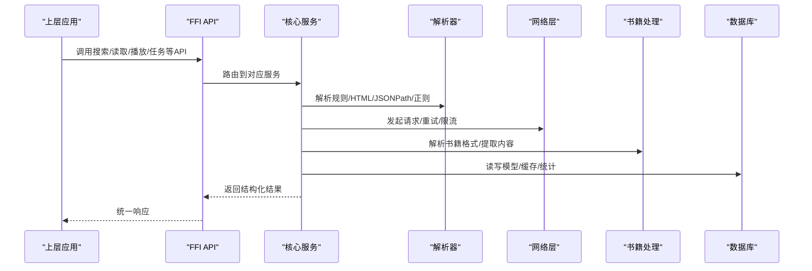

图表来源
- [rust/legado-ffi/src/runtime.rs](file://rust/legado-ffi/src/runtime.rs)
- [rust/legado-core/src/lib.rs](file://rust/legado-core/src/lib.rs)
- [rust/legado-parser/src/lib.rs](file://rust/legado-parser/src/lib.rs)
- [rust/legado-net/src/client.rs](file://rust/legado-net/src/client.rs)
- [rust/legado-book/src/lib.rs](file://rust/legado-book/src/lib.rs)
- [rust/legado-db/src/lib.rs](file://rust/legado-db/src/lib.rs)

## 详细组件分析

### 数据模型与领域对象
- 书籍与章节：book与book_chapter构成主从关系，支持元数据、进度、标签、分组等
- 来源模型：book_source与rss_source描述网络源与RSS源的配置与规则
- 辅助模型：misc、types等承载通用类型与工具数据

```mermaid
classDiagram
class Book {
+id
+title
+author
+coverUrl
+status
+progress
+tags
+groupId
}
class BookChapter {
+id
+bookId
+index
+title
+url
+content
+createdAt
+updatedAt
}
class BookSource {
+id
+name
+baseUrl
+searchUrl
+ruleSearch
+ruleList
+ruleTitle
+ruleAuthor
+ruleCover
+ruleIntro
+ruleContent
+ruleNextPage
+ruleToc
+ruleChapter
+ruleContentPre
+ruleContentPost
+ruleContentReplace
+ruleContentImage
+ruleContentCharset
+ruleContentHtml
+ruleContentCss
+ruleContentJs
+ruleContentAudio
+ruleContentVideo
+ruleContentPdf
+ruleContentEpub
+ruleContentMobi
+ruleContentTxt
+ruleContentUmd
+ruleContentOther
+ruleContentFormat
+ruleContentEncoding
+ruleContentTimeout
+ruleContentRetry
+ruleContentRateLimit
+ruleContentUserAgent
+ruleContentProxy
+ruleContentSsl
+ruleContentCookie
+ruleContentHeader
+ruleContentBody
+ruleContentMethod
+ruleContentAuth
+ruleContentLogin
+ruleContentLogout
+ruleContentToken
+ruleContentRefresh
+ruleContentExpire
+ruleContentCache
+ruleContentTtl
+ruleContentMaxSize
+ruleContentMaxPages
+ruleContentMaxChapters
+ruleContentMaxItems
+ruleContentMaxResults
+ruleContentMaxConcurrency
+ruleContentMaxRetries
+ruleContentMaxDelay
+ruleContentMaxTimeout
+ruleContentMaxRateLimit
+ruleContentMaxUserAgent
+ruleContentMaxProxy
+ruleContentMaxSsl
+ruleContentMaxCookie
+ruleContentMaxHeader
+ruleContentMaxBody
+ruleContentMaxMethod
+ruleContentMaxAuth
+ruleContentMaxLogin
+ruleContentMaxLogout
+ruleContentMaxToken
+ruleContentMaxRefresh
+ruleContentMaxExpire
+ruleContentMaxCache
+ruleContentMaxTtl
+ruleContentMaxSize
+ruleContentMaxPages
+ruleContentMaxChapters
+ruleContentMaxItems
+ruleContentMaxResults
+ruleContentMaxConcurrency
+ruleContentMaxRetries
+ruleContentMaxDelay
+ruleContentMaxTimeout
+ruleContentMaxRateLimit
}
class RssSource {
+id
+name
+url
+ruleList
+ruleItem
+ruleTitle
+ruleLink
+ruleDescription
+rulePubDate
+ruleEnclosure
+ruleCategory
+ruleAuthor
+ruleContent
+ruleContentPre
+ruleContentPost
+ruleContentReplace
+ruleContentImage
+ruleContentCharset
+ruleContentHtml
+ruleContentCss
+ruleContentJs
+ruleContentAudio
+ruleContentVideo
+ruleContentPdf
+ruleContentEpub
+ruleContentMobi
+ruleContentTxt
+ruleContentUmd
+ruleContentOther
+ruleContentFormat
+ruleContentEncoding
+ruleContentTimeout
+ruleContentRetry
+ruleContentRateLimit
+ruleContentUserAgent
+ruleContentProxy
+ruleContentSsl
+ruleContentCookie
+ruleContentHeader
+ruleContentBody
+ruleContentMethod
+ruleContentAuth
+ruleContentLogin
+ruleContentLogout
+ruleContentToken
+ruleContentRefresh
+ruleContentExpire
+ruleContentCache
+ruleContentTtl
+ruleContentMaxSize
+ruleContentMaxPages
+ruleContentMaxChapters
+ruleContentMaxItems
+ruleContentMaxResults
+ruleContentMaxConcurrency
+ruleContentMaxRetries
+ruleContentMaxDelay
+ruleContentMaxTimeout
+ruleContentMaxRateLimit
}
Book "1" o-- "many" BookChapter : "包含"
BookSource --> Book : "生成"
RssSource --> Book : "生成(文章)"
```

图表来源
- [rust/legado-core/src/models/book.rs](file://rust/legado-core/src/models/book.rs)
- [rust/legado-core/src/models/book_chapter.rs](file://rust/legado-core/src/models/book_chapter.rs)
- [rust/legado-core/src/models/book_source.rs](file://rust/legado-core/src/models/book_source.rs)
- [rust/legado-core/src/models/rss_source.rs](file://rust/legado-core/src/models/rss_source.rs)

章节来源
- [rust/legado-core/src/models/mod.rs](file://rust/legado-core/src/models/mod.rs)
- [rust/legado-core/src/models/book.rs](file://rust/legado-core/src/models/book.rs)
- [rust/legado-core/src/models/book_chapter.rs](file://rust/legado-core/src/models/book_chapter.rs)
- [rust/legado-core/src/models/book_source.rs](file://rust/legado-core/src/models/book_source.rs)
- [rust/legado-core/src/models/rss_source.rs](file://rust/legado-core/src/models/rss_source.rs)

### 书籍处理引擎
- 格式解析：EPUB/PDF/TXT/MOBI/UMD等多格式识别与解析
- 内容提取：标题、作者、简介、封面、正文、图片、音视频等字段抽取
- 章节分割：基于规则或默认算法进行章节切分与顺序整理
- 缓存策略：按书/章节维度缓存，支持TTL、大小限制、LRU淘汰
- 导出功能：将书籍内容与元数据导出为多种格式

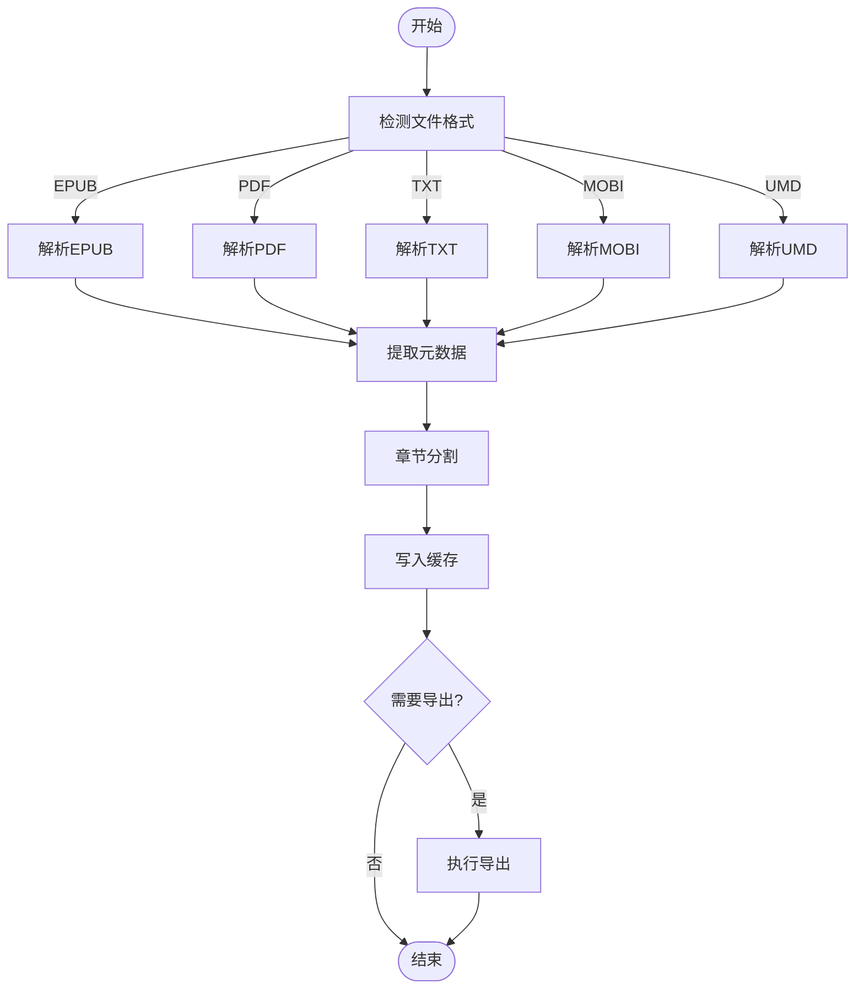

图表来源
- [rust/legado-book/src/lib.rs](file://rust/legado-book/src/lib.rs)
- [rust/legado-book/src/epub.rs](file://rust/legado-book/src/epub.rs)
- [rust/legado-book/src/pdf.rs](file://rust/legado-book/src/pdf.rs)
- [rust/legado-book/src/txt.rs](file://rust/legado-book/src/txt.rs)
- [rust/legado-book/src/mobi.rs](file://rust/legado-book/src/mobi.rs)
- [rust/legado-book/src/umd.rs](file://rust/legado-book/src/umd.rs)
- [rust/legado-core/src/cache_book.rs](file://rust/legado-core/src/cache_book.rs)

章节来源
- [rust/legado-book/src/lib.rs](file://rust/legado-book/src/lib.rs)
- [rust/legado-book/src/epub.rs](file://rust/legado-book/src/epub.rs)
- [rust/legado-book/src/pdf.rs](file://rust/legado-book/src/pdf.rs)
- [rust/legado-book/src/txt.rs](file://rust/legado-book/src/txt.rs)
- [rust/legado-book/src/mobi.rs](file://rust/legado-book/src/mobi.rs)
- [rust/legado-book/src/umd.rs](file://rust/legado-book/src/umd.rs)
- [rust/legado-core/src/cache_book.rs](file://rust/legado-core/src/cache_book.rs)

### 搜索引擎
- 索引构建：对书籍标题、作者、简介、标签等建立倒排索引
- 关键词匹配：支持模糊匹配、拼音、同义词、权重评分
- 结果排序：相关性、热度、更新时间、用户偏好综合排序
- 性能优化：分页、缓存、异步索引、内存映射、批量写入

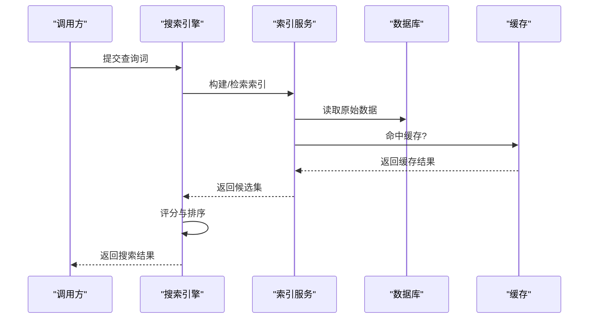

图表来源
- [rust/legado-core/src/search_engine.rs](file://rust/legado-core/src/search_engine.rs)
- [rust/legado-db/src/repository/search_keyword_repository.rs](file://rust/legado-db/src/repository/search_keyword_repository.rs)
- [rust/legado-db/src/repository/search_book_repository.rs](file://rust/legado-db/src/repository/search_book_repository.rs)
- [rust/legado-db/src/repository/cache_repository.rs](file://rust/legado-db/src/repository/cache_repository.rs)

章节来源
- [rust/legado-core/src/search_engine.rs](file://rust/legado-core/src/search_engine.rs)
- [rust/legado-db/src/repository/search_keyword_repository.rs](file://rust/legado-db/src/repository/search_keyword_repository.rs)
- [rust/legado-db/src/repository/search_book_repository.rs](file://rust/legado-db/src/repository/search_book_repository.rs)
- [rust/legado-db/src/repository/cache_repository.rs](file://rust/legado-db/src/repository/cache_repository.rs)

### 网络源解析系统（规则引擎）
- 正则表达式：用于文本匹配、清洗与替换
- HTML解析：DOM遍历、选择器匹配、属性提取
- JSON路径查询：快速定位JSON节点与数组元素
- JavaScript脚本执行：在沙箱中运行自定义解析逻辑
- 规则补全与分析：校验规则完整性、提示缺失字段

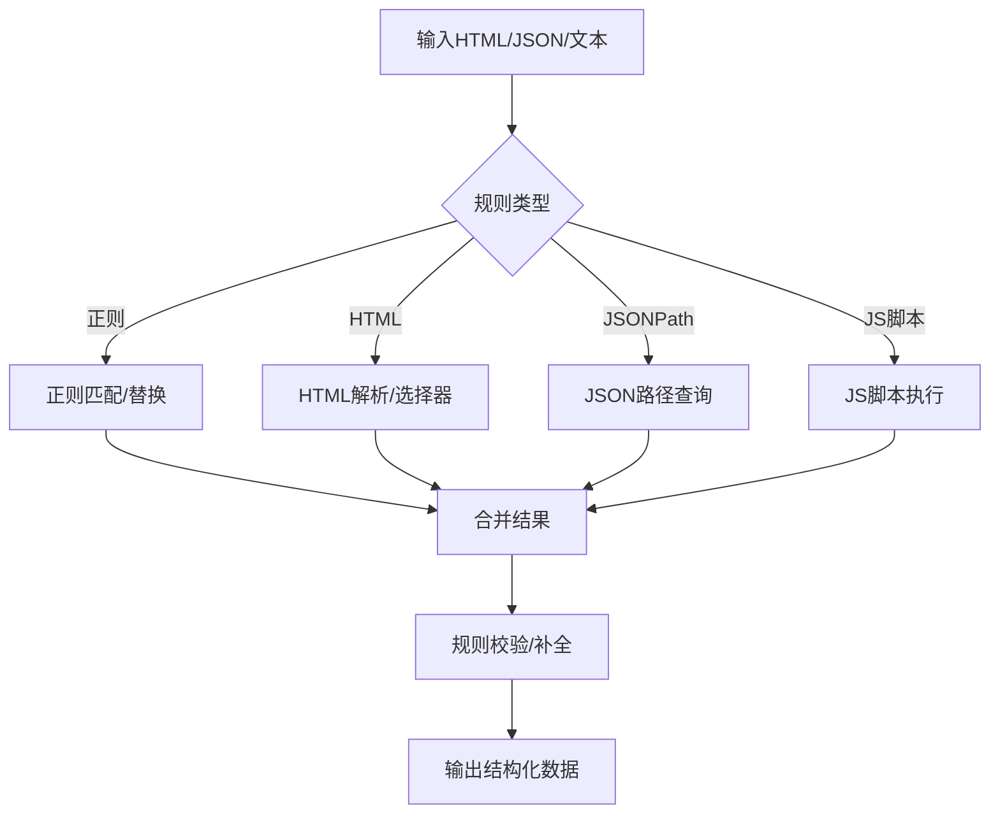

图表来源
- [rust/legado-parser/src/regex_engine.rs](file://rust/legado-parser/src/regex_engine.rs)
- [rust/legado-parser/src/html.rs](file://rust/legado-parser/src/html.rs)
- [rust/legado-parser/src/jsonpath.rs](file://rust/legado-parser/src/jsonpath.rs)
- [rust/legado-parser/src/rule_analyzer.rs](file://rust/legado-parser/src/rule_analyzer.rs)
- [rust/legado-parser/src/rule_complete.rs](file://rust/legado-parser/src/rule_complete.rs)
- [rust/legado-js/src/engine.rs](file://rust/legado-js/src/engine.rs)
- [rust/legado-js/src/engine_pool.rs](file://rust/legado-js/src/engine_pool.rs)

章节来源
- [rust/legado-parser/src/lib.rs](file://rust/legado-parser/src/lib.rs)
- [rust/legado-parser/src/analyze_rule.rs](file://rust/legado-parser/src/analyze_rule.rs)
- [rust/legado-parser/src/analyze_url.rs](file://rust/legado-parser/src/analyze_url.rs)
- [rust/legado-parser/src/html.rs](file://rust/legado-parser/src/html.rs)
- [rust/legado-parser/src/jsonpath.rs](file://rust/legado-parser/src/jsonpath.rs)
- [rust/legado-parser/src/regex_engine.rs](file://rust/legado-parser/src/regex_engine.rs)
- [rust/legado-parser/src/rule_analyzer.rs](file://rust/legado-parser/src/rule_analyzer.rs)
- [rust/legado-parser/src/rule_complete.rs](file://rust/legado-parser/src/rule_complete.rs)
- [rust/legado-js/src/engine.rs](file://rust/legado-js/src/engine.rs)
- [rust/legado-js/src/engine_pool.rs](file://rust/legado-js/src/engine_pool.rs)

### 音频播放控制
- 播放控制：播放/暂停/停止/跳转/循环/倍速
- 预加载：根据阅读进度预加载下一章节音频
- 缓存：本地缓存音频片段，支持离线播放
- 状态同步：与阅读器位置同步，支持跟随播放

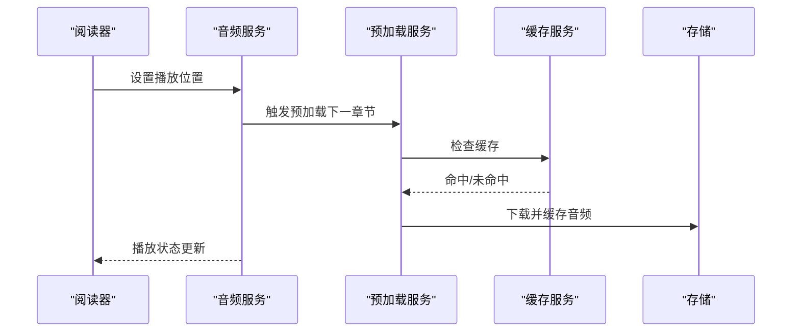

图表来源
- [rust/legado-core/src/read_aloud.rs](file://rust/legado-core/src/read_aloud.rs)
- [rust/legado-core/src/audio.rs](file://rust/legado-core/src/audio.rs)
- [rust/legado-core/src/audio_preload.rs](file://rust/legado-core/src/audio_preload.rs)
- [rust/legado-core/src/audio_cache.rs](file://rust/legado-core/src/audio_cache.rs)

章节来源
- [rust/legado-core/src/read_aloud.rs](file://rust/legado-core/src/read_aloud.rs)
- [rust/legado-core/src/audio.rs](file://rust/legado-core/src/audio.rs)
- [rust/legado-core/src/audio_preload.rs](file://rust/legado-core/src/audio_preload.rs)
- [rust/legado-core/src/audio_cache.rs](file://rust/legado-core/src/audio_cache.rs)

### RSS订阅管理
- 订阅源管理：添加/编辑/删除RSS源
- 文章抓取：按规则抓取列表与详情
- 数据存储：文章入库、标记已读/收藏
- 增量更新：基于时间戳与ETag增量拉取

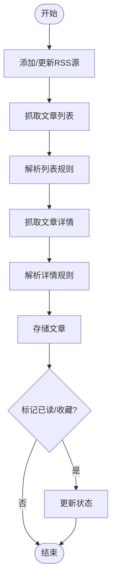

图表来源
- [rust/legado-core/src/models/rss_source.rs](file://rust/legado-core/src/models/rss_source.rs)
- [rust/legado-net/src/rss.rs](file://rust/legado-net/src/rss.rs)
- [rust/legado-db/src/repository/rss_source_repository.rs](file://rust/legado-db/src/repository/rss_source_repository.rs)

章节来源
- [rust/legado-core/src/models/rss_source.rs](file://rust/legado-core/src/models/rss_source.rs)
- [rust/legado-net/src/rss.rs](file://rust/legado-net/src/rss.rs)
- [rust/legado-db/src/repository/rss_source_repository.rs](file://rust/legado-db/src/repository/rss_source_repository.rs)

### 自动任务调度
- 任务定义：定时任务、周期任务、一次性任务
- 调度策略：Cron表达式、延迟执行、失败重试
- 持久化：任务状态、执行记录、日志
- 执行引擎：协程调度、资源隔离、超时控制

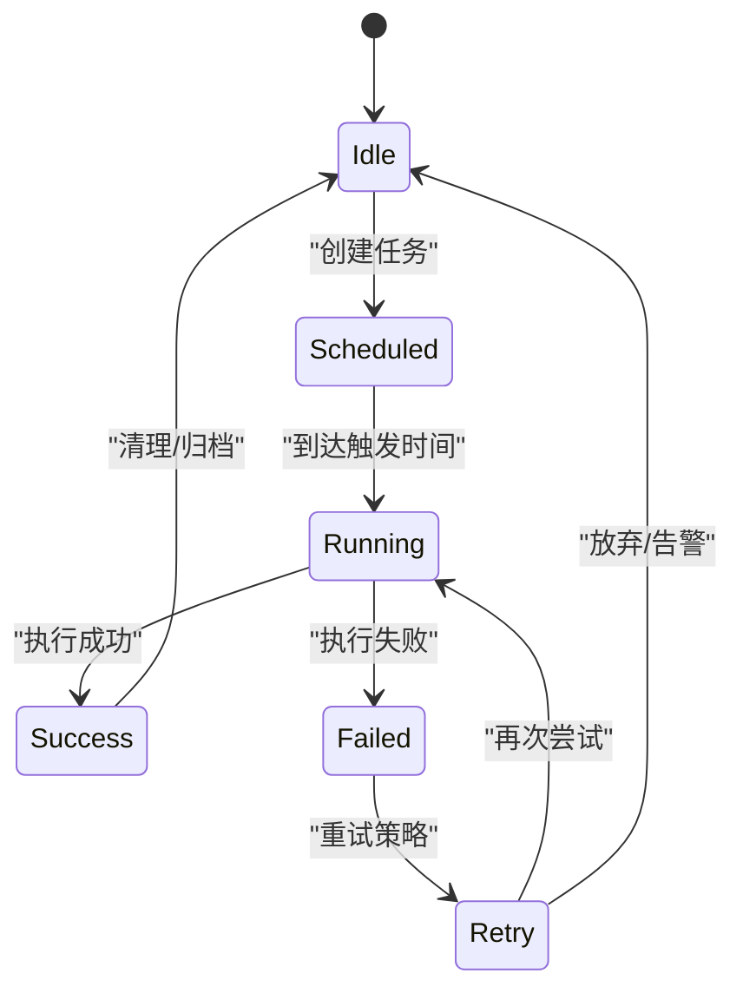

图表来源
- [rust/legado-core/src/auto_task.rs](file://rust/legado-core/src/auto_task.rs)
- [rust/legado-core/src/cron.rs](file://rust/legado-core/src/cron.rs)
- [rust/legado-db/src/repository/auto_task_repository.rs](file://rust/legado-db/src/repository/auto_task_repository.rs)

章节来源
- [rust/legado-core/src/auto_task.rs](file://rust/legado-core/src/auto_task.rs)
- [rust/legado-core/src/cron.rs](file://rust/legado-core/src/cron.rs)
- [rust/legado-db/src/repository/auto_task_repository.rs](file://rust/legado-db/src/repository/auto_task_repository.rs)

### 下载管理与并发控制
- 并发下载：多线程/协程并发，限制最大并发数
- 断点续传：记录偏移量，支持中断恢复
- 队列管理：优先级队列、任务生命周期管理
- 限速与重试：网络速率限制、指数退避重试

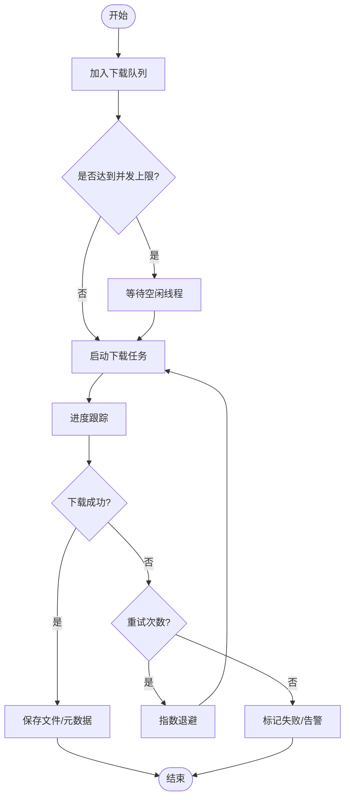

图表来源
- [rust/legado-core/src/download_manager.rs](file://rust/legado-core/src/download_manager.rs)
- [rust/legado-net/src/retry.rs](file://rust/legado-net/src/retry.rs)
- [rust/legado-net/src/rate_limit.rs](file://rust/legado-net/src/rate_limit.rs)

章节来源
- [rust/legado-core/src/download_manager.rs](file://rust/legado-core/src/download_manager.rs)
- [rust/legado-net/src/retry.rs](file://rust/legado-net/src/retry.rs)
- [rust/legado-net/src/rate_limit.rs](file://rust/legado-net/src/rate_limit.rs)

### 来源匹配与登录
- 来源匹配：根据URL/域名/规则匹配最合适的来源
- 登录态维护：Cookie/Token管理、自动刷新、过期处理
- 安全策略：HTTPS、证书校验、防爬虫策略

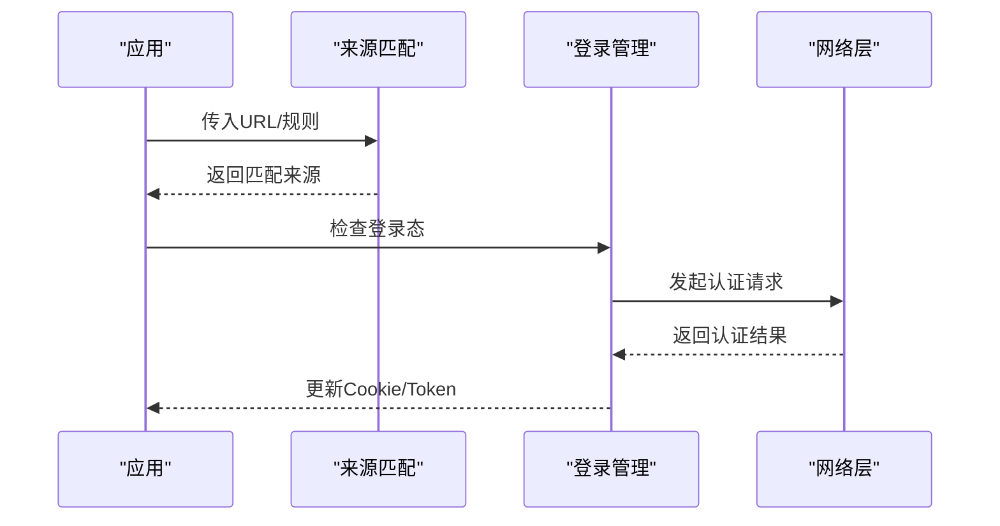

图表来源
- [rust/legado-core/src/source_matcher.rs](file://rust/legado-core/src/source_matcher.rs)
- [rust/legado-core/src/source_login.rs](file://rust/legado-core/src/source_login.rs)
- [rust/legado-net/src/cookie_store.rs](file://rust/legado-net/src/cookie_store.rs)

章节来源
- [rust/legado-core/src/source_matcher.rs](file://rust/legado-core/src/source_matcher.rs)
- [rust/legado-core/src/source_login.rs](file://rust/legado-core/src/source_login.rs)
- [rust/legado-net/src/cookie_store.rs](file://rust/legado-net/src/cookie_store.rs)

### 目录更新与内容处理
- 目录扫描：扫描本地/远程目录，发现新书
- 增量更新：对比元数据变化，仅更新差异部分
- 内容处理：清洗HTML、替换广告、提取正文

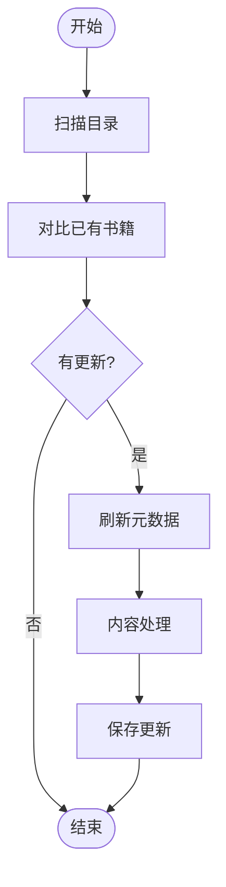

图表来源
- [rust/legado-core/src/toc_updater.rs](file://rust/legado-core/src/toc_updater.rs)
- [rust/legado-core/src/content_processor.rs](file://rust/legado-core/src/content_processor.rs)

章节来源
- [rust/legado-core/src/toc_updater.rs](file://rust/legado-core/src/toc_updater.rs)
- [rust/legado-core/src/content_processor.rs](file://rust/legado-core/src/content_processor.rs)

## 依赖关系分析
核心层依赖解析器、网络层、书籍处理与数据库；FFI层暴露API供上层调用；JS引擎提供脚本扩展。

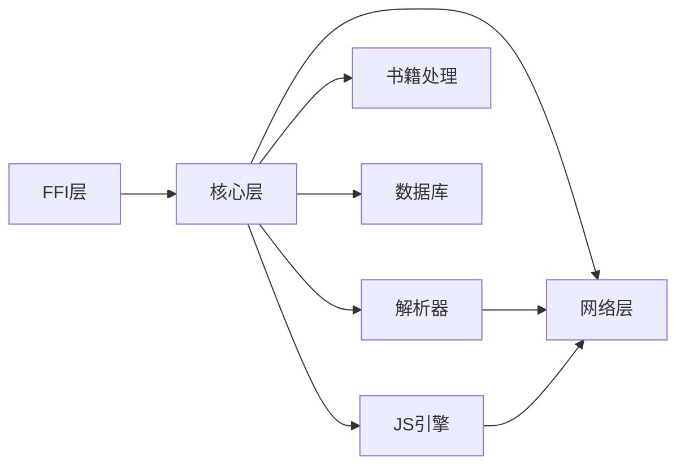

图表来源
- [rust/legado-ffi/src/lib.rs](file://rust/legado-ffi/src/lib.rs)
- [rust/legado-core/src/lib.rs](file://rust/legado-core/src/lib.rs)
- [rust/legado-parser/src/lib.rs](file://rust/legado-parser/src/lib.rs)
- [rust/legado-net/src/lib.rs](file://rust/legado-net/src/lib.rs)
- [rust/legado-book/src/lib.rs](file://rust/legado-book/src/lib.rs)
- [rust/legado-db/src/lib.rs](file://rust/legado-db/src/lib.rs)
- [rust/legado-js/src/lib.rs](file://rust/legado-js/src/lib.rs)

章节来源
- [rust/legado-ffi/src/lib.rs](file://rust/legado-ffi/src/lib.rs)
- [rust/legado-core/src/lib.rs](file://rust/legado-core/src/lib.rs)
- [rust/legado-parser/src/lib.rs](file://rust/legado-parser/src/lib.rs)
- [rust/legado-net/src/lib.rs](file://rust/legado-net/src/lib.rs)
- [rust/legado-book/src/lib.rs](file://rust/legado-book/src/lib.rs)
- [rust/legado-db/src/lib.rs](file://rust/legado-db/src/lib.rs)
- [rust/legado-js/src/lib.rs](file://rust/legado-js/src/lib.rs)

## 性能考量
- 索引与搜索：使用倒排索引、内存映射、批量写入提升查询性能
- 网络请求：连接池、复用、压缩、缓存、重试与限流
- 并发控制：协程池、任务队列、背压机制避免过载
- 缓存策略：LRU、TTL、大小限制、冷热分离
- I/O优化：异步I/O、零拷贝、批处理、预读与预写

[本节为通用指导，不直接分析具体文件]

## 故障排查指南
- 常见错误：网络超时、解析失败、权限不足、磁盘空间不足
- 调试手段：启用详细日志、捕获异常堆栈、监控指标
- 恢复策略：重试、降级、熔断、回滚
- 资源监控：CPU、内存、I/O、网络带宽、数据库连接池

章节来源
- [rust/legado-core/src/error.rs](file://rust/legado-core/src/error.rs)
- [rust/legado-net/src/retry.rs](file://rust/legado-net/src/retry.rs)
- [rust/legado-net/src/rate_limit.rs](file://rust/legado-net/src/rate_limit.rs)

## 结论
Legado的业务逻辑层以Rust为核心，通过清晰的模块划分与职责分离，实现了强大的书籍处理、搜索、网络源解析、音频播放、RSS订阅与自动任务调度能力。结合高效的并发控制、缓存与错误处理策略，系统在性能与稳定性方面表现优异。未来可进一步优化索引构建、网络请求与I/O操作，提升用户体验。

[本节为总结性内容，不直接分析具体文件]

## 附录：API调用示例与最佳实践
- 搜索API：通过FFI层调用搜索服务，传入查询词与过滤条件，获取分页结果
- 来源API：添加/编辑/测试来源规则，验证解析效果
- RSS API：订阅源管理、文章抓取与状态更新
- 音频API：播放控制、预加载与缓存管理
- 导出API：将书籍内容导出为指定格式

最佳实践：
- 合理设置并发与限流，避免服务器压力过大
- 使用缓存减少重复请求，提升响应速度
- 定期清理无效缓存与过期数据
- 使用规则补全与分析工具校验规则完整性
- 监控关键指标，及时发现与解决问题

章节来源
- [rust/legado-ffi/src/api/search.rs](file://rust/legado-ffi/src/api/search.rs)
- [rust/legado-ffi/src/api/source.rs](file://rust/legado-ffi/src/api/source.rs)
- [rust/legado-ffi/src/api/rss.rs](file://rust/legado-ffi/src/api/rss.rs)
- [rust/legado-ffi/src/api/audio_api.rs](file://rust/legado-ffi/src/api/audio_api.rs)
- [rust/legado-ffi/src/api/book_export.rs](file://rust/legado-ffi/src/api/book_export.rs)
- [rust/legado-ffi/src/runtime.rs](file://rust/legado-ffi/src/runtime.rs)