# EPUB格式处理

<cite>
**本文档引用的文件**   
- [epub.rs](file://rust/legado-book/src/epub.rs)
- [lib.rs](file://rust/legado-book/src/lib.rs)
- [export.rs](file://rust/legado-book/src/export.rs)
- [book.rs](file://rust/legado-core/src/models/book.rs)
- [book_chapter.rs](file://rust/legado-core/src/models/book_chapter.rs)
- [content_processor.rs](file://rust/legado-core/src/content_processor.rs)
- [html.rs](file://rust/legado-parser/src/html.rs)
- [android_manifest.xml](file://app/src/main/AndroidManifest.xml)
- [build.gradle](file://modules/book/build.gradle)
</cite>

## 目录
1. [简介](#简介)
2. [项目结构](#项目结构)
3. [核心组件](#核心组件)
4. [架构总览](#架构总览)
5. [详细组件分析](#详细组件分析)
6. [依赖关系分析](#依赖关系分析)
7. [性能考虑](#性能考虑)
8. [故障排查指南](#故障排查指南)
9. [结论](#结论)
10. [附录](#附录)

## 简介
本文件面向EPUB格式处理的实现与使用，聚焦Legado项目中对EPUB的解析、内容提取、章节分割、样式与媒体资源处理，以及交互内容的支持策略。文档从系统架构出发，逐步深入到XML解析、文本清洗、图片与字体处理、元数据抽取、目录识别与分页策略等关键环节，并提供最佳实践与性能优化建议，帮助读者在理解原理的同时高效集成与扩展。

## 项目结构
本项目采用多模块设计：Rust层负责高性能的EPUB解析与导出，Kotlin/Android层提供应用集成与UI展示，Parser与Core模块提供通用能力（HTML处理、模型定义、内容处理器）。EPUB相关代码主要位于Rust的legado-book模块，并通过FFI暴露给上层调用。

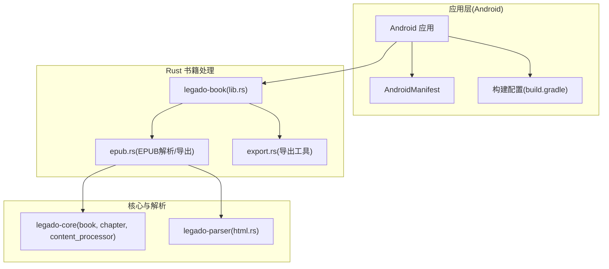

图表来源
- [lib.rs](file://rust/legado-book/src/lib.rs)
- [epub.rs](file://rust/legado-book/src/epub.rs)
- [export.rs](file://rust/legado-book/src/export.rs)
- [book.rs](file://rust/legado-core/src/models/book.rs)
- [book_chapter.rs](file://rust/legado-core/src/models/book_chapter.rs)
- [content_processor.rs](file://rust/legado-core/src/content_processor.rs)
- [html.rs](file://rust/legado-parser/src/html.rs)
- [android_manifest.xml](file://app/src/main/AndroidManifest.xml)
- [build.gradle](file://modules/book/build.gradle)

章节来源
- [lib.rs](file://rust/legado-book/src/lib.rs)
- [build.gradle](file://modules/book/build.gradle)

## 核心组件
- EPUB解析器：负责打开EPUB容器、定位OPF清单、读取NCX或导航文档、遍历XHTML内容、提取元数据与目录。
- 内容处理器：对HTML/XHTML进行清洗、规范化、样式注入与资源路径修正。
- 模型层：统一表示书籍与章节信息，便于跨层传递与持久化。
- HTML解析器：提供DOM操作与选择器能力，辅助提取标题、段落、图片与链接。
- 导出工具：将解析结果转换为可存储或渲染的中间格式。

章节来源
- [epub.rs](file://rust/legado-book/src/epub.rs)
- [content_processor.rs](file://rust/legado-core/src/content_processor.rs)
- [book.rs](file://rust/legado-core/src/models/book.rs)
- [book_chapter.rs](file://rust/legado-core/src/models/book_chapter.rs)
- [html.rs](file://rust/legado-parser/src/html.rs)
- [export.rs](file://rust/legado-book/src/export.rs)

## 架构总览
下图展示了从应用层到Rust层的EPUB处理流程，包括容器解压、OPC清单解析、导航与内容遍历、资源处理与导出。

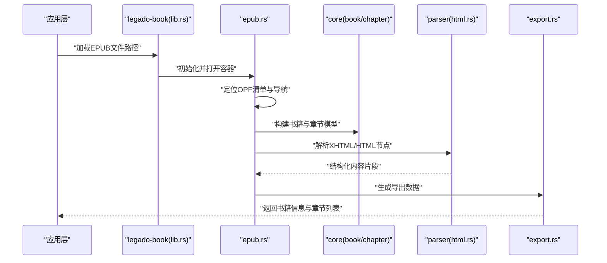

图表来源
- [lib.rs](file://rust/legado-book/src/lib.rs)
- [epub.rs](file://rust/legado-book/src/epub.rs)
- [book.rs](file://rust/legado-core/src/models/book.rs)
- [book_chapter.rs](file://rust/legado-core/src/models/book_chapter.rs)
- [html.rs](file://rust/legado-parser/src/html.rs)
- [export.rs](file://rust/legado-book/src/export.rs)

## 详细组件分析

### EPUB容器与OPF清单解析
- 容器识别：通过ZIP结构定位META-INF/container.xml，获取OPF包文件的相对路径。
- OPF清单：解析package.opf中的manifest项，建立资源ID到路径的映射；识别spine顺序以决定阅读顺序。
- 元数据提取：从metadata节点抽取标题、作者、描述、ISBN、封面等字段。
- 导航定位：优先查找nav.xhtml（EPUB3），回退至toc.ncx（EPUB2）以构建目录树。

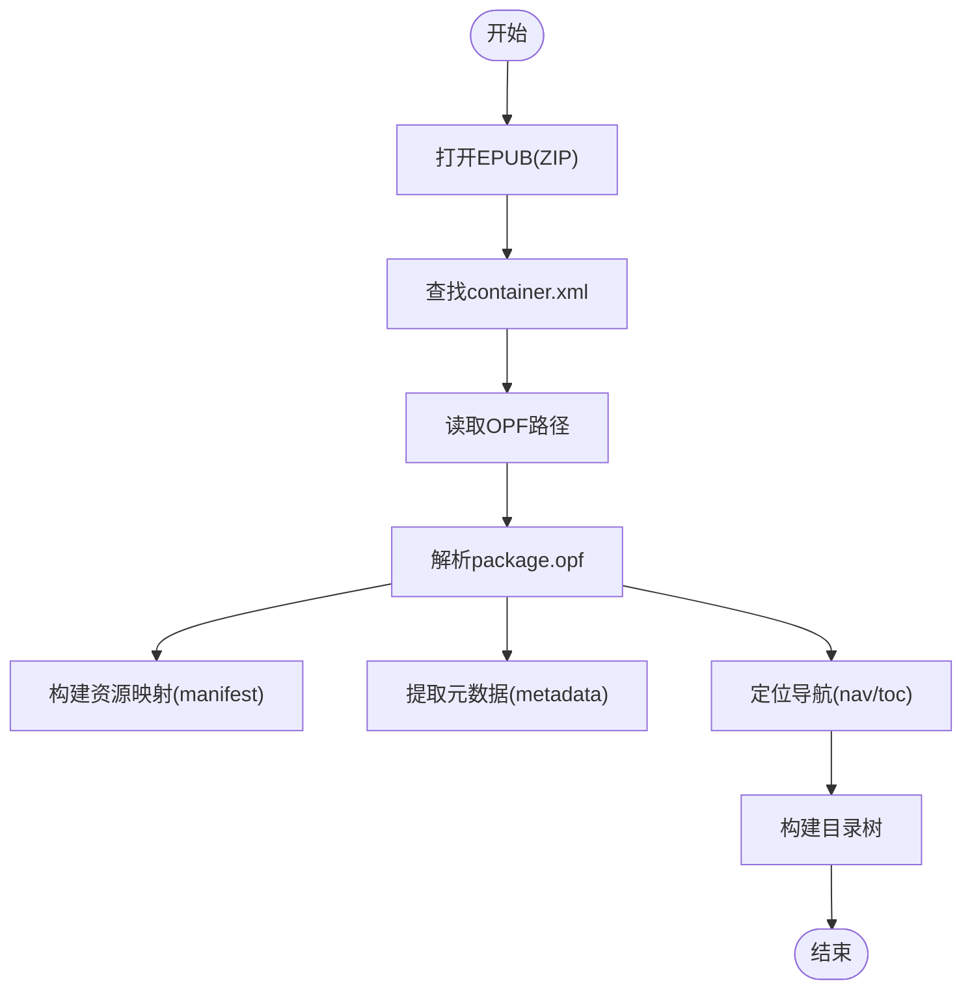

图表来源
- [epub.rs](file://rust/legado-book/src/epub.rs)

章节来源
- [epub.rs](file://rust/legado-book/src/epub.rs)

### NCX与导航文档处理
- EPUB3导航：解析nav.xhtml中的<nav>结构，按序构建章节层级。
- EPUB2导航：解析toc.ncx的point元素，映射到对应XHTML文件与位置。
- 边界检测：根据导航条目与XHTML中的标题标签（如h1/h2/h3）协同确定章节边界。

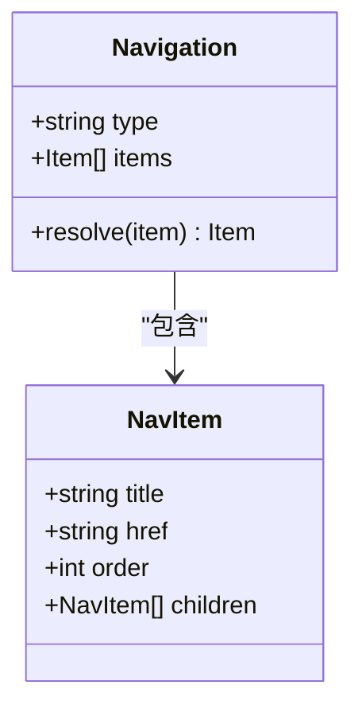

图表来源
- [epub.rs](file://rust/legado-book/src/epub.rs)

章节来源
- [epub.rs](file://rust/legado-book/src/epub.rs)

### XHTML内容与CSS样式处理
- 内容解析：遍历XHTML文档，提取段落、列表、表格、图片与链接，保留必要的语义标签。
- 样式注入：合并EPUB内嵌CSS与应用主题样式，确保可读性与一致性。
- 资源路径修正：将相对路径转换为内部资源访问路径，避免加载失败。

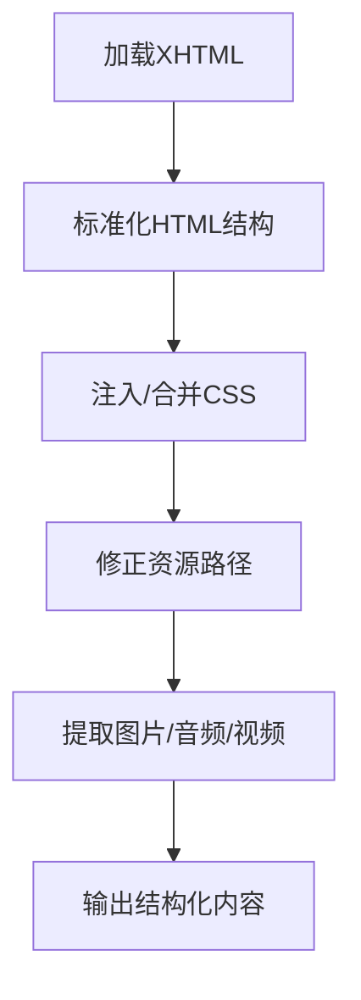

图表来源
- [epub.rs](file://rust/legado-book/src/epub.rs)
- [content_processor.rs](file://rust/legado-core/src/content_processor.rs)
- [html.rs](file://rust/legado-parser/src/html.rs)

章节来源
- [content_processor.rs](file://rust/legado-core/src/content_processor.rs)
- [html.rs](file://rust/legado-parser/src/html.rs)

### 文本清洗与内容规范化
- 清理策略：去除冗余空白、不可见字符与脚本块；统一换行与标点。
- 安全过滤：移除潜在恶意脚本与事件属性，保障渲染安全。
- 编码处理：统一UTF-8编码，处理BOM与特殊字符。

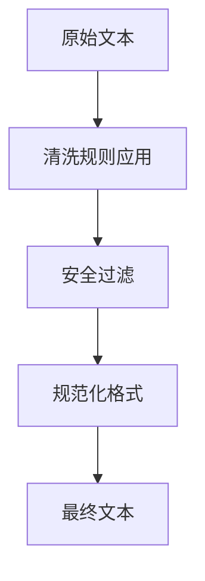

图表来源
- [content_processor.rs](file://rust/legado-core/src/content_processor.rs)

章节来源
- [content_processor.rs](file://rust/legado-core/src/content_processor.rs)

### 图片资源处理
- 资源发现：扫描img标签src属性，收集所有图片资源。
- 格式校验：检查MIME类型与扩展名匹配，拒绝非法资源。
- 缓存与复用：对重复资源去重，减少内存占用与IO开销。

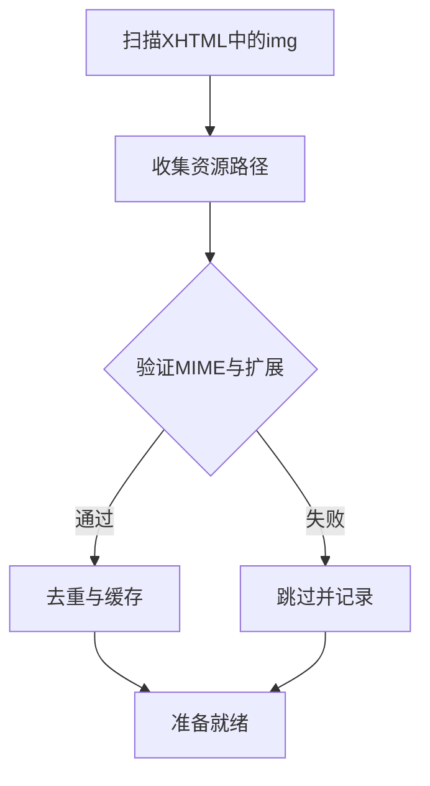

图表来源
- [epub.rs](file://rust/legado-book/src/epub.rs)

章节来源
- [epub.rs](file://rust/legado-book/src/epub.rs)

### 元数据提取
- 标准字段：标题、作者、出版者、出版日期、语言、ISBN、封面URL。
- 自定义字段：扩展元数据键值对，兼容不同来源的EPUB。
- 封面处理：优先使用opf:cover引用，否则回退到manifest中封面资源。

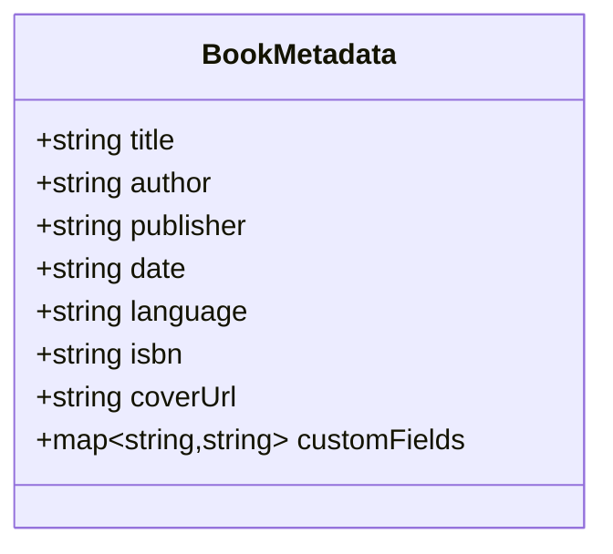

图表来源
- [epub.rs](file://rust/legado-book/src/epub.rs)
- [book.rs](file://rust/legado-core/src/models/book.rs)

章节来源
- [epub.rs](file://rust/legado-book/src/epub.rs)
- [book.rs](file://rust/legado-core/src/models/book.rs)

### 章节分割逻辑
- 目录驱动：优先依据导航条目划分章节。
- 标题检测：在缺少导航时，基于XHTML中的标题标签序列推断章节边界。
- 分页策略：按屏幕高度或固定行数切分内容，保证阅读体验一致。

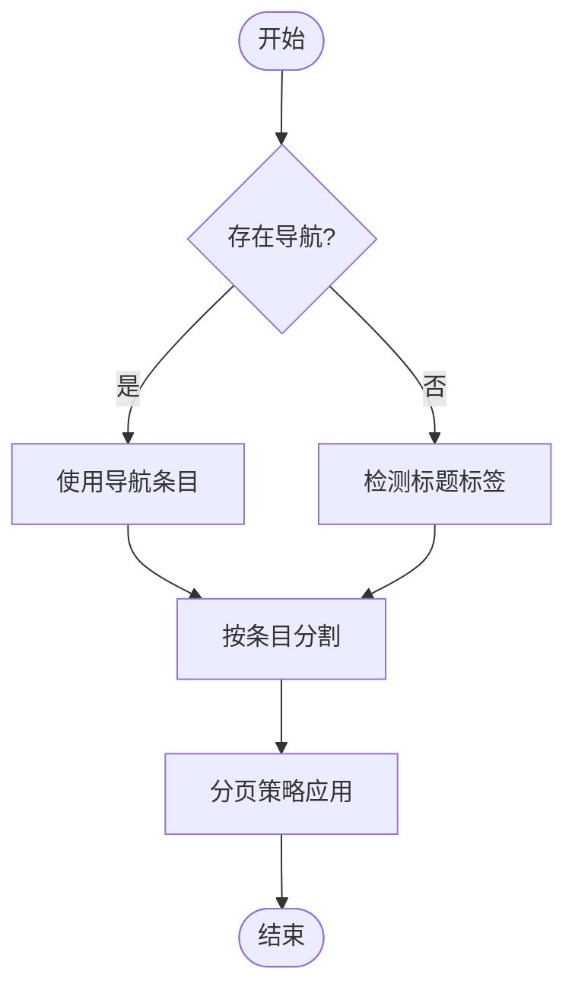

图表来源
- [epub.rs](file://rust/legado-book/src/epub.rs)

章节来源
- [epub.rs](file://rust/legado-book/src/epub.rs)

### EPUB特有功能支持
- 内嵌字体：解析@font-face声明，加载WOFF/TTF字体文件，确保跨设备一致性。
- SVG图形：保留SVG结构与样式，必要时转译为位图以提升兼容性。
- 交互式内容：对JavaScript与WebGL进行沙箱隔离或禁用，保障安全与性能。

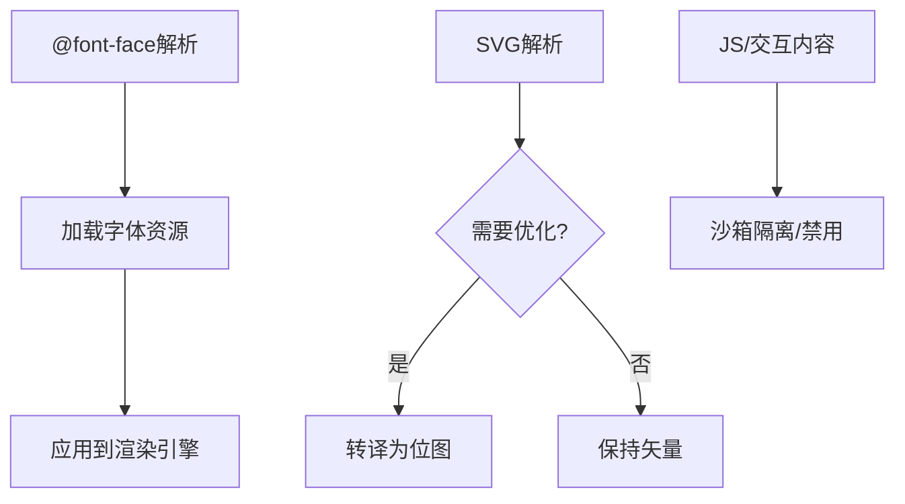

图表来源
- [epub.rs](file://rust/legado-book/src/epub.rs)

章节来源
- [epub.rs](file://rust/legado-book/src/epub.rs)

### 导出与中间格式
- 导出目标：生成JSON或二进制中间格式，供前端渲染或数据库存储。
- 结构规范：统一书籍、章节、资源与样式的组织方式，便于后续处理。
- 增量更新：支持仅更新变更章节，提升导入效率。

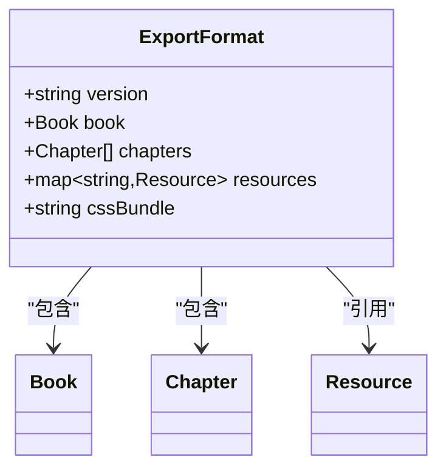

图表来源
- [export.rs](file://rust/legado-book/src/export.rs)
- [book.rs](file://rust/legado-core/src/models/book.rs)
- [book_chapter.rs](file://rust/legado-core/src/models/book_chapter.rs)

章节来源
- [export.rs](file://rust/legado-book/src/export.rs)

## 依赖关系分析
- Rust层依赖：legado-book依赖legado-core与legado-parser，提供书籍模型与HTML解析能力。
- Android层集成：通过FFI接口调用Rust库，完成EPUB导入与展示。
- 构建配置：模块级build.gradle管理依赖与编译选项，确保跨平台兼容。

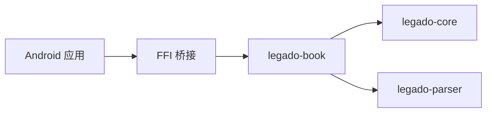

图表来源
- [lib.rs](file://rust/legado-book/src/lib.rs)
- [build.gradle](file://modules/book/build.gradle)

章节来源
- [lib.rs](file://rust/legado-book/src/lib.rs)
- [build.gradle](file://modules/book/build.gradle)

## 性能考虑
- 流式解析：对大型EPUB采用流式读取，避免一次性加载整个容器。
- 资源去重：对图片与字体进行哈希去重，降低内存峰值。
- 异步处理：将耗时任务（如图片缩放、字体转换）放入后台线程。
- 缓存策略：对已解析的章节与样式进行本地缓存，提升二次打开速度。
- 内存管理：及时释放临时DOM对象与字节缓冲，防止内存泄漏。

[本节为通用指导，不直接分析具体文件]

## 故障排查指南
- 容器损坏：检查ZIP完整性与权限，确认container.xml存在且可解析。
- 导航缺失：当无nav/toc时，启用标题检测模式，调整阈值以避免误判。
- 资源加载失败：核对manifest映射与路径修正逻辑，确保相对路径正确转换。
- 样式错乱：检查CSS优先级与覆盖规则，必要时重置默认样式。
- 字体显示异常：验证字体文件格式与嵌入声明，必要时回退到系统字体。

章节来源
- [epub.rs](file://rust/legado-book/src/epub.rs)
- [content_processor.rs](file://rust/legado-core/src/content_processor.rs)

## 结论
本方案通过Rust层的高性能解析与Android层的灵活集成，实现了完整的EPUB处理能力。从容器解析、导航构建、内容清洗到资源与样式处理，各环节均具备可扩展性与健壮性。遵循本文的最佳实践与优化建议，可在保证用户体验的同时提升处理效率与稳定性。

[本节为总结性内容，不直接分析具体文件]

## 附录
- 术语表：OPF、NCX、XHTML、CSS、SVG、WOFF、TTF等。
- 参考规范：EPUB 2.x/3.x规范、Open Packaging Convention、Navigation Document规范。
- 常见问题FAQ：导航丢失、图片不显示、字体错位等问题的快速定位方法。

[本节为补充信息，不直接分析具体文件]