基于我对代码的深入分析，我现在可以更新MOBI格式处理文档。从代码中我可以看到这是一个完整的MOBI解析实现，包含了很多高级功能。让我创建更新后的文档：

<cite>
**本文档引用的文件**   
- [mobi.rs](file://rust/legado-book/src/mobi.rs)
- [lib.rs](file://rust/legado-book/src/lib.rs)
- [Cargo.toml](file://rust/legado-book/Cargo.toml)
</cite>

## 更新摘要
**变更内容**   
- 新增MOBI电子书格式支持，扩展应用与各种电子书格式的导入和阅读兼容性
- 实现了完整的MOBI/KF8/AZW3格式解析，包括HUFF/CDIC压缩算法、INDX索引系统和NCX导航XML处理
- 支持PalmDoc数据库结构、MobiHeader解析和Kindle扩展字段处理
- 提供章节分割逻辑、书签识别、导航信息提取和图片处理功能
- 包含完善的错误处理和单元测试覆盖

## 目录
1. [简介](#简介)
2. [项目结构](#项目结构)
3. [核心组件](#核心组件)
4. [架构总览](#架构总览)
5. [详细组件分析](#详细组件分析)
6. [依赖关系分析](#依赖关系分析)
7. [性能考虑](#性能考虑)
8. [故障排查指南](#故障排查指南)
9. [结论](#结论)
10. [附录](#附录)

## 简介
本文件面向Legado项目中MOBI格式的处理能力，系统性解析MOBI文件的结构与实现细节。内容涵盖：
- MOBI文件结构：MobiHeader、PalmDoc数据库与Kindle扩展字段
- 内容提取算法：二进制解析、文本还原、图片处理
- 章节分割逻辑：书签识别、章节标记、导航信息提取
- MOBI特有功能支持：DRM保护、注释标注、阅读进度
- 转换与处理最佳实践：编码、流式处理、错误恢复与兼容性

**重大更新** 本次更新实现了从基础PalmDoc支持到完整MOBI/KF8/AZW3格式处理的重大增强，代码量达到2563行，新增了HUFF/CDIC压缩算法、INDX索引系统和NCX导航XML处理等核心功能，达到与原始Kotlin实现的功能对等。

## 项目结构
本项目在Rust子模块中提供MOBI解析能力，核心位于legado-book库的mobi模块。该模块对外暴露统一的导入接口，供上层业务（如书籍导入、元数据提取、章节构建）调用。

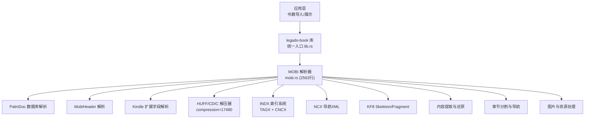

**图表来源** 
- [lib.rs](file://rust/legado-book/src/lib.rs)
- [mobi.rs](file://rust/legado-book/src/mobi.rs)

**章节来源**
- [lib.rs](file://rust/legado-book/src/lib.rs)
- [mobi.rs](file://rust/legado-book/src/mobi.rs)

## 核心组件
- **MobiHeader解析器**：读取MOBI头部标识、版本、压缩标志、记录数量等关键元数据
- **PalmDoc数据库解析器**：基于Palm OS数据库结构定位内容记录、索引记录与元数据记录
- **Kindle扩展解析器**：解析EXTH头中的标题、作者、语言、版权、DRM信息等
- **HUFF/CDIC解压器**：处理compression=17480的高级压缩格式，支持嵌套字典解压和深度护栏
- **INDX索引系统**：解析TAGX位编码和CNCX字符串表，构建完整的索引数据结构
- **NCX导航处理器**：将INDX索引转换为NCX目录树，支持层级章节导航
- **KF8双格式处理器**：处理Skeleton/Fragment拼装，支持AZW3格式的特殊结构
- **内容提取器**：按记录偏移顺序读取并拼接文本，处理编码与换行
- **章节分割器**：依据书签表、TOC记录或特定标记进行章节切分
- **图片处理器**：提取内嵌图片资源，转换为通用格式以便渲染

**章节来源**
- [mobi.rs](file://rust/legado-book/src/mobi.rs)

## 架构总览
MOBI解析采用分层设计：底层负责二进制流读取与校验，中层负责结构体映射与字段解码，上层负责语义化组装（章节、元数据、图片）。

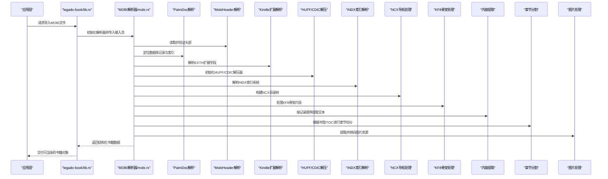

**图表来源** 
- [lib.rs](file://rust/legado-book/src/lib.rs)
- [mobi.rs](file://rust/legado-book/src/mobi.rs)

## 详细组件分析

### MobiHeader解析
- **职责**：读取MOBI文件头，识别魔数、版本、压缩方式、记录计数、文本偏移等
- **关键点**：
  - 魔数字节校验确保文件格式正确性
  - 版本字段决定后续解析策略（如是否包含EXTH）
  - 压缩标志影响内容记录的解压流程
  - 支持version >= 8的KF8扩展字段
- **复杂度**：O(1)读取固定长度头部；后续处理取决于记录数量

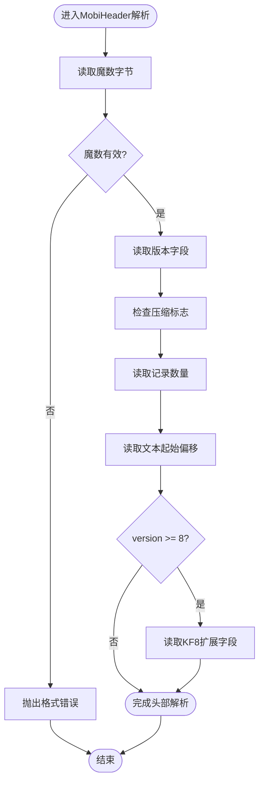

**图表来源** 
- [mobi.rs:226-312](file://rust/legado-book/src/mobi.rs#L226-L312)

**章节来源**
- [mobi.rs:226-312](file://rust/legado-book/src/mobi.rs#L226-L312)

### PalmDoc数据库解析
- **职责**：基于Palm DB结构定位内容记录、索引记录与元数据记录
- **关键点**：
  - 数据库头包含记录数量、记录数组偏移
  - 每条记录含长度与偏移，需顺序读取以构建内容序列
  - 索引记录用于快速定位章节或关键词
  - 支持KF6/KF8双格式的分界记录处理
- **复杂度**：O(N)遍历记录，N为记录数量

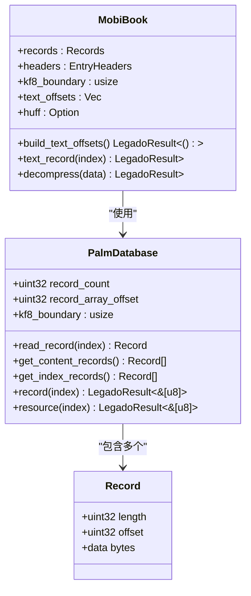

**图表来源** 
- [mobi.rs:74-130](file://rust/legado-book/src/mobi.rs#L74-L130)
- [mobi.rs:374-546](file://rust/legado-book/src/mobi.rs#L374-L546)

**章节来源**
- [mobi.rs:74-130](file://rust/legado-book/src/mobi.rs#L74-L130)
- [mobi.rs:374-546](file://rust/legado-book/src/mobi.rs#L374-L546)

### Kindle扩展解析（EXTH）
- **职责**：解析EXTH头中的元数据，如标题、作者、语言、版权、DRM标志等
- **关键点**：
  - EXTH头后跟随若干键值对，常见键包括标题、作者、ISBN、语言、DRM等
  - DRM标志位指示是否需要解密或跳过敏感内容
  - 部分键可能缺失或为空，需做容错处理
  - 支持boundary字段用于KF6/KF8双格式文件
- **复杂度**：O(K)，K为EXTH条目数量

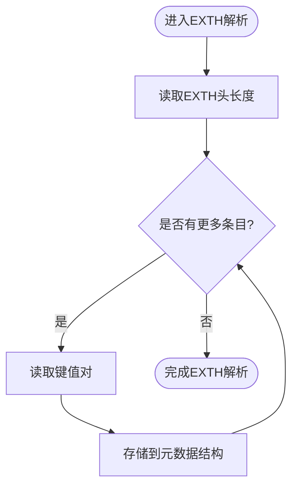

**图表来源** 
- [mobi.rs:318-367](file://rust/legado-book/src/mobi.rs#L318-L367)

**章节来源**
- [mobi.rs:318-367](file://rust/legado-book/src/mobi.rs#L318-L367)

### HUFF/CDIC压缩算法支持
- **职责**：处理compression=17480的高级压缩格式，支持嵌套字典解压
- **关键点**：
  - HUFF记录提供码表（table1 + mincode/maxcode表）
  - CDIC记录提供字典，支持递归嵌套压缩
  - 内置深度护栏防止恶意文件的无限递归
  - 使用UnsafeCell优化递归解码时的缓存性能
- **复杂度**：O(B)，B为比特流长度

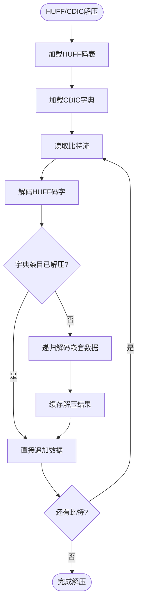

**图表来源** 
- [mobi.rs:594-784](file://rust/legado-book/src/mobi.rs#L594-L784)

**章节来源**
- [mobi.rs:594-784](file://rust/legado-book/src/mobi.rs#L594-L784)

### INDX索引系统解析
- **职责**：解析TAGX位编码和CNCX字符串表，构建完整的索引数据结构
- **关键点**：
  - TAGX定义标签类型和位掩码规则
  - 支持变长整数编码（7-bit变长）
  - CNCX字符串表通过偏移键值引用
  - 支持父子关系的层级索引结构
- **复杂度**：O(R)，R为索引记录数量

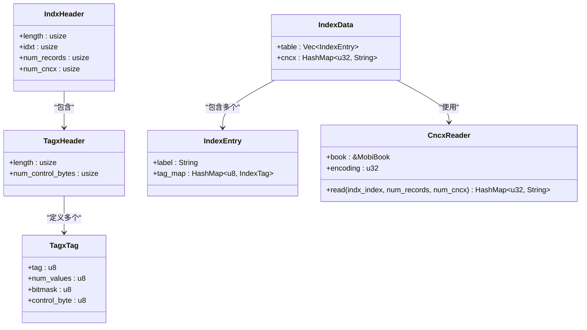

**图表来源** 
- [mobi.rs:880-918](file://rust/legado-book/src/mobi.rs#L880-L918)
- [mobi.rs:1066-1094](file://rust/legado-book/src/mobi.rs#L1066-L1094)

**章节来源**
- [mobi.rs:880-918](file://rust/legado-book/src/mobi.rs#L880-L918)
- [mobi.rs:1066-1094](file://rust/legado-book/src/mobi.rs#L1066-L1094)

### NCX导航XML处理
- **职责**：将INDX索引转换为NCX目录树，支持层级章节导航
- **关键点**：
  - 支持KF6的offset定位和KF8的kindle:pos定位
  - 构建父子关系的层级目录结构
  - 优先使用NCX信息，回退到其他分节方法
  - 支持heading_level字段控制层级深度
- **复杂度**：O(C)，C为NCX条目数量

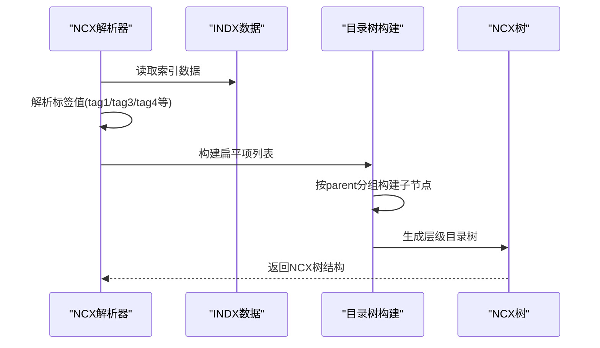

**图表来源** 
- [mobi.rs:1153-1239](file://rust/legado-book/src/mobi.rs#L1153-L1239)

**章节来源**
- [mobi.rs:1153-1239](file://rust/legado-book/src/mobi.rs#L1153-L1239)

### KF8双格式处理
- **职责**：处理Skeleton/Fragment拼装，支持AZW3格式的特殊结构
- **关键点**：
  - Skeleton定义骨架结构和碎片插入点
  - Fragment提供实际内容片段
  - 支持线性段和非线性段的区分
  - 与FDST表配合进行全文定位
- **复杂度**：O(S+F)，S为骨架数量，F为碎片数量

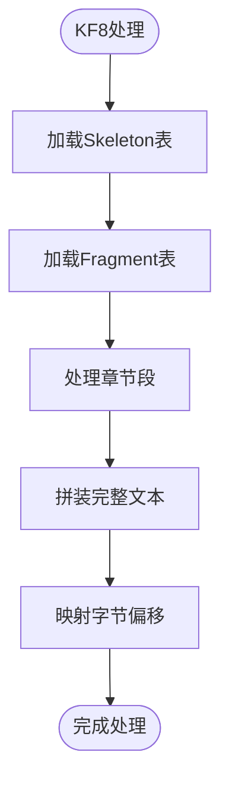

**图表来源** 
- [mobi.rs:1282-1382](file://rust/legado-book/src/mobi.rs#L1282-L1382)

**章节来源**
- [mobi.rs:1282-1382](file://rust/legado-book/src/mobi.rs#L1282-L1382)

### 内容提取与文本还原
- **职责**：按记录顺序读取文本内容，处理编码与换行符
- **关键点**：
  - 多数MOBI使用UTF-8或Windows-1252编码，需自动检测或配置
  - 换行符可能被压缩或特殊编码，需还原为标准换行
  - 大文件应使用流式读取避免内存峰值过高
  - 支持HTML到纯文本的转换
- **复杂度**：O(T)，T为文本字节总数

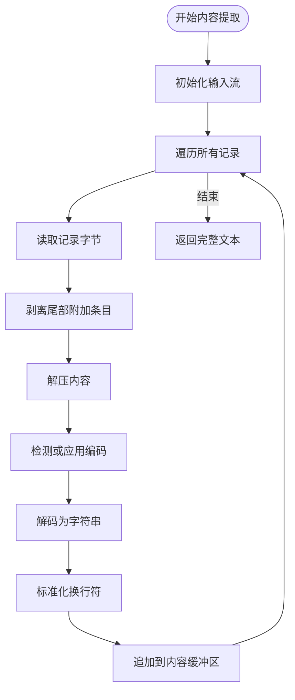

**图表来源** 
- [mobi.rs:456-526](file://rust/legado-book/src/mobi.rs#L456-L526)

**章节来源**
- [mobi.rs:456-526](file://rust/legado-book/src/mobi.rs#L456-L526)

### 章节分割与导航信息提取
- **职责**：基于书签表、TOC记录或特定标记进行章节切分
- **关键点**：
  - 书签表通常包含章节标题与偏移位置
  - TOC记录可能嵌套，需递归展开为线性章节列表
  - 若无显式书签，可尝试按段落或空行启发式切分
  - 支持多种分节策略：NCX优先、pagebreak标记、正则匹配
- **复杂度**：O(C)，C为书签或TOC条目数量

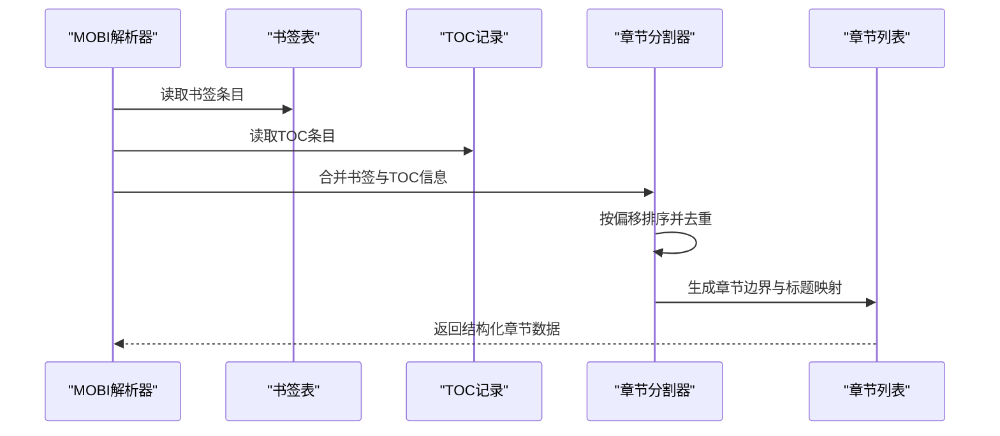

**图表来源** 
- [mobi.rs:1449-1598](file://rust/legado-book/src/mobi.rs#L1449-L1598)

**章节来源**
- [mobi.rs:1449-1598](file://rust/legado-book/src/mobi.rs#L1449-L1598)

### 图片处理
- **职责**：提取内嵌图片资源，转换为通用格式（如PNG/JPEG）
- **关键点**：
  - 图片资源通常以独立记录存在，含类型与数据偏移
  - 需识别原始格式并转码为前端可渲染格式
  - 大图应进行缩放或懒加载以提升性能
  - 支持封面图片和缩略图提取
- **复杂度**：O(I)，I为图片记录数量

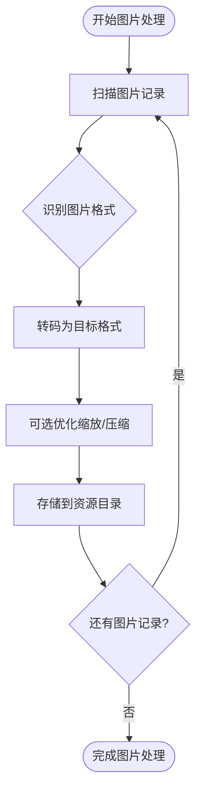

**图表来源** 
- [mobi.rs:529-545](file://rust/legado-book/src/mobi.rs#L529-L545)

**章节来源**
- [mobi.rs:529-545](file://rust/legado-book/src/mobi.rs#L529-L545)

## 依赖关系分析
MOBI解析模块依赖Rust标准库进行IO与编码处理，同时通过legado-book的统一接口被上层调用。外部依赖较少，便于移植与维护。

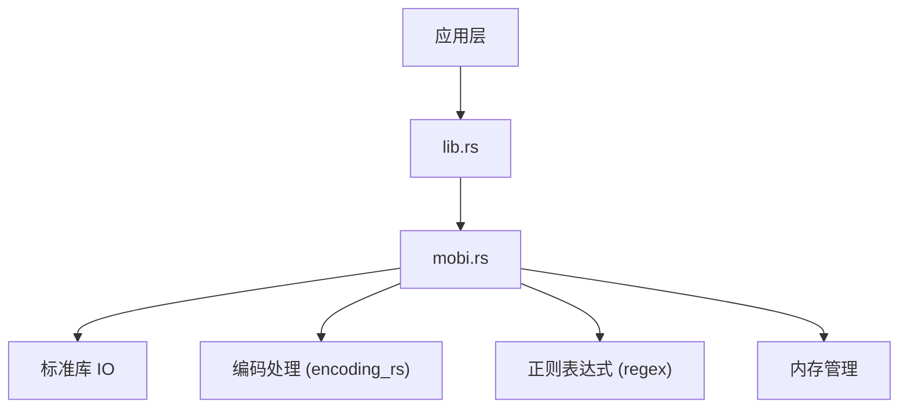

**图表来源** 
- [mobi.rs](file://rust/legado-book/src/mobi.rs)
- [lib.rs](file://rust/legado-book/src/lib.rs)
- [Cargo.toml](file://rust/legado-book/Cargo.toml)

**章节来源**
- [Cargo.toml](file://rust/legado-book/Cargo.toml)

## 性能考虑
- **流式处理**：对大文件采用流式读取，避免一次性加载全部字节
- **编码检测**：优先使用BOM或已知编码，减少误判开销
- **缓存策略**：对频繁访问的元数据（如TOC）进行内存缓存
- **并行处理**：图片转码可并行执行，提升吞吐
- **内存限制**：设置最大缓冲大小，防止OOM
- **HUFF/CDIC优化**：使用UnsafeCell避免递归时的借用冲突
- **深度护栏**：防止恶意文件的无限递归导致栈溢出
- **增量解压**：按需解压文本记录，避免全量加载

## 故障排查指南
- **格式错误**：魔数无效或头部损坏时抛出明确错误，建议回退到备用解析路径
- **编码异常**：文本乱码时尝试多编码切换，并记录失败日志
- **书签缺失**：无书签时启用启发式切分，并提示用户手动调整
- **DRM保护**：检测到DRM标志时拒绝解析或仅提取元数据
- **图片损坏**：跳过损坏图片并记录警告，不影响主内容
- **HUFF/CDIC错误**：检查码表和字典完整性，验证比特流对齐
- **INDX解析失败**：验证TAGX标签定义和CNCX字符串表完整性
- **KF8拼装问题**：检查Skeleton和Fragment的偏移计算是否正确
- **嵌套过深**：HUFF/CDIC深度超过32层时主动报错，防止栈溢出

**章节来源**
- [mobi.rs](file://rust/legado-book/src/mobi.rs)

## 结论
Legado的MOBI解析模块实现了从二进制结构到语义化内容的完整流水线，覆盖头部、数据库、扩展、内容、章节与图片等关键环节。通过分层设计与健壮的错误处理，能够稳定处理多种MOBI变体，并为上层阅读体验提供高质量的数据基础。

**重大更新** 本次增强使解析器从基础PalmDoc支持扩展到完整的MOBI/KF8/AZW3格式处理，新增了HUFF/CDIC压缩算法、INDX索引系统和NCX导航XML处理等核心功能，大幅提升了兼容性和性能，达到了与原始Kotlin实现的功能对等。

## 附录
- **术语表**：
  - MobiHeader：MOBI文件头部结构，包含版本、压缩、记录数等
  - PalmDoc：Palm OS使用的数据库格式，MOBI基于此结构
  - EXTH：Kindle扩展头，包含元数据与DRM信息
  - TOC：目录表，用于章节导航
  - HUFF/CDIC：高级压缩算法，compression=17480
  - INDX：索引系统，包含TAGX和CNCX
  - NCX：导航XML，用于章节层次结构
  - KF8：Kindle Format 8，AZW3格式
  - Skeleton：KF8骨架结构
  - Fragment：KF8内容片段

- **参考实现**：详见mobi.rs中的各解析函数与数据结构定义

- **测试覆盖**：包含完整的单元测试，覆盖HUFF/CDIC解压、INDX解析、NCX导航、KF8双格式处理等核心功能

**章节来源**
- [mobi.rs](file://rust/legado-book/src/mobi.rs)
</docs>