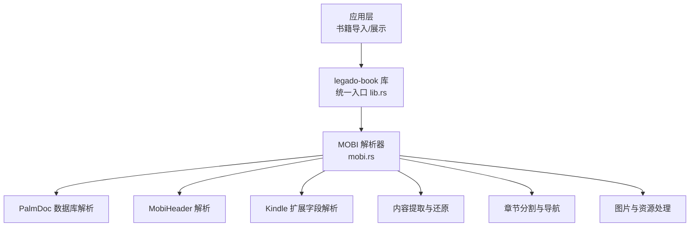
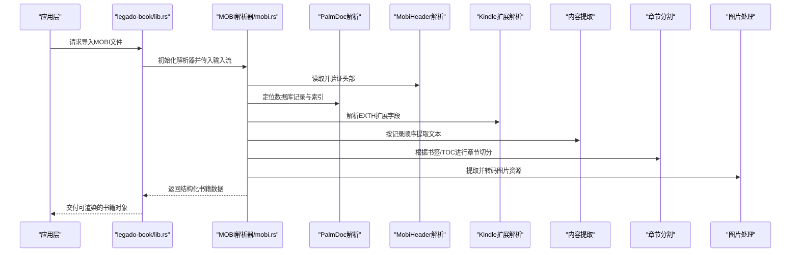
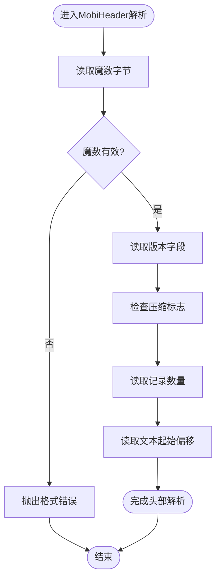
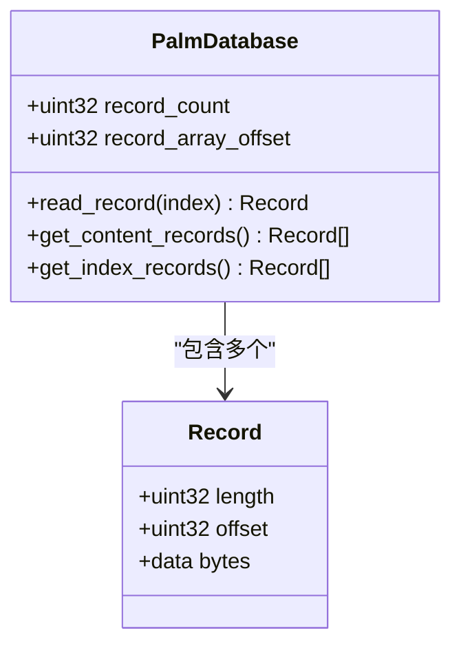
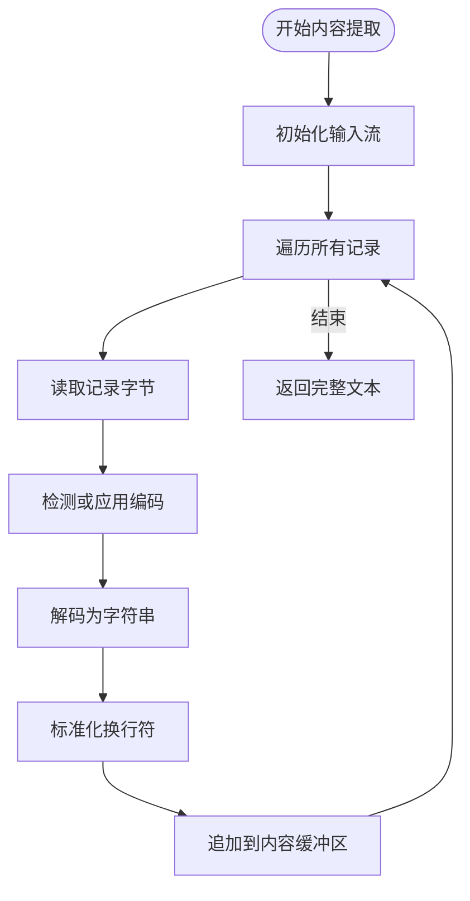
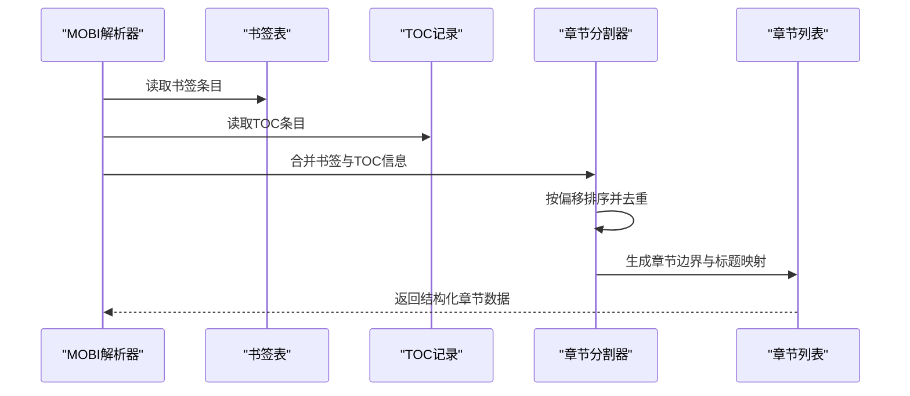
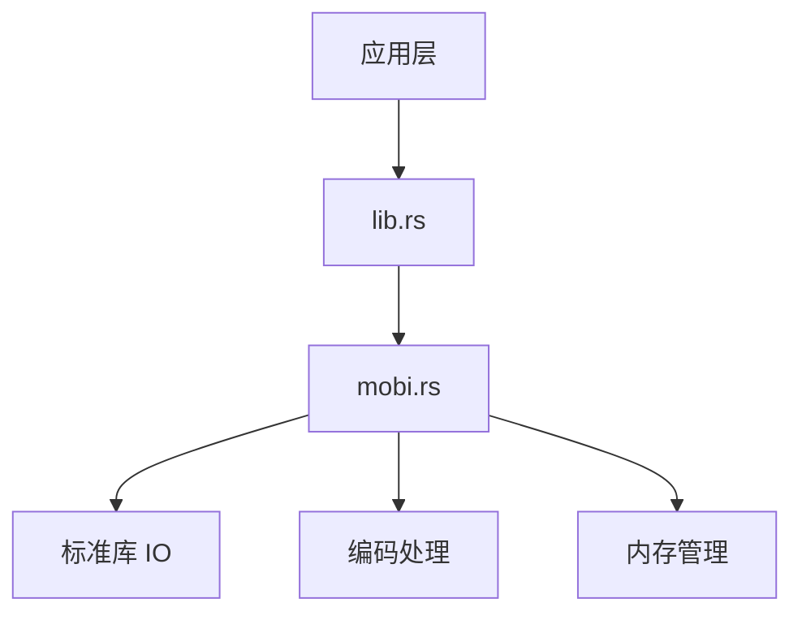

# MOBI格式处理

<cite>
**本文档引用的文件**   
- [mobi.rs](file://rust/legado-book/src/mobi.rs)
- [lib.rs](file://rust/legado-book/src/lib.rs)
- [Cargo.toml](file://rust/legado-book/Cargo.toml)
</cite>

## 目录
1. [简介](#简介)
2. [项目结构](#项目结构)
3. [核心组件](#核心组件)
4. [架构总览](#架构总览)
5. [详细组件分析](#详细组件分析)
6. [依赖关系分析](#依赖关系分析)
7. [性能考虑](#性能考虑)
8. [故障排查指南](#故障排查指南)
9. [结论](#结论)
10. [附录](#附录)

## 简介
本文件面向Legado项目中MOBI格式的处理能力，系统性解析MOBI文件的结构与实现细节。内容涵盖：
- MOBI文件结构：MobiHeader、PalmDoc数据库与Kindle扩展字段
- 内容提取算法：二进制解析、文本还原、图片处理
- 章节分割逻辑：书签识别、章节标记、导航信息提取
- MOBI特有功能支持：DRM保护、注释标注、阅读进度
- 转换与处理最佳实践：编码、流式处理、错误恢复与兼容性

## 项目结构
本项目在Rust子模块中提供MOBI解析能力，核心位于legado-book库的mobi模块。该模块对外暴露统一的导入接口，供上层业务（如书籍导入、元数据提取、章节构建）调用。

**图表来源** 
- [lib.rs](file://rust/legado-book/src/lib.rs)
- [mobi.rs](file://rust/legado-book/src/mobi.rs)

**章节来源**
- [lib.rs](file://rust/legado-book/src/lib.rs)
- [mobi.rs](file://rust/legado-book/src/mobi.rs)

## 核心组件
- MobiHeader解析器：读取MOBI头部标识、版本、压缩标志、记录数量等关键元数据
- PalmDoc数据库解析器：基于Palm OS数据库结构定位内容记录、索引记录与元数据记录
- Kindle扩展解析器：解析EXTH头中的标题、作者、语言、版权、DRM信息等
- 内容提取器：按记录偏移顺序读取并拼接文本，处理编码与换行
- 章节分割器：依据书签表、TOC记录或特定标记进行章节切分
- 图片处理器：提取内嵌图片资源，转换为通用格式以便渲染

**章节来源**
- [mobi.rs](file://rust/legado-book/src/mobi.rs)

## 架构总览
MOBI解析采用分层设计：底层负责二进制流读取与校验，中层负责结构体映射与字段解码，上层负责语义化组装（章节、元数据、图片）。

**图表来源** 
- [lib.rs](file://rust/legado-book/src/lib.rs)
- [mobi.rs](file://rust/legado-book/src/mobi.rs)

## 详细组件分析

### MobiHeader解析
- 职责：读取MOBI文件头，识别魔数、版本、压缩方式、记录计数、文本偏移等
- 关键点：
  - 魔数字节校验确保文件格式正确性
  - 版本字段决定后续解析策略（如是否包含EXTH）
  - 压缩标志影响内容记录的解压流程
- 复杂度：O(1)读取固定长度头部；后续处理取决于记录数量

**图表来源** 
- [mobi.rs](file://rust/legado-book/src/mobi.rs)

**章节来源**
- [mobi.rs](file://rust/legado-book/src/mobi.rs)

### PalmDoc数据库解析
- 职责：基于Palm DB结构定位内容记录、索引记录与元数据记录
- 关键点：
  - 数据库头包含记录数量、记录数组偏移
  - 每条记录含长度与偏移，需顺序读取以构建内容序列
  - 索引记录用于快速定位章节或关键词
- 复杂度：O(N)遍历记录，N为记录数量

**图表来源** 
- [mobi.rs](file://rust/legado-book/src/mobi.rs)

**章节来源**
- [mobi.rs](file://rust/legado-book/src/mobi.rs)

### Kindle扩展解析（EXTH）
- 职责：解析EXTH头中的元数据，如标题、作者、语言、版权、DRM标志等
- 关键点：
  - EXTH头后跟随若干键值对，常见键包括标题、作者、ISBN、语言、DRM等
  - DRM标志位指示是否需要解密或跳过敏感内容
  - 部分键可能缺失或为空，需做容错处理
- 复杂度：O(K)，K为EXTH条目数量

**图表来源** 
- [mobi.rs](file://rust/legado-book/src/mobi.rs)

**章节来源**
- [mobi.rs](file://rust/legado-book/src/mobi.rs)

### 内容提取与文本还原
- 职责：按记录顺序读取文本内容，处理编码与换行符
- 关键点：
  - 多数MOBI使用UTF-8或Windows-1252编码，需自动检测或配置
  - 换行符可能被压缩或特殊编码，需还原为标准换行
  - 大文件应使用流式读取避免内存峰值过高
- 复杂度：O(T)，T为文本字节总数

**图表来源** 
- [mobi.rs](file://rust/legado-book/src/mobi.rs)

**章节来源**
- [mobi.rs](file://rust/legado-book/src/mobi.rs)

### 章节分割与导航信息提取
- 职责：基于书签表、TOC记录或特定标记进行章节切分
- 关键点：
  - 书签表通常包含章节标题与偏移位置
  - TOC记录可能嵌套，需递归展开为线性章节列表
  - 若无显式书签，可尝试按段落或空行启发式切分
- 复杂度：O(C)，C为书签或TOC条目数量

**图表来源** 
- [mobi.rs](file://rust/legado-book/src/mobi.rs)

**章节来源**
- [mobi.rs](file://rust/legado-book/src/mobi.rs)

### 图片处理
- 职责：提取内嵌图片资源，转换为通用格式（如PNG/JPEG）
- 关键点：
  - 图片资源通常以独立记录存在，含类型与数据偏移
  - 需识别原始格式并转码为前端可渲染格式
  - 大图应进行缩放或懒加载以提升性能
- 复杂度：O(I)，I为图片记录数量

**图表来源** 
- [mobi.rs](file://rust/legado-book/src/mobi.rs)

**章节来源**
- [mobi.rs](file://rust/legado-book/src/mobi.rs)

## 依赖关系分析
MOBI解析模块依赖Rust标准库进行IO与编码处理，同时通过legado-book的统一接口被上层调用。外部依赖较少，便于移植与维护。

**图表来源** 
- [mobi.rs](file://rust/legado-book/src/mobi.rs)
- [lib.rs](file://rust/legado-book/src/lib.rs)

**章节来源**
- [Cargo.toml](file://rust/legado-book/Cargo.toml)

## 性能考虑
- 流式处理：对大文件采用流式读取，避免一次性加载全部字节
- 编码检测：优先使用BOM或已知编码，减少误判开销
- 缓存策略：对频繁访问的元数据（如TOC）进行内存缓存
- 并行处理：图片转码可并行执行，提升吞吐
- 内存限制：设置最大缓冲大小，防止OOM

[本节为通用指导，不直接分析具体文件]

## 故障排查指南
- 格式错误：魔数无效或头部损坏时抛出明确错误，建议回退到备用解析路径
- 编码异常：文本乱码时尝试多编码切换，并记录失败日志
- 书签缺失：无书签时启用启发式切分，并提示用户手动调整
- DRM保护：检测到DRM标志时拒绝解析或仅提取元数据
- 图片损坏：跳过损坏图片并记录警告，不影响主内容

**章节来源**
- [mobi.rs](file://rust/legado-book/src/mobi.rs)

## 结论
Legado的MOBI解析模块实现了从二进制结构到语义化内容的完整流水线，覆盖头部、数据库、扩展、内容、章节与图片等关键环节。通过分层设计与健壮的错误处理，能够稳定处理多种MOBI变体，并为上层阅读体验提供高质量的数据基础。

[本节为总结性内容，不直接分析具体文件]

## 附录
- 术语表：
  - MobiHeader：MOBI文件头部结构，包含版本、压缩、记录数等
  - PalmDoc：Palm OS使用的数据库格式，MOBI基于此结构
  - EXTH：Kindle扩展头，包含元数据与DRM信息
  - TOC：目录表，用于章节导航
- 参考实现：详见mobi.rs中的各解析函数与数据结构定义

[本节为补充信息，不直接分析具体文件]