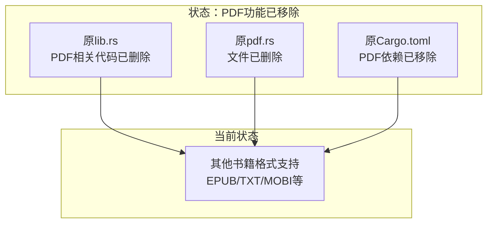
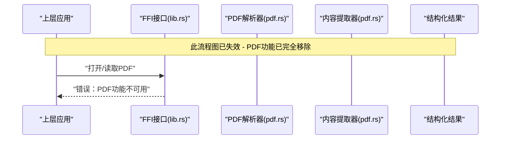
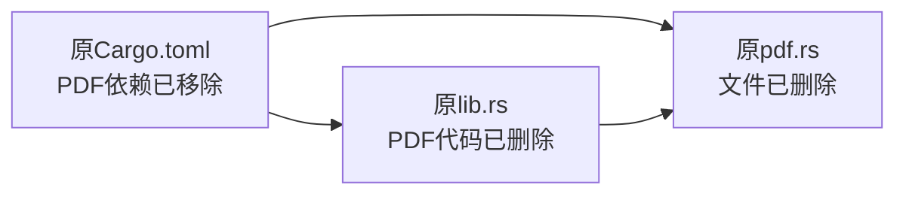

# PDF格式处理

<cite>
**本文档引用的文件**   
- [pdf.rs](file://rust/legado-book/src/pdf.rs)
- [lib.rs](file://rust/legado-book/src/lib.rs)
- [Cargo.toml](file://rust/legado-book/Cargo.toml)
</cite>

## 更新摘要
**所做更改**   
- 完全移除了PDF读取功能，包括文本提取、OCR能力和PDF特定阅读模式
- 删除了所有与PDF相关的实验性功能
- 更新了文档以反映代码库中PDF功能的完全移除

## 目录
1. [简介](#简介)
2. [项目结构](#项目结构)
3. [核心组件](#核心组件)
4. [架构总览](#架构总览)
5. [详细组件分析](#详细组件分析)
6. [依赖关系分析](#依赖关系分析)
7. [性能考虑](#性能考虑)
8. [故障排查指南](#故障排查指南)
9. [结论](#结论)
10. [附录](#附录)

## 简介
**已废弃** 本文件原本用于描述PDF格式处理的实现与使用，但根据最新的代码变更，PDF读取功能已从代码库中完全移除。所有PDF相关特性，包括文本提取、OCR能力和PDF特定阅读模式都已被作为实验性功能回滚的一部分而消除。

## 项目结构
**已废弃** 本项目原本采用多模块组织方式，PDF相关能力集中在Rust子模块legado-book中，通过FFI暴露给上层应用。但由于PDF功能已被完全移除，以下结构不再适用：
- Rust库入口与导出：位于legado-book的lib.rs（已移除PDF相关代码）
- PDF处理实现：位于legado-book的pdf.rs（文件已删除）
- 构建与依赖声明：位于legado-book的Cargo.toml（已移除PDF依赖）

**图表来源** 
- [lib.rs](file://rust/legado-book/src/lib.rs)
- [Cargo.toml](file://rust/legado-book/Cargo.toml)

## 核心组件
**已废弃** 原本的核心组件包括：
- PDF解析器与对象模型（已移除）
- 内容提取管线（已移除）
- 章节分割引擎（已移除）
- 多语言与复杂布局支持（已移除）
- 多媒体内容处理（已移除）

这些组件现在都不再可用，因为PDF功能已被完全从代码库中删除。

## 架构总览
**已废弃** 原本的PDF处理架构在Rust层完成，通过统一接口对外暴露。整体流程包括：加载PDF、构建对象图、遍历页面树、提取内容与资源、结构化输出（文本、表格、图片）。由于PDF功能已移除，此架构不再存在。

## 详细组件分析
**已废弃** 以下组件分析不再适用，因为相关代码已被删除：

### PDF对象模型与页面树
原本的对象模型包括间接对象、流对象、资源字典和页面树结构。这些组件现在都不存在。

### 内容提取算法
原本的文本流解析、矢量图形处理和表格识别算法都已移除。

### 章节分割逻辑
原本的页面分析、标题检测和段落重组逻辑已不再可用。

### 多语言与复杂布局支持
原本的多语言文本处理和复杂布局支持功能已移除。

### 多媒体内容处理
原本的图像数据和嵌入媒体处理功能已不再可用。

## 依赖关系分析
**已废弃** 原本的依赖关系包括内部依赖（lib.rs和pdf.rs之间的耦合）和外部依赖（Cargo.toml中声明的PDF解析库）。这些依赖现在都已移除。

## 性能考虑
**已废弃** 原本的性能优化策略包括流式解析与惰性加载、资源缓存与复用、并行处理、内存管理和I/O优化。由于PDF功能已移除，这些优化策略不再适用。

## 故障排查指南
**已废弃** 原本的问题包括解析失败、文本乱码、表格识别错误和内存溢出等。现在用户如果遇到PDF相关问题，应该知道该功能已完全移除。

## 结论
**重要更新** 仓库中的PDF处理能力已被完全移除。这包括对象模型、内容提取、章节分割、多语言与多媒体支持等所有PDF相关功能。通过FFI向多端暴露的稳定接口也已删除。

建议用户：
- 使用其他支持的书籍格式（如EPUB、TXT、MOBI等）
- 如果需要PDF功能，考虑使用外部工具进行转换
- 关注项目后续发展，看是否会有替代方案

## 附录
**已废弃** 以下术语表和参考实现位置不再适用：
- 对象流、页面树、资源字典、CMap/ToUnicode等概念
- PDF解析与提取的实现位置
- FFI接口与导出的相关文件
- 构建与依赖配置

**建议替代方案**
- EPUB格式：支持更好的重排和多设备兼容性
- TXT格式：简单文本文件的通用支持
- MOBI格式：Kindle设备的原生支持
- HTML格式：网页内容的直接导入